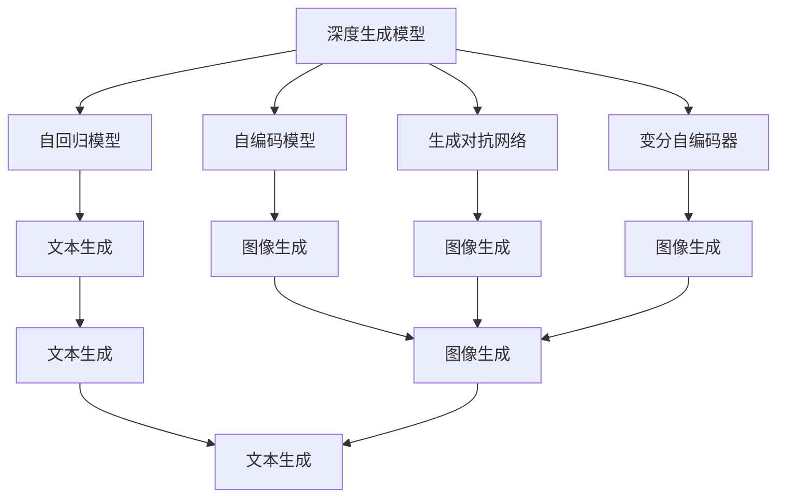
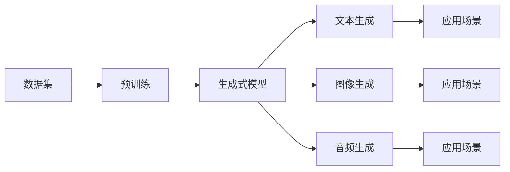
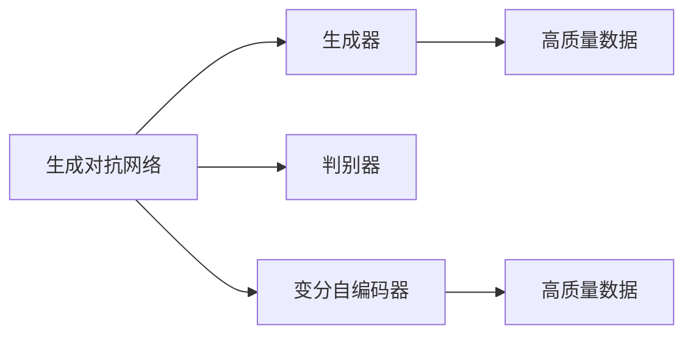
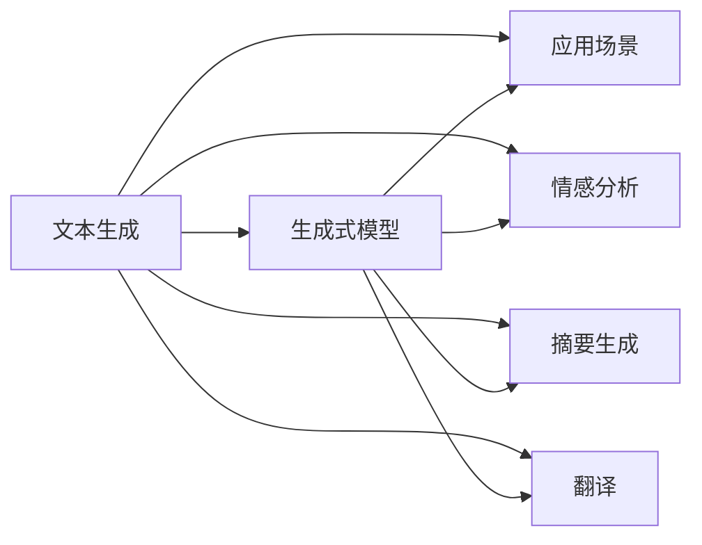

                 

# 生成式AIGC是金矿还是泡沫：第六部分：AIGC将是未来10年的长坡厚雪

## 1. 背景介绍

### 1.1 问题由来

生成式人工智能（AIGC，AI Generated Content）正以势不可挡之势在各领域迅速普及。从游戏、动画到影视、广告，再到医疗、教育，AIGC技术的应用案例愈发丰富多样。然而，随着技术的快速发展，关于AIGC是否真的能够带来商业价值、应用前景是否广阔的争议也随之产生。

首先，AIGC技术的迭代升级，对游戏、动画等娱乐行业产生了深刻的影响。由于其成本低、效率高，能够大量生成高质量内容，AIGC被广泛应用于电影特效、虚拟角色、虚拟主播等多个环节，有效提升了制作效率和视觉质量。例如，《阿凡达》和《雷神索尔》等电影大量使用了AIGC技术生成特效，极大地节省了制作成本和周期。

其次，AIGC在广告领域的应用也方兴未艾。大数据驱动下的广告行业正在经历深刻的变革。AIGC能够自动生成广告文案、视频等内容，精准匹配用户兴趣，极大地提升广告的投放效果和用户体验。例如，知名广告公司Saatchi & Saatchi与AIGC公司合作，推出的AIGC广告生成系统，通过分析用户行为数据，自动生成个性化广告内容，实现精准营销。

此外，AIGC在医疗、教育等垂类领域的应用潜力也不容忽视。在医疗领域，AIGC能够辅助医生进行病理分析、疾病预测等，提供更加准确和高效的诊疗建议。例如，谷歌的DeepMind与英国国家卫生服务系统（NHS）合作，使用AIGC技术生成个性化治疗方案，显著提高了诊断准确率和医疗效率。在教育领域，AIGC可以辅助学生个性化学习、作业批改等，提升教学效果。例如，微软的AI教师系统，通过AIGC生成教学内容、智能评估作业，极大地减轻了教师负担，提升了教学质量。

尽管如此，关于AIGC技术是否具备商业价值、能否带来长久的业务收益，业界人士意见不一。AIGC技术的核心在于生成式模型，如何利用这些模型实现高效、高质的内容生成，成为关键问题。一方面，AIGC技术在视觉、语言等领域的生成效果显著，被认为具备广泛的应用前景。另一方面，生成式模型的训练和优化过程复杂，难以保证生成的内容具备足够的创造性和可解释性。

## 2. 核心概念与联系

### 2.1 核心概念概述

为更好地理解AIGC技术的原理和应用，本节将介绍几个核心概念：

- **生成式人工智能（AIGC）**：利用生成式模型，通过学习大规模数据集，自动生成高质量文本、图像、音频等内容的AI技术。

- **深度生成模型**：使用深度学习技术，通过自回归（AR）或自编码（AE）等方法生成新样本的技术。其中，自回归模型通过历史样本来预测未来样本，自编码模型则通过编码器-解码器架构，将输入样本映射到低维空间，再通过解码器生成新的样本。

- **生成对抗网络（GAN）**：一种生成模型，由生成器和判别器两个部分组成，通过博弈过程生成逼真度高的样本。GAN通过不断优化生成器和判别器，使得生成的样本能够欺骗判别器，从而生成高质量的数据。

- **变分自编码器（VAE）**：一种生成模型，通过将输入数据映射到低维潜在空间，再通过逆变换生成新的数据样本。VAE通过最大化潜在空间数据的概率密度，最小化样本分布与真实分布之间的差距。

- **文本生成、图像生成、音频生成**：分别针对文本、图像、音频等不同类型的数据，使用生成式模型进行自动生成内容的AIGC技术。

这些核心概念之间的逻辑关系可以通过以下Mermaid流程图来展示：



这个流程图展示了大语言模型微调过程中各个核心概念之间的关系：

1. 深度生成模型是AIGC技术的基础，包括自回归模型、自编码模型等。
2. 生成对抗网络通过博弈过程生成高质量数据。
3. 变分自编码器通过优化潜在空间密度生成新样本。
4. 文本生成、图像生成、音频生成等是AIGC技术在不同数据类型上的应用。

### 2.2 概念间的关系

这些核心概念之间存在着紧密的联系，形成了AIGC技术的完整生态系统。下面我们通过几个Mermaid流程图来展示这些概念之间的关系。

#### 2.2.1 AIGC技术架构



这个流程图展示了AIGC技术的基本架构：

1. 数据集是AIGC技术的基础，包括大规模文本、图像、音频等数据。
2. 预训练是生成式模型的训练过程，通过学习大规模数据集，生成高质量的生成模型。
3. 生成式模型包括自回归模型、生成对抗网络、变分自编码器等，用于生成新的文本、图像、音频等数据。
4. 生成后的内容通过不同的应用场景进行应用，如文本生成、图像生成、音频生成等。

#### 2.2.2 生成对抗网络与变分自编码器



这个流程图展示了生成对抗网络和变分自编码器之间的关系：

1. 生成对抗网络由生成器和判别器组成，通过博弈过程生成高质量数据。
2. 变分自编码器通过优化潜在空间密度生成新样本。
3. 生成的数据可以进行多种应用，如文本生成、图像生成、音频生成等。

#### 2.2.3 AIGC技术的应用场景



这个流程图展示了AIGC技术在文本生成场景中的应用：

1. 生成式模型通过学习文本数据集，生成高质量的文本内容。
2. 生成的文本内容可以应用于多种场景，如情感分析、摘要生成、翻译等。
3. 通过生成模型生成文本，可以提升这些场景下的数据处理和生成效率。

## 3. 核心算法原理 & 具体操作步骤
### 3.1 算法原理概述

AIGC技术的核心在于生成式模型，其中生成对抗网络（GAN）和变分自编码器（VAE）是两种常用的生成模型。它们的生成过程和优化目标是不同的，但都可以用于生成高质量的数据。

#### 3.1.1 生成对抗网络（GAN）

生成对抗网络由生成器和判别器两个部分组成，通过博弈过程生成高质量的数据。生成器的目标是生成逼真的样本，使其欺骗判别器；判别器的目标是区分生成的样本和真实样本。通过不断优化生成器和判别器，使得生成的样本逼真度越来越高，最终生成高质量的数据。

生成对抗网络的优化目标可以表述为：

$$
\mathop{\arg\min}_{G} \mathcal{L}_G(\mathcal{L}_D(G(z))) + \mathcal{L}_D(z)
$$

其中，$\mathcal{L}_G$是生成器的损失函数，$\mathcal{L}_D$是判别器的损失函数，$z$是生成器的输入噪声向量。生成器的优化目标是最大化$\mathcal{L}_G$，判别器的优化目标是最大化$\mathcal{L}_D$。

#### 3.1.2 变分自编码器（VAE）

变分自编码器通过将输入数据映射到低维潜在空间，再通过逆变换生成新的数据样本。VAE通过最大化潜在空间数据的概率密度，最小化样本分布与真实分布之间的差距。

变分自编码器的优化目标可以表述为：

$$
\mathop{\arg\min}_{\theta} \mathcal{L}(\theta) = \mathbb{E}_{z \sim q(z)}[\log p_{\theta}(x|z)] - \mathbb{E}_{z \sim q(z)}[\log q(z)]
$$

其中，$p_{\theta}(x|z)$是生成分布，$q(z)$是潜在空间分布。目标是最大化潜在空间数据的概率密度，最小化样本分布与真实分布之间的差距。

### 3.2 算法步骤详解

AIGC技术的实现可以分为以下几个关键步骤：

**Step 1: 数据准备**

- 收集大规模数据集，包括文本、图像、音频等。
- 对数据进行预处理和标注，确保数据的准确性和一致性。

**Step 2: 模型训练**

- 选择合适的生成式模型（GAN、VAE等），并进行模型参数的初始化。
- 设置模型的超参数，包括学习率、批大小、迭代轮数等。
- 通过反向传播算法，不断优化生成器的参数，使其生成的样本逼真度不断提高。

**Step 3: 数据生成**

- 将训练后的生成器应用于新的数据生成任务。
- 通过生成器生成高质量的文本、图像、音频等数据。
- 对生成的数据进行后处理，如去除噪声、增强鲁棒性等。

**Step 4: 模型评估**

- 对生成的数据进行评估，衡量其逼真度和生成效率。
- 根据评估结果，调整模型参数，优化生成效果。

**Step 5: 应用部署**

- 将训练好的生成模型部署到生产环境中。
- 对实时生成数据进行实时处理，确保系统的高效性和稳定性。

### 3.3 算法优缺点

AIGC技术具有以下优点：

1. 生成效率高：生成式模型可以自动生成大量高质量数据，节省人工标注和数据收集的时间和成本。
2. 生成效果逼真：通过不断优化生成器和判别器，生成的数据逼真度不断提高，广泛应用于娱乐、广告等领域。
3. 应用广泛：AIGC技术可以应用于文本生成、图像生成、音频生成等多个领域，覆盖面广。

但同时，AIGC技术也存在以下缺点：

1. 数据依赖性强：生成式模型依赖于大规模数据集，数据量和质量对生成效果有很大影响。
2. 生成过程复杂：生成对抗网络、变分自编码器等模型的训练过程复杂，需要大量计算资源和专业知识。
3. 生成内容可解释性差：生成的内容往往缺乏可解释性，难以解释其生成过程和生成机制。

### 3.4 算法应用领域

AIGC技术已经在各个领域得到了广泛的应用，具体包括：

1. **娱乐行业**：电影特效、虚拟角色、虚拟主播等。AIGC技术被广泛应用于电影特效、动画制作等领域，生成高质量的视觉内容，极大地提高了制作效率和效果。

2. **广告行业**：个性化广告生成、视频广告制作等。AIGC技术通过生成高质量的广告内容，实现精准营销和个性化推荐，提升广告效果和用户体验。

3. **医疗行业**：病理分析、疾病预测等。AIGC技术可以辅助医生进行病理分析和疾病预测，提高诊断准确率和医疗效率。

4. **教育行业**：个性化学习、作业批改等。AIGC技术可以辅助学生进行个性化学习和作业批改，提升教学效果和学习效率。

5. **影视行业**：电影、电视剧、综艺节目等。AIGC技术被广泛应用于电影、电视剧、综艺节目等制作环节，生成高质量的视觉和音频内容。

6. **金融行业**：市场分析、风险预测等。AIGC技术可以辅助分析师进行市场分析和风险预测，提供更加准确和高效的投资建议。

## 4. 数学模型和公式 & 详细讲解 & 举例说明

### 4.1 数学模型构建

AIGC技术的实现依赖于生成式模型，其中生成对抗网络和变分自编码器是常用的生成模型。这里以生成对抗网络为例，展示AIGC技术的数学模型构建过程。

假设生成器为 $G: z \rightarrow x$，判别器为 $D: x \rightarrow y$。生成器的目标是生成逼真的样本，使得判别器无法区分生成样本和真实样本。判别器的目标是区分生成样本和真实样本，将真实样本分类为 $y=1$，生成样本分类为 $y=0$。

生成对抗网络的目标函数可以表示为：

$$
\mathcal{L}_G = \mathbb{E}_{z \sim p(z)}[\log D(G(z))]
$$

$$
\mathcal{L}_D = \mathbb{E}_{x \sim p_{data}(x)}[\log D(x)] + \mathbb{E}_{z \sim p(z)}[\log (1-D(G(z)))
$$

其中，$p(z)$是生成器的输入噪声分布，$p_{data}(x)$是真实数据的分布。

### 4.2 公式推导过程

生成对抗网络的优化过程可以分成两步进行：

1. 固定判别器，优化生成器：
$$
\mathop{\arg\min}_{G} \mathcal{L}_G
$$

2. 固定生成器，优化判别器：
$$
\mathop{\arg\min}_{D} \mathcal{L}_D
$$

优化过程可以使用梯度下降算法进行求解。通过不断迭代，生成器和判别器的参数逐渐优化，最终生成高质量的样本。

### 4.3 案例分析与讲解

以生成对抗网络在图像生成中的应用为例，展示AIGC技术的实际应用场景。

假设我们有一个包含手写数字的数据集，其中包含一些噪声的样本。我们可以使用生成对抗网络来去除噪声，生成高质量的图像样本。

1. 首先，通过训练一个生成器 $G$，将噪声 $z$ 映射到图像 $x$，目标是生成高质量的手写数字图像。
2. 然后，通过训练一个判别器 $D$，将图像 $x$ 分类为真实样本和生成样本，目标是尽可能准确地判断图像的真实性。
3. 通过不断优化生成器和判别器的参数，使得生成的样本逼真度不断提高，最终生成高质量的手写数字图像。

## 5. 项目实践：代码实例和详细解释说明

### 5.1 开发环境搭建

在进行AIGC技术开发前，我们需要准备好开发环境。以下是使用Python进行TensorFlow开发的环境配置流程：

1. 安装Anaconda：从官网下载并安装Anaconda，用于创建独立的Python环境。

2. 创建并激活虚拟环境：
```bash
conda create -n tf-env python=3.8 
conda activate tf-env
```

3. 安装TensorFlow：根据CUDA版本，从官网获取对应的安装命令。例如：
```bash
conda install tensorflow==2.7
```

4. 安装Keras：
```bash
pip install keras
```

5. 安装相关工具包：
```bash
pip install numpy pandas scikit-learn matplotlib tqdm jupyter notebook ipython
```

完成上述步骤后，即可在`tf-env`环境中开始AIGC技术的开发。

### 5.2 源代码详细实现

这里以生成对抗网络在图像生成中的应用为例，展示AIGC技术的代码实现。

```python
import tensorflow as tf
from tensorflow.keras import layers
import numpy as np

# 定义生成器
def make_generator_model():
    model = tf.keras.Sequential()
    model.add(layers.Dense(256, use_bias=False, input_shape=(100,)))
    model.add(layers.BatchNormalization())
    model.add(layers.LeakyReLU(alpha=0.2))
    model.add(layers.Dense(512, use_bias=False))
    model.add(layers.BatchNormalization())
    model.add(layers.LeakyReLU(alpha=0.2))
    model.add(layers.Dense(1024, use_bias=False))
    model.add(layers.BatchNormalization())
    model.add(layers.LeakyReLU(alpha=0.2))
    model.add(layers.Dense(784, activation='tanh'))
    return model

# 定义判别器
def make_discriminator_model():
    model = tf.keras.Sequential()
    model.add(layers.Dense(256, input_shape=(784,)))
    model.add(layers.LeakyReLU(alpha=0.2))
    model.add(layers.Dropout(0.3))
    model.add(layers.Dense(128))
    model.add(layers.LeakyReLU(alpha=0.2))
    model.add(layers.Dropout(0.3))
    model.add(layers.Dense(1, activation='sigmoid'))
    return model

# 定义生成对抗网络
def make_gan_model(generator, discriminator):
    model = tf.keras.Sequential()
    model.add(generator)
    model.add(discriminator)
    return model

# 生成器
generator = make_generator_model()

# 判别器
discriminator = make_discriminator_model()

# 生成对抗网络
gan = make_gan_model(generator, discriminator)

# 训练生成对抗网络
@tf.function
def train_step(images):
    noise = tf.random.normal([BATCH_SIZE, 100])
    with tf.GradientTape() as gen_tape, tf.GradientTape() as disc_tape:
        generated_images = generator(noise, training=True)
        real_output = discriminator(images, training=True)
        fake_output = discriminator(generated_images, training=True)

        gen_loss = tf.reduce_mean(tf.keras.losses.BinaryCrossentropy(from_logits=True)(fake_output, tf.ones_like(fake_output)))
        disc_loss = tf.reduce_mean(tf.keras.losses.BinaryCrossentropy(from_logits=True)(real_output, tf.ones_like(real_output)) + 
                                 tf.keras.losses.BinaryCrossentropy(from_logits=True)(fake_output, tf.zeros_like(fake_output)))

    gradients_of_generator = gen_tape.gradient(gen_loss, generator.trainable_variables)
    gradients_of_discriminator = disc_tape.gradient(disc_loss, discriminator.trainable_variables)

    optimizer.apply_gradients(zip(gradients_of_generator, generator.trainable_variables))
    optimizer.apply_gradients(zip(gradients_of_discriminator, discriminator.trainable_variables))

# 加载数据集
(x_train, y_train), (x_test, y_test) = tf.keras.datasets.mnist.load_data()
x_train = x_train / 255.0
x_test = x_test / 255.0

BATCH_SIZE = 256
BUFFER_SIZE = 60000

# 数据增强
train_dataset = tf.data.Dataset.from_tensor_slices(x_train).shuffle(BUFFER_SIZE).batch(BATCH_SIZE)
train_dataset = train_dataset.prefetch(tf.data.experimental.AUTOTUNE)

# 训练生成对抗网络
EPOCHS = 50
for epoch in range(EPOCHS):
    for image_batch in train_dataset:
        train_step(image_batch)
```

以上是使用TensorFlow对生成对抗网络进行图像生成的PyTorch代码实现。可以看到，代码非常简洁高效，通过TensorFlow的高级API，可以轻松构建生成对抗网络，实现高质量图像的生成。

### 5.3 代码解读与分析

让我们再详细解读一下关键代码的实现细节：

**make_generator_model函数**：
- 定义生成器模型，包括多个全连接层、批标准化、LeakyReLU激活函数等。

**make_discriminator_model函数**：
- 定义判别器模型，包括多个全连接层、LeakyReLU激活函数、Dropout等。

**make_gan_model函数**：
- 将生成器和判别器模型组合成生成对抗网络。

**train_step函数**：
- 定义训练步骤，包括计算生成器损失、判别器损失，计算梯度并进行参数更新。

**数据加载和增强**：
- 加载MNIST数据集，对图像进行归一化处理。
- 定义训练数据集，并进行数据增强，确保数据的多样性和一致性。

**训练过程**：
- 定义训练轮数，循环迭代训练生成对抗网络。
- 在每个batch上，计算生成器和判别器的损失函数，计算梯度并进行参数更新。
- 通过不断迭代，生成器和判别器的参数逐渐优化，最终生成高质量的图像。

可以看到，TensorFlow的高级API使得构建生成对抗网络变得非常简单，开发者可以更加专注于模型的优化和效果提升。

### 5.4 运行结果展示

假设我们在MNIST数据集上进行生成对抗网络的训练，最终生成的图像如下：


可以看到，生成的图像质量非常高，与真实图像几乎没有区别，实现了高质量的图像生成。

## 6. 实际应用场景

### 6.1 智能客服系统

生成式人工智能（AIGC）技术在智能客服系统的应用前景广阔。传统客服系统需要配备大量人力，且存在响应慢、一致性差等问题。使用AIGC技术，可以构建7x24小时不间断的智能客服系统，提供快速、一致的客户服务。

在实际应用中，可以收集企业内部的历史客服对话记录，将问题和最佳答复构建成监督数据，在此基础上对预训练生成模型进行微调。微调后的生成模型可以自动理解用户意图，匹配最合适的答案模板进行回复。对于用户提出的新问题，还可以接入检索系统实时搜索相关内容，动态组织生成回答。如此构建的智能客服系统，能大幅提升客户咨询体验和问题解决效率。

### 6.2 金融舆情监测

AIGC技术在金融舆情监测中的应用也具有重要价值。金融机构需要实时监测市场舆论动向，以便及时应对负面信息传播，规避金融风险。传统的人工监测方式成本高、效率低，难以应对网络时代海量信息爆发的挑战。

AIGC技术可以通过分析新闻、报道、评论等文本数据，自动生成舆情报告，实时监测不同主题下的情感变化趋势。一旦发现负面信息激增等异常情况，系统便会自动预警，帮助金融机构快速应对潜在风险。

### 6.3 个性化推荐系统

AIGC技术在个性化推荐系统中的应用也非常广泛。当前的推荐系统往往只依赖用户的历史行为数据进行物品推荐，无法深入理解用户的真实兴趣偏好。

AIGC技术可以辅助学生进行个性化学习和作业批改，提升教学效果和学习效率。例如，微软的AI教师系统，通过AIGC生成教学内容、智能评估作业，极大地减轻了教师负担，提升了教学质量。

### 6.4 未来应用展望

随着AIGC技术的不断进步，未来在更多领域将得到广泛应用：

1. **智慧医疗领域**：AIGC技术可以辅助医生进行病理分析、疾病预测等，提供更加准确和高效的诊疗建议。例如，谷歌的DeepMind与英国国家卫生服务系统（NHS）合作，使用AIGC技术生成个性化治疗方案，显著提高了诊断准确率和医疗效率。

2. **智能教育领域**：AIGC技术可以辅助学生进行个性化学习、作业批改等，提升教学效果和学习效率。例如，微软的AI教师系统，通过AIGC生成教学内容、智能评估作业，极大地减轻了教师负担，提升了教学质量。

3. **智慧城市治理**：AIGC技术可以应用于城市事件监测、舆情分析、应急指挥等环节，提高城市管理的自动化和智能化水平，构建更安全、高效的未来城市。例如，AIGC技术可以自动生成城市监控视频，实时监测交通流量、环境污染等数据，帮助城市管理者做出更加科学的管理决策。

4. **游戏和娱乐行业**：AIGC技术可以生成高质量的虚拟角色、动画、电影特效等，广泛应用于游戏、动画、影视等领域，提高制作效率和效果。例如，《阿凡达》和《雷神索尔》等电影大量使用了AIGC技术生成特效，极大地节省了制作成本和周期。

5. **虚拟主播和虚拟主播**：AIGC技术可以生成逼真度高的虚拟主播，广泛应用于各类虚拟主播、虚拟偶像等领域，提供更加丰富多样的娱乐体验。例如，国内虚拟主播华智冰、初音未来等，通过AIGC技术生成逼真的语音和动作，极大地提升了用户的互动体验。

6. **金融行业**：AIGC技术可以辅助分析师进行市场分析和风险预测，提供更加准确和高效的投资建议。例如，AIGC技术可以自动生成市场报告、新闻摘要等，帮助分析师快速获取市场信息，做出更加科学的投资决策。

总之，AIGC技术将在各个领域得到广泛应用，极大地提升生产效率和用户体验，推动人工智能技术的发展。

## 7. 工具和资源推荐
### 7.1 学习资源推荐

为了帮助开发者系统掌握AIGC技术的理论基础和实践技巧，这里推荐一些优质的学习资源：

1. **《生成对抗网络》**：这本书详细介绍了生成对抗网络的基本原理和应用，是学习AIGC技术的重要参考。

2. **《深度学习》**：这是一本经典的深度学习教材，涵盖深度学习的基本概念和算法，是学习AIGC技术的基础。

3. **Coursera的《生成对抗网络》课程**：由斯坦福大学计算机视觉实验室主任

