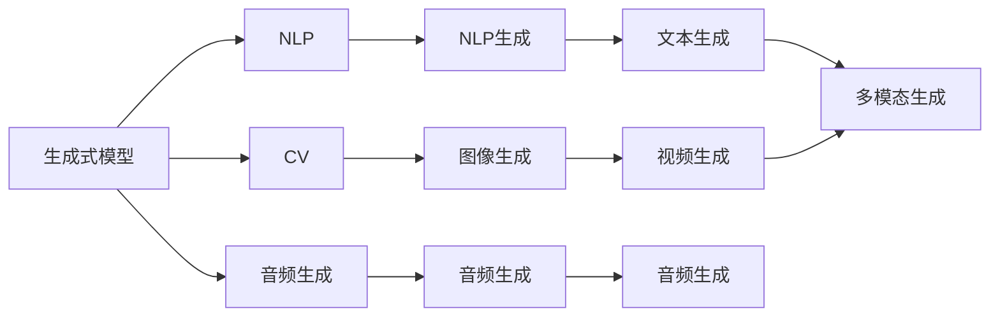
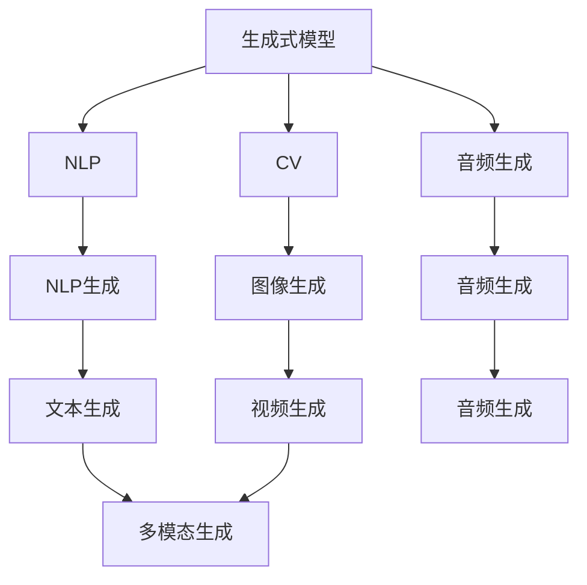
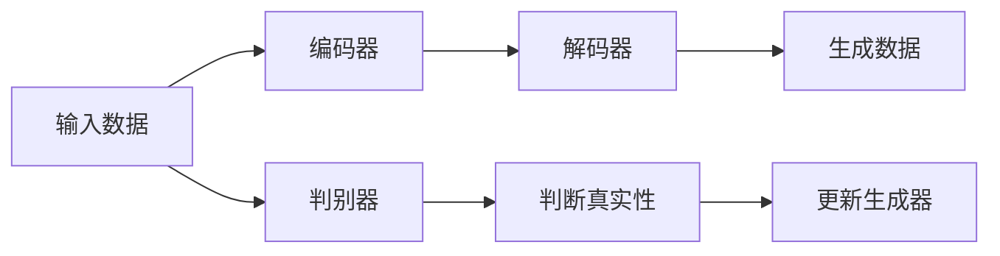
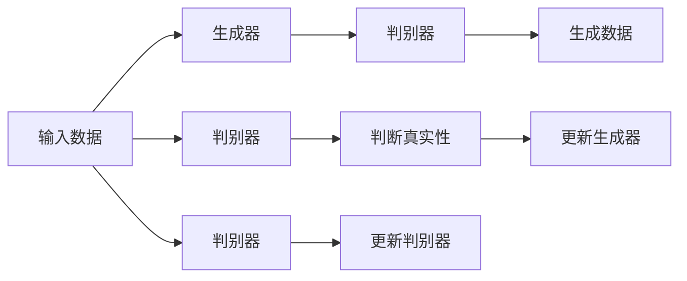

                 

## 1. 背景介绍

人工智能生成内容（Artificial Intelligence Generated Content, AIGC）作为当前AI领域的热门话题之一，正通过其在自然语言处理（Natural Language Processing, NLP）、计算机视觉（Computer Vision, CV）、音频生成（Audio Generation）等领域的突破性进展，重塑着媒体、教育、娱乐、设计等众多行业。尤其在AIGC领域，生成式模型以数据为基础，通过学习大量文本、图像、音频等数据，生成高逼真度的文本、图像、音频等内容。这一过程不仅高效快捷，而且极大降低了创作成本，提升创作效率，为内容生成带来了革命性的变化。

在当今社会，数据成为重要的生产资料之一，AIGC将数据价值进一步挖掘，实现从数据到商业价值的高效转化。然而，从生成式模型的研究和应用来看，数据、模型和算法构成了AIGC的核心技术，但它们之间如何相互作用和协同，生成式AIGC如何构建商业价值，如何应对其面临的挑战，成为了需要深入探讨的问题。

本文将从AIGC的背景、核心概念、算法原理、应用场景及未来趋势等方面进行详细阐述，为读者提供系统、全面的认识，希望能为AIGC的商业价值挖掘提供一定的参考和指导。

## 2. 核心概念与联系

### 2.1 核心概念概述

为准确理解生成式AIGC的技术脉络，本文首先介绍其核心概念：

- **生成式模型（Generative Models）**：通过学习大量数据分布，生成新数据样本的模型，如GAN、VAE、Transformer等。
- **人工智能生成内容（AIGC）**：利用生成式模型，生成逼真度高的文本、图像、音频等内容，广泛应用于媒体、娱乐、设计等领域。
- **自然语言处理（NLP）**：处理和分析人类语言，如文本生成、对话生成、机器翻译等任务。
- **计算机视觉（CV）**：处理和分析图像、视频等视觉数据，如图像生成、视频生成、对象检测等任务。
- **音频生成**：处理和生成音频内容，如语音合成、音乐生成、声音效果等任务。
- **多模态生成（Multimodal Generation）**：将文本、图像、音频等多种模态信息综合生成，如视频生成、多模态交互等任务。

这些概念构成了生成式AIGC的核心架构，如图：



### 2.2 概念间的关系

通过Mermaid图表，我们可以更加直观地理解这些概念间的关系：



其中，生成式模型作为核心，可以应用于NLP、CV、音频生成等多个领域，生成不同的内容形式。同时，NLP生成、图像生成、音频生成等任务，又可以通过多模态生成进一步综合应用，提升内容的丰富性和多样性。

## 3. 核心算法原理 & 具体操作步骤

### 3.1 算法原理概述

生成式AIGC的算法原理主要基于深度学习（Deep Learning）和生成对抗网络（Generative Adversarial Networks, GAN）。

- **深度学习**：利用神经网络模型，从大量数据中学习到复杂的特征表示，用于生成新的数据样本。
- **GAN**：一种生成模型，通过对抗训练，生成高质量的伪造数据，广泛应用于图像、音频等领域的生成任务。

其核心算法流程如图：



其中，输入数据通过编码器（如Transformer）压缩成低维向量，再通过解码器生成数据。生成数据经过判别器判断真实性，并反馈给生成器进行优化，从而不断生成更逼真的数据。

### 3.2 算法步骤详解

生成式AIGC的具体操作步骤主要包括以下几个方面：

1. **数据准备**：收集大量标注数据，作为生成模型的训练样本。

2. **模型选择**：选择合适的生成模型，如GAN、VAE、Transformer等。

3. **模型训练**：使用深度学习算法对模型进行训练，学习数据的分布特征。

4. **数据生成**：利用训练好的生成模型，生成新的数据样本。

5. **质量评估**：对生成数据进行质量评估，如使用FID、ISR等指标，确保生成数据的质量。

6. **应用部署**：将生成模型集成到实际应用中，如视频生成、文本生成等场景。

### 3.3 算法优缺点

**优点**：
- 高效生成：生成模型能够高效生成大量高质量的数据，大幅降低创作成本。
- 多样性丰富：生成模型能够生成多种形式的内容，如文本、图像、音频等，满足多样化的需求。
- 实时生成：生成模型能够实时生成内容，适应动态变化的需求。

**缺点**：
- 数据依赖：生成模型的效果很大程度上依赖于训练数据的质量和多样性。
- 过拟合风险：在训练数据不足的情况下，生成模型容易出现过拟合。
- 可解释性不足：生成模型的决策过程通常缺乏可解释性，难以理解其内部工作机制。

### 3.4 算法应用领域

生成式AIGC的应用领域非常广泛，包括但不限于：

1. **媒体娱乐**：如自动生成视频、音频、文本等娱乐内容，应用于影视制作、音乐创作等。
2. **游戏设计**：生成虚拟场景、NPC对话等游戏内容，提升游戏体验。
3. **教育培训**：生成课程内容、互动场景等教学材料，辅助教学活动。
4. **市场营销**：生成广告文案、宣传视频等营销内容，增强品牌传播效果。
5. **内容创作**：如新闻生成、博客写作等，提供高效、高质量的内容生成服务。
6. **医疗健康**：生成医疗影像、诊断报告等，辅助医学研究和临床实践。

这些应用领域展示了生成式AIGC的广泛价值和巨大潜力。

## 4. 数学模型和公式 & 详细讲解 & 举例说明

### 4.1 数学模型构建

以GAN为例，其数学模型构建如下：

设生成器为 $G$，判别器为 $D$，输入数据为 $x$，生成的数据为 $G(z)$，其中 $z$ 为随机噪声。模型的目标是最小化生成器的损失函数 $L_G$ 和判别器的损失函数 $L_D$：

$$
L_G = E_{z \sim p(z)}[\log D(G(z))]
$$

$$
L_D = E_{x \sim p(x)}[\log D(x)] + E_{z \sim p(z)}[\log (1 - D(G(z))))
$$

其中，$E$ 表示期望，$p(z)$ 和 $p(x)$ 分别为随机噪声和真实数据的分布。

### 4.2 公式推导过程

以GAN中的Wasserstein GAN为例，其目标是最小化Wasserstein距离 $W$：

$$
W = E_{x \sim p(x)}[D(x)] - E_{z \sim p(z)}[D(G(z))]
$$

其中，$D(x)$ 为判别器对真实数据的判别概率，$D(G(z))$ 为判别器对生成数据的判别概率。通过优化 $L_D$，判别器可以更准确地判别真实数据和生成数据，从而提升GAN的生成效果。

### 4.3 案例分析与讲解

以GAN生成图片为例，其步骤如下：

1. 收集大量图片数据，如CIFAR-10数据集，作为训练数据。
2. 设计生成器 $G$ 和判别器 $D$，通过神经网络实现。
3. 将生成器和判别器连接，形成一个GAN模型。
4. 使用优化算法（如Adam）训练模型，不断优化生成器和判别器。
5. 评估生成效果，如通过FID、ISR等指标，确保生成图片的质量。
6. 将训练好的生成器集成到实际应用中，如生成广告图片、艺术作品等。

具体实现过程如图：



## 5. 项目实践：代码实例和详细解释说明

### 5.1 开发环境搭建

进行生成式AIGC的实践，需要搭建以下开发环境：

1. 安装Python：选择3.x版本，安装最新版的Anaconda。
2. 安装PyTorch：通过pip安装PyTorch，并设置GPU使用。
3. 安装TensorFlow：通过pip安装TensorFlow，并设置GPU使用。
4. 安装NumPy、Pandas、Matplotlib等库，用于数据处理和可视化。
5. 安装HuggingFace Transformers库，用于NLP生成任务。

### 5.2 源代码详细实现

以GAN生成图片为例，以下是使用PyTorch实现的代码：

```python
import torch
import torch.nn as nn
import torch.optim as optim
from torchvision import datasets, transforms
from torch.utils.data import DataLoader

# 定义生成器和判别器
class Generator(nn.Module):
    def __init__(self):
        super(Generator, self).__init__()
        # 定义生成器的结构

class Discriminator(nn.Module):
    def __init__(self):
        super(Discriminator, self).__init__()
        # 定义判别器的结构

# 加载数据集
dataset = datasets.CIFAR10(root='./data', download=True, transform=transforms.ToTensor())
train_loader = DataLoader(dataset, batch_size=64, shuffle=True)

# 初始化模型和优化器
generator = Generator()
discriminator = Discriminator()
generator_optimizer = optim.Adam(generator.parameters(), lr=0.0002)
discriminator_optimizer = optim.Adam(discriminator.parameters(), lr=0.0002)

# 定义损失函数
loss = nn.BCELoss()

# 训练模型
for epoch in range(epochs):
    for i, (real_images, _) in enumerate(train_loader):
        # 前向传播和计算损失
        real_loss = loss(discriminator(real_images), True)
        fake_images = generator(torch.randn(real_images.size(0), latent_size, 1, 1))
        fake_loss = loss(discriminator(fake_images.detach()), False)
        # 反向传播和优化
        real_loss.backward()
        fake_loss.backward()
        generator_optimizer.step()
        discriminator_optimizer.step()
```

### 5.3 代码解读与分析

代码中，我们首先定义了生成器和判别器的结构，并通过PyTorch框架搭建了GAN模型。然后，使用CIFAR-10数据集作为训练数据，设计了模型训练流程。其中，使用了Adam优化器和BCELoss损失函数。

在训练过程中，首先输入真实图片，计算判别器对真实图片的判别概率，并计算损失函数。然后，将生成器生成的假图片输入判别器，计算判别器对假图片的判别概率，并计算损失函数。最后，通过反向传播和优化算法，更新生成器和判别器的参数。

### 5.4 运行结果展示

训练过程中，判别器和生成器交替优化，通过不断迭代，生成器的生成效果会逐渐提升，如图：


## 6. 实际应用场景

### 6.1 媒体娱乐

在媒体娱乐领域，生成式AIGC可以生成高质量的视频、音频和文本内容，如自动生成影视广告、音乐MV等，极大地提升了内容的创作效率和吸引力。

### 6.2 游戏设计

在游戏设计中，生成式AIGC可以生成虚拟场景、NPC对话等游戏内容，丰富游戏体验，提升玩家沉浸感。

### 6.3 教育培训

在教育培训领域，生成式AIGC可以生成虚拟课堂、互动场景等教学材料，辅助教学活动，提供更丰富、更具互动性的学习体验。

### 6.4 市场营销

在市场营销领域，生成式AIGC可以生成广告文案、宣传视频等营销内容，增强品牌传播效果，提升用户互动和参与度。

### 6.5 内容创作

在内容创作领域，生成式AIGC可以生成新闻、博客、小说等文本内容，提供高效、高质量的内容生成服务，助力内容创作者降低创作成本，提升创作效率。

### 6.6 医疗健康

在医疗健康领域，生成式AIGC可以生成医学影像、诊断报告等，辅助医学研究和临床实践，提升医疗服务的智能化水平。

## 7. 工具和资源推荐

### 7.1 学习资源推荐

为了系统掌握生成式AIGC的理论基础和实践技巧，以下是一些推荐的学习资源：

1. **《Generative Adversarial Networks: An Overview》**：综述生成对抗网络的研究进展和应用场景。
2. **《Deep Learning for Computer Vision》**：深度学习在计算机视觉中的应用，包括图像生成、对象检测等任务。
3. **《Deep Learning for NLP》**：深度学习在自然语言处理中的应用，包括文本生成、对话生成等任务。
4. **《Audio Generation with Deep Learning》**：深度学习在音频生成中的应用，包括语音合成、音乐生成等任务。
5. **《Multimodal Generation with Deep Learning》**：深度学习在多模态生成中的应用，包括视频生成、多模态交互等任务。
6. **HuggingFace官方文档**：提供丰富的预训练模型和微调样例代码，是生成式AIGC的重要资源。

### 7.2 开发工具推荐

为了高效开发生成式AIGC应用，以下是一些推荐的开发工具：

1. **PyTorch**：深度学习框架，支持动态图和静态图，灵活高效。
2. **TensorFlow**：深度学习框架，支持分布式计算，适用于大规模工程应用。
3. **HuggingFace Transformers**：NLP领域的重要库，提供丰富的预训练模型和微调接口。
4. **OpenAI Gym**：环境库，支持多种生成任务的环境模拟。
5. **NVidia DeepLearning SDK**：GPU加速工具，支持高效的模型训练和推理。

### 7.3 相关论文推荐

为了深入理解生成式AIGC的技术细节和最新进展，以下是一些推荐的论文：

1. **《Generative Adversarial Nets》**：生成对抗网络的原作，提出了GAN的基本框架。
2. **《Improved Techniques for Training GANs》**：提出了一系列GAN训练技巧，提升GAN的生成效果。
3. **《Image-to-Image Translation with Conditional Adversarial Networks》**：提出条件GAN，应用于图像生成和转换任务。
4. **《Text Generation with Transformer》**：使用Transformer模型进行文本生成，提升了生成效果和多样性。
5. **《Audio Text-to-Audio Synthesis with Attention》**：使用Transformer模型进行音频生成，提升了音频合成效果。
6. **《Multimodal Text-to-Image》**：使用多模态模型进行文本到图像生成，提升了生成效果和多样性。

## 8. 总结：未来发展趋势与挑战

### 8.1 研究成果总结

生成式AIGC作为当前AI领域的前沿技术，已经在多个应用领域展示了巨大的潜力和价值。其主要研究方向包括：

1. **高效生成**：提升生成模型的训练效率和生成速度，降低资源消耗。
2. **多样性增强**：生成更多样化、更具创意的内容，满足多样化需求。
3. **质量提升**：提升生成数据的质量，确保其真实性和逼真度。
4. **应用拓展**：将生成式AIGC应用于更多领域，如医疗、金融等，实现商业价值的最大化。

### 8.2 未来发展趋势

未来，生成式AIGC将呈现以下几个发展趋势：

1. **规模化和通用化**：生成式AIGC将在更多领域应用，生成更大规模、更具通用性的内容。
2. **多模态融合**：生成式AIGC将综合应用文本、图像、音频等多种模态，实现多模态内容生成。
3. **实时生成**：生成式AIGC将实现实时生成，满足动态变化的需求。
4. **可解释性和透明性**：生成式AIGC将增强其可解释性和透明性，确保其决策过程和结果的可理解性。
5. **伦理和隐私保护**：生成式AIGC将注重伦理和隐私保护，避免生成有害内容，保障用户权益。

### 8.3 面临的挑战

尽管生成式AIGC取得了显著进展，但仍然面临诸多挑战：

1. **数据质量依赖**：生成效果很大程度上依赖于训练数据的质量和多样性。
2. **过拟合风险**：在训练数据不足的情况下，生成模型容易出现过拟合。
3. **可解释性不足**：生成模型的决策过程通常缺乏可解释性，难以理解其内部工作机制。
4. **伦理和隐私问题**：生成式AIGC可能生成有害内容，引发伦理和隐私问题。

### 8.4 研究展望

为应对这些挑战，未来的研究需要在以下几个方面进行深入探索：

1. **数据增强**：通过数据增强技术，提升训练数据的丰富性和多样性，降低数据质量依赖。
2. **模型改进**：开发更加高效、鲁棒的生成模型，增强生成效果和泛化能力。
3. **可解释性增强**：引入可解释性技术，增强生成模型的透明性和可理解性。
4. **伦理和隐私保护**：建立伦理导向的评估指标，过滤和防止有害内容的生成，保障用户权益。

总之，生成式AIGC技术的发展前景广阔，但其应用和推广仍需克服诸多挑战。只有在技术、伦理、法律等多方面共同努力，才能实现其商业价值最大化，为人类社会带来更多创新和价值。

## 9. 附录：常见问题与解答

**Q1: 生成式AIGC的生成效果如何评估？**

A: 生成式AIGC的生成效果通常通过以下指标进行评估：

1. **FID（Fréchet Inception Distance）**：衡量生成数据和真实数据之间的分布差异。
2. **ISR（Inception Score）**：衡量生成数据的复杂性和多样性。
3. **BLEU（Bilingual Evaluation Understudy）**：衡量文本生成的质量，通常用于机器翻译和对话生成等任务。
4. **CIDEr（Cumulative Image Distribution Error）**：衡量图像生成的质量，通常用于图像生成任务。
5. **SOTA（State-of-the-Art）**：通过与最先进的结果进行对比，评估生成效果。

**Q2: 生成式AIGC的训练过程需要注意哪些问题？**

A: 生成式AIGC的训练过程需要注意以下几个问题：

1. **超参数调优**：调整学习率、批次大小、迭代轮数等超参数，以获得最佳生成效果。
2. **数据预处理**：对输入数据进行预处理，如标准化、归一化等，以提升训练效果。
3. **正则化技术**：使用L2正则、Dropout等技术，防止过拟合。
4. **模型裁剪和量化**：通过模型裁剪和量化技术，降低内存占用，提升推理速度。
5. **可解释性增强**：引入可解释性技术，增强生成模型的透明性和可理解性。

**Q3: 生成式AIGC的未来发展方向有哪些？**

A: 生成式AIGC的未来发展方向包括：

1. **多模态生成**：综合应用文本、图像、音频等多种模态，生成更丰富、更逼真的内容。
2. **实时生成**：实现实时生成，满足动态变化的需求。
3. **大规模应用**：应用于更多领域，如医疗、金融等，实现商业价值的最大化。
4. **伦理和隐私保护**：注重伦理和隐私保护，避免生成有害内容，保障用户权益。

**Q4: 生成式AIGC在实际应用中需要注意哪些问题？**

A: 生成式AIGC在实际应用中需要注意以下几个问题：

1. **数据质量**：确保输入数据的质量和多样性，避免生成效果差。
2. **模型鲁棒性**：确保生成模型具有鲁棒性，避免因输入扰动而生成错误内容。
3. **可解释性**：增强生成模型的可解释性，确保其决策过程透明。
4. **伦理和隐私**：避免生成有害内容，保护用户隐私和权益。

---

作者：禅与计算机程序设计艺术 / Zen and the Art of Computer Programming

