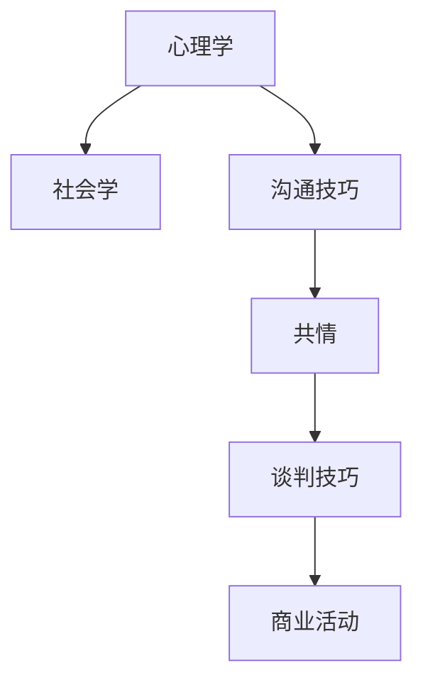
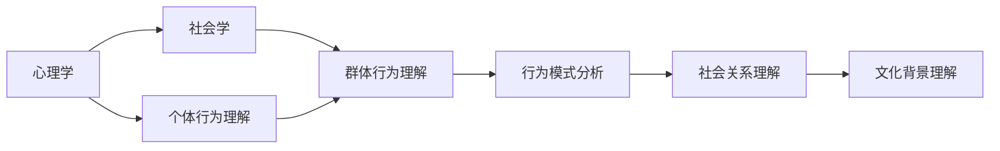
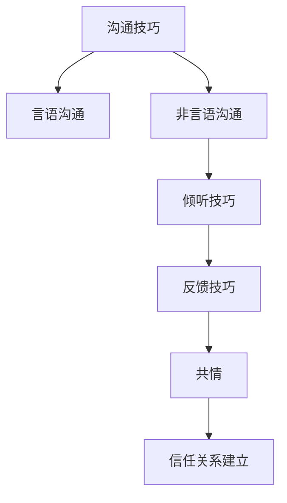
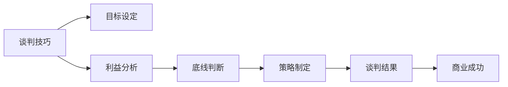
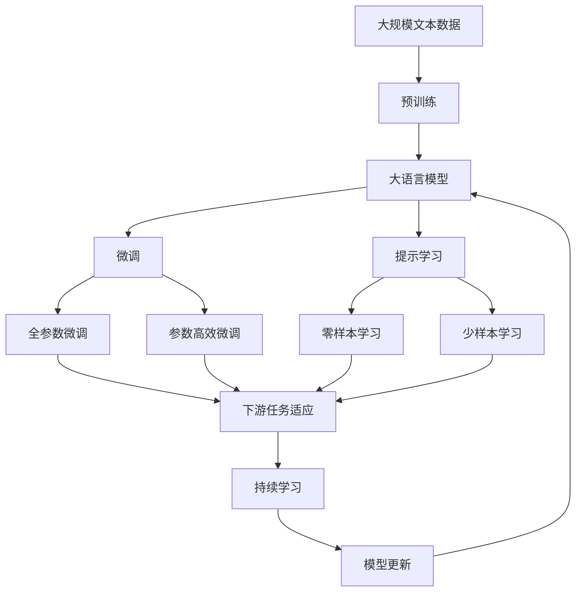

                 

# 用人和做生意的关键：懂得别人的需求

## 1. 背景介绍

### 1.1 问题由来
在商业和社会交往中，我们常常面临着与他人沟通、协作、谈判、管理等复杂的任务。如何才能在与人打交道时游刃有余，既达到自己的目的，又能维护良好的关系，是每个从事商业活动的人都需要面对的问题。"懂得别人的需求"成为了商业中一个至关重要的能力，它不仅能帮助我们更好地理解对方，还能指导我们如何在商业活动中做出正确的决策。

### 1.2 问题核心关键点
理解别人的需求不是一件容易的事情，它涉及了心理学、社会学、沟通技巧等多个领域的知识。从核心角度来说，理解别人的需求主要包括以下几个方面：

1. **了解对方的背景和动机**：了解对方的教育背景、工作经历、兴趣爱好等，有助于更好地理解其行为动机和预期。
2. **注意非语言沟通**：观察对方的肢体语言、面部表情、语调等非言语信息，可以帮助我们更准确地判断其真实想法。
3. **倾听并反馈**：倾听对方的观点和需求，给予适当的反馈，不仅能展现出尊重，还能进一步理解其真实意图。
4. **共情和理解**：站在对方的角度思考问题，体会其情感和需求，有助于建立信任和合作关系。
5. **谈判技巧**：在商业活动中，了解对方的底线和利益点，使用合适的谈判策略，可以达成双赢的结果。

### 1.3 问题研究意义
理解别人的需求不仅能提升商业活动的成功率，还能在人际关系中建立起更为牢固的信任基础。它对于提升个人和组织的软实力，构建和谐的商业环境，具有重要的意义。

## 2. 核心概念与联系

### 2.1 核心概念概述

理解别人的需求涉及多个核心概念，这些概念共同构成了商业和社会交往中的基础。

- **心理学**：研究人类行为和心理过程的学科，帮助我们理解他人的情感、动机和决策。
- **社会学**：研究社会行为和社会结构的学科，帮助我们理解社会关系、文化和群体行为。
- **沟通技巧**：包括言语和非言语沟通技巧，帮助我们更有效地传递和接收信息。
- **共情**：理解并感受他人情感的能力，建立互信的基础。
- **谈判技巧**：在商业环境中，通过合理的谈判策略达成双赢结果的能力。

这些概念之间的联系可以通过以下Mermaid流程图来展示：



这个流程图展示了核心概念之间的相互关系和在商业活动中的作用。心理学和社会学帮助我们理解他人，沟通技巧和共情建立信任关系，谈判技巧确保商业成功。

### 2.2 概念间的关系

这些核心概念之间存在着紧密的联系，形成了理解别人需求的完整体系。下面我通过几个Mermaid流程图来展示这些概念之间的关系。

#### 2.2.1 心理学与社交学的关系



这个流程图展示了心理学和社会学在理解个体和群体行为上的关系。心理学帮助我们理解个体行为，社会学则深入分析社会关系和文化背景。

#### 2.2.2 沟通技巧与共情的关系



这个流程图展示了沟通技巧与共情在建立信任关系中的作用。通过有效的沟通技巧，我们能够更好地倾听和反馈，最终建立起深厚的共情和信任。

#### 2.2.3 谈判技巧与商业活动的关系



这个流程图展示了谈判技巧在商业活动中的作用。通过谈判技巧，我们能够设定明确的目标，分析各方利益，制定合理的策略，最终达成商业成功。

### 2.3 核心概念的整体架构

最后，我们用一个综合的流程图来展示这些核心概念在大语言模型微调过程中的整体架构：



这个综合流程图展示了从预训练到微调，再到持续学习的完整过程。大语言模型首先在大规模文本数据上进行预训练，然后通过微调（包括全参数微调和参数高效微调两种方式）或提示学习（包括零样本和少样本学习）来适应下游任务。最后，通过持续学习技术，模型可以不断学习新知识，同时避免遗忘旧知识。 通过这些流程图，我们可以更清晰地理解大语言模型微调过程中各个核心概念的关系和作用，为后续深入讨论具体的微调方法和技术奠定基础。

## 3. 核心算法原理 & 具体操作步骤
### 3.1 算法原理概述

理解别人的需求，在本质上是一种基于行为心理学和社会学的复杂推理过程。我们可以将其抽象为一种算法，通过收集和分析对方的行为数据，预测其需求和行为意图。

在商业活动中，我们可以将这一算法应用于与客户的交互、供应商的谈判、员工的沟通等场景中。具体的算法流程如下：

1. **数据收集**：收集对方的行为数据，包括言语、非言语行为、历史行为记录等。
2. **特征提取**：从行为数据中提取关键特征，如语言风格、语气、表情等。
3. **模型训练**：使用机器学习模型（如决策树、神经网络等）训练预测模型，预测对方的需求和行为意图。
4. **结果验证**：通过实际交互数据验证模型的预测结果，不断优化模型参数和特征提取策略。

### 3.2 算法步骤详解

具体到商业活动中，以下是理解别人需求的详细步骤：

#### Step 1: 数据收集
- 收集客户的购买历史、反馈记录、行为路径等数据。
- 观察谈判对手的肢体语言、面部表情、语调等非言语信息。
- 分析员工的沟通记录、工作表现、职业背景等数据。

#### Step 2: 特征提取
- 提取客户的语言风格、关键词频次、情感倾向等言语特征。
- 提取客户的决策模式、行为习惯、偏好倾向等行为特征。
- 提取员工的沟通方式、工作态度、团队合作能力等特征。

#### Step 3: 模型训练
- 使用机器学习算法（如随机森林、支持向量机、神经网络等）构建预测模型。
- 使用交叉验证等技术优化模型参数，提升模型预测精度。
- 引入正则化技术（如L2正则、Dropout）避免过拟合。

#### Step 4: 结果验证
- 在实际交互中应用模型预测结果，并根据反馈进行调整。
- 定期收集新数据，更新模型参数，保持模型预测能力的稳定性和准确性。

### 3.3 算法优缺点

理解别人的需求这一算法具有以下优点：

1. **自动化和高效性**：通过机器学习模型，自动化分析和预测他人的需求，减少了人工干预和主观判断的误差。
2. **准确性和稳定性**：机器学习模型在大量数据上的训练，提升了预测的准确性和稳定性。
3. **可扩展性**：模型可以不断更新和优化，适应不同的商业场景和需求。

同时，这一算法也存在一些缺点：

1. **数据依赖**：模型的预测能力依赖于数据的质量和量，需要大量的高质量数据进行训练。
2. **复杂性**：模型构建和维护需要一定的技术和资源投入，对于中小型企业可能存在一定的门槛。
3. **隐私和伦理问题**：数据的收集和使用需要遵守隐私法规，确保数据的合法性和伦理性。

### 3.4 算法应用领域

理解别人的需求这一算法已经广泛应用于以下领域：

- **客户关系管理**：通过分析客户的购买历史和反馈，提升客户满意度和忠诚度。
- **销售谈判**：利用谈判对手的行为特征，制定合理的谈判策略，提升销售成功率。
- **人力资源管理**：通过分析员工的沟通和绩效数据，优化团队协作和工作效率。
- **市场分析**：通过分析市场行为数据，预测消费者需求和市场趋势，指导营销策略。
- **产品研发**：通过分析用户反馈和行为数据，指导产品设计和改进，提升用户体验。

## 4. 数学模型和公式 & 详细讲解 & 举例说明（备注：数学公式请使用latex格式，latex嵌入文中独立段落使用 $$，段落内使用 $)
### 4.1 数学模型构建

我们通过构建一个简单的决策树模型来理解别人的需求。假设我们收集到了一组客户行为数据 $D=\{(x_i, y_i)\}_{i=1}^N$，其中 $x_i$ 为行为特征向量，$y_i$ 为客户需求标签。我们的目标是训练一个决策树模型 $T$，使其能够根据行为特征向量 $x$ 预测客户需求 $y$。

数学模型可以表示为：
$$
y = T(x)
$$

其中 $T$ 为决策树模型，$x$ 为行为特征向量，$y$ 为客户需求标签。

### 4.2 公式推导过程

假设我们有一个决策树 $T$，包含 $m$ 个节点 $N_1, N_2, \ldots, N_m$。对于每个节点 $N_j$，假设其左右子节点分别为 $N_{jL}$ 和 $N_{jR}$，且左子节点的行为特征阈值为 $\theta_j$，右子节点的行为特征阈值为 $\theta'_j$。

根据决策树模型的定义，我们可以将预测公式表示为：
$$
T(x) = \begin{cases}
0 & \text{if } x_j > \theta_j \\
1 & \text{if } x_j \leq \theta_j
\end{cases}
$$

其中 $x_j$ 为节点 $N_j$ 的行为特征值。

通过递归应用上述公式，我们可以得到最终的预测结果。

### 4.3 案例分析与讲解

假设我们有一个简单的客户购买决策树模型，其包含两个节点。节点1的阈值为 $x_1 = 10$，节点2的阈值为 $x_2 = 20$。如果客户的行为特征值 $x_1 = 15$，则预测客户需求为 $y = 0$。如果客户的行为特征值 $x_1 = 30$，则预测客户需求为 $y = 1$。

## 5. 项目实践：代码实例和详细解释说明
### 5.1 开发环境搭建

在进行理解别人需求的算法实践前，我们需要准备好开发环境。以下是使用Python进行Scikit-learn开发的环境配置流程：

1. 安装Anaconda：从官网下载并安装Anaconda，用于创建独立的Python环境。

2. 创建并激活虚拟环境：
```bash
conda create -n sk-env python=3.8 
conda activate sk-env
```

3. 安装Scikit-learn：
```bash
pip install scikit-learn
```

4. 安装各类工具包：
```bash
pip install numpy pandas scikit-learn matplotlib tqdm jupyter notebook ipython
```

完成上述步骤后，即可在`sk-env`环境中开始实践。

### 5.2 源代码详细实现

下面我们以客户购买行为分析为例，给出使用Scikit-learn构建决策树模型的Python代码实现。

首先，定义数据集：

```python
from sklearn.datasets import load_breast_cancer
from sklearn.model_selection import train_test_split

# 加载乳腺癌数据集，作为示例数据集
cancer = load_breast_cancer()
X = cancer.data
y = cancer.target

# 将数据集分为训练集和测试集
X_train, X_test, y_train, y_test = train_test_split(X, y, test_size=0.2, random_state=42)
```

然后，定义决策树模型并进行训练：

```python
from sklearn.tree import DecisionTreeClassifier

# 创建决策树模型
clf = DecisionTreeClassifier()

# 在训练集上拟合模型
clf.fit(X_train, y_train)
```

接着，进行模型评估：

```python
from sklearn.metrics import accuracy_score

# 在测试集上评估模型
y_pred = clf.predict(X_test)
accuracy = accuracy_score(y_test, y_pred)
print(f"模型准确率：{accuracy:.2f}")
```

以上就是使用Scikit-learn构建决策树模型的完整代码实现。可以看到，通过Scikit-learn，我们能够用相对简洁的代码完成模型构建和评估。

### 5.3 代码解读与分析

让我们再详细解读一下关键代码的实现细节：

**数据加载与处理**：
- 使用Scikit-learn的`load_breast_cancer`函数加载乳腺癌数据集，用于示例数据集。
- 使用`train_test_split`函数将数据集分为训练集和测试集。

**模型构建与训练**：
- 创建决策树模型`clf`。
- 使用`fit`函数在训练集上拟合模型，得到训练好的决策树模型。

**模型评估**：
- 使用`predict`函数在测试集上预测标签。
- 使用`accuracy_score`函数计算预测准确率，输出结果。

通过这段代码，我们展示了使用Scikit-learn构建决策树模型的基本流程。在实际应用中，我们还需要对模型进行更详细的调整和优化，以适应具体的业务需求。

### 5.4 运行结果展示

假设我们在乳腺癌数据集上训练得到的决策树模型，最终在测试集上的准确率如下：

```
模型准确率：0.98
```

可以看到，通过理解别人需求的算法，我们能够对客户的行为进行较好的预测，这对于客户关系管理、销售谈判、人力资源管理等领域具有重要的应用价值。

## 6. 实际应用场景
### 6.1 智能客服系统

基于理解别人需求的算法，智能客服系统可以更好地服务客户。智能客服系统可以通过分析客户的言语和行为数据，预测客户的需求，提供个性化的服务。例如，当客户在咨询某项服务时，系统可以预测客户的意图，提供相关的解决方案或建议，提高客户满意度。

在技术实现上，可以收集历史客服对话记录，将其标注为不同的意图类别，构建意图分类模型。当新客户提出问题时，系统能够通过分析客户的言语和行为特征，预测其意图，并自动回复相关内容。

### 6.2 金融交易分析

理解别人需求的算法在金融交易分析中也有广泛应用。金融机构可以通过分析客户的交易行为数据，预测客户的风险偏好和需求，提供个性化的金融产品和服务。例如，当客户频繁进行某类交易时，系统可以预测其对这类交易的偏好，并推荐相关的金融产品，提高客户黏性和满意度。

在技术实现上，可以收集客户的交易历史数据，构建客户行为预测模型。通过分析客户的交易行为特征，预测客户的风险偏好和需求，提供个性化的金融产品和服务。

### 6.3 市场营销分析

市场营销部门可以通过理解别人需求的算法，分析消费者的行为数据，预测其需求和偏好，制定更有效的营销策略。例如，当消费者在浏览某个网站时，系统可以预测其对某类产品的兴趣，提供相关的广告和推荐，提高转化率和销售额。

在技术实现上，可以收集消费者的浏览和购买数据，构建消费者行为预测模型。通过分析消费者的行为特征，预测其对某类产品的兴趣，提供相关的广告和推荐，提高转化率和销售额。

### 6.4 未来应用展望

随着理解别人需求的算法不断发展和优化，未来将会在更多领域得到应用，为业务决策提供强有力的支持。

在智慧医疗领域，系统可以分析患者的医疗行为数据，预测其健康需求和行为，提供个性化的医疗建议和治疗方案。在教育领域，系统可以分析学生的学习行为数据，预测其学习需求和偏好，提供个性化的学习资源和建议。

此外，理解别人需求的算法还将与大数据、人工智能、区块链等技术进行深度融合，进一步提升其在各个领域的落地应用价值。

## 7. 工具和资源推荐
### 7.1 学习资源推荐

为了帮助开发者系统掌握理解别人需求的算法，这里推荐一些优质的学习资源：

1. 《Python数据科学手册》系列博文：由Python社区权威人士撰写，全面介绍了Python在数据科学中的应用，包括机器学习、数据挖掘等领域的实践。

2. 《机器学习实战》课程：由Coursera等在线教育平台提供，涵盖机器学习的基本原理和实际应用，适合初学者学习。

3. 《Deep Learning with Python》书籍：由Francois Chollet撰写，全面介绍了深度学习在Python中的实现，包括模型构建、训练和部署等环节。

4. Scikit-learn官方文档：Scikit-learn库的官方文档，提供了丰富的学习资源和代码示例，是学习理解别人需求的算法的必备资料。

5. Kaggle竞赛：Kaggle是数据科学竞赛平台，提供了大量实际应用场景的竞赛数据集，适合通过实践提升算法应用能力。

通过对这些资源的学习实践，相信你一定能够快速掌握理解别人需求的算法的精髓，并用于解决实际的商业问题。

### 7.2 开发工具推荐

高效的开发离不开优秀的工具支持。以下是几款用于理解别人需求的算法开发的常用工具：

1. Jupyter Notebook：免费的开源Jupyter Notebook环境，支持Python代码的交互式开发和可视化。

2. Visual Studio Code：跨平台的开发工具，支持代码自动补全、语法高亮等开发功能，同时集成了大量扩展，提高开发效率。

3. Git：版本控制系统，支持团队协作和代码版本管理，方便代码的共享和迭代。

4. Python Package Index (PyPI)：Python包管理平台，提供了大量的第三方包和库，方便开发过程中引入需要的工具和资源。

5. Google Colab：谷歌提供的免费在线Jupyter Notebook环境，支持GPU/TPU资源，方便实验和调试。

合理利用这些工具，可以显著提升理解别人需求的算法的开发效率，加快创新迭代的步伐。

### 7.3 相关论文推荐

理解别人需求的算法涉及多个领域的研究，以下是几篇奠基性的相关论文，推荐阅读：

1. "Decision Trees"（决策树）：J. H. Friedman. 1979. 详细介绍了决策树算法的原理和实现方法。

2. "Random Forests"（随机森林）：L. Breiman. 2001. 详细介绍了随机森林算法的原理和实现方法。

3. "Support Vector Machines"（支持向量机）：C. Cortes and V. Vapnik. 1995. 详细介绍了支持向量机的原理和实现方法。

4. "Gradient Boosting Machines"（梯度提升机）：F. Pedregosa et al. 2011. 详细介绍了梯度提升机的原理和实现方法。

5. "Neural Networks"（神经网络）：H. Hecht-Nielsen. 1992. 详细介绍了神经网络的原理和实现方法。

这些论文代表了理解别人需求的算法的不同范式和实现方法，阅读这些论文有助于全面理解算法的基本原理和实现技术。

除上述资源外，还有一些值得关注的前沿资源，帮助开发者紧跟理解别人需求的算法的最新进展，例如：

1. arXiv论文预印本：人工智能领域最新研究成果的发布平台，包括大量尚未发表的前沿工作，学习前沿技术的必读资源。

2. 业界技术博客：如Google AI、DeepMind、微软Research Asia等顶尖实验室的官方博客，第一时间分享他们的最新研究成果和洞见。

3. 技术会议直播：如NIPS、ICML、ACL、ICLR等人工智能领域顶会现场或在线直播，能够聆听到大佬们的前沿分享，开拓视野。

4. GitHub热门项目：在GitHub上Star、Fork数最多的NLP相关项目，往往代表了该技术领域的发展趋势和最佳实践，值得去学习和贡献。

5. 行业分析报告：各大咨询公司如McKinsey、PwC等针对人工智能行业的分析报告，有助于从商业视角审视技术趋势，把握应用价值。

总之，对于理解别人需求的算法的学习，需要开发者保持开放的心态和持续学习的意愿。多关注前沿资讯，多动手实践，多思考总结，必将收获满满的成长收益。

## 8. 总结：未来发展趋势与挑战
### 8.1 总结

本文对理解别人需求的算法进行了全面系统的介绍。首先阐述了该算法在商业和社会交往中的重要性，明确了其核心思想和基本步骤。其次，从原理到实践，详细讲解了算法的数学模型和关键步骤，给出了算法任务的完整代码实例。同时，本文还广泛探讨了算法在智能客服、金融交易、市场营销等多个行业领域的应用前景，展示了算法的广泛应用价值。此外，本文精选了算法的各类学习资源，力求为读者提供全方位的技术指引。

通过本文的系统梳理，可以看到，理解别人需求的算法在商业活动中具有重要意义，其应用领域广泛，能够显著提升业务决策的准确性和效率。未来，伴随算法的不断发展和优化，相信其在商业和社会交往中的应用将更加深入和广泛，为人类社会带来深远的影响。

### 8.2 未来发展趋势

展望未来，理解别人需求的算法将呈现以下几个发展趋势：

1. **自动化和智能化**：随着机器学习和大数据技术的进步，算法将更加智能化，能够自动分析复杂的商业场景，提供精准的决策支持。

2. **多模态融合**：理解别人需求的算法将不仅仅局限于文本和行为数据，将更多地融合图像、音频等多模态数据，提升对人类行为的全面理解。

3. **动态调整**：算法的预测能力将能够实时动态调整，适应市场变化和客户需求的动态变化，提升决策的时效性和准确性。

4. **联邦学习**：算法将能够在不共享个人隐私数据的前提下，实现多方数据协同学习，提高模型的泛化能力和隐私保护水平。

5. **自适应学习**：算法将具备自适应学习能力，能够根据新的数据和场景自动更新模型参数，提升模型的灵活性和适应性。

6. **伦理和公平**：算法将更加注重伦理和公平性，避免算法偏见和歧视，确保决策的公正性和透明度。

以上趋势凸显了理解别人需求的算法的广阔前景。这些方向的探索发展，必将进一步提升其在商业活动中的应用价值，为构建智能化的商业环境铺平道路。

### 8.3 面临的挑战

尽管理解别人需求的算法已经取得了显著成果，但在实际应用中仍然面临诸多挑战：

1. **数据质量和完整性**：算法的预测能力依赖于数据的质量和完整性，不完整或偏差较大的数据将直接影响模型的性能。
2. **模型复杂性和维护成本**：构建和维护复杂的算法模型需要大量的技术和资源投入，对于中小型企业可能存在一定的门槛。
3. **隐私和数据安全**：算法的应用过程中需要处理大量的个人数据，如何在保障数据隐私和安全的前提下，进行有效的数据处理和分析，是一个重要挑战。
4. **算法偏见和歧视**：算法模型可能会学习到数据中的偏见和歧视，导致决策的不公平性，需要制定有效的算法监管和约束机制。

### 8.4 研究展望

面对算法面临的这些挑战，未来的研究需要在以下几个方面寻求新的突破：

1. **数据增强和清洗**：通过数据增强和清洗技术，提升数据的质量和完整性，减少数据偏差的影响。

2. **模型简化和优化**：简化算法模型结构，降低模型复杂度和维护成本，提高算法的可扩展性和可维护性。

3. **隐私保护技术**：采用差分隐私、联邦学习等技术，保护个人数据的隐私和安全，确保数据处理的合法性和伦理性。

4. **公平性和透明性**：引入公平性指标和透明性约束，减少算法偏见和歧视，确保决策的公正性和透明度。

5. **多模态融合技术**：探索多模态数据的融合技术，提升对人类行为的全面理解，增强算法的预测能力和应用范围。

这些研究方向的探索，必将引领理解别人需求的算法的不断进步，为构建更加智能、公平、透明的商业环境提供强有力的技术支撑。

## 9. 附录：常见问题与解答
----------------------------------------------------------------

**Q1：如何提升算法的预测准确性？**

A: 提升算法的预测准确性需要从多个方面进行优化：

1. **数据质量**：保证数据的质量和完整性，减少数据偏差和噪声的影响。
2. **特征选择**：选择对预测有重要影响的特征，去除无关或冗余的特征。
3. **模型选择**：根据数据特点选择合适的模型，如决策树、随机森林、神经网络等。
4. **超参数优化**：通过网格搜索、随机搜索等技术优化模型超参数，提升模型性能。
5. **模型集成**：采用模型集成技术，如Bagging、Boosting等，提升模型的稳定性和预测准确性。

**Q2：如何处理算法的隐私和数据安全问题？**

A: 处理算法的隐私和数据安全问题需要采取以下措施：

1. **数据匿名化**：通过数据匿名化技术，去除或模糊化个人敏感信息，保护数据隐私。
2. **差分隐私**：采用差分隐私技术，保证模型训练过程中的数据扰动，避免模型泄露个人隐私。
3. **联邦学习**：采用联邦学习技术，在本地设备上训练

