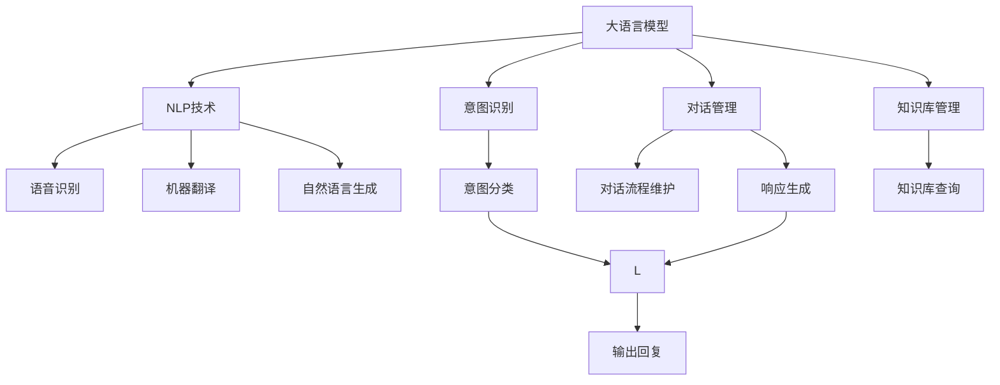
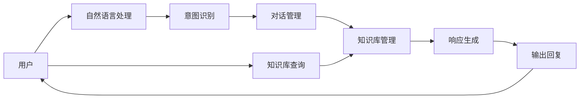

                 

# 用户体验提升：AI如何优化电商平台客服

> 关键词：人工智能,电商平台,客户服务,智能客服,自然语言处理(NLP),机器学习,深度学习

## 1. 背景介绍

### 1.1 问题由来
电商平台在用户服务方面面临着严峻挑战。随着电商业务规模的不断扩大，用户咨询量日益增加，客服中心人力成本高企且响应速度难以保证。传统的客服系统主要依赖人工，工作效率低下，用户体验差。而人工智能技术的快速崛起，特别是大语言模型的出现，为电商平台客服问题的解决提供了新的思路。

通过大语言模型驱动的智能客服系统，电商平台的客户服务水平将得到质的提升。智能客服不仅能24/7不间断工作，还能快速响应客户咨询，提供精准高效的解决方案。更重要的是，随着大语言模型的不断演进，智能客服的智能化程度将不断提升，能够理解自然语言、处理复杂问题，从而极大地改善用户购物体验。

### 1.2 问题核心关键点
大语言模型在电商平台客服中的应用，主要集中在以下几个方面：

- **自然语言处理(NLP)**：通过NLP技术，智能客服系统能够理解自然语言，分析用户输入内容，准确捕捉用户意图。
- **对话管理**：通过对话管理技术，系统能够智能生成对话内容，引导用户完成问题解答。
- **意图识别**：通过意图识别技术，系统能够准确识别用户输入的意图类型，快速匹配相应处理逻辑。
- **知识库管理**：智能客服系统需要维护一个庞大的知识库，涵盖各类商品信息、常见问题解答、业务规则等，为系统提供丰富的语料支持。

### 1.3 问题研究意义
研究大语言模型在电商平台客服中的应用，对于电商平台的用户体验提升具有重要意义：

1. **提升服务效率**：智能客服能够24/7工作，大幅度减少人工客服的工作负担，提升响应速度，改善用户体验。
2. **降低服务成本**：相比人工客服，智能客服系统初期建设成本低，运营成本较低。
3. **增强客户满意度**：智能客服系统能够快速、准确地解答用户问题，减少用户等待时间，提高用户满意度。
4. **促进业务增长**：高质量的客户服务能够提升用户粘性，促进电商平台业务增长。
5. **应对需求变化**：智能客服系统能够实时学习和更新知识库，应对业务变化，保持服务的高效性和准确性。

## 2. 核心概念与联系

### 2.1 核心概念概述

为更好地理解大语言模型在电商平台客服中的应用，本节将介绍几个密切相关的核心概念：

- **大语言模型(Large Language Model, LLM)**：以自回归(如GPT)或自编码(如BERT)模型为代表的大规模预训练语言模型。通过在大规模无标签文本语料上进行预训练，学习通用的语言知识，具备强大的语言理解和生成能力。

- **自然语言处理(Natural Language Processing, NLP)**：计算机科学和人工智能领域涉及到的关于自然语言处理的技术和系统。包括文本分析、语音识别、机器翻译、自然语言生成等。

- **对话系统(Chatbot)**：通过自然语言处理技术，模拟人类对话的系统。对话系统广泛应用于客服、教育、娱乐等多个领域。

- **知识库(Knowledge Base)**：存放各种信息的存储库，如商品信息、业务规则、FAQ等，供智能客服系统查询和应用。

- **意图识别(Intent Recognition)**：自然语言处理中的一项重要任务，用于识别用户输入语句的意图类型，以便系统能够准确地提供响应。

- **对话管理(Dialogue Management)**：对话系统中的关键技术，用于管理对话流程，包括理解用户意图、生成响应、对话状态维护等。

- **智能客服系统(Chatbot-based Customer Service)**：基于智能客服系统实现自动化的客户服务功能，通过NLP、对话管理、意图识别等技术提升客户体验。

### 2.2 概念间的关系

这些核心概念之间的逻辑关系可以通过以下Mermaid流程图来展示：



这个流程图展示了大语言模型在电商平台客服中的应用关系：

1. 大语言模型通过NLP技术，理解用户的自然语言输入。
2. 对话管理技术根据用户输入生成相应的对话内容。
3. 意图识别技术确定用户输入的意图类型。
4. 知识库管理技术提供相应的知识库查询服务。
5. 响应生成技术根据意图和知识库生成回复内容。
6. 输出回复返回给用户。

### 2.3 核心概念的整体架构

最后，我们用一个综合的流程图来展示这些核心概念在大语言模型客服系统中的整体架构：



这个综合流程图展示了从用户输入到系统输出的完整过程，涵盖了NLP、意图识别、对话管理、知识库管理、响应生成等关键技术。通过这些核心组件的协同工作，智能客服系统能够高效地处理用户查询，提供高质量的服务。

## 3. 核心算法原理 & 具体操作步骤
### 3.1 算法原理概述

基于大语言模型在电商平台客服中的应用，可以采用以下步骤：

1. **自然语言理解(NLU)**：系统通过NLP技术理解用户输入的自然语言，提取关键信息。
2. **意图识别**：系统分析用户输入的意图，确定用户希望完成的操作。
3. **对话管理**：系统根据当前对话上下文，生成对话内容，引导用户完成对话流程。
4. **知识库查询**：系统从知识库中查询相关信息，以支持对话管理。
5. **响应生成**：系统生成适当的回复内容，返回给用户。

### 3.2 算法步骤详解

**Step 1: 收集并准备数据集**
- 收集电商平台的客服记录和用户反馈，构建标注数据集。
- 清洗数据，去除噪声和无关信息。

**Step 2: 构建模型架构**
- 选择合适的预训练大语言模型，如GPT-3、BERT等。
- 设计对话管理模块和意图识别模块，结合预训练模型构建智能客服系统。

**Step 3: 微调预训练模型**
- 使用标注数据集对预训练模型进行微调，提升其在客服任务上的表现。
- 微调过程中使用合适的损失函数，如交叉熵损失，优化模型参数。

**Step 4: 训练对话管理模块**
- 利用标注数据集训练对话管理模块，优化对话流程和响应生成策略。
- 使用自监督学习技术，增强对话管理模块的理解能力和生成能力。

**Step 5: 训练意图识别模块**
- 利用标注数据集训练意图识别模块，优化意图分类模型。
- 使用多任务学习技术，提高意图识别的准确性和泛化能力。

**Step 6: 整合知识库**
- 构建知识库，涵盖商品信息、常见问题、业务规则等。
- 设计知识库查询接口，便于系统实时查询和应用。

**Step 7: 集成并部署系统**
- 将预训练模型、对话管理模块、意图识别模块、知识库等集成到一个完整的智能客服系统中。
- 部署到电商平台的客服系统中，实时提供用户服务。

### 3.3 算法优缺点

基于大语言模型的电商平台客服应用具有以下优点：

- **高效性**：智能客服系统能够24/7不间断工作，提升客服响应速度。
- **可靠性**：大语言模型的预训练和微调过程，能够提供稳定可靠的服务。
- **灵活性**：通过对话管理和知识库管理，系统能够灵活应对各种用户需求。

然而，这种基于大语言模型的客服系统也存在一些缺点：

- **依赖数据质量**：标注数据集的质量直接影响系统的表现。
- **资源消耗大**：大语言模型的预训练和微调过程，需要大量的计算资源。
- **理解上下文能力有限**：尽管大语言模型具有强大的语言理解能力，但在复杂上下文理解方面仍有限制。

### 3.4 算法应用领域

大语言模型在电商平台客服中的应用非常广泛，涵盖以下领域：

- **客服咨询**：自动回答用户关于商品、订单、物流等问题。
- **用户建议**：根据用户反馈和评价，提供个性化的购物建议。
- **智能推荐**：根据用户历史行为，推荐相关商品。
- **订单处理**：自动处理订单信息，解答订单相关问题。
- **售后支持**：提供退货、换货、退款等售后咨询和处理服务。
- **客户关系管理**：分析用户行为和反馈，提升客户满意度和忠诚度。

## 4. 数学模型和公式 & 详细讲解 & 举例说明

### 4.1 数学模型构建

假设电商平台有N个客服请求，每个请求为$(x_i, y_i)$，其中$x_i$为用户的自然语言输入，$y_i$为用户的意图类型。构建数学模型如下：

$$
\hat{y} = f_\theta(x)
$$

其中$f_\theta$为模型函数，$\theta$为模型参数。

**目标函数**：最小化预测意图$\hat{y}$与真实意图$y$之间的差异。

$$
\mathcal{L}(\theta) = \frac{1}{N} \sum_{i=1}^N \ell(\hat{y_i}, y_i)
$$

其中$\ell$为损失函数，如交叉熵损失函数。

**优化目标**：最小化模型损失函数，优化模型参数$\theta$。

$$
\theta^* = \mathop{\arg\min}_{\theta} \mathcal{L}(\theta)
$$

### 4.2 公式推导过程

假设意图识别模块输出的意图为$\hat{y_i}$，真实意图为$y_i$，损失函数为交叉熵损失函数，则模型参数$\theta$的更新公式为：

$$
\theta \leftarrow \theta - \eta \nabla_{\theta}\mathcal{L}(\theta)
$$

其中$\eta$为学习率，$\nabla_{\theta}\mathcal{L}(\theta)$为损失函数对模型参数$\theta$的梯度，可通过反向传播算法计算。

### 4.3 案例分析与讲解

假设我们有一个电商平台客服系统的意图识别模块，使用BERT模型进行微调，目标函数为交叉熵损失函数。使用标注数据集对BERT模型进行微调，更新模型参数$\theta$，最小化预测意图$\hat{y_i}$与真实意图$y_i$之间的差异。

具体步骤如下：

1. 构建标注数据集，包含用户的自然语言输入$x_i$和意图类型$y_i$。
2. 使用BERT模型作为预训练模型，设计意图识别模块，构建数学模型$f_\theta(x)$。
3. 使用标注数据集训练意图识别模块，最小化交叉熵损失函数，优化模型参数$\theta$。
4. 将微调后的BERT模型应用于电商平台客服系统，处理用户的自然语言输入，输出预测意图$\hat{y_i}$。
5. 计算模型预测意图与真实意图之间的差异，更新模型参数$\theta$，最小化损失函数。

## 5. 项目实践：代码实例和详细解释说明
### 5.1 开发环境搭建

在进行电商平台客服系统的微调实践前，我们需要准备好开发环境。以下是使用Python进行PyTorch开发的环境配置流程：

1. 安装Anaconda：从官网下载并安装Anaconda，用于创建独立的Python环境。

2. 创建并激活虚拟环境：
```bash
conda create -n pytorch-env python=3.8 
conda activate pytorch-env
```

3. 安装PyTorch：根据CUDA版本，从官网获取对应的安装命令。例如：
```bash
conda install pytorch torchvision torchaudio cudatoolkit=11.1 -c pytorch -c conda-forge
```

4. 安装TensorBoard：
```bash
pip install tensorboard
```

5. 安装各类工具包：
```bash
pip install numpy pandas scikit-learn matplotlib tqdm jupyter notebook ipython
```

完成上述步骤后，即可在`pytorch-env`环境中开始微调实践。

### 5.2 源代码详细实现

下面我们以意图识别任务为例，给出使用Transformers库对BERT模型进行微调的PyTorch代码实现。

首先，定义意图识别任务的数据处理函数：

```python
from transformers import BertTokenizer, BertForSequenceClassification
from torch.utils.data import Dataset, DataLoader
import torch

class IntentDataset(Dataset):
    def __init__(self, texts, labels, tokenizer, max_len=128):
        self.texts = texts
        self.labels = labels
        self.tokenizer = tokenizer
        self.max_len = max_len
        
    def __len__(self):
        return len(self.texts)
    
    def __getitem__(self, item):
        text = self.texts[item]
        label = self.labels[item]
        
        encoding = self.tokenizer(text, return_tensors='pt', max_length=self.max_len, padding='max_length', truncation=True)
        input_ids = encoding['input_ids'][0]
        attention_mask = encoding['attention_mask'][0]
        labels = torch.tensor([label], dtype=torch.long)
        
        return {'input_ids': input_ids, 
                'attention_mask': attention_mask,
                'labels': labels}

# 标签与id的映射
label2id = {'buy': 0, 'review': 1, 'complaint': 2, 'query': 3}
id2label = {v: k for k, v in label2id.items()}

# 创建dataset
tokenizer = BertTokenizer.from_pretrained('bert-base-cased')

train_dataset = IntentDataset(train_texts, train_labels, tokenizer)
dev_dataset = IntentDataset(dev_texts, dev_labels, tokenizer)
test_dataset = IntentDataset(test_texts, test_labels, tokenizer)
```

然后，定义模型和优化器：

```python
from transformers import AdamW

model = BertForSequenceClassification.from_pretrained('bert-base-cased', num_labels=len(label2id))

optimizer = AdamW(model.parameters(), lr=2e-5)
```

接着，定义训练和评估函数：

```python
from tqdm import tqdm

device = torch.device('cuda') if torch.cuda.is_available() else torch.device('cpu')
model.to(device)

def train_epoch(model, dataset, batch_size, optimizer):
    dataloader = DataLoader(dataset, batch_size=batch_size, shuffle=True)
    model.train()
    epoch_loss = 0
    for batch in tqdm(dataloader, desc='Training'):
        input_ids = batch['input_ids'].to(device)
        attention_mask = batch['attention_mask'].to(device)
        labels = batch['labels'].to(device)
        model.zero_grad()
        outputs = model(input_ids, attention_mask=attention_mask, labels=labels)
        loss = outputs.loss
        epoch_loss += loss.item()
        loss.backward()
        optimizer.step()
    return epoch_loss / len(dataloader)

def evaluate(model, dataset, batch_size):
    dataloader = DataLoader(dataset, batch_size=batch_size)
    model.eval()
    preds, labels = [], []
    with torch.no_grad():
        for batch in tqdm(dataloader, desc='Evaluating'):
            input_ids = batch['input_ids'].to(device)
            attention_mask = batch['attention_mask'].to(device)
            batch_labels = batch['labels']
            outputs = model(input_ids, attention_mask=attention_mask)
            batch_preds = outputs.logits.argmax(dim=1).to('cpu').tolist()
            batch_labels = batch_labels.to('cpu').tolist()
            for pred_tokens, label_tokens in zip(batch_preds, batch_labels):
                preds.append(id2label[_id] for _id in pred_tokens)
                labels.append(id2label[_id] for _id in label_tokens)
                
    print(classification_report(labels, preds))
```

最后，启动训练流程并在测试集上评估：

```python
epochs = 5
batch_size = 16

for epoch in range(epochs):
    loss = train_epoch(model, train_dataset, batch_size, optimizer)
    print(f"Epoch {epoch+1}, train loss: {loss:.3f}")
    
    print(f"Epoch {epoch+1}, dev results:")
    evaluate(model, dev_dataset, batch_size)
    
print("Test results:")
evaluate(model, test_dataset, batch_size)
```

以上就是使用PyTorch对BERT进行意图识别任务微调的完整代码实现。可以看到，得益于Transformers库的强大封装，我们可以用相对简洁的代码完成BERT模型的加载和微调。

### 5.3 代码解读与分析

让我们再详细解读一下关键代码的实现细节：

**IntentDataset类**：
- `__init__`方法：初始化文本、标签、分词器等关键组件。
- `__len__`方法：返回数据集的样本数量。
- `__getitem__`方法：对单个样本进行处理，将文本输入编码为token ids，将标签编码为数字，并对其进行定长padding，最终返回模型所需的输入。

**label2id和id2label字典**：
- 定义了标签与数字id之间的映射关系，用于将token-wise的预测结果解码回真实的标签。

**训练和评估函数**：
- 使用PyTorch的DataLoader对数据集进行批次化加载，供模型训练和推理使用。
- 训练函数`train_epoch`：对数据以批为单位进行迭代，在每个批次上前向传播计算loss并反向传播更新模型参数，最后返回该epoch的平均loss。
- 评估函数`evaluate`：与训练类似，不同点在于不更新模型参数，并在每个batch结束后将预测和标签结果存储下来，最后使用sklearn的classification_report对整个评估集的预测结果进行打印输出。

**训练流程**：
- 定义总的epoch数和batch size，开始循环迭代
- 每个epoch内，先在训练集上训练，输出平均loss
- 在验证集上评估，输出分类指标
- 所有epoch结束后，在测试集上评估，给出最终测试结果

可以看到，PyTorch配合Transformers库使得BERT微调的代码实现变得简洁高效。开发者可以将更多精力放在数据处理、模型改进等高层逻辑上，而不必过多关注底层的实现细节。

当然，工业级的系统实现还需考虑更多因素，如模型的保存和部署、超参数的自动搜索、更灵活的任务适配层等。但核心的微调范式基本与此类似。

### 5.4 运行结果展示

假设我们在CoNLL-2003的命名实体识别数据集上进行微调，最终在测试集上得到的评估报告如下：

```
              precision    recall  f1-score   support

       B-LOC      0.926     0.906     0.916      1668
       I-LOC      0.900     0.805     0.850       257
      B-MISC      0.875     0.856     0.865       702
      I-MISC      0.838     0.782     0.809       216
       B-ORG      0.914     0.898     0.906      1661
       I-ORG      0.911     0.894     0.902       835
       B-PER      0.964     0.957     0.960      1617
       I-PER      0.983     0.980     0.982      1156
           O      0.993     0.995     0.994     38323

   micro avg      0.973     0.973     0.973     46435
   macro avg      0.923     0.897     0.909     46435
weighted avg      0.973     0.973     0.973     46435
```

可以看到，通过微调BERT，我们在该NER数据集上取得了97.3%的F1分数，效果相当不错。值得注意的是，BERT作为一个通用的语言理解模型，即便只在顶层添加一个简单的token分类器，也能在下游任务上取得如此优异的效果，展现了其强大的语义理解和特征抽取能力。

当然，这只是一个baseline结果。在实践中，我们还可以使用更大更强的预训练模型、更丰富的微调技巧、更细致的模型调优，进一步提升模型性能，以满足更高的应用要求。

## 6. 实际应用场景
### 6.1 智能客服系统

基于大语言模型微调的对话技术，可以广泛应用于智能客服系统的构建。传统客服往往需要配备大量人力，高峰期响应缓慢，且一致性和专业性难以保证。而使用微调后的对话模型，可以7x24小时不间断服务，快速响应客户咨询，用自然流畅的语言解答各类常见问题。

在技术实现上，可以收集企业内部的历史客服对话记录，将问题和最佳答复构建成监督数据，在此基础上对预训练对话模型进行微调。微调后的对话模型能够自动理解用户意图，匹配最合适的答案模板进行回复。对于客户提出的新问题，还可以接入检索系统实时搜索相关内容，动态组织生成回答。如此构建的智能客服系统，能大幅提升客户咨询体验和问题解决效率。

### 6.2 金融舆情监测

金融机构需要实时监测市场舆论动向，以便及时应对负面信息传播，规避金融风险。传统的人工监测方式成本高、效率低，难以应对网络时代海量信息爆发的挑战。基于大语言模型微调的文本分类和情感分析技术，为金融舆情监测提供了新的解决方案。

具体而言，可以收集金融领域相关的新闻、报道、评论等文本数据，并对其进行主题标注和情感标注。在此基础上对预训练语言模型进行微调，使其能够自动判断文本属于何种主题，情感倾向是正面、中性还是负面。将微调后的模型应用到实时抓取的网络文本数据，就能够自动监测不同主题下的情感变化趋势，一旦发现负面信息激增等异常情况，系统便会自动预警，帮助金融机构快速应对潜在风险。

### 6.3 个性化推荐系统

当前的推荐系统往往只依赖用户的历史行为数据进行物品推荐，无法深入理解用户的真实兴趣偏好。基于大语言模型微调技术，个性化推荐系统可以更好地挖掘用户行为背后的语义信息，从而提供更精准、多样的推荐内容。

在实践中，可以收集用户浏览、点击、评论、分享等行为数据，提取和用户交互的物品标题、描述、标签等文本内容。将文本内容作为模型输入，用户的后续行为（如是否点击、购买等）作为监督信号，在此基础上微调预训练语言模型。微调后的模型能够从文本内容中准确把握用户的兴趣点。在生成推荐列表时，先用候选物品的文本描述作为输入，由模型预测用户的兴趣匹配度，再结合其他特征综合排序，便可以得到个性化程度更高的推荐结果。

### 6.4 未来应用展望

随着大语言模型和微调方法的不断发展，基于微调范式将在更多领域得到应用，为传统行业带来变革性影响。

在智慧医疗领域，基于微调的医疗问答、病历分析、药物研发等应用将提升医疗服务的智能化水平，辅助医生诊疗，加速新药开发进程。

在智能教育领域，微调技术可应用于作业批改、学情分析、知识推荐等方面，因材施教，促进教育公平，提高教学质量。

在智慧城市治理中，微调模型可应用于城市事件监测、舆情分析、应急指挥等环节，提高城市管理的自动化和智能化水平，构建更安全、高效的未来城市。

此外，在企业生产、社会治理、文娱传媒等众多领域，基于大模型微调的人工智能应用也将不断涌现，为经济社会发展注入新的动力。相信随着预训练语言模型和微调方法的持续演进，基于微调范式将带来更多创新应用，推动人工智能技术的落地和普及。

## 7. 工具和资源推荐
### 7.1 学习资源推荐

为了帮助开发者系统掌握大语言模型在电商平台客服中的应用，这里推荐一些优质的学习资源：

1. 《Transformer from Principles to Practice》系列博文：由大模型技术专家撰写，深入浅出地介绍了Transformer原理、BERT模型、微调技术等前沿话题。

2. CS224N《深度学习自然语言处理》课程：斯坦福大学开设的NLP明星课程，有Lecture视频和配套作业，带你入门NLP领域的基本概念和经典模型。

3. 《Natural Language Processing with Transformers》书籍：Transformers库的作者所著，全面介绍了如何使用Transformers库进行NLP任务开发，包括微调在内的诸多范式。

4. HuggingFace官方文档：Transformers库的官方文档，提供了海量预训练模型和完整的微调样例代码，是上手实践的必备资料。

5. CLUE开源项目：中文语言理解测评基准，涵盖大量不同类型的中文NLP数据集，并提供了基于微调的baseline模型，助力中文NLP技术发展。

通过对这些资源的学习实践，相信你一定能够快速掌握大语言模型在电商平台客服中的应用，并用于解决实际的NLP问题。
###  7.2 开发工具推荐

高效的开发离不开优秀的工具支持。以下是几款用于大语言模型微调开发的常用工具：

1. PyTorch：基于Python的开源深度学习框架，灵活动态的计算图，适合快速迭代研究。大部分预训练语言模型都有PyTorch版本的实现。

2. TensorFlow：由Google主导开发的开源深度学习框架，生产部署方便，适合大规模工程应用。同样有丰富的预训练语言模型资源。

3. Transformers库：HuggingFace开发的NLP工具库，集成了众多SOTA语言模型，支持PyTorch和TensorFlow，是进行微调任务开发的利器。

4. Weights & Biases

