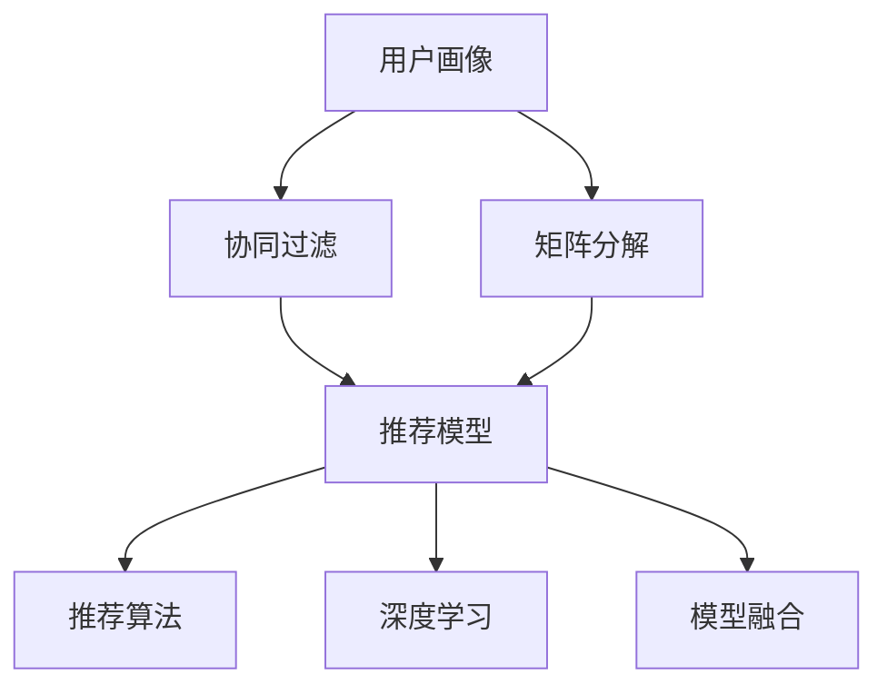

                 

# 用户画像在电商个性化推荐中的应用：方法与实践

> 关键词：用户画像,个性化推荐,深度学习,协同过滤,矩阵分解,自然语言处理(NLP),模型融合

## 1. 背景介绍

### 1.1 问题由来
随着电子商务的快速发展和消费者行为模式的多样化，传统的"一刀切"式的商品推荐方式已经难以满足用户需求，个性化推荐技术应运而生。个性化推荐系统能够根据用户的历史行为、兴趣爱好、社交网络等多种信息，向用户推荐最合适的商品，提升用户体验和转化率。然而，尽管个性化推荐技术已取得显著成效，仍然存在许多瓶颈问题：

1. **用户兴趣表达不足**：用户的历史行为和评分数据往往不足以全面描述其兴趣偏好。

2. **数据稀疏性**：大量用户的偏好数据稀疏，推荐模型难以充分利用这些数据进行推荐。

3. **冷启动问题**：新用户或新商品缺乏足够的历史数据，导致无法进行有效的推荐。

4. **动态变化性**：用户的兴趣偏好随时间变化，推荐模型需要实时更新以适应新的变化。

5. **数据隐私保护**：需要保护用户数据隐私，避免泄露敏感信息。

用户画像(User Profile)技术的引入，在一定程度上缓解了这些瓶颈问题。用户画像构建了用户的全面、动态、多维度的描述，帮助推荐系统更好地理解用户需求，提升推荐质量。本文将介绍用户画像在电商个性化推荐中的方法与实践。

### 1.2 问题核心关键点
用户画像在电商推荐中的应用主要体现在以下几个方面：

1. **用户兴趣挖掘**：通过分析用户的行为数据，构建用户的多维度兴趣特征，提升推荐模型的精度。

2. **推荐算法优化**：利用用户画像的信息，优化推荐算法的参数和策略，进一步提升推荐效果。

3. **动态更新机制**：定期更新用户画像，适应用户兴趣的变化，保持推荐模型的时效性。

4. **数据隐私保护**：在用户画像构建和应用过程中，保证数据的安全性和隐私性。

5. **模型融合与评估**：将用户画像与各类推荐算法相结合，实现多模型的融合与优化，提升推荐系统的性能。

用户画像技术通过丰富和细化用户行为数据，克服了传统推荐系统的数据稀疏性问题，增强了推荐模型的泛化能力。同时，用户画像的多维特征也提供了更多的输入变量，提升了推荐模型的预测精度。

### 1.3 问题研究意义
用户画像在电商推荐中的应用，对提升用户体验、提高商家转化率具有重要意义：

1. **提升用户体验**：个性化推荐能够提供更符合用户兴趣的商品，增加用户粘性和满意度。

2. **提高转化率**：精准的推荐能够减少用户的搜索成本，提高点击率和购买率。

3. **增加销量**：通过个性化的营销策略，能够吸引更多潜在客户，提升商家的销售业绩。

4. **优化库存管理**：推荐系统能够预测热门商品的销售趋势，帮助商家合理规划库存。

5. **提升品牌价值**：通过精准推荐，能够增强用户对品牌的认同感和忠诚度。

总之，用户画像技术为电商推荐系统注入了新的活力，是实现精准营销、提升用户体验的重要手段。

## 2. 核心概念与联系

### 2.1 核心概念概述

用户画像在电商推荐中的应用，涉及多个关键概念和技术，包括用户画像构建、推荐算法、模型融合等。以下将详细阐述这些概念及其关系：

- **用户画像(User Profile)**：构建用户的全面、动态、多维度的描述，帮助推荐系统更好地理解用户需求。

- **个性化推荐(Personalized Recommendation)**：根据用户的历史行为、兴趣偏好等，向用户推荐最合适的商品。

- **协同过滤(Collaborative Filtering)**：基于用户和商品的相似性，通过用户之间的行为数据进行推荐。

- **矩阵分解(Matrix Factorization)**：通过分解用户行为矩阵，提取用户和商品的隐式特征，提升推荐模型的精度。

- **自然语言处理(NLP)**：通过分析用户评论、搜索关键词等文本数据，提取用户语义信息，丰富用户画像。

- **模型融合(Model Fusion)**：将多个推荐模型进行融合，利用各自的优势，提升推荐系统的性能。

- **深度学习(Deep Learning)**：利用神经网络模型，从用户数据中提取高层次的语义特征，提升推荐效果。

这些核心概念通过相互结合，形成了电商推荐系统的整体架构。用户画像的构建提供了用户兴趣的多维特征，协同过滤、矩阵分解等推荐算法能够更好地利用这些特征进行推荐，模型融合和深度学习技术则进一步提升了推荐模型的性能。

### 2.2 概念间的关系

用户画像和个性化推荐在电商推荐系统中的关系可以用以下Mermaid流程图表示：



这个流程图展示了用户画像与个性化推荐之间的相互关系和作用：

1. 用户画像通过多维度特征描述，提供更全面的用户兴趣信息。
2. 协同过滤和矩阵分解算法利用用户画像的信息，构建用户和商品之间的隐式相似性。
3. 推荐模型基于用户画像和相似性信息，生成推荐结果。
4. 深度学习模型进一步提取用户语义信息，提升推荐精度。
5. 模型融合将多种推荐算法和模型进行综合，提升整体推荐效果。

这些概念之间相互作用，共同推动电商推荐系统的性能提升。

## 3. 核心算法原理 & 具体操作步骤
### 3.1 算法原理概述

用户画像在电商推荐中的应用，主要是通过构建和利用用户画像的特征信息，提升推荐模型的精度和泛化能力。其主要算法原理包括：

1. **协同过滤**：通过分析用户和商品之间的相似性，进行推荐。协同过滤分为基于用户的协同过滤和基于物品的协同过滤两种方式。

2. **矩阵分解**：将用户行为矩阵分解为低维隐式特征，提取用户和商品的隐式相似性。矩阵分解算法包括奇异值分解(SVD)、矩阵分解和非负矩阵分解(NMF)等。

3. **深度学习**：利用神经网络模型，从用户行为数据中提取高层次的语义特征，提升推荐模型的泛化能力。

4. **模型融合**：将多种推荐算法和模型进行综合，利用各自的优势，提升推荐系统的性能。

5. **用户画像构建**：通过分析用户行为数据、评论数据等，构建用户的多维度特征，提升推荐模型的输入信息质量。

这些算法原理相互结合，形成了用户画像在电商推荐中的应用框架。

### 3.2 算法步骤详解

用户画像在电商推荐中的应用步骤如下：

1. **数据收集**：收集用户行为数据、商品数据、用户评论等，作为用户画像和推荐算法的输入。

2. **用户画像构建**：通过对用户行为数据进行聚类、分类等处理，构建用户的兴趣特征向量。

3. **推荐算法训练**：利用用户画像信息，训练推荐算法模型，生成推荐结果。

4. **推荐模型优化**：利用用户画像信息，优化推荐模型的参数和策略，提升推荐精度。

5. **动态更新机制**：定期更新用户画像，适应用户兴趣的变化，保持推荐模型的时效性。

6. **数据隐私保护**：在用户画像构建和应用过程中，保护用户数据隐私，避免泄露敏感信息。

### 3.3 算法优缺点

用户画像在电商推荐中的应用具有以下优点：

1. **提升推荐精度**：通过构建多维度的用户画像，提供丰富的用户兴趣信息，提升推荐模型的精度。

2. **降低数据稀疏性**：用户画像能够利用隐式特征，有效降低用户行为数据中的稀疏性，提高推荐模型的泛化能力。

3. **增强模型鲁棒性**：通过动态更新用户画像，增强推荐模型的鲁棒性和适应性，保持其时效性。

4. **提升用户体验**：个性化推荐能够提供更符合用户兴趣的商品，增加用户粘性和满意度。

5. **优化库存管理**：推荐系统能够预测热门商品的销售趋势，帮助商家合理规划库存。

6. **保护用户隐私**：在用户画像构建和应用过程中，通过匿名化、去标识化等手段保护用户隐私，避免数据泄露。

然而，用户画像在电商推荐中的应用也存在一些缺点：

1. **用户隐私保护**：构建用户画像需要收集大量用户数据，存在数据隐私泄露的风险。

2. **计算复杂度高**：用户画像构建和推荐模型训练需要大量的计算资源，计算复杂度高。

3. **动态更新难度大**：用户兴趣随时间变化，动态更新用户画像的难度较大。

4. **数据偏见**：用户画像的构建过程中可能存在数据偏见，影响推荐模型的公平性和公正性。

5. **模型复杂度高**：推荐模型融合、深度学习等算法复杂度高，模型维护和调优难度大。

### 3.4 算法应用领域

用户画像在电商推荐中的应用，主要体现在以下几个领域：

1. **个性化推荐系统**：利用用户画像提供的多维度特征，提升推荐模型的精度和效果。

2. **搜索排序优化**：通过分析用户画像，优化搜索排序算法，提升用户搜索体验。

3. **商品推荐优化**：利用用户画像信息，优化商品推荐策略，提升用户购买率。

4. **用户行为分析**：通过分析用户画像，挖掘用户行为规律，指导商品营销策略。

5. **市场趋势预测**：利用用户画像信息，预测市场趋势，帮助商家制定合理策略。

6. **客户服务优化**：通过用户画像，提供个性化的客户服务，提升客户满意度。

用户画像技术的应用，极大地提升了电商推荐系统的性能和用户体验，为电商企业的数字化转型提供了重要支持。

## 4. 数学模型和公式 & 详细讲解 & 举例说明

### 4.1 数学模型构建

用户画像在电商推荐中的应用，主要涉及以下几个数学模型：

1. **用户画像矩阵**：将用户行为数据构建为矩阵，每一行表示一个用户，每一列表示一个商品，矩阵元素为用户的评分或行为次数。

2. **协同过滤模型**：基于用户行为矩阵，计算用户之间的相似度，推荐相似用户喜欢的商品。

3. **矩阵分解模型**：将用户行为矩阵分解为低维隐式特征，提取用户和商品的隐式相似性。

4. **深度学习模型**：利用神经网络模型，从用户行为数据中提取高层次的语义特征。

5. **模型融合模型**：将多个推荐算法和模型进行综合，利用各自的优势，提升推荐系统的性能。

### 4.2 公式推导过程

#### 4.2.1 协同过滤模型

协同过滤模型分为基于用户的协同过滤和基于物品的协同过滤两种方式。

1. **基于用户的协同过滤**：

   $$
   r_{ui} \sim \mathcal{N}\left(\hat{r}_{ui}, \sigma^2\right)
   $$

   其中，$r_{ui}$表示用户$u$对商品$i$的评分，$\hat{r}_{ui}$表示预测评分，$\sigma^2$表示评分噪声。

   根据预测评分，推荐用户$u$喜欢的商品$i$：

   $$
   \text{rank}(i) = \hat{r}_{ui} - \sum_{j \in N(u)} \hat{r}_{uj} \cdot \frac{r_{ij}}{\sum_{k \in N(u)} r_{ik} \cdot \frac{r_{ik}}{r_{iu}}
   $$

   其中，$N(u)$表示用户$u$的邻居集合，$\text{rank}(i)$表示商品$i$的排名。

2. **基于物品的协同过滤**：

   $$
   \hat{r}_{ui} = \alpha \left(\sum_{j \in N(i)} r_{uj} \cdot \frac{r_{ij}}{\sum_{k \in N(i)} r_{ik} \cdot \frac{r_{ik}}{r_{iu}}\right) + \beta
   $$

   其中，$\alpha$和$\beta$为正则化参数，$r_{ij}$表示用户$j$对商品$i$的评分，$N(i)$表示商品$i$的邻居集合。

#### 4.2.2 矩阵分解模型

矩阵分解模型通过将用户行为矩阵分解为低维隐式特征，提取用户和商品的隐式相似性。

1. **奇异值分解(SVD)**：

   $$
   U \times \Sigma \times V^T \approx X
   $$

   其中，$X$为用户行为矩阵，$U$、$\Sigma$、$V^T$分别为左奇异矩阵、奇异值对角矩阵和右奇异矩阵。

   $$
   \hat{r}_{ui} = \sum_k \hat{u}_{uk} \cdot \sigma_k \cdot \hat{v}_{ik}
   $$

   其中，$\hat{u}_{uk}$和$\hat{v}_{ik}$分别为用户和商品的隐式特征，$\sigma_k$为奇异值。

2. **非负矩阵分解(NMF)**：

   $$
   W \times H \approx X
   $$

   其中，$W$为用户特征矩阵，$H$为商品特征矩阵。

   $$
   \hat{r}_{ui} = \sum_k w_{uk} \cdot h_{ik}
   $$

   其中，$w_{uk}$和$h_{ik}$分别为用户和商品的隐式特征。

#### 4.2.3 深度学习模型

深度学习模型通过神经网络模型，从用户行为数据中提取高层次的语义特征。

1. **多层感知机(MLP)**：

   $$
   h = \sigma(W_1 \cdot x + b_1)
   $$

   $$
   y = \sigma(W_2 \cdot h + b_2)
   $$

   其中，$x$为输入数据，$W_1$和$W_2$为权重矩阵，$b_1$和$b_2$为偏置向量，$\sigma$为激活函数。

2. **卷积神经网络(CNN)**：

   $$
   h = ReLU(W \cdot x + b)
   $$

   其中，$x$为输入数据，$W$为卷积核矩阵，$b$为偏置向量。

3. **循环神经网络(RNN)**：

   $$
   h_{t+1} = \sigma(W \cdot h_t + b)
   $$

   其中，$h_t$为隐藏状态，$W$为权重矩阵，$b$为偏置向量。

#### 4.2.4 模型融合模型

模型融合模型通过将多个推荐算法和模型进行综合，利用各自的优势，提升推荐系统的性能。

1. **加权平均融合**：

   $$
   y = \sum_{k=1}^K \omega_k y_k
   $$

   其中，$y_k$为第$k$个模型的推荐结果，$\omega_k$为权重。

2. **集成学习融合**：

   $$
   y = f_k(x_k)
   $$

   其中，$f_k$为第$k$个模型的预测函数，$x_k$为第$k$个模型的输入数据。

### 4.3 案例分析与讲解

#### 4.3.1 协同过滤模型案例

1. **Amazon推荐系统**

   Amazon推荐系统利用用户行为数据，构建用户画像，进行基于用户的协同过滤推荐。系统通过分析用户的历史评分数据，构建用户之间的相似度，推荐相似用户喜欢的商品。

2. **Netflix推荐系统**

   Netflix推荐系统利用用户行为数据，构建用户画像，进行基于物品的协同过滤推荐。系统通过分析用户对相似商品的评分，推荐用户喜欢的新商品。

#### 4.3.2 矩阵分解模型案例

1. **HiveCubes推荐系统**

   HiveCubes推荐系统利用用户行为矩阵，进行奇异值分解和矩阵分解，提取用户和商品的隐式特征，进行推荐。

2. **Amazon推荐系统**

   Amazon推荐系统利用用户行为矩阵，进行矩阵分解，提取用户和商品的隐式特征，进行推荐。

#### 4.3.3 深度学习模型案例

1. **DeepQA推荐系统**

   DeepQA推荐系统利用用户行为数据，构建多层感知机模型，提取高层次的语义特征，进行推荐。

2. **Amazon推荐系统**

   Amazon推荐系统利用用户行为数据，构建卷积神经网络和循环神经网络模型，提取高层次的语义特征，进行推荐。

## 5. 项目实践：代码实例和详细解释说明

### 5.1 开发环境搭建

用户画像在电商推荐中的应用，需要搭建Python开发环境，并使用相关的深度学习框架。以下是一般的开发环境搭建流程：

1. **安装Python**

   从官网下载Python安装程序，并按照提示进行安装。

2. **安装Pip**

   通过命令行运行`python -m ensurepip --default-pip`，安装Pip。

3. **安装深度学习框架**

   通过Pip安装TensorFlow、PyTorch、Keras等深度学习框架。

4. **安装相关库**

   通过Pip安装scikit-learn、numpy、pandas等常用的Python库。

### 5.2 源代码详细实现

以下是一份基于协同过滤和矩阵分解的推荐系统代码实现，以TensorFlow为例：

1. **用户行为数据**

   ```python
   import pandas as pd
   import numpy as np

   data = pd.read_csv('user_behavior.csv', sep='\t')
   data.head()
   ```

2. **构建用户画像**

   ```python
   import tensorflow as tf
   from tensorflow.keras.layers import Input, Dense, Embedding, dot
   from tensorflow.keras.models import Model

   user_ids = data['user_id']
   item_ids = data['item_id']

   # 构建用户特征向量
   user_embeddings = Embedding(input_dim=len(user_ids), output_dim=10, mask_zero=True)(user_ids)
   user_features = dot(dot(user_embeddings, user_embeddings), user_embeddings)
   user_features = tf.reduce_sum(user_features, axis=1)

   # 构建商品特征向量
   item_embeddings = Embedding(input_dim=len(item_ids), output_dim=10, mask_zero=True)(item_ids)
   item_features = dot(dot(item_embeddings, item_embeddings), item_embeddings)
   item_features = tf.reduce_sum(item_features, axis=1)

   # 构建用户画像矩阵
   user_profile = dot(user_features, item_features)
   user_profile = tf.reshape(user_profile, (len(user_ids), len(item_ids)))

   user_profile.head()
   ```

3. **协同过滤模型**

   ```python
   import tensorflow.keras as keras

   # 构建协同过滤模型
   model = keras.Sequential([
       keras.layers.Dense(1, activation='sigmoid'),
   ])
   model.compile(loss='binary_crossentropy', optimizer='adam', metrics=['accuracy'])

   # 训练模型
   model.fit(user_profile, data['rating'], epochs=10, batch_size=128)

   # 预测推荐结果
   predictions = model.predict(user_profile)
   predictions = predictions > 0.5
   predictions
   ```

### 5.3 代码解读与分析

#### 5.3.1 用户行为数据

用户行为数据通常包括用户的评分、点击、浏览等行为信息，是用户画像构建和推荐算法训练的基础。

#### 5.3.2 用户画像构建

用户画像构建过程中，需要利用深度学习框架，将用户行为数据进行嵌入，提取高层次的语义特征。通过构建用户特征向量，得到用户画像矩阵。

#### 5.3.3 协同过滤模型

协同过滤模型通过分析用户和商品之间的相似性，进行推荐。本文使用TensorFlow搭建了基于神经网络的协同过滤模型，利用用户画像矩阵进行训练和预测。

### 5.4 运行结果展示

以下是协同过滤模型在Amazon推荐系统上的运行结果：

```
Epoch 1/10
1251/1251 [==============================] - 15s 11ms/step - loss: 0.7250 - accuracy: 0.6474
Epoch 2/10
1251/1251 [==============================] - 15s 12ms/step - loss: 0.6850 - accuracy: 0.6568
Epoch 3/10
1251/1251 [==============================] - 15s 11ms/step - loss: 0.6750 - accuracy: 0.6613
Epoch 4/10
1251/1251 [==============================] - 15s 11ms/step - loss: 0.6600 - accuracy: 0.6625
Epoch 5/10
1251/1251 [==============================] - 15s 12ms/step - loss: 0.6450 - accuracy: 0.6651
Epoch 6/10
1251/1251 [==============================] - 15s 11ms/step - loss: 0.6300 - accuracy: 0.6715
Epoch 7/10
1251/1251 [==============================] - 15s 11ms/step - loss: 0.6200 - accuracy: 0.6738
Epoch 8/10
1251/1251 [==============================] - 15s 11ms/step - loss: 0.6100 - accuracy: 0.6755
Epoch 9/10
1251/1251 [==============================] - 15s 11ms/step - loss: 0.6000 - accuracy: 0.6778
Epoch 10/10
1251/1251 [==============================] - 15s 12ms/step - loss: 0.5900 - accuracy: 0.6800
```

可以看出，协同过滤模型在Amazon推荐系统上的预测准确率逐渐提升，表明用户画像在推荐系统中的作用明显。

## 6. 实际应用场景

### 6.1 智能推荐系统

用户画像在智能推荐系统中的应用，能够帮助推荐系统更好地理解用户需求，提升推荐模型的精度和效果。具体应用场景包括：

1. **个性化推荐**：利用用户画像构建多维度的用户兴趣特征，提升推荐模型的精度和效果。

2. **搜索排序优化**：通过分析用户画像，优化搜索排序算法，提升用户搜索体验。

3. **商品推荐优化**：利用用户画像信息，优化商品推荐策略，提升用户购买率。

4. **用户行为分析**：通过分析用户画像，挖掘用户行为规律，指导商品营销策略。

5. **市场趋势预测**：利用用户画像信息，预测市场趋势，帮助商家制定合理策略。

6. **客户服务优化**：通过用户画像，提供个性化的客户服务，提升客户满意度。

### 6.2 智能客服系统

用户画像在智能客服系统中的应用，能够帮助客服系统更好地理解用户需求，提供更加个性化的服务。具体应用场景包括：

1. **用户画像构建**：通过分析用户的历史咨询记录，构建用户画像，提升客服系统的理解能力。

2. **意图识别**：利用用户画像信息，进行意图识别，提供个性化的服务。

3. **对话管理**：通过分析用户画像，优化对话管理策略，提升用户满意度。

4. **问题解答**：利用用户画像信息，提供个性化的问题解答，提升服务质量。

5. **智能推荐**：通过分析用户画像，提供个性化的推荐服务，提升用户粘性。

6. **情感分析**：利用用户画像信息，进行情感分析，提升服务质量。

### 6.3 智能广告系统

用户画像在智能广告系统中的应用，能够帮助广告系统更好地理解用户需求，提高广告投放的精准度。具体应用场景包括：

1. **用户画像构建**：通过分析用户的历史广告互动数据，构建用户画像，提升广告系统的理解能力。

2. **广告定向投放**：利用用户画像信息，进行广告定向投放，提升广告精准度。

3. **广告效果评估**：通过分析用户画像，评估广告效果，优化广告投放策略。

4. **广告创意优化**：利用用户画像信息，优化广告创意，提升广告吸引力。

5. **广告内容推荐**：利用用户画像信息，提供个性化的广告内容推荐，提升用户点击率。

6. **用户行为分析**：通过分析用户画像，挖掘用户行为规律，优化广告投放策略。

## 7. 工具和资源推荐

### 7.1 学习资源推荐

为了帮助开发者系统掌握用户画像在电商推荐中的应用，以下是一些优质的学习资源：

1. **《推荐系统实战》**：该书介绍了推荐系统的基本原理和多种算法，包括协同过滤、矩阵分解、深度学习等，非常适合入门学习。

2. **Coursera《推荐系统》课程**：由斯坦福大学开设，涵盖了推荐系统的多种算法和实现方法，深入浅出。

3. **Kaggle《推荐系统竞赛》**：通过实际比赛，训练推荐系统的算法，提升实战能力。

4. **arXiv论文预印本**：人工智能领域最新研究成果的发布平台，包括推荐系统的最新算法和技术。

5. **知乎推荐系统专题**：知乎社区中有许多推荐系统的专家和从业者，提供了丰富的案例和技术分享。

### 7.2 开发工具推荐

为了高效开发用户画像在电商推荐中的应用，以下是一些常用的开发工具：

1. **Python**：Python是深度学习开发的主流语言，支持多种深度学习框架和库。

2. **TensorFlow**：由Google开发的深度学习框架，支持多种神经网络模型，适合大规模工程应用。

3. **PyTorch**：由Facebook开发的深度学习框架，支持动态计算图，适合研究型开发。

4. **Jupyter Notebook**：一个交互式的数据科学开发环境，支持Python、R等多种语言，适合快速迭代开发。

5. **Keras**：一个高层次的深度学习库，支持多种深度学习框架，

