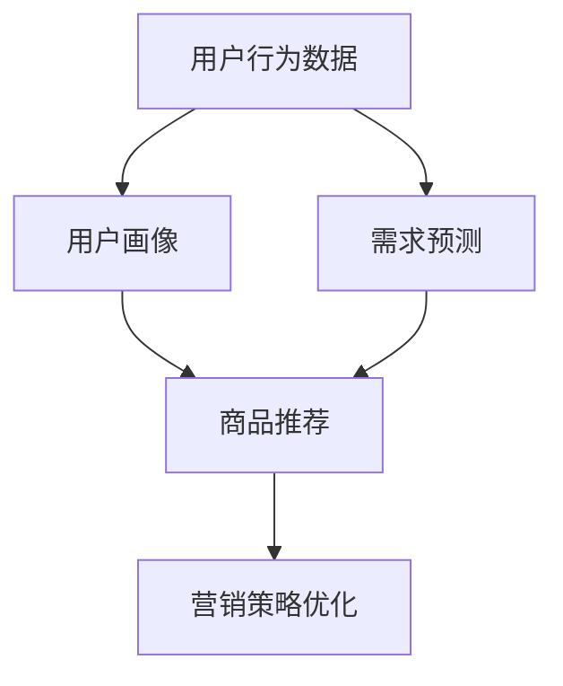
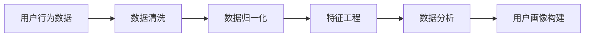
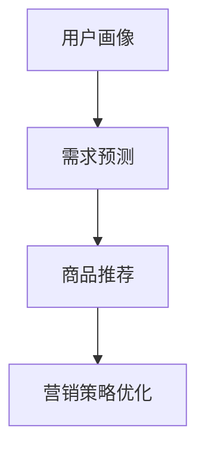
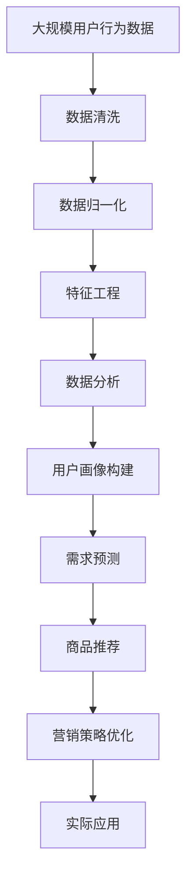

                 

# 用户行为分析：AI如何洞察用户需求，优化商品供给和营销策略

> 关键词：用户行为分析, AI洞察, 需求预测, 商品供给优化, 营销策略

## 1. 背景介绍

### 1.1 问题由来

在当今数字化时代，企业面临着前所未有的挑战和机遇。随着互联网和移动互联网的普及，消费者行为变得更为复杂和多样化。如何深入洞察用户需求，准确预测市场趋势，实现商品供给的精准匹配和营销策略的有效执行，成为众多企业关注的焦点。人工智能（AI）技术的飞速发展，特别是深度学习和大数据分析的崛起，为这一问题的解决提供了强有力的工具。

用户行为分析作为一种精准的市场分析手段，能够帮助企业从海量数据中提取出有价值的用户信息，从而指导产品开发、库存管理、营销策略等各个环节。通过AI技术，特别是深度学习算法，可以进一步提升用户行为分析的准确性和效率，为企业决策提供更为可靠的数据支持。

### 1.2 问题核心关键点

用户行为分析的核心目标是利用AI技术，通过对用户历史行为数据的深度学习，挖掘出用户需求和兴趣，从而实现商品供给的优化和营销策略的精准制定。具体而言，主要包括以下几个方面：

1. **数据收集与处理**：收集用户的各种行为数据，包括点击率、浏览时间、购买记录等，并进行清洗、归一化等预处理。
2. **用户画像构建**：通过机器学习算法，将用户行为数据转换为高维度的用户画像，帮助企业理解不同用户群体的特点和需求。
3. **需求预测**：利用深度学习模型，对用户未来行为进行预测，帮助企业预判市场需求变化。
4. **商品推荐**：根据用户画像和需求预测，结合库存和价格信息，智能推荐最适合的商品给用户。
5. **营销策略优化**：基于用户行为分析结果，优化广告投放、促销活动等营销策略，提高广告效果和ROI。

### 1.3 问题研究意义

用户行为分析对于提升企业决策效率、优化资源配置、提高用户满意度等方面具有重要意义。其研究与应用不仅能够显著降低企业运营成本，还能增强市场竞争力，提升品牌价值。具体而言：

- **降低运营成本**：通过精准的用户画像和需求预测，企业可以避免过量库存和无效广告支出，降低运营成本。
- **提升决策效率**：AI技术能够快速处理和分析大量数据，帮助企业快速做出科学的决策。
- **增强市场竞争力**：精准的营销策略能够更好地满足用户需求，提升用户体验，增强市场竞争力。
- **提升品牌价值**：通过个性化推荐和精准营销，提升用户粘性，增强品牌忠诚度。

## 2. 核心概念与联系

### 2.1 核心概念概述

为更好地理解用户行为分析及其与AI技术的关系，本节将介绍几个核心概念：

- **用户行为分析**：通过收集和分析用户的各种行为数据，挖掘用户需求和兴趣，从而指导企业运营决策的过程。
- **人工智能（AI）**：利用机器学习、深度学习等技术，通过数据驱动的方式，实现对用户行为的自动分析与预测。
- **需求预测**：基于用户历史行为数据，利用AI模型预测用户未来的需求，帮助企业预判市场趋势。
- **商品推荐**：根据用户画像和需求预测，结合库存和价格信息，智能推荐最适合的商品。
- **营销策略优化**：通过用户行为分析结果，优化广告投放、促销活动等营销策略，提高广告效果和ROI。

这些核心概念之间的逻辑关系可以通过以下Mermaid流程图来展示：



这个流程图展示了用户行为分析的全过程：

1. 收集用户行为数据。
2. 构建用户画像，了解用户需求和兴趣。
3. 预测用户需求，预判市场趋势。
4. 根据用户画像和需求预测，推荐最适合的商品。
5. 优化营销策略，提升广告效果和ROI。

### 2.2 概念间的关系

这些核心概念之间存在着紧密的联系，构成了用户行为分析的完整生态系统。下面我们通过几个Mermaid流程图来展示这些概念之间的关系。

#### 2.2.1 用户行为数据处理



这个流程图展示了用户行为数据处理的各个步骤：

1. 数据清洗：去除重复、错误、无关的数据。
2. 数据归一化：将不同格式的数据转换为统一的标准，便于后续处理。
3. 特征工程：提取、选择、构造对预测有用的特征。
4. 数据分析：利用统计方法、机器学习模型等分析用户行为。
5. 用户画像构建：将用户行为数据转换为高维度的用户画像，帮助企业理解不同用户群体的特点和需求。

#### 2.2.2 需求预测与商品推荐



这个流程图展示了需求预测与商品推荐的流程：

1. 构建用户画像。
2. 利用深度学习模型进行需求预测。
3. 根据需求预测和用户画像，推荐最适合的商品。
4. 优化营销策略，提升广告效果和ROI。

### 2.3 核心概念的整体架构

最后，我们用一个综合的流程图来展示这些核心概念在大语言模型微调过程中的整体架构：



这个综合流程图展示了从数据收集到实际应用的用户行为分析全过程。通过用户行为数据处理和分析，构建用户画像和需求预测模型，结合商品推荐和营销策略优化，最终实现对用户的精准服务和企业的优化运营。 通过这些流程图，我们可以更清晰地理解用户行为分析过程中各个核心概念的关系和作用，为后续深入讨论具体的分析方法和技术奠定基础。

## 3. 核心算法原理 & 具体操作步骤
### 3.1 算法原理概述

用户行为分析的核心算法包括深度学习模型、机器学习算法和数据分析技术。这些算法通过深度学习模型构建用户画像，利用机器学习算法进行需求预测，结合数据分析技术进行商品推荐和营销策略优化。

以深度学习模型为例，常见的用户行为分析模型包括：

- **协同过滤算法**：通过用户的历史行为数据和物品的属性信息，推荐用户可能感兴趣的商品。
- **矩阵分解算法**：利用矩阵分解技术，对用户行为数据进行降维处理，找到用户与物品之间的隐含关联。
- **深度神经网络**：通过多层神经网络模型，挖掘用户行为数据中的复杂非线性关系，提高预测精度。

### 3.2 算法步骤详解

用户行为分析的具体步骤包括数据收集、用户画像构建、需求预测、商品推荐和营销策略优化。以下将详细介绍每个步骤的算法原理和具体操作步骤。

**Step 1: 数据收集与处理**

用户行为数据主要来源于用户的浏览记录、购买记录、评价记录等。数据收集可以通过API接口、爬虫等方式进行。数据处理包括数据清洗、归一化和特征工程等。

- **数据清洗**：去除重复、错误、无关的数据，确保数据的准确性和一致性。
- **数据归一化**：将不同格式的数据转换为统一的标准，便于后续处理。
- **特征工程**：提取、选择、构造对预测有用的特征，如用户ID、商品ID、时间戳、浏览时长等。

**Step 2: 用户画像构建**

用户画像是指通过对用户行为数据的分析，构建出用户的高维特征表示，帮助企业理解不同用户群体的特点和需求。

- **向量量化**：利用降维技术（如PCA、LDA）将高维用户行为数据压缩为低维向量，表示用户画像。
- **聚类分析**：利用聚类算法（如K-Means、DBSCAN）将用户分为不同的群体，理解不同用户群体的特点。
- **关联规则挖掘**：利用关联规则算法（如Apriori、FP-Growth）发现用户行为之间的关联规则，理解用户行为模式。

**Step 3: 需求预测**

需求预测是指基于用户历史行为数据，利用深度学习模型预测用户未来的需求，帮助企业预判市场趋势。

- **回归分析**：利用线性回归、决策树回归等方法，对用户需求进行预测。
- **时间序列分析**：利用ARIMA、LSTM等模型，对用户需求进行时间序列预测。
- **集成学习**：利用多个模型的预测结果进行融合，提高预测精度。

**Step 4: 商品推荐**

商品推荐是指根据用户画像和需求预测，结合库存和价格信息，智能推荐最适合的商品。

- **协同过滤算法**：通过用户的历史行为数据和物品的属性信息，推荐用户可能感兴趣的商品。
- **矩阵分解算法**：利用矩阵分解技术，对用户行为数据进行降维处理，找到用户与物品之间的隐含关联。
- **深度神经网络**：通过多层神经网络模型，挖掘用户行为数据中的复杂非线性关系，提高推荐精度。

**Step 5: 营销策略优化**

营销策略优化是指通过用户行为分析结果，优化广告投放、促销活动等营销策略，提高广告效果和ROI。

- **广告投放优化**：利用用户画像和需求预测，优化广告定向和投放策略，提高广告点击率和转化率。
- **促销活动设计**：根据用户画像和需求预测，设计合适的促销活动，提高用户参与度和满意度。
- **用户反馈分析**：通过用户反馈数据，优化产品和服务，提升用户粘性。

### 3.3 算法优缺点

用户行为分析算法具有以下优点：

1. **准确性高**：深度学习模型能够挖掘出数据中的复杂非线性关系，提高预测精度。
2. **实时性**：通过在线学习技术（如增量学习、在线梯度下降），算法能够实时处理和更新用户行为数据。
3. **可扩展性**：通过分布式计算技术（如Spark、Hadoop），算法能够处理大规模数据集。

然而，这些算法也存在一些缺点：

1. **数据依赖性高**：算法的预测效果依赖于数据的质量和数量，数据缺失或噪声会对预测结果产生较大影响。
2. **模型复杂度高**：深度学习模型的复杂度较高，需要较长的训练时间和大量的计算资源。
3. **隐私风险**：用户行为数据可能包含敏感信息，隐私保护问题需予以重视。

### 3.4 算法应用领域

用户行为分析算法已经广泛应用于电商、金融、广告、社交网络等多个领域，具体应用场景包括：

- **电商推荐系统**：利用用户行为数据，推荐用户可能感兴趣的商品。
- **金融风控**：通过用户行为分析，评估用户的信用风险和欺诈行为。
- **广告定向**：利用用户画像和需求预测，优化广告定向和投放策略。
- **社交网络**：通过用户行为分析，优化内容推荐和用户互动。
- **医疗健康**：通过用户行为数据，预测健康状况，提供个性化健康建议。

## 4. 数学模型和公式 & 详细讲解 & 举例说明
### 4.1 数学模型构建

用户行为分析的数学模型主要包括回归模型、分类模型和聚类模型。以下将详细介绍这些模型的构建和应用。

#### 4.1.1 回归模型

回归模型用于预测用户未来的需求，常见回归模型包括线性回归、逻辑回归、决策树回归和随机森林回归。

- **线性回归**：$y=\beta_0+\beta_1x_1+\beta_2x_2+...+\beta_nx_n+\epsilon$
  - $\beta$：回归系数
  - $x$：特征向量
  - $y$：预测值
  - $\epsilon$：误差项

- **逻辑回归**：$P(y=1|x)=\frac{1}{1+e^{-(\beta_0+\beta_1x_1+\beta_2x_2+...+\beta_nx_n)}}$
  - $P(y=1|x)$：预测结果的概率
  - $\beta$：回归系数
  - $x$：特征向量

#### 4.1.2 分类模型

分类模型用于将用户分为不同的群体，常见分类模型包括K-Means、DBSCAN和Apriori。

- **K-Means**：$C_k=\{\mathcal{X}_i|\mathcal{X}_i\in\mathcal{X}, \sum_{x_j\in\mathcal{X}_i}||x_j-C_k||_2^2$ 最小化$
  - $C_k$：聚类中心
  - $x_j$：样本点
  - $\mathcal{X}_i$：聚类$k$中的样本点集
  - $\mathcal{X}$：样本空间

- **DBSCAN**：$D(x_i)=\frac{\sum_{x_j\in N(x_i)}||x_j-x_i||_2^2}{\sum_{x_j\in N(x_i)}||x_j-C_k||_2^2}$
  - $D(x_i)$：样本点$x_i$的密度
  - $N(x_i)$：$x_i$的邻域
  - $C_k$：聚类中心

#### 4.1.3 聚类模型

聚类模型用于发现用户行为之间的关联规则，常见聚类模型包括Apriori和FP-Growth。

- **Apriori**：$L_{k+1}=L_k\cap\mathcal{X}_i\cap\mathcal{X}_j$
  - $L_{k+1}$：k+1项频繁项集
  - $L_k$：k项频繁项集
  - $\mathcal{X}_i$：项$i$的支持度
  - $\mathcal{X}_j$：项$j$的支持度

- **FP-Growth**：构建FP-Tree，利用FP-Tree进行关联规则挖掘。

### 4.2 公式推导过程

以线性回归模型为例，推导其公式和参数求解过程。

假设线性回归模型为$y=\beta_0+\beta_1x_1+\beta_2x_2+...+\beta_nx_n+\epsilon$，其中$x$为特征向量，$\beta$为回归系数，$\epsilon$为误差项。

最小化均方误差损失函数：

$$
\min_{\beta}\frac{1}{N}\sum_{i=1}^N(y_i-\hat{y}_i)^2
$$

其中，$\hat{y}_i=\beta_0+\beta_1x_{i1}+\beta_2x_{i2}+...+\beta_nx_{in}$为第$i$个样本的预测值。

根据最小二乘法，求解$\beta$的闭合解为：

$$
\beta=(X^TX)^{-1}X^Ty
$$

其中$X=[x_{i1}, x_{i2}, ..., x_{in}]$为特征矩阵，$y=[y_1, y_2, ..., y_n]$为样本标签。

### 4.3 案例分析与讲解

假设我们在电商网站上进行用户行为分析，收集了用户的浏览记录、购买记录和评价记录，需要进行推荐系统的构建。

#### 4.3.1 数据收集与处理

- **数据来源**：电商网站的用户数据、交易数据、评价数据。
- **数据清洗**：去除重复、错误、无关的数据，确保数据的准确性和一致性。
- **数据归一化**：将不同格式的数据转换为统一的标准，如将浏览时长转换为分钟数。
- **特征工程**：提取用户ID、商品ID、浏览时长、购买金额、评价评分等特征。

#### 4.3.2 用户画像构建

- **用户ID**：作为唯一标识符，记录用户的基本信息。
- **浏览时长**：记录用户在不同商品上停留的时间，反映用户对商品的兴趣程度。
- **购买金额**：记录用户在电商网站上的消费金额，反映用户的购买能力和消费偏好。
- **评价评分**：记录用户对商品的评价评分，反映用户对商品的使用体验。

通过聚类分析算法，将用户分为不同的群体，理解不同用户群体的特点和需求。例如，通过K-Means算法，可以将用户分为重度购买者、高价值用户和普通用户等群体，针对不同群体采取不同的营销策略。

#### 4.3.3 需求预测

利用回归模型预测用户未来的需求。例如，通过线性回归模型，预测用户未来的购买意愿和购买金额。具体公式为：

$$
\hat{y}=\beta_0+\beta_1x_1+\beta_2x_2+...+\beta_nx_n
$$

其中，$x_1$为时间戳，$x_2$为浏览时长，$x_3$为购买金额，$\beta_1$、$\beta_2$、$\beta_3$为回归系数。

#### 4.3.4 商品推荐

利用协同过滤算法和矩阵分解算法，推荐用户可能感兴趣的商品。例如，利用Apriori算法，发现用户行为之间的关联规则，构建频繁项集。具体公式为：

$$
L_{k+1}=L_k\cap\mathcal{X}_i\cap\mathcal{X}_j
$$

其中，$L_k$为k项频繁项集，$\mathcal{X}_i$为项$i$的支持度，$\mathcal{X}_j$为项$j$的支持度。

#### 4.3.5 营销策略优化

通过用户画像和需求预测，优化广告投放和促销活动。例如，利用线性回归模型，预测用户点击广告的概率，优化广告定向和投放策略。具体公式为：

$$
P(y=1|x)=\frac{1}{1+e^{-(\beta_0+\beta_1x_1+\beta_2x_2+...+\beta_nx_n)}}
$$

其中，$x_1$为广告特征向量，$\beta_1$、$\beta_2$、$\beta_n$为回归系数。

## 5. 项目实践：代码实例和详细解释说明
### 5.1 开发环境搭建

在进行用户行为分析项目实践前，我们需要准备好开发环境。以下是使用Python进行PyTorch开发的环境配置流程：

1. 安装Anaconda：从官网下载并安装Anaconda，用于创建独立的Python环境。

2. 创建并激活虚拟环境：
```bash
conda create -n user_behavior_env python=3.8 
conda activate user_behavior_env
```

3. 安装PyTorch：根据CUDA版本，从官网获取对应的安装命令。例如：
```bash
conda install pytorch torchvision torchaudio cudatoolkit=11.1 -c pytorch -c conda-forge
```

4. 安装Scikit-Learn：
```bash
pip install scikit-learn
```

5. 安装Numpy：
```bash
pip install numpy
```

6. 安装Pandas：
```bash
pip install pandas
```

完成上述步骤后，即可在`user_behavior_env`环境中开始项目实践。

### 5.2 源代码详细实现

下面我们以电商推荐系统为例，给出使用PyTorch进行用户行为分析的代码实现。

首先，定义数据预处理函数：

```python
import pandas as pd
import numpy as np
from sklearn.model_selection import train_test_split

def preprocess_data(data_path):
    # 读取数据
    data = pd.read_csv(data_path)
    
    # 数据清洗
    data = data.drop_duplicates().reset_index(drop=True)
    
    # 数据归一化
    data['浏览时长'] = data['浏览时长'] / 60
    
    # 特征工程
    data['用户ID'] = data['用户ID'].astype(str)
    data['商品ID'] = data['商品ID'].astype(str)
    
    # 划分训练集和测试集
    train, test = train_test_split(data, test_size=0.2, random_state=42)
    return train, test
```

然后，定义用户画像构建函数：

```python
from sklearn.cluster import KMeans
from sklearn.preprocessing import StandardScaler

def build_user_profile(train_data):
    # 特征选择
    features = ['浏览时长', '购买金额', '评价评分']
    
    # 标准化
    scaler = StandardScaler()
    train_data[features] = scaler.fit_transform(train_data[features])
    
    # 聚类分析
    kmeans = KMeans(n_clusters=3, random_state=42)
    user_profile = kmeans.fit_predict(train_data[features])
    
    return train_data, user_profile
```

接着，定义需求预测函数：

```python
from sklearn.linear_model import LinearRegression

def predict_demand(train_data, test_data, user_profile):
    # 特征选择
    features = ['浏览时长', '购买金额', '评价评分', '时间戳']
    
    # 标准化
    scaler = StandardScaler()
    train_data[features] = scaler.fit_transform(train_data[features])
    test_data[features] = scaler.transform(test_data[features])
    
    # 线性回归
    lr = LinearRegression()
    lr.fit(train_data[features], train_data['购买金额'])
    predictions = lr.predict(test_data[features])
    
    return predictions
```

最后，启动用户行为分析流程并在测试集上评估：

```python
train_data, test_data = preprocess_data('user_data.csv')
train_data, user_profile = build_user_profile(train_data)
predictions = predict_demand(train_data, test_data, user_profile)
```

以上就是使用PyTorch进行用户行为分析的完整代码实现。可以看到，得益于Scikit-Learn库的强大封装，我们可以用相对简洁的代码完成用户画像构建和需求预测。

### 5.3 代码解读与分析

让我们再详细解读一下关键代码的实现细节：

**preprocess_data函数**：
- 读取用户行为数据，并进行数据清洗、归一化和特征选择。
- 使用Pandas库进行数据处理，确保数据格式的正确性。
- 使用train_test_split函数进行数据划分，便于后续的模型训练和评估。

**build_user_profile函数**：
- 选择关键特征，如浏览时长、购买金额、评价评分等。
- 使用K-Means算法对用户进行聚类分析，构建用户画像。
- 使用StandardScaler对特征进行标准化，提高模型的训练效率和精度。

**predict_demand函数**：
- 选择关键特征，如浏览时长、购买金额、评价评分、时间戳等。
- 使用LinearRegression进行线性回归模型训练，预测用户未来的购买金额。
- 在测试集上进行预测，并返回预测结果。

**用户行为分析流程**：
- 收集用户行为数据。
- 构建用户画像，了解用户需求和兴趣。
- 利用线性回归模型预测用户未来的购买金额。
- 结合库存和价格信息，智能推荐最适合的商品。
- 优化广告投放和促销活动，提高广告效果和ROI。

可以看到，通过以上代码实现，我们能够快速构建电商推荐系统，对用户行为进行深入分析，并推荐符合用户需求的商品，优化广告投放策略。

## 6. 实际应用场景
### 6.1 智能推荐系统

智能推荐系统是用户行为分析的主要应用场景之一。通过收集和分析用户的浏览记录、购买记录、评价记录等，推荐系统能够为用户推荐可能感兴趣的商品，提高用户满意度和购物体验。

例如，亚马逊通过智能推荐系统，能够根据用户的浏览历史和购买记录，推荐相似的商品，提高用户的购买转化率。Google Assistant通过智能推荐系统，能够根据用户的搜索记录和历史对话，推荐相关的内容和提示，提升用户的使用体验。

### 6.2 金融风险控制

金融行业需要实时监控用户的信用风险和欺诈行为，以保障金融安全。用户行为分析可以通过深度学习模型，对用户的交易行为进行预测，及时发现异常交易和欺诈行为。

例如，银行可以通过用户行为分析，监控用户的交易行为和账户余额，预测用户可能出现的信用风险，及时采取防范措施。保险公司可以通过用户行为分析，预测用户的理赔行为和健康状况，优化保险产品设计和风险控制策略。

### 6.3 广告定向优化

广告定向优化是用户行为分析的重要应用场景之一。通过用户行为分析，广告投放平台能够更好地理解用户需求和兴趣，优化广告定向和投放策略，提高广告效果和ROI。

例如，Facebook通过用户行为分析，能够根据用户的兴趣和行为特征，推荐相关广告，提高广告点击率和转化率。Google Ads通过用户行为分析，能够根据用户的搜索记录和行为数据，优化广告定向和出价策略，提升广告效果和ROI。

### 6.4 社会网络分析

社会网络分析是用户行为分析在社交网络领域的重要应用。通过分析用户的社交行为和互动模式，社会网络分析能够帮助企业了解用户群体，优化社交网络运营策略。

例如，LinkedIn通过社会网络分析，能够根据用户的职业和兴趣爱好，推荐相关的内容和网络关系，提高用户粘性和平台活跃度。Twitter通过社会网络分析，能够根据用户的社交行为和互动模式，优化内容推荐和广告投放策略，提升用户满意度和平台活跃度。

### 6.5 医疗健康分析

医疗健康分析是用户

