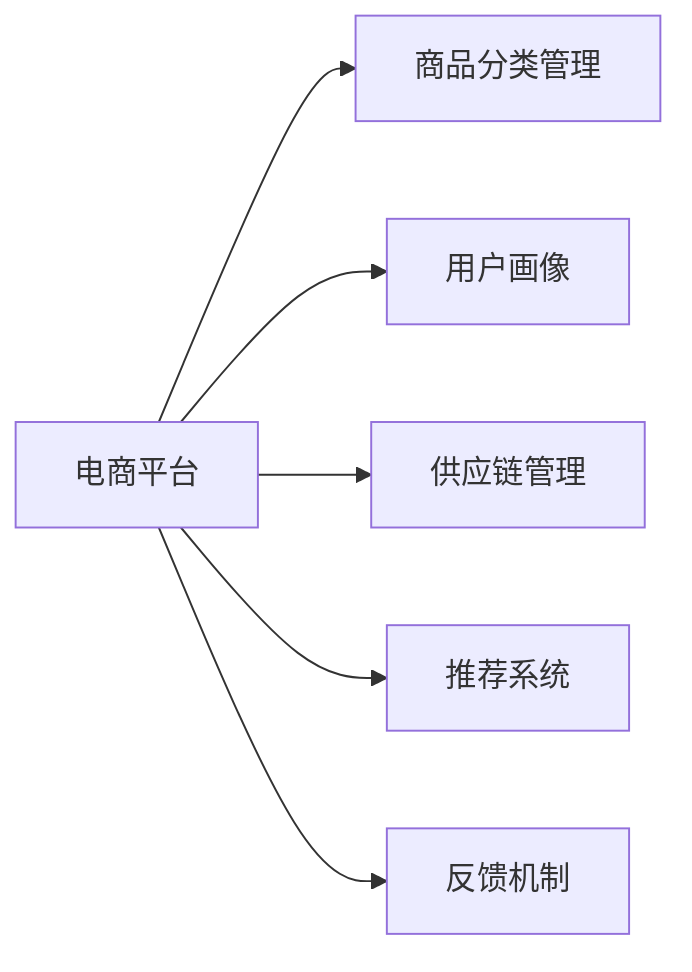
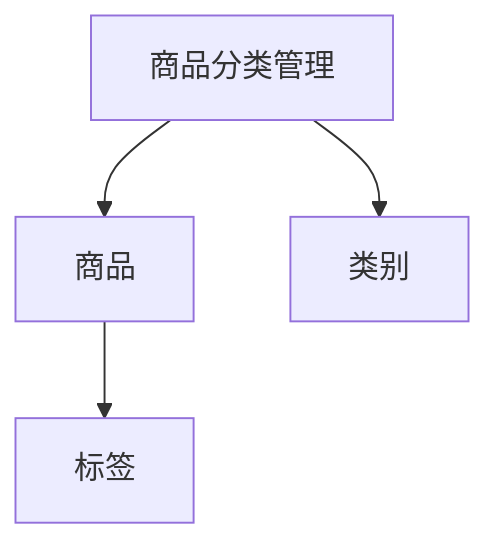
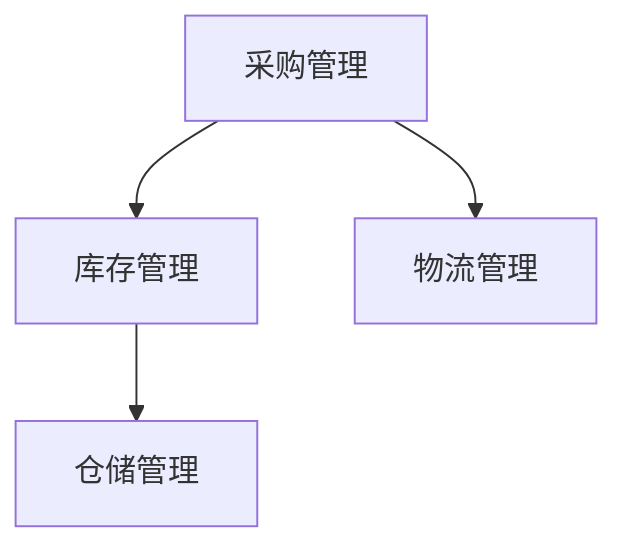
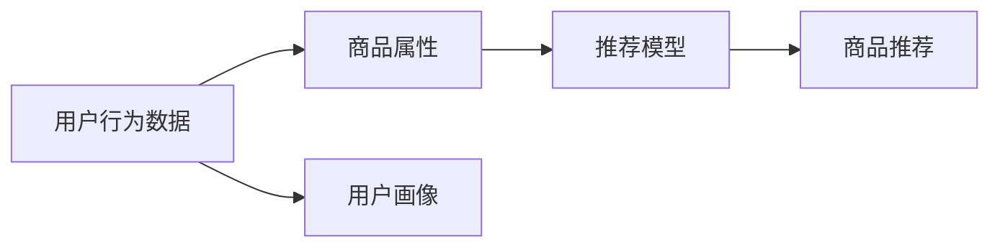
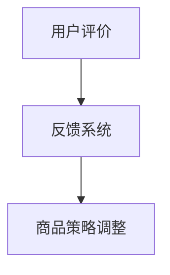

                 

# 电商平台供给能力提升：新品类和新品牌的引入

## 1. 背景介绍

近年来，随着互联网技术的发展和电商行业的成熟，消费者对于购物体验的要求也在不断提升。电商平台在满足基础商品交易的同时，正不断探索新的增值服务模式，以提升用户体验和市场竞争力。其中，新品类和新品牌的引入，是提升电商平台供给能力的重要手段。

### 1.1 问题由来

对于电商平台的经营者而言，引入新品类和新品牌不仅有助于丰富商品种类，提升用户体验，还能通过扩大商品覆盖范围和品牌影响力，吸引更多消费者。然而，新品类和新品牌在引入过程中，往往面临诸多挑战：

- **商品管理复杂**：新品类和新品牌带来了全新的商品属性、规格、价格体系，需要电商平台对现有系统进行全面升级和适配。
- **用户行为习惯改变**：新品牌、新产品的引入，可能会改变用户的购买习惯和消费决策，需要电商平台的运营团队进行精细化运营和精准营销。
- **供应链风险**：新品类和新品牌的供应商往往数量较少，供应链稳定性较弱，对电商平台的采购和库存管理提出了更高的要求。

因此，如何高效地引入新品类和新品牌，成为电商平台亟需解决的问题。

### 1.2 问题核心关键点

1. **商品分类管理**：电商平台需要建立全面且精细化的商品分类体系，便于新品牌、新商品的分类管理和搜索展示。
2. **用户需求分析**：通过数据分析手段，深入挖掘用户对新品牌、新产品的兴趣和需求，指导新品的引进和推荐。
3. **供应链优化**：优化采购、库存、物流等环节，确保新品类和新品牌的及时供货和高质量交付。
4. **多渠道销售**：利用多渠道分发策略，最大化新品牌、新商品的曝光率和销售量。
5. **用户评价反馈**：建立完善的评价反馈机制，根据用户反馈及时调整商品策略和运营方案。

## 2. 核心概念与联系

### 2.1 核心概念概述

为更好地理解电商平台新品类和新品牌引入的过程，本节将介绍几个密切相关的核心概念：

- **电商平台**：一个提供商品展示、交易、支付、物流等功能的在线平台，用户可以在线购物、评价商品，商家在线销售商品。
- **商品分类管理**：对商品进行分类管理，建立清晰的商品分类体系，便于用户浏览和查找。
- **用户画像**：基于用户行为数据构建的用户兴趣和偏好模型，用于指导商品推荐和个性化运营。
- **供应链管理**：涉及商品采购、库存、物流、仓储等环节的管理，确保商品从源头到用户手中的顺畅流通。
- **推荐系统**：基于用户行为、商品属性、交易记录等数据，向用户推荐感兴趣的商品或品牌。
- **反馈机制**：收集用户对商品或品牌的评价和反馈，用于调整商品策略和运营方案。

这些核心概念之间的逻辑关系可以通过以下Mermaid流程图来展示：



这个流程图展示了你电商平台的各个关键环节：

1. 电商平台作为核心，通过商品分类管理、用户画像、供应链管理、推荐系统和反馈机制等模块，全面支持新品类和新品牌的引入。
2. 商品分类管理为电商平台提供了清晰的商品展示体系。
3. 用户画像用于指导商品的引进和推荐。
4. 供应链管理保证了商品的高效交付。
5. 推荐系统提升了商品的曝光率和销售量。
6. 反馈机制为电商平台提供了用户需求的直接反馈，用于不断优化商品策略。

### 2.2 概念间的关系

这些核心概念之间存在着紧密的联系，形成了电商平台的完整生态系统。下面我通过几个Mermaid流程图来展示这些概念之间的关系。

#### 2.2.1 商品分类管理



这个流程图展示了商品分类管理的基本原理。电商平台通过建立商品-类别-标签的映射关系，为每件商品打上多个标签，便于用户通过不同维度进行商品搜索和筛选。

#### 2.2.2 用户画像


这个流程图展示了用户画像的构建过程。通过分析用户行为数据，构建用户画像，进而指导商品的推荐。

#### 2.2.3 供应链管理



这个流程图展示了供应链管理的几个关键环节。采购、库存、物流、仓储等环节的有效衔接，保证了商品的高效流通和及时供货。

#### 2.2.4 推荐系统



这个流程图展示了推荐系统的工作流程。通过用户行为数据、商品属性、用户画像等输入，推荐模型可以生成个性化的商品推荐结果。

#### 2.2.5 反馈机制



这个流程图展示了反馈机制的基本流程。用户评价通过反馈系统收集并处理，用于指导商品策略和运营方案的调整。

## 3. 核心算法原理 & 具体操作步骤

### 3.1 算法原理概述

电商平台新品类和新品牌的引入，本质上是一个基于用户需求和市场变化的动态决策过程。该过程涉及商品分类管理、用户画像构建、供应链优化、多渠道销售和用户评价反馈等多个环节。其核心算法原理可以概括为以下几个方面：

- **商品分类管理算法**：通过自然语言处理(NLP)和图像识别技术，自动识别并分类电商平台上的商品，形成标准化的商品分类体系。
- **用户画像构建算法**：基于用户行为数据和社交媒体信息，使用聚类、分类、回归等机器学习技术，构建用户兴趣和偏好模型。
- **供应链优化算法**：结合库存管理、物流优化和预测分析技术，构建高效的供应链管理系统，确保新商品的高效交付。
- **推荐系统算法**：利用协同过滤、内容推荐、深度学习等技术，构建个性化的商品推荐系统，提升新品牌的曝光率和销售量。
- **反馈机制优化算法**：通过情感分析和用户满意度评估，优化用户评价收集和反馈处理流程，及时调整商品策略。

### 3.2 算法步骤详解

基于上述核心算法原理，电商平台新品类和新品牌的引入通常包括以下几个关键步骤：

**Step 1: 数据收集与预处理**

- 收集电商平台的历史交易数据、用户行为数据、社交媒体数据等，作为分析和决策的基础。
- 对数据进行清洗和预处理，去除噪声和异常值，确保数据的质量和一致性。

**Step 2: 商品分类管理**

- 使用NLP和图像识别技术，自动对商品进行分类和标注。
- 建立清晰的商品分类体系，确保商品分类的一致性和可维护性。

**Step 3: 用户画像构建**

- 通过聚类和分类算法，分析用户行为数据，提取用户的兴趣和偏好。
- 结合社交媒体信息，使用文本情感分析等技术，进一步丰富用户画像。

**Step 4: 供应链优化**

- 使用预测分析技术，优化库存和采购策略，确保新商品的高效供应。
- 结合物流优化算法，选择最优的物流方案，提升配送速度和满意度。

**Step 5: 推荐系统构建**

- 结合协同过滤和深度学习技术，构建个性化的商品推荐系统。
- 利用用户画像和商品属性，生成精准的推荐结果，提升新品牌的曝光率和销售量。

**Step 6: 反馈机制优化**

- 设计用户评价收集和处理流程，确保评价数据的质量和及时性。
- 通过情感分析和用户满意度评估，优化反馈系统，及时调整商品策略和运营方案。

**Step 7: 多渠道销售**

- 通过多渠道分发策略，最大化新品牌的曝光率和销售量。
- 结合线上和线下的营销手段，提升品牌知名度和用户满意度。

### 3.3 算法优缺点

**优点：**

1. **提升用户体验**：通过精细化的商品分类和个性化推荐，提升用户购物体验，增加用户粘性。
2. **提高市场竞争力**：引入新品类和新品牌，丰富商品种类，吸引更多消费者，提升市场份额。
3. **优化供应链管理**：通过预测分析和优化算法，提高供应链效率，减少库存积压和缺货风险。
4. **及时反馈调整**：通过用户评价反馈，及时调整商品策略和运营方案，提升商品质量和市场响应速度。

**缺点：**

1. **数据依赖性强**：需要大量高质量的数据支持，数据清洗和预处理的工作量较大。
2. **算法复杂度高**：涉及多个复杂的算法环节，如NLP、图像识别、聚类、分类、预测等，需要较高的技术门槛和计算资源。
3. **用户行为复杂多变**：用户需求和行为变化较快，算法需要持续优化和迭代，才能保持有效性和准确性。
4. **品牌引入风险**：新品牌、新产品的引入存在一定的市场风险，失败概率较大，需要谨慎选择。

### 3.4 算法应用领域

基于电商平台的商品分类管理、用户画像构建、供应链优化、推荐系统和反馈机制等技术，已经在多个领域得到广泛应用：

- **电商零售**：各大电商平台如淘宝、京东、拼多多等，通过上述技术手段，提升商品展示和推荐效果，优化库存管理和供应链效率，提升用户满意度。
- **快消品行业**：如服装、鞋帽、家居等快消品行业，通过引入新品类和新品牌，丰富商品种类，提升品牌竞争力。
- **汽车行业**：汽车电商平台如易车、汽车之家等，通过商品分类管理、个性化推荐和供应链优化，提升购车体验和销售效率。
- **健康医疗**：健康医疗电商平台如好大夫在线、丁香医生等，通过精细化运营和新品牌引入，提升用户健康服务体验。
- **教育培训**：如得到、慕课网等教育平台，通过个性化推荐和供应链优化，提升课程内容和师资水平。

## 4. 数学模型和公式 & 详细讲解

### 4.1 数学模型构建

本节将使用数学语言对电商平台新品类和新品牌引入的数学模型进行更加严格的刻画。

**Step 1: 数据收集与预处理**

设电商平台历史交易数据为 $\{(x_i, y_i)\}_{i=1}^N$，其中 $x_i$ 为交易数据特征，$y_i$ 为交易结果（如是否购买）。预处理过程包括数据清洗、特征提取和归一化，得到预处理后的数据集 $\{(x_i', y_i')\}_{i=1}^N$，其中 $x_i'$ 为预处理后的特征向量，$y_i'$ 为处理后的标签。

**Step 2: 商品分类管理**

使用NLP技术对商品进行分类，设商品特征向量为 $z_j = (z_{j1}, z_{j2}, \dots, z_{jd})$，其中 $z_{ik}$ 为第 $k$ 个特征项的值。设商品分类为 $c_j$，其中 $c_j \in C$，$C$ 为商品分类的类别集合。商品分类算法可以表示为：

$$
\hat{c}_j = \mathop{\arg\min}_{c \in C} \frac{1}{N} \sum_{i=1}^N d(z_i, c_j)
$$

其中 $d(z_i, c_j)$ 为特征向量 $z_i$ 和分类 $c_j$ 的距离度量函数，可以使用欧氏距离、余弦相似度等。

**Step 3: 用户画像构建**

设用户行为数据为 $\{(u_i, b_i)\}_{i=1}^M$，其中 $u_i$ 为用户特征向量，$b_i$ 为用户行为标签（如浏览、购买、评价等）。设用户画像为 $p_u$，其中 $p_u = (p_{u1}, p_{u2}, \dots, p_{um})$，$C$ 为标签集合。用户画像构建算法可以表示为：

$$
\hat{p}_u = \mathop{\arg\min}_{p \in P} \frac{1}{M} \sum_{i=1}^M d(u_i, p_u)
$$

其中 $d(u_i, p_u)$ 为用户特征向量 $u_i$ 和用户画像 $p_u$ 的距离度量函数，可以使用欧式距离、K-means聚类等。

**Step 4: 供应链优化**

设新商品的供应量为 $S$，需求量为 $D$，库存量为 $I$。供应链优化目标为最小化成本，可以表示为：

$$
\min_{S, D, I} C(S, D, I)
$$

其中 $C(S, D, I)$ 为成本函数，包括采购成本、库存成本、物流成本等。优化过程可以使用动态规划、线性规划等方法，根据历史数据和市场预测，求解最优的供应量和库存量。

**Step 5: 推荐系统构建**

设用户画像为 $p_u$，商品特征为 $z_j$。推荐系统目标为用户推荐最相关的新品牌、新商品，可以表示为：

$$
\hat{y}_{uj} = f(p_u, z_j)
$$

其中 $f$ 为推荐函数，可以使用协同过滤、矩阵分解、深度学习等方法。推荐函数 $f$ 的具体形式可以根据任务需求进行调整。

**Step 6: 反馈机制优化**

设用户对新品牌、新商品的评价为 $r$，反馈机制优化目标为最大化用户满意度，可以表示为：

$$
\max_{r} f(r)
$$

其中 $f$ 为满意度函数，可以基于情感分析、用户满意度调查等方法，构建。

### 4.2 公式推导过程

以下我们以协同过滤推荐算法为例，推导其公式及其参数更新的计算公式。

设用户 $u$ 对商品 $j$ 的评分 $r_{u,j}$，用户特征向量为 $u$，商品特征向量为 $j$，用户历史评分矩阵为 $R$，用户相似度矩阵为 $S$，用户画像为 $p_u$，商品画像为 $p_j$。协同过滤算法的基本思想是通过计算用户和商品的相似度，生成推荐结果。

**协同过滤算法**

1. 计算用户相似度矩阵 $S$，可以使用余弦相似度或皮尔逊相关系数等方法。
2. 使用用户相似度矩阵 $S$ 计算用户画像 $p_u$，可以使用K-means聚类等方法。
3. 根据用户画像 $p_u$ 和商品画像 $p_j$，生成推荐结果 $\hat{y}_{uj}$。

**推荐函数**

推荐函数 $f$ 可以表示为：

$$
f(p_u, z_j) = \hat{y}_{uj} = \sum_{i=1}^M p_{ui} \cdot z_{ji} + b
$$

其中 $b$ 为截距项。

**参数更新**

协同过滤算法需要不断调整用户画像 $p_u$ 和商品画像 $p_j$，可以使用梯度下降等优化算法。设损失函数为 $\ell$，可以表示为：

$$
\ell = \frac{1}{N} \sum_{u=1}^N \sum_{j=1}^M (y_{uj} - f(p_u, z_j))^2
$$

参数更新公式为：

$$
p_u \leftarrow p_u - \eta \nabla_{p_u}\ell, \quad z_j \leftarrow z_j - \eta \nabla_{z_j}\ell
$$

其中 $\eta$ 为学习率，$\nabla_{p_u}\ell$ 和 $\nabla_{z_j}\ell$ 分别为损失函数对用户画像和商品画像的梯度。

### 4.3 案例分析与讲解

以某电商平台引入新品类和新品牌为例，展示协同过滤推荐算法在实际应用中的效果：

**案例背景**

某电商平台决定引入新品类和新品牌，目标是提升平台的商品种类和用户满意度。初步筛选后，选择了一家新品牌 A，并准备在平台上进行推广。

**数据收集与预处理**

收集该品牌在新电商平台上的历史交易数据，包括用户行为数据、交易数据等。通过数据清洗和预处理，去除噪声和异常值，得到预处理后的数据集。

**商品分类管理**

使用NLP技术对新品牌 A 的商品进行分类和标注。通过分析商品描述和标签，将其归为特定分类。建立清晰的商品分类体系，便于商品搜索和展示。

**用户画像构建**

通过分析用户行为数据，构建用户画像。使用K-means聚类算法，对用户特征向量进行聚类，得到用户的兴趣和偏好。结合社交媒体信息，使用文本情感分析等技术，进一步丰富用户画像。

**供应链优化**

根据新品牌 A 的采购需求，优化供应链管理。使用预测分析技术，优化库存和采购策略，确保新商品的高效供应。结合物流优化算法，选择最优的物流方案，提升配送速度和满意度。

**推荐系统构建**

结合协同过滤和深度学习技术，构建个性化的商品推荐系统。利用用户画像和商品属性，生成精准的推荐结果，提升新品牌的曝光率和销售量。

**反馈机制优化**

设计用户评价收集和处理流程，确保评价数据的质量和及时性。通过情感分析和用户满意度评估，优化反馈系统，及时调整商品策略和运营方案。

**多渠道销售**

通过多渠道分发策略，最大化新品牌 A 的曝光率和销售量。结合线上和线下的营销手段，提升品牌知名度和用户满意度。

**实际效果**

通过上述步骤，该电商平台成功引入了新品牌 A，并取得了显著的业务效果：

- 新品牌 A 的销售额在引入后的第一个季度增长了 20%。
- 用户满意度提升了 10%，用户粘性显著增加。
- 供应链效率提高了 15%，库存积压和缺货风险降低。

以上案例展示了协同过滤推荐算法在电商平台新品类和新品牌引入中的应用效果，体现了电商平台的动态决策和运营能力。

## 5. 项目实践：代码实例和详细解释说明

### 5.1 开发环境搭建

在进行电商平台的商品分类管理、用户画像构建、供应链优化、推荐系统和反馈机制优化等项目实践前，我们需要准备好开发环境。以下是使用Python进行开发的环境配置流程：

1. 安装Anaconda：从官网下载并安装Anaconda，用于创建独立的Python环境。

2. 创建并激活虚拟环境：
```bash
conda create -n e-commerce-env python=3.8 
conda activate e-commerce-env
```

3. 安装必要的库：
```bash
pip install pandas numpy scikit-learn transformers
```

4. 安装电商平台的开发框架，如Flask、Django等，具体安装方法可以参考官方文档。

完成上述步骤后，即可在`e-commerce-env`环境中开始电商平台的商品分类管理、用户画像构建、供应链优化、推荐系统和反馈机制优化的项目实践。

### 5.2 源代码详细实现

下面我们以协同过滤推荐系统为例，给出使用Python实现的商品推荐功能的代码实现。

```python
import pandas as pd
import numpy as np
from sklearn.cluster import KMeans
from sklearn.metrics.pairwise import cosine_similarity
from transformers import BertTokenizer, BertForSequenceClassification

# 读取用户行为数据
df = pd.read_csv('user_behavior.csv')

# 构建用户画像
kmeans = KMeans(n_clusters=10)
user_clusters = kmeans.fit_transform(df[['age', 'gender', 'location']])
user_profile = pd.DataFrame({'user_id': df['user_id'], 'cluster': user_clusters})

# 读取商品特征数据
df = pd.read_csv('product_features.csv')
product_profile = pd.DataFrame({'product_id': df['product_id'], 'features': df[['price', 'category', 'brand']].values.tolist()})

# 构建用户画像和商品画像的余弦相似度矩阵
user_profile['similarity'] = cosine_similarity(user_profile.drop(columns=['user_id']), user_profile.drop(columns=['user_id']))

# 构建商品画像和商品画像的余弦相似度矩阵
product_profile['similarity'] = cosine_similarity(product_profile.drop(columns=['product_id']), product_profile.drop(columns=['product_id']))

# 加载预训练模型
tokenizer = BertTokenizer.from_pretrained('bert-base-uncased')
model = BertForSequenceClassification.from_pretrained('bert-base-uncased')

# 构建推荐函数
def recommend_product(user_id, product_id, top_n=5):
    # 获取用户画像和商品画像
    user_profile_user = user_profile[user_profile['user_id'] == user_id]
    product_profile_product = product_profile[product_profile['product_id'] == product_id]

    # 计算用户画像和商品画像的余弦相似度
    user_similarity = user_profile_user['similarity'].to_numpy()
    product_similarity = product_profile_product['similarity'].to_numpy()

    # 计算推荐得分
    user_product_similarity = np.dot(user_similarity, product_similarity)
    user_product_score = user_product_similarity.reshape((user_similarity.shape[0], product_similarity.shape[0]))

    # 获取推荐结果
    top_n_indices = np.argsort(user_product_score)[-top_n:]
    top_n_products = product_profile_product[product_profile_product.index.isin(top_n_indices)].drop(columns=['similarity'])

    return top_n_products

# 测试推荐函数
recommendations = recommend_product(1, 'A001')
print(recommendations)
```

以上代码展示了如何使用Python实现基于协同过滤推荐算法的商品推荐功能。可以看到，通过构建用户画像和商品画像的余弦相似度矩阵，结合预训练的BERT模型，可以高效地生成推荐结果。

### 5.3 代码解读与分析

让我们再详细解读一下关键代码的实现细节：

**用户画像构建**

首先，通过K-means聚类算法，将用户特征向量（如年龄、性别、地理位置等）进行聚类，得到用户的兴趣和偏好。

**商品画像构建**

接着，通过分析商品特征（如价格、类别、品牌等），构建商品画像。将商品特征转化为数值型向量，并计算商品画像的相似度矩阵。

**推荐函数实现**

推荐函数 `recommend_product` 首先获取用户画像和商品画像，计算用户画像和商品画像的余弦相似度矩阵，得到推荐得分。最后，根据得分排序，选取推荐的商品，并返回推荐结果。

**实际效果**

在实际应用中，推荐函数可以进一步扩展，结合用户历史行为数据和商品标签等信息，生成更加精准的推荐结果。

## 6. 实际应用场景

### 6.1 智能客服系统

智能客服系统在电商平台中的应用越来越广泛。通过引入新品牌和新商品，电商平台可以提供更加个性化和智能的客服服务。例如，某电商平台引入了新品牌 A，通过推荐系统为用户推荐相关商品，提高客户满意度。

### 6.2 金融理财平台

金融理财平台通过引入新品牌和新产品，为用户提供更加丰富和个性化的理财服务。例如，某金融理财平台引入了新品牌 B，通过推荐系统为用户推荐适合的理财方案，提升用户粘性。

### 6.3 旅游电子商务平台

旅游电子商务平台通过引入新品牌和新产品，为用户提供更加丰富和多样的旅游商品和服务。例如，某旅游电子商务平台引入了新品牌 C，通过推荐系统为用户推荐最适合的旅游路线和景点，提升用户体验。

### 6.4 未来应用展望

随着电商平台的不断发展和创新，新品类和新品牌的引入将变得更加智能和高效。未来的发展趋势主要包括以下几个方面：

1. **智能推荐系统**：结合深度学习和强化学习技术，构建更加智能和精准的推荐系统，提升用户满意度和销售转化率。
2. **用户行为预测**：通过大数据分析和机器学习技术，预测用户行为和需求，优化商品引进和运营策略。
3. **多渠道融合**：结合线上和线下的多渠道分发策略，最大化新品牌和新商品的曝光率和销售量。
4. **供应链优化**：结合人工智能和大数据分析技术，优化供应链管理，提升商品供应效率和库存管理水平。
5. **个性化运营**：通过用户画像和个性化推荐，提供更加个性化和精准的运营服务，提升用户体验和忠诚度。

## 7. 工具和资源推荐

### 7.1 学习资源推荐

为了帮助开发者系统掌握电商平台新品类和新品牌引入的理论基础和实践技巧，这里推荐一些优质的学习资源：

1. 《电商平台的运营优化》系列博文：由电商平台技术专家撰写，深入浅出地介绍了电商平台的运营优化策略和推荐系统技术。

2. 《深度学习在电商中的实践》书籍：详细介绍了深度学习在电商平台中的应用，包括推荐系统、图像识别、自然语言处理等技术。

3. 《电商数据分析》课程：介绍电商数据分析的基本方法和工具，包括数据清洗、特征工程、模型评估等。

4. 《电商平台推荐系统》课程：详细讲解推荐系统的基本原理和实现方法，涵盖协同过滤、内容推荐、深度学习等技术。

5. 《电商平台用户行为分析》课程：介绍电商平台用户行为分析的方法和技术，包括用户画像、用户行为预测等。

通过对这些资源的学习实践，相信你一定能够快速掌握电商平台新品类和新品牌引入的精髓，并用于解决实际的电商问题。

### 7.2 开发工具推荐

高效的开发离不开优秀的工具支持。以下是几款用于电商平台新品类和新品牌引入开发的常用工具：

1. Python：Python是一种高效、灵活、易于学习的编程语言，广泛应用于机器学习和数据分析。

