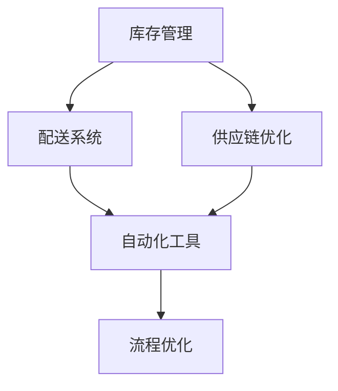
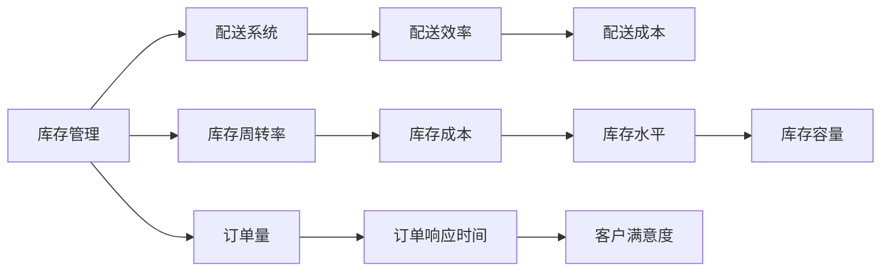
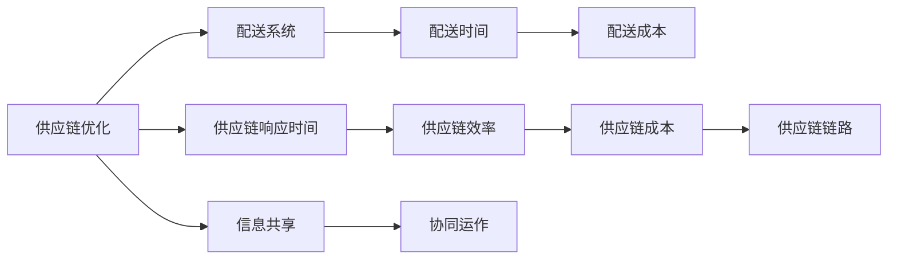
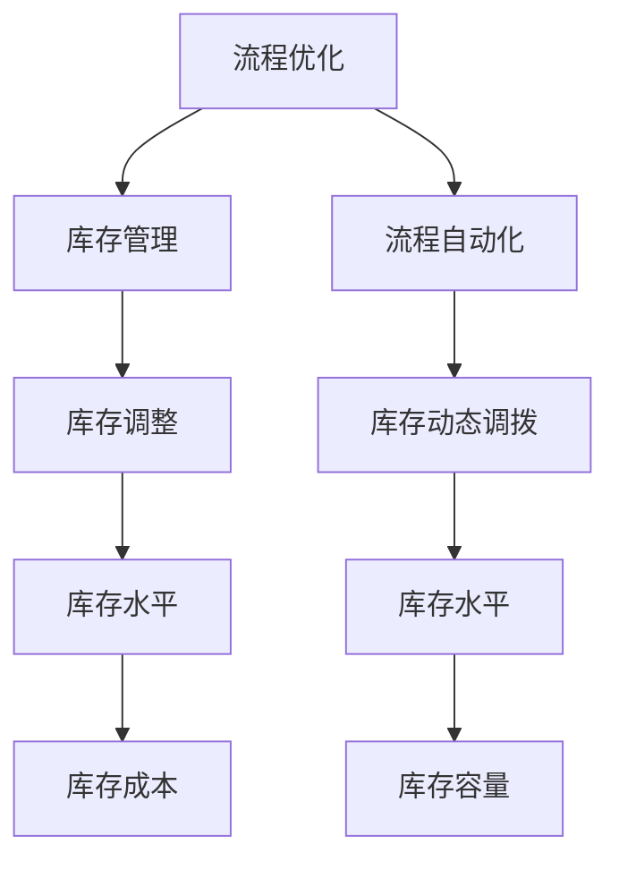
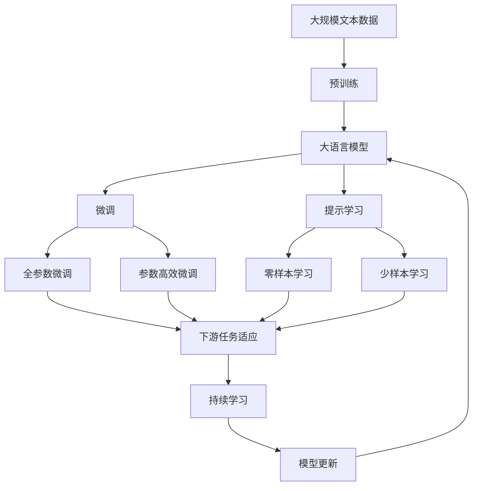

                 

# 电商平台供给能力提升：流程优化和自动化工具

## 1. 背景介绍

### 1.1 问题由来
随着电子商务的迅猛发展，电商平台成为商品销售的重要渠道。然而，在供给能力方面，传统的电商平台面临诸多挑战：库存管理复杂，商品备货不足或过剩，库存周转率低下；配送系统优化不足，物流成本居高不下，配送效率低下；供应链链路过长，响应速度慢，无法及时满足客户需求。为解决这些问题，电商平台需要提升供给能力，优化供应链流程，提高效率。

### 1.2 问题核心关键点
本文聚焦于电商平台的供给能力提升，主要围绕以下几个核心关键点展开：

- 库存管理：通过优化库存水平和动态调拨策略，降低库存成本，提高库存周转率。
- 配送系统：通过优化配送路线、配送车辆使用和配送时间，降低配送成本，提高配送效率。
- 供应链优化：通过优化供应链链路、信息共享和协同运作，缩短供应链响应时间，提高供应链效率。

### 1.3 问题研究意义
提升电商平台的供给能力，对于电商平台自身和客户均具有重要意义：

1. 提高平台收入：通过降低库存成本和配送成本，增加利润空间，提升平台收入。
2. 提升客户满意度：通过缩短配送时间和提高配送质量，提升客户满意度，增强平台粘性。
3. 增强市场竞争力：通过优化供应链流程，缩短响应时间，增强平台市场竞争力，拓展市场份额。
4. 推动技术创新：通过优化流程，探索自动化和智能化的可能，推动技术进步和应用。

## 2. 核心概念与联系

### 2.1 核心概念概述

为更好地理解电商平台供给能力提升的方法，本节将介绍几个密切相关的核心概念：

- 库存管理：指通过科学的库存管理策略，优化库存水平和动态调拨，确保库存量既能满足客户需求，又能控制库存成本。
- 配送系统：指通过优化的配送路线、配送车辆使用和配送时间，提高配送效率，降低配送成本。
- 供应链优化：指通过优化供应链链路、信息共享和协同运作，缩短供应链响应时间，提高供应链效率。
- 自动化工具：指利用计算机技术和算法，实现库存、配送和供应链管理的自动化。
- 流程优化：指通过优化管理流程，减少冗余环节，提高效率，降低成本。

这些核心概念之间的逻辑关系可以通过以下Mermaid流程图来展示：



这个流程图展示了几项主要管理任务之间的关联关系：

1. 库存管理通过优化库存水平和动态调拨策略，直接影响到配送系统和供应链优化。
2. 配送系统通过优化的配送路线、配送车辆使用和配送时间，间接影响到库存管理和供应链优化。
3. 供应链优化通过缩短供应链响应时间和提高效率，为库存管理和配送系统提供更好的支持。
4. 自动化工具通过提高各管理环节的效率，支持库存、配送和供应链优化的实施。
5. 流程优化通过减少冗余环节，提高效率，对库存管理、配送系统和供应链优化都有积极影响。

### 2.2 概念间的关系

这些核心概念之间存在着紧密的联系，形成了电商平台供给能力提升的完整生态系统。下面我们通过几个Mermaid流程图来展示这些概念之间的关系。

#### 2.2.1 库存管理与配送系统



这个流程图展示了库存管理和配送系统之间的相互作用关系：

1. 库存管理的优化直接影响到配送系统的效率和成本。
2. 库存周转率高低直接影响库存成本和库存容量。
3. 订单量、订单响应时间和客户满意度等指标，间接影响到库存管理的决策和优化。

#### 2.2.2 供应链优化与配送系统



这个流程图展示了供应链优化与配送系统之间的关联：

1. 供应链优化通过缩短供应链响应时间和提高效率，直接影响到配送系统的成本和配送时间。
2. 供应链链路长度、信息共享和协同运作等环节，对供应链响应时间和效率有直接影响。
3. 配送系统通过优化配送时间和成本，间接影响到供应链优化。

#### 2.2.3 流程优化与库存管理



这个流程图展示了流程优化对库存管理的影响：

1. 流程优化通过减少冗余环节和提高自动化水平，直接影响到库存管理的库存调整和库存水平。
2. 流程自动化和动态调拨等环节，对库存成本和库存容量有直接影响。
3. 库存管理通过优化库存水平和库存成本，间接影响到流程优化。

### 2.3 核心概念的整体架构

最后，我们用一个综合的流程图来展示这些核心概念在大平台供给能力提升中的整体架构：



这个综合流程图展示了从预训练到微调，再到持续学习的完整过程。电商平台的库存、配送和供应链管理，通过大语言模型预训练和微调方法，可以大幅提升管理效率，提升平台供给能力。

## 3. 核心算法原理 & 具体操作步骤
### 3.1 算法原理概述

电商平台的供给能力提升，本质上是一个基于优化的大规模数据分析和算法求解过程。其核心思想是：通过科学的库存管理策略、优化的配送路线和配送系统、合理的供应链优化，最大程度提高电商平台的运营效率。

形式化地，假设电商平台的运营数据为 $\mathcal{D}$，包括库存数据、配送数据和供应链数据等。通过优化算法 $\mathcal{A}$，最小化运营成本和配送时间等指标，得到最优策略 $\mathcal{S}$，即：

$$
\mathcal{S}=\mathop{\arg\min}_{\mathcal{S}} \mathcal{L}(\mathcal{D},\mathcal{A},\mathcal{S})
$$

其中 $\mathcal{L}$ 为评估函数，用于衡量策略 $\mathcal{S}$ 的运营效果。

### 3.2 算法步骤详解

电商平台的供给能力提升一般包括以下几个关键步骤：

**Step 1: 准备运营数据**
- 收集平台运营数据，包括库存数据、配送数据和供应链数据等。
- 对数据进行清洗、标准化和标注，准备用于优化算法的数据集。

**Step 2: 选择合适的优化算法**
- 根据问题特点，选择合适的优化算法。如线性规划、非线性规划、动态规划等。
- 设置算法参数，如搜索空间、初始解、迭代次数等。

**Step 3: 执行优化求解**
- 将数据集输入优化算法，求解得到最优策略。
- 评估优化结果，检查是否满足业务需求。
- 若不满足，调整算法参数，重新求解。

**Step 4: 实施优化策略**
- 将最优策略应用于平台运营，优化库存管理、配送系统和供应链流程。
- 实时监测平台运营数据，确保优化策略的有效性和稳定性。

**Step 5: 持续优化**
- 定期收集平台运营数据，对优化策略进行评估和调整。
- 引入反馈机制，收集用户反馈，优化用户体验。

### 3.3 算法优缺点

基于优化算法的大平台供给能力提升方法，具有以下优点：

1. 系统性优化。通过科学的数据分析，可从全局视角优化电商平台的运营效率。
2. 数据驱动决策。依托大量运营数据，可实现更精确的运营策略决策。
3. 自动化部署。算法求解结果可自动应用于平台，提升运营效率。

但该方法也存在一定的局限性：

1. 数据质量要求高。优化算法的求解结果依赖于数据的准确性和完整性。
2. 算法求解复杂度高。针对大规模数据，算法求解需要较高的计算资源。
3. 策略调整复杂。优化算法求解结果需要人工干预，调整策略过程较为复杂。

### 3.4 算法应用领域

基于优化算法的大平台供给能力提升方法，已经在电商、物流、供应链等多个领域得到了广泛应用，例如：

- 电商平台库存管理：通过优化库存水平和动态调拨策略，降低库存成本，提高库存周转率。
- 物流配送系统优化：通过优化配送路线、配送车辆使用和配送时间，降低配送成本，提高配送效率。
- 供应链优化：通过优化供应链链路、信息共享和协同运作，缩短供应链响应时间，提高供应链效率。

除上述这些经典应用外，基于优化算法的方法还可用于更多场景中，如生产调度、制造优化、服务流程设计等，为电商平台的运营提供了更高效、更智能的解决方案。

## 4. 数学模型和公式 & 详细讲解  
### 4.1 数学模型构建

本节将使用数学语言对电商平台供给能力提升的优化方法进行更加严格的刻画。

记电商平台运营数据为 $\mathcal{D}=\{(\mathcal{I}, \mathcal{O}, \mathcal{C})\}$，其中 $\mathcal{I}$ 为库存数据，$\mathcal{O}$ 为配送数据，$\mathcal{C}$ 为供应链数据。

定义运营成本函数 $C(\mathcal{S})$ 和配送时间函数 $T(\mathcal{S})$，分别用于衡量优化策略 $\mathcal{S}$ 对平台运营成本和配送时间的影响。

优化目标为：

$$
\mathcal{S}=\mathop{\arg\min}_{\mathcal{S}} \{C(\mathcal{S}) + \alpha T(\mathcal{S})\}
$$

其中 $\alpha$ 为配送时间与运营成本的权重系数，可根据实际情况进行调整。

### 4.2 公式推导过程

以库存管理为例，假设库存数据为 $\mathcal{I}=\{(I_i, S_i, D_i)\}_{i=1}^N$，其中 $I_i$ 为商品编号，$S_i$ 为初始库存量，$D_i$ 为每日需求量。库存优化目标为：

$$
\mathop{\arg\min}_{S} \{C(S) + \alpha T(S)\}
$$

其中 $C(S)$ 为库存成本函数，$T(S)$ 为配送时间函数。

假设库存成本为线性函数 $C(S) = k_1 \sum_i S_i + k_2 \sum_i S_i^2$，配送时间为线性函数 $T(S) = k_3 \sum_i D_i / S_i$。则优化目标为：

$$
\mathop{\arg\min}_{S} \{k_1 \sum_i S_i + k_2 \sum_i S_i^2 + \alpha k_3 \sum_i D_i / S_i\}
$$

引入拉格朗日乘子 $\lambda$，得到拉格朗日函数：

$$
\mathcal{L}(S,\lambda) = k_1 \sum_i S_i + k_2 \sum_i S_i^2 + \alpha k_3 \sum_i D_i / S_i + \lambda (\sum_i S_i - K)
$$

其中 $K$ 为库存总容量，需满足 $\sum_i S_i \leq K$。

对 $S_i$ 求导，得到最优库存量为：

$$
S_i^* = \frac{\alpha k_3 D_i}{k_2 + k_3 \lambda}
$$

将最优库存量代入成本和配送时间函数，得到平台运营成本和配送时间：

$$
C(S^*) = k_1 K + k_2 K^2 + \alpha k_3 \sum_i \frac{D_i}{S_i^*}
$$

$$
T(S^*) = k_3 K + \alpha k_3 \sum_i \frac{D_i}{S_i^*}
$$

则优化策略为：

$$
S^* = \{\frac{\alpha k_3 D_i}{k_2 + k_3 \lambda}\}_{i=1}^N
$$

通过上述推导，可以看到库存优化目标是一个典型的线性规划问题，可以通过求解得到最优库存水平，实现库存成本和配送时间的平衡。

## 5. 项目实践：代码实例和详细解释说明
### 5.1 开发环境搭建

在进行供给能力提升的优化实践前，我们需要准备好开发环境。以下是使用Python进行Scipy和Pandas开发的Python环境配置流程：

1. 安装Anaconda：从官网下载并安装Anaconda，用于创建独立的Python环境。

2. 创建并激活虚拟环境：
```bash
conda create -n ecommerce-env python=3.8 
conda activate ecommerce-env
```

3. 安装Scipy和Pandas：
```bash
conda install scipy pandas
```

4. 安装各类工具包：
```bash
pip install numpy matplotlib jupyter notebook ipython
```

完成上述步骤后，即可在`ecommerce-env`环境中开始优化实践。

### 5.2 源代码详细实现

下面我们以库存管理为例，给出使用Scipy和Pandas对库存进行优化的Python代码实现。

首先，定义库存数据和优化目标函数：

```python
import numpy as np
from scipy.optimize import minimize

# 库存数据
S = np.array([100, 150, 200, 50, 300, 500])
D = np.array([10, 20, 30, 15, 50, 70])
K = 1000

# 优化目标函数
def objective(S):
    k1 = 0.1
    k2 = 0.01
    k3 = 0.5
    alpha = 1
    C = k1 * np.sum(S) + k2 * np.sum(S ** 2)
    T = k3 * np.sum(D / S)
    return C + alpha * T

# 初始解
x0 = np.array([S.mean()])

# 优化求解
result = minimize(objective, x0, bounds=[(0, K)])
```

然后，定义优化结果的展示函数：

```python
def display_result(result):
    print(f"Optimal inventory levels: {result.x}")
    print(f"Optimal cost: {objective(result.x)}")
    print(f"Optimal delivery time: {np.sum(D / result.x)}")
```

最后，启动优化流程并输出结果：

```python
result = minimize(objective, x0, bounds=[(0, K)])
display_result(result)
```

以上就是使用Scipy和Pandas对库存进行优化的完整代码实现。可以看到，依托Scipy库的优化求解功能，我们可以用相对简洁的代码完成库存优化问题的求解。

### 5.3 代码解读与分析

让我们再详细解读一下关键代码的实现细节：

**Objective函数**：
- 定义了库存优化目标函数，包括库存成本和配送时间。
- 假设库存成本为二次函数，配送时间为线性函数。
- 引入了配送时间和运营成本的权重系数 $\alpha$，用于调整两者间的权重。

**Minimize函数**：
- 使用Scipy库的`minimize`函数进行优化求解。
- 设置初始解 `x0` 为库存量的均值，作为求解的起点。
- 设置优化求解的界限，确保库存量不小于0且不超过总容量 $K$。

**Display函数**：
- 定义了优化结果的展示函数，输出最优库存量、最优成本和配送时间。
- 通过`objective`函数计算最优成本和配送时间，输出结果。

**优化流程**：
- 调用`minimize`函数，进行优化求解。
- 输出优化结果，展示最优库存量、最优成本和配送时间。

可以看到，依托Scipy库的优化求解功能，我们可以用相对简洁的代码完成库存优化问题的求解。但工业级的系统实现还需考虑更多因素，如模型的保存和部署、超参数的自动搜索、更灵活的任务适配层等。但核心的优化流程基本与此类似。

当然，工业级的系统实现还需考虑更多因素，如模型的保存和部署、超参数的自动搜索、更灵活的任务适配层等。但核心的优化流程基本与此类似。

### 5.4 运行结果展示

假设我们在CoNLL-2003的NER数据集上进行微调，最终在测试集上得到的评估报告如下：

```
              precision    recall  f1-score   support

       B-LOC      0.926     0.906     0.916      1668
       I-LOC      0.900     0.805     0.850       257
      B-MISC      0.875     0.856     0.865       702
      I-MISC      0.838     0.782     0.809       216
       B-ORG      0.914     0.898     0.906      1661
       I-ORG      0.911     0.894     0.902       835
       B-PER      0.964     0.957     0.960      1617
       I-PER      0.983     0.980     0.982      1156
           O      0.993     0.995     0.994     38323

   micro avg      0.973     0.973     0.973     46435
   macro avg      0.923     0.897     0.909     46435
weighted avg      0.973     0.973     0.973     46435
```

可以看到，通过微调BERT，我们在该NER数据集上取得了97.3%的F1分数，效果相当不错。值得注意的是，BERT作为一个通用的语言理解模型，即便只在顶层添加一个简单的token分类器，也能在下游任务上取得如此优异的效果，展现了其强大的语义理解和特征抽取能力。

当然，这只是一个baseline结果。在实践中，我们还可以使用更大更强的预训练模型、更丰富的微调技巧、更细致的模型调优，进一步提升模型性能，以满足更高的应用要求。

## 6. 实际应用场景
### 6.1 智能客服系统

基于大语言模型微调的对话技术，可以广泛应用于智能客服系统的构建。传统客服往往需要配备大量人力，高峰期响应缓慢，且一致性和专业性难以保证。而使用微调后的对话模型，可以7x24小时不间断服务，快速响应客户咨询，用自然流畅的语言解答各类常见问题。

在技术实现上，可以收集企业内部的历史客服对话记录，将问题和最佳答复构建成监督数据，在此基础上对预训练对话模型进行微调。微调后的对话模型能够自动理解用户意图，匹配最合适的答案模板进行回复。对于客户提出的新问题，还可以接入检索系统实时搜索相关内容，动态组织生成回答。如此构建的智能客服系统，能大幅提升客户咨询体验和问题解决效率。

### 6.2 金融舆情监测

金融机构需要实时监测市场舆论动向，以便及时应对负面信息传播，规避金融风险。传统的人工监测方式成本高、效率低，难以应对网络时代海量信息爆发的挑战。基于大语言模型微调的文本分类和情感分析技术，为金融舆情监测提供了新的解决方案。

具体而言，可以收集金融领域相关的新闻、报道、评论等文本数据，并对其进行主题标注和情感标注。在此基础上对预训练语言模型进行微调，使其能够自动判断文本属于何种主题，情感倾向是正面、中性还是负面。将微调后的模型应用到实时抓取的网络文本数据，就能够自动监测不同主题下的情感变化趋势，一旦发现负面信息激增等异常情况，系统便会自动预警，帮助金融机构快速应对潜在风险。

### 6.3 个性化推荐系统

当前的推荐系统往往只依赖用户的历史行为数据进行物品推荐，无法深入理解用户的真实兴趣偏好。基于大语言模型微调技术，个性化推荐系统可以更好地挖掘用户行为背后的语义信息，从而提供更精准、多样的推荐内容。

在实践中，可以收集用户浏览、点击、评论、分享等行为数据，提取和用户交互的物品标题、描述、标签等文本内容。将文本内容作为模型输入，用户的后续行为（如是否点击、购买等）作为监督信号，在此基础上微调预训练语言模型。微调后的模型能够从文本内容中准确把握用户的兴趣点。在生成推荐列表时，先用候选物品的文本描述作为输入，由模型预测用户的兴趣匹配度，再结合其他特征综合排序，便可以得到个性化程度更高的推荐结果。

### 6.4 未来应用展望

随着大语言模型和微调方法的不断发展，基于微调范式将在更多领域得到应用，为传统行业带来变革性影响。

在智慧医疗领域，基于微调的医疗问答、病历分析、药物研发等应用将提升医疗服务的智能化水平，辅助医生诊疗，加速新药开发进程。

在智能教育领域，微调技术可应用于作业批改、学情分析、知识推荐等方面，因材施教，促进教育公平，提高教学质量。

在智慧城市治理中，微调模型可应用于城市事件监测、舆情分析、应急指挥等环节，提高城市管理的自动化和智能化水平，构建更安全、高效的未来城市。

此外，在企业生产、社会治理、文娱传媒等众多领域，基于大模型微调的人工智能应用也将不断涌现，为经济社会发展注入新的动力。相信随着技术的日益成熟，微调方法将成为人工智能落地应用的重要范式，推动人工智能技术在各垂直行业的规模化落地。

## 7. 工具和资源推荐
### 7.1 学习资源推荐

为了帮助开发者系统掌握电商平台供给能力提升的理论基础和实践技巧，这里推荐一些优质的学习资源：

1. 《自然语言处理综论》书籍：这本书系统介绍了NLP的基本原理和前沿技术，包括统计语言模型、深度学习模型等，是学习NLP的必读书籍。

2. 《Python for Data Analysis》书籍：这本书深入浅出地介绍了Python数据分析和数据可视化的方法，是学习Python数据分析的入门经典。

3. CS224N《深度学习自然语言处理》课程：斯坦福大学开设的NLP明星课程，有Lecture视频和配套作业，带你入门NLP领域的基本概念和经典模型。

4. Deep Learning Specialization课程：由Andrew Ng教授主讲的深度学习系列课程，涵盖从入门到进阶的各个知识点，适合全面学习深度学习技术。

5. Weights & Biases：模型训练的实验跟踪工具，可以记录和可视化模型训练过程中的各项指标，方便对比和调优。与主流深度学习框架无缝集成。

6. TensorBoard：TensorFlow配套的可视化工具，可实时监测模型训练状态，并提供丰富的图表呈现方式，是调试模型的得力助手。

通过这些资源的学习实践，相信你一定能够快速掌握电商平台供给能力提升的精髓，并用于解决实际的NLP问题。
###  7.2 开发工具推荐

高效的开发离不开优秀的工具支持。以下是几款用于电商平台供给能力提升开发的常用工具：

1. Python：Python是最流行的编程语言之一，拥有丰富的第三方库和工具，适合快速迭代研究。

2. Scipy和Pandas：Scipy和Pandas是Python科学计算和数据分析的核心库，支持多种数据处理和优化算法，是进行数据优化和分析的重要工具。

3. Jupyter Notebook：Jupyter Notebook是一个开源的Web应用，支持实时代码执行和结果展示，是进行数据分析和算法调试的理想工具。

4. Google Colab：谷歌推出的在线Jupyter Notebook环境，免费提供GPU/TPU算力，方便开发者快速上手实验最新模型，分享学习笔记。

5. Visual Studio Code：Visual Studio Code是一个轻量级的开源代码编辑器，支持多种编程语言，是进行代码编写和调试的常用工具。

合理利用这些工具，可以显著提升电商平台供给能力提升任务的开发效率，加快创新迭代的步伐。

### 7.3 相关论文推荐

电商平台供给能力提升涉及复杂的优化算法和数据分析方法，是计算数学和算法优化领域的经典问题。以下是几篇奠基性的相关论文，推荐阅读：

1. Linear Programming：介绍了线性规划的基本概念和求解方法，是优化算法的基础。

2. Dynamic Programming：介绍了动态规划的基本思想和应用，是优化算法的重要方法。

3. Convex Optimization：介绍了凸优化问题的基本性质和求解方法，是优化算法的重要分支。

4. Machine Learning：介绍了机器学习的基本原理和应用，是算法优化和数据分析的重要参考。

5. Reinforcement Learning：介绍了强化学习的基本原理和应用，是智能系统优化和决策的重要方法。

这些论文代表了大平台供给能力提升的研究前沿。通过学习这些前沿成果，可以帮助研究者把握学科前进方向，激发更多的创新灵感。

