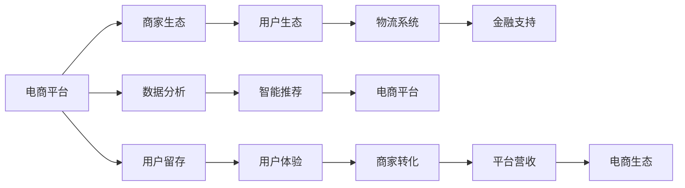

                 

## 1. 背景介绍

### 1.1 问题由来

在互联网时代，电商行业蓬勃发展，成为全球经济的重要组成部分。但随着市场竞争的加剧和用户需求的日益多样化，如何构建一个高效、稳定、可扩展的电商生态系统，成为各大电商企业的核心战略任务。构建电商生态系统不仅能够提升用户体验，增加用户黏性，还能实现商家的精准营销和供应链优化，提高整个电商平台的运营效率和经济效益。

### 1.2 问题核心关键点

电商生态系统的建设涉及多个关键点：

- **用户体验**：电商平台的最终目标是为用户提供良好的购物体验。这包括流畅的浏览、便捷的支付、快速的物流配送等。
- **商家生态**：吸引和维护优秀的商家，是电商平台的核心竞争力。通过提供稳定的交易环境、丰富的营销工具和专业的客服支持，商家能够更好地开展业务。
- **数据流通**：电商生态系统需要高效的数据流通机制，以便用户、商家和平台能够共享数据，实现精准营销和个性化推荐。
- **物流协同**：高效的物流系统是电商成功的关键因素之一。物流协同不仅能提高配送速度，还能降低配送成本。
- **金融支持**：支付、融资等金融服务，是电商生态系统的重要组成部分。高效的金融支持系统，能够提升用户的支付体验和商家的资金流动效率。

### 1.3 问题研究意义

构建一个完善、高效的电商生态系统，不仅能够提升电商平台的竞争力，还能带动整个产业链的协同发展。其研究意义在于：

- 优化用户购物体验，提升用户满意度和忠诚度。
- 提高商家的运营效率和盈利能力，增加电商平台的吸引力。
- 实现数据的高效流通和利用，推动精准营销和个性化推荐。
- 优化物流体系，提升配送速度和质量。
- 提供全方位的金融支持，增强平台的金融服务能力。

## 2. 核心概念与联系

### 2.1 核心概念概述

为了更好地理解电商生态系统建设，我们将介绍几个关键概念：

- **电商平台**：作为电商生态系统的核心，提供商品展示、交易、支付、物流、客服等全方位服务。
- **商家生态**：包括品牌商、供应商、分销商等，是电商平台上重要的参与者。
- **用户生态**：包括消费者、注册用户、会员等，是电商平台的最终服务对象。
- **物流系统**：提供从仓库到用户手中的货物配送服务。
- **金融支持**：包括支付、融资、贷款等服务，支持商家的资金流动。
- **数据分析**：通过数据挖掘和分析，提升电商平台的运营效率和用户体验。
- **智能推荐**：基于用户行为数据，推荐用户感兴趣的商品和内容。

这些概念之间相互依赖、相互促进，构成了一个完整的电商生态系统。

### 2.2 概念间的关系

电商生态系统的核心概念可以通过以下Mermaid流程图展示：



这个流程图展示了电商生态系统中的各个环节及其相互关系。

### 2.3 核心概念的整体架构

从整体架构来看，电商生态系统的建设可以分为以下五个层次：

- **基础设施层**：包括电商平台的硬件设施、数据中心、网络安全等。
- **平台功能层**：提供电商交易、支付、物流、客服等功能。
- **商家管理层**：为商家提供商品管理、营销工具、订单处理等功能。
- **用户互动层**：通过UI/UX设计、智能推荐、数据分析等手段，提升用户体验。
- **生态协同层**：实现商家与用户的双向互动，推动平台数据的流通和共享。

这五个层次共同构建了一个高效、稳定、可扩展的电商生态系统。

## 3. 核心算法原理 & 具体操作步骤

### 3.1 算法原理概述

电商生态系统的建设涉及到多种算法和技术的综合应用。以下将介绍几个核心算法原理：

- **推荐算法**：通过用户行为数据，推荐用户感兴趣的商品，提升用户体验。
- **自然语言处理(NLP)**：利用NLP技术，实现用户评论、聊天记录等的自动分析和处理。
- **数据分析**：通过数据挖掘和分析，发现用户行为模式，优化电商平台策略。
- **机器学习**：通过训练模型，预测用户行为、商品需求等，提高平台运营效率。
- **图像识别**：利用图像识别技术，优化商品展示和识别假冒伪劣商品。
- **优化算法**：通过优化算法，提升电商平台的性能和稳定性。

### 3.2 算法步骤详解

电商生态系统的建设步骤可以分为以下五个阶段：

1. **需求分析**：明确电商平台的功能需求、业务流程和技术架构。
2. **系统设计**：设计电商平台的架构、模块划分、接口定义等。
3. **数据架构**：设计数据存储架构、数据流和数据安全策略。
4. **技术实现**：实现电商平台的各个功能模块和技术组件。
5. **系统测试**：进行功能测试、性能测试和安全测试，确保系统稳定可靠。

### 3.3 算法优缺点

电商生态系统的建设具有以下优点：

- **提高运营效率**：通过智能化管理，提高电商平台的运营效率和盈利能力。
- **优化用户体验**：提升用户购物体验，增加用户黏性，提高用户满意度。
- **促进商家发展**：为商家提供全方位的支持，提升商家的运营效率和盈利能力。
- **带动产业链协同**：推动整个电商产业链的发展，实现共赢。

但其也存在以下缺点：

- **技术复杂**：电商生态系统的建设涉及多种技术，需要综合应用多种算法。
- **数据安全风险**：电商生态系统需要处理大量敏感数据，存在数据泄露和安全风险。
- **成本高**：电商生态系统的建设需要大量的资金和技术投入。

### 3.4 算法应用领域

电商生态系统的建设广泛应用于各种电商平台的建设，包括B2B、B2C、C2C等不同类型。其应用领域包括：

- **电商平台建设**：为消费者提供商品展示、交易、支付、物流等服务。
- **商家管理系统**：为商家提供商品管理、订单处理、营销工具等功能。
- **数据分析平台**：通过数据分析，提升电商平台的用户体验和运营效率。
- **智能推荐系统**：利用推荐算法，提升用户购物体验和商家转化率。
- **物流管理系统**：实现从仓库到用户手中的高效物流配送。
- **金融支持系统**：提供支付、融资、贷款等金融服务，支持商家的资金流动。

## 4. 数学模型和公式 & 详细讲解 & 举例说明

### 4.1 数学模型构建

为了更好地理解电商生态系统的建设，我们将构建几个数学模型：

- **推荐模型**：利用协同过滤、基于内容的推荐、深度学习等算法，构建推荐系统。
- **用户行为模型**：通过时间序列分析、聚类分析等算法，分析用户行为数据。
- **物流成本模型**：利用优化算法，优化物流路径和配送策略，降低物流成本。
- **金融风险模型**：通过风险评估算法，评估用户的支付风险和商家的融资风险。

### 4.2 公式推导过程

以下我们将推导几个核心公式：

- **协同过滤推荐算法**：
  $$
  \text{similarity}(\text{item}_i, \text{item}_j) = \frac{\text{cos}(\text{item}_i, \text{item}_j)}{\sqrt{\text{cos}(\text{item}_i, \text{item}_i) \times \text{cos}(\text{item}_j, \text{item}_j)}
  $$
  其中，$\text{cos}(\text{item}_i, \text{item}_j)$表示商品$i$和商品$j$的相似度。

- **基于内容的推荐算法**：
  $$
  \text{similarity}(\text{item}_i, \text{item}_j) = \frac{\text{cos}(\text{item}_i, \text{item}_j)}{\sqrt{\text{cos}(\text{item}_i, \text{item}_i) \times \text{cos}(\text{item}_j, \text{item}_j)}
  $$
  其中，$\text{cos}(\text{item}_i, \text{item}_j)$表示商品$i$和商品$j$的内容相似度。

- **时间序列分析**：
  $$
  \text{trend}(t) = \text{mean}(t-1, t-2, \ldots, t-n)
  $$
  其中，$\text{trend}(t)$表示时间$t$的用户行为趋势，$n$为窗口大小。

### 4.3 案例分析与讲解

假设我们有一个电商平台的销售数据，其中包含用户的浏览、购买、评价等行为数据。我们可以利用这些数据，构建推荐模型和用户行为模型，提升用户体验和商家转化率。

## 5. 项目实践：代码实例和详细解释说明

### 5.1 开发环境搭建

电商生态系统的建设需要多种技术和工具的支持。以下是在Python环境下搭建电商生态系统的环境：

1. **安装Python环境**：使用Anaconda或Miniconda，安装Python和相关依赖包。
2. **安装Docker和Kubernetes**：使用Docker和Kubernetes，搭建电商平台的容器化部署环境。
3. **安装数据库和中间件**：安装MySQL、Redis等数据库和中间件，提供数据存储和实时计算功能。
4. **安装监控和日志工具**：安装Grafana、Prometheus等监控和日志工具，监控系统性能和健康状态。

### 5.2 源代码详细实现

以下是一个简单的电商推荐系统实现：

```python
import pandas as pd
from surprise import Dataset, Reader, SVD
from surprise import accuracy, print_top_n

# 加载数据集
data = Dataset.load_builtin('ml-100k')
trainset = data.build_full_trainset()
reader = Reader(rating_scale=(1, 5))

# 构建SVD模型
algo = SVD()

# 训练模型
trainset = trainset.as_URM()
algo.fit(trainset)

# 测试模型
testset = trainset.build_full_testset()
predictions = algo.test(testset)

# 输出准确率
print("Accuracy: {:.3f}".format(accuracy.rmse(predictions, verbose=True)))

# 输出推荐结果
print_top_n(algo, testset, 10)
```

### 5.3 代码解读与分析

以上代码实现了一个简单的基于协同过滤的推荐系统，主要步骤如下：

1. **数据加载**：加载数据集，包括用户ID、商品ID、评分等。
2. **模型构建**：使用Surprise库中的SVD模型，进行协同过滤推荐。
3. **模型训练**：训练模型，使用训练集进行训练。
4. **模型测试**：使用测试集进行测试，输出推荐结果。
5. **输出结果**：输出模型准确率和推荐结果。

## 6. 实际应用场景

### 6.1 智能客服系统

电商平台的智能客服系统能够提升用户体验，增加用户黏性。通过自然语言处理技术，智能客服系统能够理解用户的问题，提供快速准确的答案。此外，智能客服系统还能够记录用户的问题和反馈，不断优化客服策略。

### 6.2 个性化推荐系统

个性化推荐系统能够提升用户购物体验，增加用户转化率。通过推荐算法，根据用户的历史行为数据，推荐用户感兴趣的商品，提高用户的购物满意度和忠诚度。

### 6.3 库存管理系统

库存管理系统能够优化商家的库存管理，减少库存积压和缺货现象。通过预测算法，预测商品的需求量，调整库存水平，提升库存周转率。

### 6.4 金融支持系统

金融支持系统能够提升商家的资金流动效率，降低交易成本。通过支付、融资、贷款等服务，支持商家的资金流动，降低商家的资金压力。

## 7. 工具和资源推荐

### 7.1 学习资源推荐

为了更好地理解电商生态系统的建设，以下推荐一些学习资源：

1. **《电商系统设计与优化》课程**：由清华大学开设的电商系统设计与优化课程，涵盖电商系统的各个方面。
2. **《电商数据分析》书籍**：介绍电商数据分析的方法和技术，提升电商平台的运营效率。
3. **《电商推荐算法》书籍**：介绍推荐算法的基本原理和实际应用，提升电商平台的个性化推荐能力。
4. **Kaggle竞赛**：参加电商相关的Kaggle竞赛，提升数据分析和机器学习的实战能力。
5. **eBay开发者文档**：eBay提供的开发者文档，涵盖电商平台的各个功能模块和技术实现。

### 7.2 开发工具推荐

电商生态系统的建设需要多种开发工具的支持。以下推荐一些常用工具：

1. **Anaconda**：Python环境管理工具，方便安装和管理Python依赖包。
2. **Jupyter Notebook**：交互式编程环境，方便编写和调试Python代码。
3. **TensorFlow**：开源深度学习框架，支持多种算法和模型的实现。
4. **Docker**：容器化部署工具，方便电商平台的部署和管理。
5. **Kubernetes**：容器编排工具，支持电商平台的弹性扩展和故障恢复。
6. **Redis**：内存数据库，提供高效的实时计算和缓存功能。

### 7.3 相关论文推荐

电商生态系统的建设涉及多种算法和技术的综合应用。以下推荐一些相关论文：

1. **《电商推荐系统设计与优化》论文**：介绍电商推荐系统的基本原理和设计思路。
2. **《电商系统性能优化》论文**：介绍电商系统性能优化的方法和技术。
3. **《电商数据分析方法》论文**：介绍电商数据分析的基本方法和技术。
4. **《电商物流系统设计与优化》论文**：介绍电商物流系统的基本原理和设计思路。
5. **《电商金融系统设计与优化》论文**：介绍电商金融系统的基本原理和设计思路。

## 8. 总结：未来发展趋势与挑战

### 8.1 研究成果总结

本文对电商生态系统的建设进行了系统介绍，包括核心概念、算法原理、具体操作步骤、实际应用场景等。通过深入分析，我们得出以下结论：

1. 电商生态系统的建设涉及多种算法和技术的综合应用，需要系统的设计和管理。
2. 电商生态系统的建设能够提升用户体验，增加用户黏性，促进商家发展，带动整个产业链的协同发展。
3. 电商生态系统的建设需要大量的技术投入和资源支持，需要综合考虑多种因素。

### 8.2 未来发展趋势

展望未来，电商生态系统的建设将呈现以下几个发展趋势：

1. **智能化水平提升**：通过智能化技术，提升电商平台的运营效率和用户体验。
2. **数据驱动决策**：利用大数据分析，优化电商平台策略，提升运营效率和盈利能力。
3. **跨平台协同**：实现电商平台与其他平台的协同，提升用户体验和商家转化率。
4. **区块链应用**：利用区块链技术，提升电商平台的信任度和安全性。
5. **AI+X**：结合AI技术和其他技术，提升电商平台的创新能力。

### 8.3 面临的挑战

尽管电商生态系统的建设带来了诸多好处，但其也面临以下挑战：

1. **技术复杂**：电商生态系统的建设涉及多种技术，需要综合应用多种算法。
2. **数据安全风险**：电商生态系统需要处理大量敏感数据，存在数据泄露和安全风险。
3. **成本高**：电商生态系统的建设需要大量的资金和技术投入。
4. **市场竞争激烈**：电商市场竞争激烈，需要不断创新和优化，才能保持竞争力。

### 8.4 研究展望

未来的研究需要从以下几个方面进行：

1. **智能化技术应用**：进一步提升智能化水平，优化电商平台运营效率和用户体验。
2. **数据驱动决策**：利用大数据分析，优化电商平台策略，提升运营效率和盈利能力。
3. **跨平台协同**：实现电商平台与其他平台的协同，提升用户体验和商家转化率。
4. **区块链应用**：利用区块链技术，提升电商平台的信任度和安全性。
5. **AI+X**：结合AI技术和其他技术，提升电商平台的创新能力。

总之，电商生态系统的建设是一个复杂而庞大的系统工程，需要从多个方面进行全面考虑和优化。通过不断的技术创新和优化，相信电商生态系统能够为电商企业带来更大的价值，提升用户的购物体验，推动整个电商产业链的协同发展。

## 9. 附录：常见问题与解答

### Q1: 电商生态系统建设的主要目标是什么？

A: 电商生态系统建设的主要目标是提升用户体验、增加用户黏性、提高商家运营效率、带动整个产业链协同发展。

### Q2: 电商生态系统建设中，数据安全如何保障？

A: 电商生态系统需要处理大量敏感数据，因此数据安全保障非常重要。数据安全保障的措施包括：

- 数据加密：对数据进行加密处理，防止数据泄露。
- 访问控制：对数据访问进行严格控制，只有授权用户才能访问。
- 数据备份：定期备份数据，防止数据丢失。
- 安全审计：对数据访问进行安全审计，防止异常访问。

### Q3: 电商生态系统建设中的推荐算法有哪些？

A: 电商生态系统中的推荐算法包括：

- 协同过滤推荐算法：利用用户行为数据进行推荐。
- 基于内容的推荐算法：利用商品属性信息进行推荐。
- 基于深度学习的推荐算法：利用深度学习模型进行推荐。

### Q4: 电商生态系统建设中的数据架构需要考虑哪些因素？

A: 电商生态系统中的数据架构需要考虑以下因素：

- 数据存储：选择合适的数据存储方案，如MySQL、Hadoop等。
- 数据管理：制定数据管理策略，确保数据质量和安全。
- 数据处理：选择合适的数据处理工具，如Hive、Spark等。
- 数据访问：提供高效的数据访问接口，支持多种数据查询和分析。

### Q5: 电商生态系统建设中的智能客服系统如何实现？

A: 电商生态系统中的智能客服系统可以通过以下方式实现：

- 自然语言处理：利用NLP技术，理解用户的问题。
- 机器学习：利用机器学习模型，生成快速准确的答案。
- 知识库管理：建立知识库，提供丰富的问答支持。
- 用户反馈：记录用户的问题和反馈，不断优化客服策略。

综上所述，电商生态系统的建设是一个复杂而庞大的系统工程，需要从多个方面进行全面考虑和优化。通过不断的技术创新和优化，相信电商生态系统能够为电商企业带来更大的价值，提升用户的购物体验，推动整个电商产业链的协同发展。

