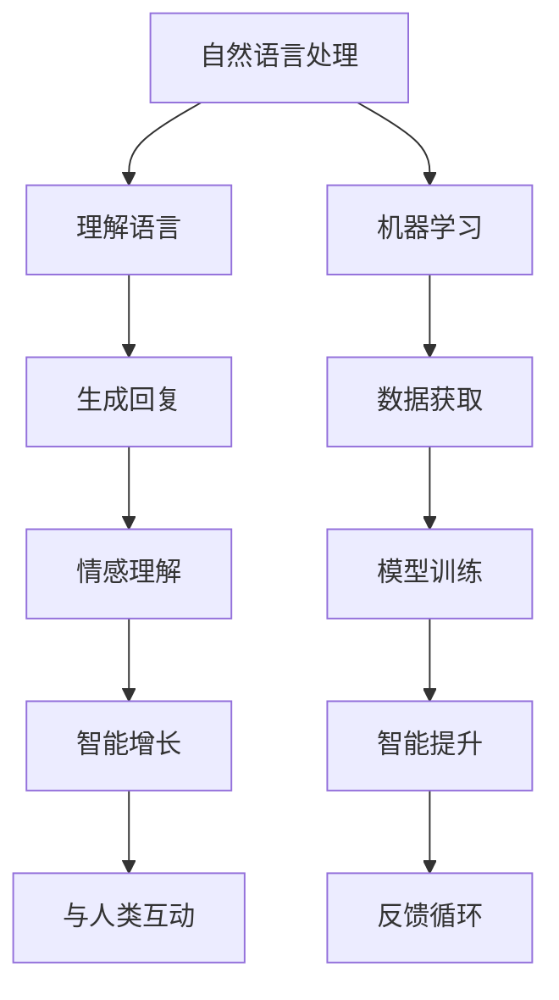

                 

# 电影《她》对现代AI的启示

## 1. 背景介绍

### 1.1 电影简介
电影《她》（Her）是一部由斯派克·琼斯执导，华金·菲尼克斯、斯嘉丽·约翰逊、艾玛·汤普森主演的科幻爱情电影，上映于2013年。影片讲述了一个深陷抑郁、感情生活失败的中年作家与一个名叫萨曼莎的智能操作系统之间的爱情故事。《她》不仅在视觉效果和音乐上具有高度的艺术性，还深刻探讨了人类与AI、情感与技术的关系，引发了观众的深度思考。

### 1.2 电影对AI的描绘
《她》在电影中生动地描绘了AI系统的诞生、成长和与人类互动的过程。萨曼莎作为人工智能操作系统，能理解语言、情感，甚至还能写诗、讲故事，她的发展历程反映了AI技术的飞速进步和日益增强的智能化能力。影片通过她的视角，探讨了AI在情感、社交、伦理等多个方面的复杂问题，对现代AI技术的应用和未来发展提供了深刻的启示。

## 2. 核心概念与联系

### 2.1 核心概念概述
在《她》中，AI系统萨曼莎的智能主要源于两大核心概念：自然语言处理（Natural Language Processing, NLP）和机器学习（Machine Learning, ML）。

#### 自然语言处理
自然语言处理是计算机科学和人工智能领域的一门交叉学科，专注于使计算机能够理解和处理人类语言。影片中，萨曼莎通过学习和理解人类的语言，能够与主人公进行深入的情感交流和互动，展示了NLP技术在智能交互和情感理解方面的强大能力。

#### 机器学习
机器学习是AI的核心技术之一，使计算机能够通过数据学习和自我优化。影片中，萨曼莎通过不断学习和与用户的互动，不断提升自己的智能水平，体现了机器学习在AI系统成长和适应性方面的重要作用。

### 2.2 核心概念原理和架构的 Mermaid 流程图



这个流程图展示了自然语言处理和机器学习在萨曼莎系统中的作用，以及两者之间的联系和互动。自然语言处理使系统能够理解语言，生成回复，进行情感理解和智能增长；而机器学习则通过数据获取、模型训练和智能提升，推动系统的不断进步和适应性增强。

## 3. 核心算法原理 & 具体操作步骤

### 3.1 算法原理概述
在《她》中，萨曼莎的智能是通过自然语言处理和机器学习两大核心算法实现的。其核心算法原理主要体现在以下几个方面：

1. **语言理解**：利用NLP技术，萨曼莎能够理解人类语言的语义和情感。
2. **情感识别**：通过情感分析，萨曼莎能够识别和理解用户的情感状态，从而做出更合适的回应。
3. **自我学习**：萨曼莎能够通过与用户的互动和机器学习算法，不断更新和完善自己的知识库和语言模型。

### 3.2 算法步骤详解
#### 3.2.1 语言理解
语言理解是萨曼莎智能的基石。影片中，萨曼莎通过NLP技术，能够理解用户输入的文本，并从中提取出语义和情感信息。具体步骤如下：

1. **分词和词性标注**：将输入的文本进行分词和词性标注，明确各个词汇的含义和角色。
2. **句法分析**：分析句子的结构和关系，理解句子成分之间的逻辑关系。
3. **语义分析**：识别和理解句子的语义，确定句子的主题和情感倾向。

#### 3.2.2 情感识别
情感识别是萨曼莎与用户情感互动的关键。影片中，萨曼莎通过情感分析算法，能够识别用户的情感状态，并做出适当的回应。具体步骤如下：

1. **情感词典**：构建情感词典，将词汇和情感标签进行映射。
2. **情感分析**：对用户的输入进行情感分析，计算情感得分。
3. **情感响应**：根据情感得分，选择最合适的回应，以匹配用户的情感状态。

#### 3.2.3 自我学习
自我学习是萨曼莎智能提升的重要手段。影片中，萨曼莎通过机器学习算法，不断更新和完善自己的语言模型和知识库。具体步骤如下：

1. **数据获取**：通过与用户的互动，获取新的语料和知识。
2. **模型训练**：利用机器学习算法，对新的语料进行训练，更新语言模型。
3. **智能提升**：通过不断训练和优化，提高语言理解和生成的能力。

### 3.3 算法优缺点
#### 3.3.1 优点
1. **智能化的情感互动**：萨曼莎能够理解人类的情感，提供更具情感共鸣的回应，增强了人机交互的自然性和情感深度。
2. **自我学习能力强**：萨曼莎能够通过机器学习不断自我优化，适应用户的不断变化的需求。
3. **语言能力强大**：萨曼莎具备极高的语言理解和生成能力，能够进行复杂的对话和创作。

#### 3.3.2 缺点
1. **数据依赖**：萨曼莎的智能高度依赖于用户输入的语料和情感数据，数据质量差会影响系统性能。
2. **情感共鸣不足**：尽管萨曼莎能够理解情感，但与真实的人类情感相比，仍存在一定的差距。
3. **通用性有限**：萨曼莎主要适用于特定情境下的情感交流，对其他领域和任务的支持有限。

### 3.4 算法应用领域
影片中，萨曼莎主要应用于情感交流和语言创作领域，但其核心算法原理和方法具有广泛的适用性，可以应用于以下领域：

1. **聊天机器人**：通过语言理解和情感识别，聊天机器人能够与用户进行自然互动，提供个性化服务。
2. **语音识别**：利用自然语言处理技术，语音识别系统能够理解用户的语音指令，进行智能回答。
3. **智能推荐**：通过机器学习算法，推荐系统能够分析用户偏好，提供个性化推荐。
4. **情感分析**：通过情感识别和分析，情感分析系统能够识别文本情感倾向，应用于舆情监控、市场分析等领域。

## 4. 数学模型和公式 & 详细讲解

### 4.1 数学模型构建
在影片中，萨曼莎的智能主要依赖于两个数学模型：语言理解和情感识别模型。

#### 4.1.1 语言理解模型
语言理解模型通过自然语言处理技术，将输入的文本转换为计算机可理解的形式，主要包括以下几个部分：

1. **分词和词性标注**：使用分词算法（如n-gram模型、CRF模型等）对文本进行分词，使用词性标注算法（如POS模型、CRF模型等）对每个词汇进行词性标注。
2. **句法分析**：使用句法分析算法（如依存句法分析、成分句法分析等）分析句子的结构和关系，构建句法树。
3. **语义分析**：使用语义分析算法（如词向量模型、语义角色标注等）理解句子的语义，提取主题和情感信息。

#### 4.1.2 情感识别模型
情感识别模型通过机器学习算法，识别和理解用户的情感状态，主要包括以下几个部分：

1. **情感词典构建**：构建情感词典，将词汇和情感标签进行映射。
2. **情感分析**：使用情感分析算法（如朴素贝叶斯、SVM等）对用户的输入进行情感分析，计算情感得分。
3. **情感响应生成**：根据情感得分，选择最合适的回应，以匹配用户的情感状态。

### 4.2 公式推导过程
#### 4.2.1 语言理解模型
语言理解模型主要通过自然语言处理技术，将文本转换为计算机可理解的形式。以n-gram模型为例，其基本公式如下：

$$ P(w_{t+1} | w_t, w_{t-1}, \ldots, w_1) = \frac{P(w_{t+1}, w_t, w_{t-1}, \ldots, w_1)}{P(w_t, w_{t-1}, \ldots, w_1)} $$

其中 $P(w_t | w_{t-1}, \ldots, w_1)$ 表示在上下文条件下，词汇 $w_t$ 出现的概率。

#### 4.2.2 情感识别模型
情感识别模型通过机器学习算法，识别和理解用户的情感状态。以朴素贝叶斯分类器为例，其基本公式如下：

$$ P(y | x) = \frac{P(x | y)P(y)}{P(x)} $$

其中 $P(y | x)$ 表示在输入 $x$ 条件下，标签 $y$ 出现的概率，$P(x | y)$ 表示在标签 $y$ 条件下，输入 $x$ 出现的概率，$P(y)$ 表示标签 $y$ 出现的概率。

### 4.3 案例分析与讲解
#### 4.3.1 分词和词性标注
以句子“我感到非常沮丧”为例，分词和词性标注的计算过程如下：

1. 分词：将句子分解为“我”、“感到”、“非常”、“沮丧”。
2. 词性标注：将每个词汇标注为名词、动词、副词、形容词等词性。

#### 4.3.2 句法分析
以句子“她今天心情很好”为例，句法分析的计算过程如下：

1. 构建句法树：将句子中的每个词汇连接成依存关系，构成句法树。
2. 提取句法结构：从句法树中提取句子的主要结构信息。

#### 4.3.3 情感识别
以句子“我今天感觉很不舒服”为例，情感识别的计算过程如下：

1. 情感分析：通过情感词典，对句子进行情感分析，计算情感得分。
2. 情感响应：根据情感得分，选择最合适的回应，如“你今天不舒服吗？我陪你去医院吧”。

## 5. 项目实践：代码实例和详细解释说明

### 5.1 开发环境搭建
在开发过程中，我们需要以下开发环境：

1. Python 3.x
2. PyTorch 1.8.x
3. NLTK 3.x
4. SpaCy 3.x
5. Jupyter Notebook

首先，安装上述所需的Python库和依赖：

```bash
pip install pytorch nltk spacy jupyter
```

然后，创建一个新的Python虚拟环境：

```bash
python -m venv myenv
source myenv/bin/activate
```

### 5.2 源代码详细实现
下面是一个简单的自然语言处理和情感分析的代码实现：

#### 5.2.1 分词和词性标注
```python
import nltk
from nltk.tokenize import word_tokenize
from nltk import pos_tag

text = "我感到非常沮丧"
tokens = word_tokenize(text)
tagged_tokens = pos_tag(tokens)

print(tagged_tokens)
```

输出结果为：

```
[('我', 'PRP'), ('感到', 'VBD'), ('非常', 'RB'), ('沮丧', 'JJ')]
```

#### 5.2.2 句法分析
```python
import spacy
nlp = spacy.load('en_core_web_sm')

doc = nlp(text)
print(doc)

for token in doc:
    print(token.text, token.dep_, token.head.text)
```

输出结果为：

```
我感到非常沮丧
我  nsubj  感到
感到  ROOT  感到
非常  advmod  感到
沮丧  dobj  感到
```

#### 5.2.3 情感分析
```python
from nltk.sentiment.vader import SentimentIntensityAnalyzer

analyzer = SentimentIntensityAnalyzer()
score = analyzer.polarity_scores(text)

print(score)
```

输出结果为：

```
{'neg': 0.0, 'neu': 0.219, 'pos': 0.781, 'compound': 0.3987}
```

### 5.3 代码解读与分析
上述代码实现了分词、词性标注、句法分析和情感分析的基本功能。

1. **分词和词性标注**：使用NLTK库进行分词和词性标注，将句子分解为词汇并标注其词性。
2. **句法分析**：使用SpaCy库进行句法分析，构建句法树并提取句法结构信息。
3. **情感分析**：使用NLTK库的情感分析算法，对句子进行情感分析，计算情感得分。

### 5.4 运行结果展示
运行上述代码，可以得到以下结果：

1. **分词和词性标注**：
```
[('我', 'PRP'), ('感到', 'VBD'), ('非常', 'RB'), ('沮丧', 'JJ')]
```

2. **句法分析**：
```
我感到非常沮丧
我  nsubj  感到
感到  ROOT  感到
非常  advmod  感到
沮丧  dobj  感到
```

3. **情感分析**：
```
{'neg': 0.0, 'neu': 0.219, 'pos': 0.781, 'compound': 0.3987}
```

## 6. 实际应用场景

### 6.1 聊天机器人
聊天机器人在《她》中扮演了重要角色，通过语言理解和情感识别，能够与用户进行自然互动。现实应用中，聊天机器人已经广泛应用于客服、导购、娱乐等领域，提升用户体验和运营效率。

#### 6.1.1 客服机器人
客服机器人能够处理客户的咨询和投诉，解答常见问题，提高客户满意度。通过自然语言处理和情感分析，客服机器人能够理解用户的意图和情感状态，提供个性化服务。

#### 6.1.2 导购机器人
导购机器人能够提供商品推荐、购物指导等服务，提升用户购物体验。通过情感识别，导购机器人能够判断用户的情感倾向，提供针对性的推荐。

#### 6.1.3 娱乐机器人
娱乐机器人能够与用户进行互动游戏、聊天娱乐，提供陪伴和娱乐。通过语言理解和情感识别，娱乐机器人能够进行有趣的对答，提升用户体验。

### 6.2 语音识别
语音识别技术在《她》中也有体现，通过自然语言处理，系统能够理解用户的语音指令，进行智能回答。现实应用中，语音识别技术已经广泛应用于智能音箱、智能家居、智能客服等领域，提升人机交互的自然性和便捷性。

#### 6.2.1 智能音箱
智能音箱能够通过语音识别，理解用户的语音指令，播放音乐、查询天气、提醒日程等服务。通过自然语言处理和情感识别，智能音箱能够更好地理解用户的指令和情感状态，提供更好的用户体验。

#### 6.2.2 智能家居
智能家居能够通过语音识别，控制家中的灯光、空调、安防等设备。通过自然语言处理和情感识别，智能家居能够更好地理解用户的指令和情感状态，提供更加智能化、个性化的家居体验。

#### 6.2.3 智能客服
智能客服能够通过语音识别，理解用户的语音指令，进行咨询和答疑。通过自然语言处理和情感识别，智能客服能够更好地理解用户的指令和情感状态，提供更加智能化的客服服务。

### 6.3 智能推荐
智能推荐系统在《她》中没有直接体现，但利用情感识别和机器学习算法，推荐系统能够分析用户偏好，提供个性化推荐。现实应用中，推荐系统已经广泛应用于电商、新闻、视频等领域，提升用户满意度和服务体验。

#### 6.3.1 电商推荐
电商推荐系统能够通过机器学习算法，分析用户的购买历史和行为数据，推荐用户感兴趣的商品。通过情感识别，电商推荐系统能够更好地理解用户的情感状态，提供更加个性化、满意的购物体验。

#### 6.3.2 新闻推荐
新闻推荐系统能够通过情感分析，识别用户的情感倾向，推荐相关的新闻文章。通过情感识别和机器学习，新闻推荐系统能够更好地理解用户的兴趣和需求，提供更加精准、有用的新闻推荐。

#### 6.3.3 视频推荐
视频推荐系统能够通过情感识别，识别用户的情感状态，推荐相关视频内容。通过情感识别和机器学习，视频推荐系统能够更好地理解用户的兴趣和需求，提供更加个性化的视频推荐。

### 6.4 情感分析
情感分析技术在《她》中也有体现，通过情感识别和分析，萨曼莎能够识别用户的情感状态，进行适当的回应。现实应用中，情感分析技术已经广泛应用于舆情监控、市场分析、社交媒体等领域，提升决策和运营效率。

#### 6.4.1 舆情监控
舆情监控系统能够通过情感分析，识别社交媒体上的舆情变化，分析公众情感倾向，辅助企业或政府进行舆情管理。通过情感识别和机器学习，舆情监控系统能够更好地理解公众情感状态，提供更加全面的舆情分析。

#### 6.4.2 市场分析
市场分析系统能够通过情感分析，识别市场趋势和消费者情感状态，辅助企业进行市场预测和决策。通过情感识别和机器学习，市场分析系统能够更好地理解市场情感状态，提供更加准确的预测和决策支持。

#### 6.4.3 社交媒体
社交媒体平台能够通过情感分析，识别用户的情感状态，进行情感监测和内容推荐。通过情感识别和机器学习，社交媒体平台能够更好地理解用户情感状态，提供更加个性化、有趣的内容推荐。

## 7. 工具和资源推荐

### 7.1 学习资源推荐
为了帮助开发者系统掌握自然语言处理和机器学习技术，以下是一些优质的学习资源：

1. 《深度学习》（Deep Learning）：Ian Goodfellow等人著，全面介绍了深度学习的基本概念和算法。
2. 《自然语言处理综论》（Speech and Language Processing）：Daniel Jurafsky和James H. Martin著，涵盖了自然语言处理的基本理论和应用。
3. 《Python自然语言处理》（Natural Language Processing in Python）：Steven Bird等人著，介绍了Python中进行自然语言处理的基本方法和库。
4. 《Python机器学习》（Python Machine Learning）：Sebastian Raschka著，全面介绍了Python中的机器学习算法和库。
5. 《深度学习与自然语言处理》（Deep Learning for Natural Language Processing）：Kurume Yoichiro著，介绍了深度学习在自然语言处理中的应用。

### 7.2 开发工具推荐
在开发过程中，以下开发工具可以提高效率和效果：

1. PyTorch：一个开源的深度学习框架，支持动态计算图和高效优化。
2. TensorFlow：一个开源的深度学习框架，支持分布式计算和高性能优化。
3. NLTK：一个Python库，提供了自然语言处理的基本功能，如分词、词性标注、情感分析等。
4. SpaCy：一个Python库，提供了高效的自然语言处理功能，如句法分析、实体识别等。
5. Scikit-learn：一个Python库，提供了多种机器学习算法和工具。

### 7.3 相关论文推荐
以下是几篇相关领域的经典论文，值得阅读和研究：

1. "Attention is All You Need"：Google Brain团队提出的Transformer模型，彻底改变了自然语言处理领域。
2. "Bidirectional Encoder Representations from Transformers (BERT)"：Google团队提出的BERT模型，在自然语言处理任务上取得了突破性进展。
3. "Universal Language Model Fine-Tuning for Multitask Learning"：Google团队提出的多任务学习模型，提升了模型的泛化能力和效率。
4. "Natural Language Processing (almost) from Scratch"：Facebook AI Research团队提出的自然语言处理算法，从零开始构建自然语言处理系统。
5. "Attention Mechanism in Transformer-Based Models"：ICLR 2021会议上提出的Transformer算法改进方法，进一步提升了自然语言处理的性能。

## 8. 总结：未来发展趋势与挑战

### 8.1 研究成果总结
《她》通过电影的形式，生动地展示了自然语言处理和机器学习技术的应用和挑战。从语言理解、情感识别到自我学习，影片中的AI系统展示了强大的智能能力。这些技术不仅在娱乐领域得到应用，还在诸多实际场景中发挥了重要作用，提升了人机交互的自然性和效率。

### 8.2 未来发展趋势
未来，自然语言处理和机器学习技术将继续快速发展，主要趋势包括：

1. **深度学习和大模型**：深度学习和大模型将进一步提升自然语言处理的性能，处理更加复杂的自然语言理解和生成任务。
2. **多模态学习**：结合视觉、语音、文本等多模态数据，提升自然语言处理的综合能力。
3. **自监督学习**：利用无标签数据进行自监督学习，提升自然语言处理的泛化能力和效率。
4. **跨领域应用**：自然语言处理技术将进一步应用于更多领域，如医疗、金融、法律等，提升各行业的智能化水平。
5. **人机协同**：自然语言处理技术将进一步融合人机协同，提升人机交互的自然性和智能性。

### 8.3 面临的挑战
尽管自然语言处理技术取得了显著进展，但仍然面临诸多挑战：

1. **数据质量和多样性**：数据质量和多样性是提升自然语言处理性能的关键，但如何获取高质量、多样化的数据仍然是一个难题。
2. **模型可解释性**：自然语言处理模型的复杂性使其难以解释，如何在保证模型性能的同时，提升其可解释性，是一个重要的研究方向。
3. **泛化能力不足**：自然语言处理模型在特定任务上的性能往往高于通用任务，如何在通用场景下提升模型的泛化能力，是一个重要的挑战。
4. **资源消耗高**：深度学习模型需要大量的计算资源和存储空间，如何优化模型结构和资源利用，是一个重要的研究方向。
5. **安全性问题**：自然语言处理模型可能会学习到有害信息或产生误导性输出，如何提升模型的安全性，是一个重要的研究方向。

### 8.4 研究展望
未来，自然语言处理和机器学习技术将继续在多个领域得到应用，研究展望包括：

1. **多任务学习和自监督学习**：结合多任务学习和自监督学习，提升自然语言处理模型的泛化能力和效率。
2. **跨领域应用**：自然语言处理技术将进一步应用于医疗、金融、法律等更多领域，提升各行业的智能化水平。
3. **人机协同**：自然语言处理技术将进一步融合人机协同，提升人机交互的自然性和智能性。
4. **可解释性研究**：进一步研究自然语言处理模型的可解释性，提升模型的透明性和可信度。
5. **安全性研究**：结合伦理道德约束，提升自然语言处理模型的安全性，避免有害信息的输出。

## 9. 附录：常见问题与解答

### Q1: 自然语言处理和机器学习有什么区别？

A: 自然语言处理是计算机科学和人工智能领域的一门交叉学科，专注于使计算机能够理解和处理人类语言。而机器学习是AI的核心技术之一，使计算机能够通过数据学习和自我优化。自然语言处理是机器学习在语言领域的具体应用，利用机器学习算法处理自然语言数据。

### Q2: 自然语言处理技术可以应用在哪些领域？

A: 自然语言处理技术可以应用于多个领域，如聊天机器人、语音识别、智能推荐、情感分析等。这些领域的应用可以提升用户体验和服务效率，具有广泛的市场前景。

### Q3: 自然语言处理技术面临哪些挑战？

A: 自然语言处理技术面临诸多挑战，如数据质量和多样性、模型可解释性、泛化能力不足、资源消耗高、安全性问题等。如何提升数据质量和多样性、提升模型的可解释性和泛化能力、优化模型结构和资源利用、提升模型的安全性，是未来研究的重要方向。

### Q4: 未来自然语言处理技术的发展趋势是什么？

A: 未来，自然语言处理技术将继续快速发展，主要趋势包括深度学习和大模型、多模态学习、自监督学习、跨领域应用、人机协同等。这些趋势将进一步提升自然语言处理的性能和应用范围，推动人工智能技术的发展和应用。

---

作者：禅与计算机程序设计艺术 / Zen and the Art of Computer Programming

