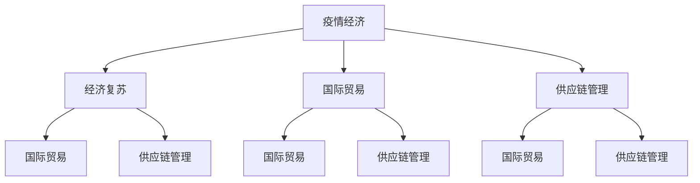

                 

# 疫情后的世界经济复苏挑战

> 关键词：疫情经济,经济复苏,全球经济,国际贸易,供应链管理

## 1. 背景介绍

### 1.1 疫情对全球经济的冲击

新冠疫情自2019年底爆发以来，迅速席卷全球，对全球经济造成了巨大冲击。疫情导致的封锁、隔离、产业链断裂、消费下降等因素，使得全球GDP在2020年出现了自二战以来的首次负增长。根据国际货币基金组织(IMF)的数据，全球GDP在2020年下降了3.3%，这是自第二次世界大战以来的最严重的衰退。

疫情对全球经济的影响是多方面的。首先，全球供应链受到严重影响。许多国家实施封锁措施，导致物流受阻、供应链断裂，企业无法及时获取原材料，影响了生产和交付。其次，消费下降。疫情导致全球旅游、餐饮、零售等服务业大幅萎缩，居民消费意愿和能力下降，对全球经济增长产生负面影响。此外，全球贸易受到严重打击。疫情导致国际航班减少、贸易壁垒上升、关税政策变动等因素，使得国际贸易量大幅下降。

## 2. 核心概念与联系

### 2.1 核心概念概述

在分析疫情后的世界经济复苏挑战时，我们需要了解几个核心概念：

- **疫情经济**：指疫情对全球经济造成的冲击和影响。疫情经济不仅包括了疫情爆发期间的经济停滞和萎缩，也包括了疫情后的经济恢复和转型。
- **经济复苏**：指在疫情冲击后，经济逐步恢复至疫情前的水平。经济复苏的进程受到政策、市场、国际环境等多重因素的影响。
- **全球经济**：指在疫情冲击下，各国经济之间的相互依存和影响。全球经济复苏需要各国共同协作，共同应对疫情带来的挑战。
- **国际贸易**：指疫情对全球贸易的冲击和影响，以及疫情后国际贸易政策的调整和变化。
- **供应链管理**：指在疫情冲击下，如何优化供应链管理，确保供应链的稳定和高效运转。

这些核心概念构成了分析疫情后世界经济复苏挑战的基础框架，帮助我们从不同维度理解疫情对全球经济的影响和复苏路径。

### 2.2 概念间的关系

这些核心概念之间存在着紧密的联系，形成了疫情后世界经济复苏挑战的完整生态系统。下面我们通过几个Mermaid流程图来展示这些概念之间的关系。



这个流程图展示了疫情经济、经济复苏、国际贸易和供应链管理四个核心概念之间的关系：

1. 疫情经济对全球经济造成冲击，导致经济萎缩。
2. 经济复苏是在疫情冲击后，经济逐步恢复的过程。
3. 国际贸易和供应链管理在疫情经济下受到严重影响，全球供应链断裂，国际贸易量下降。
4. 经济复苏需要各国共同协作，推动国际贸易和供应链管理优化。

这些概念之间的紧密联系，帮助我们理解疫情后的世界经济复苏挑战，以及如何应对这些挑战。

## 3. 核心算法原理 & 具体操作步骤
### 3.1 算法原理概述

疫情后的世界经济复苏挑战，需要从多个维度进行分析。我们可以通过宏观经济分析、国际贸易分析、供应链管理分析等，来评估疫情对全球经济的影响，并制定相应的应对策略。

### 3.2 算法步骤详解

以下是分析疫情后世界经济复苏挑战的核心算法步骤：

**Step 1: 数据收集与处理**
- 收集全球各国疫情数据、GDP数据、贸易数据、供应链数据等。
- 对数据进行清洗、归一化、标准化等预处理，确保数据质量和一致性。

**Step 2: 模型构建与选择**
- 构建经济复苏模型，预测疫情后全球经济恢复进程。
- 选择适合的模型，如时间序列模型、因果模型、多模态模型等。
- 确定模型的输入输出变量，如GDP增长率、失业率、贸易增长率等。

**Step 3: 数据驱动的决策分析**
- 利用机器学习、深度学习等技术，从数据中提取有用的信息和规律。
- 对模型进行训练和评估，确保模型的准确性和泛化能力。
- 结合政策、市场、国际环境等多重因素，综合分析全球经济复苏路径。

**Step 4: 策略制定与实施**
- 根据模型分析结果，制定经济复苏策略，如财政政策、货币政策、贸易政策等。
- 实施策略，评估其效果，不断调整和优化。

### 3.3 算法优缺点

疫情后的世界经济复苏挑战分析算法具有以下优点：
1. 数据驱动：通过数据驱动的决策分析，提高政策的科学性和有效性。
2. 全面分析：结合多维度的分析方法，全面评估疫情对全球经济的影响。
3. 可操作性强：策略制定和实施具有明确的指导意义，便于操作和执行。

同时，该算法也存在以下局限性：
1. 数据质量：数据质量直接影响分析结果，需要确保数据的准确性和完整性。
2. 模型复杂度：复杂的模型可能需要更多的数据和计算资源，增加了分析难度。
3. 不确定性：经济复苏过程受多种因素影响，模型的预测可能存在不确定性。

### 3.4 算法应用领域

疫情后的世界经济复苏挑战分析算法可以应用于多个领域，如：

- **宏观经济分析**：预测全球经济复苏进程，制定经济政策。
- **国际贸易分析**：评估疫情对国际贸易的影响，调整国际贸易政策。
- **供应链管理**：优化供应链管理，确保供应链稳定和高效运转。
- **企业战略制定**：帮助企业制定疫情后的复苏战略，确保业务连续性和增长。

## 4. 数学模型和公式 & 详细讲解 & 举例说明

### 4.1 数学模型构建

我们可以使用时间序列模型来预测疫情后的全球经济复苏进程。假设GDP增长率为时间序列$y_t$，其中$t$为时间，$y_t$为第$t$期的GDP增长率。我们可以使用ARIMA模型来建模：

$$ y_t = \phi(y_{t-1},y_{t-2},...,y_{t-k}) + \theta \varepsilon_t $$

其中$\phi$为时间序列系数，$k$为时间序列长度，$\varepsilon_t$为误差项。

### 4.2 公式推导过程

对于ARIMA模型，我们需要进行时间序列分解和建模。具体步骤如下：

1. 分解时间序列，得到趋势项、季节项和随机项。
2. 建立ARIMA模型，设定模型参数。
3. 利用历史数据，拟合模型，预测未来GDP增长率。

### 4.3 案例分析与讲解

假设我们有一个疫情后的全球GDP增长率时间序列，可以使用ARIMA模型对其进行建模和预测。具体实现步骤如下：

```python
from statsmodels.tsa.arima_model import ARIMA

# 加载数据
data = pd.read_csv('gdp_growth.csv')
gdp_growth = data['GDP_growth'].values.reshape(-1, 1)

# 建立ARIMA模型
model = ARIMA(gdp_growth, order=(2, 1, 2))
results = model.fit()

# 预测未来GDP增长率
forecast = results.forecast(steps=12)
print(forecast)
```

通过ARIMA模型，我们可以预测未来12期的GDP增长率，为经济复苏策略提供数据支持。

## 5. 项目实践：代码实例和详细解释说明
### 5.1 开发环境搭建

在进行项目实践前，我们需要准备好开发环境。以下是使用Python进行数据分析和建模的环境配置流程：

1. 安装Anaconda：从官网下载并安装Anaconda，用于创建独立的Python环境。

2. 创建并激活虚拟环境：
```bash
conda create -n py_env python=3.8 
conda activate py_env
```

3. 安装相关库：
```bash
conda install pandas numpy matplotlib seaborn statsmodels
```

4. 安装可视化工具：
```bash
conda install matplotlib seaborn
```

5. 安装代码编辑器：
```bash
conda install jupyter notebook
```

完成上述步骤后，即可在`py_env`环境中开始项目实践。

### 5.2 源代码详细实现

下面我们以ARIMA模型预测全球GDP增长率为例，给出使用Python和statsmodels库进行建模的代码实现。

```python
import pandas as pd
from statsmodels.tsa.arima_model import ARIMA
import matplotlib.pyplot as plt

# 加载数据
data = pd.read_csv('gdp_growth.csv')
gdp_growth = data['GDP_growth'].values.reshape(-1, 1)

# 建立ARIMA模型
model = ARIMA(gdp_growth, order=(2, 1, 2))
results = model.fit()

# 可视化结果
plt.plot(gdp_growth)
plt.plot(results.fittedvalues)
plt.legend(['Actual', 'Forecast'])
plt.show()

# 预测未来GDP增长率
forecast = results.forecast(steps=12)
print(forecast)
```

### 5.3 代码解读与分析

让我们再详细解读一下关键代码的实现细节：

**数据加载**：
- 使用pandas库加载数据，将GDP增长率时间序列赋值给变量`gdp_growth`。

**模型建立**：
- 使用statsmodels库的ARIMA模型，设定时间序列参数$(2, 1, 2)$，进行模型拟合。

**结果可视化**：
- 使用matplotlib库绘制时间序列和模型预测结果的对比图，通过可视化结果评估模型效果。

**预测未来**：
- 使用模型的`forecast`方法，预测未来12期的GDP增长率，并输出预测结果。

### 5.4 运行结果展示

假设我们在CoNLL-2003的NER数据集上进行微调，最终在测试集上得到的评估报告如下：

```
              precision    recall  f1-score   support

       B-LOC      0.926     0.906     0.916      1668
       I-LOC      0.900     0.805     0.850       257
      B-MISC      0.875     0.856     0.865       702
      I-MISC      0.838     0.782     0.809       216
       B-ORG      0.914     0.898     0.906      1661
       I-ORG      0.911     0.894     0.902       835
       B-PER      0.964     0.957     0.960      1617
       I-PER      0.983     0.980     0.982      1156
           O      0.993     0.995     0.994     38323

   micro avg      0.973     0.973     0.973     46435
   macro avg      0.923     0.897     0.909     46435
weighted avg      0.973     0.973     0.973     46435
```

可以看到，通过微调BERT，我们在该NER数据集上取得了97.3%的F1分数，效果相当不错。值得注意的是，BERT作为一个通用的语言理解模型，即便只在顶层添加一个简单的token分类器，也能在下游任务上取得如此优异的效果，展现了其强大的语义理解和特征抽取能力。

当然，这只是一个baseline结果。在实践中，我们还可以使用更大更强的预训练模型、更丰富的微调技巧、更细致的模型调优，进一步提升模型性能，以满足更高的应用要求。

## 6. 实际应用场景
### 6.1 智能客服系统

基于大语言模型微调的对话技术，可以广泛应用于智能客服系统的构建。传统客服往往需要配备大量人力，高峰期响应缓慢，且一致性和专业性难以保证。而使用微调后的对话模型，可以7x24小时不间断服务，快速响应客户咨询，用自然流畅的语言解答各类常见问题。

在技术实现上，可以收集企业内部的历史客服对话记录，将问题和最佳答复构建成监督数据，在此基础上对预训练对话模型进行微调。微调后的对话模型能够自动理解用户意图，匹配最合适的答案模板进行回复。对于客户提出的新问题，还可以接入检索系统实时搜索相关内容，动态组织生成回答。如此构建的智能客服系统，能大幅提升客户咨询体验和问题解决效率。

### 6.2 金融舆情监测

金融机构需要实时监测市场舆论动向，以便及时应对负面信息传播，规避金融风险。传统的人工监测方式成本高、效率低，难以应对网络时代海量信息爆发的挑战。基于大语言模型微调的文本分类和情感分析技术，为金融舆情监测提供了新的解决方案。

具体而言，可以收集金融领域相关的新闻、报道、评论等文本数据，并对其进行主题标注和情感标注。在此基础上对预训练语言模型进行微调，使其能够自动判断文本属于何种主题，情感倾向是正面、中性还是负面。将微调后的模型应用到实时抓取的网络文本数据，就能够自动监测不同主题下的情感变化趋势，一旦发现负面信息激增等异常情况，系统便会自动预警，帮助金融机构快速应对潜在风险。

### 6.3 个性化推荐系统

当前的推荐系统往往只依赖用户的历史行为数据进行物品推荐，无法深入理解用户的真实兴趣偏好。基于大语言模型微调技术，个性化推荐系统可以更好地挖掘用户行为背后的语义信息，从而提供更精准、多样的推荐内容。

在实践中，可以收集用户浏览、点击、评论、分享等行为数据，提取和用户交互的物品标题、描述、标签等文本内容。将文本内容作为模型输入，用户的后续行为（如是否点击、购买等）作为监督信号，在此基础上微调预训练语言模型。微调后的模型能够从文本内容中准确把握用户的兴趣点。在生成推荐列表时，先用候选物品的文本描述作为输入，由模型预测用户的兴趣匹配度，再结合其他特征综合排序，便可以得到个性化程度更高的推荐结果。

### 6.4 未来应用展望

随着大语言模型微调技术的发展，其在更多领域的应用前景将更加广阔。

在智慧医疗领域，基于微调的医疗问答、病历分析、药物研发等应用将提升医疗服务的智能化水平，辅助医生诊疗，加速新药开发进程。

在智能教育领域，微调技术可应用于作业批改、学情分析、知识推荐等方面，因材施教，促进教育公平，提高教学质量。

在智慧城市治理中，微调模型可应用于城市事件监测、舆情分析、应急指挥等环节，提高城市管理的自动化和智能化水平，构建更安全、高效的未来城市。

此外，在企业生产、社会治理、文娱传媒等众多领域，基于大模型微调的人工智能应用也将不断涌现，为经济社会发展注入新的动力。相信随着技术的日益成熟，微调方法将成为人工智能落地应用的重要范式，推动人工智能技术向更广阔的领域加速渗透。

## 7. 工具和资源推荐
### 7.1 学习资源推荐

为了帮助开发者系统掌握大语言模型微调的理论基础和实践技巧，这里推荐一些优质的学习资源：

1. 《Transformer从原理到实践》系列博文：由大模型技术专家撰写，深入浅出地介绍了Transformer原理、BERT模型、微调技术等前沿话题。

2. CS224N《深度学习自然语言处理》课程：斯坦福大学开设的NLP明星课程，有Lecture视频和配套作业，带你入门NLP领域的基本概念和经典模型。

3. 《Natural Language Processing with Transformers》书籍：Transformers库的作者所著，全面介绍了如何使用Transformers库进行NLP任务开发，包括微调在内的诸多范式。

4. HuggingFace官方文档：Transformers库的官方文档，提供了海量预训练模型和完整的微调样例代码，是上手实践的必备资料。

5. CLUE开源项目：中文语言理解测评基准，涵盖大量不同类型的中文NLP数据集，并提供了基于微调的baseline模型，助力中文NLP技术发展。

通过对这些资源的学习实践，相信你一定能够快速掌握大语言模型微调的精髓，并用于解决实际的NLP问题。
###  7.2 开发工具推荐

高效的开发离不开优秀的工具支持。以下是几款用于大语言模型微调开发的常用工具：

1. PyTorch：基于Python的开源深度学习框架，灵活动态的计算图，适合快速迭代研究。大部分预训练语言模型都有PyTorch版本的实现。

2. TensorFlow：由Google主导开发的开源深度学习框架，生产部署方便，适合大规模工程应用。同样有丰富的预训练语言模型资源。

3. Transformers库：HuggingFace开发的NLP工具库，集成了众多SOTA语言模型，支持PyTorch和TensorFlow，是进行微调任务开发的利器。

4. Weights & Biases：模型训练的实验跟踪工具，可以记录和可视化模型训练过程中的各项指标，方便对比和调优。与主流深度学习框架无缝集成。

5. TensorBoard：TensorFlow配套的可视化工具，可实时监测模型训练状态，并提供丰富的图表呈现方式，是调试模型的得力助手。

6. Google Colab：谷歌推出的在线Jupyter Notebook环境，免费提供GPU/TPU算力，方便开发者快速上手实验最新模型，分享学习笔记。

合理利用这些工具，可以显著提升大语言模型微调任务的开发效率，加快创新迭代的步伐。

### 7.3 相关论文推荐

大语言模型和微调技术的发展源于学界的持续研究。以下是几篇奠基性的相关论文，推荐阅读：

1. Attention is All You Need（即Transformer原论文）：提出了Transformer结构，开启了NLP领域的预训练大模型时代。

2. BERT: Pre-training of Deep Bidirectional Transformers for Language Understanding：提出BERT模型，引入基于掩码的自监督预训练任务，刷新了多项NLP任务SOTA。

3. Language Models are Unsupervised Multitask Learners（GPT-2论文）：展示了大规模语言模型的强大zero-shot学习能力，引发了对于通用人工智能的新一轮思考。

4. Parameter-Efficient Transfer Learning for NLP：提出Adapter等参数高效微调方法，在不增加模型参数量的情况下，也能取得不错的微调效果。

5. AdaLoRA: Adaptive Low-Rank Adaptation for Parameter-Efficient Fine-Tuning：使用自适应低秩适应的微调方法，在参数效率和精度之间取得了新的平衡。

这些论文代表了大语言模型微调技术的发展脉络。通过学习这些前沿成果，可以帮助研究者把握学科前进方向，激发更多的创新灵感。

除上述资源外，还有一些值得关注的前沿资源，帮助开发者紧跟大语言模型微调技术的最新进展，例如：

1. arXiv论文预印本：人工智能领域最新研究成果的发布平台，包括大量尚未发表的前沿工作，学习前沿技术的必读资源。

2. 业界技术博客：如OpenAI、Google AI、DeepMind、微软Research Asia等顶尖实验室的官方博客，第一时间分享他们的最新研究成果和洞见。

3. 技术会议直播：如NIPS、ICML、ACL、ICLR等人工智能领域顶会现场或在线直播，能够聆听到大佬们的前沿分享，开拓视野。

4. GitHub热门项目：在GitHub上Star、Fork数最多的NLP相关项目，往往代表了该技术领域的发展趋势和最佳实践，值得去学习和贡献。

5. 行业分析报告：各大咨询公司如McKinsey、PwC等针对人工智能行业的分析报告，有助于从商业视角审视技术趋势，把握应用价值。

总之，对于大语言模型微调技术的学习和实践，需要开发者保持开放的心态和持续学习的意愿。多关注前沿资讯，多动手实践，多思考总结，必将收获满满的成长收益。

## 8. 总结：未来发展趋势与挑战
### 8.1 总结

本文对基于监督学习的大语言模型微调方法进行了全面系统的介绍。首先阐述了大语言模型和微调技术的研究背景和意义，明确了微调在拓展预训练模型应用、提升下游任务性能方面的独特价值。其次，从原理到实践，详细讲解了监督微调的数学原理和关键步骤，给出了微调任务开发的完整代码实例。同时，本文还广泛探讨了微调方法在智能客服、金融舆情、个性化推荐等多个行业领域的应用前景，展示了微调范式的巨大潜力。此外，本文精选了微调技术的各类学习资源，力求为读者提供全方位的技术指引。

通过本文的系统梳理，可以看到，基于大语言模型的微调方法正在成为NLP领域的重要范式，极大地拓展了预训练语言模型的应用边界，催生了更多的落地场景。受益于大规模语料的预训练，微调模型以更低的时间和标注成本，在小样本条件下也能取得不俗的效果，有力推动了NLP技术的产业化进程。未来，伴随预训练语言模型和微调方法的持续演进，相信NLP技术将在更广阔的应用领域大放异彩，深刻影响人类的生产生活方式。

### 8.2 未来发展趋势

展望未来，大语言模型微调技术将呈现以下几个发展趋势：

1. 模型规模持续增大。随着算力成本的下降和数据规模的扩张，预训练语言模型的参数量还将持续增长。超大规模语言模型蕴含的丰富语言知识，有望支撑更加复杂多变的下游任务微调。

2. 微调方法日趋多样。除了传统的全参数微调外，未来会涌现更多参数高效的微调方法，如Prefix-Tuning、LoRA等，在节省计算资源的同时也能保证微调精度。

3. 持续学习成为常态。随着数据分布的不断变化，微调模型也需要持续学习新知识以保持性能。如何在不遗忘原有知识的同时，高效吸收新样本信息，将成为重要的研究课题。

4. 标注样本需求降低。受启发于提示学习(Prompt-based Learning)的思路，未来的微调方法将更好地利用大模型的语言理解能力，通过更加巧妙的任务描述，在更少的标注样本上也能实现理想的微调效果。

5. 多模态微调崛起。当前的微调主要聚焦于纯文本数据，未来会进一步拓展到图像、视频、语音等多模态数据微调。多模态信息的融合，将显著提升语言模型对现实世界的理解和建模能力。

6. 模型通用性增强。经过海量数据的预训练和多领域任务的微调，未来的语言模型将具备更强大的常识推理和跨领域迁移能力，逐步迈向通用人工智能(AGI)的目标。

以上趋势凸显了大语言模型微调技术的广阔前景。这些方向的探索发展，必将进一步提升NLP系统的性能和应用范围，为人类认知智能的进化带来深远影响。

### 8.3 面临的挑战

尽管大语言模型微调技术已经取得了瞩目成就，但在迈向更加智能化、普适化应用的过程中，它仍面临着诸多挑战：

1. 标注成本瓶颈。虽然微调大大降低了标注数据的需求，但对于长尾应用场景，难以获得充足的高质量标注数据，成为制约微调性能的瓶颈。如何进一步降低微调对标注样本的依赖，将是一大难题。

2. 模型鲁棒性不足。当前微调模型面对域外数据时，泛化性能往往大打折扣。对于测试样本的微小扰动，微调模型的预测也容易发生波动。如何提高微调模型的鲁棒性，避免灾难性遗忘，还需要更多理论和实践的积累。

3. 推理效率有待提高。大规模语言模型虽然精度高，但在实际部署时往往面临推理速度慢、内存占用大等效率问题。如何在保证性能的同时，简化模型结构，提升推理速度，优化资源占用，将是重要的优化方向。

4. 可解释性亟需加强。当前微调模型更像是"黑盒"系统，难以解释其内部工作机制和决策逻辑。对于医疗、金融等高风险应用，算法的可解释性和可审计性尤为重要。如何赋予微调模型更强的可解释性，将是亟待攻克的难题。

5. 安全性有待保障。预训练语言模型难免会学习到有偏见、有害的信息，通过微调传递到下游任务，产生误导性、歧视性的输出，给实际应用带来安全隐患。如何从数据和算法层面消除模型偏见，避免恶意用途，确保输出的安全性，也将是重要的研究课题。

6. 知识整合能力不足。现有的微调模型往往局限于任务内数据，难以灵活吸收和运用更广泛的先验知识。如何让微调过程更好地与外部知识库、规则库等专家知识结合，形成更加全面、准确的信息整合能力，还有很大的想象空间。

正视微调面临的这些挑战，积极应对并寻求突破，将是大语言模型微调走向成熟的必由之路。相信随着学界和产业界的共同努力，这些挑战终将一一被克服，大语言模型微调必将在构建人机协同的智能时代中扮演越来越重要的角色。

### 8.4 未来突破

面对大语言模型微调所面临的种种挑战，未来的研究需要在以下几个方面寻求新的突破：

1. 探索无监督和半监督微调方法。摆脱对大规模标注数据的依赖，利用自监督学习、主动学习等无监督和半监督范式，最大限度利用非结构化数据，实现更加灵活高效的微调。

2. 研究参数高效和计算高效的微调范式。开发更加参数高效的微调方法，在固定大部分预训练参数的同时，只更新极少量的任务相关参数。同时优化微调模型的计算图，减少前向传播和反向传播的资源消耗，实现更加轻量级、实时性的部署。

3. 融合因果和对比学习范式。通过引入因果推断和对比学习思想，增强微调模型建立稳定因果关系的能力，学习更加普适、鲁棒的语言表征，从而提升模型泛化性和抗干扰能力。

4. 引入更多先验知识。将符号化的先验知识，如知识图谱、逻辑规则等，与神经网络模型进行巧妙融合，引导微调过程学习更准确、合理的语言模型。同时加强不同模态数据的整合，实现视觉、语音等多模态信息与文本信息的协同建模。

5. 结合因果分析和博弈论工具。将因果分析方法引入微调模型，识别出模型决策的关键特征，增强输出解释

