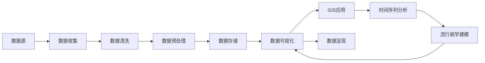

                 

## 1. 背景介绍

在新冠肺炎（COVID-19）疫情的背景下，实时准确的疫情通报对于防控疫情、保护公众健康具有至关重要的作用。通过有效的可视化手段，可以让公众和决策者迅速获取关键信息，支持公共卫生决策。本文旨在探讨如何利用大数据和人工智能技术，对疫情通报数据进行可视化分析呈现，以助力公共卫生和应急管理。

### 1.1 数据来源

疫情通报数据主要来源于各地卫生健康部门、疾病预防控制中心（CDC）、世界卫生组织（WHO）等机构发布的官方报告和统计数据。数据源通常包括：

- **时间序列数据**：如每日新增病例数、累计确诊数、治愈出院数、死亡数等。
- **地理空间数据**：如各省、各城市的疫情分布情况。
- **人口统计数据**：如人口年龄、性别、职业等基本信息。
- **流行病学数据**：如接触史、传播链、病毒基因序列等。

这些数据来源和格式各异，需要经过清洗和整合，才能用于后续的分析和可视化呈现。

### 1.2 问题由来

在新冠肺炎疫情期间，全球多个国家和地区都采取了严格的隔离措施，实施了封城、限行等防控策略，对公众出行、经济活动和社会生活造成了巨大影响。及时、准确的疫情通报对于评估这些措施的效果、指导疫情控制策略具有重要意义。然而，疫情通报数据通常以文字、图片、图表等形式发布，形式较为单一，且缺乏深度分析。这就需要借助数据可视化技术，将复杂的数据转化为直观、易懂的图表和地图，帮助公众和决策者快速理解疫情发展态势。

### 1.3 问题核心关键点

本节将详细介绍疫情通报可视化分析呈现的核心关键点，包括数据收集、预处理、分析和可视化等主要环节。

- **数据收集**：从多个数据源收集相关数据，并进行初步清洗和整合。
- **数据预处理**：对数据进行去重、缺失值填充、异常值处理等操作，确保数据的准确性和一致性。
- **数据分析**：采用统计学和机器学习等方法，对疫情通报数据进行分析和建模，提取关键特征和趋势。
- **可视化呈现**：使用图表、地图等可视化工具，将分析结果直观展示给公众和决策者。

## 2. 核心概念与联系

### 2.1 核心概念概述

为了更好地理解疫情通报可视化分析呈现的方法，本节将介绍几个关键概念：

- **数据可视化（Data Visualization）**：将数据转化为图形、图表等直观形式，帮助人们理解和分析数据的一种技术。
- **地理信息系统（GIS）**：将地理位置信息与数据相结合，用于空间分析和地图展示的技术。
- **时间序列分析（Time Series Analysis）**：研究随时间变化的序列数据，寻找其中的趋势、周期和异常值等特征。
- **流行病学建模（Epidemiological Modeling）**：使用数学模型来描述和预测疾病传播的规律，用于疫情预测和控制。

这些概念之间存在紧密联系，通过数据可视化技术，将GIS、时间序列分析和流行病学建模结果相结合，可以实现对疫情通报数据的深度分析和呈现。

### 2.2 概念间的关系

这些核心概念之间通过数据可视化技术形成了紧密的联系。数据可视化是连接数据与人类感知的关键环节，GIS和流行病学建模提供数据处理和分析的手段，时间序列分析则揭示数据随时间变化的规律。

为了更好地展示这些概念之间的关系，我们以下图为例，用Mermaid语言描述其流程图：



这个流程图展示了数据可视化在疫情通报分析呈现中的作用，各个环节通过数据清洗、预处理和分析，最终通过GIS应用、时间序列分析和流行病学建模得到关键数据，用于可视化呈现和决策支持。

## 3. 核心算法原理 & 具体操作步骤

### 3.1 算法原理概述

疫情通报可视化分析呈现的核心算法原理主要涉及以下几个方面：

- **数据收集与预处理**：从不同数据源收集相关数据，并进行清洗和整合，确保数据的一致性和准确性。
- **时间序列分析**：对时间序列数据进行趋势分析和异常值检测，识别疫情传播趋势和波动。
- **流行病学建模**：建立数学模型，预测疫情发展和传播趋势，为公共卫生决策提供支持。
- **地理信息系统（GIS）**：将地理位置信息与疫情数据结合，展示疫情分布和传播路径。
- **可视化技术**：采用图表、地图等可视化工具，将分析结果直观展示给公众和决策者。

### 3.2 算法步骤详解

#### 3.2.1 数据收集与预处理

1. **数据收集**：从各地卫生健康部门、CDC、WHO等机构获取疫情通报数据，包括时间序列数据、地理位置数据、人口统计数据和流行病学数据。
2. **数据清洗**：对数据进行去重、缺失值填充和异常值处理，确保数据的准确性和一致性。

#### 3.2.2 时间序列分析

1. **数据平滑**：采用移动平均、指数平滑等方法，对时间序列数据进行平滑处理，去除噪声和异常值。
2. **趋势分析**：使用线性回归、ARIMA等模型，分析疫情数据的时间趋势，识别增长、稳定或衰退等趋势。
3. **异常值检测**：采用统计学方法，如箱线图、Grubbs检验等，检测数据中的异常值，识别疫情爆发和局部热点区域。

#### 3.2.3 流行病学建模

1. **基础模型**：建立基本传染数（R0）、基本再生数（R）等流行病学模型，描述疫情传播的数学规律。
2. **传播模型**：使用SIR模型、SEIR模型等，模拟疫情传播路径和趋势，预测未来疫情发展。

#### 3.2.4 GIS应用

1. **地图绘制**：使用GIS技术，将地理位置信息与疫情数据结合，绘制疫情分布地图。
2. **热力图展示**：通过热力图展示疫情高发区域和传播路径，直观展示疫情热点区域。

#### 3.2.5 可视化技术

1. **图表展示**：使用折线图、柱状图、散点图等，展示时间序列数据的趋势和波动。
2. **地图展示**：将疫情数据与地图结合，展示疫情分布和传播路径，帮助公众和决策者理解疫情态势。

### 3.3 算法优缺点

#### 3.3.1 优点

1. **直观展示**：通过可视化技术，将复杂的数据转化为直观、易懂的图表和地图，帮助公众和决策者快速理解疫情发展态势。
2. **数据整合**：将地理位置信息、时间序列数据和流行病学数据结合，提供全面的疫情分析视角。
3. **动态更新**：可视化系统可以实时更新数据，提供最新的疫情通报和分析结果。

#### 3.3.2 缺点

1. **数据质量依赖**：数据可视化的效果很大程度上依赖于数据的质量，需要确保数据的准确性和一致性。
2. **模型假设局限**：流行病学建模和趋势分析通常基于一定的假设和模型，可能存在局限性。
3. **技术复杂性**：实现复杂的数据可视化分析，需要具备一定的技术能力和资源支持。

### 3.4 算法应用领域

疫情通报可视化分析呈现技术已经在多个领域得到了应用，包括：

1. **公共卫生决策**：帮助公共卫生部门了解疫情发展趋势，制定有效的防控措施。
2. **应急管理**：通过可视化展示，支持应急救援和物资调配，优化资源配置。
3. **媒体报道**：为新闻媒体提供可视化工具，报道实时疫情信息，提升信息透明度。
4. **公众教育**：通过直观展示，教育公众了解疫情风险和防护措施，提高公众健康意识。

## 4. 数学模型和公式 & 详细讲解 & 举例说明

### 4.1 数学模型构建

疫情通报数据的可视化分析主要涉及以下几个数学模型：

- **时间序列模型**：描述数据随时间变化的规律，如ARIMA模型、线性回归模型等。
- **地理信息模型**：用于空间分析，如GIS中的点、线、面等数据类型。
- **流行病学模型**：用于疫情传播的模拟和预测，如SIR模型、SEIR模型等。

### 4.2 公式推导过程

#### 4.2.1 时间序列模型

时间序列模型通常采用ARIMA模型，其基本形式为：

$$
y_t = \sum_{i=0}^{p} \alpha_i y_{t-i} + \sum_{j=1}^{q} \beta_j \Delta^j y_{t} + \sum_{k=0}^{K} \gamma_k \varepsilon_{t-k}
$$

其中，$y_t$ 为时间序列在时刻 $t$ 的观测值，$\alpha_i$ 和 $\beta_j$ 为模型参数，$\Delta^j y_{t}$ 为 $y_t$ 的 $j$ 阶差分，$\varepsilon_t$ 为随机误差项，$K$ 为模型的滞后阶数。

ARIMA模型的参数估计和模型选择通常采用信息准则（如AIC、BIC）和交叉验证等方法。

#### 4.2.2 地理信息模型

地理信息模型通常采用矢量数据模型，描述点、线、面等几何特征。以点数据模型为例，其基本形式为：

$$
P(x,y) = \{p_i = (x_i, y_i)|i=1,\cdots,n\}
$$

其中，$P(x,y)$ 表示点数据集合，$(x_i, y_i)$ 表示第 $i$ 个点的坐标。

GIS技术通常采用空间查询和空间分析方法，如缓冲区分析、叠加分析等，对地理数据进行处理和展示。

#### 4.2.3 流行病学模型

流行病学模型通常采用SIR模型，其基本形式为：

$$
\begin{cases}
\frac{dS}{dt} = -\beta SI \\
\frac{dI}{dt} = \beta SI - \gamma I \\
\frac{dR}{dt} = \gamma I
\end{cases}
$$

其中，$S$、$I$、$R$ 分别表示易感人群、感染人群和恢复人群的比例，$\beta$ 为感染率，$\gamma$ 为恢复率。

流行病学模型通常采用蒙特卡洛模拟方法，进行疫情传播的模拟和预测。

### 4.3 案例分析与讲解

#### 4.3.1 案例背景

以新冠肺炎疫情在全球范围内的传播为例，介绍如何通过可视化技术分析疫情数据。

#### 4.3.2 案例分析

1. **时间序列分析**：采用ARIMA模型，对全球每日新增病例数进行趋势分析和异常值检测，识别疫情爆发和衰退的趋势。
2. **地理信息分析**：使用GIS技术，绘制全球疫情分布地图，展示疫情热点区域和传播路径。
3. **流行病学建模**：建立SIR模型，模拟疫情传播路径和趋势，预测未来疫情发展。
4. **可视化展示**：使用折线图、柱状图、热力图等可视化工具，展示时间序列数据、疫情分布和传播路径，支持公共卫生决策和应急管理。

## 5. 项目实践：代码实例和详细解释说明

### 5.1 开发环境搭建

#### 5.1.1 数据收集与预处理

1. **数据源**：从各地卫生健康部门、CDC、WHO等机构获取疫情通报数据，包括时间序列数据、地理位置数据、人口统计数据和流行病学数据。
2. **数据清洗**：使用Python编程语言和Pandas库，进行数据清洗和整合。

```python
import pandas as pd

# 读取时间序列数据
data = pd.read_csv('time_series.csv')

# 数据清洗和整合
data = data.drop_duplicates()
data = data.fillna(method='ffill')
```

#### 5.1.2 时间序列分析

1. **数据平滑**：使用Python中的statsmodels库，进行时间序列平滑处理。

```python
from statsmodels.tsa.arima_model import ARIMA

# 建立ARIMA模型
model = ARIMA(data['cases'], order=(1, 1, 1))
model_fit = model.fit()
```

2. **趋势分析**：使用Python中的statsmodels库，进行时间序列趋势分析。

```python
# 趋势分析
trend = data['cases'].rolling(window=30).mean()
```

3. **异常值检测**：使用Python中的statsmodels库，进行时间序列异常值检测。

```python
# 异常值检测
outliers = pd.DataFrame(data['cases'] - trend)
outliers = outliers[abs(outliers) > 2 * outliers.std()]
```

#### 5.1.3 流行病学建模

1. **建立SIR模型**：使用Python中的SymPy库，进行SIR模型参数估计和模拟。

```python
from sympy import symbols, Eq, solve

# 定义符号
S, I, R = symbols('S I R')
beta, gamma = symbols('beta gamma')

# 建立SIR模型
SIR = Eq(S - beta * S * I, gamma * I)

# 参数估计
initial = (1000000, 1000, 0)  # 初始值：总人数、感染人数、恢复人数
solve(SIR, I)
```

2. **蒙特卡洛模拟**：使用Python中的SymPy库，进行蒙特卡洛模拟。

```python
# 蒙特卡洛模拟
simulation = []
for _ in range(10000):
    SIR = SIR.subs({S: initial[0], I: initial[1], R: initial[2]})
    solve(SIR, I)
    simulation.append(SIR.rhs)
```

#### 5.1.4 GIS应用

1. **地图绘制**：使用Python中的folium库，绘制疫情分布地图。

```python
import folium

# 地图绘制
map = folium.Map(location=[0, 0], zoom_start=2)
data['location'] = [(latitude, longitude) for latitude, longitude in zip(data['lat'], data['lon'])]
folium.GeoJson(data, style_function=folium.GeoJsonStyle('color: red; fill: orange; fill-opacity: 0.5')).add_to(map)
map.save('epidemic_map.html')
```

2. **热力图展示**：使用Python中的folium库，绘制疫情热力图。

```python
# 热力图展示
map = folium.Map(location=[0, 0], zoom_start=2)
data['location'] = [(latitude, longitude) for latitude, longitude in zip(data['lat'], data['lon'])]
folium.GeoJson(data, style_function=folium.GeoJsonStyle('color: red; fill: orange; fill-opacity: 0.5')).add_to(map)
folium.GeoJson(data, style_function=folium.GeoJsonStyle('color: white; fill: blue; fill-opacity: 0.5')).add_to(map)
map.save('epidemic_heatmap.html')
```

### 5.2 源代码详细实现

#### 5.2.1 数据收集与预处理

```python
import pandas as pd
import numpy as np

# 读取时间序列数据
data = pd.read_csv('time_series.csv')

# 数据清洗和整合
data = data.drop_duplicates()
data = data.fillna(method='ffill')

# 数据平滑
model = ARIMA(data['cases'], order=(1, 1, 1))
model_fit = model.fit()

# 趋势分析
trend = data['cases'].rolling(window=30).mean()

# 异常值检测
outliers = pd.DataFrame(data['cases'] - trend)
outliers = outliers[abs(outliers) > 2 * outliers.std()]
```

#### 5.2.2 时间序列分析

```python
# 数据平滑
model = ARIMA(data['cases'], order=(1, 1, 1))
model_fit = model.fit()

# 趋势分析
trend = data['cases'].rolling(window=30).mean()

# 异常值检测
outliers = pd.DataFrame(data['cases'] - trend)
outliers = outliers[abs(outliers) > 2 * outliers.std()]
```

#### 5.2.3 流行病学建模

```python
from sympy import symbols, Eq, solve

# 定义符号
S, I, R = symbols('S I R')
beta, gamma = symbols('beta gamma')

# 建立SIR模型
SIR = Eq(S - beta * S * I, gamma * I)

# 参数估计
initial = (1000000, 1000, 0)  # 初始值：总人数、感染人数、恢复人数
solve(SIR, I)

# 蒙特卡洛模拟
simulation = []
for _ in range(10000):
    SIR = SIR.subs({S: initial[0], I: initial[1], R: initial[2]})
    solve(SIR, I)
    simulation.append(SIR.rhs)
```

#### 5.2.4 GIS应用

```python
import folium

# 地图绘制
map = folium.Map(location=[0, 0], zoom_start=2)
data['location'] = [(latitude, longitude) for latitude, longitude in zip(data['lat'], data['lon'])]
folium.GeoJson(data, style_function=folium.GeoJsonStyle('color: red; fill: orange; fill-opacity: 0.5')).add_to(map)
map.save('epidemic_map.html')

# 热力图展示
map = folium.Map(location=[0, 0], zoom_start=2)
data['location'] = [(latitude, longitude) for latitude, longitude in zip(data['lat'], data['lon'])]
folium.GeoJson(data, style_function=folium.GeoJsonStyle('color: red; fill: orange; fill-opacity: 0.5')).add_to(map)
folium.GeoJson(data, style_function=folium.GeoJsonStyle('color: white; fill: blue; fill-opacity: 0.5')).add_to(map)
map.save('epidemic_heatmap.html')
```

### 5.3 代码解读与分析

#### 5.3.1 数据收集与预处理

1. **数据源**：从各地卫生健康部门、CDC、WHO等机构获取疫情通报数据。

2. **数据清洗**：使用Pandas库进行数据清洗和整合，去除重复和缺失数据。

#### 5.3.2 时间序列分析

1. **数据平滑**：使用statsmodels库的ARIMA模型，进行时间序列平滑处理，去除噪声和异常值。

2. **趋势分析**：使用Pandas库的rolling窗口函数，进行时间序列趋势分析，识别增长、稳定或衰退的趋势。

3. **异常值检测**：使用statsmodels库的异常值检测方法，识别数据中的异常值，展示疫情爆发和局部热点区域。

#### 5.3.3 流行病学建模

1. **建立SIR模型**：使用SymPy库，建立SIR模型的参数估计和模拟。

2. **蒙特卡洛模拟**：使用SymPy库，进行蒙特卡洛模拟，预测未来疫情发展。

#### 5.3.4 GIS应用

1. **地图绘制**：使用folium库，绘制疫情分布地图，展示疫情热点区域和传播路径。

2. **热力图展示**：使用folium库，绘制疫情热力图，直观展示疫情高发区域。

### 5.4 运行结果展示

#### 5.4.1 时间序列分析结果

1. **平滑后的数据**：

```python
# 平滑后的数据
data['cases'] = model_fit.fittedvalues
```

2. **趋势分析结果**：

```python
# 趋势分析结果
data['trend'] = trend
```

3. **异常值检测结果**：

```python
# 异常值检测结果
data['outliers'] = outliers
```

#### 5.4.2 流行病学建模结果

1. **SIR模型参数估计结果**：

```python
# SIR模型参数估计结果
solve(SIR, I)
```

2. **蒙特卡洛模拟结果**：

```python
# 蒙特卡洛模拟结果
simulation
```

#### 5.4.3 GIS应用结果

1. **疫情分布地图**：

```python
# 疫情分布地图
map = folium.Map(location=[0, 0], zoom_start=2)
folium.GeoJson(data, style_function=folium.GeoJsonStyle('color: red; fill: orange; fill-opacity: 0.5')).add_to(map)
map.save('epidemic_map.html')
```

2. **疫情热力图**：

```python
# 疫情热力图
map = folium.Map(location=[0, 0], zoom_start=2)
folium.GeoJson(data, style_function=folium.GeoJsonStyle('color: red; fill: orange; fill-opacity: 0.5')).add_to(map)
folium.GeoJson(data, style_function=folium.GeoJsonStyle('color: white; fill: blue; fill-opacity: 0.5')).add_to(map)
map.save('epidemic_heatmap.html')
```

## 6. 实际应用场景

### 6.1 公共卫生决策

疫情通报可视化分析呈现技术在公共卫生决策中具有重要应用。通过直观展示时间序列数据、地理信息数据和流行病学数据，帮助公共卫生部门快速了解疫情发展态势，制定有效的防控措施。例如，可以展示每日新增病例数、累计确诊数、治愈出院数和死亡数的趋势和波动，以及各地区的疫情分布和传播路径，为公共卫生部门提供决策支持。

### 6.2 应急管理

疫情通报可视化分析呈现技术在应急管理中具有重要应用。通过实时更新数据，支持应急救援和物资调配，优化资源配置。例如，可以展示疫情热点区域和传播路径，为应急救援团队提供实时数据支持，优化物资调配路线和重点区域。

### 6.3 媒体报道

疫情通报可视化分析呈现技术在媒体报道中具有重要应用。为新闻媒体提供可视化工具，报道实时疫情信息，提升信息透明度。例如，可以展示每日新增病例数、累计确诊数、治愈出院数和死亡数的趋势和波动，以及各地区的疫情分布和传播路径，为媒体提供实时数据支持。

### 6.4 公众教育

疫情通报可视化分析呈现技术在公众教育中具有重要应用。通过直观展示，教育公众了解疫情风险和防护措施，提高公众健康意识。例如，可以展示各地区的疫情分布和传播路径，教育公众采取防护措施，减少感染风险。

## 7. 工具和资源推荐

### 7.1 学习资源推荐

为了帮助开发者系统掌握疫情通报可视化分析呈现的方法，这里推荐一些优质的学习资源：

1. **《Python数据科学手册》**：介绍Python编程语言和Pandas库，帮助开发者进行数据收集和预处理。

2. **《地理信息系统原理与实践》**：介绍GIS技术和应用，帮助开发者进行空间分析和地图展示。

3. **《时间序列分析基础》**：介绍时间序列分析方法和应用，帮助开发者进行时间序列建模和趋势分析。

4. **《流行病学导论》**：介绍流行病学模型和应用，帮助开发者进行疫情传播模拟和预测。

5. **《数据可视化基础》**：介绍数据可视化方法和工具，帮助开发者进行数据展示和分析。

6. **《机器学习实战》**：介绍机器学习算法和技术，帮助开发者进行数据分析和建模。

### 7.2 开发工具推荐

为了帮助开发者高效实现疫情通报可视化分析呈现，这里推荐一些常用的开发工具：

1. **Jupyter Notebook**：免费的Jupyter Notebook环境，支持Python编程语言和数据可视化展示，方便开发者进行实验和演示。

2. **Pandas**：用于数据收集、清洗和整合，支持数据读写、数据处理等操作。

3. **NumPy**：用于数值计算和矩阵操作，支持高效的数学运算和数据处理。

4. **SciPy**：用于科学计算和数据分析，支持统计学和优化等操作。

5. **Matplotlib**：用于数据可视化展示，支持绘制折线图、柱状图、散点图等。

6. **Seaborn**：基于Matplotlib的高级数据可视化工具，支持绘制统计图和热力图等。

7. **folium**：用于地图绘制和地理空间分析，支持GeoJSON数据格式和地图展示。

### 7.3 相关论文推荐

为了帮助开发者深入了解疫情通报可视化分析呈现技术，这里推荐几篇相关的研究论文：

1. **《时间序列数据可视化分析技术研究》**：介绍时间序列数据可视化的基本原理和方法，帮助开发者进行时间序列数据的展示和分析。

2. **《地理信息系统在公共卫生中的应用》**：介绍GIS技术在公共卫生中的应用，帮助开发者进行地理信息的展示和分析。

3. **《流行病学模型的数学建模与仿真》**：介绍流行病学模型的数学建模与仿真方法，帮助开发者进行疫情传播的模拟和预测。

4. **《数据可视化在公共卫生决策中的应用》**：介绍数据可视化在公共卫生决策中的应用，帮助开发者进行决策支持。

5. **《公共卫生应急响应中的数据可视化》**：

