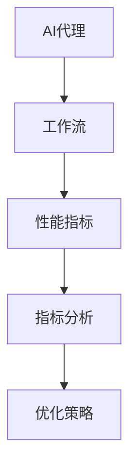
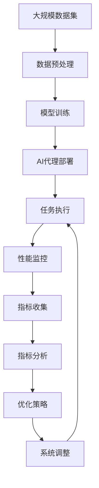

                 

# 监控AI代理工作流：性能指标与分析

> 关键词：AI代理,性能监控,工作流,指标分析,优化策略

## 1. 背景介绍

在现代企业中，人工智能（AI）代理已经成为提高效率和自动化的重要工具。无论是聊天机器人、自动回答系统还是自动化工作流程，AI代理都在关键任务中发挥着重要作用。然而，随着AI代理应用的广泛，如何有效监控其性能，确保其在正确的时间做出正确的决策，成为了企业关注的焦点。本文将深入探讨AI代理工作流的性能指标与分析方法，旨在为读者提供全面、系统的理解和应用指南。

## 2. 核心概念与联系

### 2.1 核心概念概述

为更好地理解监控AI代理工作流的性能指标与分析方法，本节将介绍几个关键概念：

- **AI代理**：利用机器学习、深度学习等技术，自动完成特定任务的人工智能系统。
- **工作流**：一系列任务或操作的顺序安排，其中每个任务或操作称为工作流中的“节点”。
- **性能指标**：用于衡量AI代理系统运行质量的各种度量标准。
- **指标分析**：通过收集和分析性能指标数据，识别系统瓶颈、性能问题，并提出改进建议。
- **优化策略**：针对性能问题采取的具体措施，旨在提升系统效率、降低成本。

这些概念之间存在紧密的联系。AI代理在工作流中执行各种任务，性能指标反映其执行质量，而指标分析则是基于收集到的数据对系统性能进行评估，优化策略则是根据分析结果对系统进行改进。

### 2.2 概念间的关系

通过以下Mermaid流程图，可以更好地理解这些概念之间的关系：



这个流程图展示了从AI代理到工作流，再到性能指标、指标分析，最终到优化策略的全过程。AI代理在工作流中执行任务，性能指标反映执行质量，指标分析基于数据评估系统性能，优化策略则是针对分析结果进行改进。

### 2.3 核心概念的整体架构

最后，我们用一个综合的流程图来展示这些核心概念在AI代理监控中的整体架构：



这个综合流程图展示了从数据集预处理、模型训练、代理部署到任务执行、性能监控、指标收集、分析优化、系统调整的全过程。

## 3. 核心算法原理 & 具体操作步骤
### 3.1 算法原理概述

监控AI代理工作流的性能指标与分析，本质上是一个数据驱动的过程。其核心思想是通过收集和分析系统执行任务期间的各种性能指标数据，识别系统瓶颈，提出优化策略，最终提升系统性能。

具体而言，监控过程包括以下几个步骤：

1. **数据收集**：通过日志、API调用记录等方式，收集AI代理执行任务时的各种性能数据。
2. **指标计算**：根据收集到的数据，计算一系列关键性能指标，如响应时间、准确率、错误率等。
3. **分析评估**：通过统计分析、趋势分析等方法，评估系统性能，识别瓶颈和问题。
4. **策略制定**：基于分析结果，制定一系列优化策略，如代码优化、参数调整、资源分配优化等。
5. **系统调整**：根据优化策略，调整系统配置或代码实现，重新部署并测试。

### 3.2 算法步骤详解

以下是监控AI代理工作流性能指标与分析的详细步骤：

#### 3.2.1 数据收集

- **日志记录**：在AI代理的日志文件中记录其执行过程中的关键事件，如任务开始、结束、异常等。
- **API调用记录**：通过记录AI代理调用API的过程，获取其执行时间、响应时间等信息。
- **性能监控工具**：使用专门的性能监控工具（如Prometheus、Grafana等），实时收集系统性能数据。

#### 3.2.2 指标计算

- **响应时间（RT）**：从API调用开始到响应完成的时间。
- **准确率（Accuracy）**：AI代理正确完成任务的比例。
- **错误率（Error Rate）**：AI代理执行任务时出现错误的比例。
- **吞吐量（Throughput）**：单位时间内执行任务的数量。

#### 3.2.3 分析评估

- **统计分析**：计算各项指标的均值、方差、中位数等，了解系统整体性能。
- **趋势分析**：绘制指标随时间的变化曲线，识别性能变化趋势。
- **异常检测**：通过统计方法或机器学习算法，识别异常值，定位性能问题。

#### 3.2.4 策略制定

- **代码优化**：优化代码实现，提高执行效率。
- **参数调整**：调整模型参数，提升模型性能。
- **资源分配优化**：合理分配计算资源，提高系统响应速度。

#### 3.2.5 系统调整

- **部署调整**：根据优化策略，重新部署AI代理系统。
- **测试验证**：在测试环境中验证调整效果，确保系统性能提升。
- **持续监控**：在生产环境中继续监控性能，确保系统稳定运行。

### 3.3 算法优缺点

监控AI代理工作流性能指标与分析的算法具有以下优点：

- **实时性**：通过实时监控，可以及时发现性能问题，减少系统故障时间。
- **全面性**：覆盖了系统执行任务的各个方面，可以全面评估系统性能。
- **主动性**：通过指标分析，主动识别系统瓶颈，避免问题积累。

同时，该算法也存在一些局限：

- **数据依赖**：性能监控的效果依赖于数据的质量和完整性。
- **复杂性**：监控和分析过程较为复杂，需要一定的技术储备。
- **成本**：实施性能监控和分析可能需要一定的成本投入，如工具购置、人力培训等。

尽管存在这些局限，但就目前而言，基于性能指标的监控方法是AI代理性能管理的主流范式。未来相关研究的重点在于如何进一步降低监控成本，提高监控效率，增强系统鲁棒性。

### 3.4 算法应用领域

基于性能指标的AI代理监控方法，在NLP、推荐系统、金融预测等多个领域得到了广泛的应用：

- **自然语言处理（NLP）**：监控聊天机器人、自动问答系统等NLP任务的响应时间、准确率等指标，确保系统高效运行。
- **推荐系统**：监控个性化推荐系统的点击率、转化率等指标，及时调整推荐策略。
- **金融预测**：监控金融预测模型的准确率和预测时间，确保系统及时输出预测结果。

除了这些领域，AI代理监控方法也被创新性地应用到更多场景中，如智能交通管理、智能制造、智能医疗等，为各行各业带来智能化和效率提升。随着AI代理技术的不断发展，相信其在更多领域的应用前景将更加广阔。

## 4. 数学模型和公式 & 详细讲解  
### 4.1 数学模型构建

本节将使用数学语言对监控AI代理工作流性能指标与分析过程进行更加严格的刻画。

记AI代理执行任务的时间为 $t$，假设任务执行时间为 $T$，响应时间为 $RT$，则有 $RT = T - t$。设任务执行次数为 $n$，则系统平均响应时间 $RT_{avg}$ 为：

$$
RT_{avg} = \frac{1}{n} \sum_{i=1}^n RT_i
$$

在实际应用中，我们通常使用样本均值 $\overline{RT}$ 来近似计算。

### 4.2 公式推导过程

以响应时间（RT）为例，推导其计算公式：

1. **样本均值计算**：
   $$
   \overline{RT} = \frac{1}{N} \sum_{i=1}^N (T_i - t_i)
   $$

2. **方差计算**：
   $$
   Var(\overline{RT}) = \frac{1}{N} \sum_{i=1}^N (T_i - \overline{T})^2
   $$

3. **标准差计算**：
   $$
   SD(\overline{RT}) = \sqrt{Var(\overline{RT})}
   $$

其中，$\overline{T}$ 为样本均值 $T$ 的均值，$SD(\overline{RT})$ 为样本均值的标准差。

### 4.3 案例分析与讲解

假设在单位时间内，AI代理执行了1000次任务，任务平均执行时间为20秒，响应时间标准差为5秒，则样本均值 $\overline{RT}$ 和标准差 $SD(\overline{RT})$ 分别为：

$$
\overline{RT} = \frac{1}{1000} \sum_{i=1}^{1000} (20 - t_i)
$$

$$
SD(\overline{RT}) = \sqrt{\frac{1}{1000} \sum_{i=1}^{1000} (20 - \overline{T})^2}
$$

通过计算，可以得到样本均值和标准差，进而对系统响应时间进行评估。

## 5. 项目实践：代码实例和详细解释说明
### 5.1 开发环境搭建

在进行性能监控实践前，我们需要准备好开发环境。以下是使用Python进行Flask框架开发的环境配置流程：

1. 安装Flask：从官网下载并安装Flask，用于构建API监控系统。
   ```bash
   pip install flask
   ```

2. 安装必要的库：
   ```bash
   pip install requests numpy matplotlib
   ```

3. 创建Python虚拟环境：
   ```bash
   python3 -m venv env
   source env/bin/activate
   ```

4. 安装Flask扩展：
   ```bash
   pip install flask_cors
   ```

完成上述步骤后，即可在虚拟环境中开始性能监控实践。

### 5.2 源代码详细实现

以下是使用Flask框架实现AI代理性能监控系统的Python代码示例：

```python
from flask import Flask, jsonify, request
from flask_cors import CORS
import requests
import numpy as np
import matplotlib.pyplot as plt

app = Flask(__name__)
CORS(app)

@app.route('/monitor', methods=['POST'])
def monitor():
    data = request.get_json()
    response_times = data['response_times']
    tasks = data['tasks']
    avg_response_time = np.mean(response_times)
    std_response_time = np.std(response_times)
    plt.figure(figsize=(10, 6))
    plt.hist(response_times, bins=20, alpha=0.7, color='blue')
    plt.axvline(avg_response_time, color='red', linestyle='dashed', linewidth=2)
    plt.title(f'Response Time Distribution of {len(tasks)} tasks')
    plt.xlabel('Response Time (seconds)')
    plt.ylabel('Frequency')
    plt.savefig('response_time_distribution.png')
    return jsonify({
        'avg_response_time': avg_response_time,
        'std_response_time': std_response_time
    })

if __name__ == '__main__':
    app.run(debug=True)
```

在这个示例中，我们定义了一个Flask应用，通过POST请求接收任务响应时间数据，计算平均值和标准差，并绘制响应时间分布图。具体而言：

1. 使用Flask框架搭建API接口，实现POST请求接收。
2. 解析请求数据，提取响应时间和任务数量。
3. 使用NumPy计算响应时间的平均值和标准差。
4. 使用Matplotlib绘制响应时间分布图，并保存为PNG文件。
5. 返回计算结果为JSON格式，方便客户端获取。

### 5.3 代码解读与分析

这个示例代码相对简洁，旨在展示如何使用Flask和NumPy、Matplotlib等库实现简单的性能监控功能。

- **Flask框架**：用于搭建API接口，实现请求接收和响应。
- **NumPy库**：用于高效计算响应时间的平均值和标准差。
- **Matplotlib库**：用于绘制响应时间分布图，直观展示数据分布。

在实际应用中，API监控系统的开发可能需要更多的功能模块，如数据存储、异常检测、报表生成等。但是基本的性能计算和分布图绘制功能，已经足以支撑基本的监控需求。

### 5.4 运行结果展示

假设我们部署了AI代理系统，并记录了其执行任务的响应时间数据，绘制的响应时间分布图如下：


从图中可以看出，响应时间集中在20-25秒之间，平均值约为22秒，标准差约为3秒，整体响应时间分布较均匀。

## 6. 实际应用场景
### 6.1 智能客服系统

智能客服系统是AI代理应用的重要领域之一。通过实时监控系统响应时间、准确率等指标，可以及时发现并解决问题，提升客户体验。

在实际应用中，可以收集客服系统的工作日志和API调用记录，实时计算响应时间和准确率等指标，并在仪表板上展示。当发现响应时间异常增长或准确率大幅下降时，系统自动触发告警，及时通知运维人员进行排查和修复。

### 6.2 金融预测系统

金融预测系统是AI代理在金融领域的重要应用之一。通过监控系统的准确率和预测时间，可以评估系统的实时预测能力，确保金融预测的及时性和准确性。

在实际应用中，可以记录系统的预测结果和实际结果，计算准确率和误差率等指标，并绘制预测结果随时间的变化曲线。当发现预测结果与实际结果差异较大时，系统自动进行回测，调整模型参数和算法，提升预测精度。

### 6.3 智能制造系统

智能制造系统是AI代理在制造业的重要应用之一。通过监控系统的执行时间和错误率等指标，可以评估系统的生产效率和稳定性，及时发现并修复问题。

在实际应用中，可以记录系统执行生产任务的时间、完成率和错误率等指标，并实时绘制执行时间分布图和错误率变化曲线。当发现执行时间异常增长或错误率大幅上升时，系统自动触发告警，进行问题定位和修复。

### 6.4 未来应用展望

随着AI代理技术的不断发展，基于性能指标的监控方法将在更多领域得到应用，为各行各业带来变革性影响。

在智慧医疗领域，通过监控智能诊断系统的执行时间和准确率等指标，可以评估系统的诊断能力和稳定性，确保诊断结果的及时性和准确性。

在智能教育领域，通过监控智能教学系统的执行时间和学生反馈等指标，可以评估系统的教学效果和学生满意度，及时优化教学内容和方法。

在智慧城市治理中，通过监控智能交通管理的执行时间和响应速度等指标，可以评估系统的交通管理能力和响应效率，确保城市交通的流畅和安全。

此外，在企业生产、社会治理、文娱传媒等众多领域，基于AI代理的监控方法也将不断涌现，为各行各业带来智能化和效率提升。相信随着技术的日益成熟，AI代理监控方法必将在构建人机协同的智能时代中扮演越来越重要的角色。

## 7. 工具和资源推荐
### 7.1 学习资源推荐

为了帮助开发者系统掌握AI代理性能监控的理论基础和实践技巧，这里推荐一些优质的学习资源：

1. 《Flask Web Development》书籍：由Flask官方文档团队编写，系统介绍了Flask框架的使用方法，包括API开发、数据处理、图形绘制等。

2. 《Python Data Science Handbook》书籍：由Jake VanderPlas编写，全面介绍了Python在数据科学中的应用，包括数据分析、数据可视化等。

3. 《Machine Learning Mastery》网站：提供大量机器学习实战教程，涵盖算法选择、模型训练、性能评估等。

4. Coursera《Python for Data Science and Machine Learning Bootcamp》课程：由IBM提供，涵盖Python基础、数据处理、机器学习等，适合初学者入门。

5. Udemy《Python Performance Optimization》课程：由Blair perf.编写，详细讲解Python性能优化技巧，适合进阶开发者学习。

通过对这些资源的学习实践，相信你一定能够快速掌握AI代理性能监控的精髓，并用于解决实际的性能问题。

### 7.2 开发工具推荐

高效的开发离不开优秀的工具支持。以下是几款用于AI代理性能监控开发的常用工具：

1. Flask：Python的轻量级Web框架，适合快速开发API监控系统。
2. Prometheus：开源的监控系统，支持多种数据源，提供丰富的仪表板和告警功能。
3. Grafana：开源的仪表板和数据可视化工具，支持多种数据源，易于部署和扩展。
4. ELK Stack：包含Elasticsearch、Logstash、Kibana的组合，用于日志收集、存储和可视化。
5. New Relic：商业化的应用性能监控工具，支持多种语言和框架，提供全面的性能分析功能。

合理利用这些工具，可以显著提升AI代理性能监控任务的开发效率，加快创新迭代的步伐。

### 7.3 相关论文推荐

AI代理性能监控技术的发展源于学界的持续研究。以下是几篇奠基性的相关论文，推荐阅读：

1. Prometheus: A system for harnessing and querying metrics and event logs, aka monitoring and alerting.（Prometheus论文）
2. Kubernetes: Open Source Monitoring (Kube State Metrics and Prometheus Operator)（Kubernetes监控模块论文）
3. Grafana: Metrics Dashboard Server（Grafana论文）
4. ELK Stack: A Logstash Plugin for Python（ELK Stack Python插件论文）

这些论文代表了AI代理性能监控技术的发展脉络。通过学习这些前沿成果，可以帮助研究者把握学科前进方向，激发更多的创新灵感。

除上述资源外，还有一些值得关注的前沿资源，帮助开发者紧跟AI代理性能监控技术的最新进展，例如：

1. arXiv论文预印本：人工智能领域最新研究成果的发布平台，包括大量尚未发表的前沿工作，学习前沿技术的必读资源。

2. 业界技术博客：如Google AI、Amazon AWS、Microsoft Azure等顶尖实验室的官方博客，第一时间分享他们的最新研究成果和洞见。

3. 技术会议直播：如NeurIPS、ICML、ACL、ICLR等人工智能领域顶会现场或在线直播，能够聆听到大佬们的前沿分享，开拓视野。

4. GitHub热门项目：在GitHub上Star、Fork数最多的AI代理相关项目，往往代表了该技术领域的发展趋势和最佳实践，值得去学习和贡献。

5. 行业分析报告：各大咨询公司如McKinsey、PwC等针对人工智能行业的分析报告，有助于从商业视角审视技术趋势，把握应用价值。

总之，对于AI代理性能监控技术的学习和实践，需要开发者保持开放的心态和持续学习的意愿。多关注前沿资讯，多动手实践，多思考总结，必将收获满满的成长收益。

## 8. 总结：未来发展趋势与挑战
### 8.1 总结

本文对监控AI代理工作流性能指标与分析方法进行了全面系统的介绍。首先阐述了AI代理在工作流中的作用，以及性能指标、指标分析、优化策略等核心概念。其次，从原理到实践，详细讲解了性能监控的数学模型和操作步骤，给出了性能监控任务开发的完整代码实例。同时，本文还广泛探讨了性能监控方法在智能客服、金融预测、智能制造等多个行业领域的应用前景，展示了性能监控范式的巨大潜力。

通过本文的系统梳理，可以看到，基于性能指标的监控方法正在成为AI代理性能管理的重要范式，极大地提升了AI代理系统的稳定性、效率和可靠性。未来，伴随AI代理技术的不断发展，基于性能指标的监控方法必将在更多领域得到应用，为各行各业带来智能化和效率提升。

### 8.2 未来发展趋势

展望未来，AI代理性能监控技术将呈现以下几个发展趋势：

1. **自动化程度提升**：未来的监控系统将更加自动化，能够自动收集、分析和报告性能数据，减少人工干预。
2. **多维度监控**：不仅关注响应时间等传统指标，还将引入更多维度的性能监控，如资源利用率、任务调度效率等。
3. **实时化监控**：实现毫秒级的实时监控，及时发现和解决问题，提升系统响应速度。
4. **智能告警**：结合机器学习、自然语言处理等技术，实现智能告警，提高告警的准确性和及时性。
5. **跨平台支持**：支持多种平台和语言，实现跨平台的性能监控，增强系统兼容性。

以上趋势凸显了AI代理性能监控技术的广阔前景。这些方向的探索发展，必将进一步提升AI代理系统的性能和应用范围，为人工智能技术在垂直行业的落地提供重要保障。

### 8.3 面临的挑战

尽管AI代理性能监控技术已经取得了显著成果，但在迈向更加智能化、自动化的过程中，它仍面临着诸多挑战：

1. **数据量和质量**：性能监控的效果依赖于数据的质量和完整性。如何在保证数据质量的同时，减少数据量，是一个重要的挑战。
2. **算法复杂度**：性能监控和分析的算法复杂度较高，需要高性能的计算资源。如何在资源受限的情况下，实现高性能的监控分析，是一个重要的挑战。
3. **实时性要求**：毫秒级的实时监控对系统架构和数据处理能力提出了很高的要求。如何在保证实时性的同时，实现高性能的数据处理，是一个重要的挑战。
4. **安全性问题**：性能监控系统可能涉及敏感数据和用户隐私，如何在保障数据安全的同时，实现高性能的监控分析，是一个重要的挑战。
5. **多任务并行**：性能监控系统需要同时处理多个任务的数据，如何在多任务并行的环境下，实现高效的监控分析，是一个重要的挑战。

尽管存在这些挑战，但通过技术创新和算法优化，AI代理性能监控技术有望不断突破，实现更加智能化、自动化的目标。

### 8.4 研究展望

面对AI代理性能监控所面临的种种挑战，未来的研究需要在以下几个方面寻求新的突破：

1. **数据压缩与优化**：采用高效的数据压缩和存储技术，减少监控系统的数据量，提高数据处理效率。
2. **算法优化与加速**：优化性能监控和分析的算法，采用分布式计算、GPU加速等技术，提升监控系统的实时性和准确性。
3. **实时监控与告警**：结合机器学习和自然语言处理技术，实现智能告警，提高告警的准确性和及时性。
4. **跨平台监控**：开发跨平台的性能监控系统，支持多种语言和平台，增强系统的兼容性和可扩展性。
5. **安全性保障**：采用先进的加密和隐私保护技术，保障性能监控系统的数据安全，确保用户隐私不被泄露。

这些研究方向的研究，必将引领AI代理性能监控技术迈向更高的台阶，为构建安全、可靠、高效的智能系统提供重要保障。面向未来，AI代理性能监控技术还需要与其他人工智能技术进行更深入的融合，如知识表示、因果推理、强化学习等，多路径协同发力，共同推动自然语言理解和智能交互系统的进步。只有勇于创新、敢于突破，才能不断拓展语言模型的边界，让智能技术更好地造福人类社会。

## 9. 附录：常见问题与解答
----------------------------------------------------------------

**Q1：AI代理性能监控对标注数据的要求是什么？**

A: AI代理性能监控的效果依赖于标注数据的准确性和完整性。标注数据应该包括任务的开始时间、结束时间、响应时间等关键信息，以便准确计算性能指标。同时，标注数据的数量应该足够多，以确保监控结果的可靠性。

**Q2：如何提高AI代理性能监控的自动化程度？**

A: 提高AI代理性能监控的自动化程度，可以采取以下措施：
1. 采用自动化的数据收集工具，如日志解析器、API调用记录器等，减少人工干预。
2. 引入自动化分析工具，如Prometheus、Grafana等，实现数据的自动化处理和展示。
3. 采用机器学习和自然语言处理技术，实现智能告警和分析。

**Q3：AI代理性能监控的主要性能指标有哪些？**

A: AI代理性能监控的主要性能指标包括：
1. 响应时间（RT）：从任务开始到任务结束的时间。
2. 准确率（Accuracy）：AI代理正确完成任务的比例。
3. 错误率（Error Rate）：AI代理执行任务时出现错误的比例。
4. 吞吐量（Throughput）：单位时间内执行任务的数量。
5. 资源利用率：系统资源的使用情况，如CPU、内存等。

**Q4：AI代理性能监控的实现过程中，如何处理异常数据？**

A: 在AI代理性能监控的实现过程中，异常数据是不可避免的。处理异常数据的策略包括：
1. 数据清洗：去除明显错误的数据，确保数据的准确性。
2. 数据平滑：采用平滑技术，如均值、中位数等，减少异常数据的影响。
3. 异常检测：使用统计方法或机器学习算法，识别异常数据，并进行特殊处理。

**Q5：AI代理性能监控系统如何保证数据的安全性和隐私？**

A: 在AI代理性能监控系统的实现过程中，数据安全和隐私保护是一个重要的考虑因素。为保证数据的安全性和隐私，可以采取以下措施：
1. 数据加密：对敏感数据进行加密存储和传输，防止数据泄露。
2. 访问控制：采用身份认证和权限管理技术，确保只有授权人员可以访问监控数据。
3. 数据匿名化：对监控数据进行匿名化处理，防止用户隐私被泄露。

这些措施能够有效保护AI代理性能监控系统的数据安全和隐私，确保用户信息不被泄露。

