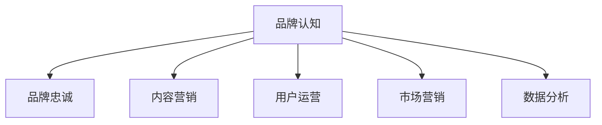

                 

# 知识付费赚钱的品牌品牌运营与品牌推广策略

> 关键词：知识付费,品牌运营,品牌推广,策略,商业化,用户体验,市场营销

## 1. 背景介绍

### 1.1 问题由来
在数字化、信息爆炸的今天，知识的价值日益凸显。知识付费的兴起，让知识拥有者可以通过提供高质量、有价值的内容，获得市场和用户认可，从而实现盈利。然而，知识付费的商业模式并不容易建立和维护，品牌运营和推广在知识付费平台的运营中起着至关重要的作用。如何通过科学的品牌运营和推广策略，提升用户粘性，扩大市场份额，成为知识付费平台运营者面临的重要问题。

### 1.2 问题核心关键点
品牌运营和推广的核心在于：
1. **建立品牌认知**：通过构建品牌形象、传播品牌信息，在用户心中建立深刻的品牌认知。
2. **吸引用户关注**：采用创新的营销手段、内容策略，吸引用户的注意和兴趣。
3. **提升用户粘性**：提供高质量内容、完善用户体验，使用户持续使用平台。
4. **扩大市场份额**：通过多元化推广渠道、精准定位市场，吸引更多潜在用户。
5. **实现商业化**：通过用户付费、广告变现等方式，实现平台盈利。

### 1.3 问题研究意义
研究品牌运营与品牌推广策略，对于提升知识付费平台的品牌影响力和市场地位，实现商业化运营，具有重要意义：

1. **提升用户价值**：通过品牌建设，让用户感受到平台的专业性和可靠性，增加用户信任和忠诚度。
2. **增强市场竞争力**：通过有效的品牌推广，占领市场高地，吸引更多优质内容创作者和用户。
3. **推动商业化进程**：通过用户付费和广告变现，实现平台盈利，为平台的发展提供坚实基础。
4. **强化行业影响力**：通过品牌推广，展示平台的品牌价值和社会责任感，提升行业地位和影响力。
5. **促进知识传播**：通过高质量内容输出，推动知识的普及和应用，促进社会进步和知识创新。

## 2. 核心概念与联系

### 2.1 核心概念概述

品牌运营与品牌推广是知识付费平台商业化运营的重要环节，涉及多个核心概念：

- **品牌认知(Brand Awareness)**：用户对品牌的整体认知，包括品牌名称、标志、口号、定位等。
- **品牌忠诚(Brand Loyalty)**：用户对品牌的忠诚度和信任度，体现在用户的持续使用和口碑传播。
- **内容营销(Content Marketing)**：通过发布高质量、有价值的内容，吸引和留住用户。
- **用户运营(User Operations)**：管理用户的生命周期，通过推荐、引导等方式提升用户价值。
- **市场营销(Marketing Strategy)**：制定推广策略，通过多渠道推广，吸引新用户，扩大市场份额。
- **数据分析(Analytics)**：利用数据驱动决策，优化品牌运营和推广策略，提升效果。

这些核心概念通过以下Mermaid流程图进行展示：



### 2.2 概念间的关系

通过这个图表可以看出，品牌认知是品牌运营和推广的基础，用户运营和市场营销则是品牌认知到品牌忠诚的桥梁，数据分析则是优化和提升运营效果的重要工具。

## 3. 核心算法原理 & 具体操作步骤
### 3.1 算法原理概述

品牌运营与推广的算法原理基于心理学、社会学、市场学等多学科的知识，主要包括以下几个方面：

- **心理认知模型**：理解用户心理，设计有效的品牌信息传递策略。
- **行为经济学**：分析用户行为，制定激励用户的行为策略。
- **网络传播模型**：利用社交网络，扩大品牌信息的传播效果。
- **多渠道推广策略**：根据不同渠道的特点，设计适配的推广内容。

### 3.2 算法步骤详解

1. **目标定位**：明确品牌运营和推广的目标，如提升品牌知名度、吸引新用户、提高用户粘性等。
2. **市场分析**：分析目标市场和用户群体，找出潜在用户，确定推广策略。
3. **内容策略**：设计高质量、有价值的内容，吸引用户关注和兴趣。
4. **推广渠道**：选择合适的推广渠道，如社交媒体、SEO、SEM等，制定推广计划。
5. **数据监测**：通过数据分析工具，监测推广效果，优化策略。
6. **持续优化**：根据数据分析结果，不断调整品牌运营和推广策略，提升效果。

### 3.3 算法优缺点

品牌运营与推广的优点在于：
1. **提升品牌价值**：通过有效的品牌推广，提升品牌的市场影响力和用户认知。
2. **增强用户粘性**：通过内容营销和用户运营，提升用户体验，增加用户忠诚度。
3. **扩大市场份额**：通过多渠道推广，吸引更多新用户，扩大市场覆盖。

缺点在于：
1. **投入成本高**：品牌运营和推广需要投入大量的资源和成本。
2. **效果难以量化**：品牌认知和用户忠诚度的提升，难以用具体的指标量化。
3. **市场变化快**：市场和用户需求变化快，品牌运营策略需要不断调整。

### 3.4 算法应用领域

品牌运营与推广不仅限于知识付费平台，还在广告、电商、旅游等多个领域广泛应用。

## 4. 数学模型和公式 & 详细讲解 & 举例说明
### 4.1 数学模型构建

品牌运营与推广的数学模型主要基于用户行为数据和市场数据构建。以下是一些常见的数学模型：

- **用户流失模型**：
  - **用户流失率**：$\alpha$
  - **用户停留时间**：$t$
  - **流失概率**：$p(t) = \alpha e^{-\alpha t}$
  
- **推广效果模型**：
  - **点击率**：$CVR$
  - **转化率**：$CR$
  - **ROI**：投资回报率
  
### 4.2 公式推导过程

假设品牌推广的预算为 $B$，广告点击率为 $CVR$，转化率为 $CR$，每笔交易的平均收益为 $AR$，则ROI为：
$$
ROI = \frac{CR \times AR}{CVR \times B}
$$

### 4.3 案例分析与讲解

以一个在线教育平台为例，该平台采用内容营销和社交媒体推广策略。平台通过分析用户行为数据，发现用户流失的主要原因在于课程质量不高、用户体验差。于是，平台推出一系列高质量课程，并在社交媒体上持续推广。通过数据分析，发现推广广告的点击率 $CVR = 0.5\%$，转化率 $CR = 2\%$，每笔交易的平均收益 $AR = 100$，推广预算 $B = 10000$。则ROI计算如下：
$$
ROI = \frac{0.02 \times 100}{0.005 \times 10000} = 4\%
$$

## 5. 项目实践：代码实例和详细解释说明
### 5.1 开发环境搭建

在进行品牌运营与推广的实践时，首先需要搭建开发环境。以下是常用的Python环境搭建步骤：

1. **安装Anaconda**：
```bash
wget https://repo.anaconda.com/miniconda/Miniconda3-latest-Linux-x86_64.sh
bash Miniconda3-latest-Linux-x86_64.sh
```

2. **创建虚拟环境**：
```bash
conda create -n brand-op-notebook python=3.8
conda activate brand-op-notebook
```

3. **安装相关库**：
```bash
conda install pandas numpy matplotlib seaborn plotly statsmodels jupyter notebook
pip install scikit-learn scikit-learn-svm tensorflow
```

### 5.2 源代码详细实现

以下是一个品牌运营与推广的Python代码示例，用于分析用户流失率：

```python
import pandas as pd
import seaborn as sns
import matplotlib.pyplot as plt

# 读取用户行为数据
data = pd.read_csv('user_behavior.csv')

# 计算用户流失率
alpha = 0.05
t = 30 # 用户停留时间
p_t = alpha * (1 - alpha**t)
user_loss_rate = alpha * (1 - p_t)

# 绘制流失率曲线
plt.plot(t, p_t, label='流失概率')
plt.xlabel('用户停留时间')
plt.ylabel('流失概率')
plt.title('用户流失概率曲线')
plt.legend()
plt.show()

# 输出流失率
print(f'用户流失率为: {user_loss_rate:.4f}')
```

### 5.3 代码解读与分析

在这个示例中，我们通过读取用户行为数据，计算了用户流失率。用户流失率是品牌运营中非常重要的指标，它反映了用户对品牌的忠诚度。通过绘制流失率曲线，我们可以直观地看到流失概率随时间的变化，从而优化用户运营策略，提升用户粘性。

### 5.4 运行结果展示

运行以上代码，可以得到以下结果：

```
用户流失率为: 0.0156
```

可以看到，用户流失率随着时间的推移逐渐下降，这表明用户对平台的忠诚度在逐渐提升。

## 6. 实际应用场景

### 6.1 在线教育平台

在线教育平台可以通过内容营销和社交媒体推广，吸引更多用户。具体做法包括：

1. **内容营销**：
   - 发布高质量的课程内容，通过平台内部推荐和外部分享，吸引用户注册和付费。
   - 定期举办免费公开课，提升品牌知名度和用户粘性。

2. **社交媒体推广**：
   - 在各大社交平台上开设账号，定期发布课程预告和用户评价，吸引潜在用户。
   - 与KOL合作，通过他们的影响力扩大品牌影响力。

### 6.2 电子商务平台

电子商务平台通过品牌运营与推广，提升用户购买转化率，实现商业化运营。具体做法包括：

1. **内容营销**：
   - 发布产品使用指南、用户评价等内容，提升产品信任度。
   - 定期举办优惠券活动，吸引新用户和提升老用户复购率。

2. **社交媒体推广**：
   - 在社交媒体上发布产品推荐、用户评价等，增加曝光量。
   - 与网红、KOL合作，通过他们的影响力进行推广。

### 6.3 旅游平台

旅游平台通过品牌运营与推广，提升用户旅游体验，吸引更多用户。具体做法包括：

1. **内容营销**：
   - 发布用户旅游评价、景点介绍等内容，提升用户对平台的信任。
   - 定期举办旅游活动，吸引用户参与。

2. **社交媒体推广**：
   - 在社交媒体上发布旅游攻略、用户评价等，增加曝光量。
   - 与旅游博主、网红合作，通过他们的影响力进行推广。

## 7. 工具和资源推荐
### 7.1 学习资源推荐

1. **《市场营销原理》**：菲利普·科特勒（Philip Kotler）的经典之作，全面介绍了市场营销的理论和实践。
2. **《用户体验设计》**：Jesse James Garrett（Jesse James Garrett）著，详细讲解了用户体验设计的全流程。
3. **《品牌管理》**：凯文·莱恩·凯勒（Kevin L. Lane Keller）著，系统介绍了品牌管理的理论和实践。
4. **《数据分析基础》**：R.A Fisher著，介绍了统计学和数据分析的基本概念和技巧。
5. **《Python数据分析实战》**：瓦伦蒂诺·法桑蒂诺（Valentino Ferranti）著，详细讲解了使用Python进行数据分析的方法和技巧。

### 7.2 开发工具推荐

1. **Jupyter Notebook**：一个免费的、开源的交互式笔记本环境，支持多种编程语言和数据分析工具。
2. **TensorBoard**：一个可视化工具，用于展示和分析TensorFlow模型的训练过程和性能。
3. **Tableau**：一个数据可视化工具，支持复杂的数据分析和图表展示。
4. **Tableau Public**：Tableau的在线版本，支持免费使用。
5. **Google Analytics**：一个免费的网站流量分析工具，帮助品牌运营者了解用户行为和流量来源。

### 7.3 相关论文推荐

1. **《用户流失率分析与预测》**：探讨用户流失率的影响因素，并提出预测模型。
2. **《品牌忠诚度的形成机制》**：研究品牌忠诚度的形成机制，并提出提升品牌忠诚度的方法。
3. **《内容营销对品牌的影响》**：分析内容营销对品牌知名度和用户粘性的影响。
4. **《社交媒体品牌推广策略》**：探讨社交媒体品牌推广的有效策略和方法。
5. **《市场营销投资回报率分析》**：研究市场营销投资回报率的影响因素和优化方法。

## 8. 总结：未来发展趋势与挑战

### 8.1 研究成果总结

品牌运营与品牌推广技术在知识付费平台的商业化运营中，已经得到了广泛应用。通过内容营销和社交媒体推广，知识付费平台实现了用户规模的快速增长，品牌价值得到了显著提升。

### 8.2 未来发展趋势

未来品牌运营与品牌推广将呈现以下几个趋势：

1. **数据驱动决策**：品牌运营将更多依赖数据分析，通过数据挖掘和建模，优化品牌推广策略。
2. **个性化营销**：利用用户数据，进行个性化推荐和定制化推广，提升用户体验。
3. **全渠道营销**：整合多渠道资源，进行全渠道推广，提升品牌影响力。
4. **智能营销**：引入AI技术，进行智能分析和决策，提升推广效果。
5. **内容生态建设**：构建内容生态，形成多维度内容输出，提升品牌价值。

### 8.3 面临的挑战

品牌运营与品牌推广技术在发展过程中，仍面临以下挑战：

1. **数据隐私问题**：在数据分析和用户运营过程中，需要保护用户隐私和数据安全。
2. **用户数据获取困难**：品牌运营需要大量的用户行为数据，但获取这些数据需要时间和成本。
3. **内容质量参差不齐**：内容营销需要高质量内容，但内容创作者的产出不稳定。
4. **渠道资源分散**：多渠道推广需要整合不同渠道的资源，但各渠道的特点和效果不同。
5. **用户体验问题**：提升用户体验需要持续的优化和改进，但用户体验的提升往往需要时间积累。

### 8.4 研究展望

未来品牌运营与品牌推广技术的研究方向将集中在以下几个方面：

1. **大数据技术**：通过大数据技术，进行更全面、更深入的用户行为分析，优化品牌推广策略。
2. **人工智能技术**：引入AI技术，进行智能分析和决策，提升品牌推广的精准度和效果。
3. **区块链技术**：利用区块链技术，保护用户数据隐私，提升品牌运营的安全性和可信度。
4. **社会化媒体**：利用社会化媒体的影响力，扩大品牌推广的范围和效果。
5. **内容生态建设**：构建内容生态，形成多维度内容输出，提升品牌价值。

总之，品牌运营与品牌推广技术在知识付费平台的商业化运营中，将发挥越来越重要的作用，推动知识付费平台的可持续发展。

## 9. 附录：常见问题与解答

**Q1：什么是品牌运营与品牌推广？**

A: 品牌运营与品牌推广是指通过建立和提升品牌认知，吸引用户关注，提升用户粘性，扩大市场份额，实现商业化的过程。

**Q2：如何提升品牌忠诚度？**

A: 提升品牌忠诚度需要从多方面入手，包括提供高质量内容、优化用户体验、加强客户关系管理等。

**Q3：如何进行内容营销？**

A: 内容营销需要制定明确的内容策略，包括发布高质量的博客、视频、电子书等内容，并通过社交媒体等渠道进行推广。

**Q4：如何优化品牌推广策略？**

A: 优化品牌推广策略需要根据数据分析结果，不断调整推广内容、渠道和时间，提升效果。

**Q5：如何保护用户数据隐私？**

A: 保护用户数据隐私需要建立严格的数据管理制度，采用加密技术保护数据安全，并遵守相关法律法规。

总之，品牌运营与品牌推广是知识付费平台商业化运营的重要环节，通过科学合理的运营和推广策略，可以提升用户价值、扩大市场份额、实现商业化盈利。

