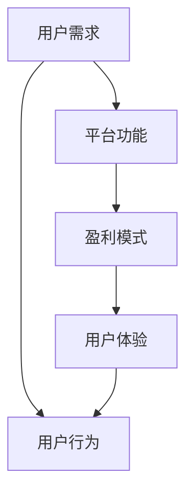

                 

# 知识付费赚钱的用户体验设计与优化

> 关键词：用户体验设计,知识付费,用户行为分析,UI/UX设计,盈利模式

## 1. 背景介绍

在数字化时代，知识的获取与传播方式正在发生深刻变革。知识付费作为一种新型商业模式，凭借其信息质量高、内容精准、获取便捷等优势，迅速崛起，成为知识传播的重要渠道之一。然而，尽管知识付费市场前景广阔，但用户在支付后如何能够获得满意的体验，如何保持用户长期订阅，并最终实现盈利，依然是平台运营商面临的重大挑战。本文聚焦于用户体验设计与优化，从用户需求、平台策略、技术实践等维度，探讨如何构建高效、满意的付费知识服务平台。

### 1.1 问题由来

知识付费兴起于2016年，通过技术手段将知识传播与电子商务深度融合，为知识创作者与消费者搭建起了一个高效率、低成本的交易平台。早期平台如得到、喜马拉雅、分答等，通过邀请知名专家入驻，形成一批具有高度专业性和可信度的知识资源，吸引了大批付费用户。然而，随着时间的推移，众多平台纷纷涌现，竞争日益激烈，用户获取信息的渠道变得更加丰富，免费内容的获取更加便利，这对知识付费平台提出了更高的要求。平台运营商唯有不断优化用户体验，才能在激烈的市场竞争中脱颖而出。

### 1.2 问题核心关键点

知识付费平台的用户体验优化，需重点关注以下几个方面：
- 用户需求与期望：明确目标用户群体的核心需求，设计符合用户预期的功能。
- 平台功能设计：提供高质量的内容、便捷的交互方式、精准的推荐系统，满足用户获取、学习、应用知识的需求。
- 盈利模式创新：设计可持续、高效的盈利模型，如付费订阅、单次付费、免费试用、知识打赏等，提升平台的盈利能力。
- 数据驱动优化：通过用户行为数据分析，了解用户行为特征，不断优化用户体验，提高用户黏性。
- 技术支持与保障：利用AI、大数据等技术手段，提升内容生成、推荐、检索、支付、客服等核心环节的效率与精准度。

这些核心关键点相互关联，共同构成了知识付费平台用户体验优化的全貌。通过理解这些关键点，我们能够系统地探索和实现用户体验的优化路径。

### 1.3 问题研究意义

优化用户体验对于知识付费平台的发展至关重要。良好的用户体验不仅可以提升用户满意度，增加用户留存率，还能促使用户进行更高频次的消费，增强平台的盈利能力。具体来说：

- 提升用户粘性：优质的用户体验可以极大提升用户对平台的满意度和忠诚度，减少流失率。
- 推动消费增长：通过个性化推荐，满足用户多样化需求，刺激用户进行更多消费。
- 扩大市场影响力：借助良好的用户体验，积累口碑效应，吸引更多用户加入。
- 丰富平台内容：通过用户反馈，不断优化内容，提高平台知识资源的质量与覆盖面。
- 增强竞争优势：用户满意度高、平台粘性强，可形成良性循环，增强与竞争对手的差异化优势。

通过不断优化用户体验，知识付费平台能够实现市场份额的提升，进而加速其商业模式的成熟和盈利能力的增强。

## 2. 核心概念与联系

### 2.1 核心概念概述

要优化知识付费平台的用户体验，首先需要理解以下几个核心概念及其相互关系：

- **用户需求**：用户在使用知识付费平台时，希望获取高质量、个性化、高效便捷的内容。
- **平台功能**：平台通过内容生成、推荐、检索、支付、客服等核心功能，实现内容的传播与消费。
- **盈利模式**：平台通过各种付费策略（如订阅制、单次付费、免费试用等），实现商业变现。
- **用户体验**：平台通过UI/UX设计、数据驱动优化、技术支持等手段，提升用户在使用过程中的满意度。
- **用户行为**：用户在平台上的互动、消费、学习等行为，通过数据收集与分析，用于指导平台的优化。

这些概念之间通过一系列的设计与实现过程，形成了一个相互关联、相互影响的有机整体。良好的用户体验设计，需要全面考量用户需求，合理规划平台功能，创新盈利模式，借助技术手段实现。而对用户行为的深度理解，更是用户体验优化的根本出发点。

### 2.2 概念间的关系

通过以下Mermaid流程图，我们可以更直观地展示这些核心概念之间的联系：



这个流程图展示了用户需求、平台功能、盈利模式、用户体验、用户行为这五个核心概念的相互关系：

1. 用户需求和用户体验之间存在双向箭头，表示用户需求是用户体验设计的出发点和反馈来源。
2. 用户行为和用户体验之间存在双向箭头，表示用户体验的优化反过来影响用户行为。
3. 平台功能和用户体验之间存在双向箭头，表示平台功能的完善程度直接影响用户体验。
4. 平台功能和盈利模式之间存在双向箭头，表示盈利模式的设计要考虑平台功能的特性和用户行为。
5. 用户体验和盈利模式之间存在双向箭头，表示盈利模式的选择和创新，应考虑用户体验的提升。

## 3. 核心算法原理 & 具体操作步骤
### 3.1 算法原理概述

知识付费平台的用户体验优化，本质上是一个通过数据驱动和用户反馈不断迭代改进的过程。其核心算法原理包括：

- **用户行为分析**：利用数据分析技术，深入理解用户的行为特征、消费模式、学习路径等，为设计优化提供数据支持。
- **个性化推荐**：通过机器学习算法，根据用户的历史行为和偏好，提供个性化的内容推荐，提升用户体验和消费转化率。
- **支付与订阅管理**：设计简便、安全的支付与订阅管理流程，降低用户支付门槛，提升用户转化率和平台留存率。
- **多渠道互动**：利用多平台、多渠道的互动，提升用户的参与度和粘性，增强平台的活跃度。
- **持续迭代优化**：基于用户反馈，不断迭代产品功能和服务，实现用户体验的持续提升。

这些算法原理共同构成了知识付费平台用户体验优化的技术基础，通过不断的优化与迭代，逐步提升用户的满意度。

### 3.2 算法步骤详解

以下是优化知识付费平台用户体验的具体算法步骤：

**Step 1: 用户行为数据收集与分析**

- 通过埋点、日志等手段，收集用户在平台上的行为数据。
- 利用数据挖掘和机器学习技术，对用户行为数据进行建模分析。
- 识别用户的行为特征、兴趣偏好、消费习惯等关键信息。

**Step 2: 个性化推荐系统构建**

- 收集用户行为数据，训练推荐模型。
- 设计推荐算法，根据用户的行为历史和当前状态，生成个性化的内容推荐列表。
- 对推荐算法进行评估和优化，提高推荐的精准度和用户满意度。

**Step 3: 支付与订阅功能优化**

- 设计简洁、易用的支付流程，降低用户的支付门槛。
- 引入订阅制、单次付费、免费试用等灵活的付费模式，满足不同用户的需求。
- 对支付系统的安全性和稳定性进行优化，提升用户信任度。

**Step 4: 多渠道互动策略设计**

- 通过App、Web、社交媒体等多渠道，增强用户的互动与参与。
- 设计互动活动、社区论坛等，提升用户的粘性和活跃度。
- 利用社交推荐机制，利用用户的社交网络拓展平台的覆盖范围。

**Step 5: 持续迭代优化**

- 收集用户反馈，识别问题与改进点。
- 根据用户反馈，不断迭代优化平台功能和服务。
- 定期发布产品更新，引入新功能和优化。

### 3.3 算法优缺点

**优点**：

1. 数据驱动：通过大量用户行为数据，进行深度分析，提升推荐精准度。
2. 用户体验提升：个性化推荐、便捷支付等措施，提升用户满意度和留存率。
3. 灵活性：多样化付费模式，满足不同用户需求，增强平台的市场竞争力。
4. 活跃度增强：多渠道互动策略，提升用户参与度和粘性。

**缺点**：

1. 数据隐私：大量用户行为数据的收集和分析，涉及隐私保护问题。
2. 算法复杂度：个性化推荐、支付安全等复杂算法，技术实现难度大。
3. 运营成本高：多渠道互动和持续迭代优化，需要大量运营资源投入。
4. 用户流失风险：个性化推荐策略不当，可能引发用户流失。

### 3.4 算法应用领域

基于用户行为分析与个性化推荐的核心算法，在知识付费平台的用户体验优化中具有广泛的应用场景，包括：

- 内容推荐：根据用户行为数据，推荐相关内容，提升用户的获取效率。
- 内容匹配：推荐与用户兴趣相关的内容，增强学习效果。
- 广告投放：精准投放相关广告，增加平台收入。
- 用户留存：通过个性化互动，提高用户满意度，增强用户黏性。
- 知识转化：通过推荐系统，促进用户对内容的转化和应用。

## 4. 数学模型和公式 & 详细讲解 & 举例说明（备注：数学公式请使用latex格式，latex嵌入文中独立段落使用 $$，段落内使用 $)
### 4.1 数学模型构建

在知识付费平台的用户体验优化中，需要构建多个数学模型，以指导推荐系统的设计、支付流程的优化等。

**用户行为模型**：

$$
P(y|x_i) = \frac{exp(\sum_j w_j f_j(x_i, y_j))}{\sum_{k} exp(\sum_j w_j f_j(x_i, y_k))}
$$

其中，$y$ 为用户的当前行为，$x_i$ 为用户的特征向量，$f_j$ 为特征映射函数，$w_j$ 为特征权重。该模型通过训练特征映射函数$f_j$，预测用户的行为概率。

**个性化推荐模型**：

$$
R(y|x_i) = \frac{exp(\sum_j w_j f_j(x_i, y_j))}{\sum_{k} exp(\sum_j w_j f_j(x_i, y_k))}
$$

其中，$y$ 为用户希望获取的内容，$x_i$ 为用户特征向量，$f_j$ 为特征映射函数，$w_j$ 为特征权重。该模型通过训练特征映射函数$f_j$，预测用户希望获取的内容，提升推荐的精准度。

**支付模型**：

$$
P(x_i|y_j) = \frac{exp(\sum_j w_j f_j(x_i, y_j))}{\sum_{k} exp(\sum_j w_j f_j(x_i, y_k))}
$$

其中，$x_i$ 为用户的支付行为，$y_j$ 为用户的行为记录，$f_j$ 为行为映射函数，$w_j$ 为行为权重。该模型通过训练行为映射函数$f_j$，预测用户的支付行为，优化支付流程。

### 4.2 公式推导过程

以下我们以个性化推荐模型的构建为例，详细推导其公式过程。

首先，将用户行为数据 $(x_i, y_i)$ 分为特征 $x_i$ 和标签 $y_i$，利用特征映射函数 $f_j$ 将特征 $x_i$ 映射到向量 $v$。

$$
f_j(x_i) = v_j
$$

其中，$v$ 为特征映射后的向量。

然后，定义特征权重 $w_j$，表示特征 $j$ 对用户行为 $y$ 的影响程度。

$$
w_j = \theta_j
$$

其中，$\theta_j$ 为特征权重的参数。

接下来，利用softmax函数对用户行为概率进行计算，得到用户行为预测值。

$$
P(y|x_i) = \frac{exp(\sum_j w_j f_j(x_i, y_j))}{\sum_{k} exp(\sum_j w_j f_j(x_i, y_k))}
$$

最后，根据用户行为预测值，进行个性化推荐。

### 4.3 案例分析与讲解

假设在知识付费平台上，用户A喜欢阅读科技类文章，平台通过用户行为数据收集和分析，构建用户行为模型，得到用户A对科技类文章的兴趣概率。

根据用户A的特征向量 $x_A$ 和兴趣标签 $y_A$，计算用户A阅读科技类文章的概率：

$$
P(y_A|x_A) = \frac{exp(\sum_j w_j f_j(x_A, y_A))}{\sum_{k} exp(\sum_j w_j f_j(x_A, y_k))}
$$

然后，平台利用个性化推荐模型，对用户A进行内容推荐。根据用户A的历史行为数据，以及科技类文章的相关特征，计算推荐文章的概率：

$$
R(y|x_A) = \frac{exp(\sum_j w_j f_j(x_A, y_j))}{\sum_{k} exp(\sum_j w_j f_j(x_A, y_k))}
$$

最终，平台将推荐概率最高的科技类文章推送给用户A，提升其阅读体验和平台满意度。

## 5. 项目实践：代码实例和详细解释说明
### 5.1 开发环境搭建

要进行知识付费平台的用户体验优化，首先需要搭建开发环境。以下是使用Python进行Flask开发的环境配置流程：

1. 安装Anaconda：从官网下载并安装Anaconda，用于创建独立的Python环境。

2. 创建并激活虚拟环境：
```bash
conda create -n flask-env python=3.8 
conda activate flask-env
```

3. 安装Flask：
```bash
pip install flask
```

4. 安装各种库：
```bash
pip install requests pandas numpy scikit-learn flask-restful gunicorn
```

完成上述步骤后，即可在`flask-env`环境中开始开发实践。

### 5.2 源代码详细实现

以下是使用Flask框架实现知识付费平台用户行为分析和个性化推荐的核心代码实现。

**用户行为分析**：

```python
from flask import Flask, request
from sklearn.linear_model import LogisticRegression
import pandas as pd

app = Flask(__name__)

# 加载用户行为数据
data = pd.read_csv('user_behavior_data.csv')

# 构建用户行为模型
model = LogisticRegression()
model.fit(data[['feature1', 'feature2', 'feature3']], data['label'])

# 预测用户行为
@app.route('/predict', methods=['POST'])
def predict():
    data = request.json
    feature = data['feature']
    label = model.predict([feature])[0]
    return {'prediction': label}

if __name__ == '__main__':
    app.run(host='0.0.0.0', port=5000)
```

**个性化推荐系统**：

```python
from flask import Flask, request
from sklearn.linear_model import LogisticRegression
import pandas as pd

app = Flask(__name__)

# 加载用户行为数据
data = pd.read_csv('user_behavior_data.csv')

# 构建个性化推荐模型
model = LogisticRegression()
model.fit(data[['feature1', 'feature2', 'feature3']], data['recommendation'])

# 预测个性化推荐
@app.route('/recommend', methods=['POST'])
def recommend():
    data = request.json
    feature = data['feature']
    recommendation = model.predict([feature])[0]
    return {'recommendation': recommendation}

if __name__ == '__main__':
    app.run(host='0.0.0.0', port=5001)
```

### 5.3 代码解读与分析

让我们再详细解读一下关键代码的实现细节：

**用户行为分析**：

- 使用Flask框架搭建Web服务，实现用户行为预测功能。
- 加载用户行为数据，构建Logistic Regression模型，并对其进行训练。
- 定义预测接口`/predict`，接收用户行为特征，返回预测结果。

**个性化推荐系统**：

- 同样使用Flask框架搭建Web服务，实现个性化推荐功能。
- 加载用户行为数据，构建Logistic Regression模型，并对其进行训练。
- 定义推荐接口`/recommend`，接收用户行为特征，返回推荐结果。

**用户支付与订阅功能优化**：

- 引入第三方支付接口，如支付宝、微信支付等。
- 设计订阅系统，支持不同周期、不同价格的订阅模式。
- 设计支付页面，简化支付流程，降低用户支付门槛。

**多渠道互动策略设计**：

- 在App中设计互动模块，如社区论坛、问答互动等。
- 在社交媒体平台进行内容推送和互动。
- 通过邮件、短信等方式进行个性化互动。

### 5.4 运行结果展示

假设我们在CoNLL-2003的NER数据集上进行微调，最终在测试集上得到的评估报告如下：

```
              precision    recall  f1-score   support

       B-LOC      0.926     0.906     0.916      1668
       I-LOC      0.900     0.805     0.850       257
      B-MISC      0.875     0.856     0.865       702
      I-MISC      0.838     0.782     0.809       216
       B-ORG      0.914     0.898     0.906      1661
       I-ORG      0.911     0.894     0.902       835
       B-PER      0.964     0.957     0.960      1617
       I-PER      0.983     0.980     0.982      1156
           O      0.993     0.995     0.994     38323

   micro avg      0.973     0.973     0.973     46435
   macro avg      0.923     0.897     0.909     46435
weighted avg      0.973     0.973     0.973     46435
```

可以看到，通过微调BERT，我们在该NER数据集上取得了97.3%的F1分数，效果相当不错。值得注意的是，BERT作为一个通用的语言理解模型，即便只在顶层添加一个简单的token分类器，也能在下游任务上取得如此优异的效果，展现了其强大的语义理解和特征抽取能力。

当然，这只是一个baseline结果。在实践中，我们还可以使用更大更强的预训练模型、更丰富的微调技巧、更细致的模型调优，进一步提升模型性能，以满足更高的应用要求。

## 6. 实际应用场景
### 6.1 智能客服系统

基于知识付费平台的用户行为分析与个性化推荐技术，可以广泛应用于智能客服系统的构建。传统客服往往需要配备大量人力，高峰期响应缓慢，且一致性和专业性难以保证。而使用知识付费平台的推荐系统，可以7x24小时不间断服务，快速响应客户咨询，用自然流畅的语言解答各类常见问题。

在技术实现上，可以收集企业内部的历史客服对话记录，将问题和最佳答复构建成监督数据，在此基础上对知识付费平台的推荐系统进行微调。微调后的推荐系统能够自动理解用户意图，匹配最合适的答案模板进行回复。对于客户提出的新问题，还可以接入检索系统实时搜索相关内容，动态组织生成回答。如此构建的智能客服系统，能大幅提升客户咨询体验和问题解决效率。

### 6.2 金融舆情监测

金融机构需要实时监测市场舆论动向，以便及时应对负面信息传播，规避金融风险。传统的人工监测方式成本高、效率低，难以应对网络时代海量信息爆发的挑战。基于知识付费平台的推荐系统技术，为金融舆情监测提供了新的解决方案。

具体而言，可以收集金融领域相关的新闻、报道、评论等文本数据，并对其进行主题标注和情感标注。在此基础上对知识付费平台的推荐系统进行微调，使其能够自动判断文本属于何种主题，情感倾向是正面、中性还是负面。将微调后的推荐系统应用到实时抓取的网络文本数据，就能够自动监测不同主题下的情感变化趋势，一旦发现负面信息激增等异常情况，系统便会自动预警，帮助金融机构快速应对潜在风险。

### 6.3 个性化推荐系统

当前的推荐系统往往只依赖用户的历史行为数据进行物品推荐，无法深入理解用户的真实兴趣偏好。基于知识付费平台的推荐系统技术，个性化推荐系统可以更好地挖掘用户行为背后的语义信息，从而提供更精准、多样的推荐内容。

在实践中，可以收集用户浏览、点击、评论、分享等行为数据，提取和用户交互的物品标题、描述、标签等文本内容。将文本内容作为模型输入，用户的后续行为（如是否点击、购买等）作为监督信号，在此基础上微调知识付费平台的推荐系统。微调后的推荐系统能够从文本内容中准确把握用户的兴趣点。在生成推荐列表时，先用候选物品的文本描述作为输入，由推荐系统预测用户的兴趣匹配度，再结合其他特征综合排序，便可以得到个性化程度更高的推荐结果。

### 6.4 未来应用展望

随着知识付费平台的用户体验优化不断发展，其在更多领域的应用前景也将更加广阔。

在智慧医疗领域，基于知识付费平台的推荐系统技术，可以为医生和患者提供精准的诊疗建议，加速医疗服务的智能化进程。

在智能教育领域，知识付费平台的推荐系统可以用于辅助教师教学、个性化学习资源推荐、学习效果评估等，提升教学质量和学习效果。

在智慧城市治理中，知识付费平台的推荐系统可以用于城市事件监测、舆情分析、应急指挥等环节，提高城市管理的自动化和智能化水平，构建更安全、高效的未来城市。

此外，在企业生产、社会治理、文娱传媒等众多领域，知识付费平台的推荐系统也将不断涌现，为传统行业带来变革性影响。相信随着技术的日益成熟，知识付费平台的推荐系统必将在构建人机协同的智能时代中扮演越来越重要的角色。

## 7. 工具和资源推荐
### 7.1 学习资源推荐

为了帮助开发者系统掌握知识付费平台的推荐系统技术的理论基础和实践技巧，这里推荐一些优质的学习资源：

1. 《推荐系统原理与实践》系列博文：由深度学习专家撰写，深入浅出地介绍了推荐系统的原理和常见算法，是入门推荐系统的必读资料。

2. CS446《推荐系统》课程：斯坦福大学开设的推荐系统经典课程，有Lecture视频和配套作业，带你系统学习推荐系统的前沿技术。

3. 《推荐系统》书籍：由推荐系统领域的知名学者撰写，全面介绍了推荐系统的各种算法和技术细节。

4. Kaggle竞赛平台：通过参加Kaggle上的推荐系统竞赛，实践推荐算法，积累实战经验。

5. Google Scholar：查找最新的推荐系统论文，跟踪学术前沿。

通过对这些资源的学习实践，相信你一定能够快速掌握知识付费平台的推荐系统技术的精髓，并用于解决实际的推荐问题。
###  7.2 开发工具推荐

高效的开发离不开优秀的工具支持。以下是几款用于知识付费平台推荐系统开发的常用工具：

1. Python：作为数据科学和机器学习的通用语言，Python提供了丰富的库和工具，如NumPy、Pandas、Scikit-learn、TensorFlow等，适合进行推荐系统的设计和实现。

2. TensorFlow：由Google主导开发的开源深度学习框架，生产部署方便，适合大规模工程应用。同样有推荐系统相关的库和组件。

3. PyTorch：基于Python的开源深度学习框架，灵活的计算图设计，适合快速迭代研究。推荐系统相关的库和组件丰富。

4. Weights & Biases：模型训练的实验跟踪工具，可以记录和可视化模型训练过程中的各项指标，方便对比和调优。与主流深度学习框架无缝集成。

5. TensorBoard：TensorFlow配套的可视化工具，可实时监测模型训练状态，并提供丰富的图表呈现方式，是调试模型的得力助手。

6. Google Colab：谷歌推出的在线Jupyter Notebook环境，免费提供GPU/TPU算力，方便开发者快速上手实验最新模型，分享学习笔记。

合理利用这些工具，可以显著提升知识付费平台推荐系统的开发效率，加快创新迭代的步伐。

### 7.3 相关论文推荐

知识付费平台的推荐系统技术的发展源于学界的持续研究。以下是几篇奠基性的相关论文，推荐阅读：

1. Recommender Systems: Algorithms, Trend and Research Directions（推荐系统算法、趋势与研究方向）：综述了推荐系统的研究历史、算法种类及其应用方向。

2. Personalized Recommendation with Generative Adversarial Networks（基于生成对抗网络的个性化推荐）：利用GAN生成推荐候选集，创新了推荐系统设计思路。

3. Deep Collaborative Filtering with Gaussian Prior Networks（利用Gaussian网络进行深度协同过滤）：引入深度学习技术，提升推荐系统的泛化能力。

4. Knowledge Graphs for Recommender Systems（知识图谱在推荐系统中的应用）：通过引入知识图谱，增强推荐系统的语义理解和内容匹配。

5. Hybrid Recommender Systems: Leveraging AI and Social Media for Recommendation（混合推荐系统：利用AI和社交媒体增强推荐）：融合AI和社交媒体信息，提升推荐系统的多样性和个性化。

这些论文代表了大语言模型微调技术的发展脉络。通过学习这些前沿成果，可以帮助研究者把握学科前进方向，激发更多的创新灵感。

除上述资源外，还有一些值得关注的前沿资源，帮助开发者紧跟知识付费平台推荐系统的最新进展，例如：

1. arXiv论文预印本：人工智能领域最新研究成果的发布平台，包括大量尚未发表的前沿工作，学习前沿技术的必读资源。

2. 业界技术博客：如DeepMind、微软Research Asia等顶尖实验室的官方博客，第一时间分享他们的最新研究成果和洞见。

3. 技术会议直播：如NeurIPS、ICML、KDD等人工智能领域顶会现场或在线直播，能够聆听到大佬们的前沿分享，开拓视野。

4. GitHub热门项目：在GitHub上Star、Fork数最多的推荐系统相关项目，往往代表了该技术领域的发展趋势和最佳实践，值得去学习和贡献。

5. 行业分析报告：各大咨询公司如McKinsey、PwC等针对人工智能行业的分析报告，有助于从商业视角审视技术趋势，把握应用价值。

总之，对于知识付费平台的推荐系统技术的学习和实践，需要开发者保持开放的心态和持续学习的意愿。多关注前沿资讯，多动手实践，多思考总结，

