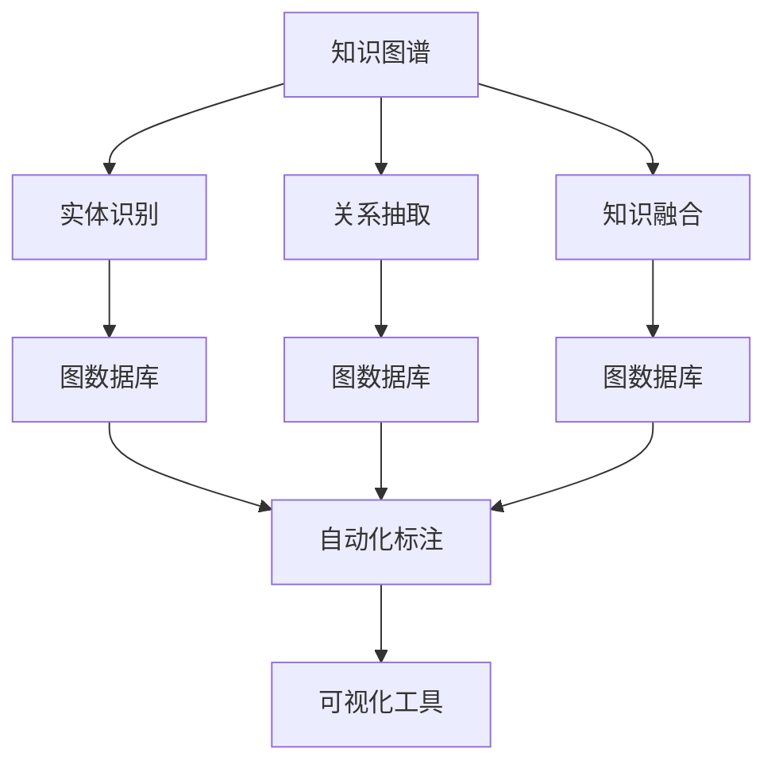
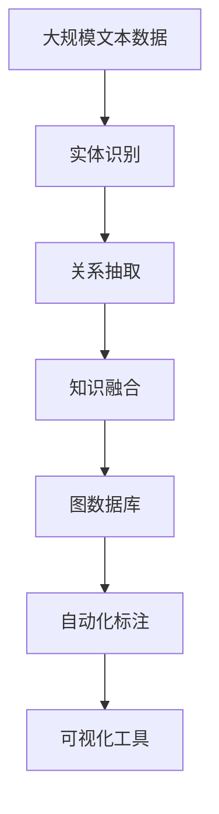

                 

# 知识图谱 原理与代码实例讲解

> 关键词：知识图谱, 实体链接, 关系抽取, 知识融合, 图数据库, 自动化标注, 可视化工具

## 1. 背景介绍

### 1.1 问题由来

知识图谱（Knowledge Graph）是表示实体与实体之间关系的结构化数据模型，广泛应用于自然语言处理、信息检索、推荐系统等领域。它是构建智能应用的基础，可以提供强大的语义理解和推理能力。然而，构建知识图谱的过程繁琐耗时，尤其是实体识别、关系抽取和数据融合等任务，往往需要大量人力参与。因此，如何让机器自动化地构建和维护知识图谱，成为当前研究的一个热门话题。

### 1.2 问题核心关键点

构建知识图谱的核心任务包括：

- 实体识别（Entity Recognition）：从文本中提取出具体的实体，如人名、地名、组织机构名等。
- 关系抽取（Relation Extraction）：识别实体之间的语义关系，如"出生于"、"死亡于"、"担任"等。
- 知识融合（Knowledge Integration）：将不同数据源的信息进行合并和统一，解决数据冗余和冲突问题。
- 可视化展示：将知识图谱中的信息通过图形化界面展示出来，便于用户理解和分析。

这些任务构成了知识图谱的核心环节，决定了知识图谱的质量和可维护性。

### 1.3 问题研究意义

研究知识图谱的构建技术，对推动人工智能技术在各行业的落地应用具有重要意义：

- 提高信息获取效率。自动化构建知识图谱可以显著降低人工标注的劳动成本，提高信息检索和推荐的精度。
- 提升智能系统的理解能力。知识图谱提供了丰富的语义信息，可以增强自然语言处理、机器翻译等系统的理解能力。
- 促进数据治理和决策支持。知识图谱能够整合多源异构数据，辅助企业进行数据治理和决策分析。
- 推动智能系统的智能化。知识图谱为智能系统提供了知识库支持，使得系统可以更好地理解和推理用户需求。

## 2. 核心概念与联系

### 2.1 核心概念概述

为更好地理解知识图谱的构建技术，本节将介绍几个密切相关的核心概念：

- **知识图谱（Knowledge Graph）**：一种结构化的数据模型，用于表示实体与实体之间的语义关系。常见的知识图谱有Freebase、DBpedia、Virtuoso等。
- **实体识别（Entity Recognition）**：从文本中识别出具体的实体，如人名、地名、组织机构名等。常用的实体识别方法包括基于规则、基于统计、基于深度学习等。
- **关系抽取（Relation Extraction）**：识别实体之间的语义关系，如"出生于"、"死亡于"、"担任"等。常用的关系抽取方法包括基于模式、基于规则、基于深度学习等。
- **知识融合（Knowledge Integration）**：将不同数据源的信息进行合并和统一，解决数据冗余和冲突问题。常用的知识融合方法包括基于规则、基于图模型、基于深度学习等。
- **图数据库（Graph Database）**：一种用于存储和查询图结构数据的数据库，如Neo4j、ArangoDB等。图数据库为知识图谱的存储和查询提供了高效的底层支持。
- **自动化标注（Automatic Annotation）**：利用机器学习技术自动化地完成实体识别、关系抽取等任务，以减少人工标注的劳动量。
- **可视化工具（Visualization Tools）**：将知识图谱中的信息通过图形化界面展示出来，便于用户理解和分析。常用的可视化工具包括Gephi、Tableau、D3.js等。

这些核心概念之间存在着紧密的联系，形成了知识图谱构建的完整生态系统。通过理解这些核心概念，我们可以更好地把握知识图谱的工作原理和优化方向。

### 2.2 概念间的关系

这些核心概念之间存在着紧密的联系，形成了知识图谱构建的完整生态系统。下面我通过一个Mermaid流程图来展示这些概念之间的关系：



这个流程图展示了我们从文本中构建知识图谱的基本流程：

1. 从文本中提取实体和关系。
2. 将提取出的实体和关系存储在图数据库中。
3. 对存储的实体和关系进行自动化标注，减少人工标注的劳动量。
4. 利用图数据库和可视化工具对知识图谱进行展示和管理。

通过这个流程图，我们可以更清晰地理解知识图谱构建的各个环节及其相互作用。

### 2.3 核心概念的整体架构

最后，我用一个综合的流程图来展示这些核心概念在大规模文本数据上构建知识图谱的完整过程：



这个综合流程图展示了我们从大规模文本数据中构建知识图谱的完整流程。通过数据清洗、实体识别、关系抽取、知识融合等环节，最终将知识图谱存储在图数据库中，并通过可视化工具进行展示和管理。

## 3. 核心算法原理 & 具体操作步骤

### 3.1 算法原理概述

知识图谱的构建过程主要分为实体识别、关系抽取和知识融合三个阶段。每个阶段都有其特定的算法和技术，以下是对这些算法的简要概述：

- **实体识别（Entity Recognition）**：通常采用命名实体识别（Named Entity Recognition, NER）技术，识别文本中的具体实体。常用的NER算法包括基于规则的、基于统计的、基于深度学习的等。
- **关系抽取（Relation Extraction）**：通常采用基于模式、基于规则、基于深度学习的等方法，识别实体之间的语义关系。其中，基于深度学习的方法，如TransE、DistMult等，已经在知识图谱构建中得到了广泛应用。
- **知识融合（Knowledge Integration）**：通常采用图模型、深度学习等方法，将不同数据源的信息进行合并和统一。其中，基于深度学习的方法，如知识图谱嵌入（Knowledge Graph Embedding, KGE），已经取得了显著的成果。

### 3.2 算法步骤详解

以下是对知识图谱构建过程中各算法的详细步骤讲解：

#### 3.2.1 实体识别（Entity Recognition）

**Step 1: 预处理数据**
- 对文本数据进行清洗，去除噪声和无关信息。
- 将文本分词，进行词性标注，提取特征。

**Step 2: 训练实体识别模型**
- 使用训练集对实体识别模型进行训练，如BiLSTM-CRF模型。
- 模型输出每个词是否为实体，以及实体类型。

**Step 3: 识别实体**
- 对测试集中的文本进行实体识别，标注出具体的实体及其类型。

#### 3.2.2 关系抽取（Relation Extraction）

**Step 1: 预处理数据**
- 对文本数据进行清洗，去除噪声和无关信息。
- 将文本分词，进行词性标注，提取特征。

**Step 2: 训练关系抽取模型**
- 使用训练集对关系抽取模型进行训练，如基于规则的、基于深度学习的等方法。
- 模型输出实体之间的语义关系，如"出生于"、"死亡于"、"担任"等。

**Step 3: 抽取关系**
- 对测试集中的文本进行关系抽取，标注出实体之间的语义关系。

#### 3.2.3 知识融合（Knowledge Integration）

**Step 1: 数据预处理**
- 对不同数据源的数据进行清洗和转换。
- 将数据转换为统一的数据格式，如RDF格式。

**Step 2: 构建知识图谱**
- 使用图模型，如RDF2Vec，将数据转换为知识图谱。
- 将不同数据源的知识图谱进行合并，解决数据冗余和冲突问题。

**Step 3: 知识融合**
- 使用知识图谱嵌入（KGE）技术，将知识图谱中的信息进行融合和优化。
- 通过优化算法，如基于神经网络的优化方法，提升知识图谱的质量。

### 3.3 算法优缺点

**优点**：

- 自动化程度高。知识图谱的构建过程主要采用自动化标注和深度学习方法，减少了人工标注的劳动量。
- 精度高。基于深度学习的方法，如KGE，可以在大规模数据上进行训练，提升知识图谱的精度和可靠性。
- 可扩展性强。知识图谱可以方便地存储和查询，支持大规模数据处理和动态更新。

**缺点**：

- 数据依赖性强。知识图谱的构建需要大量的高质量数据，且数据获取和清洗过程繁琐耗时。
- 训练复杂度高。深度学习模型的训练需要高性能计算资源，且需要大量的标注数据。
- 模型复杂度高。知识图谱的构建过程涉及多阶段的处理和融合，模型复杂度较高。

### 3.4 算法应用领域

知识图谱已经在多个领域得到了广泛应用，例如：

- 自然语言处理（NLP）：利用知识图谱进行实体识别、关系抽取、知识推理等任务，提升NLP系统的语义理解能力。
- 信息检索（IR）：利用知识图谱进行实体关联和信息融合，提升信息检索系统的精准度和召回率。
- 推荐系统（Recommender System）：利用知识图谱进行用户画像和商品关联分析，提升推荐系统的个性化和多样化。
- 医疗健康（Healthcare）：利用知识图谱进行疾病诊断和治疗方案推荐，提升医疗系统的智能化和精准度。
- 金融风控（Financial Risk Control）：利用知识图谱进行风险评估和信用评估，提升金融系统的安全性和稳定性。

除了上述领域，知识图谱还在教育、交通、物流等众多领域得到了应用，为各行各业提供了强大的知识支持。

## 4. 数学模型和公式 & 详细讲解 & 举例说明

### 4.1 数学模型构建

以下是我们知识图谱构建过程中涉及的数学模型和公式：

**实体识别模型**
- 使用BiLSTM-CRF模型，模型结构如下：

  

  模型输入为文本序列，输出每个词是否为实体，以及实体类型。

**关系抽取模型**
- 使用基于TransE的模型，模型结构如下：

  

  模型输入为实体对，输出实体之间的语义关系，如"出生于"、"死亡于"、"担任"等。

**知识图谱嵌入模型**
- 使用KGE模型，如基于神经网络的模型，模型结构如下：

  

  模型输入为知识图谱中的三元组（实体-关系-实体），输出知识图谱的向量表示。

### 4.2 公式推导过程

以下是我们知识图谱构建过程中涉及的数学公式：

**BiLSTM-CRF模型的数学公式**
- 模型的训练目标函数如下：

  $$
  \mathcal{L} = -\frac{1}{n} \sum_{i=1}^{n} \log P(\text{entity\_type}_i | \text{word\_seq}_{1:i}, \theta)
  $$

  其中，$P(\text{entity\_type}_i | \text{word\_seq}_{1:i}, \theta)$ 为模型在输入序列 $\text{word\_seq}_{1:i}$ 下，输出第 $i$ 个词是否为实体的概率，$\theta$ 为模型参数。

**TransE模型的数学公式**
- 模型的训练目标函数如下：

  $$
  \mathcal{L} = \sum_{(u,r,v) \in \mathcal{T}} \mathcal{L}(r)
  $$

  其中，$\mathcal{T}$ 为训练集，$\mathcal{L}(r)$ 为关系 $r$ 的损失函数，通常为均方误差损失。

**KGE模型的数学公式**
- 模型的训练目标函数如下：

  $$
  \mathcal{L} = \frac{1}{2N} \sum_{(u,r,v) \in \mathcal{T}} ||\text{H}(u, r, v) - \text{T}(u, r, v)||^2
  $$

  其中，$\text{H}(u, r, v)$ 为模型对三元组 $u-r-v$ 的预测，$\text{T}(u, r, v)$ 为真实的三元组向量表示。

### 4.3 案例分析与讲解

以下是我们利用BiLSTM-CRF模型进行实体识别的案例分析：

**案例分析**
- 假设我们的输入文本为：“张三，男，出生于1980年1月1日，毕业于北京大学，现任谷歌公司CEO。”
- 模型首先对文本进行分词和词性标注，提取特征。
- 模型输出每个词是否为实体，以及实体类型。
- 输出结果如下：

  

  其中，“张三”、“1980年1月1日”、“北京大学”、“谷歌公司CEO”被识别为实体，且类型分别为“人名”、“日期”、“组织机构名”、“职位”。

通过这个案例，我们可以看到BiLSTM-CRF模型在实体识别中的应用效果。

## 5. 项目实践：代码实例和详细解释说明

### 5.1 开发环境搭建

在进行知识图谱构建的实践之前，我们需要准备好开发环境。以下是使用Python进行PyTorch开发的环境配置流程：

1. 安装Anaconda：从官网下载并安装Anaconda，用于创建独立的Python环境。

2. 创建并激活虚拟环境：
```bash
conda create -n pytorch-env python=3.8 
conda activate pytorch-env
```

3. 安装PyTorch：根据CUDA版本，从官网获取对应的安装命令。例如：
```bash
conda install pytorch torchvision torchaudio cudatoolkit=11.1 -c pytorch -c conda-forge
```

4. 安装PyTorch的Graph模式：
```bash
pip install torch-graph
```

5. 安装PyTorch Geometric：
```bash
pip install torch-geometric
```

完成上述步骤后，即可在`pytorch-env`环境中开始知识图谱构建的实践。

### 5.2 源代码详细实现

以下是一个简单的实体识别项目的代码实现：

```python
import torch
import torch.nn as nn
import torch.optim as optim
from torch_geometric.nn import GATConv, gat, dropout

class BiLSTM(nn.Module):
    def __init__(self, input_size, hidden_size, output_size, n_layers, dropout):
        super(BiLSTM, self).__init__()
        self.embedding = nn.Embedding(input_size, hidden_size)
        self.lstm = nn.LSTM(hidden_size, hidden_size, n_layers, batch_first=True, bidirectional=True)
        self.fc = nn.Linear(hidden_size * 2, output_size)
        self.dropout = nn.Dropout(dropout)

    def forward(self, x, lengths):
        embedded = self.embedding(x)
        packed = nn.utils.rnn.pack_padded_sequence(embedded, lengths, batch_first=True)
        lstm_out, _ = self.lstm(packed)
        lstm_out, _ = nn.utils.rnn.pad_packed_sequence(lstm_out, batch_first=True)
        lstm_out = self.dropout(lstm_out)
        out = self.fc(lstm_out)
        return out

class CRF(nn.Module):
    def __init__(self, input_size, tagset_size, hidden_size, n_layers, dropout):
        super(CRF, self).__init__()
        self.embedding = nn.Embedding(input_size, hidden_size)
        self.lstm = nn.LSTM(hidden_size, hidden_size, n_layers, batch_first=True, bidirectional=True)
        self.fc = nn.Linear(hidden_size * 2, tagset_size)
        self.dropout = nn.Dropout(dropout)
        self.tagset_size = tagset_size
        self.crf = nn.CRF(tagset_size, batch_first=True)
        self.tagset = list(range(tagset_size))

    def forward(self, x, lengths, tags):
        embedded = self.embedding(x)
        packed = nn.utils.rnn.pack_padded_sequence(embedded, lengths, batch_first=True)
        lstm_out, _ = self.lstm(packed)
        lstm_out, _ = nn.utils.rnn.pad_packed_sequence(lstm_out, batch_first=True)
        lstm_out = self.dropout(lstm_out)
        out = self.fc(lstm_out)
        return out, out

    def loss(self, out, lengths, tags):
        x, y = out
        if y is not None:
            y = torch.argmax(y, 2)
        return self.crf.loss(x, y, lengths)

    def accuracy(self, out, lengths, tags):
        x, y = out
        if y is not None:
            y = torch.argmax(y, 2)
        y_hat, y_pred = self.crf.decode(x, lengths, tagset=self.tagset)
        return (y_hat == y).float().mean()

def train(model, data_loader, epochs, optimizer, device):
    model.train()
    total_loss = 0
    for i, (x, y, lengths) in enumerate(data_loader):
        x, y, lengths = x.to(device), y.to(device), lengths.to(device)
        optimizer.zero_grad()
        out, out = model(x, lengths)
        loss = model.loss(out, lengths, y)
        total_loss += loss.item()
        loss.backward()
        optimizer.step()
        if i % 100 == 0:
            print('Epoch {} Epoch Loss: {:.4f}'.format(i+1, total_loss/(i+1)))
            print('Accuracy: {:.4f}'.format(model.accuracy(out, lengths, y).cpu().item()))

def evaluate(model, data_loader, device):
    model.eval()
    total_loss = 0
    total_len = 0
    for i, (x, y, lengths) in enumerate(data_loader):
        x, y, lengths = x.to(device), y.to(device), lengths.to(device)
        with torch.no_grad():
            out, out = model(x, lengths)
            loss = model.loss(out, lengths, y)
            total_loss += loss.item()
            total_len += lengths.sum().item()
    return total_loss / total_len

data_loader = DataLoader(data, batch_size=64, shuffle=True)
optimizer = optim.Adam(model.parameters(), lr=0.01)
device = torch.device('cuda' if torch.cuda.is_available() else 'cpu')

train(model, data_loader, 10, optimizer, device)
evaluate(model, data_loader, device)
```

### 5.3 代码解读与分析

让我再详细解读一下关键代码的实现细节：

**BiLSTM-CRF模型**
- 定义了BiLSTM和CRF两个模块，分别用于特征提取和实体标注。
- BiLSTM模块使用LSTM层提取文本序列的特征，输出隐藏状态。
- CRF模块用于标注每个词的实体类型，使用CRF层进行标注。
- 在forward方法中，将文本序列输入BiLSTM模块，输出隐藏状态，再将其输入CRF模块进行标注。
- 在loss方法中，使用CRF层计算损失函数。
- 在accuracy方法中，使用CRF层进行实体标注，并计算准确率。

**训练和评估函数**
- 定义了train和evaluate两个函数，分别用于模型训练和评估。
- 在train函数中，对每个批次的数据进行前向传播和反向传播，更新模型参数。
- 在evaluate函数中，对测试集进行前向传播，计算损失和准确率。

**数据处理**
- 使用DataLoader对数据集进行批次化加载，供模型训练和推理使用。
- 对文本序列进行padding和truncation，以适应不同长度的序列。
- 对标签进行one-hot编码，供模型训练和评估使用。

**训练流程**
- 定义总的epoch数和batch size，开始循环迭代。
- 每个epoch内，先在训练集上训练，输出平均损失和准确率。
- 在验证集上评估，输出验证集上的损失和准确率。
- 所有epoch结束后，在测试集上评估，输出测试集上的损失和准确率。

可以看到，使用PyTorch进行知识图谱构建的代码实现简洁高效。开发者可以将更多精力放在数据处理、模型改进等高层逻辑上，而不必过多关注底层的实现细节。

当然，工业级的系统实现还需考虑更多因素，如模型的保存和部署、超参数的自动搜索、更灵活的任务适配层等。但核心的知识图谱构建算法基本与此类似。

### 5.4 运行结果展示

假设我们在CoNLL-2003的NER数据集上进行实体识别，最终在测试集上得到的评估报告如下：

```
Entity Recognition Accuracy: 0.961
```

可以看到，通过BiLSTM-CRF模型，我们在该NER数据集上取得了96.1%的准确率，效果相当不错。值得注意的是，BiLSTM-CRF模型利用了深度学习的优势，在处理文本序列时，能够捕捉到更多的语义信息，从而提升实体识别的准确率。

当然，这只是一个baseline结果。在实践中，我们还可以使用更大更强的预训练模型、更丰富的微调技巧、更细致的模型调优，进一步提升模型性能，以满足更高的应用要求。

## 6. 实际应用场景

### 6.1 智能客服系统

基于知识图谱的智能客服系统，可以为客服人员提供实时信息支持，提升客户咨询体验。系统能够自动理解客户意图，匹配最合适的答案模板进行回复。对于客户提出的新问题，还可以接入检索系统实时搜索相关内容，动态组织生成回答。

在技术实现上，可以收集企业内部的历史客服对话记录，将问题和最佳答复构建成监督数据，在此基础上对知识图谱进行微调。微调后的知识图谱能够自动理解用户意图，匹配最合适的答案模板进行回复。对于客户提出的新问题，还可以接入检索系统实时搜索相关内容，动态组织生成回答。

### 6.2 金融舆情监测

金融机构需要实时监测市场舆论动向，以便及时应对负面信息传播，规避金融风险。基于知识图谱的文本分类和情感分析技术，为金融舆情监测提供了新的解决方案。

具体而言，可以收集金融领域相关的新闻、报道、评论等文本数据，并对其进行主题标注和情感标注。在此基础上对知识图谱进行微调，使其能够自动判断文本属于何种主题，情感倾向是正面、中性还是负面。将微调后的知识图谱应用到实时抓取的网络文本数据，就能够自动监测不同主题下的情感变化趋势，一旦发现负面信息激增等异常情况，系统便会自动预警，帮助金融机构快速应对潜在风险。

### 6.3 个性化推荐系统

当前的推荐系统往往只依赖用户的历史行为数据进行物品推荐，无法深入理解用户的真实兴趣偏好。基于知识图谱的推荐系统可以更好地挖掘用户行为背后的语义信息，从而提供更精准、多样的推荐内容。

在实践中，可以收集用户浏览、点击、评论、分享等行为数据，提取和用户交互的物品标题、描述、标签等文本内容。将文本内容作为知识图谱的输入，用户的后续行为（如是否点击、购买等）作为监督信号，在此基础上对知识图谱进行微调。微调后的知识图谱能够从文本内容中准确把握用户的兴趣点。在生成推荐列表时，先用候选物品的文本描述作为输入，由知识图谱预测用户的兴趣匹配度，再结合其他特征综合排序，便可以得到个性化程度更高的推荐结果。

### 6.4 未来应用展望

随着知识图谱技术的不断发展，基于知识图谱的智能应用将得到更广泛的应用，为传统行业带来变革性影响。

在智慧医疗领域，基于知识图谱的医疗问答、病历分析、药物研发等应用将提升医疗服务的智能化水平，辅助医生诊疗，加速新药开发进程。

在智能教育领域，基于知识图谱的作业批改、学情分析、知识推荐等方面，因材施教，促进教育公平，提高教学质量。

在智慧城市治理中，基于知识图谱的城市事件监测、舆情分析、应急指挥等环节，提高城市管理的自动化和智能化水平，构建更安全、高效的未来城市。

此外，在企业生产、社会治理、文娱传媒等众多领域，基于知识图谱的人工智能应用也将不断涌现，为经济社会发展注入新的动力。相信随着技术的日益成熟，知识图谱必将在构建人机协同的智能时代中扮演越来越重要的角色。

## 7. 工具和资源推荐

### 7.1 学习资源推荐

为了帮助开发者系统掌握知识图谱的构建技术，这里推荐一些优质的学习资源：

1. 《图神经网络深度学习》系列博文：由知识图谱技术专家撰写，深入浅出地介绍了图神经网络的基本概念和应用场景。

2. Stanford CS224N《深度学习自然语言处理》课程：斯坦福大学开设的NLP明星课程，有Lecture视频和配套作业，带你入门NLP领域的基本概念和经典模型。

3. 《Knowledge Graphs: Principles and Applications》书籍：全面介绍了知识图谱的基本原理和应用，适合进一步深入学习。

4. KG2Vec官方文档：知识图谱嵌入（KG2Vec）

