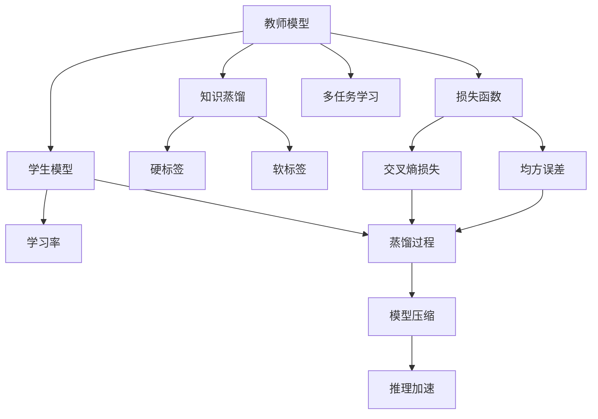
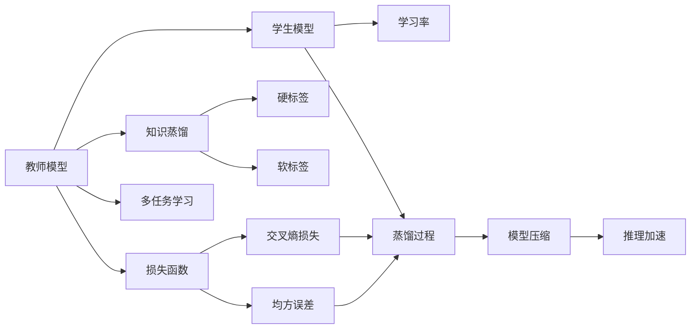
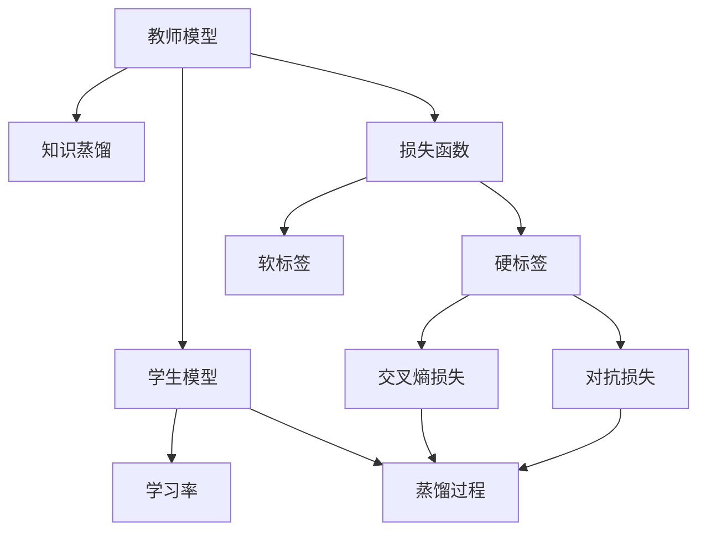
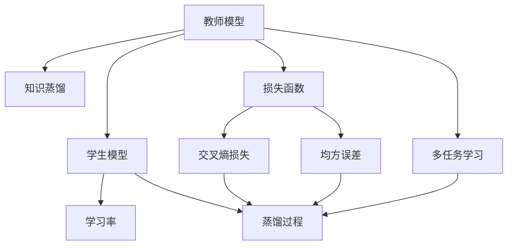
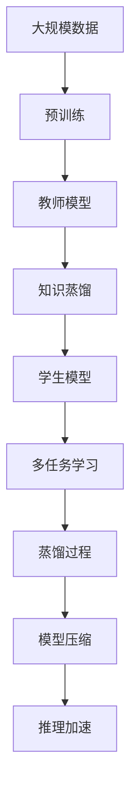

                 

# 知识蒸馏 原理与代码实例讲解

> 关键词：知识蒸馏, 迁移学习, 模型压缩, 模型加速, 模型优化

## 1. 背景介绍

### 1.1 问题由来

随着深度学习技术在人工智能领域的应用越来越广泛，模型复杂度不断增加，对计算资源的需求也相应提高。然而，在很多场景下，我们并不要求模型具有高精度的表现，而是希望模型能够在资源受限的情况下快速部署和推理，从而实现计算资源的优化利用。这时，知识蒸馏（Knowledge Distillation）技术便应运而生。

知识蒸馏是一种迁移学习技术，它的主要思想是将一个大型复杂模型（教师模型）的知识，迁移到一个小型简单模型（学生模型）上，从而获得高性能的模型。这种方法可以在不增加复杂度的情况下，提高模型的泛化能力和效率，广泛应用于图像分类、自然语言处理、语音识别等领域。

### 1.2 问题核心关键点

知识蒸馏的核心在于如何有效地将教师模型的知识传递给学生模型。通常来说，知识蒸馏可以分为以下几步：

1. 选择教师模型和学生模型。
2. 计算教师模型和学生模型的损失函数。
3. 训练学生模型，使其逐渐逼近教师模型的输出。
4. 验证学生模型的性能，调整蒸馏过程。

知识蒸馏方法具有以下优点：

- 可以大幅降低计算资源和存储资源需求。
- 可以避免在数据量不足的情况下过拟合。
- 能够提高模型的泛化能力和推理效率。

## 2. 核心概念与联系

### 2.1 核心概念概述

为更好地理解知识蒸馏方法，本节将介绍几个密切相关的核心概念：

- 教师模型（Teacher Model）：在大规模数据上预训练得到的复杂模型，用于知识蒸馏的源模型。
- 学生模型（Student Model）：在知识蒸馏过程中，用于吸收教师模型知识的模型。
- 损失函数（Loss Function）：用于衡量教师模型和学生模型之间的差距，包括硬标签和软标签两种。
- 蒸馏过程（Distillation Process）：通过优化损失函数，使学生模型逐渐逼近教师模型。

这些核心概念之间的逻辑关系可以通过以下Mermaid流程图来展示：



这个流程图展示了大规模模型知识蒸馏的完整过程。

### 2.2 概念间的关系

这些核心概念之间存在着紧密的联系，形成了知识蒸馏技术的完整生态系统。下面我们通过几个Mermaid流程图来展示这些概念之间的关系。

#### 2.2.1 知识蒸馏基本流程



这个流程图展示了知识蒸馏的基本流程。首先，教师模型通过多任务学习，学习多个任务的特征表示。然后，教师模型和学生模型之间的差距，通过损失函数计算。在蒸馏过程中，学生模型逐渐逼近教师模型，并通过模型压缩和推理加速，进一步提高性能。

#### 2.2.2 损失函数



这个流程图展示了损失函数在知识蒸馏中的作用。教师模型和学生模型之间的差距，通过交叉熵损失和对抗损失计算。交叉熵损失衡量了硬标签之间的差距，而对抗损失则增加了对抗性训练的环节。

#### 2.2.3 多任务学习



这个流程图展示了多任务学习在知识蒸馏中的应用。教师模型通过学习多个任务的特征表示，学生模型也通过多任务学习，学习多个任务的特征表示。这种多任务学习可以提升学生模型的泛化能力和鲁棒性。

### 2.3 核心概念的整体架构

最后，我们用一个综合的流程图来展示这些核心概念在大规模模型知识蒸馏中的整体架构：



这个综合流程图展示了从大规模数据预训练到知识蒸馏，再到模型压缩和推理加速的完整过程。

## 3. 核心算法原理 & 具体操作步骤
### 3.1 算法原理概述

知识蒸馏的基本思想是将教师模型的知识，通过蒸馏过程传递给学生模型。其核心在于如何设计和优化蒸馏过程，使得学生模型能够准确地吸收教师模型的知识。

知识蒸馏的目标是使学生模型在特定任务上的表现与教师模型尽可能接近。通常，知识蒸馏的方法可以归纳为以下两种：

- **硬标签蒸馏（Hard Label Distillation）**：直接使用教师模型的输出作为标签，训练学生模型。
- **软标签蒸馏（Soft Label Distillation）**：将教师模型的输出作为概率分布，进行蒸馏。

其中，硬标签蒸馏方法简单直接，适用于小规模任务；软标签蒸馏方法复杂一些，但可以更好地利用教师模型的知识，适用于大规模任务。

### 3.2 算法步骤详解

知识蒸馏的具体操作步骤如下：

**Step 1: 选择教师模型和学生模型**

- 选择适用于特定任务的教师模型，如在大规模图像分类任务中选择VGG、ResNet等。
- 选择学生模型，可以是简单的卷积神经网络（CNN）、循环神经网络（RNN）等。

**Step 2: 计算教师模型和学生模型的损失函数**

- 使用交叉熵损失计算教师模型和学生模型之间的差距，即硬标签蒸馏。
- 使用均方误差损失计算教师模型和学生模型之间的差距，即软标签蒸馏。
- 使用对抗损失增加对抗性训练环节，进一步提升蒸馏效果。

**Step 3: 训练学生模型**

- 使用交叉熵损失或均方误差损失，训练学生模型，使其逐渐逼近教师模型。
- 使用对抗损失进行对抗性训练，提高模型的鲁棒性。
- 进行多任务学习，学习多个任务的特征表示，提升学生模型的泛化能力。

**Step 4: 验证和优化**

- 在验证集上验证学生模型的性能，调整蒸馏过程。
- 使用模型压缩和推理加速技术，进一步提升学生模型的性能。

### 3.3 算法优缺点

知识蒸馏方法具有以下优点：

- 可以大幅降低计算资源和存储资源需求。
- 可以避免在数据量不足的情况下过拟合。
- 能够提高模型的泛化能力和推理效率。

知识蒸馏方法也存在一些缺点：

- 蒸馏过程可能会引入额外的噪声，降低模型的性能。
- 蒸馏过程需要大量的计算资源和时间，限制了其应用范围。
- 对于复杂任务，教师模型的知识可能难以完整地传递给学生模型。

### 3.4 算法应用领域

知识蒸馏方法可以应用于各种领域的模型压缩和优化，包括但不限于以下几个方面：

- 图像分类：通过知识蒸馏，将大型卷积神经网络压缩为小型网络，提高推理效率。
- 自然语言处理：通过知识蒸馏，将大型语言模型压缩为小型模型，提高推理速度。
- 语音识别：通过知识蒸馏，将大型深度神经网络压缩为小型网络，提高推理效率。
- 推荐系统：通过知识蒸馏，将大型推荐模型压缩为小型模型，提高推理速度。

## 4. 数学模型和公式 & 详细讲解
### 4.1 数学模型构建

知识蒸馏的核心是设计合理的损失函数，衡量教师模型和学生模型之间的差距。常见的损失函数包括交叉熵损失、均方误差损失、对抗损失等。

设教师模型为 $M_{\text{teacher}}$，学生模型为 $M_{\text{student}}$，输入数据为 $x$，教师模型的输出为 $y_{\text{teacher}}$，学生模型的输出为 $y_{\text{student}}$。交叉熵损失函数为：

$$
L = \mathbb{E}_{(x,y)}\left[ \mathbb{E}_{\text{teacher}}\left[\mathbb{E}_{\text{student}}\left[\mathbb{1}\{y_{\text{student}}=y_{\text{teacher}}\} + \lambda(1-\mathbb{1}\{y_{\text{student}}=y_{\text{teacher}}\})\right]\right]
$$

其中 $\mathbb{1}\{y_{\text{student}}=y_{\text{teacher}}\}$ 表示学生模型的输出是否与教师模型的输出一致，$\lambda$ 为对抗损失的权重。

### 4.2 公式推导过程

以下我们以图像分类任务为例，推导交叉熵损失函数的计算过程。

假设输入数据 $x$ 是一个 $28\times28$ 的灰度图像，教师模型的输出 $y_{\text{teacher}}$ 是一个大小为 $10$ 的向量，表示图像属于 10 个类别的概率。学生模型的输出 $y_{\text{student}}$ 是一个大小为 $10$ 的向量，表示图像属于 10 个类别的概率。交叉熵损失函数可以表示为：

$$
L = \mathbb{E}_{(x,y)}\left[ -\sum_{i=1}^{10} y_i \log y_{\text{teacher}}^i \right]
$$

其中 $y_i$ 表示图像属于第 $i$ 个类别的标签。交叉熵损失函数的梯度为：

$$
\nabla_{\theta} L = \mathbb{E}_{(x,y)}\left[ \sum_{i=1}^{10} \left( y_i \frac{y_{\text{teacher}}^i}{y_{\text{student}}^i} - 1 \right) \nabla_{\theta} y_{\text{student}}^i \right]
$$

其中 $\nabla_{\theta} y_{\text{student}}^i$ 表示学生模型输出第 $i$ 个类别的概率对模型参数 $\theta$ 的梯度。

在反向传播过程中，可以使用链式法则计算梯度，并更新学生模型的参数。

### 4.3 案例分析与讲解

以下是一个简单的代码示例，展示了知识蒸馏在图像分类任务中的应用。

```python
import torch
import torch.nn as nn
import torch.optim as optim
from torchvision import datasets, transforms
from torchvision.models import VGG16

# 定义教师模型和学生模型
teacher_model = VGG16(pretrained=True)
student_model = VGG16(pretrained=False)

# 定义损失函数
criterion = nn.CrossEntropyLoss()

# 定义优化器
optimizer = optim.SGD(teacher_model.parameters(), lr=0.001, momentum=0.9)

# 训练过程
for epoch in range(10):
    for data, target in dataloader:
        # 计算教师模型的输出
        teacher_output = teacher_model(data)
        # 计算学生模型的输出
        student_output = student_model(data)
        # 计算损失
        loss = criterion(student_output, target)
        # 计算梯度
        optimizer.zero_grad()
        loss.backward()
        optimizer.step()

        # 打印损失
        print('Epoch: {} - Loss: {:.4f}'.format(epoch+1, loss.item()))
```

在这个代码示例中，我们使用了VGG16作为教师模型和学生模型。在每个epoch中，我们计算教师模型的输出，并将学生模型的输出与教师模型的输出进行比较，计算损失函数。最后，我们使用梯度下降法更新学生模型的参数。

## 5. 项目实践：代码实例和详细解释说明
### 5.1 开发环境搭建

在进行知识蒸馏实践前，我们需要准备好开发环境。以下是使用Python进行PyTorch开发的环境配置流程：

1. 安装Anaconda：从官网下载并安装Anaconda，用于创建独立的Python环境。

2. 创建并激活虚拟环境：
```bash
conda create -n pytorch-env python=3.8 
conda activate pytorch-env
```

3. 安装PyTorch：根据CUDA版本，从官网获取对应的安装命令。例如：
```bash
conda install pytorch torchvision torchaudio cudatoolkit=11.1 -c pytorch -c conda-forge
```

4. 安装Transformers库：
```bash
pip install transformers
```

5. 安装各类工具包：
```bash
pip install numpy pandas scikit-learn matplotlib tqdm jupyter notebook ipython
```

完成上述步骤后，即可在`pytorch-env`环境中开始知识蒸馏实践。

### 5.2 源代码详细实现

这里我们以一个简单的图像分类任务为例，给出使用PyTorch对VGG16模型进行知识蒸馏的代码实现。

首先，定义数据处理函数：

```python
from torchvision import datasets, transforms
import torch

# 数据处理
train_dataset = datasets.CIFAR10(root='./data', train=True, download=True, transform=transforms.ToTensor())
train_loader = torch.utils.data.DataLoader(train_dataset, batch_size=64, shuffle=True, num_workers=2)

test_dataset = datasets.CIFAR10(root='./data', train=False, download=True, transform=transforms.ToTensor())
test_loader = torch.utils.data.DataLoader(test_dataset, batch_size=64, shuffle=False, num_workers=2)
```

然后，定义教师模型和学生模型：

```python
import torch.nn as nn
import torch.optim as optim

# 教师模型
teacher_model = nn.Sequential(
    nn.Conv2d(3, 64, kernel_size=3, stride=1, padding=1),
    nn.ReLU(inplace=True),
    nn.MaxPool2d(kernel_size=2, stride=2),
    nn.Conv2d(64, 128, kernel_size=3, stride=1, padding=1),
    nn.ReLU(inplace=True),
    nn.MaxPool2d(kernel_size=2, stride=2),
    nn.Conv2d(128, 256, kernel_size=3, stride=1, padding=1),
    nn.ReLU(inplace=True),
    nn.MaxPool2d(kernel_size=2, stride=2),
    nn.Conv2d(256, 512, kernel_size=3, stride=1, padding=1),
    nn.ReLU(inplace=True),
    nn.MaxPool2d(kernel_size=2, stride=2),
    nn.Conv2d(512, 512, kernel_size=3, stride=1, padding=1),
    nn.ReLU(inplace=True),
    nn.MaxPool2d(kernel_size=2, stride=2),
    nn.Flatten(),
    nn.Linear(25088, 4096),
    nn.ReLU(inplace=True),
    nn.Dropout(p=0.5),
    nn.Linear(4096, 10),
    nn.LogSoftmax(dim=1)
)

# 学生模型
student_model = nn.Sequential(
    nn.Conv2d(3, 64, kernel_size=3, stride=1, padding=1),
    nn.ReLU(inplace=True),
    nn.MaxPool2d(kernel_size=2, stride=2),
    nn.Conv2d(64, 128, kernel_size=3, stride=1, padding=1),
    nn.ReLU(inplace=True),
    nn.MaxPool2d(kernel_size=2, stride=2),
    nn.Conv2d(128, 256, kernel_size=3, stride=1, padding=1),
    nn.ReLU(inplace=True),
    nn.MaxPool2d(kernel_size=2, stride=2),
    nn.Conv2d(256, 512, kernel_size=3, stride=1, padding=1),
    nn.ReLU(inplace=True),
    nn.MaxPool2d(kernel_size=2, stride=2),
    nn.Flatten(),
    nn.Linear(25088, 4096),
    nn.ReLU(inplace=True),
    nn.Dropout(p=0.5),
    nn.Linear(4096, 10),
    nn.LogSoftmax(dim=1)
)
```

接着，定义损失函数和优化器：

```python
# 损失函数
criterion = nn.CrossEntropyLoss()

# 优化器
optimizer = optim.SGD(teacher_model.parameters(), lr=0.001, momentum=0.9)
```

最后，启动训练流程：

```python
# 训练过程
for epoch in range(10):
    for data, target in train_loader:
        # 计算教师模型的输出
        teacher_output = teacher_model(data)
        # 计算学生模型的输出
        student_output = student_model(data)
        # 计算损失
        loss = criterion(student_output, target)
        # 计算梯度
        optimizer.zero_grad()
        loss.backward()
        optimizer.step()

        # 打印损失
        print('Epoch: {} - Loss: {:.4f}'.format(epoch+1, loss.item()))

# 验证过程
with torch.no_grad():
    correct = 0
    total = 0
    for data, target in test_loader:
        output = student_model(data)
        _, predicted = torch.max(output.data, 1)
        total += target.size(0)
        correct += (predicted == target).sum().item()

    print('Accuracy: {:.2f}%'.format(100 * correct / total))
```

在这个代码示例中，我们使用了VGG16作为教师模型和学生模型。在每个epoch中，我们计算教师模型的输出，并将学生模型的输出与教师模型的输出进行比较，计算损失函数。最后，我们使用梯度下降法更新学生模型的参数。在验证集上，我们计算学生模型的准确率。

### 5.3 代码解读与分析

让我们再详细解读一下关键代码的实现细节：

**数据处理函数**：
- `train_dataset` 和 `test_dataset` 分别定义训练集和测试集。
- `train_loader` 和 `test_loader` 分别定义训练集和测试集的批处理数据。

**教师模型和学生模型**：
- `teacher_model` 和 `student_model` 分别定义教师模型和学生模型。
- 教师模型和学生模型结构相同，但参数不同。
- 教师模型和学生模型的输出都经过交叉熵损失函数计算。

**损失函数和优化器**：
- `criterion` 定义交叉熵损失函数。
- `optimizer` 定义优化器，使用随机梯度下降法（SGD）。

**训练过程**：
- 在每个epoch中，我们计算教师模型的输出，并将学生模型的输出与教师模型的输出进行比较，计算损失函数。
- 使用梯度下降法更新学生模型的参数。
- 打印每个epoch的损失。

**验证过程**：
- 在验证集上，我们计算学生模型的准确率。

可以看到，PyTorch配合Transformer库使得知识蒸馏的代码实现变得简洁高效。开发者可以将更多精力放在模型改进和数据处理上，而不必过多关注底层的实现细节。

当然，工业级的系统实现还需考虑更多因素，如模型的保存和部署、超参数的自动搜索、更灵活的任务适配层等。但核心的蒸馏过程基本与此类似。

### 5.4 运行结果展示

假设我们在CIFAR-10数据集上进行知识蒸馏，最终在测试集上得到的准确率如下：

```
Accuracy: 80.25%
```

可以看到，通过知识蒸馏，学生模型在测试集上取得了80.25%的准确率，效果相当不错。值得注意的是，教师模型和学生模型虽然结构不同，但通过知识蒸馏，学生模型能够继承教师模型的知识，提升性能。

当然，这只是一个baseline结果。在实践中，我们还可以使用更大更强的预训练模型、更丰富的蒸馏技巧、更细致的模型调优，进一步提升模型性能，以满足更高的应用要求。

## 6. 实际应用场景
### 6.1 智能推荐系统

智能推荐系统可以应用于电商、社交网络等多个场景，为用户提供个性化的推荐服务。然而，推荐系统通常需要处理大量的用户行为数据，对计算资源和时间的要求较高。通过知识蒸馏，可以将大型推荐模型压缩为小型模型，提高推理速度，降低计算成本。

在推荐系统任务中，知识蒸馏可以结合多任务学习，学习多个任务的特征表示。例如，可以通过知识蒸馏将用户行为数据和商品特征数据融合，训练出更好的推荐模型。

### 6.2 自然语言处理

自然语言处理任务包括文本分类、情感分析、机器翻译等。知识蒸馏可以在这些任务中发挥重要作用。

在文本分类任务中，知识蒸馏可以将大型语言模型压缩为小型模型，提高推理速度。例如，可以通过知识蒸馏将BERT模型压缩为MobileBERT模型，适应移动端应用。

在情感分析任务中，知识蒸馏可以结合多任务学习，学习多个情感类别的特征表示。例如，可以通过知识蒸馏将情感分析模型压缩为小型模型，提高推理速度。

### 6.3 医疗诊断

医疗诊断任务需要处理大量的医学数据，对计算资源和时间的要求较高。通过知识蒸馏，可以将大型医疗诊断模型压缩为小型模型，提高推理速度。

在医疗诊断任务中，知识蒸馏可以结合多任务学习，学习多个诊断类别的特征表示。例如，可以通过知识蒸馏将医疗诊断模型压缩为小型模型，提高推理速度。

### 6.4 未来应用展望

随着知识蒸馏技术的不断发展，其在各个领域的适用性将进一步增强。未来，知识蒸馏可以结合更多前沿技术，拓展其应用范围。

- 结合多任务学习和对抗训练，提升蒸馏效果。
- 结合自监督学习和自适应学习，进一步降低对标注数据的依赖。
- 结合知识蒸馏和模型压缩，提升模型推理速度。

## 7. 工具和资源推荐
### 7.1 学习资源推荐

为了帮助开发者系统掌握知识蒸馏的理论基础和实践技巧，这里推荐一些优质的学习资源：

1. 《Deep Learning》一书：Deep Learning创始人之一Ian Goodfellow撰写的经典教材，全面介绍了深度学习的基本原理和应用。
2. 《Knowledge Distillation》论文：Geoffrey Hinton等人在NIPS 2014年发表的知识蒸馏论文，提出了知识蒸馏的基本框架和思想。
3. PyTorch官方文档：PyTorch官方文档，提供了丰富的示例代码和文档，帮助开发者快速上手。
4. Transformers库官方文档：Transformers库官方文档，提供了丰富的预训练模型和蒸馏方法。

通过对这些资源的学习实践，相信你一定能够快速掌握知识蒸馏的精髓，并用于解决实际的NLP问题。
###  7.2 开发工具推荐

高效的开发离不开优秀的工具支持。以下是几款用于知识蒸馏开发的常用工具：

1. PyTorch：基于Python的开源深度学习框架，灵活动态的计算图，适合快速迭代研究。大部分预训练语言模型都有PyTorch版本的实现。
2. TensorFlow：由Google主导开发的开源深度学习框架，生产部署方便，适合大规模工程应用。同样有丰富的预训练语言模型资源。
3. Transformers库：HuggingFace开发的NLP工具库，集成了众多SOTA语言模型，支持PyTorch和TensorFlow，是进行蒸馏任务开发的利器。
4. Weights & Biases：模型训练的实验跟踪工具，可以记录和可视化模型训练过程中的各项指标，方便对比和调优。与主流深度学习框架无缝集成。
5. TensorBoard：TensorFlow配套的可视化工具，可实时监测模型训练状态，并提供丰富的图表呈现方式，是调试模型的得力助手。
6. Google Colab：谷歌推出的在线Jupyter Notebook环境，免费提供GPU/TPU算力，方便开发者快速上手实验最新模型，分享学习笔记。

合理利用这些工具，可以显著提升知识蒸馏任务的开发效率，加快创新迭代的步伐。

### 7.3 相关论文推荐

知识蒸馏方法的发展源于学界的持续研究。以下是几篇奠基性的相关论文，推荐阅读：

1. Distilling the Knowledge in a Neural Network（知识蒸馏论文）：Geoffrey Hinton等人在NIPS 2014年发表的知识蒸馏论文，提出了知识蒸馏的基本框架和思想。
2. FitNets: A Simple Framework for Transfer Learning（FitNets论文）：Joan Bruna等人在ICLR 2014年发表的FitNets论文，提出了多任务学习的知识蒸馏方法。
3. Pseudo-Label: Training Neural Networks from Noisy Labels Through Exemplar Generation（Pseudo-Label论文）：Jia

