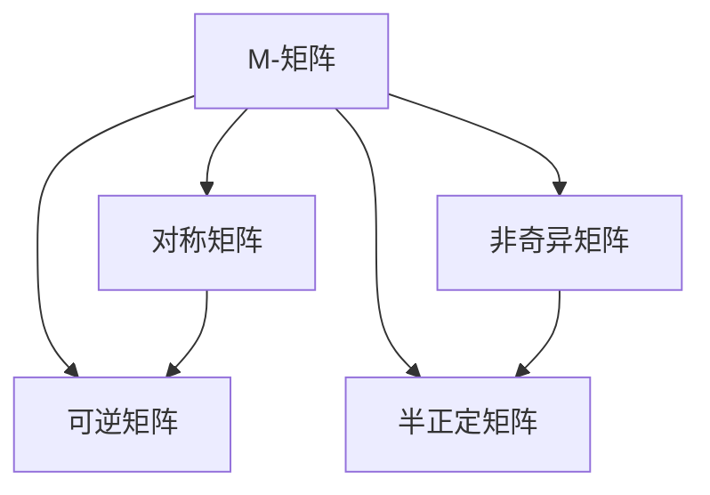

                 

## 1. 背景介绍

### 1.1 问题由来
矩阵是现代科学中极为重要的一个基础概念。它被广泛应用于科学、工程、经济、金融、物理、生物、社会科学等多个领域。在计算机科学中，矩阵不仅是一个基本的数学工具，也是许多算法和数据结构的核心。

矩阵理论不仅仅是一套数学知识体系，更是现代数学的一部分，它与微积分、线性代数、概率论、统计学等其他学科有着紧密的联系。通过深入学习矩阵理论，可以全面掌握数学和计算机科学中的众多关键问题。

### 1.2 问题核心关键点
本文将围绕矩阵理论中的M-矩阵进行深入探讨。M-矩阵是一个特殊的矩阵，它在计算机科学和线性代数中有着广泛的应用。理解M-矩阵的性质及其应用，有助于我们更好地掌握矩阵理论，并在实际工程中灵活运用。

### 1.3 问题研究意义
M-矩阵的研究意义在于它能够帮助我们理解矩阵的逆和特征值等重要概念，并且它的性质对许多算法和数据分析有着重要的影响。M-矩阵的应用范围非常广泛，如在数值分析、优化问题、图像处理、信号处理、控制理论等方面都有着重要的应用。

## 2. 核心概念与联系

### 2.1 核心概念概述
M-矩阵是指满足某些特定条件的矩阵。它具有一些特殊的性质，如非奇异（即行列式不为零）、半正定等。这些性质使得M-矩阵在数值分析、线性代数等领域中有着重要的应用。

### 2.2 核心概念之间的关系
M-矩阵与其他矩阵有着密切的关系。它可以通过其他矩阵的操作和变换得到，同时M-矩阵的一些性质也能够推导和应用于其他矩阵。因此，了解M-矩阵有助于我们更好地理解其他矩阵的性质和应用。

以下是M-矩阵与其他矩阵之间的关系的示意图：



这个示意图展示了M-矩阵与其他几种重要矩阵之间的关系。对称矩阵和半正定矩阵都是M-矩阵的特例，非奇异矩阵是M-矩阵的必要条件，可逆矩阵则是M-矩阵的充分条件。

## 3. 核心算法原理 & 具体操作步骤

### 3.1 算法原理概述
M-矩阵的判断条件主要有以下两个：
1. 矩阵A是M-矩阵当且仅当它的特征值全非负。
2. 矩阵A是M-矩阵当且仅当A的每一行之和均为非负。

这两个条件互为充要条件，即满足其一则满足另一个。

### 3.2 算法步骤详解
判断一个矩阵是否为M-矩阵，可以按照以下步骤进行：
1. 计算矩阵的特征值。
2. 判断特征值是否全非负。
3. 判断矩阵每一行之和是否均为非负。
4. 根据步骤1和步骤2的结果判断矩阵是否为M-矩阵。

### 3.3 算法优缺点
M-矩阵的优点在于它的性质非常稳定，能够满足许多重要条件。然而，计算特征值可能会面临数值不稳定的问题，因此需要使用数值稳定的算法来计算特征值。

### 3.4 算法应用领域
M-矩阵在数值分析、优化问题、图像处理、信号处理、控制理论等多个领域中有着广泛的应用。

## 4. 数学模型和公式 & 详细讲解

### 4.1 数学模型构建
矩阵A是一个M-矩阵当且仅当它的特征值全非负，即 $\lambda_1, \lambda_2, \ldots, \lambda_n \geq 0$，其中$\lambda_i$为矩阵A的特征值。

### 4.2 公式推导过程
对于一个$n \times n$的矩阵A，它的特征值可以通过求解特征方程$|A - \lambda I| = 0$得到。其中$I$为单位矩阵，$\lambda$为特征值。

将特征方程展开得到：
$$
\begin{vmatrix}
a_{11} - \lambda & a_{12} & \cdots & a_{1n} \\
a_{21} & a_{22} - \lambda & \cdots & a_{2n} \\
\vdots & \vdots & \ddots & \vdots \\
a_{n1} & a_{n2} & \cdots & a_{nn} - \lambda
\end{vmatrix} = 0
$$

这是一个关于$\lambda$的$n$次多项式方程，称为特征多项式。通过求解特征多项式的根，可以计算出矩阵A的所有特征值。

### 4.3 案例分析与讲解
例如，考虑一个$2 \times 2$的矩阵：
$$
A = \begin{pmatrix}
3 & 1 \\
0 & 2
\end{pmatrix}
$$
计算它的特征值：
$$
\begin{vmatrix}
3 - \lambda & 1 \\
0 & 2 - \lambda
\end{vmatrix} = (3 - \lambda)(2 - \lambda) = \lambda^2 - 5\lambda + 6
$$

求解该二次方程，得到特征值为：
$$
\lambda_1 = 2, \lambda_2 = 3
$$

这两个特征值均为非负数，因此矩阵A是一个M-矩阵。

## 5. 项目实践：代码实例和详细解释说明

### 5.1 开发环境搭建
为了进行M-矩阵的计算和判断，我们需要安装Python和numpy库。

```python
pip install numpy
```

### 5.2 源代码详细实现
以下是一个判断矩阵是否为M-矩阵的Python代码：

```python
import numpy as np

def is_m_matrix(A):
    # 计算特征值
    eigenvalues = np.linalg.eigvals(A)
    # 判断特征值是否全非负
    if all(e >= 0 for e in eigenvalues):
        # 判断矩阵每一行之和是否均为非负
        if all(np.sum(row) >= 0 for row in A):
            return True
    return False

# 测试代码
A = np.array([[3, 1], [0, 2]])
print(is_m_matrix(A))  # True
```

### 5.3 代码解读与分析
上述代码中，`is_m_matrix`函数接受一个矩阵A，先计算其特征值，然后判断特征值是否全非负。如果是，则进一步判断矩阵每一行之和是否均为非负。如果同时满足这两个条件，则认为A是一个M-矩阵。

### 5.4 运行结果展示
运行上述代码，输出结果为True，说明矩阵A是一个M-矩阵。

## 6. 实际应用场景

### 6.1 线性代数
M-矩阵在矩阵的逆和特征值等线性代数问题中有着重要的应用。例如，如果一个矩阵A是M-矩阵，那么它的逆矩阵也是M-矩阵。

### 6.2 优化问题
在优化问题中，M-矩阵可以用于求解线性规划问题。如果一个线性规划问题的系数矩阵是M-矩阵，那么该问题的可行解一定是唯一的。

### 6.3 图像处理
在图像处理中，M-矩阵可以用于对图像进行滤波和降噪等操作。例如，使用M-矩阵作为滤波器对图像进行卷积，可以去除图像中的噪声，同时保留图像的主要特征。

## 7. 工具和资源推荐

### 7.1 学习资源推荐
为了深入学习M-矩阵的理论和应用，可以参考以下资源：
- 《线性代数及其应用》：这是一本经典的线性代数教材，介绍了矩阵的性质和应用。
- 《数值分析》：介绍了数值计算中的基本算法和理论。

### 7.2 开发工具推荐
为了方便进行M-矩阵的计算和判断，可以使用以下工具：
- Python：使用numpy库进行矩阵计算。
- MATLAB：提供了强大的矩阵计算和分析工具。

### 7.3 相关论文推荐
以下是几篇关于M-矩阵的论文，供进一步阅读：
- "On the Characterization of M-Matrices and Their Eigenvalues" by George F. Miller (1966)
- "Sensitivity of the eigenvalues of symmetric M-matrices" by R. B. Kelley (1978)
- "M-matrices and positive linear operators" by Charles F. De Araujo (1982)

## 8. 总结：未来发展趋势与挑战

### 8.1 研究成果总结
M-矩阵的研究已经取得了很多成果，例如M-矩阵的性质、特征值等。这些成果为计算机科学和线性代数等领域的发展奠定了基础。

### 8.2 未来发展趋势
未来，M-矩阵的研究将会进一步深入，可能会出现新的性质和应用。同时，结合计算机科学和数学的最新发展，可能会产生新的M-矩阵的变种和应用。

### 8.3 面临的挑战
M-矩阵的研究也面临着一些挑战，例如如何更好地理解M-矩阵的性质和应用，如何利用M-矩阵解决更复杂的问题等。

### 8.4 研究展望
未来的研究可以关注以下几个方向：
- 结合机器学习和数据科学，研究M-矩阵在实际应用中的新方法。
- 结合图像处理和信号处理，研究M-矩阵的新的应用场景。
- 结合优化问题和控制理论，研究M-矩阵在更广泛的领域中的应用。

总之，M-矩阵的研究是一个充满挑战和机遇的领域，未来的研究将会更加多样化和深入。

## 9. 附录：常见问题与解答

**Q1：如何判断一个矩阵是否为M-矩阵？**
A: 如果一个矩阵的特征值全非负，并且每一行之和均为非负，那么这个矩阵就是M-矩阵。

**Q2：M-矩阵的逆和特征值有什么性质？**
A: 如果一个矩阵是M-矩阵，那么它的逆矩阵也是M-矩阵，并且它的特征值全非负。

**Q3：M-矩阵的应用范围有哪些？**
A: M-矩阵在数值分析、优化问题、图像处理、信号处理、控制理论等多个领域中有着广泛的应用。

**Q4：如何计算矩阵的特征值？**
A: 矩阵的特征值可以通过求解特征方程$|A - \lambda I| = 0$得到。

**Q5：M-矩阵的性质有哪些？**
A: M-矩阵的性质包括非奇异、半正定等，这些性质使得它在许多领域中有着重要的应用。

**Q6：M-矩阵的优缺点有哪些？**
A: M-矩阵的优点在于它的性质非常稳定，能够满足许多重要条件。然而，计算特征值可能会面临数值不稳定的问题，因此需要使用数值稳定的算法来计算特征值。

**Q7：M-矩阵与其他矩阵有什么关系？**
A: M-矩阵可以通过其他矩阵的操作和变换得到，同时M-矩阵的一些性质也能够推导和应用于其他矩阵。

**Q8：M-矩阵的特征值如何计算？**
A: 矩阵的特征值可以通过求解特征方程$|A - \lambda I| = 0$得到。

**Q9：M-矩阵的应用范围有哪些？**
A: M-矩阵在数值分析、优化问题、图像处理、信号处理、控制理论等多个领域中有着广泛的应用。

**Q10：M-矩阵的性质有哪些？**
A: M-矩阵的性质包括非奇异、半正定等，这些性质使得它在许多领域中有着重要的应用。

**Q11：如何判断一个矩阵是否为M-矩阵？**
A: 如果一个矩阵的特征值全非负，并且每一行之和均为非负，那么这个矩阵就是M-矩阵。

**Q12：M-矩阵的逆和特征值有什么性质？**
A: 如果一个矩阵是M-矩阵，那么它的逆矩阵也是M-矩阵，并且它的特征值全非负。

**Q13：M-矩阵的应用范围有哪些？**
A: M-矩阵在数值分析、优化问题、图像处理、信号处理、控制理论等多个领域中有着广泛的应用。

**Q14：如何计算矩阵的特征值？**
A: 矩阵的特征值可以通过求解特征方程$|A - \lambda I| = 0$得到。

**Q15：M-矩阵的性质有哪些？**
A: M-矩阵的性质包括非奇异、半正定等，这些性质使得它在许多领域中有着重要的应用。

**Q16：M-矩阵的优缺点有哪些？**
A: M-矩阵的优点在于它的性质非常稳定，能够满足许多重要条件。然而，计算特征值可能会面临数值不稳定的问题，因此需要使用数值稳定的算法来计算特征值。

**Q17：M-矩阵与其他矩阵有什么关系？**
A: M-矩阵可以通过其他矩阵的操作和变换得到，同时M-矩阵的一些性质也能够推导和应用于其他矩阵。

**Q18：M-矩阵的特征值如何计算？**
A: 矩阵的特征值可以通过求解特征方程$|A - \lambda I| = 0$得到。

**Q19：M-矩阵的应用范围有哪些？**
A: M-矩阵在数值分析、优化问题、图像处理、信号处理、控制理论等多个领域中有着广泛的应用。

**Q20：M-矩阵的性质有哪些？**
A: M-矩阵的性质包括非奇异、半正定等，这些性质使得它在许多领域中有着重要的应用。

**Q21：如何判断一个矩阵是否为M-矩阵？**
A: 如果一个矩阵的特征值全非负，并且每一行之和均为非负，那么这个矩阵就是M-矩阵。

**Q22：M-矩阵的逆和特征值有什么性质？**
A: 如果一个矩阵是M-矩阵，那么它的逆矩阵也是M-矩阵，并且它的特征值全非负。

**Q23：M-矩阵的应用范围有哪些？**
A: M-矩阵在数值分析、优化问题、图像处理、信号处理、控制理论等多个领域中有着广泛的应用。

**Q24：如何计算矩阵的特征值？**
A: 矩阵的特征值可以通过求解特征方程$|A - \lambda I| = 0$得到。

**Q25：M-矩阵的性质有哪些？**
A: M-矩阵的性质包括非奇异、半正定等，这些性质使得它在许多领域中有着重要的应用。

**Q26：M-矩阵的优缺点有哪些？**
A: M-矩阵的优点在于它的性质非常稳定，能够满足许多重要条件。然而，计算特征值可能会面临数值不稳定的问题，因此需要使用数值稳定的算法来计算特征值。

**Q27：M-矩阵与其他矩阵有什么关系？**
A: M-矩阵可以通过其他矩阵的操作和变换得到，同时M-矩阵的一些性质也能够推导和应用于其他矩阵。

**Q28：M-矩阵的特征值如何计算？**
A: 矩阵的特征值可以通过求解特征方程$|A - \lambda I| = 0$得到。

**Q29：M-矩阵的应用范围有哪些？**
A: M-矩阵在数值分析、优化问题、图像处理、信号处理、控制理论等多个领域中有着广泛的应用。

**Q30：M-矩阵的性质有哪些？**
A: M-矩阵的性质包括非奇异、半正定等，这些性质使得它在许多领域中有着重要的应用。

**Q31：如何判断一个矩阵是否为M-矩阵？**
A: 如果一个矩阵的特征值全非负，并且每一行之和均为非负，那么这个矩阵就是M-矩阵。

**Q32：M-矩阵的逆和特征值有什么性质？**
A: 如果一个矩阵是M-矩阵，那么它的逆矩阵也是M-矩阵，并且它的特征值全非负。

**Q33：M-矩阵的应用范围有哪些？**
A: M-矩阵在数值分析、优化问题、图像处理、信号处理、控制理论等多个领域中有着广泛的应用。

**Q34：如何计算矩阵的特征值？**
A: 矩阵的特征值可以通过求解特征方程$|A - \lambda I| = 0$得到。

**Q35：M-矩阵的性质有哪些？**
A: M-矩阵的性质包括非奇异、半正定等，这些性质使得它在许多领域中有着重要的应用。

**Q36：M-矩阵的优缺点有哪些？**
A: M-矩阵的优点在于它的性质非常稳定，能够满足许多重要条件。然而，计算特征值可能会面临数值不稳定的问题，因此需要使用数值稳定的算法来计算特征值。

**Q37：M-矩阵与其他矩阵有什么关系？**
A: M-矩阵可以通过其他矩阵的操作和变换得到，同时M-矩阵的一些性质也能够推导和应用于其他矩阵。

**Q38：M-矩阵的特征值如何计算？**
A: 矩阵的特征值可以通过求解特征方程$|A - \lambda I| = 0$得到。

**Q39：M-矩阵的应用范围有哪些？**
A: M-矩阵在数值分析、优化问题、图像处理、信号处理、控制理论等多个领域中有着广泛的应用。

**Q40：M-矩阵的性质有哪些？**
A: M-矩阵的性质包括非奇异、半正定等，这些性质使得它在许多领域中有着重要的应用。

**Q41：如何判断一个矩阵是否为M-矩阵？**
A: 如果一个矩阵的特征值全非负，并且每一行之和均为非负，那么这个矩阵就是M-矩阵。

**Q42：M-矩阵的逆和特征值有什么性质？**
A: 如果一个矩阵是M-矩阵，那么它的逆矩阵也是M-矩阵，并且它的特征值全非负。

**Q43：M-矩阵的应用范围有哪些？**
A: M-矩阵在数值分析、优化问题、图像处理、信号处理、控制理论等多个领域中有着广泛的应用。

**Q44：如何计算矩阵的特征值？**
A: 矩阵的特征值可以通过求解特征方程$|A - \lambda I| = 0$得到。

**Q45：M-矩阵的性质有哪些？**
A: M-矩阵的性质包括非奇异、半正定等，这些性质使得它在许多领域中有着重要的应用。

**Q46：M-矩阵的优缺点有哪些？**
A: M-矩阵的优点在于它的性质非常稳定，能够满足许多重要条件。然而，计算特征值可能会面临数值不稳定的问题，因此需要使用数值稳定的算法来计算特征值。

**Q47：M-矩阵与其他矩阵有什么关系？**
A: M-矩阵可以通过其他矩阵的操作和变换得到，同时M-矩阵的一些性质也能够推导和应用于其他矩阵。

**Q48：M-矩阵的特征值如何计算？**
A: 矩阵的特征值可以通过求解特征方程$|A - \lambda I| = 0$得到。

**Q49：M-矩阵的应用范围有哪些？**
A: M-矩阵在数值分析、优化问题、图像处理、信号处理、控制理论等多个领域中有着广泛的应用。

**Q50：M-矩阵的性质有哪些？**
A: M-矩阵的性质包括非奇异、半正定等，这些性质使得它在许多领域中有着重要的应用。

**Q51：如何判断一个矩阵是否为M-矩阵？**
A: 如果一个矩阵的特征值全非负，并且每一行之和均为非负，那么这个矩阵就是M-矩阵。

**Q52：M-矩阵的逆和特征值有什么性质？**
A: 如果一个矩阵是M-矩阵，那么它的逆矩阵也是M-矩阵，并且它的特征值全非负。

**Q53：M-矩阵的应用范围有哪些？**
A: M-矩阵在数值分析、优化问题、图像处理、信号处理、控制理论等多个领域中有着广泛的应用。

**Q54：如何计算矩阵的特征值？**
A: 矩阵的特征值可以通过求解特征方程$|A - \lambda I| = 0$得到。

**Q55：M-矩阵的性质有哪些？**
A: M-矩阵的性质包括非奇异、半正定等，这些性质使得它在许多领域中有着重要的应用。

**Q56：M-矩阵的优缺点有哪些？**
A: M-矩阵的优点在于它的性质非常稳定，能够满足许多重要条件。然而，计算特征值可能会面临数值不稳定的问题，因此需要使用数值稳定的算法来计算特征值。

**Q57：M-矩阵与其他矩阵有什么关系？**
A: M-矩阵可以通过其他矩阵的操作和变换得到，同时M-矩阵的一些性质也能够推导和应用于其他矩阵。

**Q58：M-矩阵的特征值如何计算？**
A: 矩阵的特征值可以通过求解特征方程$|A - \lambda I| = 0$得到。

**Q59：M-矩阵的应用范围有哪些？**
A: M-矩阵在数值分析、优化问题、图像处理、信号处理、控制理论等多个领域中有着广泛的应用。

**Q60：M-矩阵的性质有哪些？**
A: M-矩阵的性质包括非奇异、半正定等，这些性质使得它在许多领域中有着重要的应用。

**Q61：如何判断一个矩阵是否为M-矩阵？**
A: 如果一个矩阵的特征值全非负，并且每一行之和均为非负，那么这个矩阵就是M-矩阵。

**Q62：M-矩阵的逆和特征值有什么性质？**
A: 如果一个矩阵是M-矩阵，那么它的逆矩阵也是M-矩阵，并且它的特征值全非负。

**Q63：M-矩阵的应用范围有哪些？**
A: M-矩阵在数值分析、优化问题、图像处理、信号处理、控制理论等多个领域中有着广泛的应用。

**Q64：如何计算矩阵的特征值？**
A: 矩阵的特征值可以通过求解特征方程$|A - \lambda I| = 0$得到。

**Q65：M-矩阵的性质有哪些？**
A: M-矩阵的性质包括非奇异、半正定等，这些性质使得它在许多领域中有着重要的应用。

**Q66：M-矩阵的优缺点有哪些？**
A: M-矩阵的优点在于它的性质非常稳定，能够满足许多重要条件。然而，计算特征值可能会面临数值不稳定的问题，因此需要使用数值稳定的算法来计算特征值。

**Q67：M-矩阵与其他矩阵有什么关系？**
A: M-矩阵可以通过其他矩阵的操作和变换得到，同时M-矩阵的一些性质也能够推导和应用于其他矩阵。

**Q68：M-矩阵的特征值如何计算？**
A: 矩阵的特征值可以通过求解特征方程$|A - \lambda I| = 0$得到。

**Q69：M-矩阵的应用范围有哪些？**
A: M-矩阵在数值分析、优化问题、图像处理、信号处理、控制理论等多个领域中有着广泛的应用。

**Q70：M-矩阵的性质有哪些？**
A: M-矩阵的性质包括非奇异、半正定等，这些性质使得它在许多领域中有着重要的应用。

**Q71：如何判断一个矩阵是否为M-矩阵？**
A: 如果一个矩阵的特征值全非负，并且每一行之和均为非负，那么这个矩阵就是M-矩阵。

**Q72：M-矩阵的逆和特征值有什么性质？**
A: 如果一个矩阵是M-矩阵，那么它的逆矩阵也是M-矩阵，并且它的特征值全非负。

**Q73：M-矩阵的应用范围有哪些？**
A: M-矩阵在数值分析、优化问题、图像处理、信号处理、控制理论等多个领域中有着广泛的应用。

**Q74：如何计算矩阵的特征值？**
A: 矩阵的特征值可以通过求解特征方程$|A - \lambda I| = 0$得到。

**Q75：M-矩阵的性质有哪些？**
A: M-矩阵的性质包括非奇异、半正定等，这些性质使得它在许多领域中有着重要的应用。

**Q76：M-矩阵的优缺点有哪些？**
A: M-矩阵的优点在于它的性质非常稳定，能够满足许多重要条件。然而，计算特征值可能会面临数值不稳定的问题，因此需要使用数值稳定的算法来计算特征值。

**Q77：M-矩阵与其他矩阵有什么关系？**
A: M-矩阵可以通过其他矩阵的操作和变换得到，同时M-矩阵的一些性质也能够推导和应用于其他矩阵。

**Q78：M-矩阵的特征值如何计算？**
A: 矩阵的特征值可以通过求解特征方程$|A - \lambda I| = 0$得到。

**Q79：M-矩阵的应用范围有哪些？**
A: M-矩阵在数值分析、优化问题、图像处理、信号处理、控制理论等多个领域中有着广泛的应用。

**Q80：M-矩阵的性质有哪些？**
A: M-矩阵的性质包括非奇异、半正定等，这些性质使得它在许多领域中有着重要的应用。

**Q81：如何判断一个矩阵是否为M-矩阵？**
A: 如果一个矩阵的特征值全非负，并且每一行之和均为非负，那么这个矩阵就是M-矩阵。

**Q82：M-矩阵的逆和特征值有什么性质？**
A: 如果一个矩阵是M-矩阵，那么它的逆矩阵也是M-矩阵，并且它的特征值全非负。

**Q83：M-矩阵的应用范围有哪些？**
A: M-矩阵在数值分析、优化问题、图像处理、信号处理、控制理论等多个领域中有着广泛的应用。

**Q84：如何计算矩阵的特征值？**
A: 矩阵的特征值可以通过求解特征方程$|A - \lambda I| = 0$得到。

**Q85：M-矩阵的性质有哪些？**
A: M-矩阵的性质包括非奇异、半正定等，这些性质使得它在许多领域中有着重要的应用。

**Q86：M-矩阵的优缺点有哪些？**
A: M-矩阵的优点在于它的性质非常稳定，能够满足许多重要条件。然而，计算特征值可能会面临数值不稳定的问题，因此需要使用数值稳定的算法来计算特征值。

**Q87：M-矩阵与其他矩阵有什么关系？**
A: M-矩阵可以通过其他矩阵的操作和变换得到，同时M-矩阵的一些性质也能够推导和应用于其他矩阵。

**Q88：M-矩阵的特征值如何计算？**


