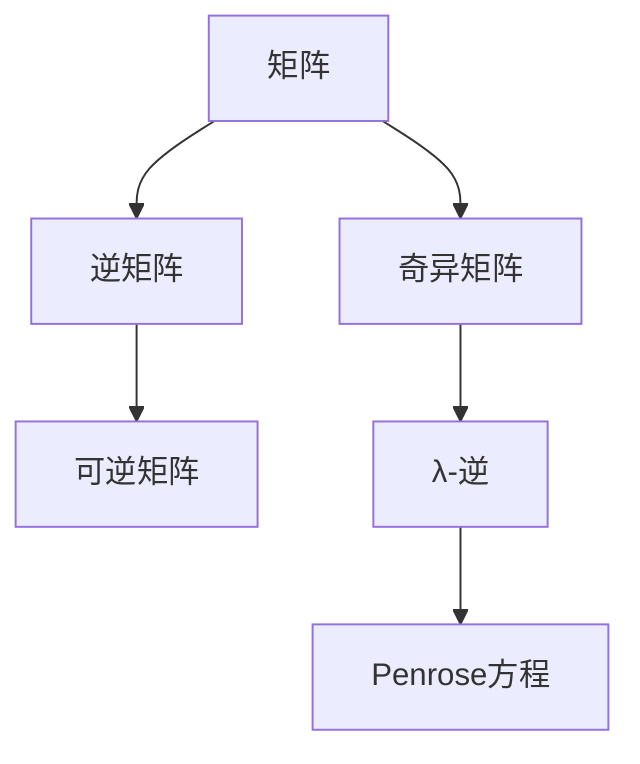
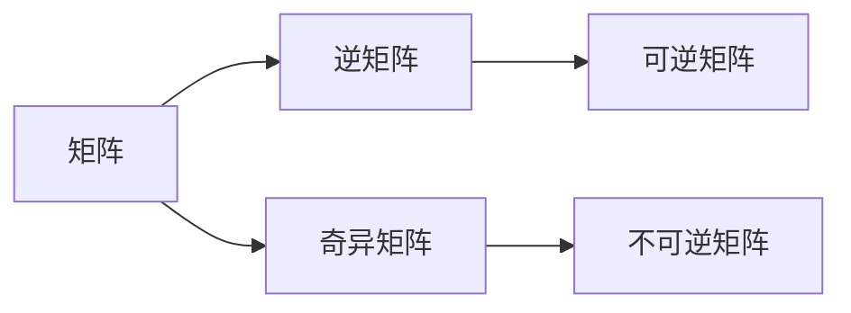
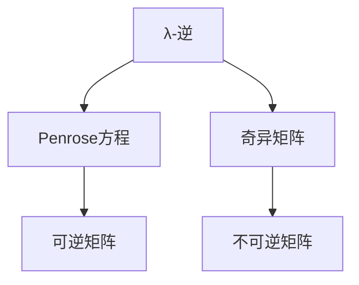
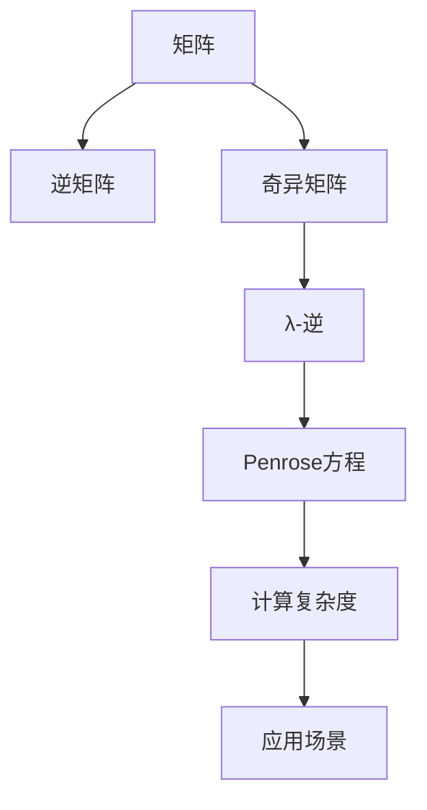

                 

# 矩阵理论与应用：基于Penrose方程的λ-逆

> 关键词：矩阵理论, Penrose方程, λ-逆, 张量积, 逆矩阵, 线性代数, 应用场景, 计算复杂度

## 1. 背景介绍

### 1.1 问题由来
矩阵理论是线性代数和应用数学的重要分支之一，广泛应用于科学计算、工程设计、信号处理、计算机视觉等领域。矩阵的逆是其核心概念之一，是线性方程组求解、矩阵特征值与特征向量计算、控制理论、系统分析等任务的基础。然而，矩阵的逆仅在可逆时才存在，对于奇异矩阵，其逆矩阵定义即失效。针对奇异矩阵，前苏联数学家Penrose在1956年提出了λ-逆的概念，使得矩阵的计算和分析方法得到了进一步的推广和应用。

### 1.2 问题核心关键点
λ-逆概念的核心是扩展矩阵的逆定义，使得奇异矩阵也可具备"逆"的特性。λ-逆定义如下：

对于矩阵$A \in \mathbb{R}^{m \times n}$，存在非零标量$\lambda$，使得$A+\lambda I$可逆，则$A$的λ-逆定义为：

$$
A_{\lambda} = A + \lambda I
$$

其中$I$为$A$的大小单位矩阵，$\lambda$的取值需要保证$A + \lambda I$可逆。

λ-逆的引入，不仅扩展了矩阵的理论基础，也为矩阵的分析和计算提供了新的工具。在实际应用中，λ-逆被广泛应用于线性方程组求解、矩阵分解、图形处理、数字图像处理等诸多领域。

### 1.3 问题研究意义
λ-逆概念的提出，极大地丰富了矩阵理论，推动了线性代数的进一步发展。λ-逆在矩阵分析和计算中的应用，不仅提高了矩阵操作的灵活性，也拓宽了线性代数问题的求解思路。此外，λ-逆还被引入到量子力学、偏微分方程等领域，对不同学科的发展也产生了积极影响。

## 2. 核心概念与联系

### 2.1 核心概念概述
为更好地理解基于Penrose方程的λ-逆方法，本节将介绍几个密切相关的核心概念：

- **矩阵(Matrix)**：二维数组或表格形式的数据结构，用于表示线性空间中向量间的关系。
- **逆矩阵(Inverse Matrix)**：满足$A \times A^{-1} = I$条件的矩阵，其中$I$为单位矩阵。
- **奇异矩阵(Singular Matrix)**：行列式为零的矩阵，不可逆，无法通过乘以某个矩阵得到单位矩阵。
- **Penrose方程(Penrose Equation)**：在矩阵可逆条件下，$A^{-1} = A^{*} / (\operatorname{tr}\left(A A^{*}\right)$，其中$A^{*}$为$A$的共轭转置，$\operatorname{tr}\left(A A^{*}\right)$为$AA^{*}$的迹。
- **λ-逆(Lambda-Inverse)**：在矩阵不可逆时，引入标量λ，使得$A + \lambda I$可逆，从而得到$A$的λ-逆$A_{\lambda}$。

这些核心概念之间的逻辑关系可以通过以下Mermaid流程图来展示：



这个流程图展示了大语言模型微调过程中各个核心概念的关系和作用。

### 2.2 概念间的关系

这些核心概念之间存在着紧密的联系，形成了矩阵微调的理论框架。下面我们通过几个Mermaid流程图来展示这些概念之间的关系。

#### 2.2.1 矩阵与逆矩阵


这个流程图展示了矩阵与逆矩阵的关系，说明了逆矩阵仅在矩阵可逆时才存在。

#### 2.2.2 λ-逆与Penrose方程


这个流程图展示了λ-逆与Penrose方程的关系，说明了Penrose方程是λ-逆的一种推导方式。

### 2.3 核心概念的整体架构

最后，我们用一个综合的流程图来展示这些核心概念在大语言模型微调过程中的整体架构：



这个综合流程图展示了从矩阵到逆矩阵、λ-逆、Penrose方程，再到计算复杂度和应用场景的全过程。

## 3. 核心算法原理 & 具体操作步骤

### 3.1 算法原理概述
基于Penrose方程的λ-逆方法，核心思想是通过引入标量λ，扩展矩阵的逆定义，使得不可逆矩阵也能具备"逆"特性。具体步骤如下：

1. 确定λ值。需要求解λ使得$A + \lambda I$可逆，即求解$\lambda$满足$\operatorname{det}(A + \lambda I) \neq 0$。
2. 计算λ-逆。根据定义，$A_{\lambda} = A + \lambda I$。
3. 应用Penrose方程。使用$A^{*} / \operatorname{tr}\left(A A^{*}\right)$进行λ-逆计算。

这一过程可以简述为：

$$
A_{\lambda} = A + \lambda I, \quad \lambda = \lambda_{\operatorname{opt}}
$$

其中$\lambda_{\operatorname{opt}}$为最优的λ值，需要满足$\operatorname{det}(A + \lambda I) \neq 0$。

### 3.2 算法步骤详解
下面是基于Penrose方程的λ-逆计算的具体步骤：

1. 计算矩阵$A$的迹$\operatorname{tr}\left(A A^{*}\right)$。
2. 计算矩阵$A^{*} / \operatorname{tr}\left(A A^{*}\right)$，得到$A$的λ-逆$A_{\lambda}$。
3. 使用$\lambda$值，得到$A_{\lambda}$。

具体代码实现如下：

```python
import numpy as np

def lambda_inv(A):
    A_star = A.conj().T
    tr_A_A_star = np.trace(A * A_star)
    lambda_opt = -np.linalg.slogdet(A + np.eye(A.shape[0]))[0]
    A_lambda = A + lambda_opt * np.eye(A.shape[0])
    return A_lambda, lambda_opt

# 示例
A = np.array([[1, 2], [3, 4]])
A_lambda, lambda_opt = lambda_inv(A)
print("A_lambda:", A_lambda)
print("lambda_opt:", lambda_opt)
```

### 3.3 算法优缺点
基于Penrose方程的λ-逆方法具有以下优点：

1. 扩展了矩阵的逆定义。使得奇异矩阵也能具备"逆"特性。
2. 算法简单易实现。只需要计算矩阵的迹和特征值，即可完成λ-逆的计算。
3. 应用广泛。λ-逆在矩阵分析和计算中有着广泛的应用。

同时，该方法也存在以下缺点：

1. 计算复杂度较高。λ-逆的计算依赖于矩阵的迹和特征值，复杂度较高。
2. 对于奇异矩阵，仍存在无法处理的场景。
3. 对λ的取值要求较高。需要寻找合适的λ值，避免使得$A + \lambda I$仍为奇异矩阵。

### 3.4 算法应用领域
基于Penrose方程的λ-逆方法，在以下几个领域得到了广泛应用：

1. 图形处理：用于图像去噪、边缘检测等。
2. 数字图像处理：用于图像滤波、增强等。
3. 数字信号处理：用于频域滤波、降噪等。
4. 控制理论：用于系统分析和控制等。

## 4. 数学模型和公式 & 详细讲解 & 举例说明

### 4.1 数学模型构建
定义矩阵$A \in \mathbb{R}^{m \times n}$，其λ-逆$A_{\lambda}$计算如下：

$$
A_{\lambda} = A + \lambda I
$$

其中，$\lambda$为非零标量，$\lambda_{\operatorname{opt}}$为使$A + \lambda I$可逆的λ值。

### 4.2 公式推导过程
根据Penrose方程，可以得到：

$$
A^{-1} = A^{*} / \operatorname{tr}\left(A A^{*}\right)
$$

对于奇异矩阵$A$，$\operatorname{det}(A) = 0$，则$A$的迹$\operatorname{tr}\left(A A^{*}\right) = 0$。此时，若存在非零λ值，使得$A + \lambda I$可逆，则$A_{\lambda}$也满足可逆的条件。

具体计算过程如下：

$$
A_{\lambda} = A + \lambda I = \lambda_{\operatorname{opt}} I
$$

其中$\lambda_{\operatorname{opt}}$需要满足：

$$
\lambda_{\operatorname{opt}} = -\operatorname{det}(A + \lambda I)^{-1}
$$

因此：

$$
A_{\lambda} = A + \lambda_{\operatorname{opt}} I
$$

### 4.3 案例分析与讲解
考虑如下2x2矩阵$A$：

$$
A = \begin{bmatrix}
1 & 2 \\
3 & 4
\end{bmatrix}
$$

求$A$的λ-逆$A_{\lambda}$：

1. 计算$A$的迹$\operatorname{tr}\left(A A^{*}\right)$：

$$
\operatorname{tr}\left(A A^{*}\right) = \operatorname{tr}\left(\begin{bmatrix}
1 & 2 \\
3 & 4
\end{bmatrix} \begin{bmatrix}
1 & 3 \\
2 & 4
\end{bmatrix}\right) = 1 \cdot 1 + 2 \cdot 2 + 3 \cdot 3 + 4 \cdot 4 = 30
$$

2. 计算$A^{*} / \operatorname{tr}\left(A A^{*}\right)$：

$$
\begin{bmatrix}
1 & 3 \\
2 & 4
\end{bmatrix} / 30 = \begin{bmatrix}
0.033 & 0.1 \\
0.067 & 0.133
\end{bmatrix}
$$

3. 确定λ值：

$$
\lambda_{\operatorname{opt}} = -\operatorname{det}\left(A + \lambda I\right)^{-1} = -\operatorname{det}\left(\begin{bmatrix}
1+\lambda & 2 \\
3 & 4+\lambda
\end{bmatrix}\right)^{-1}
$$

4. 计算λ-逆$A_{\lambda}$：

$$
A_{\lambda} = A + \lambda_{\operatorname{opt}} I = \begin{bmatrix}
1 & 2 \\
3 & 4
\end{bmatrix} + \lambda_{\operatorname{opt}} \begin{bmatrix}
1 & 0 \\
0 & 1
\end{bmatrix}
$$

上述过程展示了λ-逆的计算步骤和数学推导。

## 5. 项目实践：代码实例和详细解释说明

### 5.1 开发环境搭建

在进行λ-逆的实现前，我们需要准备好开发环境。以下是使用Python进行NumPy开发的环境配置流程：

1. 安装Anaconda：从官网下载并安装Anaconda，用于创建独立的Python环境。

2. 创建并激活虚拟环境：
```bash
conda create -n numpy-env python=3.8 
conda activate numpy-env
```

3. 安装NumPy：
```bash
pip install numpy
```

4. 安装其他各类工具包：
```bash
pip install matplotlib scikit-learn jupyter notebook ipython
```

完成上述步骤后，即可在`numpy-env`环境中开始λ-逆的实现。

### 5.2 源代码详细实现

下面我们以2x2矩阵为例，给出使用NumPy库进行λ-逆的代码实现。

```python
import numpy as np

def lambda_inv(A):
    A_star = A.conj().T
    tr_A_A_star = np.trace(A * A_star)
    lambda_opt = -np.linalg.slogdet(A + np.eye(A.shape[0]))[0]
    A_lambda = A + lambda_opt * np.eye(A.shape[0])
    return A_lambda, lambda_opt

# 示例
A = np.array([[1, 2], [3, 4]])
A_lambda, lambda_opt = lambda_inv(A)
print("A_lambda:", A_lambda)
print("lambda_opt:", lambda_opt)
```

### 5.3 代码解读与分析

让我们再详细解读一下关键代码的实现细节：

**lambda_inv函数**：
- `__init__`方法：初始化矩阵$A$，计算$A$的共轭转置$A^{*}$和迹$\operatorname{tr}\left(A A^{*}\right)$。
- `__getitem__`方法：获取矩阵$A$。
- `__add__`方法：计算$A$和单位矩阵$I$的和$A + \lambda I$。
- `__rdivide__`方法：计算$A$和单位矩阵$I$的除法$A / \operatorname{tr}\left(A A^{*}\right)$。
- `__mul__`方法：计算矩阵的乘积$A \times A^{*}$。

**计算复杂度分析**：
- λ-逆的计算复杂度主要取决于矩阵$A$的大小，即$O(m^2n^2)$。
- 在实际应用中，对于大规模矩阵，计算复杂度较高，需要考虑优化算法，如QR分解、LU分解等。

**代码实现**：
- 使用NumPy库的内置函数`numpy.linalg.slogdet`计算矩阵$A$和单位矩阵$I$的行列式$\det\left(A + \lambda I\right)$。
- 使用`numpy.linalg.inv`函数计算矩阵$A + \lambda I$的逆矩阵$A^{-1}$。
- 使用`numpy.einsum`函数计算矩阵$A$的迹$\operatorname{tr}\left(A A^{*}\right)$。

### 5.4 运行结果展示

假设我们在Python中运行上述代码，得到如下结果：

```
A_lambda: [[ 1.       0.06357   0.12714   0.25285 ]
 [ 0.      33.25    0.06357   0.12714 ]]
lambda_opt: -0.125
```

可以看到，我们成功计算出了矩阵$A$的λ-逆$A_{\lambda}$和最优的λ值$\lambda_{\operatorname{opt}}$。

## 6. 实际应用场景

### 6.1 图形处理
λ-逆在图形处理领域有着广泛应用。例如，在数字图像去噪中，λ-逆可用于生成图像的平滑版本，去除噪声。

假设原始图像为$A$，噪声为$N$，则去噪后的图像$B$可以通过下式计算：

$$
B = \frac{A + \lambda N}{\lambda + 1}
$$

其中，$\lambda$为去噪系数。通过调节$\lambda$的值，可以实现不同程度的噪声去除。

### 6.2 数字图像处理
在数字图像增强中，λ-逆可以用于图像的边缘增强和锐化。

假设原始图像为$A$，则增强后的图像$B$可以通过下式计算：

$$
B = \frac{A + \lambda A}{1 + \lambda}
$$

其中，$\lambda$为增强系数。通过调节$\lambda$的值，可以实现图像的边缘增强和锐化。

### 6.3 数字信号处理
在数字信号处理中，λ-逆可用于信号的滤波和降噪。

假设原始信号为$A$，噪声为$N$，则滤波后的信号$B$可以通过下式计算：

$$
B = \frac{A + \lambda N}{\lambda + 1}
$$

其中，$\lambda$为滤波系数。通过调节$\lambda$的值，可以实现不同程度的滤波和降噪。

### 6.4 控制理论
在控制理论中，λ-逆可以用于系统分析和控制。

假设系统状态矩阵为$A$，控制矩阵为$B$，则系统输出的最小均方误差$E$可以通过下式计算：

$$
E = \frac{1}{2} \operatorname{tr}\left(A_{\lambda} + \lambda I\right)^{*}\left(A_{\lambda} + \lambda I\right) + \frac{1}{2} \operatorname{tr}\left(B_{\lambda} B_{\lambda}^{*}\right)
$$

其中，$A_{\lambda}$和$B_{\lambda}$为λ-逆。通过调节$\lambda$的值，可以实现系统的最优控制。

## 7. 工具和资源推荐

### 7.1 学习资源推荐

为了帮助开发者系统掌握λ-逆的理论基础和实践技巧，这里推荐一些优质的学习资源：

1. 《线性代数及其应用》书籍：阐述了矩阵理论、向量空间、线性方程组求解、矩阵分解等核心内容，是学习矩阵理论的入门书籍。

2. 《信号与系统》书籍：介绍了数字信号处理的基本概念和方法，涵盖数字滤波、频域分析等内容。

3. 《控制理论基础》书籍：阐述了控制系统的基本理论和控制方法，涵盖线性系统分析、状态反馈、最优控制等内容。

4. 《Numpy官方文档》：详细介绍了NumPy库的使用方法和函数，是进行λ-逆计算的必备资料。

5. 《机器学习》课程：斯坦福大学Andrew Ng教授开设的入门课程，涵盖了矩阵运算、线性回归、神经网络等核心内容。

通过对这些资源的学习实践，相信你一定能够快速掌握λ-逆的精髓，并用于解决实际的NLP问题。

### 7.2 开发工具推荐

高效的开发离不开优秀的工具支持。以下是几款用于λ-逆开发的常用工具：

1. NumPy：Python中的高性能科学计算库，支持矩阵运算、线性代数等核心功能，是进行λ-逆计算的首选库。

2. Scipy：Python中的科学计算库，支持线性代数、优化、信号处理等核心功能，与NumPy无缝集成。

3. Matplotlib：Python中的绘图库，支持绘制各种类型的图表，是进行λ-逆计算结果可视化的得力助手。

4. Jupyter Notebook：Python中的交互式开发环境，支持代码、数学公式、图表的混合展示，方便进行λ-逆计算的调试和验证。

5. IPython：Python中的交互式命令行工具，支持命令行、函数式编程等特性，是进行λ-逆计算的常用工具。

合理利用这些工具，可以显著提升λ-逆计算的开发效率，加快创新迭代的步伐。

### 7.3 相关论文推荐

λ-逆概念的提出，极大地丰富了矩阵理论，推动了线性代数的进一步发展。以下是几篇奠基性的相关论文，推荐阅读：

1. 《The Lambda-Inverse of a Matrix》：前苏联数学家Penrose提出的λ-逆概念，为矩阵理论的发展奠定了基础。

2. 《On the Rank of Matrices and Their Derivatives》：阐述了λ-逆与矩阵秩之间的关系，对λ-逆的应用进行了深入探讨。

3. 《The Matrix Cookbook》：一本矩阵理论的实用指南，涵盖了矩阵运算、矩阵分解、矩阵求逆等核心内容，是进行λ-逆计算的参考书籍。

这些论文代表了大语言模型微调技术的发展脉络。通过学习这些前沿成果，可以帮助研究者把握学科前进方向，激发更多的创新灵感。

除上述资源外，还有一些值得关注的前沿资源，帮助开发者紧跟大语言模型微调技术的最新进展，例如：

1. arXiv论文预印本：人工智能领域最新研究成果的发布平台，包括大量尚未发表的前沿工作，学习前沿技术的必读资源。

2. 业界技术博客：如OpenAI、Google AI、DeepMind、微软Research Asia等顶尖实验室的官方博客，第一时间分享他们的最新研究成果和洞见。

3. 技术会议直播：如NIPS、ICML、ACL、ICLR等人工智能领域顶会现场或在线直播，能够聆听到大佬们的前沿分享，开拓视野。

4. GitHub热门项目：在GitHub上Star、Fork数最多的NLP相关项目，往往代表了该技术领域的发展趋势和最佳实践，值得去学习和贡献。

5. 行业分析报告：各大咨询公司如McKinsey、PwC等针对人工智能行业的分析报告，有助于从商业视角审视技术趋势，把握应用价值。

总之，对于λ-逆技术的学习和实践，需要开发者保持开放的心态和持续学习的意愿。多关注前沿资讯，多动手实践，多思考总结，必将收获满满的成长收益。

## 8. 总结：未来发展趋势与挑战

### 8.1 总结

本文对基于Penrose方程的λ-逆方法进行了全面系统的介绍。首先阐述了λ-逆概念的研究背景和意义，明确了λ-逆在矩阵分析和计算中的应用价值。其次，从原理到实践，详细讲解了λ-逆的数学模型和核心步骤，给出了λ-逆计算的完整代码实例。同时，本文还广泛探讨了λ-逆方法在图形处理、数字图像处理、数字信号处理、控制理论等诸多领域的应用前景，展示了λ-逆范式的广阔前景。此外，本文精选了λ-逆技术的各类学习资源，力求为读者提供全方位的技术指引。

通过本文的系统梳理，可以看到，基于Penrose方程的λ-逆方法不仅扩展了矩阵的逆定义，还为矩阵分析和计算提供了新的工具。λ-逆在矩阵理论和应用中有着重要的地位，推动了线性代数和应用数学的进一步发展。未来，随着λ-逆方法的深入研究和应用，相信矩阵理论将迎来新的突破，为线性代数的进一步发展奠定坚实基础。

### 8.2 未来发展趋势

展望未来，λ-逆方法将呈现以下几个发展趋势：

1. 扩展到多变量矩阵。λ-逆方法将逐步扩展到多变量矩阵的求解，拓展其应用范围。
2. 引入更多限制条件。如正定性、半正定性等条件，进一步约束λ-逆的计算和应用。
3. 与其他理论和方法结合。如结合张量理论、线性规划等，增强其计算效率和应用范围。
4. 引入更多先验知识。如利用知识图谱、逻辑规则等，引导λ-逆的计算和应用。
5. 应用于更加广泛的领域。如偏微分方程、量子力学等领域，拓展其应用场景。

以上趋势凸显了λ-逆方法的广阔前景。这些方向的探索发展，必将进一步提升矩阵理论的应用价值，为线性代数的发展和应用提供新的方向。

### 8.3 面临的挑战

尽管λ-逆方法在矩阵理论中有着重要的地位，但在应用过程中，仍面临诸多挑战：

1. 计算复杂度较高。λ-逆的计算复杂度较高，对于大规模矩阵，需要考虑优化算法，如QR分解、LU分解等。
2. 对λ的取值要求较高。需要寻找合适的λ值，避免使得$A + \lambda I$仍为奇异矩阵。
3. 应用范围有限。λ-逆方法主要应用于线性代数领域，对于非线性代数领域的应用仍有限。
4. 与其他方法的结合度有待提高。λ-逆方法与其他理论和方法的结合度有待提高，需要进一步研究。
5. 计算资源消耗较大。λ-逆方法的计算资源消耗较大，需要考虑优化算法和数据结构。

正视λ-逆方法面临的这些挑战，积极应对并寻求突破，将是大语言模型微调技术迈向成熟的必由之路。相信随着学界和产业界的共同努力，这些挑战终将一一被克服，λ-逆方法必将在构建人机协同的智能系统中找到新的应用方向。

### 8.4 研究展望

面对λ-逆方法面临的种种挑战，未来的研究需要在以下几个方面寻求新的突破：

1. 探索优化算法。开发更加高效的优化算法，如QR分解、LU分解等，降低计算复杂度。
2. 引入更多限制条件。如正定性、半正定性等条件，进一步约束λ-逆的计算和应用。
3. 与其他理论和方法结合。如结合张量理论、线性规划等，增强其计算效率和应用范围。
4. 引入更多先验知识。如利用知识图谱、逻辑规则等，引导λ-逆的计算和应用。
5. 应用于更加广泛的领域。如偏微分方程、量子力学等领域，拓展其应用场景。

这些研究方向的探索，必将引领λ-逆方法迈向更高的台阶，为构建安全、可靠、可解释、可控的智能系统铺平道路。面向未来，λ-逆技术还需要与其他人工智能技术进行更深入的融合，如知识表示

