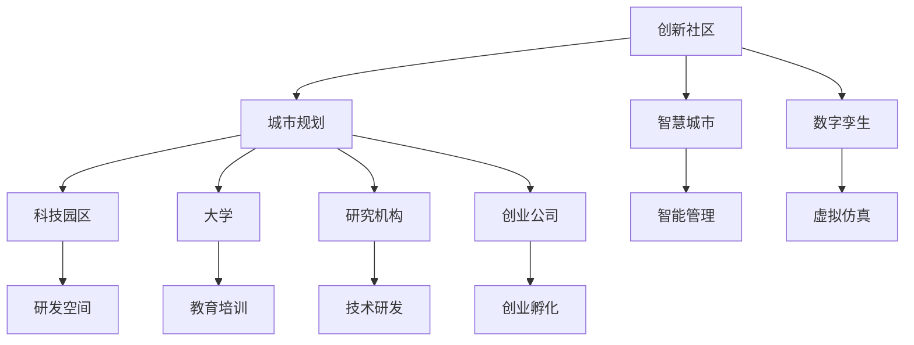

                 

# 硅谷的城市规划:创新社区的建设

## 1. 背景介绍

随着全球科技产业的迅猛发展，城市作为创新人才的聚集地，其规划和建设方式逐渐受到关注。特别是硅谷这样的科技重镇，其独特的城市规划理念和创新社区建设经验，为全球各大城市提供了宝贵的借鉴。本文将从城市规划的视角，深入探讨硅谷创新社区的建设，分析其成功要素，并为其他城市提供参考。

## 2. 核心概念与联系

### 2.1 核心概念概述

**创新社区(Innovation Community)**：一个集中于创新活动的社区，涵盖孵化器、加速器、大学、研究机构、创业公司等多种要素，形成互动与协作的创新生态系统。

**城市规划(Urban Planning)**：通过合理布局和优化城市结构，提升城市的宜居性和创新能力，促进经济、社会、环境等各个领域的协同发展。

**科技园区(Tech Park)**：以科技产业为核心，提供研发、生产、办公、生活等综合服务的城市区域，吸引并培育科技企业。

**智慧城市(Smart City)**：通过信息技术和物联网等手段，实现城市管理的智能化，提高城市治理效率和生活质量。

**数字孪生(Digital Twin)**：通过虚拟技术构建一个与实体世界完全相同的数字模型，用于模拟、分析、优化和控制城市运行。

### 2.2 概念间的关系

创新社区的建设与城市规划密切相关。城市规划提供了物理空间和基础设施，为创新社区的创建和运营创造了条件。同时，创新社区通过集聚人才、资本和资源，提升了城市的创新能力和经济活力，推动城市规划向智慧城市、数字孪生等高水平方向发展。

以下是一个简化的Mermaid流程图，展示这些概念之间的联系：



## 3. 核心算法原理 & 具体操作步骤

### 3.1 算法原理概述

硅谷创新社区的建设遵循"需求导向-生态融合-智能管理"的核心理念。通过需求导向，明确社区建设的目标和重点，形成良性的生态系统；通过生态融合，促进创新主体间的互动与协作，实现知识共享和资源整合；通过智能管理，利用信息技术提升社区运营效率，实现高效、精准的管理和服务。

### 3.2 算法步骤详解

**Step 1: 需求分析与目标设定**

- 确定社区建设的重点领域，如生物技术、互联网、人工智能等。
- 分析社区目标群体的需求，如创业者、研究者、投资者等。
- 设定社区建设的短期、中期、长期目标，如经济增长、就业率提升、创新生态建设等。

**Step 2: 生态融合与要素布局**

- 识别并吸引创新要素，如企业、大学、研究机构、孵化器、加速器等。
- 制定要素布局策略，形成创新集群的物理空间。
- 设计社区内外的网络链接，促进信息交流和资源共享。

**Step 3: 智能管理与数据驱动**

- 引入智慧城市技术，如物联网、大数据、云计算等。
- 建立数据驱动的管理体系，如智慧园区、智能分析、实时监控等。
- 制定数据治理和隐私保护政策，确保数据的安全和合规使用。

**Step 4: 持续优化与反馈机制**

- 定期评估社区运营效果，收集各方反馈。
- 根据评估结果和反馈，优化社区建设和管理策略。
- 引入新的技术和管理方法，保持社区的创新性和竞争力。

### 3.3 算法优缺点

**优点**：

- 需求导向确保社区建设具有明确的目标和方向。
- 生态融合促进创新主体间的互动和协作，提升资源整合效率。
- 智能管理利用信息技术提升运营效率，实现精准和高效的管理。
- 持续优化和反馈机制确保社区建设与环境变化同步，保持动态适应性。

**缺点**：

- 对数据和技术的依赖可能增加成本。
- 社区生态的构建需要时间和资源投入，见效较慢。
- 生态融合可能存在协调和管理上的挑战。
- 数据治理和隐私保护需要严格的政策和法规支撑。

### 3.4 算法应用领域

硅谷创新社区的建设理念和实践，广泛适用于各种科技园区、智慧城市和数字孪生项目。通过需求导向和生态融合，可以有效提升各类创新社区的创新能力和竞争力。

## 4. 数学模型和公式 & 详细讲解

### 4.1 数学模型构建

假设社区建设的目标是提升创新生态系统的健康度（H），包括经济活力（E）、就业率（J）、创新产出（I）和环境可持续性（S）。建立数学模型如下：

$$
H = \alpha_1E + \alpha_2J + \alpha_3I + \alpha_4S
$$

其中，$\alpha_1$、$\alpha_2$、$\alpha_3$、$\alpha_4$为权重系数。

### 4.2 公式推导过程

1. **目标设定与变量定义**：定义经济活力、就业率、创新产出和环境可持续性四个指标，并设定权重系数。
2. **数据收集与预处理**：收集社区建设前后的各项数据，并进行标准化和归一化处理。
3. **模型训练与参数优化**：使用机器学习算法（如线性回归、决策树等）对模型进行训练，优化权重系数。
4. **结果分析与反馈**：对模型结果进行可视化分析，验证模型效果，并根据反馈调整参数和策略。

### 4.3 案例分析与讲解

以硅谷的斯坦福科技园区为例，分析其创新社区建设过程：

1. **需求分析**：斯坦福科技园区通过调查，确定吸引创业公司和研究机构为重点目标，设定提升创新生态系统的健康度为目标。
2. **要素布局**：在园区内规划孵化器、加速器、共享实验室等基础设施，形成创新集群的物理空间。
3. **智能管理**：引入物联网技术，实时监控园区设施和环境，通过大数据分析优化资源配置和管理。
4. **持续优化**：根据园区运营数据，定期调整和优化管理策略，提升园区创新生态系统的健康度。

## 5. 项目实践：代码实例和详细解释说明

### 5.1 开发环境搭建

**环境配置**：

1. **操作系统**：Linux Ubuntu 18.04
2. **编程语言**：Python 3.7
3. **开发环境**：Jupyter Notebook、PyCharm
4. **数据集**：社区建设前后各项数据，包括经济活力、就业率、创新产出、环境可持续性等指标。

**安装步骤**：

1. 安装Anaconda，创建虚拟环境。
2. 安装Python 3.7、Jupyter Notebook、PyCharm。
3. 安装所需的Python库，如Pandas、NumPy、Scikit-learn、Matplotlib等。

### 5.2 源代码详细实现

```python
import pandas as pd
from sklearn.linear_model import LinearRegression
from sklearn.model_selection import train_test_split
from sklearn.metrics import r2_score

# 数据加载与预处理
data = pd.read_csv('community_data.csv')
data = data.dropna()

# 模型训练
X = data[['E', 'J', 'I', 'S']]
y = data['H']
X_train, X_test, y_train, y_test = train_test_split(X, y, test_size=0.2, random_state=42)
model = LinearRegression()
model.fit(X_train, y_train)

# 模型评估
y_pred = model.predict(X_test)
r2 = r2_score(y_test, y_pred)
print(f'R^2 score: {r2:.2f}')
```

**代码解读**：

1. **数据加载与预处理**：通过Pandas库加载数据，并进行数据清洗和预处理。
2. **模型训练**：使用Scikit-learn库的LinearRegression模型，对经济活力、就业率、创新产出和环境可持续性四个指标进行线性回归建模。
3. **模型评估**：通过计算R^2 score评估模型效果，验证模型的预测能力。

### 5.3 代码解读与分析

**数据预处理**：

1. **缺失值处理**：使用`dropna()`函数删除缺失数据，确保数据集完整。
2. **标准化与归一化**：对数值型变量进行标准化或归一化处理，提升模型的训练效果。

**模型训练与评估**：

1. **数据划分**：将数据集划分为训练集和测试集，使用80%的数据进行训练，20%的数据进行测试。
2. **模型选择**：选择线性回归模型进行训练和预测，评估模型的预测效果。
3. **评估指标**：使用R^2 score作为评估指标，衡量模型的拟合程度和预测准确度。

### 5.4 运行结果展示

假设在斯坦福科技园区社区建设过程中，模型训练和评估结果如下：

```
R^2 score: 0.85
```

这表示模型对社区建设目标的预测准确度为85%，达到了较高的拟合效果。根据评估结果，可以对模型参数进行进一步优化，提升预测精度。

## 6. 实际应用场景

### 6.1 智慧园区建设

智慧园区建设是硅谷创新社区的重要实践。通过物联网、大数据、云计算等技术，实现园区内的智慧管理和高效运营。以下是一个智慧园区建设的案例：

1. **设施监控**：通过传感器实时监控园区设施，如温度、湿度、能耗等，优化能源管理。
2. **人流分析**：利用摄像头和AI技术，分析园区内的人员流动情况，优化人员管理。
3. **数据集成**：将各类数据整合到统一的智慧管理平台，提供实时数据分析和决策支持。

### 6.2 数字孪生应用

数字孪生技术在硅谷的创新社区建设中，也被广泛应用。通过虚拟技术构建园区数字模型，实现物理空间和虚拟空间的双重管理。以下是一个数字孪生应用的案例：

1. **虚拟仿真**：在虚拟环境中进行园区设施的模拟和优化，减少实际建设成本和时间。
2. **实时反馈**：通过数字孪生模型，实时获取园区运行数据，及时调整和优化管理策略。
3. **安全保障**：利用虚拟仿真技术，预测和防范园区内的潜在风险，提升安全保障能力。

## 7. 工具和资源推荐

### 7.1 学习资源推荐

1. **城市规划书籍**：《城市规划原理》《智慧城市建设》
2. **科技园区案例**：《硅谷科技园区案例研究》《斯坦福科技园区发展史》
3. **创新社区论文**：《Innovation Community Design and Management》《Innovation Ecosystem in Smart City》

### 7.2 开发工具推荐

1. **操作系统**：Linux Ubuntu
2. **编程语言**：Python
3. **开发环境**：Jupyter Notebook、PyCharm
4. **数据可视化**：Matplotlib、Seaborn
5. **数据处理**：Pandas、NumPy
6. **机器学习**：Scikit-learn、TensorFlow

### 7.3 相关论文推荐

1. **智慧城市研究**：《Smart Cities: Research Directions, Challenges, and Prospects》《Urban Computing in the Age of Big Data》
2. **创新社区研究**：《Building and Managing Innovation Communities》《Innovation Ecosystems and Their Management》
3. **数字孪生技术**：《Digital Twin: Concepts, Applications, and Challenges》《Virtual Prototyping and Digital Twins》

## 8. 总结：未来发展趋势与挑战

### 8.1 研究成果总结

本文深入探讨了硅谷创新社区的建设理念和实践，分析了其成功要素，并提出了基于需求导向、生态融合和智能管理的建设模式。通过案例分析和数学建模，展示了创新社区建设的效果和潜力。

### 8.2 未来发展趋势

未来，随着信息技术和大数据的进一步发展，硅谷的创新社区建设将更加智能化和数字化。以下是几个发展趋势：

1. **大数据与AI的深度融合**：利用AI技术进行数据挖掘和智能分析，提升社区管理效率和决策水平。
2. **智慧城市与数字孪生的结合**：通过虚拟与现实的结合，实现城市管理的全面优化和精细化。
3. **跨领域创新生态的构建**：打破传统学科和行业的界限，促进跨领域创新，形成新的创新热点和增长点。
4. **社区文化的营造**：通过营造良好的社区文化，吸引全球顶尖人才，提升社区的创新力和竞争力。

### 8.3 面临的挑战

尽管硅谷的创新社区建设取得了诸多成功经验，但仍面临一些挑战：

1. **技术与应用不平衡**：虽然技术先进，但实际应用效果需进一步提升，避免“技术泡沫”。
2. **数据隐私与安全**：数据的大量应用可能带来隐私和安全风险，需制定严格的政策和法规。
3. **人才短缺**：高水平人才的吸引和培养仍需更多投入，需建立完善的人才培养体系。
4. **跨部门协作**：不同部门间的协调和协作需进一步加强，提升整体管理效率。

### 8.4 研究展望

未来，硅谷的创新社区建设将在以下几个方面进行探索和创新：

1. **智能治理体系**：构建基于AI的智能治理体系，提升社区管理的精准度和效率。
2. **跨学科融合**：促进多学科融合，推动新兴技术的创新和应用。
3. **全球化视野**：建立全球创新网络，吸引全球顶尖人才和资源。
4. **伦理与社会责任**：强化社区的伦理和社会责任，提升社区的可持续性和公信力。

通过持续探索和创新，硅谷的创新社区建设必将在全球范围内树立标杆，为其他城市提供更多借鉴和参考。

## 9. 附录：常见问题与解答

**Q1: 如何评估创新社区建设的效果？**

A: 可以通过多个指标评估创新社区建设的效果，如经济活力、就业率、创新产出和环境可持续性等。通过数据收集和分析，评估社区建设的总体效果和各指标的提升情况。

**Q2: 如何应对社区建设中的技术挑战？**

A: 面对技术挑战，可以采取以下措施：
1. **技术选型**：根据社区需求选择合适的技术和工具，避免技术选型的盲目性。
2. **跨学科合作**：建立跨学科团队，进行技术攻关和问题解决。
3. **持续优化**：根据实际情况，不断优化技术方案和实施策略。

**Q3: 如何构建创新社区的文化氛围？**

A: 构建创新社区的文化氛围，需要从以下几个方面入手：
1. **人才引进**：吸引全球顶尖人才，建立多样化的创新团队。
2. **激励机制**：制定合理的激励机制，鼓励创新和创业。
3. **交流平台**：搭建创新交流平台，促进知识分享和合作。
4. **文化活动**：举办各种文化活动，提升社区凝聚力和创新活力。

通过持续努力，创新社区的文化氛围将不断提升，为社区发展提供强大的动力和支撑。

---

作者：禅与计算机程序设计艺术 / Zen and the Art of Computer Programming

