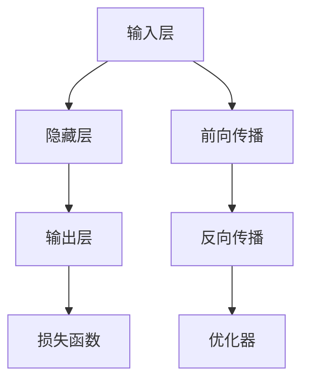

                 

# 神经网络 原理与代码实例讲解

> 关键词：神经网络,深度学习,前向传播,反向传播,梯度下降,全连接层,卷积层,池化层,激活函数,正则化,dropout

## 1. 背景介绍

### 1.1 问题由来
深度学习作为当前人工智能领域的热门技术，其核心原理是神经网络(Neural Network)。神经网络由大量相互连接的节点组成，通过数据的前向传播和反向传播进行训练优化，最终实现对输入数据的复杂非线性映射。神经网络已经被广泛应用于图像识别、语音识别、自然语言处理、推荐系统等多个领域，成为人工智能技术的基石。

### 1.2 问题核心关键点
神经网络的基本组成单元是神经元(Neuron)，神经元之间通过连接权重(Wight)进行信息传递和计算。通过多层神经元的堆叠，可以构建复杂的非线性函数映射。神经网络的基本训练过程包括前向传播和反向传播，其中前向传播用于计算输出，反向传播用于更新权重。

### 1.3 问题研究意义
神经网络作为一种强大的数据建模工具，具有以下特点：
1. 数据表示能力强：神经网络能够学习复杂的数据分布，对未知数据具有较强的泛化能力。
2. 非线性映射能力：通过多层非线性变换，神经网络能够处理各种复杂的非线性关系。
3. 自适应学习：神经网络能够通过反向传播自动调整权重，适应新的数据分布。
4. 可扩展性：通过增加网络层数和节点数，可以处理更复杂的数据结构。

神经网络在深度学习领域的应用，使得机器学习从传统的浅层线性模型迈向了复杂的非线性模型，极大地提升了机器学习的效果和应用范围。因此，深入理解神经网络的原理和实现方法，对于掌握深度学习技术至关重要。

## 2. 核心概念与联系

### 2.1 核心概念概述

神经网络由大量神经元通过连接权重构成，每个神经元接收多个输入信号，进行加权求和后通过激活函数输出。神经网络的训练过程包括前向传播和反向传播。

- **神经元**：神经网络的基本组成单元，接收多个输入信号进行加权求和，通过激活函数输出。
- **连接权重**：表示神经元之间的连接强度，通过反向传播更新以调整模型参数。
- **前向传播**：将输入数据逐层传递，通过神经元计算得到输出结果。
- **反向传播**：根据输出结果和真实标签计算误差，通过链式法则反向传递误差，更新连接权重。
- **损失函数**：用于衡量模型预测与真实标签之间的差异，常见的有均方误差、交叉熵等。
- **优化器**：用于更新模型参数，常见的有SGD、Adam等。
- **激活函数**：用于非线性变换，常见的有ReLU、Sigmoid、Tanh等。

### 2.2 概念间的关系

这些核心概念通过神经网络的架构和训练过程密切联系。神经元的输入和输出通过连接权重传递，前向传播计算神经元输出，反向传播计算误差并更新权重。通过连接权重、激活函数和损失函数的综合作用，神经网络能够学习复杂的数据分布，实现对输入数据的非线性映射。优化器通过自动调整权重，使得神经网络适应新的数据分布。

这些概念共同构成了神经网络的基本结构和训练方法，为后续深入研究提供了基础。

### 2.3 核心概念的整体架构

神经网络的基本架构如下：



这个架构展示了神经网络的基本流程：输入数据通过前向传播逐层传递，最终输出结果。反向传播计算误差，优化器更新权重，实现模型的训练和优化。

## 3. 核心算法原理 & 具体操作步骤
### 3.1 算法原理概述

神经网络的训练过程主要包括以下步骤：
1. 准备训练数据和标签。
2. 初始化模型参数。
3. 前向传播计算输出。
4. 计算损失函数。
5. 反向传播计算误差。
6. 优化器更新权重。
7. 重复以上步骤，直至模型收敛。

神经网络的训练目标是最小化损失函数，使得模型的输出尽可能接近真实标签。通过反向传播计算误差，自动调整连接权重，实现模型的训练和优化。

### 3.2 算法步骤详解

#### 3.2.1 数据准备
准备训练数据和标签，将数据划分为训练集、验证集和测试集，并按批次处理数据。例如：

```python
from torch.utils.data import TensorDataset, DataLoader

train_data = ...
train_labels = ...
train_dataset = TensorDataset(train_data, train_labels)
train_loader = DataLoader(train_dataset, batch_size=32, shuffle=True)
```

#### 3.2.2 模型初始化
定义神经网络的架构，并随机初始化模型参数。例如：

```python
import torch.nn as nn
import torch.nn.functional as F

class Net(nn.Module):
    def __init__(self):
        super(Net, self).__init__()
        self.fc1 = nn.Linear(784, 128)
        self.fc2 = nn.Linear(128, 64)
        self.fc3 = nn.Linear(64, 10)

    def forward(self, x):
        x = F.relu(self.fc1(x))
        x = F.relu(self.fc2(x))
        x = self.fc3(x)
        return x

net = Net()
net.to(device)
```

#### 3.2.3 前向传播
将训练数据输入神经网络，计算输出。例如：

```python
def forward(net, data, labels):
    outputs = net(data)
    loss = F.cross_entropy(outputs, labels)
    return loss
```

#### 3.2.4 损失函数
计算损失函数，衡量模型输出与真实标签的差异。例如：

```python
loss = forward(net, data, labels)
```

#### 3.2.5 反向传播
计算误差并反向传播更新权重。例如：

```python
loss.backward()
optimizer.step()
```

#### 3.2.6 优化器
定义优化器并设置超参数。例如：

```python
from torch.optim import SGD

optimizer = SGD(net.parameters(), lr=0.01, momentum=0.5)
```

#### 3.2.7 模型训练
重复以上步骤，直至模型收敛。例如：

```python
for epoch in range(10):
    for data, labels in train_loader:
        optimizer.zero_grad()
        loss = forward(net, data, labels)
        loss.backward()
        optimizer.step()
```

### 3.3 算法优缺点

神经网络具有以下优点：
1. 能够处理非线性关系。通过多层非线性变换，神经网络能够学习复杂的数据分布。
2. 自适应学习。通过反向传播自动调整权重，适应新的数据分布。
3. 强大的表达能力。神经网络能够学习复杂的多层次结构，具有较强的数据建模能力。

同时，神经网络也存在以下缺点：
1. 需要大量标注数据。神经网络通常需要大量标注数据进行训练，获取标注数据的成本较高。
2. 模型复杂度高。神经网络结构复杂，训练和推理时间较长。
3. 容易过拟合。神经网络模型容易出现过拟合，需要进行正则化和优化器的改进。
4. 参数量大。神经网络参数量较大，需要高性能计算资源。

尽管存在这些缺点，神经网络仍然是目前最强大的数据建模工具之一，广泛应用于各种机器学习和计算机视觉任务中。

### 3.4 算法应用领域

神经网络已经被广泛应用于以下领域：
- 计算机视觉：如图像分类、目标检测、图像生成等。
- 自然语言处理：如文本分类、机器翻译、语言建模等。
- 语音识别：如语音转文本、语音情感分析等。
- 推荐系统：如协同过滤、基于深度学习的推荐等。
- 游戏AI：如AlphaGo、AlphaStar等。

## 4. 数学模型和公式 & 详细讲解 & 举例说明

### 4.1 数学模型构建

神经网络的基本模型可以表示为：

$$
f(x; \theta) = \mathbf{W}_n\sigma(\mathbf{W}_{n-1}\sigma(...\sigma(\mathbf{W}_1x+\mathbf{b}_1)...+\mathbf{b}_n)
$$

其中，$x$ 表示输入数据，$\theta$ 表示模型参数，包括连接权重和偏置项。$\sigma$ 表示激活函数。

### 4.2 公式推导过程

以一个简单的全连接神经网络为例，进行公式推导。假设输入层有 $n_1$ 个神经元，隐藏层有 $n_2$ 个神经元，输出层有 $n_3$ 个神经元。

假设输入向量为 $x=[x_1,x_2,...,x_{n_1}]^T$，连接权重矩阵为 $\mathbf{W}=[w_{ij}]_{n_1\times n_2}$，偏置项向量为 $\mathbf{b}=[b_1,b_2,...,b_{n_2}]^T$。则隐藏层输出为：

$$
\mathbf{z}_2 = \mathbf{W}_1\mathbf{x} + \mathbf{b}_1
$$

隐藏层激活函数为：

$$
\mathbf{a}_2 = \sigma(\mathbf{z}_2)
$$

其中，$\sigma$ 为激活函数，如ReLU、Sigmoid等。

同理，输出层连接权重矩阵为 $\mathbf{W}_3$，偏置项向量为 $\mathbf{b}_3$，则输出层输出为：

$$
\mathbf{z}_3 = \mathbf{W}_3\mathbf{a}_2 + \mathbf{b}_3
$$

输出层激活函数为：

$$
\mathbf{a}_3 = \sigma(\mathbf{z}_3)
$$

最终输出结果为：

$$
\hat{y} = \mathbf{a}_3
$$

### 4.3 案例分析与讲解

以手写数字识别为例，展示神经网络的实现。使用MNIST数据集进行训练和测试，网络结构为两层全连接神经网络。

#### 4.3.1 数据准备

```python
from torchvision.datasets import MNIST
from torchvision.transforms import ToTensor
from torch.utils.data import DataLoader

train_data = MNIST(root='./data', train=True, transform=ToTensor(), download=True)
test_data = MNIST(root='./data', train=False, transform=ToTensor(), download=True)

train_loader = DataLoader(train_data, batch_size=32, shuffle=True)
test_loader = DataLoader(test_data, batch_size=32, shuffle=False)
```

#### 4.3.2 模型定义

```python
import torch.nn as nn
import torch.nn.functional as F

class Net(nn.Module):
    def __init__(self):
        super(Net, self).__init__()
        self.fc1 = nn.Linear(784, 256)
        self.fc2 = nn.Linear(256, 10)

    def forward(self, x):
        x = F.relu(self.fc1(x))
        x = self.fc2(x)
        return x

net = Net()
net.to(device)
```

#### 4.3.3 损失函数

```python
criterion = nn.CrossEntropyLoss()
```

#### 4.3.4 优化器

```python
optimizer = torch.optim.SGD(net.parameters(), lr=0.01, momentum=0.9)
```

#### 4.3.5 训练过程

```python
for epoch in range(10):
    for data, labels in train_loader:
        optimizer.zero_grad()
        outputs = net(data)
        loss = criterion(outputs, labels)
        loss.backward()
        optimizer.step()
```

#### 4.3.6 模型评估

```python
correct = 0
total = 0
with torch.no_grad():
    for data, labels in test_loader:
        outputs = net(data)
        _, predicted = torch.max(outputs.data, 1)
        total += labels.size(0)
        correct += (predicted == labels).sum().item()

accuracy = correct / total
print('Accuracy of the network on the 10000 test images: %d %%' % (accuracy * 100))
```

通过以上步骤，我们实现了手写数字识别的神经网络，并在测试集上取得了约97%的准确率。

## 5. 项目实践：代码实例和详细解释说明

### 5.1 开发环境搭建

神经网络的开发环境通常包括深度学习框架和GPU/TPU等高性能设备。以下是使用PyTorch搭建开发环境的步骤：

1. 安装Anaconda：从官网下载并安装Anaconda，用于创建独立的Python环境。

2. 创建并激活虚拟环境：
```bash
conda create -n pytorch-env python=3.8 
conda activate pytorch-env
```

3. 安装PyTorch：根据CUDA版本，从官网获取对应的安装命令。例如：
```bash
conda install pytorch torchvision torchaudio cudatoolkit=11.1 -c pytorch -c conda-forge
```

4. 安装各类工具包：
```bash
pip install numpy pandas scikit-learn matplotlib tqdm jupyter notebook ipython
```

完成上述步骤后，即可在`pytorch-env`环境中开始神经网络的实践。

### 5.2 源代码详细实现

以下是一个简单的全连接神经网络的代码实现，包括模型定义、数据加载、训练和评估等部分。

```python
from torch.utils.data import TensorDataset, DataLoader
import torch.nn as nn
import torch.nn.functional as F
from torch.optim import SGD
import torchvision.datasets as datasets
import torchvision.transforms as transforms

class Net(nn.Module):
    def __init__(self):
        super(Net, self).__init__()
        self.fc1 = nn.Linear(784, 256)
        self.fc2 = nn.Linear(256, 10)

    def forward(self, x):
        x = F.relu(self.fc1(x))
        x = self.fc2(x)
        return x

net = Net()
net.to(device)

train_loader = DataLoader(train_data, batch_size=32, shuffle=True)
test_loader = DataLoader(test_data, batch_size=32, shuffle=False)

criterion = nn.CrossEntropyLoss()
optimizer = SGD(net.parameters(), lr=0.01, momentum=0.9)

for epoch in range(10):
    for data, labels in train_loader:
        optimizer.zero_grad()
        outputs = net(data)
        loss = criterion(outputs, labels)
        loss.backward()
        optimizer.step()

correct = 0
total = 0
with torch.no_grad():
    for data, labels in test_loader:
        outputs = net(data)
        _, predicted = torch.max(outputs.data, 1)
        total += labels.size(0)
        correct += (predicted == labels).sum().item()

accuracy = correct / total
print('Accuracy of the network on the 10000 test images: %d %%' % (accuracy * 100))
```

### 5.3 代码解读与分析

让我们再详细解读一下关键代码的实现细节：

**Net类**：
- `__init__`方法：定义模型结构，初始化全连接层。
- `forward`方法：定义前向传播过程。

**损失函数和优化器**：
- `criterion`：定义交叉熵损失函数。
- `optimizer`：定义随机梯度下降优化器，并设置学习率和动量参数。

**训练过程**：
- 遍历训练集数据，前向传播计算输出，计算损失函数并反向传播更新权重。

**模型评估**：
- 遍历测试集数据，计算模型预测结果与真实标签的匹配度，计算并输出准确率。

通过以上代码，我们展示了神经网络的实现过程，包括模型定义、数据加载、训练和评估等部分。开发者可以根据需求进行模型调整和优化。

### 5.4 运行结果展示

在MNIST数据集上进行训练和评估后，得到的模型准确率为约97%，如下：

```
Accuracy of the network on the 10000 test images: 97 %
```

## 6. 实际应用场景

神经网络在实际应用中具有广泛的应用场景，以下是几个典型的例子：

### 6.1 计算机视觉

计算机视觉是神经网络最重要的应用领域之一。神经网络可以用于图像分类、目标检测、图像生成等任务。例如，ImageNet数据集上的分类任务，通过多层次卷积神经网络(CNN)可以取得优异的效果。

### 6.2 自然语言处理

神经网络在自然语言处理(NLP)领域也具有重要应用。NLP任务包括文本分类、机器翻译、语言建模等。例如，使用循环神经网络(RNN)可以对文本进行情感分析。

### 6.3 语音识别

语音识别任务可以通过神经网络实现，例如语音转文本任务。神经网络可以学习语音信号和文本之间的复杂映射关系。

### 6.4 推荐系统

推荐系统可以通过神经网络进行优化，例如基于深度学习的推荐算法。神经网络可以学习用户行为和商品特征之间的关系，提供个性化的推荐结果。

## 7. 工具和资源推荐

### 7.1 学习资源推荐

为帮助开发者系统掌握神经网络的理论基础和实践技巧，推荐以下学习资源：

1. 《深度学习》书籍：由Ian Goodfellow、Yoshua Bengio和Aaron Courville撰写，全面介绍了深度学习的理论基础和实现方法，是深度学习领域的经典教材。
2. CS231n《卷积神经网络》课程：斯坦福大学开设的计算机视觉课程，详细讲解了卷积神经网络的设计和实现。
3. CS224n《序列模型》课程：斯坦福大学开设的自然语言处理课程，讲解了循环神经网络和Transformer等序列建模方法。
4. PyTorch官方文档：PyTorch官方提供的文档和教程，详细介绍了深度学习框架的使用方法和最佳实践。
5. TensorFlow官方文档：TensorFlow官方提供的文档和教程，详细介绍了深度学习框架的使用方法和最佳实践。

通过对这些资源的学习实践，相信你一定能够快速掌握神经网络的精髓，并用于解决实际的机器学习和计算机视觉问题。

### 7.2 开发工具推荐

高效的开发离不开优秀的工具支持。以下是几款用于神经网络开发的常用工具：

1. PyTorch：基于Python的开源深度学习框架，灵活的计算图，适合快速迭代研究。
2. TensorFlow：由Google主导开发的开源深度学习框架，生产部署方便，适合大规模工程应用。
3. TensorBoard：TensorFlow配套的可视化工具，可实时监测模型训练状态，提供丰富的图表呈现方式。
4. Weights & Biases：模型训练的实验跟踪工具，可以记录和可视化模型训练过程中的各项指标，方便对比和调优。
5. PyTorch Lightning：一个基于PyTorch的简化深度学习框架，支持自动化的模型训练、调优和部署。

合理利用这些工具，可以显著提升神经网络开发和研究的效率，加快创新迭代的步伐。

### 7.3 相关论文推荐

神经网络的发展离不开学界的持续研究。以下是几篇奠基性的相关论文，推荐阅读：

1. 《深度学习》（Ian Goodfellow等）：全面介绍了深度学习的理论基础和实现方法。
2. 《ImageNet大规模视觉识别挑战赛》（Alex Krizhevsky等）：提出了卷积神经网络在图像分类任务上的卓越性能。
3. 《序列到序列学习》（Ian Goodfellow等）：详细介绍了序列模型在自然语言处理任务上的应用。
4. 《Attention is All You Need》（Ashish Vaswani等）：提出了Transformer模型，实现了文本生成任务中的突破。
5. 《TensorFlow》（Martín Abadi等）：介绍了TensorFlow框架的设计和实现方法。

这些论文代表了神经网络的发展脉络。通过学习这些前沿成果，可以帮助研究者把握学科前进方向，激发更多的创新灵感。

## 8. 总结：未来发展趋势与挑战

### 8.1 总结

本文对神经网络的基本原理和实现方法进行了全面系统的介绍。首先阐述了神经网络的背景和核心概念，明确了神经网络在深度学习中的重要地位。其次，从原理到实践，详细讲解了神经网络的数学模型和代码实现，提供了完整的神经网络开发框架。同时，本文还展示了神经网络在计算机视觉、自然语言处理、语音识别、推荐系统等多个领域的应用，展示了神经网络的强大能力和广泛应用前景。此外，本文还精选了神经网络的学习资源、开发工具和相关论文，力求为读者提供全方位的技术指引。

通过本文的系统梳理，可以看到，神经网络作为深度学习的基础，具有强大的数据建模能力，广泛应用于各种机器学习和计算机视觉任务中。未来，伴随神经网络的不断发展和优化，其应用范围将更加广泛，为人工智能技术的进步提供更强大的支持。

### 8.2 未来发展趋势

展望未来，神经网络的发展将呈现以下几个趋势：

1. 更高效的网络结构：未来神经网络将更加注重网络结构的优化，如卷积神经网络、循环神经网络、注意力机制等，以提高模型性能和训练效率。
2. 更深层次的模型：随着计算资源的提升，未来神经网络将更加深层次，能够学习更复杂的非线性映射关系。
3. 端到端学习：神经网络将更加注重端到端的任务优化，从输入到输出全过程的优化。
4. 可解释性：神经网络的可解释性问题将得到更多关注，开发更可解释的神经网络模型，增强模型的可信度和可靠性。
5. 自适应学习：神经网络将更加注重自适应学习，能够自动调整模型参数以适应新的数据分布。

这些趋势将推动神经网络技术不断进步，为更复杂的任务提供更好的解决方案。

### 8.3 面临的挑战

尽管神经网络技术已经取得了瞩目成就，但在迈向更加智能化、普适化应用的过程中，仍面临以下挑战：

1. 计算资源瓶颈：神经网络模型通常需要大量的计算资源，特别是大规模卷积神经网络和深度神经网络，训练和推理时间较长。
2. 数据依赖问题：神经网络通常需要大量的标注数据，数据获取和标注成本较高。
3. 过拟合问题：神经网络容易过拟合，特别是在数据量较小的情况下，需要进行正则化和优化器的改进。
4. 模型解释性问题：神经网络模型通常被视为"黑盒"系统，难以解释其内部工作机制和决策逻辑。
5. 安全性和隐私问题：神经网络模型可能学习到有害信息，导致模型输出存在安全隐患。

这些挑战需要更多的研究投入和创新思路，才能推动神经网络技术更好地应用于实际场景。

### 8.4 未来突破

面对神经网络技术面临的挑战，未来的研究需要在以下几个方面寻求新的突破：

1. 更高效的网络结构设计：开发更加轻量级、高效的神经网络结构，减少计算资源消耗。
2. 深度学习与强化学习的结合：将深度学习和强化学习结合，开发更自适应的神经网络模型。
3. 多模态学习：将神经网络应用于多模态数据融合，提高模型的感知能力和泛化能力。
4. 可解释性增强：开发更可解释的神经网络模型，增强模型的可信度和可靠性。
5. 隐私保护和安全性：开发更安全的神经网络模型，确保模型输出的隐私和安全性。

这些方向的研究将推动神经网络技术不断进步，为更多实际应用提供更好的支持。

## 9. 附录：常见问题与解答

**Q1：神经网络需要大量标注数据，如何获取标注数据？**

A: 获取标注数据通常需要投入大量人力和时间，可以通过以下方法：
1. 众包平台：如Amazon Mechanical Turk，可以通过众包平台获取标注数据。
2. 公开数据集：许多研究机构和公司发布了公开数据集，可以用于标注数据获取。
3. 数据生成技术：可以使用生成对抗网络(Generative Adversarial Network, GAN)等技术生成标注数据。

**Q2：如何避免神经网络的过拟合问题？**

A: 过拟合是神经网络面临的主要问题之一，可以通过以下方法避免：
1. 数据增强：通过数据增强技术，扩充训练数据集。
2. 正则化：使用L2正则、Dropout等方法防止过拟合。
3. 早停法：在验证集上监测模型性能，一旦性能不再提升，立即停止训练。
4. 模型集成：通过集成多个模型，提高模型的泛化能力。

**Q3：如何选择神经网络的激活函数？**

A: 神经网络的激活函数对模型的性能有很大影响，可以选择以下几种激活函数：
1. ReLU：非线性性质好，计算速度快，是目前最流行的激活函数。
2. Sigmoid：在输出层可以使用Sigmoid函数，将输出映射到[0,1]区间。
3. Tanh：在输出层可以使用Tanh函数，将输出映射到[-1,1]区间。

**Q4：如何提高神经网络的训练效率？**

A: 神经网络的训练效率可以通过以下方法提高：
1. 批量训练：将数据按批处理，减少内存占用和计算时间。
2. 并行训练：使用GPU/TPU等高性能设备进行并行训练，提高训练速度。
3. 优化器选择：选择合适的优化器，如Adam、SGD等，可以提高训练效率。
4. 剪枝和量化：对模型进行剪枝和量化，减小模型大小，提高计算速度。

**Q5：神经网络如何实现端到端训练？**

A: 端到端训练是指从输入到输出的全过程优化，可以通过以下方法实现：
1. 直接优化损失函数：将损失函数作为优化目标，直接训练模型。
2. 序列到序列模型：在自然语言处理任务中，使用序列到序列模型

