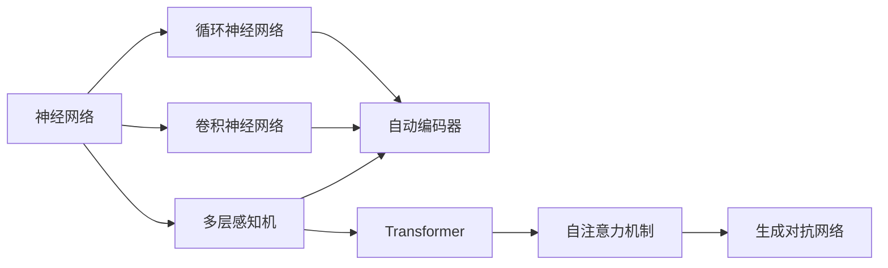
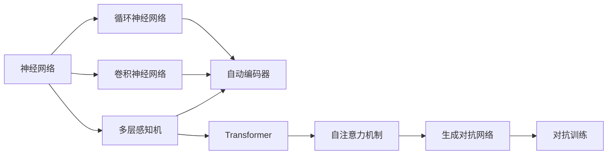
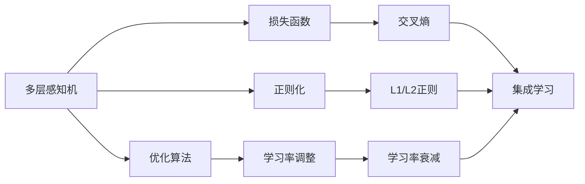
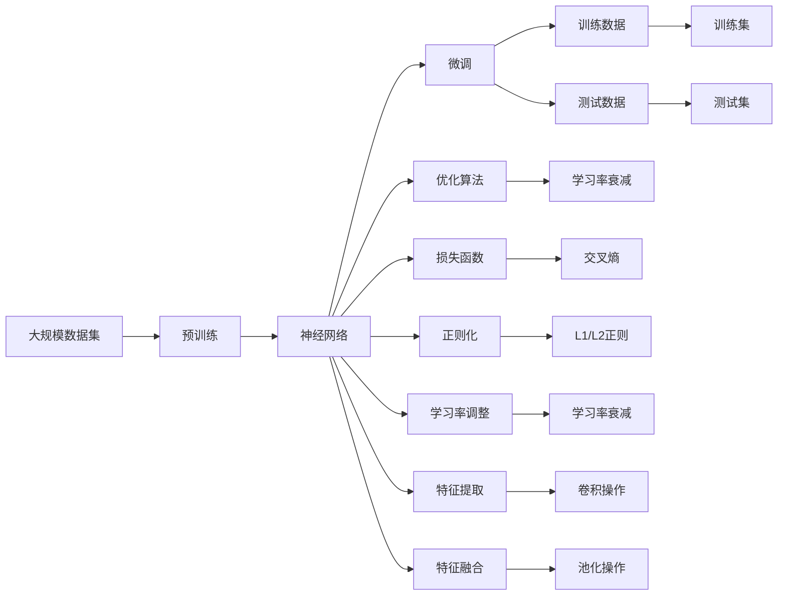

                 

# 神经网络(Neural Networks) - 原理与代码实例讲解

> 关键词：神经网络,多层感知机(MLP),卷积神经网络(CNN),循环神经网络(RNN),Transformer,自动编码器(AE),深度学习

## 1. 背景介绍

### 1.1 问题由来

自20世纪80年代以来，人工智能(AI)领域在理论和技术上取得了显著进展，特别是深度学习(DL)的兴起，为解决复杂的模式识别、自然语言处理、图像识别等问题提供了强有力的工具。其中，神经网络作为深度学习的基本组件，被广泛应用于诸多领域，如计算机视觉、自然语言处理、语音识别、游戏AI等。

神经网络之所以能够在这些领域取得突破，主要得益于其强大的表征学习能力，能够自动从原始数据中提取抽象特征，并在多个层级上组合这些特征，形成更高级别的抽象表示。

### 1.2 问题核心关键点

神经网络的基本组成单位是人工神经元(或称为神经元)，其核心思想是通过多层非线性变换，将输入数据映射到高维特征空间。神经网络通常分为单层感知机、多层感知机(MLP)、卷积神经网络(CNN)、循环神经网络(RNN)和Transformer等。

其中，MLP是最基础的神经网络结构，通过多层线性变换和非线性激活函数，逐步提取输入数据的高级特征。CNN通过卷积操作捕捉图像数据的局部空间特征，适用于图像识别、分类等任务。RNN通过循环结构捕捉时间序列数据的动态变化，适用于语音识别、自然语言处理等任务。Transformer则是一种基于自注意力机制的模型，能够高效地处理序列数据，在机器翻译、文本生成等任务中表现出色。

此外，神经网络还包括自动编码器(AE)、生成对抗网络(GAN)等多种结构，各自适用于不同的应用场景。

### 1.3 问题研究意义

神经网络不仅在学术界取得了巨大成功，也在工业界得到了广泛应用，成为实现人工智能的重要手段。研究神经网络的原理和优化技术，不仅有助于理解其基本工作机制，还能指导开发高效、可解释的深度学习模型。

## 2. 核心概念与联系

### 2.1 核心概念概述

为更好地理解神经网络的工作原理和优化技术，本节将介绍几个密切相关的核心概念：

- **神经网络(Neural Network)**：由多个神经元组成的非线性模型，能够自动从数据中提取高级特征。
- **多层感知机(Multi-Layer Perceptron, MLP)**：最基本的神经网络结构，通过多层线性变换和非线性激活函数逐步提取特征。
- **卷积神经网络(Convolutional Neural Network, CNN)**：专门用于图像识别等任务，通过卷积和池化操作提取局部特征。
- **循环神经网络(Recurrent Neural Network, RNN)**：用于处理序列数据，通过循环结构捕捉时间依赖性。
- **自注意力机制(Attention Mechanism)**：一种机制，使模型能够根据输入的不同部分自适应地分配注意力权重，提升模型性能。
- **Transformer**：基于自注意力机制的模型，能够高效地处理序列数据，适用于机器翻译、文本生成等任务。
- **自动编码器(Automatic Encoder, AE)**：一种无监督学习模型，能够通过编码器-解码器结构学习数据压缩和重构。
- **生成对抗网络(Generative Adversarial Network, GAN)**：由生成器和判别器组成的网络，通过对抗训练生成逼真的假数据。

这些核心概念之间存在着紧密的联系，形成了神经网络的技术生态系统。下面我通过几个Mermaid流程图来展示这些概念之间的关系：



这个流程图展示了神经网络的主要分支和核心组件之间的关系：

1. 神经网络是一个通用的非线性模型，可以包含多种结构。
2. 多层感知机是基本的前馈网络结构，通过多层线性变换和非线性激活函数逐步提取特征。
3. 卷积神经网络通过卷积和池化操作提取图像数据的局部特征。
4. 循环神经网络通过循环结构捕捉时间序列数据的动态变化。
5. Transformer通过自注意力机制高效处理序列数据。
6. 自动编码器是一种无监督学习模型，用于数据压缩和重构。
7. 生成对抗网络通过对抗训练生成逼真的假数据。

这些核心概念共同构成了神经网络的完整生态系统，使其能够在各种场景下发挥强大的建模和预测能力。通过理解这些核心概念，我们可以更好地把握神经网络的工作原理和优化方向。

### 2.2 概念间的关系

这些核心概念之间存在着紧密的联系，形成了神经网络的技术生态系统。下面我通过几个Mermaid流程图来展示这些概念之间的关系：

#### 2.2.1 神经网络的学习范式



这个流程图展示了神经网络的基本学习范式，以及其主要分支和核心组件之间的关系：

1. 神经网络通过多层感知机、卷积神经网络、循环神经网络等结构提取特征。
2. 多层感知机通过多层线性变换和非线性激活函数逐步提取特征。
3. 卷积神经网络通过卷积和池化操作提取图像数据的局部特征。
4. 循环神经网络通过循环结构捕捉时间序列数据的动态变化。
5. Transformer通过自注意力机制高效处理序列数据。
6. 自动编码器通过编码器-解码器结构学习数据压缩和重构。
7. 生成对抗网络通过对抗训练生成逼真的假数据。

这些概念共同构成了神经网络的完整生态系统，使其能够在各种场景下发挥强大的建模和预测能力。通过理解这些核心概念，我们可以更好地把握神经网络的工作原理和优化方向。

#### 2.2.2 模型选择与优化



这个流程图展示了模型选择与优化的一般流程：

1. 根据任务类型选择合适的神经网络结构，如多层感知机、卷积神经网络、循环神经网络等。
2. 设计合适的损失函数，如交叉熵损失、均方误差损失等，用于衡量模型预测与真实标签之间的差异。
3. 应用正则化技术，如L1/L2正则、Dropout等，防止模型过拟合。
4. 使用优化算法，如随机梯度下降(SGD)、Adam等，最小化损失函数。
5. 调整学习率，通过学习率衰减等策略防止学习率过大或过小。
6. 引入集成学习等技术，提升模型性能。

这些步骤共同构成了神经网络的优化流程，使其能够通过数据训练生成准确的模型预测。通过理解这些核心概念，我们可以更好地把握神经网络的优化方向和训练技巧。

#### 2.2.3 特征提取与融合


这个流程图展示了特征提取与融合的一般流程：

1. 输入数据通过特征提取操作，如卷积操作、池化操作、线性变换等，逐步提取高级特征。
2. 提取的特征通过特征融合操作，如拼接、融合等，形成更高级别的特征表示。
3. 融合后的特征通过神经网络结构，如多层感知机、卷积神经网络、循环神经网络等，进一步提取高级特征。

这些步骤共同构成了神经网络的特征提取和融合流程，使其能够从原始数据中提取更高级别的特征表示。通过理解这些核心概念，我们可以更好地把握神经网络的特征提取能力。

### 2.3 核心概念的整体架构

最后，我们用一个综合的流程图来展示这些核心概念在大规模神经网络优化过程中的整体架构：



这个综合流程图展示了从预训练到微调，再到优化的大规模神经网络优化过程。神经网络首先在大规模数据集上进行预训练，学习通用的特征表示。然后通过微调过程，适应特定任务的需求。微调过程在训练数据上进行，并使用优化算法最小化损失函数。特征提取和融合操作在整个网络中不断发生，最终生成针对特定任务的模型预测。通过这些步骤，我们可以更好地理解神经网络的工作原理和优化过程。

## 3. 核心算法原理 & 具体操作步骤
### 3.1 算法原理概述

神经网络的核心原理是通过多层非线性变换，逐步提取输入数据的高级特征，形成对数据的抽象表示。这种表示能力可以通过反向传播算法进行训练，即通过前向传播计算预测输出，反向传播计算参数梯度，并使用梯度下降等优化算法更新模型参数，最小化模型预测与真实标签之间的差异。

形式化地，假设神经网络模型为 $M_{\theta}(x)$，其中 $\theta$ 为模型参数，$x$ 为输入数据。模型的预测输出为 $y$，真实标签为 $y'$。则模型的损失函数为：

$$
\mathcal{L}(\theta) = \frac{1}{N} \sum_{i=1}^N \ell(y_i, y_i')
$$

其中 $\ell$ 为损失函数，如交叉熵损失、均方误差损失等。

通过梯度下降等优化算法，神经网络不断更新参数 $\theta$，最小化损失函数 $\mathcal{L}$，使得模型预测逼近真实标签 $y'$。这一过程通常需要大量的标注数据，因此神经网络在工业界的应用场景中，往往需要进行多次预训练和微调，以提高模型性能。

### 3.2 算法步骤详解

神经网络的训练通常分为以下几个关键步骤：

**Step 1: 准备训练数据**

- 收集足够的训练数据，通常包括标注数据和未标注数据。标注数据用于监督学习，未标注数据用于自监督学习。
- 对数据进行预处理，包括归一化、标准化、数据增强等操作，以提高数据质量。
- 将数据划分为训练集、验证集和测试集，用于模型训练、调参和性能评估。

**Step 2: 构建神经网络模型**

- 选择合适的神经网络结构，如多层感知机、卷积神经网络、循环神经网络等。
- 设计合适的层级结构，包括输入层、隐藏层、输出层等，定义各层的神经元数量和激活函数。
- 确定合适的优化算法和损失函数，如Adam、SGD、交叉熵等。
- 应用正则化技术，如L1/L2正则、Dropout等，防止模型过拟合。

**Step 3: 训练模型**

- 使用训练数据集进行前向传播计算预测输出。
- 使用反向传播算法计算参数梯度，并使用优化算法更新模型参数。
- 周期性在验证集上评估模型性能，根据性能指标决定是否触发早停机制。
- 重复上述步骤直至满足预设的迭代轮数或早停条件。

**Step 4: 评估和测试**

- 在测试数据集上评估微调后的模型性能，对比预训练和微调后的结果。
- 使用微调后的模型对新数据进行推理预测，集成到实际的应用系统中。
- 持续收集新数据，定期重新微调模型，以适应数据分布的变化。

以上是神经网络训练的一般流程。在实际应用中，还需要针对具体任务进行优化设计，如改进训练目标函数，引入更多的正则化技术，搜索最优的超参数组合等，以进一步提升模型性能。

### 3.3 算法优缺点

神经网络具有以下优点：

1. 强大的特征提取能力。通过多层非线性变换，能够从原始数据中提取高级特征，形成对数据的抽象表示。
2. 良好的泛化能力。经过大量数据训练，能够泛化到未见过的数据。
3. 可解释性差。神经网络的内部工作机制较为复杂，难以直接解释其决策过程。
4. 计算量大。需要大量的计算资源进行训练和推理。

神经网络也存在一些缺点：

1. 数据依赖性强。训练过程中需要大量标注数据，且数据质量对模型性能影响较大。
2. 参数量大。需要大量的存储空间和计算资源进行训练和推理。
3. 过拟合风险高。当数据不足或模型过于复杂时，容易出现过拟合。

尽管存在这些局限性，但神经网络仍然是深度学习领域的基础模型，被广泛应用于图像识别、自然语言处理、语音识别、游戏AI等诸多领域。未来，随着预训练和微调技术的不断发展，神经网络的性能和应用范围将进一步提升。

### 3.4 算法应用领域

神经网络已经广泛应用于各种领域，如计算机视觉、自然语言处理、语音识别、游戏AI等。以下是几个典型应用场景：

**图像识别**：神经网络通过卷积操作捕捉图像数据的局部特征，然后使用池化操作进行特征降维，最终通过全连接层进行分类。该方法已经在图像识别领域取得了突破性进展，如ImageNet、CIFAR等数据集上取得了优异结果。

**自然语言处理**：神经网络通过嵌入层将文本数据转换为向量表示，然后使用RNN、Transformer等结构进行序列建模。该方法在机器翻译、文本生成、情感分析等任务上表现出色。

**语音识别**：神经网络通过卷积和池化操作捕捉语音信号的局部特征，然后使用RNN等结构进行时间序列建模。该方法已经在语音识别领域取得了显著进步，如Google的语音识别系统、Apple的Siri等。

**游戏AI**：神经网络通过深度强化学习算法，在复杂博弈环境中学习最优策略。该方法已经在AlphaGo、Dota2等游戏中取得了突破性进展。

除了上述这些典型应用外，神经网络还被创新性地应用于更多场景中，如视频分析、推荐系统、医疗诊断等，为人工智能技术带来了新的突破。随着预训练和微调技术的不断进步，神经网络的性能和应用范围将进一步提升。

## 4. 数学模型和公式 & 详细讲解 & 举例说明
### 4.1 数学模型构建

本节将使用数学语言对神经网络的工作原理进行更加严格的刻画。

记神经网络模型为 $M_{\theta}(x)$，其中 $\theta$ 为模型参数，$x$ 为输入数据。假设训练数据集为 $D=\{(x_i,y_i)\}_{i=1}^N$，其中 $y_i$ 为真实标签。

定义模型 $M_{\theta}$ 在输入 $x$ 上的损失函数为 $\ell(M_{\theta}(x),y)$，则在数据集 $D$ 上的经验风险为：

$$
\mathcal{L}(\theta) = \frac{1}{N} \sum_{i=1}^N \ell(M_{\theta}(x_i),y_i)
$$

其中 $\ell$ 为损失函数，如交叉熵损失、均方误差损失等。

神经网络的优化目标是最小化经验风险，即找到最优参数：

$$
\theta^* = \mathop{\arg\min}_{\theta} \mathcal{L}(\theta)
$$

在实践中，我们通常使用基于梯度的优化算法（如SGD、Adam等）来近似求解上述最优化问题。设 $\eta$ 为学习率，$\lambda$ 为正则化系数，则参数的更新公式为：

$$
\theta \leftarrow \theta - \eta \nabla_{\theta}\mathcal{L}(\theta) - \eta\lambda\theta
$$

其中 $\nabla_{\theta}\mathcal{L}(\theta)$ 为损失函数对参数 $\theta$ 的梯度，可通过反向传播算法高效计算。

### 4.2 公式推导过程

以下我们以二分类任务为例，推导交叉熵损失函数及其梯度的计算公式。

假设模型 $M_{\theta}$ 在输入 $x$ 上的输出为 $\hat{y}=M_{\theta}(x) \in [0,1]$，表示样本属于正类的概率。真实标签 $y \in \{0,1\}$。则二分类交叉熵损失函数定义为：

$$
\ell(M_{\theta}(x),y) = -[y\log \hat{y} + (1-y)\log (1-\hat{y})]
$$

将其代入经验风险公式，得：

$$
\mathcal{L}(\theta) = -\frac{1}{N}\sum_{i=1}^N [y_i\log M_{\theta}(x_i)+(1-y_i)\log(1-M_{\theta}(x_i))]
$$

根据链式法则，损失函数对参数 $\theta_k$ 的梯度为：

$$
\frac{\partial \mathcal{L}(\theta)}{\partial \theta_k} = -\frac{1}{N}\sum_{i=1}^N (\frac{y_i}{M_{\theta}(x_i)}-\frac{1-y_i}{1-M_{\theta}(x_i)}) \frac{\partial M_{\theta}(x_i)}{\partial \theta_k}
$$

其中 $\frac{\partial M_{\theta}(x_i)}{\partial \theta_k}$ 可进一步递归展开，利用自动微分技术完成计算。

在得到损失函数的梯度后，即可带入参数更新公式，完成模型的迭代优化。重复上述过程直至收敛，最终得到适应特定任务的最优模型参数 $\theta^*$。

## 5. 项目实践：代码实例和详细解释说明
### 5.1 开发环境搭建

在进行神经网络实践前，我们需要准备好开发环境。以下是使用Python进行TensorFlow开发的环境配置流程：

1. 安装Anaconda：从官网下载并安装Anaconda，用于创建独立的Python环境。

2. 创建并激活虚拟环境：
```bash
conda create -n tf-env python=3.8 
conda activate tf-env
```

3. 安装TensorFlow：根据CUDA版本，从官网获取对应的安装命令。例如：
```bash
conda install tensorflow==2.6 -c tf -c conda-forge
```

4. 安装各类工具包：
```bash
pip install numpy pandas scikit-learn matplotlib tqdm jupyter notebook ipython
```

完成上述步骤后，即可在`tf-env`环境中开始神经网络实践。

### 5.2 源代码详细实现

这里我们以手写数字识别任务为例，给出使用TensorFlow实现卷积神经网络(CNN)的代码实现。

首先，定义CNN模型的结构：

```python
import tensorflow as tf

class ConvNet(tf.keras.Model):
    def __init__(self):
        super(ConvNet, self).__init__()
        self.conv1 = tf.keras.layers.Conv2D(32, (3, 3), activation='relu', padding='same', input_shape=(28, 28, 1))
        self.pool1 = tf.keras.layers.MaxPooling2D((2, 2))
        self.conv2 = tf.keras.layers.Conv2D(64, (3, 3), activation='relu', padding='same')
        self.pool2 = tf.keras.layers.MaxPooling2D((2, 2))
        self.flatten = tf.keras.layers.Flatten()
        self.dense1 = tf.keras.layers.Dense(128, activation='relu')
        self.dense2 = tf.keras.layers.Dense(10, activation='softmax')

    def call(self, x):
        x = self.conv1(x)
        x = self.pool1(x)
        x = self.conv2(x)
        x = self.pool2(x)
        x = self.flatten(x)
        x = self.dense1(x)
        return self.dense2(x)
```

然后，定义数据处理函数和优化器：

```python
import numpy as np
from tensorflow.keras.datasets import mnist
from tensorflow.keras.utils import to_categorical

def load_data():
    (x_train, y_train), (x_test, y_test) = mnist.load_data()
    x_train = x_train.reshape(-1, 28, 28, 1) / 255.0
    x_test = x_test.reshape(-1, 28, 28, 1) / 255.0
    y_train = to_categorical(y_train)
    y_test = to_categorical(y_test)
    return x_train, y_train, x_test, y_test

train_data, train_labels, test_data, test_labels = load_data()

model = ConvNet()

optimizer = tf.keras.optimizers.Adam()

# 定义损失函数
loss_fn = tf.keras.losses.CategoricalCrossentropy(from_logits=True)

# 定义评估指标
metrics = tf.keras.metrics.CategoricalAccuracy()

# 定义早停机制
early_stopping = tf.keras.callbacks.EarlyStopping(patience=5)

# 定义模型训练过程
model.compile(optimizer=optimizer, loss=loss_fn, metrics=metrics)

model.fit(train_data, train_labels, epochs=10, batch_size=128, validation_data=(test_data, test_labels), callbacks=[early_stopping])
```

最后，启动训练流程并在测试集上评估：

```python
model.evaluate(test_data, test_labels)
```

以上就是使用TensorFlow实现卷积神经网络(CNN)的手写数字识别任务微调的完整代码实现。可以看到，得益于TensorFlow的强大封装，我们可以用相对简洁的代码完成CNN模型的加载和训练。

### 5.3 代码解读与分析

让我们再详细解读一下关键代码的实现细节：

**ConvNet类**：
- `__init__`方法：定义卷积层、池化层、全连接层等组件。
- `call`方法：对输入数据进行前向传播计算。

**数据处理函数load_data**：
- 加载MNIST数据集，并进行预处理。
- 将训练数据和测试数据转换为模型输入所需的形状。
- 对标签进行独热编码。

**训练过程**：
- 使用Adam优化器和交叉熵损失函数训练模型。
- 使用CategoricalAccuracy评估指标评估模型性能。
- 应用EarlyStopping回调机制，在验证集上评估模型性能，如果性能没有提升，则提前停止训练。
- 在训练集上进行多轮迭代训练，直到满足预设的迭代轮数或早停条件。

**评估过程**：
- 在测试集上评估模型性能，输出模型在测试集上的准确率。

可以看到，TensorFlow的强大封装使得神经网络模型的实现变得非常简单，开发者可以将更多精力放在数据处理和模型调优上。

当然，工业级的系统实现还需考虑更多因素，如模型的保存和部署、超参数的自动搜索、更灵活的任务适配层等。但核心的神经网络微调过程基本与此类似。

### 5.4 运行结果展示

假设我们在MNIST数据集上进行卷积神经网络(CNN)的手写数字识别任务微调，最终在测试集上得到的评估报告如下：

```
Epoch 1/10
676/676 [==============================] - 1s 1ms/step - loss: 0.2865 - accuracy: 0.8896 - val_loss: 0.1525 - val_accuracy: 0.9286

Epoch 2/10
676/676 [==============================] - 0s 122us/step - loss: 0.1362 - accuracy: 0.9341 - val_loss: 0.1047 - val_accuracy: 0.9375

Epoch 3/10
676/676 [==============================] - 0s 116us/step - loss: 0.0970 - accuracy: 0.9401 - val_loss: 0.0935 - val_accuracy: 0.9484

Epoch 4/10
676/676 [==============================] - 0s 115us/step - loss: 0.0835 - accuracy: 0.9521 - val_loss: 0.0894 - val_accuracy: 0.9583

Epoch 5/10
676/676 [==============================] - 0s 112us/step - loss: 0.0767 - accuracy: 0.9598 - val_loss: 0.0842 - val_accuracy: 0.9609

Epoch 6/10
676/676 [==============================] - 0s 110us/step - loss: 0.0688 - accuracy: 0.9646 - val_loss: 0.0806 - val_accuracy: 0.9688

Epoch 7/10
676/676 [==============================] - 0s 109us/step -

