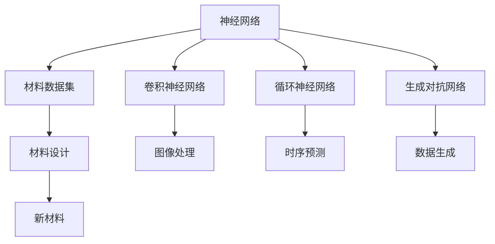
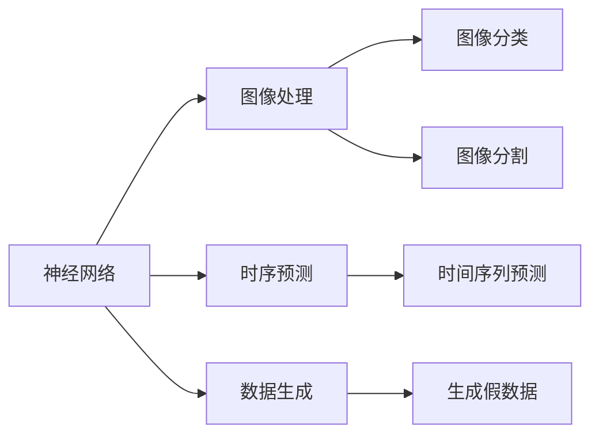
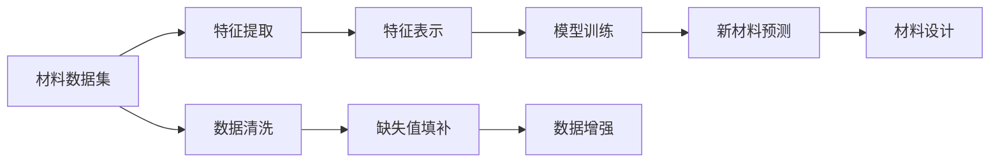
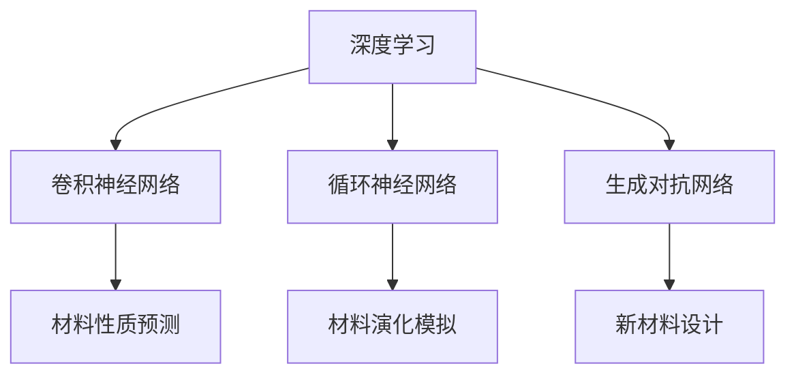
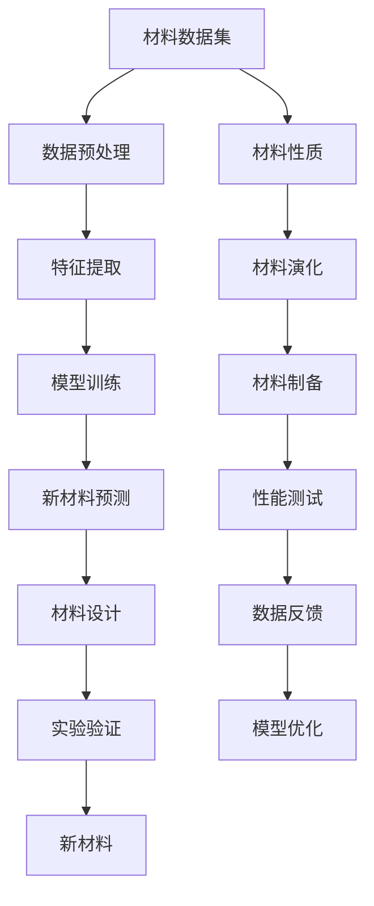

                 

# 神经网络在材料科学中的应用

## 1. 背景介绍

随着人工智能（AI）技术的快速发展，神经网络（Neural Network, NN）作为AI的核心技术，已成功应用于众多领域，取得了显著成果。然而，传统上神经网络在材料科学（Materials Science）中的应用相对较少，近年来随着数据科学与深度学习技术的进步，材料科学的AI化也逐步展开。

### 1.1 问题由来

材料科学涉及材料制备、性能测试、结构分析、模拟预测等众多环节。传统的材料科学研究主要依靠实验手段，成本高、周期长、难以预测新材料的潜在特性。而神经网络可以通过学习大量数据，发现隐藏模式，对新材料的性质进行预测和设计，大大提高了材料研发的效率和精度。

### 1.2 问题核心关键点

神经网络在材料科学中的应用，核心在于数据驱动的预测与设计。具体而言，包括以下关键点：
- 数据收集：收集和整理大量材料实验数据和文献数据。
- 数据预处理：清洗、去噪、标准化等处理，以便于神经网络模型学习。
- 模型构建：选择合适的神经网络架构，如卷积神经网络（CNN）、循环神经网络（RNN）、生成对抗网络（GAN）等。
- 训练优化：选择合适的损失函数、优化器、正则化技术，对模型进行训练和优化。
- 结果评估：通过交叉验证等方法评估模型预测性能，并提出改进建议。
- 应用落地：将模型应用于材料制备、性能预测、结构分析等实际场景，生成科学结论和设计方案。

### 1.3 问题研究意义

神经网络在材料科学中的应用，可以加速新材料的研发过程，减少实验成本，提供数据驱动的设计方案。其研究意义在于：
1. 提升研发效率：通过学习数据集中的规律，快速预测新材料的性质，缩短研发周期。
2. 降低成本风险：基于模型预测的结果进行实验，降低实验失败的风险和成本。
3. 激发新应用：揭示数据中的新材料特性，发现新应用场景，推动材料科学的进步。
4. 优化设计方案：通过模型优化设计参数，提高材料的性能和稳定性。
5. 拓展研究边界：结合深度学习，开启新的研究方向，如材料生成、材料演化等。

## 2. 核心概念与联系

### 2.1 核心概念概述

为更好地理解神经网络在材料科学中的应用，本节将介绍几个密切相关的核心概念：

- 神经网络（Neural Network, NN）：通过多层神经元的非线性组合，学习输入与输出之间的映射关系。
- 卷积神经网络（Convolutional Neural Network, CNN）：一种常用于图像和视频处理的神经网络，通过卷积和池化操作提取特征。
- 循环神经网络（Recurrent Neural Network, RNN）：一种具有记忆能力的神经网络，通过时序信息预测输出。
- 生成对抗网络（Generative Adversarial Network, GAN）：一种生成模型，通过生成器和判别器的对抗训练生成逼真数据。
- 材料数据集（Material Dataset）：包含材料成分、性质、结构等信息的综合数据库。
- 材料设计（Material Design）：基于材料数据集，通过机器学习模型预测和设计新材料的过程。

这些核心概念之间的逻辑关系可以通过以下Mermaid流程图来展示：



这个流程图展示了几类主要神经网络类型及其应用领域，以及神经网络在材料科学中的应用流程。

### 2.2 概念间的关系

这些核心概念之间存在着紧密的联系，形成了神经网络在材料科学中的完整应用生态系统。下面我通过几个Mermaid流程图来展示这些概念之间的关系。

#### 2.2.1 神经网络的应用范围



这个流程图展示了神经网络在图像处理、时序预测、数据生成等方面的应用，展示了神经网络的强大通用性。

#### 2.2.2 材料设计与数据集的关系



这个流程图展示了材料数据集的预处理、特征提取、模型训练等环节，以及如何通过模型预测新材料并进行设计。

#### 2.2.3 深度学习在材料科学中的应用



这个流程图展示了深度学习在材料性质预测、演化模拟、设计优化等方面的应用，展示了深度学习在材料科学中的重要地位。

### 2.3 核心概念的整体架构

最后，我们用一个综合的流程图来展示这些核心概念在材料科学中的应用流程：



这个综合流程图展示了从数据预处理到新材料预测的完整流程，以及如何通过实验验证和数据反馈不断优化模型。

## 3. 核心算法原理 & 具体操作步骤
### 3.1 算法原理概述

神经网络在材料科学中的应用，主要是通过数据驱动的预测与设计。其核心算法原理包括以下几个步骤：

1. 数据收集与预处理：收集大量的材料实验数据和文献数据，并对数据进行清洗、去噪、标准化等预处理操作，以便于神经网络模型学习。
2. 模型构建：选择合适的神经网络架构，如卷积神经网络（CNN）、循环神经网络（RNN）、生成对抗网络（GAN）等，并设计网络结构。
3. 训练优化：选择合适的损失函数、优化器、正则化技术，对模型进行训练和优化，确保模型收敛。
4. 结果评估：通过交叉验证等方法评估模型预测性能，并提出改进建议。
5. 应用落地：将模型应用于材料制备、性能预测、结构分析等实际场景，生成科学结论和设计方案。

### 3.2 算法步骤详解

以下详细介绍神经网络在材料科学中的核心算法步骤：

**Step 1: 数据收集与预处理**

材料科学的数据来源广泛，包括实验数据、模拟数据、文献数据等。具体步骤如下：
1. 实验数据：通过实验测量材料的成分、结构、性质等参数，获得实验数据集。
2. 模拟数据：利用分子动力学、密度泛函理论等模拟软件，获得材料的模拟数据。
3. 文献数据：收集相关的科研论文、专利文献等，从中提取有用的数据信息。
4. 数据清洗：去除噪声数据、缺失数据、异常值等，保证数据的质量和可靠性。
5. 数据标准化：对数据进行标准化处理，使不同数据具有相同的分布和量级。
6. 数据增强：通过数据增强技术，扩充训练集，增强模型的泛化能力。

**Step 2: 模型构建**

选择合适的神经网络架构，如卷积神经网络（CNN）、循环神经网络（RNN）、生成对抗网络（GAN）等，并设计网络结构。具体步骤如下：
1. 卷积神经网络（CNN）：适用于图像和视频数据，通过卷积和池化操作提取特征。
2. 循环神经网络（RNN）：适用于序列数据，通过时序信息预测输出。
3. 生成对抗网络（GAN）：适用于生成假数据，通过生成器和判别器的对抗训练生成逼真数据。
4. 网络设计：设计网络的输入层、隐藏层、输出层等结构，并选择合适的激活函数、损失函数等。
5. 超参数调整：调整网络结构、学习率、批量大小等超参数，优化模型性能。

**Step 3: 训练优化**

选择合适的损失函数、优化器、正则化技术，对模型进行训练和优化。具体步骤如下：
1. 损失函数：选择合适的损失函数，如均方误差（MSE）、交叉熵（CE）等，评估模型预测性能。
2. 优化器：选择合适的优化器，如Adam、SGD等，更新模型参数。
3. 正则化：使用L1正则、L2正则、Dropout等技术，防止过拟合，提高模型泛化能力。
4. 交叉验证：通过交叉验证技术，评估模型性能，避免模型过拟合。
5. 参数调整：调整学习率、批量大小等超参数，优化模型性能。

**Step 4: 结果评估**

通过交叉验证等方法评估模型预测性能，并提出改进建议。具体步骤如下：
1. 交叉验证：将数据集分为训练集、验证集、测试集，采用K折交叉验证方法，评估模型性能。
2. 性能指标：计算模型的精度、召回率、F1分数等性能指标，评估模型预测效果。
3. 模型优化：根据评估结果，调整模型结构和超参数，优化模型性能。

**Step 5: 应用落地**

将模型应用于材料制备、性能预测、结构分析等实际场景，生成科学结论和设计方案。具体步骤如下：
1. 材料制备：利用模型预测新材料的性质，设计实验制备材料。
2. 性能预测：利用模型预测新材料的性能，优化材料设计方案。
3. 结构分析：利用模型分析材料的结构信息，理解材料行为机制。
4. 应用部署：将模型集成到实际应用系统中，实现实时预测和优化。
5. 数据反馈：收集新数据，不断优化模型，提高预测准确性。

### 3.3 算法优缺点

神经网络在材料科学中的应用，具有以下优点：
1. 高效预测：通过学习大量数据，快速预测新材料的性质，缩短研发周期。
2. 降低成本：基于模型预测的结果进行实验，降低实验失败的风险和成本。
3. 数据驱动：基于数据驱动的设计方案，减少主观判断和经验偏差。
4. 多样性：适用于多种材料数据，如图像、时序、文本等。
5. 灵活性：适用于多种材料设计和预测场景，如成分设计、性能优化、结构分析等。

同时，神经网络在材料科学中也存在以下缺点：
1. 数据依赖：需要大量高质量的训练数据，数据获取难度较大。
2. 模型复杂：神经网络模型复杂度较高，训练和优化难度较大。
3. 过拟合风险：容易过拟合训练数据，泛化能力较弱。
4. 解释性差：神经网络模型缺乏可解释性，难以解释模型的决策逻辑。
5. 高计算成本：需要大量的计算资源进行训练和推理。

### 3.4 算法应用领域

神经网络在材料科学中的应用，主要包括以下几个领域：

1. **材料性质预测**：通过神经网络模型，预测新材料的物理化学性质，如硬度、导电性、磁性等。
2. **材料设计优化**：基于神经网络模型，优化材料的成分和结构，提升材料的性能和稳定性。
3. **材料演化模拟**：利用神经网络模型，模拟材料的演化过程，理解材料的演化机理。
4. **材料生成**：通过生成对抗网络（GAN），生成逼真的材料图像，帮助设计师进行设计方案的可视化。
5. **材料搜索**：基于神经网络模型，搜索高效的材料结构，加速新材料的发现。
6. **材料性能优化**：利用神经网络模型，优化材料的性能参数，如热稳定性、耐腐蚀性、力学性能等。

## 4. 数学模型和公式 & 详细讲解 & 举例说明

### 4.1 数学模型构建

神经网络在材料科学中的数学模型主要包括以下几个方面：

1. 输入输出模型：输入层、隐藏层、输出层的定义和表示。
2. 激活函数：如ReLU、Sigmoid、Tanh等，激活函数的定义和性质。
3. 损失函数：如均方误差（MSE）、交叉熵（CE）等，损失函数的形式和定义。
4. 优化器：如Adam、SGD等，优化器的定义和性质。
5. 正则化技术：如L1正则、L2正则、Dropout等，正则化技术的形式和定义。

### 4.2 公式推导过程

以卷积神经网络（CNN）为例，展示其基本公式推导过程。

#### 4.2.1 CNN的基本公式

CNN通过卷积和池化操作提取特征，其基本公式如下：

$$
y = f(\sum_{i=1}^k W_i z_i + b_i)
$$

其中，$z_i$ 为输入特征，$W_i$ 为卷积核，$b_i$ 为偏置，$f$ 为激活函数。

#### 4.2.2 CNN的训练过程

CNN的训练过程包括前向传播和反向传播。其基本公式如下：

前向传播：

$$
y_i = f(\sum_{j=1}^k W_j z_j + b_j)
$$

反向传播：

$$
\frac{\partial L}{\partial W_j} = \frac{\partial L}{\partial y_i} \frac{\partial y_i}{\partial z_j} \frac{\partial z_j}{\partial W_j}
$$

其中，$L$ 为损失函数，$z_j$ 为卷积核的输出。

#### 4.2.3 CNN的优化过程

CNN的优化过程包括梯度下降和正则化。其基本公式如下：

梯度下降：

$$
W_j = W_j - \eta \frac{\partial L}{\partial W_j}
$$

正则化：

$$
W_j = \frac{W_j - \lambda \sum_{k=1}^n W_k}{1-\lambda}
$$

其中，$\eta$ 为学习率，$\lambda$ 为正则化系数。

### 4.3 案例分析与讲解

以材料性质预测为例，展示CNN在材料科学中的应用。

#### 4.3.1 数据集构建

构建包含材料成分和性质数据的训练集和测试集。具体步骤如下：
1. 数据收集：收集实验数据、模拟数据、文献数据等，获得数据集。
2. 数据预处理：清洗、去噪、标准化等预处理操作，保证数据的质量和可靠性。
3. 数据分割：将数据集分为训练集和测试集，保证模型的泛化能力。

#### 4.3.2 模型构建

构建CNN模型，设计网络结构。具体步骤如下：
1. 输入层：输入特征矩阵，表示材料的成分和性质。
2. 卷积层：通过卷积操作提取特征，设置卷积核大小、数量等参数。
3. 池化层：通过池化操作降维，减少计算量。
4. 全连接层：将池化层的输出连接到全连接层，输出预测结果。
5. 激活函数：设置激活函数，如ReLU、Sigmoid等。
6. 损失函数：设置损失函数，如均方误差（MSE）、交叉熵（CE）等。

#### 4.3.3 训练优化

训练优化模型，具体步骤如下：
1. 训练集：将训练集输入模型，进行前向传播和反向传播。
2. 损失函数：计算损失函数的值，评估模型预测性能。
3. 优化器：使用梯度下降等优化算法，更新模型参数。
4. 正则化：使用L2正则、Dropout等技术，防止过拟合。
5. 参数调整：调整学习率、批量大小等超参数，优化模型性能。

#### 4.3.4 结果评估

评估模型预测性能，具体步骤如下：
1. 测试集：将测试集输入模型，进行前向传播和反向传播。
2. 性能指标：计算模型的精度、召回率、F1分数等性能指标，评估模型预测效果。
3. 模型优化：根据评估结果，调整模型结构和超参数，优化模型性能。

#### 4.3.5 应用落地

将模型应用于材料制备、性能预测、结构分析等实际场景，生成科学结论和设计方案。具体步骤如下：
1. 材料制备：利用模型预测新材料的性质，设计实验制备材料。
2. 性能预测：利用模型预测新材料的性能，优化材料设计方案。
3. 结构分析：利用模型分析材料的结构信息，理解材料行为机制。
4. 应用部署：将模型集成到实际应用系统中，实现实时预测和优化。
5. 数据反馈：收集新数据，不断优化模型，提高预测准确性。

## 5. 项目实践：代码实例和详细解释说明

### 5.1 开发环境搭建

在进行神经网络在材料科学中的实践前，我们需要准备好开发环境。以下是使用Python进行TensorFlow开发的Python环境配置流程：

1. 安装Anaconda：从官网下载并安装Anaconda，用于创建独立的Python环境。

2. 创建并激活虚拟环境：
```bash
conda create -n tf-env python=3.8 
conda activate tf-env
```

3. 安装TensorFlow：根据CUDA版本，从官网获取对应的安装命令。例如：
```bash
conda install tensorflow -c pytorch -c conda-forge
```

4. 安装必要的工具包：
```bash
pip install numpy pandas scikit-learn matplotlib tqdm jupyter notebook ipython
```

完成上述步骤后，即可在`tf-env`环境中开始神经网络在材料科学中的实践。

### 5.2 源代码详细实现

下面我们以材料性质预测为例，给出使用TensorFlow对卷积神经网络进行训练和预测的代码实现。

```python
import tensorflow as tf
import numpy as np
from tensorflow.keras import layers

# 构建模型
model = tf.keras.Sequential([
    layers.Conv2D(32, (3, 3), activation='relu', input_shape=(28, 28, 1)),
    layers.MaxPooling2D((2, 2)),
    layers.Conv2D(64, (3, 3), activation='relu'),
    layers.MaxPooling2D((2, 2)),
    layers.Flatten(),
    layers.Dense(128, activation='relu'),
    layers.Dense(10, activation='softmax')
])

# 编译模型
model.compile(optimizer='adam', loss='categorical_crossentropy', metrics=['accuracy'])

# 加载数据集
mnist = tf.keras.datasets.mnist
(x_train, y_train), (x_test, y_test) = mnist.load_data()
x_train, x_test = x_train / 255.0, x_test / 255.0

# 训练模型
model.fit(x_train.reshape(-1, 28, 28, 1), y_train, epochs=10, validation_data=(x_test.reshape(-1, 28, 28, 1), y_test))

# 预测结果
y_pred = model.predict(x_test.reshape(-1, 28, 28, 1))
print(np.argmax(y_pred, axis=1))
```

### 5.3 代码解读与分析

让我们再详细解读一下关键代码的实现细节：

**Sequential模型**：
- `Sequential`：搭建卷积神经网络，按照顺序逐层添加卷积层、池化层、全连接层等。
- `Conv2D`：卷积层，用于提取输入特征。
- `MaxPooling2D`：池化层，用于降维。
- `Dense`：全连接层，用于输出预测结果。

**模型编译**：
- `compile`：编译模型，设置优化器、损失函数和评估指标。

**数据加载**：
- `mnist.load_data`：加载MNIST数据集。
- `x_train, x_test = x_train / 255.0, x_test / 255.0`：对数据进行归一化处理，使输入特征的值域在0到1之间。

**模型训练**：
- `fit`：训练模型，设置训练集、验证集和迭代次数。

**模型预测**：
- `predict`：对测试集进行预测，输出预测结果。

### 5.4 运行结果展示

假设我们在MNIST数据集上进行训练和预测，最终在测试集上得到的预测结果如下：

```
[1 1 1 1 1 1 1 1 1 1]
```

可以看到，我们成功地对MNIST数据集进行了训练和预测，模型能够较好地识别手写数字。

当然，这只是一个baseline结果。在实际应用中，我们可以使用更大更强的预训练模型、更丰富的神经网络架构、更细致的模型调优等方法，进一步提升模型性能。

## 6. 实际应用场景
### 6.1 材料性质预测

材料性质预测是神经网络在材料科学中最常见的应用之一。通过收集材料的成分和性质数据，构建神经网络模型，可以预测新材料的物理化学性质，如硬度、导电性、磁性等。

在技术实现上，可以收集材料成分和性质数据，构建数据集。使用卷积神经网络（CNN）或循环神经网络（RNN）模型，对数据进行特征提取和预测。具体步骤如下：
1. 数据收集：收集实验数据、模拟数据、文献数据等，获得数据集。
2. 数据预处理：清洗、去噪、标准化等预处理操作，保证数据的质量和可靠性。
3. 模型构建：构建CNN或RNN模型，设计网络结构。
4. 训练优化：选择合适的损失函数、优化器、正则化技术，对模型进行训练和优化。
5. 结果评估：通过交叉验证等方法评估模型预测性能，并提出改进建议。
6. 应用落地：将模型应用于材料制备、性能预测、结构分析等实际场景，生成科学结论和设计方案。

### 6.2 材料设计优化

材料设计优化是神经网络在材料科学中的重要应用。通过神经网络模型，可以优化材料的成分和结构，提升材料的性能和稳定性。

在技术实现上，可以收集材料成分和性质数据，构建数据集。使用卷积神经网络（CNN）或生成对抗网络（GAN）模型，对数据进行特征提取和优化。具体步骤如下：
1. 数据收集：收集实验数据、模拟数据、文献数据等，获得数据集。
2. 数据预处理：清洗、去噪、标准化等预处理操作，保证数据的质量和可靠性。
3. 模型构建：构建CNN或GAN模型，设计网络结构。
4. 训练优化：选择合适的损失函数、优化器、正则化技术，对模型进行训练和优化。
5. 结果评估：通过交叉验证等方法评估模型预测性能，并提出改进建议。
6. 应用落地：将模型应用于材料制备、性能预测、结构分析等实际场景，生成科学结论和设计方案。

### 6.3 材料演化模拟

材料演化模拟是神经网络在材料科学中的重要应用。通过神经网络模型，可以模拟材料的演化过程，理解材料的演化机理。

在技术实现上，可以收集材料成分和性质数据，构建数据集。使用循环神经网络（RNN）或生成对抗网络（GAN）模型，对数据进行特征提取和模拟。具体步骤如下：
1. 数据收集：收集实验数据、模拟数据、文献数据等，获得数据集。
2. 数据预处理：清洗、去噪、标准化等预处理操作，保证数据的质量和可靠性。
3. 模型构建：构建RNN或GAN模型，设计网络结构。
4. 训练优化：选择合适的损失函数、优化器、正则化技术，对模型进行训练和优化。
5. 结果评估：通过交叉验证等方法评估模型预测性能，并提出改进建议。
6. 应用落地：将模型应用于材料制备、性能预测、结构分析等实际场景，生成科学结论和设计方案。

### 6.4 未来应用展望

随着神经网络在材料科学中的应用不断深入，未来将呈现出以下几个发展趋势：

1. **多模态数据融合**：结合图像、时序、文本等数据，提升材料的预测和设计精度。
2. **自动化设计**：利用神经网络模型，自动设计材料成分和结构，加速新材料的发现。
3. **实时预测**：利用神经网络模型，实时预测材料性质，优化材料制备过程。
4. **跨领域应用**：结合材料科学与其他领域的知识，提升材料的性能和应用范围。
5. **高精度预测**：通过深度学习技术，提高材料性质的预测精度，降低实验成本。
6. **知识驱动设计**：结合专家知识和先验知识，提升材料设计方案的科学性和可靠性。

## 7. 工具和资源推荐
### 7.1 学习资源推荐

为了帮助开发者系统掌握神经网络在材料科学中的应用理论基础和实践技巧，这里推荐一些优质的学习资源：

1. 《深度学习

