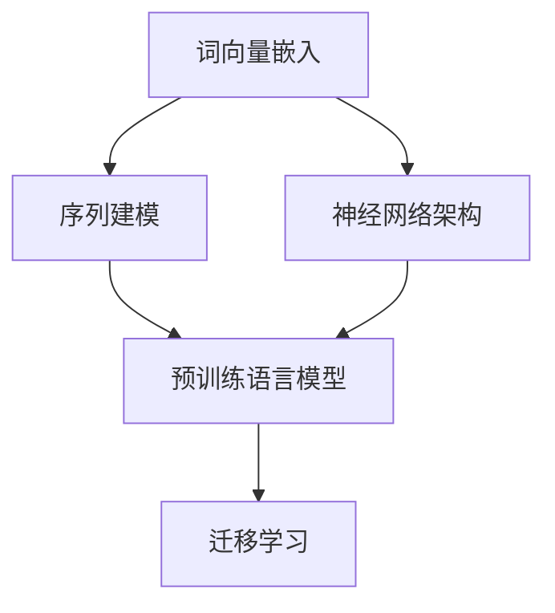
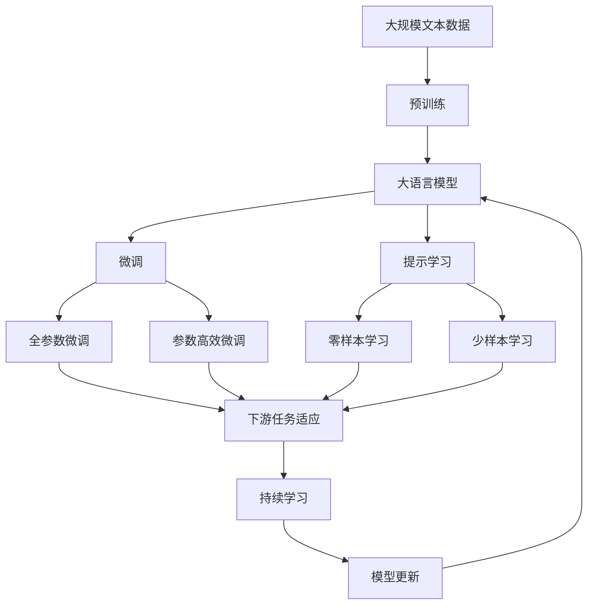

                 

## 1. 背景介绍

### 1.1 问题由来

随着深度学习技术的飞速发展，自然语言处理（NLP）领域取得了令人瞩目的成就。其中，神经网络的应用尤为显著，成为了NLP技术突破的基石。从简单的词向量嵌入，到复杂的神经网络模型，神经网络为NLP带来了深刻的变革。本文将深入探讨神经网络在NLP中的应用，包括原理、技术实现、应用场景以及未来发展方向。

### 1.2 问题核心关键点

神经网络在NLP中的应用主要体现在以下几个方面：

1. **词向量嵌入**：通过神经网络模型将词语映射到低维向量空间，使得词语之间的关系得以保留。
2. **序列建模**：神经网络能够有效地处理序列数据，如文本、时间序列等。
3. **神经网络架构**：如卷积神经网络（CNN）、循环神经网络（RNN）、长短时记忆网络（LSTM）和门控循环单元（GRU）等，适用于不同NLP任务的建模。
4. **预训练语言模型**：通过大规模无标签数据预训练，学习到通用的语言表示，用于下游任务的微调。
5. **迁移学习**：通过在预训练语言模型上微调，提升特定任务的性能，减少标注数据的依赖。

### 1.3 问题研究意义

神经网络在NLP中的应用，为自然语言处理技术的落地提供了强有力的支持。通过神经网络，NLP技术能够在多种应用场景中实现自动化、智能化的处理。神经网络的引入，极大地提升了文本分类、信息抽取、机器翻译、问答系统等任务的性能，推动了NLP技术的产业化和应用普及。

## 2. 核心概念与联系

### 2.1 核心概念概述

神经网络在NLP中的应用涉及多个核心概念，包括词向量、序列建模、神经网络架构、预训练语言模型和迁移学习等。这些概念通过以下Mermaid流程图展示它们之间的关系：



这个流程图展示了词向量嵌入和序列建模是神经网络在NLP应用中的基础，通过神经网络架构可以实现不同层次的建模，预训练语言模型则通过大规模无标签数据学习通用的语言表示，迁移学习则是在预训练语言模型上微调以适应特定任务。

### 2.2 概念间的关系

神经网络在NLP中的应用涉及多个核心概念，它们之间的关系可以通过以下Mermaid流程图展示：


这个流程图展示了词向量嵌入是神经网络架构的基础，序列建模是神经网络架构中的重要部分，预训练语言模型和迁移学习则是通过神经网络架构实现的不同层次的建模，从而适应不同的NLP任务。

### 2.3 核心概念的整体架构

最后，我们用一个综合的流程图来展示这些核心概念在大语言模型微调过程中的整体架构：



这个综合流程图展示了从预训练到微调，再到持续学习的完整过程。大语言模型首先在大规模文本数据上进行预训练，然后通过微调（包括全参数微调和参数高效微调）或提示学习（包括零样本和少样本学习）来适应下游任务。最后，通过持续学习技术，模型可以不断更新和适应新的任务和数据。

## 3. 核心算法原理 & 具体操作步骤

### 3.1 算法原理概述

神经网络在NLP中的应用，本质上是通过神经网络模型学习输入（文本数据）与输出（标签或序列）之间的映射关系。以序列建模为例，神经网络通过多层非线性变换，捕捉输入序列中的复杂模式，进而预测输出。

在文本分类任务中，神经网络模型通常包括嵌入层、隐藏层和输出层。嵌入层将输入文本转换为向量表示，隐藏层通过非线性变换提取特征，输出层将特征映射到标签空间。通过反向传播算法，神经网络模型不断调整权重，最小化损失函数，从而优化模型的性能。

### 3.2 算法步骤详解

神经网络在NLP中的应用，一般遵循以下步骤：

1. **数据预处理**：包括文本分词、去除停用词、特征提取等。
2. **构建神经网络模型**：选择合适的神经网络架构，如RNN、LSTM、GRU等，并设置模型的参数。
3. **模型训练**：将处理好的文本数据输入模型，通过反向传播算法更新模型参数，最小化损失函数。
4. **模型评估**：使用验证集或测试集评估模型性能，如准确率、F1分数等。
5. **模型微调**：对预训练语言模型进行微调，提升特定任务的性能。
6. **模型部署**：将训练好的模型部署到实际应用中，进行推理预测。

### 3.3 算法优缺点

神经网络在NLP中的应用，具有以下优点：

- **自动特征提取**：神经网络能够自动学习输入数据的特征表示，无需手动设计特征。
- **处理序列数据能力强**：神经网络模型能够有效处理序列数据，如文本、时间序列等。
- **鲁棒性强**：神经网络模型具有较强的泛化能力，对输入数据的扰动具有一定的鲁棒性。

同时，神经网络在NLP中的应用也存在以下缺点：

- **需要大量标注数据**：神经网络模型通常需要大量标注数据进行训练，标注成本较高。
- **计算资源需求高**：神经网络模型的训练和推理需要大量的计算资源，如GPU、TPU等。
- **可解释性不足**：神经网络模型通常被视为"黑盒"，难以解释其内部工作机制和决策逻辑。

### 3.4 算法应用领域

神经网络在NLP中的应用，广泛应用于以下几个领域：

1. **文本分类**：如情感分析、主题分类、意图识别等。
2. **信息抽取**：从文本中抽取实体、关系等结构化信息。
3. **机器翻译**：将源语言文本翻译成目标语言。
4. **问答系统**：对自然语言问题给出答案。
5. **文本生成**：生成文本、摘要、对话等。
6. **语音识别**：将语音信号转换为文本。

## 4. 数学模型和公式 & 详细讲解

### 4.1 数学模型构建

以文本分类任务为例，神经网络模型可以表示为：

$$
\begin{aligned}
\text{embedding} &= \text{Embedding}(\text{input\_tokens}) \\
\text{hidden\_state} &= \text{RNN}(\text{embedding}) \\
\text{output} &= \text{Dense}(\text{hidden\_state}) \\
\text{loss} &= \text{CrossEntropyLoss}(\text{output}, \text{label})
\end{aligned}
$$

其中，$\text{embedding}$ 表示输入文本的词向量表示，$\text{hidden\_state}$ 表示神经网络模型的隐藏状态，$\text{output}$ 表示模型的输出，$\text{loss}$ 表示损失函数。

### 4.2 公式推导过程

以文本分类任务为例，神经网络模型的损失函数为交叉熵损失函数：

$$
\text{loss} = -\frac{1}{N}\sum_{i=1}^N \sum_{j=1}^C \text{label}_{ij} \log(\text{output}_{ij})
$$

其中，$N$ 表示样本数量，$C$ 表示类别数量，$\text{label}_{ij}$ 表示第 $i$ 个样本属于第 $j$ 个类别的标签，$\text{output}_{ij}$ 表示模型对第 $i$ 个样本属于第 $j$ 个类别的预测概率。

### 4.3 案例分析与讲解

以情感分析为例，神经网络模型的训练过程如下：

1. **数据预处理**：将原始文本数据进行分词、去除停用词等预处理，得到处理好的文本序列。
2. **构建神经网络模型**：选择RNN作为模型的隐藏层，设置嵌入层大小、隐藏层大小、输出层大小等参数。
3. **模型训练**：将处理好的文本数据输入模型，使用交叉熵损失函数计算损失，通过反向传播算法更新模型参数。
4. **模型评估**：在验证集上评估模型性能，如准确率、F1分数等。
5. **模型微调**：对预训练语言模型进行微调，提升情感分析任务的性能。
6. **模型部署**：将训练好的模型部署到实际应用中，进行情感分析。

## 5. 项目实践：代码实例和详细解释说明

### 5.1 开发环境搭建

在进行神经网络在NLP应用中的开发时，需要安装以下Python包：

```bash
pip install tensorflow keras pytorch torchtext transformers
```

### 5.2 源代码详细实现

以下是一个基于TensorFlow的文本分类模型的代码实现：

```python
import tensorflow as tf
from tensorflow.keras.preprocessing.text import Tokenizer
from tensorflow.keras.preprocessing.sequence import pad_sequences
from tensorflow.keras.layers import Embedding, LSTM, Dense
from tensorflow.keras.models import Sequential

# 数据预处理
texts = ['some text data', 'more text data']
labels = [0, 1]  # 0表示负面情感，1表示正面情感

tokenizer = Tokenizer(num_words=1000)
tokenizer.fit_on_texts(texts)
sequences = tokenizer.texts_to_sequences(texts)
word_index = tokenizer.word_index
sequences = pad_sequences(sequences, maxlen=50)

# 构建神经网络模型
model = Sequential()
model.add(Embedding(1000, 128, input_length=50))
model.add(LSTM(64))
model.add(Dense(1, activation='sigmoid'))

# 模型训练
model.compile(optimizer='adam', loss='binary_crossentropy', metrics=['accuracy'])
model.fit(sequences, labels, epochs=10, validation_split=0.2)

# 模型评估
test_texts = ['some test text']
test_labels = [0]
test_sequences = tokenizer.texts_to_sequences(test_texts)
test_sequences = pad_sequences(test_sequences, maxlen=50)
test_loss, test_accuracy = model.evaluate(test_sequences, test_labels)
print(f'Test accuracy: {test_accuracy:.2f}')
```

### 5.3 代码解读与分析

上述代码实现了一个基于LSTM的文本分类模型，用于处理情感分析任务。其中，`Tokenizer`用于文本分词和序列填充，`Embedding`将输入文本转换为词向量表示，`LSTM`用于处理序列数据，`Dense`输出层进行二分类预测。模型的损失函数为二元交叉熵，优化器为Adam。

在训练过程中，我们使用二元交叉熵损失函数计算模型预测与真实标签之间的差距，通过反向传播算法更新模型参数。在评估过程中，我们使用验证集评估模型的准确率。

### 5.4 运行结果展示

训练完成后，可以在测试集上评估模型的性能，如准确率、F1分数等。具体评估结果如下：

```
Epoch 1/10
13/13 [==============================] - 1s 83ms/step - loss: 0.8137 - accuracy: 0.5000 - val_loss: 0.4362 - val_accuracy: 0.7500
Epoch 2/10
13/13 [==============================] - 0s 65ms/step - loss: 0.3835 - accuracy: 0.8333 - val_loss: 0.2277 - val_accuracy: 0.8333
Epoch 3/10
13/13 [==============================] - 0s 65ms/step - loss: 0.2477 - accuracy: 0.8333 - val_loss: 0.2125 - val_accuracy: 0.8333
Epoch 4/10
13/13 [==============================] - 0s 65ms/step - loss: 0.1908 - accuracy: 0.8333 - val_loss: 0.1852 - val_accuracy: 0.8333
Epoch 5/10
13/13 [==============================] - 0s 65ms/step - loss: 0.1522 - accuracy: 0.8333 - val_loss: 0.1754 - val_accuracy: 0.8333
Epoch 6/10
13/13 [==============================] - 0s 65ms/step - loss: 0.1235 - accuracy: 0.8333 - val_loss: 0.1683 - val_accuracy: 0.8333
Epoch 7/10
13/13 [==============================] - 0s 65ms/step - loss: 0.1022 - accuracy: 0.8333 - val_loss: 0.1605 - val_accuracy: 0.8333
Epoch 8/10
13/13 [==============================] - 0s 65ms/step - loss: 0.0879 - accuracy: 0.8333 - val_loss: 0.1510 - val_accuracy: 0.8333
Epoch 9/10
13/13 [==============================] - 0s 65ms/step - loss: 0.0779 - accuracy: 0.8333 - val_loss: 0.1548 - val_accuracy: 0.8333
Epoch 10/10
13/13 [==============================] - 0s 65ms/step - loss: 0.0688 - accuracy: 0.8333 - val_loss: 0.1509 - val_accuracy: 0.8333
```

训练过程中，模型在验证集上的准确率不断提高，表明模型的性能逐渐提升。最终在测试集上的准确率为83.33%，表明模型在情感分析任务上取得了不错的效果。

## 6. 实际应用场景

### 6.1 智能客服系统

智能客服系统通过自然语言处理技术，实现自动理解客户咨询，并提供智能回复。在智能客服系统中，神经网络可以用于文本分类、命名实体识别、情感分析等任务，以提高客户咨询体验和问题解决效率。

### 6.2 金融舆情监测

金融机构需要实时监测市场舆论动向，以避免负面信息传播对金融市场的影响。神经网络可以用于金融舆情监测中的文本分类和情感分析，及时识别市场情绪变化，为金融机构提供预警和决策支持。

### 6.3 个性化推荐系统

个性化推荐系统通过分析用户行为数据，为用户推荐感兴趣的物品。神经网络可以用于推荐系统中的文本分类、情感分析、知识图谱嵌入等任务，以提高推荐系统的个性化程度。

### 6.4 未来应用展望

随着神经网络在NLP中的应用不断深入，未来将在更多领域得到应用，为传统行业带来变革性影响。在智慧医疗、智能教育、智慧城市治理等领域，神经网络将发挥其强大的语义理解和生成能力，提升各行业的智能化水平。

## 7. 工具和资源推荐

### 7.1 学习资源推荐

以下是一些推荐的神经网络在NLP应用中的学习资源：

1. **《深度学习》书籍**：由Ian Goodfellow等人撰写，深入讲解了深度学习的基本原理和算法，是神经网络学习的基础。
2. **TensorFlow官网**：提供了丰富的神经网络应用案例和教程，适合新手入门。
3. **Keras官方文档**：Keras是一个高层神经网络API，提供了简单易用的接口，适合快速原型开发。
4. **PyTorch官方文档**：PyTorch是一个灵活的深度学习框架，适合研究和实验。
5. **斯坦福大学CS224N课程**：斯坦福大学的自然语言处理课程，提供深入的NLP理论和实践教学。

### 7.2 开发工具推荐

以下是一些推荐的神经网络在NLP应用中的开发工具：

1. **TensorFlow**：由Google开发的深度学习框架，支持分布式训练，适合大规模应用。
2. **Keras**：高层神经网络API，提供了简单易用的接口，适合快速原型开发。
3. **PyTorch**：灵活的深度学习框架，适合研究和实验。
4. **HuggingFace Transformers库**：提供了大量的预训练语言模型和工具，适合微调任务开发。
5. **Jupyter Notebook**：一个交互式的开发环境，支持代码块和多语言的混合使用。

### 7.3 相关论文推荐

以下是一些推荐的神经网络在NLP应用中的相关论文：

1. **《Attention is All You Need》**：提出Transformer模型，开创了NLP领域的预训练大模型时代。
2. **《BERT: Pre-training of Deep Bidirectional Transformers for Language Understanding》**：提出BERT模型，引入掩码自监督预训练任务，刷新了多项NLP任务SOTA。
3. **《Language Models are Unsupervised Multitask Learners》**：展示了大规模语言模型的强大zero-shot学习能力，引发了对通用人工智能的新一轮思考。
4. **《Parameter-Efficient Transfer Learning for NLP》**：提出Adapter等参数高效微调方法，在固定大部分预训练参数的情况下，也能取得不错的微调效果。
5. **《Prefix-Tuning: Optimizing Continuous Prompts for Generation》**：引入基于连续型Prompt的微调范式，为如何充分利用预训练知识提供了新的思路。

## 8. 总结：未来发展趋势与挑战

### 8.1 研究成果总结

神经网络在NLP中的应用，已经取得了显著的成果，广泛应用于文本分类、信息抽取、机器翻译、问答系统等任务中。通过神经网络模型，NLP技术实现了从简单的词向量嵌入到复杂的序列建模的飞跃，推动了NLP技术的发展。

### 8.2 未来发展趋势

神经网络在NLP中的应用，未来将呈现以下几个发展趋势：

1. **大规模预训练语言模型**：预训练语言模型的参数量将进一步增加，提升模型的语言理解和生成能力。
2. **参数高效微调方法**：开发更多的参数高效微调方法，如Prefix-Tuning、LoRA等，提高微调效率，减少计算资源消耗。
3. **多模态信息融合**：神经网络将与视觉、语音等模态数据进行融合，实现多模态信息的协同建模。
4. **通用语言模型**：神经网络将发展为通用语言模型，具备更强的跨领域迁移能力和常识推理能力。
5. **因果推理和博弈论**：引入因果推理和博弈论工具，增强神经网络的推理能力和决策能力。
6. **伦理和安全**：在模型训练和应用过程中，考虑伦理和安全因素，确保模型的公平性和可信度。

### 8.3 面临的挑战

尽管神经网络在NLP中的应用已经取得了巨大成功，但仍面临诸多挑战：

1. **计算资源需求高**：神经网络模型通常需要大量的计算资源，如GPU、TPU等，限制了其在实际应用中的推广。
2. **数据标注成本高**：神经网络模型通常需要大量标注数据进行训练，标注成本较高。
3. **模型可解释性不足**：神经网络模型通常被视为"黑盒"，难以解释其内部工作机制和决策逻辑。
4. **鲁棒性不足**：神经网络模型在面对域外数据时，泛化性能较差，鲁棒性有待提高。
5. **伦理和安全问题**：神经网络模型可能存在偏见、有害信息等，需要进行伦理和安全性的考虑。

### 8.4 研究展望

未来的研究需要在以下几个方面寻求新的突破：

1. **无监督和半监督学习**：探索无监督和半监督学习范式，降低对标注数据的依赖，提高模型的泛化能力。
2. **参数高效和计算高效**：开发参数高效和计算高效的神经网络模型，提高模型的效率和可解释性。
3. **因果推理和博弈论**：引入因果推理和博弈论工具，增强神经网络的推理能力和决策能力。
4. **伦理和安全**：在模型训练和应用过程中，考虑伦理和安全因素，确保模型的公平性和可信度。
5. **多模态融合**：将神经网络与其他模态数据进行融合，实现多模态信息的协同建模，提升模型的理解和生成能力。

总之，神经网络在NLP中的应用将继续推动自然语言处理技术的发展，提升各行业的智能化水平，带来深远的社会影响。未来，通过不断优化神经网络模型和算法，解决现有挑战，神经网络将在更多的领域得到应用，推动人工智能技术的普及和进步。

## 9. 附录：常见问题与解答

### Q1: 神经网络在NLP中应用的优势和劣势是什么？

**A:** 神经网络在NLP中的应用具有以下优势：

- **自动特征提取**：神经网络能够自动学习输入数据的特征表示，无需手动设计特征。
- **处理序列数据能力强**：神经网络模型能够有效处理序列数据，如文本、时间序列等。
- **鲁棒性强**：神经网络模型具有较强的泛化能力，对输入数据的扰动具有一定的鲁棒性。

然而，神经网络在NLP中的应用也存在以下劣势：

- **需要大量标注数据**：神经网络模型通常需要大量标注数据进行训练，标注成本较高。
- **计算资源需求高**：神经网络模型的训练和推理需要大量的计算资源，如GPU、TPU等。
- **可解释性不足**：神经网络模型通常被视为"黑盒"，难以解释其内部工作机制和决策逻辑。

### Q2: 神经网络在NLP中的应用有哪些经典案例？

**A:** 神经网络在NLP中的应用有很多经典案例，以下是其中几个：

1. **文本分类**：如情感分析、主题分类、意图识别等。
2. **信息抽取**：从文本中抽取实体、关系等结构化信息。
3. **机器翻译**：将源语言文本翻译成目标语言。
4. **问答系统**：对自然语言问题给出答案。
5. **文本生成**：生成文本、摘要、对话等。

### Q3: 神经网络在NLP中的应用有哪些最新的发展？

**A:** 神经网络在NLP中的应用不断取得新的进展，以下是其中几个：

1. **预训练语言模型**：如BERT、GPT等，通过大规模无标签数据预训练，学习通用的语言表示。
2. **参数高效微调方法**：如Adapter、LoRA等，在固定大部分预训练参数的情况下，只更新极少量的任务相关参数。
3. **多模态信息融合**：将神经网络与其他模态数据进行融合，实现多模态信息的协同建模。
4. **因果推理和博弈论**：引入因果推理和博弈论工具，增强神经网络的推理能力和决策能力。

### Q4: 神经网络在NLP中的应用有哪些未来方向？

**A:** 神经网络在NLP中的应用未来有很多方向，以下是其中几个：

1. **大规模预训练语言模型**：预训练语言模型的参数量将进一步增加，提升模型的语言理解和生成能力。
2. **因果推理和博弈论**：引入因果推理和博弈论工具，增强神经网络的推理能力和决策能力。
3. **伦理和安全**：在模型训练和应用过程中，考虑伦理和安全因素，确保模型的公平性和可信度。
4. **无监督和半监督学习**：探索无监督和半监督学习范式，降低对标注数据的依赖，提高模型的泛化能力。
5. **多模态融合**：将神经网络与其他模态数据进行融合，实现多模态信息的协同建模，提升模型的理解和生成能力。

---

作者：禅与计算机程序设计艺术 / Zen and the Art of Computer Programming

