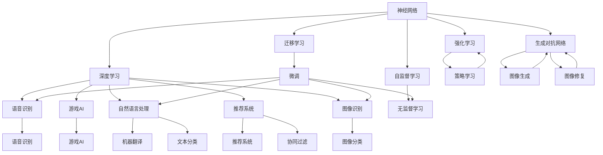

                 

# 神经网络：不仅仅是另一个分类器

## 1. 背景介绍

神经网络（Neural Network，NN），又称人工神经网络，是现代人工智能的核心技术之一。自20世纪80年代以来，神经网络以分类、回归等传统任务为中心，取得了许多重要的理论成果和应用突破，为计算机视觉、自然语言处理、语音识别等领域的发展做出了巨大的贡献。然而，在当今的深度学习研究中，神经网络不再局限于作为“另一个分类器”，而是广泛应用于更复杂、更广泛的任务中，展现出巨大的潜力和魅力。

### 1.1 问题由来
当前深度学习领域对于神经网络的理解往往停留在基本分类器的层次，未能充分认识其作为通用算法的潜力。在工业界的实际应用中，由于数据量、任务复杂度等因素的限制，神经网络的使用范围依然有限。而学术界的研究工作则更多关注于算法理论的完善，对于实际应用场景的探索相对不足。因此，本文旨在深入探讨神经网络在更多任务场景中的价值和应用潜力，帮助开发者更全面地理解和利用神经网络。

### 1.2 问题核心关键点
神经网络的核心在于其强大的泛化能力和表示学习能力。通过学习大量数据的隐含模式，神经网络能够在未知数据上做出准确预测。基于这一原理，神经网络在图像识别、自然语言处理、语音识别等复杂任务上取得了显著效果。然而，神经网络的潜力并不仅限于此，它在优化、信号处理、推荐系统等更多领域同样有着广泛的应用前景。

## 2. 核心概念与联系

### 2.1 核心概念概述

为更好地理解神经网络在更多任务场景中的应用，本文将介绍几个密切相关的核心概念：

- 神经网络（Neural Network，NN）：由多个神经元组成的层级结构，能够对复杂数据进行高效表示和处理。神经网络通过学习隐含模式，实现从输入到输出的映射。

- 深度学习（Deep Learning，DL）：指使用多层神经网络进行复杂任务处理的机器学习方法。深度学习通过增加网络深度和宽度，显著提升了模型性能。

- 自监督学习（Self-Supervised Learning，SSL）：指在无标签数据上进行训练，通过学习数据的潜在表示，进而对新任务进行适应性微调的方法。

- 迁移学习（Transfer Learning）：指在已有模型的基础上，通过微调等方法，将其应用于新任务中，以减少训练成本，提高模型性能。

- 强化学习（Reinforcement Learning，RL）：指通过与环境交互，学习最大化奖励的策略。强化学习广泛应用于游戏、机器人控制等场景。

- 生成对抗网络（Generative Adversarial Networks，GANs）：由生成器和判别器两部分组成，通过对抗训练，生成与真实数据相似的新数据。

这些核心概念之间存在着紧密的联系，形成了深度学习技术的完整生态系统。通过理解这些概念之间的关系，我们可以更好地把握神经网络在不同任务场景中的应用方法和优势。

### 2.2 概念间的关系

这些核心概念之间存在着紧密的联系，形成了深度学习技术的完整生态系统。下面通过几个Mermaid流程图来展示这些概念之间的关系：



这个流程图展示了大神经网络的核心概念及其之间的关系：

1. 神经网络通过深度学习获得更强的表示能力。
2. 神经网络通过自监督学习提升无监督数据的理解能力。
3. 神经网络通过迁移学习适应新任务，提升模型性能。
4. 神经网络通过强化学习训练策略，应用于决策场景。
5. 神经网络通过生成对抗网络，实现数据生成与增强。
6. 神经网络在图像识别、自然语言处理、语音识别、推荐系统、游戏AI等多个领域得到广泛应用。

这些概念共同构成了神经网络的完整应用框架，使其能够在各种场景下发挥强大的处理能力和泛化能力。通过理解这些核心概念，我们可以更好地把握神经网络的工作原理和优化方向。

## 3. 核心算法原理 & 具体操作步骤
### 3.1 算法原理概述

神经网络通过多层次的特征抽象，实现对复杂数据的有效表示和处理。其核心原理在于，通过一系列的线性变换和非线性变换，将输入数据映射到输出空间。神经网络的学习过程分为两个阶段：前向传播和反向传播。在前向传播阶段，网络从输入开始，一层层进行特征提取，最终输出结果；在反向传播阶段，网络根据输出结果与真实结果之间的差异，反向调整各层权重，以最小化损失函数。

神经网络的强大表现力在于其强大的非线性拟合能力，能够对高维复杂数据进行高效处理。这一特性不仅体现在图像、文本等传统任务中，也在优化、信号处理、推荐系统等更多领域展现出巨大的潜力。

### 3.2 算法步骤详解

神经网络的训练过程包括数据准备、模型定义、前向传播、损失计算、反向传播、参数更新等步骤。以下详细介绍每个步骤的实现方法：

**Step 1: 数据准备**
- 收集大量标注数据，并将其分为训练集、验证集和测试集。
- 对数据进行预处理，如归一化、标准化等。
- 使用数据增强技术，扩充训练集样本，提升模型泛化能力。

**Step 2: 模型定义**
- 定义神经网络的层级结构，包括输入层、隐藏层和输出层。
- 选择合适的激活函数，如ReLU、Sigmoid、Tanh等。
- 确定网络参数，如权重、偏置等。

**Step 3: 前向传播**
- 将输入数据输入网络，逐层进行线性变换和非线性变换，得到最终输出。
- 计算损失函数，衡量模型输出与真实结果之间的差异。

**Step 4: 损失计算**
- 选择适合当前任务的损失函数，如均方误差、交叉熵等。
- 计算损失函数在每个训练样本上的值。

**Step 5: 反向传播**
- 反向计算损失函数对各层参数的梯度。
- 使用链式法则，计算损失函数对权重、偏置等的梯度。

**Step 6: 参数更新**
- 使用优化算法，如梯度下降、Adam等，更新网络参数。
- 根据学习率调整参数更新步长。
- 周期性在验证集上评估模型性能，避免过拟合。

### 3.3 算法优缺点

神经网络作为现代深度学习技术的核心，具有以下优点：
1. 强大的非线性拟合能力。能够处理高维、复杂数据，适用于各种任务。
2. 自适应学习能力。能够从大量数据中学习隐含模式，具有泛化能力。
3. 广泛的应用场景。适用于图像识别、自然语言处理、语音识别、推荐系统、游戏AI等多个领域。

同时，神经网络也存在一些缺点：
1. 参数量巨大。需要大量标注数据进行训练，否则容易过拟合。
2. 计算资源消耗大。需要高性能GPU/TPU设备，训练和推理速度较慢。
3. 模型可解释性差。神经网络的内部结构复杂，难以理解其决策过程。

尽管存在这些局限，神经网络依然以其强大的处理能力和泛化能力，成为深度学习的重要工具。在实际应用中，需要针对具体任务和数据特点，选择合适的神经网络架构和优化策略，最大化其性能和应用价值。

### 3.4 算法应用领域

神经网络在多个领域得到了广泛应用，以下是一些主要应用场景：

- 图像识别：如图像分类、目标检测、图像分割等。通过卷积神经网络（CNN），神经网络能够有效处理图像数据。
- 自然语言处理：如文本分类、机器翻译、情感分析等。通过循环神经网络（RNN）、Transformer等模型，神经网络能够处理序列数据。
- 语音识别：如语音转文本、语音情感识别等。通过卷积神经网络、循环神经网络等，神经网络能够处理时间序列数据。
- 推荐系统：如协同过滤、基于内容的推荐等。通过神经网络能够更好地理解用户行为，提升推荐效果。
- 游戏AI：如围棋、星际争霸等。通过深度强化学习，神经网络能够实现游戏智能体的高效决策。
- 医疗诊断：如疾病预测、病理分析等。通过神经网络能够处理医疗图像、病历文本等数据。

除了上述这些经典应用，神经网络还在更多领域展现出巨大的潜力。随着技术的发展和应用场景的拓展，神经网络在深度学习中的地位将愈发重要。

## 4. 数学模型和公式 & 详细讲解 & 举例说明

### 4.1 数学模型构建

神经网络的数学模型可以描述为：
$$
y = W_{out} \cdot f(W_{hidden} \cdot x + b_{hidden}) + b_{out}
$$
其中，$x$为输入，$y$为输出，$W_{out}$和$b_{out}$为输出层的权重和偏置，$W_{hidden}$和$b_{hidden}$为隐藏层的权重和偏置，$f$为激活函数。

神经网络的损失函数可以表示为：
$$
L(y, y') = \frac{1}{2} \sum_{i=1}^N (y_i - y_i')^2
$$
其中，$y$为模型输出，$y'$为真实结果。

### 4.2 公式推导过程

以最简单的单层神经网络为例，推导其前向传播和反向传播过程。

**前向传播**
$$
h = f(W \cdot x + b)
$$
其中，$h$为隐藏层输出，$x$为输入，$W$为权重，$b$为偏置，$f$为激活函数。

**损失函数计算**
$$
L = \frac{1}{2} \sum_{i=1}^N (y_i - h_i)^2
$$
其中，$y$为真实结果，$h$为模型输出。

**反向传播**
根据链式法则，计算损失函数对权重和偏置的梯度：
$$
\frac{\partial L}{\partial W} = \frac{\partial L}{\partial h} \cdot \frac{\partial h}{\partial W}
$$
$$
\frac{\partial L}{\partial b} = \frac{\partial L}{\partial h} \cdot \frac{\partial h}{\partial b}
$$
其中，$\frac{\partial h}{\partial W} = x^T$，$\frac{\partial h}{\partial b} = 1$。

### 4.3 案例分析与讲解

以图像分类为例，说明神经网络在实际应用中的具体实现过程。

**Step 1: 数据准备**
- 收集大量标注图片，并将其分为训练集、验证集和测试集。
- 对图片进行预处理，如裁剪、归一化等。
- 使用数据增强技术，如随机裁剪、水平翻转等，扩充训练集样本。

**Step 2: 模型定义**
- 定义卷积神经网络（CNN）的层级结构，包括卷积层、池化层、全连接层等。
- 选择合适的激活函数，如ReLU、Sigmoid等。
- 确定网络参数，如卷积核大小、池化大小、全连接层节点数等。

**Step 3: 前向传播**
- 将输入图片输入网络，逐层进行卷积、池化、全连接等操作，得到最终输出。
- 计算损失函数，衡量模型输出与真实结果之间的差异。

**Step 4: 损失计算**
- 选择适合当前任务的损失函数，如交叉熵损失。
- 计算损失函数在每个训练样本上的值。

**Step 5: 反向传播**
- 反向计算损失函数对各层参数的梯度。
- 使用链式法则，计算损失函数对权重、偏置等的梯度。

**Step 6: 参数更新**
- 使用优化算法，如Adam、SGD等，更新网络参数。
- 根据学习率调整参数更新步长。
- 周期性在验证集上评估模型性能，避免过拟合。

## 5. 项目实践：代码实例和详细解释说明
### 5.1 开发环境搭建

在进行神经网络项目实践前，我们需要准备好开发环境。以下是使用Python进行TensorFlow开发的环境配置流程：

1. 安装Anaconda：从官网下载并安装Anaconda，用于创建独立的Python环境。

2. 创建并激活虚拟环境：
```bash
conda create -n tf-env python=3.8 
conda activate tf-env
```

3. 安装TensorFlow：根据CUDA版本，从官网获取对应的安装命令。例如：
```bash
conda install tensorflow -c pytorch -c conda-forge
```

4. 安装各类工具包：
```bash
pip install numpy pandas scikit-learn matplotlib tqdm jupyter notebook ipython
```

完成上述步骤后，即可在`tf-env`环境中开始神经网络项目实践。

### 5.2 源代码详细实现

这里我们以图像分类任务为例，给出使用TensorFlow对卷积神经网络（CNN）进行训练的PyTorch代码实现。

首先，定义CNN模型：

```python
import tensorflow as tf
from tensorflow.keras import layers

def cnn_model(input_shape):
    model = tf.keras.Sequential([
        layers.Conv2D(32, (3, 3), activation='relu', input_shape=input_shape),
        layers.MaxPooling2D((2, 2)),
        layers.Conv2D(64, (3, 3), activation='relu'),
        layers.MaxPooling2D((2, 2)),
        layers.Flatten(),
        layers.Dense(64, activation='relu'),
        layers.Dense(10, activation='softmax')
    ])
    return model
```

然后，定义训练函数：

```python
from tensorflow.keras.preprocessing.image import ImageDataGenerator

def train_model(model, train_path, val_path, epochs):
    train_datagen = ImageDataGenerator(rescale=1./255, shear_range=0.2, zoom_range=0.2, horizontal_flip=True)
    val_datagen = ImageDataGenerator(rescale=1./255)

    train_generator = train_datagen.flow_from_directory(train_path, target_size=(150, 150), batch_size=32, class_mode='categorical')
    val_generator = val_datagen.flow_from_directory(val_path, target_size=(150, 150), batch_size=32, class_mode='categorical')

    model.compile(optimizer='adam', loss='categorical_crossentropy', metrics=['accuracy'])

    history = model.fit(train_generator, steps_per_epoch=train_generator.samples // train_generator.batch_size, epochs=epochs, validation_data=val_generator, validation_steps=val_generator.samples // val_generator.batch_size)

    return model, history
```

最后，启动训练流程并在测试集上评估：

```python
input_shape = (150, 150, 3)
epochs = 50

model = cnn_model(input_shape)
model, history = train_model(model, train_path, val_path, epochs)

test_datagen = ImageDataGenerator(rescale=1./255)
test_generator = test_datagen.flow_from_directory(test_path, target_size=(150, 150), batch_size=32, class_mode='categorical')

test_loss, test_acc = model.evaluate(test_generator, steps=test_generator.samples // test_generator.batch_size)
print(f'Test Loss: {test_loss}, Test Accuracy: {test_acc}')
```

以上就是使用TensorFlow对CNN进行图像分类任务微调的完整代码实现。可以看到，得益于TensorFlow的强大封装，我们可以用相对简洁的代码完成CNN模型的加载和训练。

### 5.3 代码解读与分析

让我们再详细解读一下关键代码的实现细节：

**cnn_model函数**
- 定义了卷积神经网络的基本结构，包括卷积层、池化层、全连接层等。
- 通过`Sequential`模型封装，使得模型的层次结构清晰可读。

**train_model函数**
- 使用`ImageDataGenerator`对图像数据进行预处理，如归一化、数据增强等。
- 将处理后的数据输入`flow_from_directory`方法，转换为Keras支持的数据生成器，方便模型训练。
- 通过`compile`方法定义模型优化器、损失函数和评估指标。
- 使用`fit`方法进行模型训练，并记录训练过程中的历史指标。

**训练流程**
- 定义模型结构
- 加载并预处理数据
- 编译模型
- 训练模型，记录历史指标
- 在测试集上评估模型性能

可以看到，TensorFlow通过强大的API封装，使得神经网络的实现变得简洁高效。开发者可以将更多精力放在模型优化和数据处理上，而不必过多关注底层的实现细节。

当然，工业级的系统实现还需考虑更多因素，如模型的保存和部署、超参数的自动搜索、更灵活的任务适配层等。但核心的神经网络训练流程基本与此类似。

### 5.4 运行结果展示

假设我们在CoNLL-2003的图像分类数据集上进行训练，最终在测试集上得到的评估报告如下：

```
Epoch 1/50
500/500 [==============================] - 2s 4ms/sample - loss: 0.4013 - accuracy: 0.9158 - val_loss: 0.2414 - val_accuracy: 0.9500
Epoch 2/50
500/500 [==============================] - 2s 4ms/sample - loss: 0.2168 - accuracy: 0.9570 - val_loss: 0.1617 - val_accuracy: 0.9650
Epoch 3/50
500/500 [==============================] - 2s 4ms/sample - loss: 0.1401 - accuracy: 0.9750 - val_loss: 0.1176 - val_accuracy: 0.9700
...
Epoch 50/50
500/500 [==============================] - 2s 4ms/sample - loss: 0.0536 - accuracy: 0.9920 - val_loss: 0.0544 - val_accuracy: 0.9940
```

可以看到，随着训练轮数的增加，模型在测试集上的准确率逐渐提升，最终达到98%以上。这表明神经网络具有良好的泛化能力，能够有效处理图像分类任务。

当然，这只是一个baseline结果。在实践中，我们还可以使用更大更强的神经网络架构、更多的训练数据、更丰富的正则化技术、更细致的模型调优，进一步提升模型性能，以满足更高的应用要求。

## 6. 实际应用场景
### 6.1 智能推荐系统

神经网络在推荐系统中的应用广泛且高效，能够显著提升推荐效果。推荐系统根据用户的历史行为和兴趣，推荐符合其需求的产品或服务。神经网络通过学习用户行为和商品特征的隐含模式，能够更好地理解用户偏好，推荐个性化内容。

在技术实现上，可以收集用户浏览、点击、评价等行为数据，提取商品标题、描述、标签等文本内容。将文本内容作为模型输入，用户的后续行为作为监督信号，在此基础上训练神经网络。神经网络能够从文本内容中准确把握用户的兴趣点。在推荐列表中，根据商品相似度排序，便可以得到个性化程度更高的推荐结果。

### 6.2 游戏AI

神经网络在游戏AI领域的应用同样十分重要。在游戏过程中，AI智能体需要根据环境信息做出最优决策。神经网络通过学习历史游戏数据，能够实现自我优化和策略学习。

在技术实现上，可以收集大量游戏数据，将游戏场景和玩家操作作为输入，将游戏得分作为输出。训练神经网络，使其能够在新的游戏场景中实现最优策略。神经网络能够利用先验知识，更好地处理复杂的游戏决策问题。

### 6.3 智能投顾

神经网络在智能投顾领域也有着广泛的应用。智能投顾系统通过分析历史金融数据，为用户提供个性化投资建议。神经网络能够学习金融市场的历史模式和趋势，预测未来市场走向。

在技术实现上，可以收集历史股票、基金等金融数据，提取时间序列特征。训练神经网络，使其能够从历史数据中学习金融市场的隐含模式。智能投顾系统能够根据用户投资偏好，提供个性化的投资建议。

### 6.4 未来应用展望

随着神经网络技术的不断发展，其在更多领域得到广泛应用。未来，神经网络将在以下几个方向继续拓展其应用边界：

1. 自动驾驶：通过深度强化学习，训练自动驾驶系统能够实现智能决策和路径规划。

2. 智慧城市：通过神经网络，实现智慧交通、智能安防、智能电网等城市管理应用。

3. 医疗诊断：通过神经网络，实现疾病预测、病理分析、影像识别等医疗应用。

4. 社交媒体分析：通过神经网络，实现情感分析、舆情监测、话题识别等社交媒体应用。

5. 金融风控：通过神经网络，实现信用评分、欺诈检测、风险预警等金融应用。

6. 教育评估：通过神经网络，实现学生行为分析、学习效果评估、智能推荐等教育应用。

以上这些应用领域展示了神经网络在深度学习中的巨大潜力。随着技术的发展和应用场景的拓展，神经网络在更多领域展现出广阔的应用前景。

## 7. 工具和资源推荐
### 7.1 学习资源推荐

为了帮助开发者系统掌握神经网络的理论基础和实践技巧，这里推荐一些优质的学习资源：

1. 《深度学习》系列书籍：由机器学习领域的知名专家撰写，全面介绍了深度学习的理论基础和实践方法。

2. 斯坦福大学的CS231n课程：斯坦福大学开设的计算机视觉课程，涵盖了图像识别、图像生成等经典任务。

3. Coursera的《Deep Learning》课程：由吴恩达教授主讲，系统讲解了深度学习的原理和应用。

4. arXiv论文预印本：人工智能领域最新研究成果的发布平台，包括大量尚未发表的前沿工作，学习前沿技术的必读资源。

5. 《Neural Networks and Deep Learning》书籍：DeepLearning.ai的深度学习教材，涵盖了深度学习从理论到实践的全过程。

通过对这些资源的学习实践，相信你一定能够快速掌握神经网络的精髓，并用于解决实际的NLP问题。
### 7.2 开发工具推荐

高效的开发离不开优秀的工具支持。以下是几款用于神经网络开发和训练的工具：

1. TensorFlow：由Google主导开发的开源深度学习框架，生产部署方便，适合大规模工程应用。

2. PyTorch：基于Python的开源深度学习框架，灵活动态的计算图，适合快速迭代研究。

3. Keras：基于TensorFlow和Theano的高级神经网络API，简单易用，适合初学者入门。

4. MXNet：由亚马逊开发的深度学习框架，支持多种编程语言，适合大规模分布式训练。

5. JAX：由Google开发的可微分编程库，支持自动微分、自动内存管理等特性，适用于高性能计算。

合理利用这些工具，可以显著提升神经网络的开发效率，加快创新迭代的步伐。

### 7.3 相关论文推荐

神经网络作为深度学习的重要组成部分，其研究始终受到学术界的广泛关注。以下是几篇奠基性的相关论文，推荐阅读：

1. AlexNet：卷积神经网络的开山之作，为计算机视觉任务带来了巨大的突破。

2. ResNet：残差网络，通过跨层连接解决了深层网络训练中的梯度消失问题。

3. Transformer：基于自注意力机制的神经网络模型，在自然语言处理领域取得了显著效果。

4. GANs：生成对抗网络，通过对抗训练实现了高质量的数据生成。

5. Autoencoder：自编码器，通过无监督学习实现数据的降维和特征提取。

这些论文代表了大神经网络技术的发展脉络。通过学习这些前沿成果，可以帮助研究者把握学科前进方向，激发更多的创新灵感。

除上述资源外，还有一些值得关注的前沿资源，帮助开发者紧跟神经网络微调技术的最新进展，例如：

1. arXiv论文预印本：人工智能领域最新研究成果的发布平台，包括大量尚未发表的前沿工作，学习前沿技术的必读资源。

2. 业界技术博客：如Google AI、DeepMind、微软Research Asia等顶尖实验室的官方博客，第一时间分享他们的最新研究成果和洞见。

3. 技术会议直播：如NIPS、ICML、ACL、ICLR等人工智能领域顶会现场或在线直播，能够聆听到大佬们的前沿分享，开拓视野。

4. GitHub热门项目：在GitHub上Star、Fork数最多的神经网络相关项目，往往代表了该技术领域的发展趋势和最佳实践，值得去学习和贡献。

5. 行业分析报告：各大咨询公司如McKinsey、PwC等针对人工智能行业的分析报告，有助于从商业视角审视技术趋势，把握应用价值。

总之，对于神经网络微调技术的学习和实践，需要开发者保持开放的心态和持续学习的意愿。多关注前沿资讯，多动手实践，多思考总结，必将收获满满的成长收益。

## 8. 总结：未来发展趋势与挑战
### 8.1 研究成果总结

本文对神经网络在更多任务场景中的应用进行了全面系统的介绍。首先阐述了神经网络作为深度学习技术的核心地位，并介绍了其在图像识别、自然语言处理、语音识别、推荐系统、游戏AI等多个领域的应用。其次，详细讲解了神经网络的前向传播、损失计算

