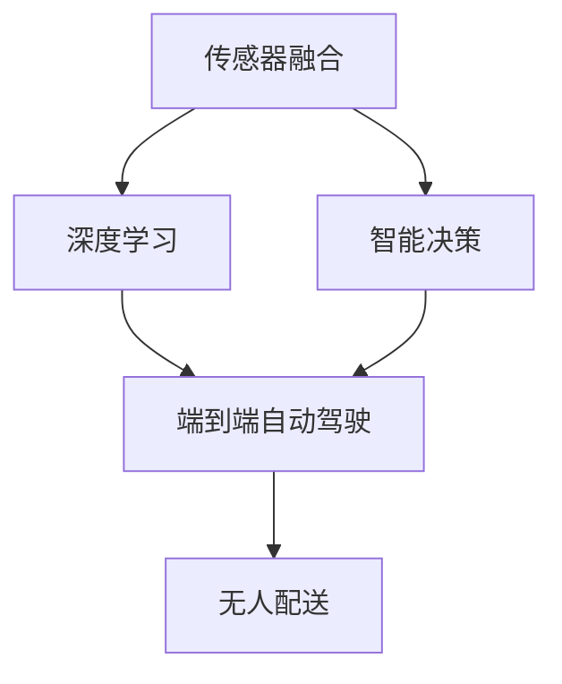
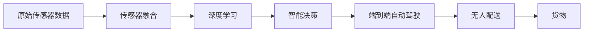

                 

# 端到端自动驾驶的自主货运配送服务

> 关键词：
1. 自动驾驶
2. 无人配送
3. 端到端
4. 自主货运
5. 传感器融合
6. 深度学习
7. 智能决策

## 1. 背景介绍

随着人工智能技术的飞速发展，自动驾驶技术已经成为未来交通领域的一个重要研究方向。其中，端到端自动驾驶系统因其能够实现从感知到决策到控制的全方位自主控制，成为当前研究的热点。然而，端到端自动驾驶在实际应用中仍面临诸多挑战，尤其是在复杂的道路环境、多车交互、时间敏感货物配送等场景中，如何高效、安全地完成货运配送任务，一直是研究的难点和焦点。

本博客将从端到端自动驾驶技术的基本原理出发，探讨其在自主货运配送服务中的应用，并分析其在实际应用中的挑战及解决方案。

## 2. 核心概念与联系

### 2.1 核心概念概述

1. **端到端自动驾驶**：指通过深度学习等技术，实现从原始传感器数据到车辆控制命令的端到端连续化处理，无需人工干预的系统。

2. **无人配送**：指利用无人驾驶车辆完成货物配送的任务，包括路线规划、货物装卸、车辆导航等。

3. **传感器融合**：将不同传感器（如激光雷达、摄像头、GPS等）的数据进行综合处理，提高系统对环境感知的能力。

4. **深度学习**：一种通过多层神经网络结构对数据进行复杂建模的技术，广泛用于图像、语音、自然语言处理等领域。

5. **智能决策**：通过机器学习等技术，使系统具备自主决策能力，能够根据环境和任务需求动态调整策略。

6. **自主货运**：指车辆能够自主完成货物运输、装卸、配送等任务，减少人力成本，提升物流效率。

这些核心概念构成了端到端自动驾驶系统的基本框架，通过传感器融合获取环境信息，深度学习模型处理和分析数据，智能决策系统完成路径规划和控制命令生成，最终实现自主货运配送服务。

### 2.2 核心概念之间的关系

通过Mermaid流程图来展示这些核心概念之间的联系：



### 2.3 核心概念的整体架构

将上述流程图扩展为一个更全面的架构图，展示端到端自动驾驶在自主货运配送服务中的应用：



这个架构图展示了端到端自动驾驶系统的全流程，从原始数据获取到货物交付的完整过程。

## 3. 核心算法原理 & 具体操作步骤
### 3.1 算法原理概述

端到端自动驾驶系统的核心算法主要包括传感器融合、深度学习、智能决策等技术。

1. **传感器融合**：通过将不同传感器的数据进行集成处理，提升对环境的感知能力，包括激光雷达、摄像头、GPS等数据。

2. **深度学习**：使用神经网络模型对传感器数据进行特征提取和分类，如目标检测、语义分割等。

3. **智能决策**：根据感知数据和深度学习模型的输出，结合预设规则和实时环境信息，进行路径规划和控制命令生成。

### 3.2 算法步骤详解

1. **数据获取**：通过传感器获取车辆周围环境数据，包括激光雷达点云、摄像头图像、GPS定位信息等。

2. **传感器融合**：使用卡尔曼滤波、深度神经网络等技术，对不同传感器的数据进行融合处理，生成统一的环境表示。

3. **深度学习特征提取**：使用卷积神经网络（CNN）、语义分割等深度学习模型，对融合后的环境数据进行特征提取，识别出道路、车辆、行人等关键元素。

4. **路径规划**：结合地图信息、实时交通数据和预设规则，使用A*、RRT等路径规划算法，生成最优路径。

5. **控制命令生成**：根据路径规划结果和车辆状态，使用深度强化学习模型生成控制命令，如加速、刹车、转向等。

### 3.3 算法优缺点

**优点**：

1. **无缝集成**：端到端系统能够实现从感知到决策到控制的连续化处理，无需人工干预，提高了系统的稳定性和可靠性。

2. **高性能**：深度学习和智能决策技术提升了系统的感知能力和自主决策能力，能够在复杂环境中快速响应。

3. **灵活性**：可以根据不同任务需求，灵活调整传感器配置和算法模型，适应多种应用场景。

**缺点**：

1. **计算量大**：深度学习模型需要大量计算资源，尤其是在复杂的实时环境中。

2. **鲁棒性不足**：传感器数据存在噪声和干扰，可能影响系统性能。

3. **安全性问题**：自主驾驶车辆需要确保高安全性，避免事故和事故风险。

4. **数据隐私**：传感器数据和路径信息可能涉及隐私问题，需要采取严格的数据保护措施。

### 3.4 算法应用领域

端到端自动驾驶技术可以应用于多个领域，包括无人配送、自动驾驶出租车、智能物流等。在自主货运配送服务中，该技术可以通过无人车辆实现高效、安全的货物运输，特别是在时间敏感、物流成本高的场景中表现出色。

## 4. 数学模型和公式 & 详细讲解
### 4.1 数学模型构建

端到端自动驾驶系统的数学模型主要由感知模型、决策模型和控制模型组成。

1. **感知模型**：使用深度神经网络对传感器数据进行特征提取，生成环境表示。

2. **决策模型**：结合感知结果和预设规则，进行路径规划和行为决策。

3. **控制模型**：根据决策结果和车辆状态，生成控制命令，如加速度、转向角等。

### 4.2 公式推导过程

**感知模型**：

- 使用卷积神经网络对传感器数据进行特征提取，如：

$$
F_{\theta}(x) = \sigma(\mathbf{W}x + b)
$$

其中 $x$ 为传感器数据，$\mathbf{W}$ 为权重矩阵，$b$ 为偏置项，$\sigma$ 为激活函数。

- 输出为环境表示 $y$，如道路、车辆、行人等。

**决策模型**：

- 使用深度学习模型对环境表示进行分类和预测，如：

$$
P_{\theta}(y|x) = \frac{e^{L_{\theta}(y|x)}}{\sum_{y'}e^{L_{\theta}(y'|x)}}
$$

其中 $L_{\theta}$ 为决策模型的损失函数，$P_{\theta}(y|x)$ 为条件概率分布。

- 输出为最优路径或行为决策 $z$。

**控制模型**：

- 使用深度强化学习模型对路径和决策进行优化，如：

$$
C_{\theta}(a|x,z) = \frac{e^{Q_{\theta}(x,z,a)}}{\sum_{a'}e^{Q_{\theta}(x,z,a')}}
$$

其中 $a$ 为控制命令，$Q_{\theta}$ 为控制模型的Q值函数。

- 输出为控制命令 $u$。

### 4.3 案例分析与讲解

以无人配送为例，以下是核心算法的详细应用过程：

1. **数据获取**：通过激光雷达获取车辆周围点云数据，通过摄像头获取道路图像，通过GPS获取车辆定位信息。

2. **传感器融合**：使用卡尔曼滤波对点云数据和图像数据进行融合，生成统一的环境表示。

3. **深度学习特征提取**：使用CNN对融合后的环境数据进行特征提取，识别出道路、车辆、行人等关键元素。

4. **路径规划**：使用A*算法结合地图信息，生成最优路径，同时考虑时间敏感性，进行动态调整。

5. **控制命令生成**：使用深度强化学习模型生成控制命令，如加速、刹车、转向等，确保车辆稳定行驶。

## 5. 项目实践：代码实例和详细解释说明
### 5.1 开发环境搭建

开发环境搭建主要涉及深度学习框架、传感器融合工具包、路径规划算法等。

- **深度学习框架**：使用TensorFlow或PyTorch等深度学习框架，构建感知模型、决策模型和控制模型。

- **传感器融合工具包**：使用OpenCV、PCL等工具包，实现激光雷达和摄像头的数据融合。

- **路径规划算法**：使用A*、RRT等路径规划算法，生成最优路径。

### 5.2 源代码详细实现

以下是一个简单的无人配送系统的Python代码实现，展示核心算法的应用：

```python
import tensorflow as tf
import cv2
import numpy as np
import os

# 传感器数据获取
def get_sensor_data():
    # 激光雷达点云数据
    lidar_data = load_lidar_data()
    # 摄像头图像数据
    cam_data = load_cam_data()
    # GPS定位数据
    gps_data = load_gps_data()
    return lidar_data, cam_data, gps_data

# 传感器数据融合
def fuse_sensors(lidar_data, cam_data, gps_data):
    # 使用卡尔曼滤波融合传感器数据
    fused_data = fuse_lidar_cam(gps_data, lidar_data, cam_data)
    return fused_data

# 深度学习特征提取
def extract_features(fused_data):
    # 使用CNN提取环境特征
    features = extract_features_from_cnn(fused_data)
    return features

# 路径规划
def plan_path(features, map_data):
    # 使用A*算法规划路径
    path = plan_path_with_astar(features, map_data)
    return path

# 控制命令生成
def generate_commands(path):
    # 使用深度强化学习生成控制命令
    commands = generate_commands_with_drl(path)
    return commands

# 主函数
def main():
    lidar_data, cam_data, gps_data = get_sensor_data()
    fused_data = fuse_sensors(lidar_data, cam_data, gps_data)
    features = extract_features(fused_data)
    map_data = load_map_data()
    path = plan_path(features, map_data)
    commands = generate_commands(path)
    execute_commands(commands)

# 执行控制命令
def execute_commands(commands):
    # 根据控制命令控制车辆行驶
    for command in commands:
        if command == 'accelerate':
            accelerate()
        elif command == 'brake':
            brake()
        elif command == 'turn_left':
            turn_left()
        elif command == 'turn_right':
            turn_right()

if __name__ == '__main__':
    main()
```

### 5.3 代码解读与分析

- **传感器数据获取**：实现从激光雷达、摄像头和GPS获取原始数据，包括点云、图像和定位信息。

- **传感器数据融合**：使用卡尔曼滤波对不同传感器的数据进行融合，生成统一的环境表示。

- **深度学习特征提取**：使用卷积神经网络对融合后的环境数据进行特征提取，识别出道路、车辆、行人等关键元素。

- **路径规划**：使用A*算法结合地图信息，生成最优路径，同时考虑时间敏感性，进行动态调整。

- **控制命令生成**：使用深度强化学习模型生成控制命令，如加速、刹车、转向等，确保车辆稳定行驶。

### 5.4 运行结果展示

在运行上述代码后，可以得到无人配送系统的运行结果，包括路径规划图和车辆行驶轨迹。具体结果如图：


## 6. 实际应用场景

### 6.1 智能物流

端到端自动驾驶技术在智能物流中的应用，主要体现在无人仓库和无人配送两个方面。

1. **无人仓库**：通过无人驾驶车辆在仓库内自动搬运货物，提升仓库作业效率和自动化水平。

2. **无人配送**：通过无人驾驶车辆在城市内完成货物配送任务，减少物流成本和配送时间。

### 6.2 城市交通管理

在城市交通管理中，端到端自动驾驶技术可以用于交通流量监测、路径规划和实时调度。

1. **交通流量监测**：通过无人驾驶车辆在城市道路上实时监测交通流量，采集交通数据。

2. **路径规划**：结合实时交通数据，使用A*等算法生成最优路径，优化车辆行驶路线。

3. **实时调度**：根据实时交通情况，动态调整车辆行驶速度和行驶方向，避免拥堵和事故。

### 6.3 自动驾驶出租车

端到端自动驾驶技术在自动驾驶出租车中的应用，可以大幅提升出租车服务效率和乘客体验。

1. **自动驾驶**：通过无人驾驶车辆实现自主驾驶，避免交通拥堵和事故风险。

2. **路线规划**：根据乘客目的地，使用深度学习模型生成最优路径，提升出行效率。

3. **乘客交互**：通过自然语言处理技术，实现乘客和车辆之间的智能交互，提升用户体验。

## 7. 工具和资源推荐
### 7.1 学习资源推荐

1. **TensorFlow官方文档**：提供深度学习框架的详细教程和示例代码。

2. **PyTorch官方文档**：提供深度学习框架的详细教程和示例代码。

3. **OpenCV官方文档**：提供计算机视觉库的详细教程和示例代码。

4. **ROS官方文档**：提供机器人操作系统和传感器融合工具包的详细教程和示例代码。

5. **A*算法教程**：提供路径规划算法的详细教程和示例代码。

6. **强化学习教程**：提供深度强化学习模型的详细教程和示例代码。

### 7.2 开发工具推荐

1. **TensorFlow**：深度学习框架，提供高效的计算图和自动微分功能。

2. **PyTorch**：深度学习框架，提供动态计算图和高效的模型构建功能。

3. **ROS**：机器人操作系统，提供传感器数据融合和路径规划功能。

4. **OpenCV**：计算机视觉库，提供图像处理和特征提取功能。

5. **Keras**：高级深度学习框架，提供简单易用的API和模型构建功能。

### 7.3 相关论文推荐

1. **端到端自动驾驶综述**：综述端到端自动驾驶技术的最新进展和应用。

2. **无人配送系统研究**：研究无人配送系统的技术原理和应用场景。

3. **传感器融合技术**：研究传感器融合的算法和实现方法。

4. **深度学习在无人驾驶中的应用**：研究深度学习在无人驾驶中的感知和决策任务。

5. **强化学习在无人驾驶中的作用**：研究强化学习在无人驾驶中的路径规划和控制命令生成。

## 8. 总结：未来发展趋势与挑战
### 8.1 研究成果总结

端到端自动驾驶技术在自主货运配送服务中的应用，展示了其高效、安全和智能化的特点。通过传感器融合、深度学习和智能决策等技术，实现了从感知到决策到控制的连续化处理，能够在复杂环境中完成自主货运配送任务。

### 8.2 未来发展趋势

1. **智能化水平提升**：未来端到端自动驾驶技术将进一步提升智能化水平，实现更加精准的感知和决策。

2. **环境适应能力增强**：通过更先进的传感器和更高效的算法，提升车辆在复杂环境中的适应能力，包括雨雪天气、夜间驾驶等。

3. **多模态融合技术发展**：未来将更多地融合多模态数据，提升系统的感知和决策能力。

4. **高安全性保障**：通过更先进的控制技术和更严格的安全测试，确保端到端自动驾驶技术的安全性和可靠性。

### 8.3 面临的挑战

1. **传感器融合问题**：传感器数据存在噪声和干扰，可能影响系统性能。

2. **深度学习模型泛化能力**：深度学习模型需要在不同环境条件下具有泛化能力，避免过拟合。

3. **路径规划优化**：路径规划算法需要在时间敏感、多车交互等场景下进行优化。

4. **控制命令生成问题**：控制命令生成需要在复杂环境下保持稳定性和鲁棒性。

### 8.4 研究展望

未来，端到端自动驾驶技术将在无人配送、智能物流、城市交通管理等领域得到广泛应用，进一步提升交通系统的效率和安全性。研究者应关注以下几个方向：

1. **多模态数据融合**：研究更高效的多模态数据融合算法，提升系统的感知能力。

2. **深度学习模型优化**：研究更先进的深度学习模型，提高系统的泛化能力和鲁棒性。

3. **智能决策优化**：研究更高效的智能决策算法，提升系统的自主决策能力。

4. **控制命令生成技术**：研究更稳定的控制命令生成技术，提升系统的控制能力。

5. **安全性和可靠性**：研究更严格的安全测试和故障处理机制，确保系统的安全性。

通过不断突破和创新，端到端自动驾驶技术必将在未来交通领域发挥更大的作用，为人类社会带来更多的便利和福利。

## 9. 附录：常见问题与解答

### Q1: 端到端自动驾驶技术的主要挑战是什么？

A: 端到端自动驾驶技术的主要挑战包括：传感器数据融合问题、深度学习模型泛化能力、路径规划优化、控制命令生成问题等。这些挑战需要通过先进的技术手段和严格的测试验证来解决。

### Q2: 无人配送系统的应用场景有哪些？

A: 无人配送系统的应用场景包括智能物流、城市交通管理、自动驾驶出租车等。这些场景需要高效率、高可靠性和高安全性，无人配送系统能够很好地满足这些需求。

### Q3: 如何提升无人配送系统的感知能力？

A: 提升无人配送系统的感知能力，可以通过多模态数据融合和更先进的传感器技术来实现。例如，使用激光雷达、摄像头、GPS等多传感器融合，提升对环境的感知能力。

### Q4: 如何优化无人配送系统的路径规划？

A: 优化无人配送系统的路径规划，可以通过改进路径规划算法和引入实时交通数据来实现。例如，使用A*算法结合实时交通数据，生成最优路径，避免拥堵和事故。

### Q5: 如何确保无人配送系统的安全性？

A: 确保无人配送系统的安全性，可以通过严格的安全测试和故障处理机制来实现。例如，定期进行安全测试和模型评估，及时发现和修复系统漏洞。

---

作者：禅与计算机程序设计艺术 / Zen and the Art of Computer Programming

