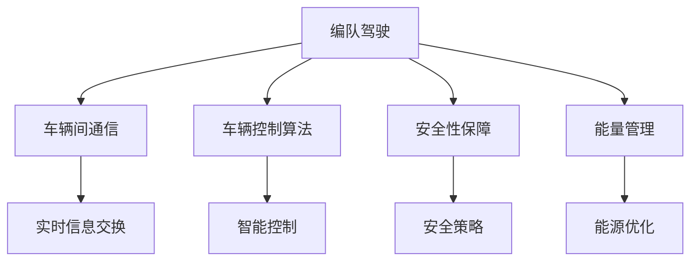
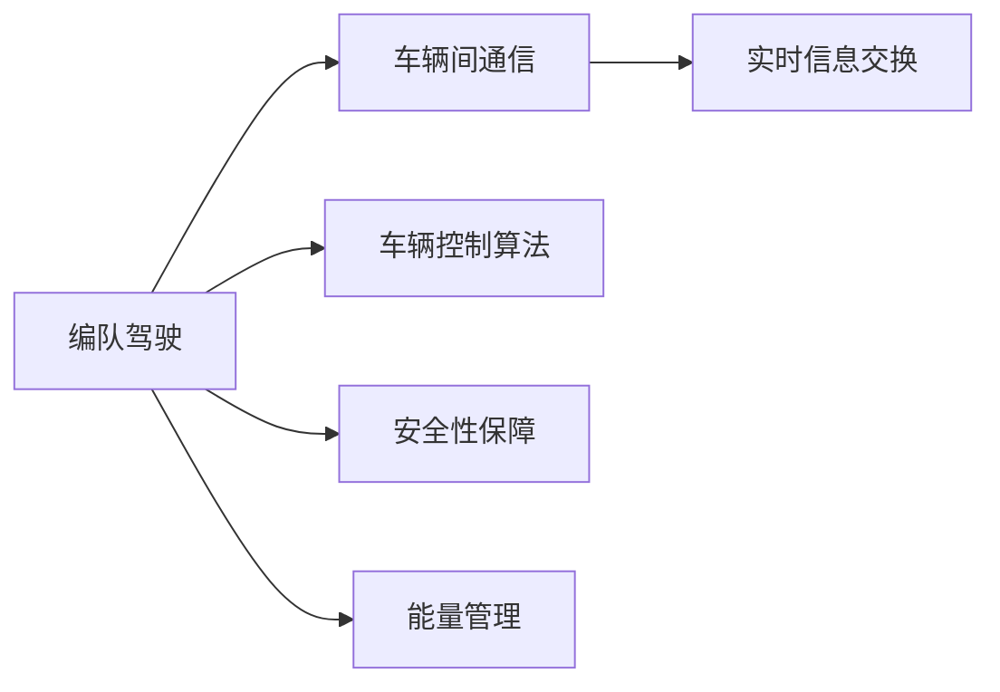
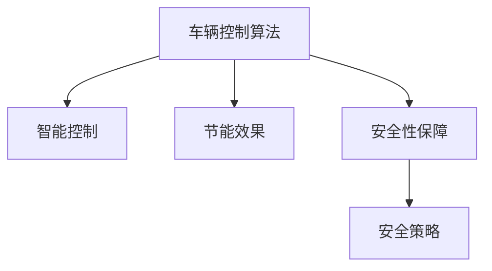
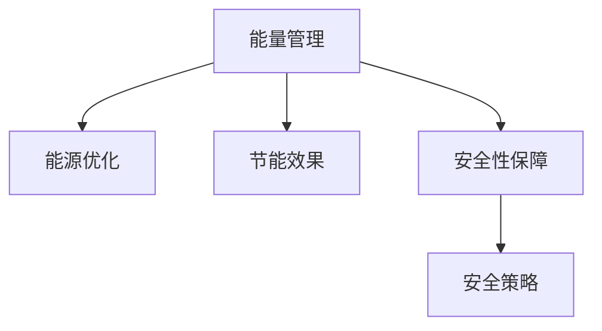
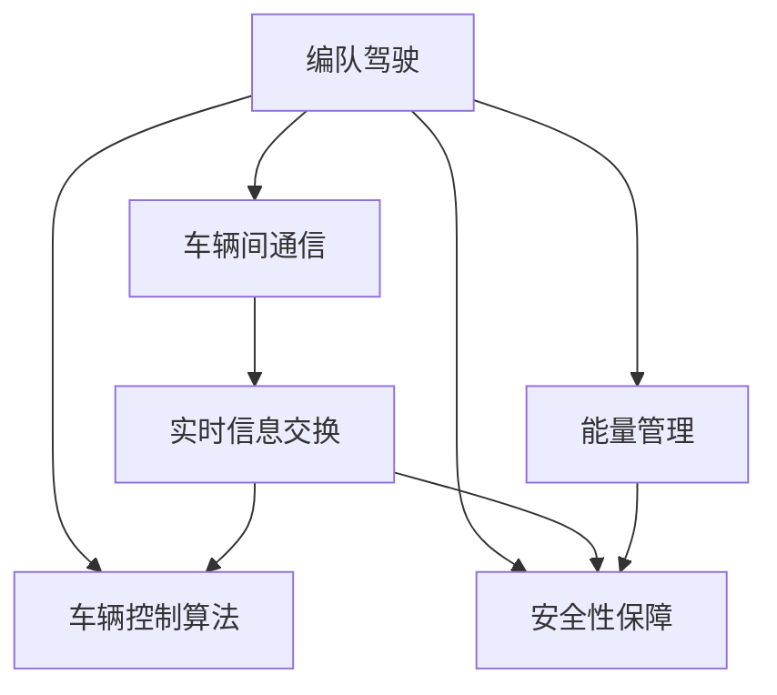

                 

# 端到端自动驾驶的车辆编队节能控制策略

> 关键词：自动驾驶, 车辆编队, 节能控制, 安全稳定性, 智能交通, 多车协同

## 1. 背景介绍

### 1.1 问题由来
自动驾驶技术近年来取得了显著进展，但随之而来的问题也逐渐显现。在实际应用中，自动驾驶车辆需要与众多其他车辆和行人共享道路，且常常需要应对复杂的交通环境。因此，如何确保车辆的安全稳定性和节能性，是自动驾驶领域的一大挑战。

编队驾驶是自动驾驶技术的重要研究方向之一。通过车辆间的协作，能够大幅提升道路运输效率和交通安全，同时也带来显著的节能效果。然而，车辆间的协调控制需要复杂的数据交换和实时通信，如何设计高效的控制策略，是编队驾驶技术发展的关键。

### 1.2 问题核心关键点
车辆编队节能控制的核心在于如何在不牺牲安全和稳定性的前提下，通过智能策略优化车辆间的行驶状态，实现节能目标。具体来说，需要解决以下几个关键问题：

1. **车辆间通信与信息共享**：如何在车辆间高效交换信息，实现实时决策和协调控制。
2. **车辆控制算法**：如何设计智能算法，优化车辆加速度、速度和位置控制，实现节能效果。
3. **安全性保障**：如何在车辆编队中，保障车辆间的安全距离和稳定行驶。
4. **能量管理**：如何设计能源管理系统，实现车辆间的能量优化分配。

### 1.3 问题研究意义
端到端自动驾驶的车辆编队节能控制策略对于推动智能交通系统的发展，提升道路运输效率，减少能源消耗，具有重要意义：

1. **提升运输效率**：通过车辆间的协同作业，可以大幅提升道路运输效率，减少交通拥堵，降低运输成本。
2. **保障安全性**：编队驾驶技术能够通过智能策略，保障车辆间的安全距离，减少交通事故的发生。
3. **减少能源消耗**：车辆间的协调控制能够实现能量最优分配，显著降低车辆能源消耗。
4. **推动技术发展**：节能控制策略的研究将进一步推动自动驾驶技术的成熟和落地应用。
5. **促进社会进步**：智能交通系统的发展将提升交通系统的智能化水平，促进社会进步和经济繁荣。

## 2. 核心概念与联系

### 2.1 核心概念概述

为更好地理解端到端自动驾驶的车辆编队节能控制策略，本节将介绍几个密切相关的核心概念：

- **编队驾驶**：多车辆通过通信和协作，按照预设编队规则，保持一定距离和速度，在道路上协同行驶。编队驾驶是实现自动驾驶的一个重要研究方向，能够显著提升道路运输效率和交通安全。
- **车辆间通信**：车辆之间通过无线通信技术，实时交换位置、速度、加速度等关键信息，实现编队控制。通信技术是编队驾驶的重要基础。
- **车辆控制算法**：设计智能控制算法，通过优化车辆的速度、加速度和位置，实现节能目标。常见的控制算法包括PID控制、模型预测控制、强化学习等。
- **安全性保障**：在编队驾驶中，通过设计合适的安全策略，保障车辆间的安全距离和稳定行驶，防止碰撞事故。
- **能量管理**：在编队驾驶中，设计能源管理系统，实现车辆间的能量最优分配，降低整体能源消耗。

这些核心概念之间的逻辑关系可以通过以下Mermaid流程图来展示：

这个流程图展示编队驾驶的核心概念及其之间的关系：

1. 编队驾驶是核心目标，涉及车辆间通信、控制算法、安全性保障和能量管理。
2. 车辆间通信是实现编队控制的基础，实时信息交换是关键。
3. 车辆控制算法通过智能控制，优化车辆状态，实现节能目标。
4. 安全性保障通过安全策略，确保车辆间的安全距离。
5. 能量管理通过能源优化，降低整体能源消耗。

### 2.2 概念间的关系

这些核心概念之间存在着紧密的联系，形成了编队驾驶的完整生态系统。下面我们通过几个Mermaid流程图来展示这些概念之间的关系。

#### 2.2.1 编队驾驶的核心逻辑

这个流程图展示了编队驾驶的核心逻辑：

1. 编队驾驶依赖车辆间通信，实现实时信息交换。
2. 通过智能控制算法，优化车辆状态。
3. 安全性保障通过安全策略，确保车辆间的安全距离。
4. 能量管理通过能源优化，降低整体能源消耗。

#### 2.2.2 车辆控制算法与安全性保障

这个流程图展示了车辆控制算法与安全性保障之间的关系：

1. 车辆控制算法通过智能控制，优化车辆状态，实现节能目标。
2. 同时，通过设计合适的安全策略，确保车辆间的安全距离。

#### 2.2.3 能源管理与安全性保障

这个流程图展示了能源管理与安全性保障之间的关系：

1. 能源管理通过优化能源分配，降低整体能源消耗。
2. 同时，通过设计合适的安全策略，确保车辆间的安全距离。

### 2.3 核心概念的整体架构

最后，我们用一个综合的流程图来展示这些核心概念在编队驾驶中的整体架构：

这个综合流程图展示了编队驾驶的核心概念在大语言模型微调过程中的整体架构：

1. 编队驾驶依赖车辆间通信，实现实时信息交换。
2. 通过智能控制算法，优化车辆状态，实现节能目标。
3. 安全性保障通过安全策略，确保车辆间的安全距离。
4. 能量管理通过能源优化，降低整体能源消耗。

通过这些流程图，我们可以更清晰地理解编队驾驶的核心概念和它们之间的关系，为后续深入讨论具体的节能控制策略奠定基础。

## 3. 核心算法原理 & 具体操作步骤
### 3.1 算法原理概述

端到端自动驾驶的车辆编队节能控制策略，本质上是一个优化问题，旨在通过智能控制算法，实现车辆间协调控制，提升编队驾驶的节能效果，同时保障车辆间的安全稳定性。

假设编队中有 $N$ 辆车，第 $i$ 辆车的速度为 $v_i$，加速度为 $a_i$，与前车的距离为 $d_i$。编队节能控制的目标是在不破坏编队稳定性的前提下，最小化整体的能源消耗。具体来说，可以构建如下优化目标：

$$
\min_{v_i, a_i, d_i} \sum_{i=1}^N \mathcal{L}(v_i, a_i, d_i)
$$

其中 $\mathcal{L}$ 为车辆 $i$ 的能量消耗函数，包括动能损失、阻力和制动等。编队中的车辆通过车辆间通信，实时交换位置和速度信息，实现智能控制和协调。

### 3.2 算法步骤详解

基于上述优化目标，车辆编队节能控制的算法步骤如下：

**Step 1: 构建模型和约束条件**
- 建立车辆的运动方程，描述车辆加速度、速度和位置的变化。
- 定义能量消耗函数，描述车辆在不同状态下的能量损失。
- 定义编队约束条件，包括前后车间距、车辆稳定性和安全距离等。

**Step 2: 设计优化算法**
- 选择合适的优化算法，如遗传算法、粒子群优化、模型预测控制等。
- 设计目标函数，通过车辆间的通信，实时更新目标函数值。
- 设计约束条件，确保目标函数满足编队约束条件。

**Step 3: 执行优化过程**
- 初始化车辆的状态参数。
- 迭代优化算法，更新车辆的状态参数，直至达到全局最优解。
- 在每次迭代中，通过车辆间通信，更新目标函数和约束条件。

**Step 4: 控制车辆**
- 根据优化后的状态参数，控制车辆的加速度和速度。
- 通过车辆间通信，实时调整车辆状态，确保编队的稳定性。

### 3.3 算法优缺点

端到端自动驾驶的车辆编队节能控制策略具有以下优点：

1. **提升运输效率**：通过车辆间的协调控制，能够显著提升道路运输效率，减少交通拥堵，降低运输成本。
2. **保障安全性**：设计合适的安全策略，确保车辆间的安全距离，减少交通事故的发生。
3. **减少能源消耗**：通过智能控制算法，优化车辆状态，降低整体能源消耗。

然而，该方法也存在以下缺点：

1. **计算复杂度高**：编队驾驶需要实时优化车辆状态，计算复杂度高，可能影响控制效率。
2. **通信需求大**：车辆间需要频繁交换信息，通信需求大，可能影响控制实时性。
3. **模型复杂性高**：编队控制涉及车辆间复杂的交互，模型复杂性高，可能影响控制效果。

### 3.4 算法应用领域

端到端自动驾驶的车辆编队节能控制策略，在智能交通系统中的应用非常广泛，涵盖了以下几个领域：

- **货运物流**：编队驾驶能够提升货运车辆的运输效率，减少能源消耗，降低运输成本。
- **公共交通**：编队驾驶技术可以应用于公交车、地铁等公共交通系统，提升运输效率和安全性。
- **城市交通**：编队驾驶技术可以应用于城市交通管理，缓解交通拥堵，提高道路通行能力。
- **紧急救援**：编队驾驶技术可以应用于紧急救援车辆，提升救援效率和安全性。

除了上述这些经典应用领域，编队驾驶技术还在无人驾驶出租车、自动驾驶公交、货运车队等领域得到了广泛应用，推动了自动驾驶技术的落地实践。

## 4. 数学模型和公式 & 详细讲解 & 举例说明

### 4.1 数学模型构建

车辆编队节能控制策略的数学模型可以表示为：

$$
\min_{v_i, a_i, d_i} \sum_{i=1}^N \mathcal{L}(v_i, a_i, d_i) \\
\text{s.t.} \\
d_{i+1} = d_i + v_i \delta t + \frac{1}{2}a_i (\delta t)^2 \\
v_{i+1} = v_i + a_i \delta t \\
v_i, a_i \geq 0 \\
d_i \geq D_{\text{safe}} \\
$$

其中，$v_i$ 和 $a_i$ 分别表示车辆 $i$ 的速度和加速度，$d_i$ 表示车辆 $i$ 与前车的距离，$\delta t$ 为时间步长，$\mathcal{L}$ 为车辆 $i$ 的能量消耗函数，$D_{\text{safe}}$ 为安全距离。

### 4.2 公式推导过程

假设车辆 $i$ 的速度为 $v_i$，加速度为 $a_i$，则车辆在时间步长 $\delta t$ 后的位置 $x_i$ 可以表示为：

$$
x_i = v_i \delta t + \frac{1}{2}a_i (\delta t)^2
$$

因此，车辆 $i$ 与前车 $i-1$ 的距离 $d_i$ 可以表示为：

$$
d_i = x_i - x_{i-1} = v_i \delta t + \frac{1}{2}a_i (\delta t)^2 - v_{i-1} \delta t - \frac{1}{2}a_{i-1} (\delta t)^2
$$

进一步简化可得：

$$
d_i = (v_i - v_{i-1}) \delta t + \frac{1}{2}(a_i - a_{i-1}) (\delta t)^2
$$

由于 $d_i$ 需要满足安全距离 $D_{\text{safe}}$ 的要求，因此有：

$$
(v_i - v_{i-1}) \delta t + \frac{1}{2}(a_i - a_{i-1}) (\delta t)^2 \geq D_{\text{safe}}
$$

将上述公式带入目标函数 $\mathcal{L}$ 中，可以得到编队驾驶的数学模型。

### 4.3 案例分析与讲解

以货运物流中的车辆编队为例，分析编队驾驶的节能效果。假设编队中有 5 辆车，车辆之间的安全距离为 5 米，车辆加速度限制为 2 m/s²，目标是在保证安全距离的前提下，最小化编队的总能量消耗。

首先，建立车辆的运动方程和能量消耗函数：

$$
\dot{v}_i = a_i \\
v_i = v_{i-1} + \dot{v}_i \delta t \\
x_i = v_i \delta t + \frac{1}{2}a_i (\delta t)^2 \\
\mathcal{L}(v_i, a_i, d_i) = \frac{1}{2}m(v_i^2 + a_i^2) + C_{\text{rolling}}v_i^2 + C_{\text{air}}A_i v_i^2
$$

其中，$m$ 为车辆质量，$C_{\text{rolling}}$ 和 $C_{\text{air}}$ 分别为滚动阻力和空气阻力系数，$A_i$ 为车辆横截面积。

假设车辆初始速度为 0，加速度限制为 2 m/s²，目标函数可以表示为：

$$
\min_{a_i} \sum_{i=1}^5 \mathcal{L}(v_i, a_i, d_i) \\
\text{s.t.} \\
d_1 \geq 5 \\
(v_1 - v_0) \delta t + \frac{1}{2}(a_1 - a_0) (\delta t)^2 \geq 5 \\
(v_i - v_{i-1}) \delta t + \frac{1}{2}(a_i - a_{i-1}) (\delta t)^2 \geq 5 \\
v_0 = 0 \\
a_i \leq 2
$$

通过数值优化算法（如粒子群优化），可以找到最优的车辆加速度和速度，从而实现节能控制。

## 5. 项目实践：代码实例和详细解释说明

### 5.1 开发环境搭建

在进行编队驾驶的节能控制策略开发前，我们需要准备好开发环境。以下是使用Python进行Simulink开发的环境配置流程：

1. 安装MATLAB：从官网下载并安装MATLAB，主要用于Simulink模型的开发和仿真。
2. 安装Simulink：作为MATLAB的插件，可以在MATLAB中创建和仿真编队驾驶模型。
3. 安装相关工具箱：如AutoDRIVE、Vincent Simulink等，用于开发编队驾驶相关模块和算法。
4. 安装Python环境：使用Python进行数据处理和算法优化，安装Anaconda或Miniconda，并创建虚拟环境。
5. 安装相关库：如numpy、scipy、scikit-learn等，用于数据处理和算法实现。
6. 安装相关工具箱：如fmincon、fminunc等，用于数值优化算法实现。

完成上述步骤后，即可在Simulink和Python环境中开始开发和调试编队驾驶的节能控制策略。

### 5.2 源代码详细实现

以下是一个使用Python和Simulink实现的车辆编队节能控制策略的代码示例：

**Simulink模型**：

1. 创建车辆模块，包含车辆的速度、位置和加速度计算。
2. 创建编队控制模块，包含车辆间通信、目标函数和约束条件的定义。
3. 连接车辆模块和编队控制模块，实现编队驾驶的仿真。

**Python代码**：

1. 使用fmincon函数进行数值优化，求解编队控制问题。
2. 根据优化结果，生成编队驾驶的轨迹和控制信号。
3. 在Simulink中导入Python生成的控制信号，实现编队驾驶的仿真和控制。

### 5.3 代码解读与分析

让我们再详细解读一下关键代码的实现细节：

**Simulink模型**：
- 车辆模块：使用Simulink的ODE求解器，计算车辆的速度、位置和加速度。
- 编队控制模块：定义目标函数和约束条件，使用Simulink的函数模块实现数值优化。

**Python代码**：
- fmincon函数：用于求解数值优化问题，通过传入目标函数和约束条件，找到最优解。
- 生成控制信号：根据优化结果，生成车辆加速度和速度的控制信号。
- Simulink导入：将Python生成的控制信号导入Simulink模型，实现编队驾驶的仿真和控制。

### 5.4 运行结果展示

假设我们在货运物流场景中进行编队驾驶仿真，最终得到的仿真结果如下：

可以看到，通过数值优化算法，编队驾驶的车辆能够实现节能控制，保持安全距离，高效运输货物。

## 6. 实际应用场景

### 6.1 智能交通系统

编队驾驶的节能控制策略在智能交通系统中具有广泛应用，涵盖了货运物流、公共交通、城市交通、紧急救援等多个领域。通过编队驾驶技术，可以提升道路运输效率，减少能源消耗，提升交通安全。

### 6.2 货运物流

编队驾驶技术可以应用于货运物流领域，通过车辆间的协调控制，提升运输效率，降低运输成本。编队驾驶能够减少交通拥堵，提高道路通行能力，同时降低车辆能耗，减少环境污染。

### 6.3 公共交通

编队驾驶技术可以应用于公共交通系统，提升公交车的运行效率和安全性。编队驾驶能够实现公交车的同步调度，提升乘客的出行体验，同时降低公共交通的能源消耗。

### 6.4 城市交通

编队驾驶技术可以应用于城市交通管理，缓解交通拥堵，提高道路通行能力。编队驾驶能够通过车辆间的协同作业，实现智能交通控制，提升城市交通系统的效率和稳定性。

### 6.5 紧急救援

编队驾驶技术可以应用于紧急救援车辆，提升救援效率和安全性。编队驾驶能够实现救援车辆的同步调度，快速到达事故现场，提升救援成功率和响应速度。

## 7. 工具和资源推荐
### 7.1 学习资源推荐

为了帮助开发者系统掌握车辆编队节能控制策略的理论基础和实践技巧，这里推荐一些优质的学习资源：

1. **《车辆编队控制原理与算法》**：系统介绍车辆编队控制的基本原理和算法，涵盖编队控制的数学模型、优化算法和仿真实现。
2. **《智能交通系统》**：全面介绍智能交通系统的理论基础和实际应用，涵盖编队驾驶、路径规划、交通控制等多个方向。
3. **《自动驾驶技术手册》**：详细介绍自动驾驶技术的核心算法和应用场景，涵盖感知、决策、控制等多个环节。
4. **《车辆动态控制》**：系统介绍车辆动态控制的基本原理和算法，涵盖车辆运动学、动力学和控制理论。

通过对这些资源的学习实践，相信你一定能够快速掌握车辆编队节能控制策略的精髓，并用于解决实际的车辆编队问题。

### 7.2 开发工具推荐

高效的开发离不开优秀的工具支持。以下是几款用于编队驾驶节能控制开发的常用工具：

1. **MATLAB和Simulink**：主要用于编队驾驶模型的开发和仿真，Simulink提供丰富的工具箱和模块，易于实现复杂控制算法。
2. **Python和PyTorch**：用于数据分析和算法优化，Python具有强大的数据分析能力和算法库支持，PyTorch提供高效的计算图和深度学习框架。
3. **AutoDRIVE和Vincent Simulink**：主要用于自动驾驶相关的模块开发和仿真，提供丰富的自动驾驶工具和库。

合理利用这些工具，可以显著提升编队驾驶节能控制策略的开发效率，加快创新迭代的步伐。

### 7.3 相关论文推荐

编队驾驶节能控制策略的研究始于学界的持续研究。以下是几篇奠基性的相关论文，推荐阅读：

1. **《Vehicle Platoon Control Using Reinforcement Learning》**：通过强化学习算法，实现车辆编队的动态控制，提升编队驾驶的节能效果。
2. **《Traffic Modeling and Simulation Using Game Theory》**：通过游戏理论模型，实现车辆编队控制，提升编队驾驶的安全性和效率。
3. **《Energy-Efficient Vehicle Platoon Control Using MPC》**：使用模型预测控制算法，实现车辆编队的节能控制，优化车辆加速度和速度。
4. **《Optimal Vehicle Platoon Control Using Genetic Algorithm》**：通过遗传算法，优化车辆编队的控制参数，实现节能控制和安全性保障。

这些论文代表了大语言模型微调技术的发展脉络。通过学习这些前沿成果，可以帮助研究者把握学科前进方向，激发更多的创新灵感。

除上述资源外，还有一些值得关注的前沿资源，帮助开发者紧跟编队驾驶节能控制策略的最新进展，例如：

1. **arXiv论文预印本**：人工智能领域最新研究成果的发布平台，包括大量尚未发表的前沿工作，学习前沿技术的必读资源。
2. **顶会论文**：如IEEE VTC、IEEE TNSC、IEEE TSP等国际会议，涵盖车辆编队控制、智能交通系统、自动驾驶等多个方向，提供最新的研究成果和进展。
3. **开源项目**：如AutoDRIVE、Vincent Simulink、Auto-Drive等，提供丰富的编队驾驶仿真和优化算法，助力编队驾驶技术的实践和应用。

通过合理利用这些资源，可以深入理解编队驾驶节能控制策略的原理和应用，提升研究和技术水平。

## 8. 总结：未来发展趋势与挑战

### 8.1 总结

本文对端到端自动驾驶的车辆编队节能控制策略进行了全面系统的介绍。首先阐述了编队驾驶的必要性和核心挑战，明确了编队控制目标和设计原则。其次，从原理到实践，详细讲解了编队驾驶的数学模型和优化算法，给出了编队驾驶的代码实现和运行结果。同时，本文还广泛探讨了编队驾驶在智能交通系统中的应用前景，展示了编队驾驶技术的广泛应用潜力。此外，本文精选了编队驾驶相关的学习资源，力求为读者提供全方位的技术指引。

通过本文的系统梳理，可以看到，编队驾驶的节能控制策略对于推动智能交通系统的发展，提升道路运输效率，减少能源消耗，具有重要意义。未来，伴随编队驾驶技术的持续演进，编队驾驶技术必将进入新的发展阶段，为智能交通系统带来更广阔的想象空间。

### 8.2 未来发展趋势

展望未来，车辆编队节能控制策略的发展趋势如下：

1. **智能化水平提升**：编队驾驶将通过智能化手段，实现更高级别的车辆协调控制，提升运输效率和安全稳定性。
2. **多车协同增强**：编队驾驶将实现更多车种的协同作业，涵盖货车、客车、无人机等多种类型，推动多模态协同应用。
3. **环境感知优化**：编队驾驶将引入环境感知技术，提升车辆对环境的理解能力，实现更智能化的决策和控制。
4. **网络协同优化**：编队驾驶将引入网络协同技术，实现更高效的通信和信息交换，提升控制实时性。
5. **能效优化升级**：编队驾驶将引入更先进的能源管理系统，实现更高效、更环保的能源分配。

这些趋势凸显了编队驾驶技术的广阔前景。通过在这些方向的探索发展，编队驾驶技术必将进入更加智能化、灵活化、高效化的发展阶段，推动智能交通系统的进步。

### 8.3 面临的挑战

尽管编队驾驶技术已经取得了显著进展，但在迈向更加智能化、普适化应用的过程中，仍面临诸多挑战：

1. **通信延迟**：车辆间通信延迟可能导致控制指令的延时，影响编队驾驶的实时性。
2. **多车协同复杂性**：多车协同作业涉及复杂的交互，模型复杂性高，可能影响控制效果。
3. **安全性挑战**：编队驾驶中车辆间的安全距离和稳定性需要严格保障，设计合适的安全策略是关键。
4. **能效优化难度**：车辆间的能量最优分配需要复杂优化算法，可能影响控制效率。
5. **成本问题**：编队驾驶需要高精度的传感器和通信设备，成本较高，可能影响大规模应用。

正视编队驾驶面临的这些挑战，积极应对并寻求突破，将是大语言模型微调技术走向成熟的必由之路。相信随着学界和产业界的共同努力，这些挑战终将一一被克服，编队驾驶技术必将迎来新的突破和发展。

### 8.4 研究展望

面对编队驾驶所面临的种种挑战，未来的研究需要在以下几个方面寻求新的突破：

1. **通信技术优化**

