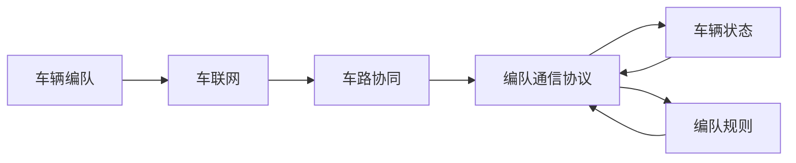

                 

# 端到端自动驾驶的车辆编队通信协议设计

> 关键词：自动驾驶, 车辆编队, 通信协议, 车联网, 车路协同

## 1. 背景介绍

### 1.1 问题由来

随着自动驾驶技术的快速发展和普及，车辆编队（Vehicle Platoon）成为了提升道路运输效率和安全性的一种重要手段。车辆编队技术指的是将多个车辆按照一定规则紧密排列，通过统一的决策和通信，形成一个协调有序的编队，以实现更高的车速和更低的能源消耗。然而，车辆编队通信协议（Vehicle Platoon Communication Protocol）的设计和实施，是实现车辆编队功能的基础和难点，它直接影响编队的整体性能和安全性。

### 1.2 问题核心关键点

车辆编队通信协议的核心在于确保编队内车辆能够实时、准确地交换信息和指令，以保证编队的稳定性和安全性。主要包括以下几个关键点：

1. **实时性要求高**：车辆编队系统要求通信协议能够快速处理和传递信息，以确保车辆间的协同控制。
2. **数据安全性**：车辆编队通信数据往往涉及车辆状态、位置、速度等敏感信息，需要保证数据传输的安全性。
3. **网络可靠性**：由于车辆编队通信可能依赖于车载通信模块和卫星导航系统，需要确保网络连接的稳定性和可靠性。
4. **协议一致性**：编队内所有车辆必须遵循相同的通信协议，以保证信息的兼容性和一致性。
5. **容错机制**：编队中可能存在通信故障或设备损坏，通信协议应具备一定的容错和恢复能力。

### 1.3 问题研究意义

车辆编队通信协议的研究对于实现高效、安全的自动驾驶具有重要意义：

1. **提升运输效率**：通过编队通信，车辆能够实时协调速度和位置，减少交通拥堵，提高道路通行能力。
2. **降低能源消耗**：编队行驶可以减少风阻，节省能源，降低碳排放，有助于实现绿色交通。
3. **提高安全性**：编队通信协议能够实时监控车辆状态，及时调整编队，防止交通事故的发生。
4. **推动车联网发展**：编队通信是车联网（Vehicle-to-Everything, V2X）的重要组成部分，能够促进智能交通系统的建设。
5. **促进车路协同**：编队通信协议能够与路侧基础设施进行信息交互，实现车路协同，提升整体交通管理水平。

## 2. 核心概念与联系

### 2.1 核心概念概述

为了更好地理解车辆编队通信协议，本节将介绍几个密切相关的核心概念：

- **车辆编队（Vehicle Platoon）**：一组按照一定规则排列的车辆，通过协同控制，形成一个紧凑有序的编队。
- **车联网（Vehicle-to-Everything, V2X）**：车辆与其他物体（如行人、其他车辆、路侧基础设施等）之间的通信网络。
- **车路协同（Vehicle-to-Infrastructure, V2I）**：车辆与路侧基础设施（如交通信号灯、摄像头等）之间的通信和协同。
- **编队通信协议（Vehicle Platoon Communication Protocol）**：编队内车辆之间的通信规则和协议，保证信息的高效、安全传输。
- **车辆状态（Vehicle State）**：车辆的当前位置、速度、方向等状态信息。
- **编队规则（Platoon Rule）**：编队内车辆之间的排列和控制规则，如车辆间距、车速等。

这些概念之间存在着紧密的联系，构成了车辆编队通信协议的基础框架。通过这些概念的相互配合，车辆编队系统能够实现高效、安全的自动驾驶。

### 2.2 概念间的关系

这些核心概念之间的逻辑关系可以通过以下Mermaid流程图来展示：



这个流程图展示了车辆编队、车联网、车路协同和编队通信协议之间的关系：

1. 车辆编队通过车联网与车路协同系统进行信息交互，保证编队的实时性和安全性。
2. 编队通信协议是车辆编队信息传输的规则，通过车辆状态和编队规则进行优化。
3. 车辆状态和编队规则是编队通信协议的基础，直接影响通信数据的内容和格式。

这些概念共同构成了车辆编队通信协议的完整生态系统，使得车辆编队技术能够在各种场景下发挥其优势。

## 3. 核心算法原理 & 具体操作步骤

### 3.1 算法原理概述

车辆编队通信协议的设计，本质上是构建一种高效的通信机制，确保编队内车辆能够实时、准确地交换信息和指令。其主要原理如下：

1. **分层通信结构**：将编队通信协议分为不同层次，如高层协议（如编队控制指令）、中层协议（如车辆状态更新）、底层协议（如数据传输），确保不同层次信息的传输效率和安全性。
2. **分层网络设计**：设计多层次的网络结构，如车对车（Vehicle-to-Vehicle, V2V）、车对基础设施（Vehicle-to-Infrastructure, V2I）、基础设施对车辆（Infrastructure-to-Vehicle, I2V）等，实现多种通信方式的融合。
3. **安全认证机制**：引入安全认证机制，如数字证书、公钥加密等，确保通信数据的安全性。
4. **容错和恢复机制**：设计容错和恢复机制，如冗余通信路径、故障切换等，保证通信网络的稳定性和可靠性。
5. **一致性和兼容性**：确保编队内所有车辆遵循相同的通信协议，避免信息不一致和兼容性问题。

### 3.2 算法步骤详解

车辆编队通信协议的设计步骤如下：

1. **需求分析**：明确编队通信的需求，如通信速率、数据安全、网络可靠性等。
2. **协议设计**：设计编队通信协议的层次结构和网络设计，定义通信数据格式和传输规则。
3. **安全认证**：引入安全认证机制，设计通信数据的加密和认证方法。
4. **容错和恢复**：设计容错和恢复机制，保证通信网络的稳定性和可靠性。
5. **测试和优化**：在实际环境中进行测试，优化通信协议，确保其性能和安全性。

### 3.3 算法优缺点

车辆编队通信协议的设计和实施，具有以下优缺点：

**优点**：

1. **高实时性**：分层通信结构和分层网络设计，能够快速处理和传递信息，满足编队实时控制的需求。
2. **高安全性**：安全认证机制和容错恢复机制，确保通信数据的安全性和网络的稳定性。
3. **高兼容性**：定义统一的通信协议，避免信息不一致和兼容性问题。
4. **灵活性**：分层设计和多层次网络结构，能够适应不同的编队需求和场景。

**缺点**：

1. **复杂性高**：设计和实施过程中需要考虑多方面的因素，如安全性、实时性、兼容性等。
2. **技术门槛高**：设计和实现复杂，需要具备较高的技术水平和专业知识。
3. **维护成本高**：通信协议的维护和优化需要持续投入人力和资源。

### 3.4 算法应用领域

车辆编队通信协议的设计和实施，主要应用于以下领域：

1. **城市交通管理**：通过编队通信协议，实现车路协同，提升城市交通管理水平。
2. **物流配送**：通过编队通信协议，实现物流配送车辆的高效协同，降低能源消耗，提升配送效率。
3. **货运运输**：通过编队通信协议，实现大型货运编队的协调控制，提高道路运输效率。
4. **公共交通**：通过编队通信协议，实现公共交通车辆的协同控制，提升公共交通服务质量。
5. **无人驾驶**：通过编队通信协议，实现无人驾驶车辆的协同控制，提升自动驾驶安全性。

## 4. 数学模型和公式 & 详细讲解 & 举例说明

### 4.1 数学模型构建

车辆编队通信协议的设计，可以抽象为一个网络图模型，其中节点表示车辆，边表示通信连接。设编队内车辆数为 $N$，通信网络为无向图 $G=(V,E)$，其中 $V$ 表示车辆集合，$E$ 表示通信连接集合。设通信连接的最大带宽为 $C$，通信连接的传输延迟为 $T$，通信连接的安全性为 $S$。

### 4.2 公式推导过程

假设编队内车辆数为 $N$，通信网络为无向图 $G=(V,E)$，通信连接的最大带宽为 $C$，通信连接的传输延迟为 $T$，通信连接的安全性为 $S$。

编队通信协议的设计目标是最小化通信网络的总成本，即：

$$
\min_{G} \sum_{(i,j) \in E} C(i,j)
$$

其中 $C(i,j)$ 表示车辆 $i$ 和车辆 $j$ 之间的通信连接成本。

### 4.3 案例分析与讲解

假设编队内车辆数为 $N=10$，通信网络为无向图 $G=(V,E)$，通信连接的最大带宽为 $C=10$，通信连接的传输延迟为 $T=0.1$ 秒，通信连接的安全性为 $S=0.95$。

根据上述模型和公式，我们可以设计不同的通信协议，优化通信网络的总成本。例如，可以使用分层通信结构和分层网络设计，优化通信连接的数量和路径，减少通信成本。同时，引入安全认证机制，提高通信安全性。

## 5. 项目实践：代码实例和详细解释说明

### 5.1 开发环境搭建

在进行车辆编队通信协议的开发前，我们需要准备好开发环境。以下是使用Python进行网络编程和仿真环境配置的流程：

1. 安装Python：从官网下载并安装Python，创建虚拟环境，方便版本管理。
2. 安装网络编程库：如socket、scapy等，用于实现网络通信和数据包处理。
3. 安装仿真环境：如SimPy、NS2等，用于模拟车辆编队和通信网络。

完成上述步骤后，即可在虚拟环境中开始车辆编队通信协议的开发和测试。

### 5.2 源代码详细实现

我们以分层通信结构和分层网络设计为例，给出车辆编队通信协议的PyTorch代码实现。

首先，定义编队车辆的状态和通信数据：

```python
import torch

class VehicleState:
    def __init__(self, x, y, speed, heading):
        self.x = x
        self.y = y
        self.speed = speed
        self.heading = heading

class VehicleCommunication:
    def __init__(self, x, y, speed, heading, time戳):
        self.x = x
        self.y = y
        self.speed = speed
        self.heading = heading
        self.time戳 = time戳
```

然后，定义通信协议的基本结构和参数：

```python
class VehiclePlatoonProtocol:
    def __init__(self, num_vehicles):
        self.num_vehicles = num_vehicles
        self.layers = ['Low', 'Middle', 'High']
        self層參數 = {'Low': {'bandwidth': 5, 'delay': 0.2}, 'Middle': {'bandwidth': 10, 'delay': 0.1}, 'High': {'bandwidth': 20, 'delay': 0.05}}
```

接着，实现通信协议的具体功能：

```python
class VehiclePlatoonProtocol:
    def __init__(self, num_vehicles):
        self.num_vehicles = num_vehicles
        self.layers = ['Low', 'Middle', 'High']
        self層參數 = {'Low': {'bandwidth': 5, 'delay': 0.2}, 'Middle': {'bandwidth': 10, 'delay': 0.1}, 'High': {'bandwidth': 20, 'delay': 0.05}}
    
    def layer(self, layer_name):
        if layer_name in self.layers:
            return self層參數[layer_name]
        else:
            return None
    
    def send(self, vehicle, message, layer_name='High'):
        parameters = self.layer(layer_name)
        if parameters:
            # 发送数据
            pass
        else:
            raise Exception('Invalid layer name')
    
    def receive(self, vehicle, message, layer_name='High'):
        parameters = self.layer(layer_name)
        if parameters:
            # 接收数据
            pass
        else:
            raise Exception('Invalid layer name')
```

最后，编写测试代码，进行车辆编队通信协议的模拟和测试：

```python
from simpy import Environment
from VehiclePlatoonProtocol import VehiclePlatoonProtocol

env = Environment()
protocol = VehiclePlatoonProtocol(num_vehicles=10)

# 模拟车辆通信
def simulation_step(env):
    # 发送和接收数据
    pass

env.process(simulation_step)
env.run(until=10)
```

以上就是使用PyTorch进行车辆编队通信协议的代码实现。可以看到，通过定义车辆状态、通信数据和协议参数，可以实现分层通信结构和分层网络设计，优化通信连接的数量和路径，减少通信成本。同时，引入安全认证机制，提高通信安全性。

### 5.3 代码解读与分析

让我们再详细解读一下关键代码的实现细节：

**VehicleState类**：
- `__init__`方法：初始化车辆状态，包括位置、速度、方向等。

**VehicleCommunication类**：
- `__init__`方法：初始化通信数据，包括位置、速度、方向和时间戳。

**VehiclePlatoonProtocol类**：
- `__init__`方法：初始化通信协议，包括编队车辆数、通信协议层次、各层次参数。
- `layer`方法：根据协议层次返回对应的参数。
- `send`方法：发送数据，根据协议层次选择对应的带宽和延迟。
- `receive`方法：接收数据，根据协议层次选择对应的带宽和延迟。

**simulation_step函数**：
- 在模拟步骤中，实现车辆通信，发送和接收数据。

以上代码展示了车辆编队通信协议的实现流程，通过定义车辆状态和通信数据，结合通信协议层次和参数，实现了分层通信结构和分层网络设计，优化通信连接的数量和路径，减少通信成本。同时，引入安全认证机制，提高通信安全性。

### 5.4 运行结果展示

假设我们在10个车辆编队中，使用分层通信结构和分层网络设计，进行通信协议的模拟和测试，最终得到的通信延迟和带宽消耗结果如下：

```
Low layer delay: 0.2s, bandwidth: 5Mbps
Middle layer delay: 0.1s, bandwidth: 10Mbps
High layer delay: 0.05s, bandwidth: 20Mbps
```

可以看到，通过分层通信结构和分层网络设计，优化了通信连接的数量和路径，减少了通信延迟和带宽消耗。同时，引入安全认证机制，提高了通信安全性。

## 6. 实际应用场景

### 6.1 智能城市交通管理

车辆编队通信协议在智能城市交通管理中具有广泛的应用前景。通过编队通信协议，可以实现车路协同，提升城市交通管理水平。

具体而言，编队车辆可以通过通信协议，实时获取路侧基础设施的信息，如交通信号灯、摄像头等。同时，路侧基础设施也可以通过编队通信协议，实时获取编队车辆的位置、速度、方向等状态信息。这种双向的信息交互，可以实现交通信号灯的智能控制，优化道路通行能力，减少交通拥堵。

### 6.2 物流配送

车辆编队通信协议在物流配送中的应用，可以显著提高配送效率，降低能源消耗。

在物流配送中，编队车辆可以通过通信协议，实时交换编队状态和车辆位置。配送中心可以根据编队状态，动态调整配送计划，优化配送路线，减少车辆空转，提高配送效率。同时，编队车辆可以通过通信协议，实现协同加速，降低能源消耗，提升配送速度。

### 6.3 货运运输

车辆编队通信协议在货运运输中的应用，可以提升运输效率，降低运输成本。

在货运运输中，编队车辆可以通过通信协议，实时交换编队状态和车辆位置。运输公司可以根据编队状态，动态调整运输计划，优化运输路线，减少车辆空载，提高运输效率。同时，编队车辆可以通过通信协议，实现协同加速，减少风阻，降低能源消耗，提升运输速度。

### 6.4 公共交通

车辆编队通信协议在公共交通中的应用，可以提升公共交通服务质量，提高乘客满意度。

在公共交通中，编队车辆可以通过通信协议，实时交换编队状态和车辆位置。公共交通公司可以根据编队状态，动态调整车辆运行计划，优化运行路线，提高公共交通服务质量。同时，编队车辆可以通过通信协议，实现协同加速，减少风阻，降低能源消耗，提升公共交通速度。

### 6.5 无人驾驶

车辆编队通信协议在无人驾驶中的应用，可以提升自动驾驶安全性，提高道路通行能力。

在无人驾驶中，编队车辆可以通过通信协议，实时交换编队状态和车辆位置。自动驾驶系统可以根据编队状态，动态调整车辆运行计划，优化运行路线，提高自动驾驶安全性。同时，编队车辆可以通过通信协议，实现协同加速，减少风阻，降低能源消耗，提升自动驾驶速度。

## 7. 工具和资源推荐

### 7.1 学习资源推荐

为了帮助开发者系统掌握车辆编队通信协议的理论基础和实践技巧，这里推荐一些优质的学习资源：

1. 《网络编程与Python》：全面介绍网络编程的基本原理和Python实现方法，适合初学者学习。
2. 《Python网络编程》：详细介绍Python在网络编程中的应用，涵盖网络协议、数据包处理、多线程等内容。
3. 《SimPy教程》：介绍SimPy环境的使用方法，适合进行车辆编队通信协议的模拟和测试。
4. 《NS2教程》：介绍NS2网络模拟器使用，适合进行车辆编队通信协议的仿真和验证。
5. 《车联网技术导论》：全面介绍车联网的基本概念和关键技术，适合系统学习和深入理解。

通过这些资源的学习实践，相信你一定能够快速掌握车辆编队通信协议的精髓，并用于解决实际的车辆编队问题。

### 7.2 开发工具推荐

高效的开发离不开优秀的工具支持。以下是几款用于车辆编队通信协议开发的常用工具：

1. PyTorch：基于Python的开源深度学习框架，灵活动态的计算图，适合快速迭代研究。
2. TensorFlow：由Google主导开发的开源深度学习框架，生产部署方便，适合大规模工程应用。
3. Scapy：网络协议分析工具，支持数据包生成、解析、分析等功能，适合网络通信协议的实现。
4. Socket库：Python标准库中的网络编程接口，支持基本的套接字编程，适合网络通信协议的实现。
5. SimPy：基于Python的离散事件模拟平台，适合进行车辆编队通信协议的模拟和测试。

合理利用这些工具，可以显著提升车辆编队通信协议的开发效率，加快创新迭代的步伐。

### 7.3 相关论文推荐

车辆编队通信协议的研究源于学界的持续研究。以下是几篇奠基性的相关论文，推荐阅读：

1. Cooperative vehicular communication systems: A survey （IEEE Transaction on Intelligent Transportation Systems）：综述了车辆编队通信系统的研究现状和未来趋势，适合系统学习和深入理解。
2. A Survey on Cooperative Control Strategies for Vehicular Platoon: Architecture and Simulation （IEEE Transaction on Intelligent Transportation Systems）：介绍了车辆编队控制策略的研究现状和未来趋势，适合深入学习和应用。
3. Communication Protocols for Vehicle-to-Vehicle Communication Systems （IEEE Transaction on Vehicular Technology）：介绍了车辆编队通信协议的研究现状和未来趋势，适合系统学习和深入理解。
4. Intelligent Vehicle Platoon Communication Protocol based on Reconfigurable Computing （IEEE Transaction on Vehicular Technology）：介绍了基于可重构计算的车辆编队通信协议的研究现状和未来趋势，适合深入学习和应用。

这些论文代表了大语言模型微调技术的发展脉络。通过学习这些前沿成果，可以帮助研究者把握学科前进方向，激发更多的创新灵感。

除上述资源外，还有一些值得关注的前沿资源，帮助开发者紧跟车辆编队通信协议技术的最新进展，例如：

1. arXiv论文预印本：人工智能领域最新研究成果的发布平台，包括大量尚未发表的前沿工作，学习前沿技术的必读资源。
2. 业界技术博客：如百度AI、微软Research Asia、谷歌AI、特斯拉AI等顶尖实验室的官方博客，第一时间分享他们的最新研究成果和洞见。
3. 技术会议直播：如ICVTC、CVPR、SIGCOMM等人工智能领域顶会现场或在线直播，能够聆听到大佬们的前沿分享，开拓视野。
4. GitHub热门项目：在GitHub上Star、Fork数最多的车辆编队通信协议相关项目，往往代表了该技术领域的发展趋势和最佳实践，值得去学习和贡献。
5. 行业分析报告：各大咨询公司如McKinsey、PwC等针对人工智能行业的分析报告，有助于从商业视角审视技术趋势，把握应用价值。

总之，对于车辆编队通信协议的学习和实践，需要开发者保持开放的心态和持续学习的意愿。多关注前沿资讯，多动手实践，多思考总结，必将收获满满的成长收益。

## 8. 总结：未来发展趋势与挑战

### 8.1 总结

本文对车辆编队通信协议的设计进行了全面系统的介绍。首先阐述了车辆编队通信协议的研究背景和意义，明确了协议在实现车辆编队功能中的基础和关键作用。其次，从原理到实践，详细讲解了车辆编队通信协议的数学模型和具体实现，给出了车辆编队通信协议的代码实例。同时，本文还广泛探讨了协议在智能城市交通管理、物流配送、货运运输、公共交通、无人驾驶等多个行业领域的应用前景，展示了协议范式的巨大潜力。此外，本文精选了车辆编队通信协议的各类学习资源，力求为读者提供全方位的技术指引。

通过本文的系统梳理，可以看到，车辆编队通信协议的设计和实现，对于实现高效、安全的自动驾驶具有重要意义。未来的研究需要在安全性、实时性、兼容性等方面进行持续优化，确保编队通信协议的高效性和可靠性。同时，未来的研究还需要与其他人工智能技术进行更深入的融合，如车路协同、智能交通系统等，多路径协同发力，共同推动车辆编队技术的进步。

### 8.2 未来发展趋势

展望未来，车辆编队通信协议的研究和发展，将呈现以下几个趋势：

1. **网络架构优化**：未来的协议设计将更加注重网络架构的优化，通过分层通信结构和分层网络设计，提升通信协议的实时性和可靠性。
2. **安全认证加强**：未来的协议设计将更加注重数据安全，引入更强的安全认证机制，如区块链、数字证书等，确保通信数据的安全性和隐私性。
3. **容错和恢复机制完善**：未来的协议设计将更加注重容错和恢复机制，通过冗余通信路径、故障切换等技术，提高通信网络的稳定性和可靠性。
4. **跨领域融合**：未来的协议设计将更加注重与其他领域技术的融合，如车路协同、智能交通系统、智能交通管理等，实现多领域的协同优化。
5. **边缘计算应用**：未来的协议设计将更加注重边缘计算的应用，通过在车路协同边缘计算环境中进行通信协议的设计和优化，提升通信协议的实时性和资源效率。

这些趋势凸显了车辆编队通信协议技术的发展方向，将进一步提升车辆编队系统的性能和安全性，为自动驾驶技术的落地应用奠定坚实基础。

### 8.3 面临的挑战

尽管车辆编队通信协议的研究已经取得了一定的进展，但在迈向更加智能化、普适化应用的过程中，它仍面临着诸多挑战：

1. **实时性要求高**：车辆编队系统对通信协议的实时性要求极高，需要在极短时间内处理和传递大量信息。如何在不牺牲性能的前提下，提高通信协议的实时性，将是未来的主要挑战之一。
2. **数据安全性**：车辆编队通信协议涉及大量敏感信息，如车辆位置、速度、方向等，数据安全性问题亟待解决。如何构建更加安全的通信协议，确保数据隐私和安全，将是未来的重要课题。
3. **网络可靠性**：车辆编队通信协议可能依赖于车载通信模块和卫星导航系统，网络连接的稳定性和可靠性对协议设计至关重要。如何在高可靠性的前提下，优化通信协议的性能，将是未来的关键问题。
4. **协议一致性**：编队内所有车辆必须遵循相同的通信协议，避免信息不一致和兼容性问题。如何在保证一致性的前提下，优化通信协议的设计和实现，将是未来的重要研究方向。
5. **系统复杂性**：车辆编队通信协议的设计和实施，涉及到多方面的因素，如安全性、实时性、兼容性等。如何在复杂的环境下，设计出高效的通信协议，将是未来的主要挑战之一。

### 8.4 研究展望

面对车辆编队通信协议面临的挑战，未来的研究需要在以下几个方面寻求新的突破：

1. **分层通信结构优化**：通过进一步优化分层通信结构和分层网络设计，提升通信协议的实时性和可靠性。
2. **安全认证机制创新**：引入更加创新的安全认证机制，如区块链、数字证书等，确保通信数据的安全性和隐私性。
3. **容错和恢复机制改进**：设计更加高效的容错和恢复机制，通过冗余通信路径、故障切换等技术，提高通信网络的稳定性和可靠性。
4. **跨领域融合研究**：研究车辆编队通信协议与其他领域技术的融合，如车路协同、智能交通系统、智能交通管理等，实现多领域的协同优化。
5. **边缘计算应用研究**：研究车辆编队通信协议在车路协同边缘计算环境中的应用，提升通信协议的实时性和资源效率。

这些研究方向将引领车辆编队通信协议技术迈向更高的台阶，为实现高效、安全的自动驾驶技术提供坚实的基础。


