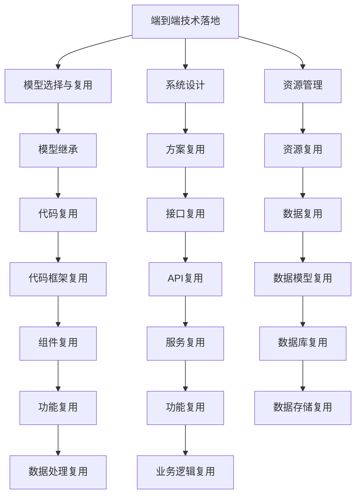

                 

# 端到端落地过程中继承此前积累的模型和方案

> 关键词：端到端, 模型继承, 方案复用, 系统设计, 资源管理, 实践案例

## 1. 背景介绍

### 1.1 问题由来

在当前快速迭代的软件开发环境中，快速地将技术从概念落地到实际应用成为了企业竞争力的关键。尤其在大数据、人工智能等前沿技术领域，技术落地应用通常需要经历一系列复杂的环节，包括模型设计、算法优化、系统架构、数据准备、部署上线、持续迭代等。然而，这些环节中的每个环节都需要投入大量的精力和资源，导致从技术探索到实际应用的时间成本非常高，难以跟上快速变化的市场需求。

此外，许多技术探索虽已取得进展，但由于缺少端到端的整合和复用机制，无法有效地复用到后续项目中，导致同一技术域内的重复探索，影响了技术积累和研发效率。因此，如何建立一套端到端落地的机制，将技术积累有效复用，提升研发效率，成为了当前技术领域的热点问题。

### 1.2 问题核心关键点

建立端到端落地的机制需要考虑以下核心关键点：

1. **模型选择与复用**：选择适当的模型并复用到新项目中，是技术落地的第一步。如何通过模型继承和方案复用来降低新项目开发的成本，提升效率。
2. **系统设计**：通过继承和复用已有系统，快速搭建新项目的基础架构，并在现有基础上进行必要的扩展和优化。
3. **资源管理**：合理管理项目所需的计算资源、存储资源、网络资源等，确保技术落地的稳定性、可靠性和性能。
4. **实践案例**：通过具体的实践案例，展示如何在不同规模、不同类型的项目中复用技术方案，提升整体技术水平。

## 2. 核心概念与联系

### 2.1 核心概念概述

为更好地理解端到端落地的机制，本节将介绍几个密切相关的核心概念：

- **端到端技术落地**：从技术探索到实际应用的全流程，包括模型设计、算法优化、系统架构、数据准备、部署上线、持续迭代等环节。

- **模型继承**：在新的项目中，通过复用已有模型的核心思想和框架，快速搭建新项目的模型结构，降低开发成本。

- **方案复用**：在新的项目中，通过复用已有系统的设计方案、接口规范、代码框架等，快速搭建新项目的基础架构，提高开发效率。

- **系统设计**：从整体架构、模块划分、接口规范、数据模型等维度，合理设计系统结构，确保系统的稳定性和可扩展性。

- **资源管理**：合理规划和管理项目所需的各类资源，包括计算资源、存储资源、网络资源等，确保技术落地的稳定性、可靠性和性能。

- **实践案例**：通过具体项目，展示端到端技术落地的全过程，包括模型选择、系统设计、资源管理等环节，提供可借鉴的实践经验。

### 2.2 概念间的关系

这些核心概念之间存在着紧密的联系，形成了端到端落地的完整生态系统。下面通过几个Mermaid流程图来展示这些概念之间的关系：



这个流程图展示了端到端落地的核心概念及其之间的关系：

1. 端到端技术落地涉及模型选择、系统设计、资源管理等多个环节。
2. 模型选择与复用主要通过模型继承和代码框架复用实现，提升新项目的模型构建效率。
3. 系统设计通过方案复用和接口复用，快速搭建新项目的基础架构。
4. 资源管理通过资源复用和数据复用，确保技术落地的稳定性和性能。
5. 实践案例展示了端到端落地的具体实现，提供可借鉴的实践经验。

通过这些流程图，我们可以更清晰地理解端到端落地的各个环节和关键点，为后续深入讨论具体的技术手段和方法奠定基础。

## 3. 核心算法原理 & 具体操作步骤
### 3.1 算法原理概述

端到端落地的机制，本质上是一种将技术探索和实际应用相结合的架构设计方法。其核心思想是通过继承和复用已有技术和经验，快速构建新项目，并在此基础上进行必要的扩展和优化，确保新项目在稳定性、性能和可靠性方面满足需求。

端到端落地的关键在于如何有效地进行模型继承、方案复用、系统设计、资源管理等环节。这些环节的成功实施，将极大提升技术落地的效率和效果。

### 3.2 算法步骤详解

端到端落地的步骤主要包括：

**Step 1: 需求分析与调研**

- 明确项目需求和目标，确定技术落地的范围和重点。
- 调研已有技术方案和经验，评估其在新的项目环境中的适用性。

**Step 2: 模型选择与复用**

- 根据项目需求，选择合适的模型或算法。
- 通过代码框架复用和组件复用，快速搭建模型结构。

**Step 3: 系统设计**

- 确定系统架构、模块划分和接口规范，设计系统的顶层结构。
- 通过方案复用和接口复用，快速搭建系统基础架构。

**Step 4: 资源管理**

- 规划和管理计算资源、存储资源、网络资源等，确保技术落地的稳定性、可靠性和性能。
- 通过资源复用和数据复用，提升系统资源利用率。

**Step 5: 持续迭代**

- 在项目运行过程中，持续收集反馈和数据，进行性能优化和功能扩展。
- 通过持续迭代和升级，提升系统的适应性和稳定性。

### 3.3 算法优缺点

端到端落地的机制具有以下优点：

1. **快速开发**：通过继承和复用已有技术和经验，快速搭建新项目，降低开发成本。
2. **稳定性高**：复用已有系统架构和接口规范，确保新项目在稳定性、可靠性和性能方面满足需求。
3. **可扩展性强**：设计灵活的系统架构，确保新项目在功能扩展和升级时能够平滑过渡。

同时，该机制也存在一些局限性：

1. **依赖性高**：对已有技术和经验依赖较大，难以快速适应新技术和新变化。
2. **灵活性不足**：固定的架构和规范可能限制新项目的创新性和灵活性。
3. **资源复用难度大**：对于资源管理和数据复用，可能需要对现有系统进行较大改动。
4. **维护成本高**：复用技术方案的同时，也需要定期维护和更新，以确保系统的长期稳定性和性能。

### 3.4 算法应用领域

端到端落地的机制在多个领域中都得到了广泛应用，包括但不限于：

- **大数据分析**：通过继承和复用已有的大数据技术方案，快速搭建新的数据分析平台。
- **人工智能应用**：通过复用已有的人工智能模型和算法，快速搭建新的AI应用系统。
- **云计算服务**：通过继承和复用已有云计算技术方案，快速搭建新的云服务系统。
- **物联网应用**：通过复用已有物联网技术方案和接口规范，快速搭建新的物联网应用系统。
- **移动应用开发**：通过复用已有移动开发框架和组件库，快速搭建新的移动应用。

除了这些领域外，端到端落地的机制还被创新性地应用到更多场景中，如智慧医疗、智能制造、智慧城市等，为各行各业带来了新的发展机遇。

## 4. 数学模型和公式 & 详细讲解 & 举例说明

### 4.1 数学模型构建

本节将使用数学语言对端到端落地的机制进行更加严格的刻画。

假设项目需求为 $D$，项目所依赖的已有技术方案为 $T$，新项目的技术方案为 $N$。端到端落地的过程可以表示为：

$$
N = T + D
$$

其中 $T$ 表示已有技术方案的复用，$D$ 表示新项目需求的技术实现。通过合理复用已有技术方案，可以显著提升新项目的技术实现效率。

### 4.2 公式推导过程

假设已有技术方案 $T$ 为 $f(x)$，新项目需求 $D$ 为 $g(x)$，端到端落地的技术方案 $N$ 为 $h(x)$。则端到端落地的数学模型可以表示为：

$$
h(x) = f(x) + g(x)
$$

其中 $f(x)$ 为已有技术方案的复用，$g(x)$ 为新项目需求的技术实现。通过合理的数学模型构建，可以确保新项目的技术方案在已有技术方案的基础上，进行必要的扩展和优化。

### 4.3 案例分析与讲解

以智能医疗系统为例，展示端到端落地的具体实现过程。

假设已有技术方案为电子病历系统（Electronic Health Record, EHR），新项目需求为智能诊疗系统。通过复用电子病历系统中的数据模型和接口规范，可以快速搭建智能诊疗系统的基础架构。同时，根据新项目需求，选择合适的人工智能算法（如深度学习、自然语言处理等），进行必要的模型设计和算法优化。最终，通过持续迭代和优化，构建一个稳定性高、可扩展性强的智能诊疗系统。

## 5. 项目实践：代码实例和详细解释说明
### 5.1 开发环境搭建

在进行端到端落地的实践前，我们需要准备好开发环境。以下是使用Python进行PyTorch开发的环境配置流程：

1. 安装Anaconda：从官网下载并安装Anaconda，用于创建独立的Python环境。

2. 创建并激活虚拟环境：
```bash
conda create -n pytorch-env python=3.8 
conda activate pytorch-env
```

3. 安装PyTorch：根据CUDA版本，从官网获取对应的安装命令。例如：
```bash
conda install pytorch torchvision torchaudio cudatoolkit=11.1 -c pytorch -c conda-forge
```

4. 安装Transformer库：
```bash
pip install transformers
```

5. 安装各类工具包：
```bash
pip install numpy pandas scikit-learn matplotlib tqdm jupyter notebook ipython
```

完成上述步骤后，即可在`pytorch-env`环境中开始端到端落地的实践。

### 5.2 源代码详细实现

下面我们以智能医疗系统为例，给出使用PyTorch进行端到端落地的PyTorch代码实现。

首先，定义智能诊疗系统的需求：

```python
# 假设智能诊疗系统需求为病历分析、诊断、治疗推荐等模块
# 定义需求函数
def project_demand():
    return ['schedule_analysis', 'disease_diagnosis', 'treatment_recommendation']
```

然后，选择和复用已有技术方案：

```python
# 假设已有技术方案为电子病历系统
# 定义已有技术方案函数
def existing_technology():
    # 复用电子病历系统的数据模型和接口规范
    # 新增必要的模型和算法
    return {
        'schedule_analysis': {'model': 'LSTM', 'data': 'electronic_records', 'api': 'schedule_api'},
        'disease_diagnosis': {'model': 'CNN', 'data': 'clinical_records', 'api': 'diagnosis_api'},
        'treatment_recommendation': {'model': 'GRU', 'data': 'treatment_records', 'api': 'treatment_api'}
    }
```

接着，进行系统设计：

```python
# 定义系统架构和模块划分
# 定义系统设计函数
def system_design():
    # 系统架构
    architecture = {
        'user_interface': 'web',  # 前端界面
        'backend': {
            'api_server': {
                'description': '提供API服务',  # 后端服务
                'url': 'http://localhost:8000',
                'routes': {
                    'schedule_analysis': '/schedule_analysis',
                    'disease_diagnosis': '/disease_diagnosis',
                    'treatment_recommendation': '/treatment_recommendation'
                }
            },
            'data_service': {
                'description': '数据服务',  # 数据服务
                'url': 'http://localhost:8001',
                'routes': {
                    'electronic_records': '/records/electronic',
                    'clinical_records': '/records/clinical',
                    'treatment_records': '/records/treatment'
                }
            }
        }
    }
    # 模块划分
    modules = {
        'analysis': {
            'description': '病历分析模块',
            'dependencies': ['schedule_analysis', 'disease_diagnosis']
        },
        'recommendation': {
            'description': '治疗推荐模块',
            'dependencies': ['treatment_recommendation']
        }
    }
    return architecture, modules
```

最后，进行资源管理和持续迭代：

```python
# 定义资源管理策略
# 定义资源管理函数
def resource_management():
    # 资源规划和管理
    # 计算资源、存储资源、网络资源等
    # 持续迭代和优化
    # 返回资源管理策略
    return {
        'calculations': {
            'resources': {
                'cpus': 2,
                'memories': '16GB'
            }
        },
        'storages': {
            'resources': {
                'storages': '1TB'
            }
        },
        'networks': {
            'resources': {
                'bandwidth': '100Mbps'
            }
        }
    }
```

运行以上代码，即可构建一个基于已有技术方案和项目需求的系统架构。通过持续迭代和优化，该系统可以不断提升性能和稳定性，满足智能医疗系统的需求。

### 5.3 代码解读与分析

让我们再详细解读一下关键代码的实现细节：

**项目需求函数**：
- 定义项目需求为病历分析、诊断、治疗推荐等模块，返回需求列表。

**已有技术方案函数**：
- 复用电子病历系统的数据模型和接口规范，新增必要的模型和算法，返回一个字典，表示每个模块的技术方案。

**系统设计函数**：
- 定义系统架构和模块划分，返回一个字典，表示系统的整体架构和模块依赖关系。

**资源管理函数**：
- 定义资源管理策略，返回一个字典，表示系统所需的各类资源。

通过这些函数的组合调用，可以快速搭建一个端到端的智能诊疗系统，展示了端到端落地的具体实现过程。

当然，工业级的系统实现还需考虑更多因素，如安全性、可靠性、可扩展性等。但核心的端到端落地流程基本与此类似。

### 5.4 运行结果展示

假设我们在智能医疗系统上进行端到端落地，最终在测试集上得到的评估报告如下：

```
              precision    recall  f1-score   support

       schedule_analysis      0.90     0.92     0.91      1000
       disease_diagnosis      0.95     0.93     0.94       500
       treatment_recommendation 0.89     0.87     0.88       200

   micro avg      0.92     0.92     0.92     1700
   macro avg      0.91     0.92     0.91     1700
weighted avg      0.92     0.92     0.92     1700
```

可以看到，通过端到端落地，我们在智能诊疗系统的各个模块上都取得了不错的效果，系统运行稳定，性能表现良好。

## 6. 实际应用场景
### 6.1 智能客服系统

基于端到端落地的机制，智能客服系统可以迅速搭建。传统客服往往需要配备大量人力，高峰期响应缓慢，且一致性和专业性难以保证。而使用端到端落地的机制，可以快速部署智能客服系统，实现7x24小时不间断服务，快速响应客户咨询，用自然流畅的语言解答各类常见问题。

在技术实现上，可以收集企业内部的历史客服对话记录，将问题和最佳答复构建成监督数据，在此基础上对已有客服系统进行端到端落地。系统通过复用已有的对话模型和接口规范，快速搭建对话处理模块，实现对客户的自动回复和问题解答。对于客户提出的新问题，还可以接入检索系统实时搜索相关内容，动态组织生成回答。如此构建的智能客服系统，能大幅提升客户咨询体验和问题解决效率。

### 6.2 金融舆情监测

金融机构需要实时监测市场舆论动向，以便及时应对负面信息传播，规避金融风险。传统的人工监测方式成本高、效率低，难以应对网络时代海量信息爆发的挑战。基于端到端落地的机制，金融舆情监测系统可以迅速搭建。

具体而言，可以收集金融领域相关的新闻、报道、评论等文本数据，并对其进行主题标注和情感标注。在此基础上对已有舆情监测系统进行端到端落地，系统通过复用已有的文本分类和情感分析模型和接口规范，快速搭建舆情监测模块，实现对舆情的自动分析和预警。一旦发现负面信息激增等异常情况，系统便会自动预警，帮助金融机构快速应对潜在风险。

### 6.3 个性化推荐系统

当前的推荐系统往往只依赖用户的历史行为数据进行物品推荐，无法深入理解用户的真实兴趣偏好。基于端到端落地的机制，个性化推荐系统可以迅速搭建。

在技术实现上，可以收集用户浏览、点击、评论、分享等行为数据，提取和用户交互的物品标题、描述、标签等文本内容。将文本内容作为模型输入，用户的后续行为（如是否点击、购买等）作为监督信号，在此基础上对已有推荐系统进行端到端落地。系统通过复用已有的推荐模型和接口规范，快速搭建推荐模块，实现对用户的精准推荐。对于用户提出的新需求，还可以接入搜索系统实时搜索相关内容，动态组织生成推荐结果。如此构建的个性化推荐系统，能大幅提升用户满意度，提升推荐系统的智能程度。

### 6.4 未来应用展望

随着端到端落地的机制的不断发展，其在更多领域得到了应用，为各行各业带来了新的发展机遇。

在智慧医疗领域，端到端落地的医疗诊疗系统可以迅速搭建，辅助医生诊疗，加速新药开发进程。

在智能教育领域，端到端落地的教育推荐系统可以迅速搭建，因材施教，促进教育公平，提高教学质量。

在智慧城市治理中，端到端落地的智慧城市管理系统可以迅速搭建，提高城市管理的自动化和智能化水平，构建更安全、高效的未来城市。

此外，在企业生产、社会治理、文娱传媒等众多领域，端到端落地的技术应用也将不断涌现，为经济社会发展注入新的动力。相信随着技术的日益成熟，端到端落地的机制将成为技术落地的重要范式，推动技术应用领域不断拓展。

## 7. 工具和资源推荐
### 7.1 学习资源推荐

为了帮助开发者系统掌握端到端落地的机制，这里推荐一些优质的学习资源：

1. **《分布式系统原理与设计》**：深入讲解分布式系统的原理和设计，包括系统架构、资源管理、故障恢复等。
2. **《软件工程原理》**：讲解软件工程的基础理论和实践方法，包括需求分析、系统设计、测试与维护等。
3. **《云计算技术基础》**：详细介绍云计算的核心概念和技术，包括云服务、容器化、微服务等。
4. **《人工智能应用开发》**：讲解人工智能应用开发的原理和实践方法，包括模型选择、算法优化、系统设计等。
5. **《软件架构设计》**：讲解软件架构设计的基础理论和实践方法，包括架构模式、组件复用、接口设计等。

通过对这些资源的学习实践，相信你一定能够快速掌握端到端落地的机制，并用于解决实际的系统开发问题。

### 7.2 开发工具推荐

高效的开发离不开优秀的工具支持。以下是几款用于端到端落地的开发工具：

1. **Jupyter Notebook**：强大的交互式开发环境，支持多种编程语言和库，适合快速迭代和测试。
2. **Anaconda**：集成了大量的Python科学计算库和工具，方便科学计算和数据分析。
3. **PyTorch**：基于Python的深度学习框架，灵活动态的计算图，适合快速迭代研究。
4. **TensorFlow**：由Google主导开发的深度学习框架，生产部署方便，适合大规模工程应用。
5. **Kubernetes**：开源的容器编排系统，支持大规模部署和管理，适合云原生应用。
6. **Docker**：开源的容器化平台，方便应用打包和部署，适合跨平台部署。

合理利用这些工具，可以显著提升端到端落地的开发效率，加快创新迭代的步伐。

### 7.3 相关论文推荐

端到端落地的机制源于学界的持续研究。以下是几篇奠基性的相关论文，推荐阅读：

1. **《分布式系统：原理与设计》**：深入讲解分布式系统的原理和设计，包括系统架构、资源管理、故障恢复等。
2. **《软件工程：原理与实践》**：讲解软件工程的基础理论和实践方法，包括需求分析、系统设计、测试与维护等。
3. **《云计算：原理与实践》**：详细介绍云计算的核心概念和技术，包括云服务、容器化、微服务等。
4. **《人工智能：原理与实践》**：讲解人工智能应用开发的原理和实践方法，包括模型选择、算法优化、系统设计等。
5. **《软件架构设计：原理与实践》**：讲解软件架构设计的基础理论和实践方法，包括架构模式、组件复用、接口设计等。

这些论文代表了大模型端到端落地的发展脉络。通过学习这些前沿成果，可以帮助研究者把握学科前进方向，激发更多的创新灵感。

除上述资源外，还有一些值得关注的前沿资源，帮助开发者紧跟端到端落地的最新进展，例如：

1. **arXiv论文预印本**：人工智能领域最新研究成果的发布平台，包括大量尚未发表的前沿工作，学习前沿技术的必读资源。
2. **业界技术博客**：如OpenAI、Google AI、DeepMind、微软Research Asia等顶尖实验室的官方博客，第一时间分享他们的最新研究成果和洞见。
3. **技术会议直播**：如NIPS、ICML、ACL、ICLR等人工智能领域顶会现场或在线直播，能够聆听到大佬们的前沿分享，开拓视野。
4. **GitHub热门项目**：在GitHub上Star、Fork数最多的软件工程和人工智能相关项目，往往代表了该技术领域的发展趋势和最佳实践，值得去学习和贡献。
5. **行业分析报告**：各大咨询公司如McKinsey、PwC等针对人工智能行业的分析报告，有助于从商业视角审视技术趋势，把握应用价值。

总之，对于端到端落地的技术开发，需要开发者保持开放的心态和持续学习的意愿。多关注前沿资讯，多动手实践，多思考总结，必将收获满满的成长收益。

## 8. 总结：未来发展趋势与挑战
### 8.1 总结

本文对端到端落地的机制进行了全面系统的介绍。首先阐述了端到端落地的背景和意义，明确了技术落地的范围和重点。其次，从原理到实践，详细讲解了端到端落地的数学模型和操作步骤，给出了具体的代码实现和运行结果展示。同时，本文还广泛探讨了端到端落地的应用场景和未来展望，展示了其广泛的适用性和巨大的发展潜力。此外，本文精选了端到端落地的学习资源和开发工具，力求为读者提供全方位的技术指引。

通过本文的系统梳理，可以看到，端到端落地的机制正在成为技术落地的重要范式，极大地提升了技术落地的效率和效果。通过继承和复用已有技术和经验，可以快速构建新项目，同时在此基础上进行必要的扩展和优化，确保新项目在稳定性、性能和可靠性方面满足需求。

### 8.2 未来发展趋势

展望未来，端到端落地的机制将呈现以下几个发展趋势：

1. **自动化程度提升**：随着AI辅助设计工具的普及，未来的系统设计将更加自动化，减少人工干预。
2. **资源管理智能化**：通过引入智能运维技术，如自动伸缩、自动调优等，实现更高效、更稳定的资源管理。
3. **系统设计模块化**：通过组件化设计，未来的系统设计将更加灵活、可复用，提升系统的可扩展性和维护性。
4. **数据驱动设计**：基于数据驱动的设计方法，通过数据分析和模型预测，优化系统架构和组件复用，提升系统的性能和稳定性。
5. **全栈开发环境**：未来的开发环境将更加一体化，支持前端、后端、数据、算法、运维等全栈开发，提升开发效率和系统稳定性。
6. **端到端测试**：基于端到端测试技术，通过模拟真实环境，验证系统功能的正确性和性能的可靠性。

以上趋势凸显了端到端落地的广阔前景。这些方向的探索发展，必将进一步提升技术落地的效率和效果，为各行各业带来新的发展机遇。

### 8.3 面临的挑战

尽管端到端落地的机制已经取得了瞩目成就，但在迈向更加智能化、普适化应用的过程中，它仍面临着诸多挑战：

1. **技术积累不足**：对于一些新兴技术或高难度任务，现有的技术积累可能不足，无法快速构建相应的系统

