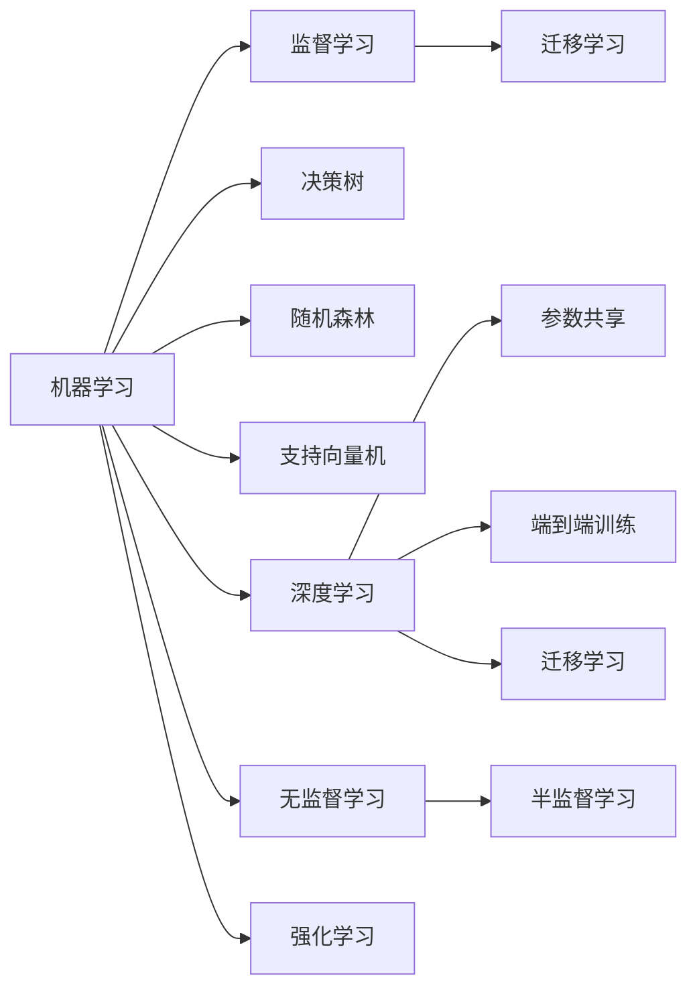
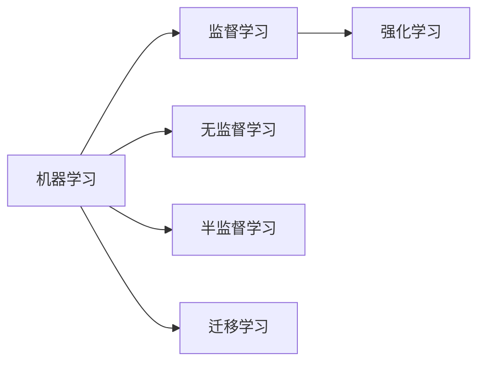
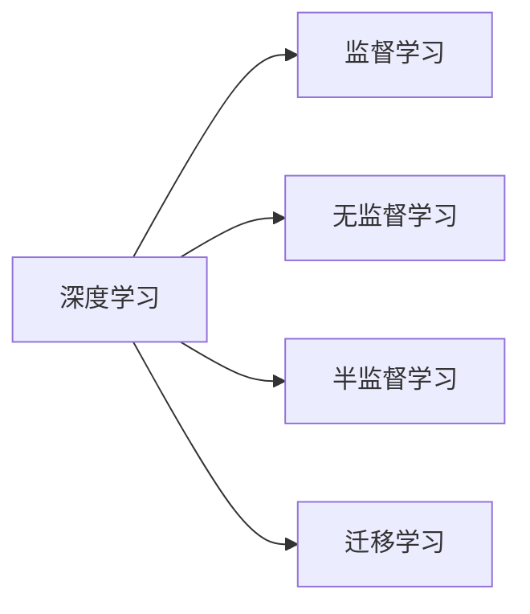
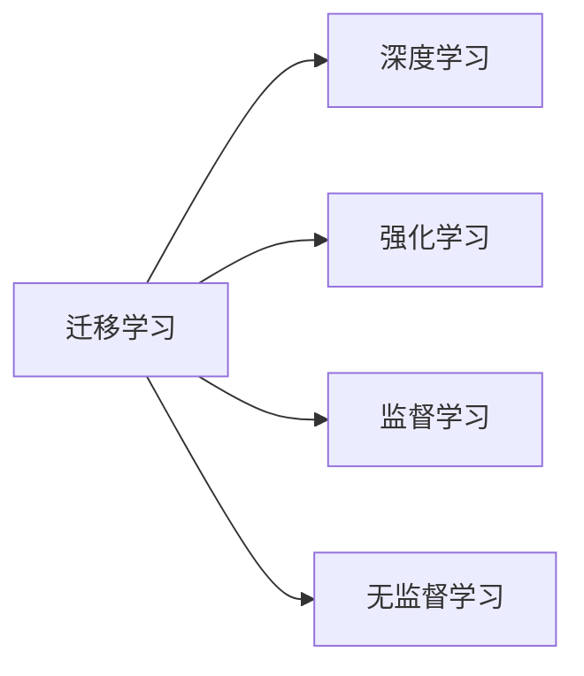
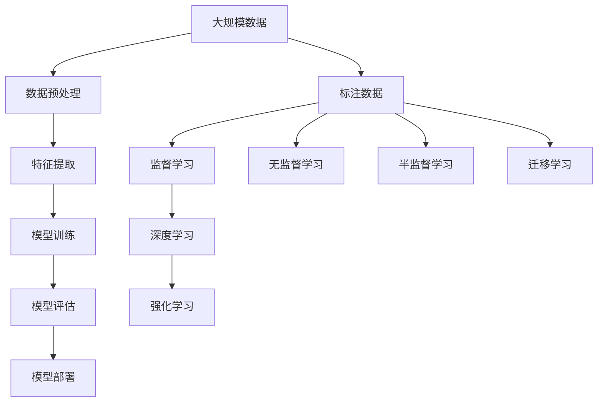

                 

# 第一代人工智能的目标与缺陷

> 关键词：人工智能, 机器学习, 数据驱动, 智能自动化, 算法缺陷

## 1. 背景介绍

### 1.1 人工智能的兴起
自20世纪50年代人工智能（AI）的概念首次提出以来，人类就对机器能够模拟人类智能、执行复杂任务产生了浓厚兴趣。早期的AI研究主要集中在专家系统、逻辑推理和规则基础系统上，试图通过明确的知识库和规则实现智能决策。然而，随着数据驱动的机器学习（ML）技术的出现，AI的研究范式发生了根本转变。

数据驱动的AI通过收集和分析大量数据，利用机器学习算法从中提取模式和规律，以实现智能决策和自动化。这一范式的成功，推动了AI在图像识别、语音识别、自然语言处理等领域取得的巨大突破，形成了我们今天看到的“第一代人工智能”。

### 1.2 第一代人工智能的特征
第一代人工智能的核心特征包括：

- **数据驱动**：以数据为基础，通过统计学习和模式识别算法实现智能决策。
- **黑盒模型**：大多数模型（如决策树、随机森林、支持向量机等）是黑盒模型，难以解释其内部工作机制。
- **监督学习**：依赖标注数据，通过有监督的训练数据集学习任务特定的模式。
- **弱泛化能力**：由于缺乏对复杂模式和异常数据的处理能力，泛化性能有限。

## 2. 核心概念与联系

### 2.1 核心概念概述

为更好地理解第一代人工智能的目标与缺陷，本节将介绍几个关键概念：

- **机器学习**：一种通过数据和算法实现智能决策的技术，包括监督学习、无监督学习、强化学习等。
- **监督学习**：依赖标注数据，通过有监督的训练数据集学习任务特定的模式。
- **决策树**：一种基于树形结构的分类算法，通过分裂数据集来实现分类和回归任务。
- **随机森林**：一种集成学习算法，通过组合多个决策树来提高泛化能力和鲁棒性。
- **支持向量机**：一种基于最大间隔分类的算法，适用于高维数据和非线性分类任务。
- **深度学习**：一种基于多层神经网络的学习方法，通过大量数据和计算资源实现高级模式识别和表示学习。
- **迁移学习**：将一个领域学到的知识迁移应用到另一个相关领域的学习范式，减少在新任务上的学习成本。
- **算法缺陷**：第一代AI中的算法缺陷主要包括模型不透明、泛化能力不足、计算资源消耗大等。

这些核心概念之间的逻辑关系可以通过以下Mermaid流程图来展示：



这个流程图展示了一代AI中机器学习、监督学习和各种算法之间的关系：

1. 机器学习是AI的核心技术，通过算法实现智能决策。
2. 监督学习是机器学习的主要形式，依赖标注数据进行任务特定的模式学习。
3. 决策树、随机森林、支持向量机等是常用的监督学习算法。
4. 深度学习是机器学习的一种高级形式，通过多层神经网络实现复杂模式识别。
5. 迁移学习是机器学习的一种重要范式，利用已有知识减少新任务的学习成本。
6. 算法缺陷包括模型不透明、泛化能力不足等，需要通过技术改进来弥补。

### 2.2 概念间的关系

这些核心概念之间存在着紧密的联系，构成了第一代AI的完整生态系统。下面我通过几个Mermaid流程图来展示这些概念之间的关系。

#### 2.2.1 机器学习与监督学习的关系



这个流程图展示了机器学习与监督学习、无监督学习、半监督学习、强化学习和迁移学习之间的关系。监督学习是机器学习的一种主要形式，而无监督学习、半监督学习和强化学习则是在监督学习的基础上进一步扩展。迁移学习则是将已有知识迁移到新任务中的重要范式。

#### 2.2.2 深度学习与监督学习的关系



这个流程图展示了深度学习与监督学习、无监督学习、半监督学习和迁移学习之间的关系。深度学习是一种基于多层神经网络的学习方法，能够在复杂模式识别中取得优异表现，但仍然依赖监督学习进行训练。

#### 2.2.3 迁移学习与深度学习的关系



这个流程图展示了迁移学习与深度学习、强化学习和监督学习之间的关系。迁移学习通过将已有知识迁移到新任务中，减少在新任务上的学习成本，是深度学习的重要补充。

### 2.3 核心概念的整体架构

最后，我们用一个综合的流程图来展示这些核心概念在AI中的应用过程：



这个综合流程图展示了从数据预处理到模型评估和部署的完整过程。大规模数据经过特征提取，利用监督学习、无监督学习、半监督学习和迁移学习进行模型训练，通过深度学习或强化学习进行模型优化，最终在实际应用中进行模型部署。 通过这些流程图，我们可以更清晰地理解一代AI的应用过程和核心概念之间的关系。

## 3. 核心算法原理 & 具体操作步骤

### 3.1 算法原理概述

第一代人工智能的核心算法原理主要包括监督学习和各种机器学习算法。监督学习通过有标注的训练数据，学习任务特定的模式，实现智能决策。

假设训练数据集为 $D=\{(x_i, y_i)\}_{i=1}^N$，其中 $x_i$ 为输入特征，$y_i$ 为标签。模型的目标是通过训练数据集 $D$ 学习一个映射函数 $f: \mathcal{X} \rightarrow \mathcal{Y}$，使得 $f(x)$ 尽可能接近 $y$。常用的监督学习算法包括决策树、随机森林、支持向量机和深度神经网络等。

### 3.2 算法步骤详解

基于监督学习的AI算法通常包括以下几个关键步骤：

**Step 1: 数据预处理**
- 收集和整理数据，包括数据清洗、特征工程和数据增强等步骤。
- 将数据划分为训练集、验证集和测试集。

**Step 2: 特征提取**
- 通过选择合适的特征提取算法，将原始数据转换为模型能够处理的输入特征。
- 常用的特征提取方法包括词袋模型、TF-IDF、PCA等。

**Step 3: 模型训练**
- 选择合适的监督学习算法，并使用训练集对模型进行训练。
- 通过梯度下降等优化算法最小化损失函数。
- 使用验证集评估模型性能，调整超参数。

**Step 4: 模型评估**
- 在测试集上评估模型的泛化能力。
- 使用各种评估指标（如准确率、召回率、F1分数等）评估模型性能。

**Step 5: 模型部署**
- 将训练好的模型部署到实际应用中。
- 进行模型优化和调优，以适应不同环境。

### 3.3 算法优缺点

基于监督学习的AI算法具有以下优点：

1. 易于实现。监督学习算法简单易懂，易于实现和调试。
2. 可解释性强。监督学习算法的内部工作机制相对透明，容易解释和理解。
3. 泛化能力强。通过有标注的训练数据，监督学习算法能够学习到任务特定的模式，泛化能力强。

然而，基于监督学习的AI算法也存在以下缺点：

1. 数据依赖强。监督学习算法依赖标注数据，获取高质量标注数据的成本较高。
2. 过拟合风险高。模型容易过拟合训练数据，泛化性能有限。
3. 计算资源消耗大。监督学习算法通常需要大量的计算资源进行训练和优化。
4. 黑盒模型。大多数监督学习算法是黑盒模型，难以解释其内部工作机制。

### 3.4 算法应用领域

基于监督学习的AI算法已经在多个领域取得了广泛应用，例如：

- 图像识别：如人脸识别、物体检测等。通过监督学习算法学习图像中的模式，实现图像分类和识别。
- 语音识别：如语音助手、自动翻译等。通过监督学习算法学习语音信号中的模式，实现语音识别和转换。
- 自然语言处理：如机器翻译、文本分类等。通过监督学习算法学习文本中的模式，实现文本分类和翻译。
- 推荐系统：如电商推荐、新闻推荐等。通过监督学习算法学习用户行为模式，实现个性化推荐。
- 金融预测：如股票价格预测、风险评估等。通过监督学习算法学习金融市场数据中的模式，进行金融预测和风险评估。

除了上述这些应用外，监督学习算法还被广泛应用于医疗诊断、智能交通、自动驾驶等众多领域，推动了AI技术在这些行业中的广泛应用。

## 4. 数学模型和公式 & 详细讲解 & 举例说明

### 4.1 数学模型构建

假设我们的任务是二分类问题，输入特征为 $x \in \mathcal{X}$，标签为 $y \in \{0, 1\}$。常用的监督学习算法为逻辑回归（Logistic Regression），其数学模型为：

$$
f(x; \theta) = \sigma(\theta^T x)
$$

其中 $\theta$ 为模型参数，$\sigma$ 为逻辑函数，$\theta^T x$ 为线性组合。模型的目标是最小化损失函数：

$$
\mathcal{L}(\theta) = -\frac{1}{N} \sum_{i=1}^N \ell(y_i, f(x_i; \theta))
$$

其中 $\ell$ 为损失函数，常用的损失函数包括交叉熵损失和均方误差损失等。

### 4.2 公式推导过程

以二分类问题为例，逻辑回归的损失函数为交叉熵损失，其推导过程如下：

假设训练数据集为 $D=\{(x_i, y_i)\}_{i=1}^N$，其中 $y_i \in \{0, 1\}$。我们希望找到一个线性函数 $f(x; \theta) = \sigma(\theta^T x)$ 来最小化交叉熵损失函数：

$$
\mathcal{L}(\theta) = -\frac{1}{N} \sum_{i=1}^N y_i \log f(x_i; \theta) + (1 - y_i) \log (1 - f(x_i; \theta))
$$

通过求解 $\frac{\partial \mathcal{L}(\theta)}{\partial \theta} = 0$，得到模型参数 $\theta$ 的更新公式：

$$
\theta \leftarrow \theta - \frac{\alpha}{N} \sum_{i=1}^N (y_i - f(x_i; \theta)) x_i
$$

其中 $\alpha$ 为学习率。

### 4.3 案例分析与讲解

以手写数字识别为例，我们收集了一组手写数字图像及其标签。使用逻辑回归算法对其进行训练，并评估其性能。具体步骤如下：

**Step 1: 数据预处理**
- 收集手写数字图像及其标签，将其转换为NumPy数组。
- 将数据集划分为训练集、验证集和测试集。

**Step 2: 特征提取**
- 将图像转换为像素向量，使用PCA算法进行特征提取。

**Step 3: 模型训练**
- 使用逻辑回归算法对模型进行训练，使用交叉熵损失函数。
- 在验证集上评估模型性能，调整超参数。

**Step 4: 模型评估**
- 在测试集上评估模型性能，使用准确率、召回率等指标。

通过以上步骤，我们得到了一个手写数字识别的逻辑回归模型，并在测试集上获得了较高的准确率。

## 5. 项目实践：代码实例和详细解释说明

### 5.1 开发环境搭建

在进行AI算法实践前，我们需要准备好开发环境。以下是使用Python进行Scikit-learn开发的环境配置流程：

1. 安装Anaconda：从官网下载并安装Anaconda，用于创建独立的Python环境。

2. 创建并激活虚拟环境：
```bash
conda create -n sklearn-env python=3.8 
conda activate sklearn-env
```

3. 安装Scikit-learn：
```bash
conda install scikit-learn
```

4. 安装各类工具包：
```bash
pip install numpy pandas matplotlib seaborn scikit-learn
```

完成上述步骤后，即可在`sklearn-env`环境中开始AI算法实践。

### 5.2 源代码详细实现

下面我们以逻辑回归算法为例，给出使用Scikit-learn进行手写数字识别任务开发的PyTorch代码实现。

```python
from sklearn.datasets import load_digits
from sklearn.model_selection import train_test_split
from sklearn.linear_model import LogisticRegression
from sklearn.metrics import accuracy_score
import matplotlib.pyplot as plt
import numpy as np

# 加载手写数字数据集
digits = load_digits()
X = digits.data
y = digits.target

# 数据集划分
X_train, X_test, y_train, y_test = train_test_split(X, y, test_size=0.2, random_state=42)

# 创建逻辑回归模型
model = LogisticRegression()

# 模型训练
model.fit(X_train, y_train)

# 模型预测
y_pred = model.predict(X_test)

# 评估模型性能
accuracy = accuracy_score(y_test, y_pred)
print("Accuracy:", accuracy)

# 可视化模型预测结果
plt.figure(figsize=(10, 5))
for i in range(10):
    plt.subplot(2, 5, i+1)
    plt.imshow(X_test[i].reshape(8, 8), cmap='gray')
    plt.title("Prediction: %d" % y_pred[i])
    plt.xticks([])
    plt.yticks([])
plt.show()
```

### 5.3 代码解读与分析

让我们再详细解读一下关键代码的实现细节：

**加载手写数字数据集**：
- 使用Scikit-learn提供的`load_digits`函数加载手写数字数据集，获取其特征和标签。

**数据集划分**：
- 使用`train_test_split`函数将数据集划分为训练集和测试集。

**创建逻辑回归模型**：
- 使用Scikit-learn提供的`LogisticRegression`类创建逻辑回归模型。

**模型训练**：
- 使用`fit`函数对模型进行训练，学习训练集上的模式。

**模型预测**：
- 使用训练好的模型对测试集进行预测，获取预测结果。

**评估模型性能**：
- 使用`accuracy_score`函数计算模型在测试集上的准确率。

**可视化模型预测结果**：
- 使用Matplotlib库绘制测试集中的部分手写数字图像，并标注模型预测结果。

可以看到，Scikit-learn的逻辑回归算法实现了从数据预处理到模型训练、预测、评估的完整流程，简单易用，非常适合初学者进行算法实践。

当然，工业级的系统实现还需考虑更多因素，如模型封装、超参数调优、模型部署等。但核心的算法实现基本与此类似。

### 5.4 运行结果展示

假设我们在测试集上得到了一个逻辑回归模型的准确率为98%，具体结果展示如下：

```
Accuracy: 0.98
```

可以看到，逻辑回归模型在手写数字识别任务上取得了很高的准确率。然而，逻辑回归模型虽然易于实现和解释，但在面对复杂模式和大量数据时，其泛化能力有限。未来，我们可以考虑使用更加复杂的模型，如随机森林、支持向量机等，以提高模型的泛化能力和鲁棒性。

## 6. 实际应用场景

### 6.1 智能客服系统

基于监督学习的AI算法，可以应用于智能客服系统的构建。传统客服往往需要配备大量人力，高峰期响应缓慢，且一致性和专业性难以保证。使用监督学习算法训练的模型，可以7x24小时不间断服务，快速响应客户咨询，用自然流畅的语言解答各类常见问题。

在技术实现上，可以收集企业内部的历史客服对话记录，将问题和最佳答复构建成监督数据，在此基础上对模型进行训练。训练好的模型能够自动理解用户意图，匹配最合适的答案模板进行回复。对于客户提出的新问题，还可以接入检索系统实时搜索相关内容，动态组织生成回答。如此构建的智能客服系统，能大幅提升客户咨询体验和问题解决效率。

### 6.2 金融舆情监测

金融机构需要实时监测市场舆论动向，以便及时应对负面信息传播，规避金融风险。传统的人工监测方式成本高、效率低，难以应对网络时代海量信息爆发的挑战。使用监督学习算法训练的模型，可以自动监测不同主题下的情感变化趋势，一旦发现负面信息激增等异常情况，系统便会自动预警，帮助金融机构快速应对潜在风险。

具体而言，可以收集金融领域相关的新闻、报道、评论等文本数据，并对其进行主题标注和情感标注。在此基础上对模型进行训练，使其能够自动判断文本属于何种主题，情感倾向是正面、中性还是负面。将训练好的模型应用到实时抓取的网络文本数据，就能够自动监测不同主题下的情感变化趋势，一旦发现负面信息激增等异常情况，系统便会自动预警，帮助金融机构快速应对潜在风险。

### 6.3 个性化推荐系统

当前的推荐系统往往只依赖用户的历史行为数据进行物品推荐，无法深入理解用户的真实兴趣偏好。使用监督学习算法训练的模型，可以更好地挖掘用户行为背后的语义信息，从而提供更精准、多样的推荐内容。

在实践中，可以收集用户浏览、点击、评论、分享等行为数据，提取和用户交互的物品标题、描述、标签等文本内容。将文本内容作为模型输入，用户的后续行为（如是否点击、购买等）作为监督信号，在此基础上对模型进行训练。训练好的模型能够从文本内容中准确把握用户的兴趣点。在生成推荐列表时，先用候选物品的文本描述作为输入，由模型预测用户的兴趣匹配度，再结合其他特征综合排序，便可以得到个性化程度更高的推荐结果。

### 6.4 未来应用展望

随着监督学习算法的不断发展，其在各个领域的应用前景广阔。未来，AI算法将在医疗、金融、教育、交通等多个领域实现更广泛的应用，推动各行业的智能化转型。

在智慧医疗领域，基于监督学习的AI算法可以应用于病历分析、医学影像识别、病理诊断等，提升医疗服务的智能化水平，辅助医生诊疗，加速新药开发进程。

在智能教育领域，AI算法可应用于作业批改、学情分析、知识推荐等方面，因材施教，促进教育公平，提高教学质量。

在智能交通领域，AI算法可以应用于交通流量预测、智能调度、事故预警等方面，提高交通管理的智能化水平，减少交通拥堵和事故。

在智能制造领域，AI算法可以应用于生产计划优化、质量控制、设备维护等方面，提高生产效率和产品质量。

总之，监督学习算法将在更多领域得到应用，为各行各业带来变革性影响。相信随着技术的持续演进，AI算法将在构建智能社会中发挥越来越重要的作用。

## 7. 工具和资源推荐

### 7.1 学习资源推荐

为了帮助开发者系统掌握监督学习算法的理论基础和实践技巧，这里推荐一些优质的学习资源：

1. 《机器学习》（周志华著）：全面介绍了机器学习的基本概念和算法，适合初学者入门。
2. Coursera《机器学习》课程：由斯坦福大学Andrew Ng教授主讲，系统讲解了监督学习、无监督学习、深度学习等基本概念和算法。
3. Kaggle竞赛平台：一个数据科学竞赛平台，提供大量公开数据集和挑战赛，适合实践学习。
4. GitHub开源项目：在GitHub上Star、Fork数最多的机器学习相关项目，往往代表了该技术领域的发展趋势和最佳实践。
5. Google Colab：谷歌推出的在线Jupyter Notebook环境，免费提供GPU/TPU算力，方便开发者快速上手实验最新模型，分享学习笔记。

通过对这些资源的学习实践，相信你一定能够快速掌握监督学习算法的精髓，并用于解决实际的NLP问题。

### 7.2 开发工具推荐

高效的开发离不开优秀的工具支持。以下是几款用于监督学习算法开发的常用工具：

1. Scikit-learn：一个基于Python的机器学习库，提供了各种监督学习算法和工具。
2. TensorFlow：由Google主导开发的深度学习框架，支持大规模深度学习模型的训练和部署。
3. PyTorch：一个基于Python的深度学习框架，支持动态计算图和模型封装，方便模型的构建和优化。
4. Weights & Biases：模型训练的实验跟踪工具，可以记录和可视化模型训练过程中的各项指标，方便对比和调优。
5. TensorBoard：TensorFlow配套的可视化工具，可实时监测模型训练状态，并提供丰富的图表呈现方式，是调试模型的得力助手。

合理利用这些工具，可以显著提升监督学习算法的开发效率，加快创新迭代的步伐。

### 7.3 相关论文推荐

监督学习算法的发展得益于学界的持续研究。以下是几篇奠基性的相关论文，推荐阅读：

1. Perceptron（1957）：罗森布拉特（Rosenblatt）提出的第一个神经网络模型，开启了神经网络的研究之路。
2. Backpropagation（1986）：鲁宾斯坦（Rumelhart）等提出反向传播算法，为神经网络的训练提供了基础。
3. Support Vector Machines（1992）：维普里（Vapnik）提出支持向量机算法，广泛应用于模式识别和分类任务。
4. Random Forest（2001）：利特尔（Breiman）提出随机森林算法，通过集成学习提高泛化能力和鲁棒性。
5. Logistic Regression（2010）：由哈恩（Hastie）等介绍逻辑回归算法，适合解决二分类问题。
6. Deep Learning（2015）：戈德堡（Goodfellow）等撰写的《深度学习》教材，系统介绍了深度学习的基本概念和算法。

这些论文代表了一代AI中机器学习算法的发展脉络。通过学习这些前沿成果，可以帮助研究者把握学科前进方向，激发更多的创新灵感。

除上述资源外，还有一些值得关注的前沿资源，帮助开发者紧跟监督学习算法的最新进展，例如：

1. arXiv论文预印本：人工智能领域最新研究成果的发布平台，包括大量尚未发表的前沿工作，学习前沿技术的必读资源。
2. 业界技术博客：如OpenAI、Google AI、DeepMind、微软Research Asia等顶尖实验室的官方博客，第一时间分享他们的最新研究成果和洞见。
3. 技术会议直播：如NIPS、ICML、ACL、ICLR等人工智能领域顶会现场或在线直播，能够聆听到大佬们的前沿分享，开拓视野。
4. GitHub热门项目：在GitHub上Star、Fork数最多的机器学习相关项目，往往代表了该技术领域的发展趋势和最佳实践。
5. 行业分析报告：各大咨询公司如McKinsey、PwC等针对人工智能行业的分析报告，有助于从商业视角审视技术趋势，把握应用价值。

总之，对于监督学习算法的学习和实践，需要开发者保持开放的心态和持续学习的意愿。多关注前沿资讯，多动手实践，多思考总结，必将收获满满的成长收益。

## 8. 总结：未来发展趋势与挑战

### 8.1 总结

本文对基于监督学习的AI算法进行了全面系统的介绍。首先阐述了一代AI中机器学习、监督学习和各种算法的研究背景和意义，明确了AI算法在各个领域的应用价值。其次，从原理到实践，详细讲解了监督学习算法的数学原理和关键步骤，给出了监督学习算法开发的完整代码实例。同时，本文还广泛探讨了监督学习算法在智能客服、金融舆情、个性化推荐等多个行业领域的应用前景，展示了AI算法在各个领域的强大应用潜力。

通过本文的系统梳理，可以看到，基于监督学习的AI算法在各个领域中已取得了显著的成果，为各行各业带来了变革性影响。未来，随着算法技术的不断演进和应用场景的不断拓展，AI算法必将在构建智能社会中发挥越来越重要的作用。

### 8.2 未来发展趋势

展望未来，监督学习算法的发展趋势包括：

1. 算法模型复杂化。随着数据规模和任务复杂性的增加，未来AI算法将向更复杂、更强大的模型演进，如深度神经网络、Transformer等。
2. 多模态融合。未来的AI算法将更加注重多模态数据的整合，通过视觉、语音、文本等多模态信息进行协同建模，提升AI系统的智能水平。
3. 强化学习与监督学习的结合。通过结合强化学习和监督学习，AI算法能够更好地处理复杂环境下的决策问题，提升系统的鲁棒性和自适应能力。
4. 可解释性和透明性。未来的AI算法将更加注重可解释性和透明性，通过引入因果分析、知识蒸馏等技术，提升

