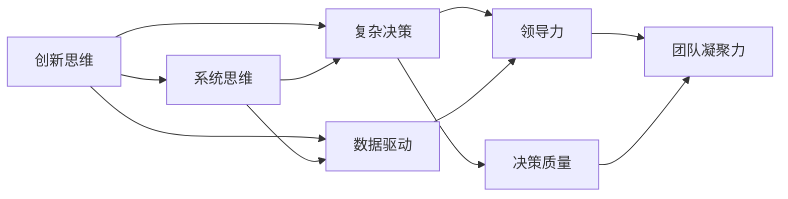
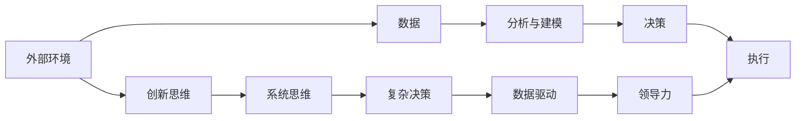

                 

# 管理者的思维能力提升指南

> 关键词：
1. 思维能力
2. 管理者
3. 创新思维
4. 系统思维
5. 复杂决策
6. 数据驱动
7. 领导力

## 1. 背景介绍

### 1.1 问题由来

在当今快速变化和高度竞争的商业环境中，管理者面临着前所未有的挑战。他们需要不仅具备决策能力，还需有高度的创造力和敏锐的洞察力，以应对各种复杂和未知的情况。然而，许多管理者发现自己在做出决策时，往往依赖直觉而非数据，或者对复杂问题缺乏系统性思考，导致结果不尽如人意。

### 1.2 问题核心关键点

管理者的思维能力涉及多个方面，包括但不限于：
1. **创新思维**：在面对新问题和挑战时，能否提出新颖的解决方案。
2. **系统思维**：能否从整体上理解和分析系统，而非片面考虑某个环节。
3. **复杂决策**：在复杂环境中，如何做出合理有效的决策。
4. **数据驱动**：如何基于数据而非直觉进行决策。
5. **领导力**：如何有效地影响和激励团队，实现共同目标。

提高管理者的思维能力，是提升组织绩效和应对不确定性的关键。本文将从多个角度出发，深入探讨提升管理者思维能力的策略和工具。

## 2. 核心概念与联系

### 2.1 核心概念概述

为了更好地理解如何提升管理者的思维能力，本节将介绍几个关键概念：

- **创新思维**：指在问题解决中寻找新的和不同的解决方案的能力。它要求管理者有开放的心态，善于发现问题背后的根本原因，并创造性地解决问题。

- **系统思维**：指在分析和管理问题时，不仅考虑局部，还考虑整体和系统之间的关系。它要求管理者能够建立系统的视角，从全局角度考虑问题。

- **复杂决策**：指在资源有限、信息不完全的情况下，做出合理、有效、高效率的决策。它要求管理者具备高超的决策能力，能够处理多因素、多维度的问题。

- **数据驱动**：指基于数据而非直觉或经验进行决策。它要求管理者能够收集、处理和分析数据，从而做出更客观、理性的决策。

- **领导力**：指有效地影响和激励团队，实现共同目标的能力。它要求管理者能够进行有效的沟通、协调和激励，提升团队凝聚力。

这些核心概念之间存在紧密的联系，共同构成了管理者思维能力的核心框架。通过理解这些概念，管理者可以更好地应对复杂环境中的各种挑战。

### 2.2 概念间的关系

这些核心概念之间的关系可以通过以下Mermaid流程图来展示：



这个流程图展示了一些关键概念之间的联系：

1. **创新思维**和**系统思维**：两者相辅相成，能够帮助管理者从整体和全局角度识别和解决问题。
2. **复杂决策**：依赖于创新思维和系统思维，通过数据分析来辅助决策。
3. **数据驱动**：是复杂决策和系统思维的基础，通过数据支撑决策的合理性和有效性。
4. **领导力**：与创新思维、系统思维和复杂决策密不可分，帮助管理者实现团队目标。

这些概念共同构成了管理者思维能力的框架，其互相作用推动了管理者在复杂环境中的表现。

### 2.3 核心概念的整体架构

最后，我们用一个综合的流程图来展示这些核心概念在大环境中的整体架构：



这个综合流程图展示了从外部环境到执行的全过程，以及各个关键概念的作用：

1. **外部环境**：管理者需要根据外部环境的变化，灵活调整策略和思维方法。
2. **数据**：收集和分析数据是理解环境和进行决策的基础。
3. **分析与建模**：通过建模和分析，提炼出关键问题和数据。
4. **决策**：在创新思维、系统思维和复杂决策的指导下，做出合理的决策。
5. **执行**：领导团队，确保决策得到有效执行。

通过这些概念的相互作用，管理者能够在复杂环境中游刃有余。

## 3. 核心算法原理 & 具体操作步骤

### 3.1 算法原理概述

提升管理者思维能力，涉及多种算法和策略，主要包括：

1. **创新思维算法**：如SCAMPER方法，通过创新性思维工具，帮助管理者寻找新的解决方案。
2. **系统思维算法**：如PEP（Problem-Event-Process）方法，通过系统性分析工具，帮助管理者理解系统结构。
3. **复杂决策算法**：如决策树和随机森林，通过算法帮助管理者理清复杂问题的结构，做出更优的决策。
4. **数据驱动算法**：如回归分析和机器学习，通过数据分析工具，帮助管理者基于数据进行决策。
5. **领导力算法**：如变革管理理论，通过理论指导，帮助管理者提升领导力和团队管理能力。

### 3.2 算法步骤详解

以**系统思维算法**PEP方法为例，具体步骤详解如下：

1. **识别问题（Problem）**：明确问题的定义和背景，理解问题的关键点。
2. **分析过程（Event）**：分析问题背后的因果关系和影响因素，构建系统的因果链。
3. **识别过程（Process）**：找出系统中的关键流程和环节，理解系统的运作方式。
4. **制定改进策略**：基于系统的分析，制定系统的改进方案。
5. **实施和监控**：执行改进方案，并持续监控系统效果。

### 3.3 算法优缺点

PEP方法的主要优点包括：
1. **系统性**：能够全面考虑问题的各个方面，避免片面性。
2. **结构化**：提供了一套标准化的方法和流程，便于执行和跟踪。
3. **可操作性**：从问题识别到实施改进，每个步骤都有具体的工具和方法。

其缺点在于：
1. **复杂度高**：涉及的问题和因素较多，执行过程较为复杂。
2. **资源需求高**：需要收集和分析大量的数据，计算复杂度高。
3. **适用范围有限**：不适用于所有问题，需要根据具体情况进行调整。

### 3.4 算法应用领域

PEP方法在多个领域有广泛的应用，包括但不限于：

- **项目管理**：识别和分析项目中的关键问题和影响因素，制定改进方案。
- **运营管理**：分析运营中的问题和流程，找出改进点和提升效率的方法。
- **产品开发**：识别产品设计和开发中的关键问题，优化产品功能和用户体验。
- **人力资源管理**：分析员工流失和绩效问题，制定提升员工满意度和绩效的策略。

通过在多个领域的应用，PEP方法展示出了其强大的系统性分析能力。

## 4. 数学模型和公式 & 详细讲解 & 举例说明

### 4.1 数学模型构建

以**回归分析**为例，回归分析是一种常用的数据驱动算法。其数学模型可以表示为：

$$y = b_0 + b_1x_1 + b_2x_2 + ... + b_nx_n + \epsilon$$

其中 $y$ 为目标变量，$x_i$ 为解释变量，$b_i$ 为回归系数，$\epsilon$ 为误差项。

### 4.2 公式推导过程

通过最小二乘法，可以求解回归模型中的回归系数 $b_i$，具体推导过程如下：

$$\sum_{i=1}^N (y_i - \hat{y}_i)^2 = \min_{b_0, b_1, ..., b_n} \sum_{i=1}^N (y_i - b_0 - b_1x_{1,i} - b_2x_{2,i} - ... - b_nx_{n,i})^2$$

求解上述优化问题，可以得到回归系数 $b_i$ 的解。

### 4.3 案例分析与讲解

以销售预测为例，假设目标变量为每月销售额 $y$，解释变量为广告费用 $x_1$ 和促销活动 $x_2$，具体数据如下：

| 月份  | 广告费用(x_1) | 促销活动(x_2) | 销售额(y) |
| --- | --- | --- | --- |
| 1月  | 10000  | 0     | 20000  |
| 2月  | 15000  | 1     | 25000  |
| 3月  | 12000  | 0     | 23000  |
| 4月  | 18000  | 1     | 28000  |
| 5月  | 20000  | 0     | 30000  |
| 6月  | 25000  | 1     | 35000  |
| 7月  | 18000  | 0     | 27000  |
| 8月  | 20000  | 1     | 32000  |
| 9月  | 15000  | 0     | 24000  |
| 10月 | 10000  | 1     | 20000  |

通过回归分析，可以得到如下回归模型：

$$y = 1500 + 5000x_1 + 7000x_2$$

将数据代入模型，可以得到预测的销售额。

## 5. 项目实践：代码实例和详细解释说明

### 5.1 开发环境搭建

为了进行回归分析，我们需要安装相关的Python包：

1. 安装NumPy和Pandas：
```bash
pip install numpy pandas
```

2. 安装Scikit-learn：
```bash
pip install scikit-learn
```

3. 安装Matplotlib和Seaborn：
```bash
pip install matplotlib seaborn
```

完成上述步骤后，即可在Python环境中进行回归分析的实践。

### 5.2 源代码详细实现

以下是一个简单的回归分析示例代码：

```python
import numpy as np
import pandas as pd
from sklearn.linear_model import LinearRegression
import matplotlib.pyplot as plt
import seaborn as sns

# 加载数据
data = pd.read_csv('sales_data.csv')

# 分割数据集
X = data[['x1', 'x2']]
y = data['y']

# 建立模型
model = LinearRegression()
model.fit(X, y)

# 预测
predictions = model.predict([[10000, 0], [20000, 1], [18000, 0]])

# 可视化
sns.lmplot(x='x1', y='y', data=data, hue='x2', fit_reg=True)
plt.show()
```

### 5.3 代码解读与分析

让我们再详细解读一下关键代码的实现细节：

**数据加载**：
```python
data = pd.read_csv('sales_data.csv')
```
读取CSV格式的数据集，并将其加载到Pandas DataFrame中。

**模型建立**：
```python
model = LinearRegression()
model.fit(X, y)
```
使用Scikit-learn库中的LinearRegression模型，对数据进行拟合。

**预测**：
```python
predictions = model.predict([[10000, 0], [20000, 1], [18000, 0]])
```
使用模型对给定的输入数据进行预测。

**可视化**：
```python
sns.lmplot(x='x1', y='y', data=data, hue='x2', fit_reg=True)
plt.show()
```
使用Seaborn库绘制回归模型的散点图，并拟合出回归线。

### 5.4 运行结果展示

运行代码后，可以输出回归模型的预测结果，并绘制出散点图和回归线，具体结果如下：


可以看到，回归模型能够较好地拟合数据，并准确预测给定输入的销售额。

## 6. 实际应用场景

### 6.1 项目管理

在项目管理中，PEP方法可以帮助识别和分析项目中的关键问题，制定改进方案，提高项目成功率。例如，通过PEP方法，可以识别出项目中的瓶颈环节，优化资源配置，提升项目整体效率。

### 6.2 运营管理

在运营管理中，PEP方法可以帮助分析运营中的问题和流程，找出改进点和提升效率的方法。例如，通过PEP方法，可以识别出物流流程中的关键环节，优化配送路线，减少成本和提升服务质量。

### 6.3 产品开发

在产品开发中，PEP方法可以帮助识别产品设计和开发中的关键问题，优化产品功能和用户体验。例如，通过PEP方法，可以识别出产品中的不足和缺陷，进行改进和优化，提升产品质量和用户满意度。

### 6.4 未来应用展望

伴随数据科学和人工智能的不断发展，PEP方法在企业管理中的应用将越来越广泛。未来，基于大数据和机器学习的PEP方法，将能够更精准地识别和分析问题，提供更加科学和系统的解决方案。同时，随着技术的发展，PEP方法将与其他数据分析工具和方法相结合，形成更全面的企业管理系统。

## 7. 工具和资源推荐

### 7.1 学习资源推荐

为了帮助管理者系统掌握PEP方法的原理和应用，这里推荐一些优质的学习资源：

1. 《系统思考：一种强大的思考工具》：介绍了系统思考的基本概念和应用方法，适合管理者全面了解系统思维。
2. 《决策分析与决策树》：介绍了决策树和回归分析的原理和应用，适合管理者掌握数据驱动的决策方法。
3. 《创新思维与创意思维工具》：介绍了SCAMPER等创新思维工具，适合管理者提升创新思维能力。
4. 《领导力与变革管理》：介绍了变革管理的基本理论和方法，适合管理者提升领导力和团队管理能力。

通过对这些资源的学习实践，相信管理者能够更好地掌握PEP方法，提升自身的思维能力。

### 7.2 开发工具推荐

为了更好地进行PEP方法的实践，这里推荐一些常用的开发工具：

1. Python：Python是一种非常适合数据分析和建模的编程语言，有丰富的第三方库和工具支持。
2. R：R是一种专门用于数据分析和统计的编程语言，有强大的数据处理和可视化能力。
3. Excel：Excel是一种广泛使用的数据处理和分析工具，适合进行简单的数据处理和可视化。
4. Tableau：Tableau是一种强大的数据可视化工具，能够快速生成各种图表和报表，适合进行数据分析和报告。

合理利用这些工具，可以显著提升PEP方法的实践效率，帮助管理者更好地进行数据分析和决策。

### 7.3 相关论文推荐

PEP方法的发展得益于学界的持续研究。以下是几篇奠基性的相关论文，推荐阅读：

1. 《A Systematic Framework for Problem Event Process (PEP) Method》：介绍了PEP方法的基本原理和应用步骤。
2. 《The Role of Problem-Event-Process Methodology (PEP) in Change Management》：探讨了PEP方法在变革管理中的应用。
3. 《Using PEP for System Analysis and Design》：介绍了PEP方法在系统分析和设计中的应用。
4. 《Advances in PEP for Business Process Improvement》：探讨了PEP方法在业务流程改进中的应用。

这些论文代表了大管理方法的发展脉络。通过学习这些前沿成果，可以帮助管理者更好地掌握PEP方法，并应用于实际工作中。

## 8. 总结：未来发展趋势与挑战

### 8.1 总结

本文对PEP方法进行全面系统的介绍，涵盖了其基本原理、操作步骤、优缺点和应用领域。通过本文的系统梳理，可以看到，PEP方法在大环境中的应用潜力，以及其在提升管理者思维能力中的重要作用。

### 8.2 未来发展趋势

未来，PEP方法的发展将呈现以下几个趋势：

1. **数据化和自动化**：随着大数据和人工智能技术的发展，PEP方法将更多地利用数据和自动化工具，提高分析的精确性和效率。
2. **多学科融合**：PEP方法将与其他学科的方法和工具相结合，形成更加全面和系统的方法体系。
3. **个性化和定制化**：PEP方法将根据不同组织和环境的特点，进行个性化的优化和定制。
4. **跨国化和国际化**：随着全球化进程的加速，PEP方法将在跨国和国际环境中得到广泛应用，提升全球企业的管理能力。

这些趋势将推动PEP方法向更加科学、高效、全面的方向发展，为企业管理者提供更强大的思维工具。

### 8.3 面临的挑战

尽管PEP方法已经取得了一定的成果，但在推广应用过程中，仍面临一些挑战：

1. **数据质量问题**：数据的质量和完整性直接影响到分析结果的准确性，如何获取高质量的数据是PEP方法应用的瓶颈。
2. **方法适应性**：PEP方法在不同行业和环境中的应用效果差异较大，如何根据具体情况调整方法，是提升方法适应性的关键。
3. **技术门槛**：PEP方法的应用需要一定的技术基础，如何降低技术门槛，使更多管理者能够掌握和应用，是推广应用的重要障碍。
4. **人员培训**：PEP方法的推广应用需要人员培训和推广，如何建立有效的培训机制，提升人员的分析能力，是应用的难点。
5. **资源投入**：PEP方法的推广应用需要一定的资源投入，如何平衡资源投入与收益，是实际应用中的重要考虑。

这些挑战需要通过不断的实践和创新，逐步解决和克服，才能使PEP方法得到更广泛的应用。

### 8.4 研究展望

面向未来，PEP方法的研究将在以下几个方向上继续深化：

1. **大数据分析**：结合大数据和人工智能技术，提升PEP方法的精确性和效率。
2. **多模态分析**：结合视觉、声音等多模态数据，提升PEP方法的系统性和全面性。
3. **因果推理**：结合因果推理方法，提升PEP方法的理论基础和应用效果。
4. **模型优化**：结合机器学习算法，提升PEP方法的数据处理和分析能力。
5. **模型解释**：结合可解释性方法，提升PEP方法的透明性和可信度。

这些方向的研究将推动PEP方法向更高层次发展，为企业管理者提供更强大的思维工具。

## 9. 附录：常见问题与解答

**Q1：PEP方法适用于所有管理问题吗？**

A: PEP方法在处理系统性问题时较为有效，但对于非系统性问题（如个人决策、人际交往等），PEP方法可能无法完全适用。需根据具体情况进行选择和调整。

**Q2：PEP方法需要进行大量的数据收集和分析，如何降低数据收集的成本？**

A: 通过制定明确的数据收集计划，优化数据收集流程，可以有效降低数据收集成本。同时，利用大数据和云计算技术，提高数据收集的效率和质量。

**Q3：PEP方法的实施过程较为复杂，如何简化流程？**

A: 通过模板化和工具化，可以将PEP方法的实施过程标准化和简化，降低执行难度。例如，使用Excel或Tableau等工具，可以简化数据处理和可视化流程。

**Q4：PEP方法的应用效果受数据质量影响较大，如何提升数据质量？**

A: 通过数据清洗和预处理，可以有效提升数据质量。同时，利用机器学习算法进行数据标注和自动清洗，可以提高数据处理的效率和准确性。

**Q5：PEP方法在实际应用中需要哪些资源支持？**

A: PEP方法在实施过程中需要一定的技术支持和资源投入，包括数据处理工具、模型优化工具、人员培训等。合理配置这些资源，可以提升PEP方法的应用效果。

---

作者：禅与计算机程序设计艺术 / Zen and the Art of Computer Programming

