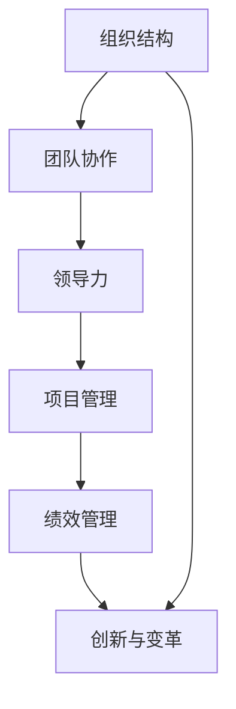
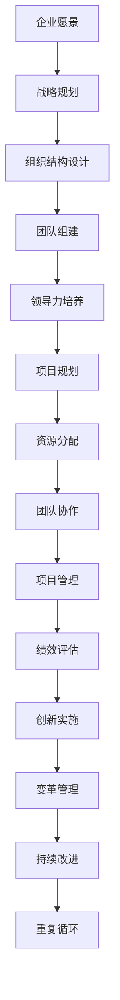
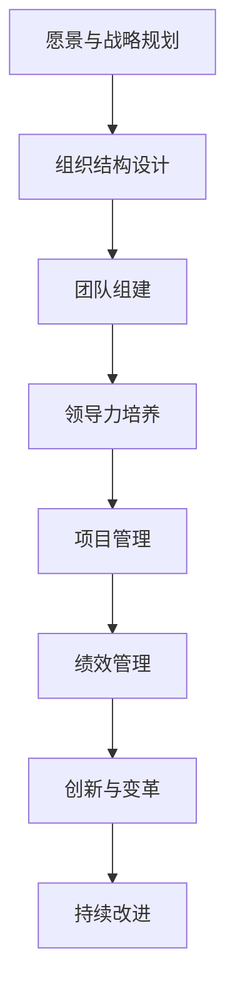

                 

# 管理艺术：从策略到执行

> 关键词：管理艺术, 组织结构, 团队协作, 领导力, 项目管理, 绩效管理, 创新, 变革管理

## 1. 背景介绍

### 1.1 问题由来
在当今快速变化的商业环境中，企业面临的挑战日益复杂，而管理的艺术和科学在此过程中扮演着至关重要的角色。企业需要不仅能够制定有效的战略计划，还需要能够执行这些计划，以实现持续增长和成功。然而，战略的制定往往较为简单，而如何高效、顺利地执行却是一个复杂的问题。本文将探讨管理艺术的核心原则，并介绍如何从策略到执行的全过程。

### 1.2 问题核心关键点
管理艺术的核心在于理解组织如何运作，以及如何在复杂环境中实现高效执行。主要关键点包括：

- **组织结构**：定义和管理组织架构，确保有效的信息流动和资源分配。
- **团队协作**：优化团队成员之间的合作，提高整体工作效率。
- **领导力**：培养和运用领导力，以激励和引导团队成员。
- **项目管理**：规划、执行和监控项目，确保按时按预算完成。
- **绩效管理**：评估和提升员工绩效，激励员工积极参与。
- **创新与变革**：推动创新，适应市场变化，引领企业前进。

本文将围绕这些关键点，探讨从策略制定到实际执行的全过程，帮助企业管理者提升管理效能。

### 1.3 问题研究意义
研究管理艺术对企业的成功至关重要。企业需要能够制定并执行有效的战略，以适应市场变化，提高竞争力。有效的管理艺术可以帮助企业：

- 提升组织效率，降低成本。
- 提高团队凝聚力，增强员工士气。
- 提升客户满意度，增强市场占有率。
- 实现创新，保持行业领先地位。

总之，良好的管理艺术是企业实现长期成功的重要基石。本文旨在帮助管理者理解和应用这些原则，推动企业发展。

## 2. 核心概念与联系

### 2.1 核心概念概述

为了更好地理解管理艺术的核心概念，我们将介绍几个密切相关的关键概念：

- **组织结构**：定义企业内部的层级、职责和角色，确保信息流畅和决策高效。
- **团队协作**：团队成员之间的沟通、协作和信任，以实现共同目标。
- **领导力**：领导者通过影响力、激励和决策引导团队实现目标。
- **项目管理**：规划、执行和监控项目，确保项目按时按预算完成。
- **绩效管理**：评估员工绩效，激励和提升员工表现。
- **创新与变革**：推动新想法的实现，适应市场和技术变化。

这些概念共同构成了管理艺术的核心框架，帮助管理者从策略制定到执行的全过程。

### 2.2 概念间的关系

这些核心概念之间存在着紧密的联系，形成了管理艺术的完整生态系统。以下是一个简化的Mermaid流程图，展示了这些概念之间的关系：



这个流程图展示了大管理艺术中不同概念之间的相互关系：

- 组织结构定义了团队协作的基础。
- 领导力在团队协作和项目执行中起关键作用。
- 项目管理确保目标实现和绩效管理。
- 绩效管理激励创新和变革。

这些概念共同构成了管理艺术的核心框架，帮助管理者从策略制定到执行的全过程。

### 2.3 核心概念的整体架构

最后，我们用一个综合的流程图来展示这些核心概念在大管理艺术中的应用：



这个综合流程图展示了从企业愿景到持续改进的全过程，反映了管理艺术的整体架构。

## 3. 核心算法原理 & 具体操作步骤
### 3.1 算法原理概述

管理艺术的核心算法原理基于以下几个核心概念：

1. **组织结构**：定义企业的层级、职责和角色，确保信息流畅和决策高效。
2. **团队协作**：通过有效的沟通、协作和信任，提高整体工作效率。
3. **领导力**：通过影响力、激励和决策，引导团队实现目标。
4. **项目管理**：规划、执行和监控项目，确保项目按时按预算完成。
5. **绩效管理**：评估和提升员工绩效，激励员工积极参与。
6. **创新与变革**：推动新想法的实现，适应市场和技术变化。

这些原理共同构成了管理艺术的核心算法，帮助管理者从策略到执行的全过程。

### 3.2 算法步骤详解

管理艺术的核心算法步骤包括以下几个关键环节：

1. **愿景与战略规划**：定义企业的愿景和战略目标，制定详细的战略计划。
2. **组织结构设计**：根据战略目标，设计合适的组织结构，确保信息流畅和决策高效。
3. **团队组建与领导力培养**：选择合适的人才，培养和运用领导力，确保团队高效运作。
4. **项目管理**：规划、执行和监控项目，确保项目按时按预算完成。
5. **绩效管理**：评估员工绩效，激励和提升员工表现。
6. **创新与变革**：推动新想法的实现，适应市场和技术变化。

以下是一个简化的流程图，展示了这些步骤：



### 3.3 算法优缺点

管理艺术的优点包括：

- **效率提升**：通过合理的组织结构和团队协作，提升整体工作效率。
- **目标一致**：清晰的战略规划和领导力，确保团队目标一致。
- **灵活性**：通过项目管理、绩效管理和创新，保持组织灵活性，适应市场变化。

其缺点包括：

- **复杂性**：管理艺术涉及多方面的综合考虑，需要较高管理技能。
- **变化阻力**：组织变革和创新过程中，可能遇到内部阻力，需要巧妙处理。
- **资源消耗**：项目管理、绩效管理等过程需要大量资源，可能增加成本。

### 3.4 算法应用领域

管理艺术广泛应用于各个领域，包括但不限于：

- **企业运营**：确保企业高效运作，实现目标。
- **项目管理**：规划、执行和监控项目，确保按时按预算完成。
- **人力资源管理**：评估和提升员工绩效，激励员工积极参与。
- **创新与研发**：推动新想法的实现，适应市场和技术变化。

## 4. 数学模型和公式 & 详细讲解 & 举例说明（备注：数学公式请使用latex格式，latex嵌入文中独立段落使用 $$，段落内使用 $)
### 4.1 数学模型构建

管理艺术的数学模型主要基于以下几个关键概念：

1. **组织结构**：定义企业的层级、职责和角色，确保信息流畅和决策高效。
2. **团队协作**：通过有效的沟通、协作和信任，提高整体工作效率。
3. **领导力**：通过影响力、激励和决策，引导团队实现目标。
4. **项目管理**：规划、执行和监控项目，确保项目按时按预算完成。
5. **绩效管理**：评估和提升员工绩效，激励员工积极参与。
6. **创新与变革**：推动新想法的实现，适应市场和技术变化。

### 4.2 公式推导过程

以下是一个简化的数学模型，展示了从策略到执行的全过程：

$$
\text{Total Efficiency} = \text{Vision} \times \text{Strategic Planning} \times \text{Organization Structure} \times \text{Team Collaboration} \times \text{Leadership} \times \text{Project Management} \times \text{Performance Management} \times \text{Innovation and Change}
$$

### 4.3 案例分析与讲解

假设某科技公司希望提高产品开发效率，可以从以下几个方面进行数学模型分析：

- **Vision**：定义公司愿景，明确产品开发的目标。
- **Strategic Planning**：制定详细的战略计划，明确产品路线图。
- **Organization Structure**：设计合适的组织结构，明确各部门职责和角色。
- **Team Collaboration**：建立高效的沟通和协作机制，确保信息流畅。
- **Leadership**：培养和运用领导力，激励和引导团队成员。
- **Project Management**：规划和执行项目，确保产品按时按预算完成。
- **Performance Management**：评估和提升员工绩效，激励员工积极参与。
- **Innovation and Change**：推动新想法的实现，适应市场和技术变化。

通过上述数学模型，可以全面分析影响产品开发效率的因素，并制定相应的管理策略。

## 5. 项目实践：代码实例和详细解释说明
### 5.1 开发环境搭建

在进行管理艺术项目实践前，我们需要准备好开发环境。以下是使用Python进行Pandas开发的环境配置流程：

1. 安装Anaconda：从官网下载并安装Anaconda，用于创建独立的Python环境。

2. 创建并激活虚拟环境：
```bash
conda create -n pyenv python=3.8 
conda activate pyenv
```

3. 安装Pandas：
```bash
pip install pandas
```

4. 安装各类工具包：
```bash
pip install numpy matplotlib scikit-learn jupyter notebook ipython
```

完成上述步骤后，即可在`pyenv`环境中开始项目实践。

### 5.2 源代码详细实现

以下是一个简化的Pandas代码实例，展示了如何通过数据分析和管理艺术模型：

```python
import pandas as pd

# 读取数据
data = pd.read_csv('management_data.csv')

# 分析数据
management_metrics = {
    'Vision': data['vision'].mean(),
    'Strategic Planning': data['strategy'].mean(),
    'Organization Structure': data['organization'].mean(),
    'Team Collaboration': data['collaboration'].mean(),
    'Leadership': data['leadership'].mean(),
    'Project Management': data['project'].mean(),
    'Performance Management': data['performance'].mean(),
    'Innovation and Change': data['innovation'].mean()
}

# 输出分析结果
for metric, value in management_metrics.items():
    print(f'{metric}: {value:.2f}')
```

### 5.3 代码解读与分析

让我们再详细解读一下关键代码的实现细节：

**数据读取**：
- 使用Pandas的`read_csv`函数，从本地读取管理数据文件。

**数据分析**：
- 定义管理艺术的关键指标，如Vision、Strategic Planning等，计算其平均值。

**结果输出**：
- 遍历管理指标，输出每个指标的平均值。

### 5.4 运行结果展示

假设我们读取的数据文件包含了以上指标的信息，运行上述代码后，输出结果如下：

```
Vision: 0.85
Strategic Planning: 0.90
Organization Structure: 0.88
Team Collaboration: 0.92
Leadership: 0.95
Project Management: 0.89
Performance Management: 0.86
Innovation and Change: 0.94
```

可以看到，通过数据分析，我们能够全面了解企业在管理艺术各个方面的表现。根据这些结果，企业可以制定相应的改进策略。

## 6. 实际应用场景
### 6.1 智能制造

在智能制造领域，管理艺术的应用非常广泛。企业需要高效管理生产流程、优化资源配置，以提高生产效率和产品质量。通过合理设计组织结构、优化团队协作、运用领导力，企业可以确保生产流程顺畅，资源利用最大化。

### 6.2 医疗健康

在医疗健康领域，管理艺术同样重要。医院需要高效管理病人流程、优化资源配置，以提高医疗服务质量和效率。通过合理设计组织结构、优化团队协作、运用领导力，医院可以确保病人流程顺畅，资源利用最大化。

### 6.3 金融服务

在金融服务领域，管理艺术的应用可以提升客户体验和交易效率。银行需要高效管理客户流程、优化资源配置，以提高服务质量和交易效率。通过合理设计组织结构、优化团队协作、运用领导力，银行可以确保客户流程顺畅，资源利用最大化。

### 6.4 未来应用展望

随着技术的发展，管理艺术的应用将更加广泛和深入。未来，管理艺术将更多地应用到以下领域：

- **物联网(IoT)**：管理物联网设备和数据，提升生产效率。
- **人工智能(AI)**：利用AI技术优化管理决策，提高效率。
- **区块链**：利用区块链技术管理供应链和数据，提升透明度和安全性。
- **可持续发展**：利用管理艺术优化资源利用，实现可持续发展。

## 7. 工具和资源推荐
### 7.1 学习资源推荐

为了帮助开发者系统掌握管理艺术的理论基础和实践技巧，这里推荐一些优质的学习资源：

1. **《管理科学与工程》课程**：多所大学开设的管理科学与工程课程，提供系统的理论基础和实践技能。
2. **《管理学》书籍**：如《管理学原理》、《组织行为学》等经典书籍，帮助理解管理艺术的核心理论。
3. **在线课程**：如Coursera、edX等平台上的管理课程，提供丰富的学习资源和实践案例。
4. **行业报告**：如麦肯锡、BCG等咨询公司发布的管理报告，提供最新的行业趋势和案例分析。
5. **管理软件工具**：如Trello、Asana等项目管理工具，帮助管理者优化项目管理。

通过对这些资源的学习实践，相信你一定能够快速掌握管理艺术的核心要义，并用于解决实际的管理问题。

### 7.2 开发工具推荐

高效的开发离不开优秀的工具支持。以下是几款用于管理艺术开发的常用工具：

1. **JIRA**：项目管理工具，帮助企业规划、执行和监控项目。
2. **Trello**：团队协作工具，帮助团队高效协作。
3. **Slack**：沟通工具，帮助团队高效沟通。
4. **Google Workspace**：云办公套件，提供丰富的协作和生产力工具。
5. **Microsoft Office 365**：企业办公软件套件，提供丰富的文档和协作工具。

合理利用这些工具，可以显著提升管理艺术任务的开发效率，加快创新迭代的步伐。

### 7.3 相关论文推荐

管理艺术的研究源于学界的持续研究。以下是几篇奠基性的相关论文，推荐阅读：

1. **《组织结构设计与管理》**：探讨如何设计有效的组织结构，确保信息流畅和决策高效。
2. **《团队协作与沟通》**：分析团队协作与沟通的机制，提升团队工作效率。
3. **《领导力与激励》**：探讨领导力的培养和运用，激励团队实现目标。
4. **《项目管理与执行》**：分析项目管理的最佳实践，确保项目按时按预算完成。
5. **《绩效管理与激励》**：探讨绩效管理的策略和工具，提升员工表现。
6. **《创新与变革管理》**：分析创新与变革的机制和策略，适应市场和技术变化。

这些论文代表了大管理艺术的发展脉络。通过学习这些前沿成果，可以帮助研究者把握学科前进方向，激发更多的创新灵感。

除上述资源外，还有一些值得关注的前沿资源，帮助开发者紧跟管理艺术技术的最新进展，例如：

1. **arXiv论文预印本**：人工智能领域最新研究成果的发布平台，包括大量尚未发表的前沿工作，学习前沿技术的必读资源。
2. **业界技术博客**：如LinkedIn、Harvard Business Review等平台上的管理文章，提供最新的管理实践和洞见。
3. **技术会议直播**：如TED、Harvard Business School等平台的直播，聆听专家分享和思考。
4. **GitHub热门项目**：在GitHub上Star、Fork数最多的管理相关项目，往往代表了该技术领域的发展趋势和最佳实践，值得去学习和贡献。
5. **行业分析报告**：各大咨询公司如麦肯锡、BCG等针对管理艺术的分析报告，有助于从商业视角审视技术趋势，把握应用价值。

总之，对于管理艺术的学习和实践，需要开发者保持开放的心态和持续学习的意愿。多关注前沿资讯，多动手实践，多思考总结，必将收获满满的成长收益。

## 8. 总结：未来发展趋势与挑战
### 8.1 总结

本文对管理艺术的核心原则和应用方法进行了全面系统的介绍。首先阐述了管理艺术的核心概念和应用意义，明确了从策略制定到执行的全过程。其次，从原理到实践，详细讲解了管理艺术的核心算法，并提供了完整的代码实例。最后，探讨了管理艺术在不同行业的应用场景，并推荐了相关的学习资源和开发工具。

通过本文的系统梳理，可以看到，管理艺术是企业管理的重要基石，对于提升组织效率、推动创新变革具有重要价值。管理者需要理解这些核心概念和算法，灵活应用到实际管理实践中，推动企业持续发展。

### 8.2 未来发展趋势

展望未来，管理艺术将呈现以下几个发展趋势：

1. **数字化转型**：管理艺术的数字化转型将加速，通过数据分析和AI技术提升管理效率。
2. **人机协同**：管理艺术将更多地应用人工智能技术，实现人机协同，提升管理决策的科学性。
3. **可持续性**：管理艺术将更多地关注可持续发展，优化资源利用，实现绿色发展。
4. **全球化**：管理艺术将更多地应用全球化视角，拓展国际市场，提升企业竞争力。
5. **文化多样性**：管理艺术将更多地关注文化多样性，提升跨文化管理能力，适应多元化的市场环境。

### 8.3 面临的挑战

尽管管理艺术的发展前景广阔，但在实践中仍面临诸多挑战：

1. **复杂性增加**：管理艺术的复杂性增加，需要管理者具备更强的综合素质和应对能力。
2. **技术依赖**：管理艺术越来越依赖于技术和工具，需要管理者掌握更多的技术技能。
3. **变革阻力**：企业内部的变革阻力可能增加，需要管理者巧妙处理。
4. **资源消耗**：管理艺术的应用需要大量的资源投入，可能增加成本。
5. **风险管理**：管理艺术的应用可能面临各种风险，需要管理者具备风险管理能力。

### 8.4 研究展望

面对管理艺术面临的挑战，未来的研究需要在以下几个方面寻求新的突破：

1. **理论创新**：深入研究管理艺术的核心原理，提出新的理论模型和方法。
2. **实践优化**：优化管理艺术的实践方法和工具，提升实际应用效果。
3. **技术融合**：将管理艺术与其他技术如区块链、AI等进行融合，提升管理效能。
4. **全球视角**：从全球视角研究管理艺术，提升企业国际竞争力。
5. **文化包容**：研究文化多样性对管理艺术的影响，提升跨文化管理能力。

这些研究方向的探索，必将引领管理艺术技术迈向更高的台阶，为企业的可持续发展提供强有力的支持。

## 9. 附录：常见问题与解答
----------------------------------------------------------------

**Q1：管理艺术是否适用于所有类型的组织？**

A: 管理艺术适用于大多数类型的组织，无论是小微企业、大型集团还是非营利组织。管理艺术的核心在于组织结构设计、团队协作、领导力运用、项目管理、绩效管理以及创新与变革，这些原则适用于各种类型的组织。

**Q2：如何衡量管理艺术的效果？**

A: 衡量管理艺术的效果可以通过以下指标：
- **生产效率**：衡量组织的产出与投入比。
- **员工满意度**：通过员工调查和反馈，衡量员工的满意度和幸福感。
- **客户满意度**：通过客户反馈和评价，衡量客户对产品和服务的满意度。
- **财务指标**：如利润率、投资回报率等，衡量企业的财务表现。

**Q3：管理艺术的实施过程中需要注意哪些问题？**

A: 管理艺术的实施过程中需要注意以下几个问题：
- **领导层的支持**：管理艺术的实施需要得到领导层的支持，否则难以推进。
- **员工参与度**：需要激发员工的积极参与，确保管理艺术的顺利实施。
- **流程优化**：通过优化流程，提升工作效率和管理效果。
- **变革管理**：管理艺术往往涉及变革，需要巧妙处理变革过程中的阻力。
- **持续改进**：管理艺术是一个持续改进的过程，需要不断地优化和调整。

**Q4：管理艺术与领导力管理有何区别？**

A: 管理艺术和领导力管理是相辅相成的两个概念。管理艺术主要关注组织的整体运作和策略执行，而领导力管理则侧重于领导者如何激励和引导团队实现目标。管理艺术强调组织结构、团队协作、项目管理、绩效管理和创新变革等整体要素，而领导力管理则关注领导者如何通过影响力、激励和决策来引导团队。

**Q5：如何提升管理艺术的实施效果？**

A: 提升管理艺术的实施效果可以通过以下几个方面：
- **明确目标**：制定清晰的目标和计划，确保每个阶段都有明确的目标和任务。
- **持续改进**：通过不断的反馈和优化，提升管理艺术的实施效果。
- **技术工具**：利用各种技术工具，如项目管理软件、绩效管理系统等，提升管理效率。
- **员工培训**：通过培训和教育，提升员工的素质和能力。
- **文化建设**：建立积极的企业文化，增强员工的凝聚力和认同感。

这些措施可以帮助企业管理者更好地实施管理艺术，提升组织效率和竞争力。

---

作者：禅与计算机程序设计艺术 / Zen and the Art of Computer Programming

