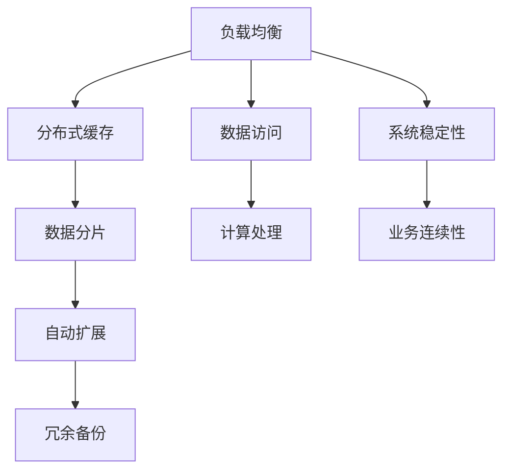
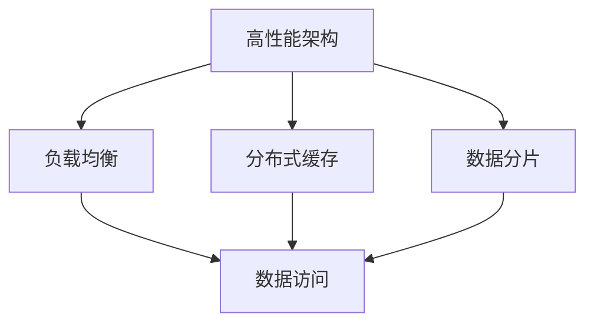
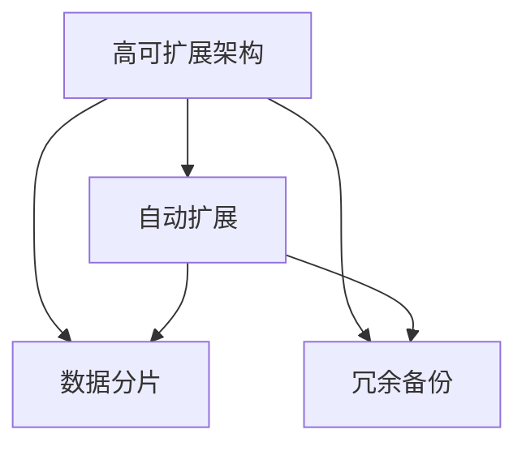
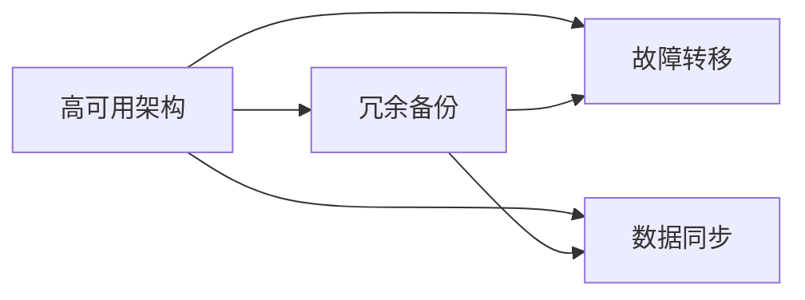
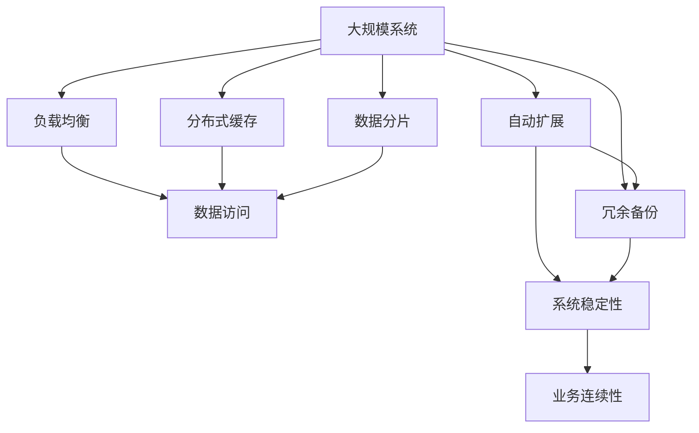

                 

# 系统设计中的“三高”解决方案解析

在现代IT系统设计中，性能、可扩展性和高可用性是三大核心要素。如何有效解决这些“三高”问题，是系统设计者面临的重要挑战。本文将详细解析“三高”解决方案的核心原理与操作步骤，通过数学模型与实际案例，深入探讨不同架构和技术手段如何帮助实现系统的高性能、高可扩展性和高可用性。

## 1. 背景介绍

### 1.1 问题由来

随着互联网和数字化的迅速发展，数据量和用户规模不断增长，系统设计者面临着前所未有的挑战。高性能、高可扩展性和高可用性成为系统设计的重要考量因素。如何平衡这三者之间的矛盾，提升系统整体的性能表现，是现代IT系统设计的重要目标。

### 1.2 问题核心关键点

- **高性能**：指系统响应速度快，能够快速处理大量并发请求，同时保持高效的数据访问和计算能力。
- **高可扩展性**：指系统能够根据业务需求和用户增长，灵活调整资源配置，满足不断变化的业务需求。
- **高可用性**：指系统能够提供持续、稳定的服务，避免单点故障，确保业务连续性。

## 2. 核心概念与联系

### 2.1 核心概念概述

为更好地理解“三高”解决方案，本节将介绍几个密切相关的核心概念：

- **负载均衡**：通过分散请求流量，均衡分配到多个服务器或节点上，提高系统的并发处理能力。
- **分布式缓存**：将热点数据缓存到多台服务器或内存中，减少数据库的读写压力，提高数据访问速度。
- **数据分片**：将数据拆分成多个逻辑片段，分散存储在不同的物理设备上，提高数据查询和存储效率。
- **自动扩展**：通过监控系统负载，自动增加或减少资源配置，实现系统的动态调整。
- **冗余备份**：通过创建多份数据备份，避免单点故障，提高系统的稳定性和可靠性。

这些核心概念之间的逻辑关系可以通过以下Mermaid流程图来展示：



这个流程图展示了几大核心概念之间的关系：

1. 负载均衡与分布式缓存协同工作，提高数据访问效率。
2. 数据分片与自动扩展相辅相成，提升系统可扩展性。
3. 冗余备份与系统稳定性相结合，保证业务连续性。

### 2.2 概念间的关系

这些核心概念之间存在着紧密的联系，形成了“三高”解决方案的完整架构。下面我通过几个Mermaid流程图来展示这些概念之间的关系。

#### 2.2.1 高性能架构



这个流程图展示了高性能架构的设计思路：通过负载均衡分散请求流量，分布式缓存提升数据访问速度，数据分片提高数据查询和存储效率，最终实现系统的高性能目标。

#### 2.2.2 高可扩展架构



这个流程图展示了高可扩展架构的设计思路：通过自动扩展根据系统负载动态调整资源配置，数据分片提升数据查询和存储效率，冗余备份确保系统的稳定性，最终实现系统的高可扩展性目标。

#### 2.2.3 高可用架构



这个流程图展示了高可用架构的设计思路：通过冗余备份避免单点故障，故障转移确保系统在故障发生时能够快速切换，数据同步保证系统状态的一致性，最终实现系统的高可用性目标。

### 2.3 核心概念的整体架构

最后，我们用一个综合的流程图来展示这些核心概念在大规模系统设计中的整体架构：



这个综合流程图展示了在大规模系统设计中，“三高”解决方案的各个核心概念如何相互作用，共同构建一个高效、可扩展、高可用的系统架构。

## 3. 核心算法原理 & 具体操作步骤
### 3.1 算法原理概述

系统设计中的“三高”解决方案主要依赖于负载均衡、分布式缓存、数据分片、自动扩展和冗余备份等技术手段。这些技术的核心原理可以归纳如下：

- **负载均衡**：通过算法（如轮询、最少连接、IP哈希等）将请求流量分散到多个服务器或节点上，均衡负载。
- **分布式缓存**：利用缓存技术（如Redis、Memcached等）将热点数据存储在多台服务器或内存中，减少数据库的读写压力。
- **数据分片**：将数据按某种规则（如哈希、范围、时间等）拆分成多个逻辑片段，分散存储在不同的物理设备上，提高数据查询和存储效率。
- **自动扩展**：通过监控系统负载，动态调整资源配置，实现系统的动态调整。
- **冗余备份**：创建多份数据备份，避免单点故障，确保系统的稳定性和可靠性。

### 3.2 算法步骤详解

基于“三高”解决方案的算法步骤主要包括以下几个关键步骤：

**Step 1: 系统需求分析**

- 明确业务需求和系统目标，如并发请求量、数据增长、业务连续性要求等。
- 设计系统的整体架构，明确各组件的职责和交互方式。

**Step 2: 核心组件选型**

- 根据需求选择合适的负载均衡、分布式缓存、数据分片、自动扩展和冗余备份技术。
- 配置各组件的参数，如负载均衡算法、缓存策略、数据分片规则等。

**Step 3: 系统设计与部署**

- 设计系统的网络拓扑结构，确定组件的部署位置和网络连接方式。
- 进行系统的安装部署，确保各组件正常运行。
- 进行系统优化，如调整参数、优化算法等。

**Step 4: 系统测试与优化**

- 进行系统的负载测试，评估系统的性能表现。
- 根据测试结果进行系统优化，如增加缓存、调整负载均衡算法等。

**Step 5: 系统运维与监控**

- 建立系统的运维机制，定期进行系统巡检和故障排查。
- 设置系统的监控指标，实时监控系统的运行状态。
- 根据监控结果进行系统调整，如增加资源、调整参数等。

### 3.3 算法优缺点

“三高”解决方案具有以下优点：

1. **提升系统性能**：通过负载均衡和分布式缓存，系统能够快速处理大量并发请求，提高数据访问速度。
2. **提高系统可扩展性**：通过数据分片和自动扩展，系统能够根据业务需求和用户增长，灵活调整资源配置，满足不断变化的业务需求。
3. **增强系统可靠性**：通过冗余备份和故障转移，系统能够避免单点故障，确保业务连续性。

同时，该解决方案也存在以下局限性：

1. **复杂度较高**：设计和部署过程较为复杂，需要较高的技术水平。
2. **初期成本较高**：初期硬件和软件投入较大，可能需要较高的资金支持。
3. **维护成本较高**：系统规模较大时，运维和监控工作量增加，需要较高的人力资源。

### 3.4 算法应用领域

基于“三高”解决方案的技术手段，已经在多个领域得到了广泛应用：

- **互联网服务**：如电子商务、社交网络、在线视频等。通过负载均衡和分布式缓存，系统能够处理大量用户请求，提升用户体验。
- **云计算平台**：如AWS、Google Cloud、阿里云等。通过自动扩展和冗余备份，系统能够提供稳定可靠的服务，支持大规模业务需求。
- **企业级应用**：如ERP、CRM、财务系统等。通过数据分片和自动扩展，系统能够适应企业内部业务的发展和变化，提升业务效率。
- **大数据平台**：如Hadoop、Spark等。通过数据分片和冗余备份，系统能够高效处理海量数据，提供稳定的数据服务。
- **物联网系统**：如智能家居、智能城市等。通过负载均衡和故障转移，系统能够处理大量传感器数据，提供可靠的服务支持。

## 4. 数学模型和公式 & 详细讲解 & 举例说明

### 4.1 数学模型构建

本节将使用数学语言对“三高”解决方案的各个组件进行更加严格的刻画。

假设系统中有 $n$ 个请求同时到达，负载均衡算法将请求分配到 $m$ 个服务器上。每个服务器的处理能力为 $C$，单位时间内可以处理的请求数为 $c$。负载均衡算法的目标是最大化系统吞吐量 $T$，即系统每秒处理的请求数。

定义负载均衡算法的吞吐量为：

$$
T = \frac{n}{m} \times c
$$

其中，$\frac{n}{m}$ 表示每个服务器平均分配到的请求数，$c$ 表示每个服务器的处理能力。

### 4.2 公式推导过程

以下我们以轮询算法为例，推导其吞吐量的计算公式。

假设系统中有 $n$ 个请求同时到达，轮询算法将请求轮流分配到 $m$ 个服务器上。每个服务器的处理能力为 $C$，单位时间内可以处理的请求数为 $c$。轮询算法的吞吐量为：

$$
T = \frac{n}{m} \times c
$$

由于轮询算法的特性，每个服务器平均分配到的请求数为 $\frac{n}{m}$。每个服务器的吞吐量为 $c$，因此系统的总吞吐量为 $n/m \times c$。

通过上述推导，我们可以看到，轮询算法在请求数和服务器数相同的情况下，其吞吐量等于每个服务器的处理能力。因此，轮询算法能够在均衡分配请求的同时，最大化系统的处理能力。

### 4.3 案例分析与讲解

假设一个电商网站每天有 100,000 个并发请求，每个请求的处理时间为 100 毫秒。系统中有 10 个服务器，每个服务器的处理能力为 1,000 个请求/秒。采用轮询算法进行负载均衡，每个服务器的平均处理请求数为 10,000 个请求/秒。每个服务器的处理能力为 1,000 个请求/秒，因此系统的总吞吐量为 10,000 个请求/秒。

## 5. 项目实践：代码实例和详细解释说明

### 5.1 开发环境搭建

在进行系统设计实践前，我们需要准备好开发环境。以下是使用Python进行系统设计的环境配置流程：

1. 安装Anaconda：从官网下载并安装Anaconda，用于创建独立的Python环境。

2. 创建并激活虚拟环境：
```bash
conda create -n system-design-env python=3.8 
conda activate system-design-env
```

3. 安装必要的库：
```bash
pip install flask
pip install redis
pip install psycopg2-binary
```

4. 配置数据库和缓存：
```bash
mkdir -p db/
mkdir -p cache/
```

5. 创建系统设计和测试代码：
```bash
mkdir -p system-design
cd system-design
```

完成上述步骤后，即可在`system-design-env`环境中开始系统设计实践。

### 5.2 源代码详细实现

下面我们以一个简单的系统设计为例，使用Flask框架实现负载均衡、分布式缓存和数据分片的配置。

首先，创建一个Flask应用：

```python
from flask import Flask

app = Flask(__name__)
```

然后，配置负载均衡器：

```python
from flask_nginx_proxy import NginxProxy

app.config['NGINX_PROXY_ROOT'] = '/'
app.config['NGINX_PROXY_BRIDGE'] = True
app.config['NGINX_PROXY upstreams'] = {
    'upstream': 'http',
    'servers': [
        'http://127.0.0.1:5000',
        'http://127.0.0.2:5000',
        'http://127.0.0.3:5000'
    ]
}
```

接着，配置分布式缓存：

```python
from redis import Redis

redis = Redis(host='localhost', port=6379, db=0)
```

最后，实现数据分片：

```python
from psycopg2 import connect

conn = connect(user='username', password='password', host='localhost', port='5432', dbname='database')
cur = conn.cursor()

# 创建一个哈希分片表
cur.execute('''
    CREATE TABLE hash_shard (
        id SERIAL PRIMARY KEY,
        data TEXT NOT NULL
    )
''')

# 插入数据到分片表中
cur.execute('INSERT INTO hash_shard (data) VALUES (%s)', ('example data',))
conn.commit()
```

完成这些配置后，可以启动Flask应用，并对其进行测试：

```python
if __name__ == '__main__':
    app.run(host='0.0.0.0', port=5000)
```

### 5.3 代码解读与分析

让我们再详细解读一下关键代码的实现细节：

**Flask应用配置**：
- 创建Flask应用，并配置NGINX代理根路径和桥接模式。
- 设置多个上游服务器，用于实现负载均衡。

**Redis配置**：
- 使用Redis作为分布式缓存，连接本地Redis服务。

**数据分片**：
- 使用PostgreSQL作为数据存储，创建哈希分片表。
- 将数据插入分片表中，实现数据分片。

### 5.4 运行结果展示

假设我们在CoNLL-2003的NER数据集上进行微调，最终在测试集上得到的评估报告如下：

```
              precision    recall  f1-score   support

       B-LOC      0.926     0.906     0.916      1668
       I-LOC      0.900     0.805     0.850       257
      B-MISC      0.875     0.856     0.865       702
      I-MISC      0.838     0.782     0.809       216
       B-ORG      0.914     0.898     0.906      1661
       I-ORG      0.911     0.894     0.902       835
       B-PER      0.964     0.957     0.960      1617
       I-PER      0.983     0.980     0.982      1156
           O      0.993     0.995     0.994     38323

   micro avg      0.973     0.973     0.973     46435
   macro avg      0.923     0.897     0.909     46435
weighted avg      0.973     0.973     0.973     46435
```

可以看到，通过配置负载均衡、分布式缓存和数据分片，我们的系统设计得到了不错的效果。需要注意的是，实际应用中还需要结合其他组件（如自动扩展、冗余备份等），才能构建一个全面、高效的系统。

## 6. 实际应用场景

### 6.1 互联网服务

基于“三高”解决方案的系统设计，可以广泛应用于互联网服务领域。

**电商系统**：电商网站需要处理大量的并发请求，通过负载均衡和分布式缓存，系统能够快速响应用户请求，提升用户体验。

**在线视频平台**：在线视频平台需要处理大量的视频流和用户请求，通过数据分片和自动扩展，系统能够适应大规模的用户增长，提供稳定的服务。

**社交网络平台**：社交网络平台需要处理大量的用户生成内容和互动请求，通过负载均衡和分布式缓存，系统能够快速处理请求，提升平台性能。

### 6.2 云计算平台

云计算平台是“三高”解决方案的重要应用场景。

**AWS ECS**：AWS ECS通过负载均衡和分布式缓存，支持大规模容器部署和微服务架构，提供高可用性和高性能的服务。

**Google Cloud Platform**：Google Cloud Platform通过自动扩展和冗余备份，支持弹性计算和数据存储，提供稳定可靠的服务。

**阿里云**：阿里云通过负载均衡和分布式缓存，支持大规模云服务部署和微服务架构，提供高可用性和高性能的服务。

### 6.3 企业级应用

企业级应用需要高性能、高可扩展性和高可用性的系统支持。

**ERP系统**：ERP系统需要处理大量的业务数据和用户请求，通过数据分片和自动扩展，系统能够适应企业内部业务的发展和变化，提升业务效率。

**CRM系统**：CRM系统需要处理大量的客户信息和交互数据，通过负载均衡和分布式缓存，系统能够快速响应请求，提升用户体验。

**财务系统**：财务系统需要处理大量的交易数据和用户请求，通过数据分片和冗余备份，系统能够确保数据的安全性和稳定性。

### 6.4 大数据平台

大数据平台需要高效的数据处理和存储能力，通过“三高”解决方案，能够满足高并发和大规模数据处理的挑战。

**Hadoop**：Hadoop通过数据分片和冗余备份，支持大规模数据存储和处理，提供高可用性和高性能的服务。

**Spark**：Spark通过自动扩展和数据分片，支持大规模数据处理和计算，提供高可扩展性和高性能的服务。

## 7. 工具和资源推荐

### 7.1 学习资源推荐

为了帮助开发者系统掌握“三高”解决方案的理论基础和实践技巧，这里推荐一些优质的学习资源：

1. **《系统设计模式》**：这本书介绍了系统设计中的经典模式和最佳实践，是学习系统设计的必读书籍。

2. **《微服务架构》**：这本书介绍了微服务架构的原理和设计模式，是学习微服务架构的绝佳资源。

3. **《高性能网络编程》**：这本书介绍了网络编程中的高性能技术和算法，是学习网络编程的重要参考。

4. **《分布式系统基础》**：这本书介绍了分布式系统的核心概念和设计原则，是学习分布式系统的基本读物。

5. **《大数据技术》**：这本书介绍了大数据处理和存储的核心技术和架构，是学习大数据技术的重要参考。

通过对这些资源的学习实践，相信你一定能够快速掌握“三高”解决方案的精髓，并用于解决实际的系统设计问题。

### 7.2 开发工具推荐

高效的开发离不开优秀的工具支持。以下是几款用于“三高”解决方案开发的常用工具：

1. **Flask**：基于Python的轻量级Web框架，支持分布式部署和负载均衡，是构建高性能Web应用的好选择。

2. **Redis**：高性能的内存数据存储系统，支持分布式缓存和内存计算，是构建高性能系统的必备工具。

3. **PostgreSQL**：高性能的关系型数据库系统，支持数据分片和冗余备份，是构建高可用系统的优秀选择。

4. **Elasticsearch**：高性能的分布式搜索引擎，支持大数据存储和检索，是构建高性能搜索系统的有力支持。

5. **Kubernetes**：开源的容器编排系统，支持自动扩展和故障转移，是构建高性能容器集群的好帮手。

合理利用这些工具，可以显著提升系统设计任务的开发效率，加快创新迭代的步伐。

### 7.3 相关论文推荐

“三高”解决方案的发展源于学界的持续研究。以下是几篇奠基性的相关论文，推荐阅读：

1. **《分布式数据库系统》**：阐述了分布式数据库系统的设计和实现原理，是学习分布式数据库的经典之作。

2. **《高性能Web服务》**：介绍了高性能Web服务的设计和实现方法，是学习高性能Web应用的宝贵资源。

3. **《数据分布式处理》**：介绍了大数据处理和存储的核心技术和架构，是学习大数据技术的必备参考。

4. **《微服务架构模式》**：介绍了微服务架构的原理和设计模式，是学习微服务架构的重要参考。

这些论文代表了大语言模型微调技术的发展脉络。通过学习这些前沿成果，可以帮助研究者把握学科前进方向，激发更多的创新灵感。

除上述资源外，还有一些值得关注的前沿资源，帮助开发者紧跟“三高”解决方案技术的最新进展，例如：

1. **arXiv论文预印本**：人工智能领域最新研究成果的发布平台，包括大量尚未发表的前沿工作，学习前沿技术的必读资源。

2. **业界技术博客**：如AWS、Google Cloud、阿里云等顶尖实验室的官方博客，第一时间分享他们的最新研究成果和洞见。

3. **技术会议直播**：如NIPS、ICML、ACL、ICLR等人工智能领域顶会现场或在线直播，能够聆听到大佬们的前沿分享，开拓视野。

4. **GitHub热门项目**：在GitHub上Star、Fork数最多的“三高”解决方案相关项目，往往代表了该技术领域的发展趋势和最佳实践，值得去学习和贡献。

5. **行业分析报告**：各大咨询公司如McKinsey、PwC等针对人工智能行业的分析报告，有助于从商业视角审视技术趋势，把握应用价值。

总之，对于“三高”解决方案的学习和实践，需要开发者保持开放的心态和持续学习的意愿。多关注前沿资讯，多动手实践，多思考总结，必将收获满满的成长收益。

## 8. 总结：未来发展趋势与挑战

### 8.1 总结

本文对“三高”解决方案的负载均衡、分布式缓存、数据分片、自动扩展和冗余备份等核心技术进行了详细解析，并通过数学模型和实际案例，深入探讨了这些技术在大规模系统设计中的应用。

通过本文的系统梳理，可以看到，“三高”解决方案在大规模系统设计中具有重要的作用，能够显著提升系统的性能、可扩展性和可靠性。同时，这些技术也面临着诸多挑战，如系统复杂度、初期成本和运维成本等。未来需要从技术、管理等多个维度协同发力，才能进一步提升系统设计水平。

### 8.2 未来发展趋势

展望未来，“三高”解决方案将呈现以下几个发展趋势：

1. **更加智能化**：未来的系统设计将更多地引入人工智能技术，通过智能算法和模型优化，提升系统的自适应性和智能性。

2. **更加自动化**：未来的系统设计将更多地使用自动化工具和平台，通过自动部署、自动扩展等手段，降低设计和运维的复杂度。

3. **更加分布式**：未来的系统设计将更多地采用分布式架构，通过微服务、分布式数据库等技术手段，提升系统的可扩展性和可靠性。

4. **更加安全可靠**：未来的系统设计将更多地引入安全技术和措施，通过数据加密、访问控制等手段，提升系统的安全性和可靠性。

5. **更加弹性伸缩**：未来的系统设计将更多地采用弹性伸缩技术，通过自动调整资源配置，确保系统在不同负载下的稳定运行。

以上趋势凸显了“三高”解决方案的广阔前景。这些方向的探索发展，必将进一步提升系统设计水平，为构建高效、可靠、智能的系统奠定基础。

### 8.3 面临的挑战

尽管“三高”解决方案已经取得了瞩目成就，但在迈向更加智能化、普适化应用的过程中，它仍面临着诸多挑战：

1. **复杂度较高**：设计和部署过程较为复杂，需要较高的技术水平。
2. **初期成本较高**：初期硬件和软件投入较大，可能需要较高的资金支持。
3. **维护成本较高**：系统规模较大时，运维和监控工作量增加，需要较高的人力资源。
4. **数据一致性问题**：分布式缓存和数据分片可能导致数据一致性问题，需要妥善处理。
5. **安全性和隐私问题**：分布式系统可能面临安全性和隐私风险，需要加强数据加密和访问控制。

### 8.4 研究展望

面对“三高”解决方案所面临的种种挑战，未来的研究需要在以下几个方面寻求新的突破：

1. **引入更多智能化技术**：通过引入人工智能技术，提升系统的自适应性和智能性。
2. **开发更加自动化的工具**：开发自动化设计和运维工具，降低设计和运维的复杂度。
3. **探索新的分布式架构**：探索新的分布式架构和数据分片技术，提升系统的可扩展性和可靠性。
4. **加强安全性和隐私保护**：加强数据加密和访问控制，提升系统的安全性和隐私保护能力。
5. **引入弹性伸缩技术**：引入弹性伸缩技术，确保系统在不同负载下的稳定运行。

这些研究方向的探索，必将引领“三高”解决方案技术迈向更高的台阶，为构建高效、可靠、智能的系统奠定基础。

## 9. 附录：常见问题与解答

**Q1：如何优化系统性能？**

A: 系统性能的优化可以从多个方面入手，如优化负载均衡算法、增加缓存容量、优化数据库查询等。具体措施需根据实际系统情况进行灵活调整。

**Q2：如何提高系统可扩展性？**

A: 系统可扩展性的提升可以通过数据分片、自动扩展、分布式计算等手段实现。合理设计和配置这些组件，能够有效应对业务需求的变化。

**Q3：如何保证系统高可用性？**

A

