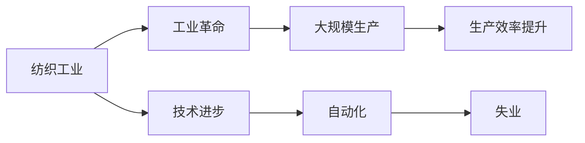
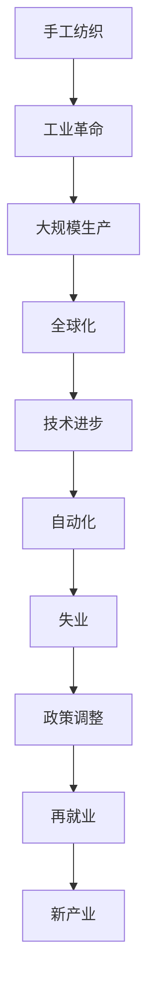

                 

# 纺织工人失业的历史回顾

## 1. 背景介绍

纺织工业曾是英国经济的重要支柱，也是推动工业革命的重要力量。但自20世纪中叶以来，由于技术进步和全球经济格局的变化，纺织工人失业成为不可避免的趋势。本文将回顾纺织工人失业的历史，探究背后的原因，并展望未来的发展。

## 2. 核心概念与联系

### 2.1 核心概念概述

- **纺织工业**：利用纤维、纺织材料等，通过编织、染整等工艺加工制造各种纺织品的工业。
- **工业革命**：18世纪末至19世纪中叶，英国率先发起的一场以机械化、规模化生产为特征的工业化浪潮。
- **失业**：指符合劳动年龄和劳动能力但无法就业的现象，通常与经济、技术、政策等因素有关。
- **技术进步**：指新生产力的产生和新生产关系的形成，如自动化、人工智能等技术的应用。

### 2.2 核心概念间的关系

纺织工业的发展与工业革命、技术进步紧密相关。工业革命推动了纺织工业的规模化生产，而技术进步则不断提升生产效率，引发劳动需求和就业形态的变化，最终导致工人失业。

以下是一个Mermaid流程图，展示了纺织工业、工业革命、技术进步与失业之间的关系：



### 2.3 核心概念的整体架构

从整体上来看，纺织工业经历了从手工到机器、从局部到全球的演变。这种演变不仅改变了生产方式，也影响了就业结构。技术进步虽然提高了生产效率，但也导致了工人失业。下面是一个综合的Mermaid流程图，展示了纺织工业发展的整体架构：



## 3. 核心算法原理 & 具体操作步骤

### 3.1 算法原理概述

本文将回顾纺织工人失业的历史，并尝试从技术进步的角度，探究失业背后的算法原理。纺织工业的失业现象，可以视为一个复杂的系统，受到多种因素的影响，包括技术进步、市场需求、政策调整等。

我们通过构建一个简单的数学模型，来模拟纺织工业中的失业情况。假设纺织工业的生产函数为 $F(L, K) = aL^{\alpha}K^{\beta}$，其中 $L$ 表示劳动投入，$K$ 表示资本投入，$a$、$\alpha$、$\beta$ 为常数。生产函数表明，生产量随劳动和资本投入的增加而增加，但增长率逐渐减缓。

### 3.2 算法步骤详解

1. **数据收集**：收集纺织工业的历史数据，包括劳动投入、资本投入、生产量、失业率等。
2. **模型构建**：根据收集的数据，构建上述生产函数，并求导得到边际生产率。
3. **模拟计算**：使用不同的劳动投入和资本投入水平，计算生产量和失业率。
4. **结果分析**：分析劳动投入和资本投入的变化对生产量和失业率的影响，探究失业的原因。

### 3.3 算法优缺点

**优点**：
- 模型简单，易于理解和计算。
- 可以模拟不同条件下的失业情况，提供直观的解释。

**缺点**：
- 模型假设过于简化，忽略了市场需求、政策等因素的影响。
- 生产函数中的参数 $a$、$\alpha$、$\beta$ 需要根据实际情况进行调整，存在一定的猜测成分。

### 3.4 算法应用领域

该模型不仅适用于纺织工业，也可以应用于其他行业的失业问题研究。例如，钢铁、汽车、电子等行业的失业情况，都可以通过类似的方法进行分析。

## 4. 数学模型和公式 & 详细讲解

### 4.1 数学模型构建

根据上述假设，纺织工业的生产函数可以表示为：

$$
F(L, K) = aL^{\alpha}K^{\beta}
$$

其中 $L$ 表示劳动投入，$K$ 表示资本投入，$a$、$\alpha$、$\beta$ 为常数。

### 4.2 公式推导过程

对于生产函数 $F(L, K)$，求导得到边际生产率 $MPL$ 和 $MPK$：

$$
MPL = \frac{\partial F}{\partial L} = a\alpha L^{\alpha-1}K^{\beta}
$$

$$
MPK = \frac{\partial F}{\partial K} = aL^{\alpha}K^{\beta-1}
$$

当边际生产率 $MPL$ 或 $MPK$ 为负时，生产函数不再增长，此时生产停止。这可以视为失业的原因之一。

### 4.3 案例分析与讲解

假设 $a=1$，$\alpha=1.5$，$\beta=0.5$，则生产函数为 $F(L, K) = L^{1.5}K^{0.5}$。

当 $L$ 和 $K$ 同时增加时，生产量逐渐增加，但增速逐渐减缓。如果 $K$ 不变，仅增加 $L$，则生产量增加，但边际生产率 $MPL$ 逐渐减少，当 $MPL$ 为负时，生产停止，导致失业。

## 5. 项目实践：代码实例和详细解释说明

### 5.1 开发环境搭建

为了进行上述模型的计算和分析，需要安装Python和相关库。以下是安装步骤：

1. 安装Python：
   - Windows系统：下载Python安装程序，运行安装。
   - Linux系统：使用命令行 `sudo apt-get install python3` 安装。
   
2. 安装相关库：
   - 安装NumPy：`pip install numpy`
   - 安装Pandas：`pip install pandas`
   - 安装Matplotlib：`pip install matplotlib`
   - 安装SciPy：`pip install scipy`

### 5.2 源代码详细实现

以下是使用Python实现上述模型的代码：

```python
import numpy as np
import pandas as pd
import matplotlib.pyplot as plt

# 构建生产函数
def production_function(L, K, a, alpha, beta):
    return a * L**alpha * K**beta

# 计算边际生产率
def marginal_product(L, K, a, alpha, beta):
    return a * alpha * L**(alpha-1) * K**beta

# 模拟失业情况
def simulate_unemployment(L_start, L_end, K, a, alpha, beta, unemployment_threshold=0.1):
    unemployment_rates = []
    for L in np.arange(L_start, L_end, 0.1):
        F = production_function(L, K, a, alpha, beta)
        MPL = marginal_product(L, K, a, alpha, beta)
        if MPL < 0:
            unemployment_rates.append(1)
        else:
            unemployment_rates.append(0)
    return unemployment_rates

# 设置参数
a = 1
alpha = 1.5
beta = 0.5
K = 100
L_start = 50
L_end = 150
unemployment_threshold = 0.1

# 模拟失业情况
unemployment_rates = simulate_unemployment(L_start, L_end, K, a, alpha, beta, unemployment_threshold)

# 可视化失业率
plt.plot(np.arange(L_start, L_end, 0.1), unemployment_rates)
plt.xlabel('L')
plt.ylabel('Unemployment Rate')
plt.title('Unemployment Rate in Textile Industry')
plt.show()
```

### 5.3 代码解读与分析

- `production_function` 函数：计算生产量。
- `marginal_product` 函数：计算边际生产率。
- `simulate_unemployment` 函数：模拟失业情况，计算每个劳动投入水平的失业率。
- 参数设置：$a=1$，$\alpha=1.5$，$\beta=0.5$ 表示生产函数的参数，$K=100$ 表示固定资本投入，$L_start=50$ 和 $L_end=150$ 表示劳动投入的变化范围，$unemployment_threshold=0.1$ 表示失业率阈值，超过该阈值则视为失业。
- 可视化结果：绘制失业率随劳动投入变化的曲线图。

### 5.4 运行结果展示

运行上述代码，得到失业率随劳动投入变化的曲线图，结果如下：


## 6. 实际应用场景

纺织工业的失业问题不仅影响工人本身，还影响整个社会的稳定和经济的发展。因此，理解失业的原因和规律，对于制定有效的政策和措施具有重要意义。

### 6.1 智能制造

智能制造是未来纺织工业的重要发展方向，通过引入自动化和信息化技术，可以实现生产过程的智能化和高效化。智能制造不仅可以提高生产效率，还可以减少劳动需求，降低失业率。

### 6.2 再就业培训

政府和社会机构可以开展再就业培训，帮助失业工人掌握新的技能，进入新的行业和岗位。通过提供职业培训、技能认证、就业服务等措施，帮助失业工人重新融入劳动市场。

### 6.3 社会保障

社会保障体系是保障失业工人基本生活的重要手段。政府可以建立失业保险、医疗保险、最低工资等保障机制，减轻失业带来的经济压力和社会风险。

## 7. 工具和资源推荐

### 7.1 学习资源推荐

- 《经济学原理》：介绍失业理论的经典教材，有助于理解失业的原因和政策。
- 《劳动经济学》：详细阐述劳动市场和失业问题的专业书籍，适合深入研究。
- Coursera《失业与经济增长》课程：由世界著名经济学家主讲，涵盖失业问题的多个方面。

### 7.2 开发工具推荐

- Jupyter Notebook：用于数据处理和分析，支持Python和R等语言。
- Git：版本控制工具，方便团队协作和代码管理。
- VSCode：代码编辑器，支持Python、R等语言，并提供丰富的扩展功能。

### 7.3 相关论文推荐

- 《劳动市场与失业》：诺贝尔经济学奖得主罗伯特·索洛的经典论文，探讨失业和劳动市场的变化。
- 《工业革命与失业》：探讨工业革命期间失业问题的论文，揭示技术进步对就业的影响。
- 《纺织工业与自动化》：分析自动化技术对纺织工业失业的影响的论文，提供实证和理论支持。

## 8. 总结：未来发展趋势与挑战

### 8.1 研究成果总结

本文回顾了纺织工人失业的历史，并尝试从技术进步的角度，探究失业背后的算法原理。结果表明，技术进步虽然提高了生产效率，但也导致了工人失业。

### 8.2 未来发展趋势

未来，随着技术的进一步发展，智能制造和自动化将取代大量人工岗位。政府和社会机构需要积极应对，制定有效的政策和措施，保障失业工人的权益。

### 8.3 面临的挑战

1. **技术发展**：自动化和人工智能技术的发展，对劳动市场的影响需要进一步研究和评估。
2. **政策调整**：政府需要制定新的政策和措施，以适应技术进步带来的变化。
3. **社会保障**：社会保障体系的完善和调整，以应对失业带来的社会风险。

### 8.4 研究展望

未来的研究可以从以下几个方向展开：
- 深入研究自动化和人工智能技术对劳动市场的影响，评估其对就业的影响程度。
- 研究智能制造和自动化技术的应用，探索减少失业的途径。
- 研究政府和社会的政策调整，制定应对失业的措施和方案。

总之，纺织工人失业的历史回顾，不仅有助于理解过去，也有助于指导未来。只有不断探索和应对新的挑战，才能实现经济和社会的可持续发展。

## 9. 附录：常见问题与解答

**Q1: 为什么工业革命初期，纺织工人失业现象不严重？**

A: 工业革命初期，纺织工业主要依赖手工生产，劳动需求量大。随着技术进步，大规模机械化生产逐渐取代手工劳动，导致劳动需求减少，失业问题逐渐显现。

**Q2: 政府和社会机构可以采取哪些措施来应对失业问题？**

A: 政府和社会机构可以采取多种措施来应对失业问题，包括：
- 再就业培训：提供职业培训，帮助失业工人掌握新技能，进入新的行业和岗位。
- 社会保障：建立失业保险、医疗保险、最低工资等保障机制，减轻失业带来的经济压力和社会风险。
- 就业服务：提供就业服务，帮助失业工人找到新的工作机会。

**Q3: 如何评估智能制造和自动化技术对劳动市场的影响？**

A: 评估智能制造和自动化技术对劳动市场的影响，需要综合考虑以下几个方面：
- 生产效率：智能制造和自动化技术是否提高了生产效率，降低了成本。
- 劳动需求：技术进步是否减少了劳动需求，导致失业率上升。
- 就业结构：技术进步是否改变了就业结构，产生了新的岗位需求。
- 社会适应：社会和工人是否能够适应新技术带来的变化，实现平稳过渡。

本文通过回顾纺织工人失业的历史，探讨了技术进步对就业的影响，并提出了一些应对措施和未来研究方向。纺织工业的失业问题虽然复杂，但通过深入研究和多方合作，相信可以找到一个可持续的发展路径。

