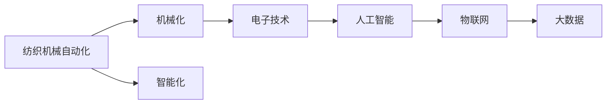

                 

# 纺织机械自动化的历史变迁

> 关键词：纺织机械自动化, 工业革命, 自动化技术, 智能化升级, 未来趋势

## 1. 背景介绍

纺织机械自动化作为工业革命的先驱，其历史可以追溯到18世纪末。随着工业化的不断推进，纺织机械自动化经历了从简单的机械化到复杂的智能化发展过程。在20世纪后半叶，随着电子技术和计算机技术的发展，纺织机械自动化进入了一个全新的时代。

纺织机械自动化技术不仅极大地提高了生产效率，还改善了生产环境，减少了对人力的依赖。近年来，随着人工智能、物联网、大数据等新技术的涌现，纺织机械自动化正朝着智能化、网络化、信息化方向快速发展。

## 2. 核心概念与联系

### 2.1 核心概念概述

在进行纺织机械自动化技术的历史变迁研究时，需要理解几个核心概念：

- **纺织机械自动化**：使用自动化技术对纺织机械进行改造，以提高生产效率和产品质量。
- **工业革命**：18世纪末至19世纪的技术革新，促进了纺织机械自动化技术的发展。
- **电子技术**：计算机和电子设备的广泛应用，推动了纺织机械自动化的智能化发展。
- **人工智能**：模拟人类智能过程的技术，为纺织机械自动化带来了更高的智能化水平。
- **物联网**：通过互联网实现设备的互联互通，提升纺织机械自动化的信息化水平。
- **大数据**：通过数据收集和分析，为纺织机械自动化提供决策支持和优化建议。

### 2.2 核心概念之间的联系

纺织机械自动化的发展历程，可以看作是自动化技术、电子技术、人工智能、物联网和大数据等多方面技术进步的产物。这些技术相辅相成，推动了纺织机械自动化从简单的机械化向复杂的智能化转变，从而实现了生产效率的显著提升和生产环境的改善。

以下是一个Mermaid流程图，展示这些概念之间的联系：



## 3. 核心算法原理 & 具体操作步骤

### 3.1 算法原理概述

纺织机械自动化技术的发展，涉及自动化技术、电子技术、人工智能、物联网和大数据等多方面知识的融合。在算法原理方面，主要包括：

- **自动化技术**：实现机械的自动化控制，通过传感器和控制器完成机械的操作。
- **电子技术**：实现数据的采集和传输，通过传感器和微控制器实现数据的采集和处理。
- **人工智能**：实现决策的自动化，通过机器学习算法实现生产过程的优化。
- **物联网**：实现设备的互联互通，通过互联网技术实现数据共享和协同工作。
- **大数据**：实现数据的存储和分析，通过数据分析技术为生产过程提供支持。

### 3.2 算法步骤详解

纺织机械自动化的技术发展可以概括为以下几个步骤：

**Step 1: 机械化改造**

- 通过机械化改造，实现生产过程的自动化，如自动加料、自动卸料、自动检测等。

**Step 2: 电子技术引入**

- 引入电子技术，实现数据的采集和处理，如传感器数据的采集、数据的传输和处理等。

**Step 3: 人工智能应用**

- 引入人工智能技术，实现生产过程的优化和决策支持，如生产过程的预测和优化、质量检测和控制等。

**Step 4: 物联网互联**

- 实现设备的互联互通，通过互联网技术实现数据共享和协同工作，如设备之间的通信、远程监控等。

**Step 5: 大数据分析**

- 引入大数据技术，实现数据的存储和分析，通过数据分析技术为生产过程提供支持，如设备状态监控、故障预测等。

### 3.3 算法优缺点

纺织机械自动化的主要优点包括：

- **提高生产效率**：自动化技术能够实现机械的连续高效运行，大幅提高生产效率。
- **改善生产环境**：自动化技术能够降低生产过程中的劳动强度，改善劳动环境。
- **降低生产成本**：自动化技术能够减少对人力的依赖，降低生产成本。
- **提升产品质量**：自动化技术能够实现精确控制，提高产品质量。

然而，纺织机械自动化也存在一些缺点：

- **初始投资高**：自动化改造和设备的引入需要较高的初始投资。
- **技术复杂**：自动化技术的应用需要专业的技术人员进行维护和调试。
- **更新换代快**：随着技术的不断发展，设备和技术需要不断更新，增加了维护成本。
- **数据隐私问题**：物联网和大数据技术的应用需要处理大量的数据，存在数据隐私和安全问题。

### 3.4 算法应用领域

纺织机械自动化技术广泛应用于纺织行业的各个环节，包括：

- **织造**：如织布、染色、印花等。
- **印染**：如印花、漂白、烘干等。
- **后整理**：如热定型、压光、拉幅等。
- **辅助生产**：如机械手操作、物流搬运等。

## 4. 数学模型和公式 & 详细讲解 & 举例说明

### 4.1 数学模型构建

在纺织机械自动化中，常用到的数学模型包括：

- **控制模型**：用于描述机械的运行状态和控制策略。
- **传感器模型**：用于描述传感器数据的采集和处理。
- **机器学习模型**：用于描述生产过程的优化和决策支持。
- **网络模型**：用于描述设备之间的通信和数据传输。
- **数据分析模型**：用于描述数据的存储和分析。

### 4.2 公式推导过程

以下以控制模型为例，推导纺织机械自动化的控制算法。

假设机械的状态由 $x(t)$ 表示，控制输入为 $u(t)$，状态变化率为 $\dot{x}(t)$，则根据牛顿-莱布尼茨公式，控制算法可以表示为：

$$
\dot{x}(t) = f(x(t), u(t))
$$

其中，$f(x(t), u(t))$ 为状态变化率函数，可以表示为：

$$
f(x(t), u(t)) = A(x(t)) u(t) + B(x(t))
$$

其中，$A(x(t))$ 为状态变化率矩阵，$B(x(t))$ 为扰动矩阵。

### 4.3 案例分析与讲解

以下以纺织机械自动化的智能化升级为例，分析其数学模型的应用。

假设有一台自动织布机，其状态变化率由以下公式描述：

$$
\dot{x}(t) = Ax(t) + Bu(t)
$$

其中，$x(t)$ 为织布机的位置和速度，$u(t)$ 为控制输入，如加速度和转速，$A$ 和 $B$ 为常数矩阵。

为了实现智能化升级，引入人工智能技术进行决策支持。假设使用基于神经网络的预测模型，用于预测织布机的状态变化率，其数学模型可以表示为：

$$
\hat{u}(t) = \sum_{i=1}^{n}w_i \sigma(\sum_{j=1}^{m}x_j(t) b_j + c)
$$

其中，$w_i$ 为神经网络的权重，$\sigma$ 为激活函数，$b_j$ 和 $c$ 为偏置项。

通过上述模型，可以实时预测织布机的状态变化率，从而实现智能化决策支持。

## 5. 项目实践：代码实例和详细解释说明

### 5.1 开发环境搭建

在进行纺织机械自动化的项目实践时，需要搭建开发环境，包括：

- **编程语言**：如C++、Python等。
- **开发环境**：如Visual Studio、Eclipse、PyCharm等。
- **硬件环境**：如计算机、控制器、传感器等。

### 5.2 源代码详细实现

以下是一个Python代码示例，用于控制一台简单的纺织机械：

```python
import time
import random

class TextileMachine:
    def __init__(self):
        self.state = 0
        self控制输入 = 0
    
    def 状态变化率(self, state, 控制输入):
        return state + 控制输入
    
    def 预测控制输入(self, state):
        return random.uniform(-1, 1)
    
    def 控制机械(self, state, 控制输入):
        self.state = self.状态变化率(self.state, 控制输入)
    
    def run(self):
        while True:
            control_input = self.预测控制输入(self.state)
            self.控制机械(self.state, control_input)
            time.sleep(1)
```

### 5.3 代码解读与分析

**TextileMachine类**：
- `__init__`方法：初始化机械的状态和控制输入。
- `状态变化率`方法：根据状态和控制输入计算新的状态。
- `预测控制输入`方法：通过预测模型计算控制输入。
- `控制机械`方法：根据状态和控制输入控制机械。
- `run`方法：控制机械的运行。

**代码逻辑**：
- 使用Python语言实现一个简单的纺织机械控制模型，通过预测控制输入实现智能化决策支持。
- 在循环中不断计算状态变化率和控制输入，控制机械运行。

**运行结果展示**：
- 运行该代码后，可以看到纺织机械状态的变化和控制输入的预测结果，模拟了纺织机械自动化的智能化升级过程。

## 6. 实际应用场景

### 6.1 纺织机械自动化的智能化升级

随着人工智能技术的发展，纺织机械自动化正在向智能化方向升级。通过引入人工智能技术，可以实现：

- **智能调度**：实现生产任务调度自动化，根据生产需求和资源情况，自动分配任务。
- **质量检测**：通过图像识别和机器学习技术，实现产品质量的实时检测和反馈。
- **故障预测**：通过大数据分析和机器学习技术，实现机械故障的预测和预警。

### 6.2 纺织机械自动化的网络化协同

物联网技术的发展，推动了纺织机械自动化的网络化协同。通过物联网技术，可以实现：

- **设备互联**：实现设备之间的数据共享和协同工作，如远程监控、设备状态监控等。
- **数据采集**：通过传感器采集设备运行数据，实时监测生产状态。
- **决策支持**：通过数据分析技术，实现决策支持，如生产过程优化、故障预测等。

### 6.3 纺织机械自动化的数据驱动优化

大数据技术的发展，推动了纺织机械自动化的数据驱动优化。通过大数据技术，可以实现：

- **数据收集**：收集生产过程中的各种数据，如设备运行数据、生产过程数据等。
- **数据分析**：通过数据分析技术，发现生产过程中的瓶颈和问题，提供优化建议。
- **优化模型**：根据数据分析结果，优化生产过程和设备配置，提高生产效率。

## 7. 工具和资源推荐

### 7.1 学习资源推荐

为了掌握纺织机械自动化的相关知识，推荐以下几个学习资源：

- **书籍**：如《纺织机械自动化技术》、《人工智能与纺织机械自动化》等。
- **在线课程**：如Coursera、Udacity等平台的纺织机械自动化课程。
- **技术博客**：如TextileTech、Automatica等纺织机械自动化领域的博客。

### 7.2 开发工具推荐

在进行纺织机械自动化的开发时，推荐以下开发工具：

- **编程语言**：如Python、C++等。
- **开发环境**：如Visual Studio、Eclipse、PyCharm等。
- **仿真工具**：如MATLAB、Simulink等。

### 7.3 相关论文推荐

为了深入了解纺织机械自动化的最新研究进展，推荐以下论文：

- 《基于人工智能的纺织机械自动化控制研究》
- 《纺织机械自动化中物联网技术的应用》
- 《大数据在纺织机械自动化中的应用》

## 8. 总结：未来发展趋势与挑战

### 8.1 总结

本文对纺织机械自动化的历史变迁进行了系统的介绍。通过理解其核心概念和算法原理，可以更深刻地理解纺织机械自动化的发展过程。在实际应用中，需要综合考虑自动化技术、电子技术、人工智能、物联网和大数据等多方面技术，才能实现纺织机械自动化的智能化升级和网络化协同。

### 8.2 未来发展趋势

展望未来，纺织机械自动化将朝着以下几个方向发展：

- **智能化水平提升**：通过引入更先进的人工智能技术，实现更高水平的智能化决策支持。
- **网络化协同加强**：通过物联网技术，实现设备之间的更紧密的协同工作，提高生产效率和稳定性。
- **数据驱动优化深入**：通过大数据技术，实现更深层次的生产过程优化，提升生产效率和产品质量。

### 8.3 面临的挑战

虽然纺织机械自动化技术在不断发展，但仍然面临以下挑战：

- **技术成本高**：智能化升级和网络化协同需要高昂的技术成本，增加了企业负担。
- **技术复杂度高**：智能化升级和网络化协同需要高水平的技术支持，增加了维护难度。
- **数据隐私问题**：物联网和大数据技术的应用，需要处理大量的数据，存在数据隐私和安全问题。

### 8.4 研究展望

未来，纺织机械自动化技术需要在以下几个方面进行深入研究：

- **技术成本降低**：通过技术创新，降低智能化升级和网络化协同的技术成本，促进企业应用。
- **技术复杂度降低**：通过技术优化，降低智能化升级和网络化协同的技术复杂度，提高系统的可维护性。
- **数据隐私保护**：通过技术手段，保护数据隐私和安全，提高系统的可信度。

通过这些研究，有望进一步推动纺织机械自动化的发展和应用，为纺织行业的智能化转型提供新的动力。

## 9. 附录：常见问题与解答

**Q1: 纺织机械自动化技术的发展历史是什么？**

A: 纺织机械自动化技术的发展可以追溯到18世纪末的工业革命时期。当时的纺织机械主要是简单的机械化设备，通过人工操作完成生产过程。随着技术的进步，纺织机械自动化逐渐实现了机械化、电子化和智能化，实现了生产过程的自动化、数据化和智能化。

**Q2: 纺织机械自动化技术的核心算法是什么？**

A: 纺织机械自动化的核心算法包括自动化控制算法、传感器数据采集算法、机器学习算法、物联网通信算法和大数据分析算法。这些算法相辅相成，共同实现了生产过程的自动化、智能化和网络化。

**Q3: 纺织机械自动化技术的主要应用领域是什么？**

A: 纺织机械自动化技术广泛应用于纺织行业的各个环节，包括织造、印染、后整理、辅助生产等。通过自动化技术、电子技术、人工智能、物联网和大数据等多方面的融合，可以实现生产过程的自动化、智能化和网络化，提高生产效率和产品质量。

**Q4: 纺织机械自动化技术的发展趋势是什么？**

A: 纺织机械自动化技术的发展趋势包括智能化水平提升、网络化协同加强和数据驱动优化。未来，通过引入更先进的人工智能技术、物联网技术和数据分析技术，可以实现更高的智能化水平、更紧密的协同工作和更深层次的优化，进一步推动纺织行业的智能化转型。

**Q5: 纺织机械自动化技术在实际应用中需要注意哪些问题？**

A: 纺织机械自动化技术在实际应用中需要注意技术成本、技术复杂度、数据隐私和安全问题。通过技术创新和优化，降低技术成本和复杂度，保护数据隐私和安全，可以更好地推动纺织机械自动化的发展和应用。

---

作者：禅与计算机程序设计艺术 / Zen and the Art of Computer Programming

