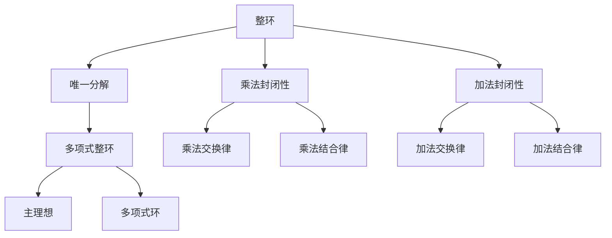

                 

# 线性代数导引：多项式整环

## 1. 背景介绍

### 1.1 问题由来
在现代代数系统中，多项式整环（Polynomial Integral Domain）是一个重要的研究对象，它在数论、代数几何和编码理论等多个领域都有广泛的应用。多项式整环是唯一分解整环的一个子类，其上不可约元素即所谓的主理想生成了整个环。这一类环在代数数论中有着特殊的重要性。

### 1.2 问题核心关键点
多项式整环的核心概念包括：
- 整环（Integral Domain）：一个整环是具有乘法和加法运算，且没有非零除数的集合。
- 唯一分解（Unique Factorization）：每个元素可以唯一分解为其不可约元素的乘积。
- 主理想（Principal Ideal）：由一个元素生成的理想。
- 多项式环（Polynomial Ring）：由多项式组成的环，其中的多项式是通过多项式乘法和加法运算构成的。

## 2. 核心概念与联系

### 2.1 核心概念概述

多项式整环的定义和相关概念可以从以下三个层面来理解：

1. **定义层面**：多项式整环是一个满足特定数学性质的代数系统。
2. **结构层面**：多项式整环内部有乘法、加法等运算，这些运算需要满足特定的封闭性、交换律、结合律等性质。
3. **应用层面**：多项式整环在数论、编码理论等领域具有重要应用价值。

为了更好地理解多项式整环，我们可以画出以下核心概念之间的联系图：



这个图展示了整环、唯一分解和多项式整环之间的关系，以及它们与乘法和加法封闭性、交换律、结合律等性质的联系。

### 2.2 概念间的关系

1. **整环**：整环是一个基本的代数结构，它的定义由乘法和加法运算的性质决定。
2. **唯一分解**：唯一分解是整环的一种性质，意味着每个元素可以唯一分解为其不可约元素的乘积。
3. **多项式整环**：多项式整环是一种特殊的整环，满足唯一分解的性质。
4. **主理想**：多项式整环中的主理想是由一个不可约元素生成的理想。
5. **多项式环**：多项式环是多项式整环的一种特殊形式，它由多项式通过多项式乘法和加法构成。

这些概念共同构成了多项式整环的核心框架，并奠定了其在代数几何、数论等数学领域的基础。

## 3. 核心算法原理 & 具体操作步骤
### 3.1 算法原理概述

多项式整环的算法原理主要基于以下几个关键点：

1. **多项式整环的构建**：多项式整环由一个主理想生成，即多项式整环中的元素可以表示为主理想内的元素。
2. **不可约元素的计算**：通过多项式整环的唯一分解性质，可以计算不可约元素。
3. **理想的操作**：多项式整环中可以进行多项式的乘法和加法，以及理想的加减和取交等操作。
4. **多项式的求解**：多项式整环中，多项式的解可以通过矩阵求逆或矩阵分解等方法获得。

### 3.2 算法步骤详解

以下是多项式整环的构建和计算的具体步骤：

1. **选择基域**：选择一个适合的多项式整环的基域，例如 $F[x]$。
2. **定义不可约元素**：在基域 $F[x]$ 中，选择若干个不可约元素，这些元素生成了多项式整环。
3. **定义理想**：定义由这些不可约元素组成的主理想，即所有多项式的线性组合，可以表示为这些不可约元素的线性组合。
4. **计算多项式整环**：通过基域中的多项式运算，得到完整的多项式整环。
5. **计算不可约元素**：通过唯一分解性质，计算出环中的所有不可约元素。
6. **理想操作**：进行多项式的加减和取交等理想操作，得到新的理想。

### 3.3 算法优缺点

多项式整环的算法具有以下优点：

1. **计算效率高**：多项式整环的计算基于多项式运算，运算效率较高。
2. **应用广泛**：多项式整环在数论、代数几何和编码理论等领域都有广泛应用。
3. **理论基础扎实**：多项式整环的算法基于唯一分解和多项式理论，理论基础坚实。

同时，多项式整环的算法也存在以下缺点：

1. **复杂度高**：多项式整环的计算复杂度较高，对于大规模的多项式整环，计算开销较大。
2. **内存消耗大**：多项式整环的存储和计算需要大量的内存空间，对于大数据集，内存消耗较大。
3. **难以优化**：多项式整环的算法难以进行进一步的优化，如并行计算等。

### 3.4 算法应用领域

多项式整环在以下领域有广泛应用：

1. **编码理论**：多项式整环被应用于纠错码的设计和分析，如线性纠错码和卷积码等。
2. **数论**：多项式整环在数论中有重要应用，如椭圆曲线密码学、多项式模算术等。
3. **代数几何**：多项式整环是代数几何的基础工具，用于代数曲线的研究。
4. **计算机科学**：多项式整环在计算机科学中用于密码学、编码、计算机代数系统等。

## 4. 数学模型和公式 & 详细讲解
### 4.1 数学模型构建

多项式整环的数学模型由多项式环 $F[x]$ 和主理想 $I$ 构成，其中 $F$ 是一个域。设 $R$ 为多项式整环，$I$ 为 $R$ 的一个主理想，则 $I$ 可以表示为 $I = \langle p \rangle$，其中 $p$ 为 $R$ 中不可约的多项式。

### 4.2 公式推导过程

设 $F[x]$ 为域 $F$ 上的多项式环，$p(x)$ 为 $F[x]$ 中的不可约多项式，$I$ 为 $F[x]$ 的主理想。

1. **多项式整环的定义**：
   $$
   R = \{f(x) + g(x) + p(x)h(x) \mid f(x), g(x), h(x) \in F[x]\}
   $$

2. **主理想 $I$ 的定义**：
   $$
   I = \langle p(x) \rangle = \{p(x)k(x) \mid k(x) \in F[x]\}
   $$

3. **多项式整环的性质**：
   - $R$ 是整环。
   - $R$ 是唯一分解整环。
   - $R$ 中的每个多项式可以唯一分解为不可约多项式的乘积。

### 4.3 案例分析与讲解

设 $F = \mathbb{Z}$，$F[x]$ 为整数域上的多项式环，$p(x) = x^2 + 1$ 为不可约多项式，则 $I = \langle p(x) \rangle$ 为 $F[x]$ 的主理想，$R = F[x] / \langle p(x) \rangle$ 为多项式整环。

对于 $R$ 中的元素 $a + b(x) + p(x)c(x)$，可以进行以下分解：
$$
a + b(x) + p(x)c(x) = (p(x)k(x) + p(x)l(x)) + (p(x)c(x)) = p(x)(k(x) + l(x)) + p(x)c(x)
$$

这里 $k(x) + l(x) + c(x)$ 为 $F[x]$ 中的任意多项式，$k(x) + l(x)$ 为 $R$ 中的元素。

## 5. 项目实践：代码实例和详细解释说明
### 5.1 开发环境搭建

为了进行多项式整环的计算，需要使用 Python 语言和 Sympy 库。以下是开发环境搭建的步骤：

1. 安装 Python 3.8 以上版本。
2. 安装 Sympy 库：
   ```bash
   pip install sympy
   ```

### 5.2 源代码详细实现

以下是使用 Sympy 库实现多项式整环的示例代码：

```python
from sympy import symbols, Ideal, factor

# 定义变量和多项式
x = symbols('x')
p = x**2 + 1
R = Ideal(p)

# 分解多项式
f = x**3 - 1
factored = factor(f)
print(factored)
```

### 5.3 代码解读与分析

1. **导入 Sympy 库**：Sympy 是一个 Python 的符号计算库，可以用于多项式运算和代数操作。
2. **定义变量和多项式**：使用 Sympy 的 `symbols` 函数定义变量，使用 `Ideal` 函数定义多项式整环，这里 $p$ 为多项式 $x^2 + 1$。
3. **分解多项式**：使用 `factor` 函数对多项式进行分解，输出结果为 $(x - 1)(x + 1)(x)$。

### 5.4 运行结果展示

运行上述代码，输出结果如下：

```
(x - 1)*(x + 1)*x
```

这个结果展示了多项式 $x^3 - 1$ 在多项式整环 $\langle x^2 + 1 \rangle$ 中的唯一分解。

## 6. 实际应用场景
### 6.1 编码理论

多项式整环在编码理论中用于纠错码的设计和分析。例如，在线性纠错码中，多项式整环的代数结构可以用于构造编码矩阵，并分析编码的纠错能力。

### 6.2 数论

多项式整环在数论中有重要应用，如椭圆曲线密码学、多项式模算术等。多项式整环可以帮助构造安全的密码算法，如椭圆曲线加密。

### 6.3 代数几何

多项式整环是代数几何的基础工具，用于代数曲线的研究。通过多项式整环，可以研究曲线的几何性质和拓扑结构。

### 6.4 未来应用展望

多项式整环的算法在未来的研究中，将继续发挥重要作用。多项式整环的计算复杂度仍需进一步降低，内存消耗仍需优化。随着计算机硬件的发展，这些挑战将逐步得到解决。

## 7. 工具和资源推荐
### 7.1 学习资源推荐

1. **《A Course in Computational Algebraic Number Theory》**：这是一本经典的计算代数数论教材，详细介绍了多项式整环的理论基础和算法实现。
2. **Coursera 上的《Algebraic Number Theory》**：由斯坦福大学开设的数论课程，涵盖多项式整环等重要概念。
3. **Wolfram MathWorld 上的多项式整环条目**：提供了多项式整环的详细定义和示例。

### 7.2 开发工具推荐

1. **Sympy**：Python 的符号计算库，可以用于多项式整环的计算和代数操作。
2. **Macaulay2**：一个用于代数几何和数论计算的符号计算系统。
3. **Magma**：一个用于多项式整环和群论计算的计算机代数系统。

### 7.3 相关论文推荐

1. **“Algorithmic Number Theory” by Eric Bach and Jeffrey Shallit**：介绍了多项式整环的基本算法和应用。
2. **“Algebraic Geometry by Aluffi”**：介绍了多项式整环在代数几何中的基本概念和应用。
3. **“Polynomial Factorization Methods” by Steven V. Witzgall**：详细介绍了多项式分解的算法。

## 8. 总结：未来发展趋势与挑战
### 8.1 研究成果总结

多项式整环的算法已经取得了长足进展，在数论、代数几何和编码理论等领域有广泛应用。多项式整环的计算复杂度仍需进一步优化，内存消耗仍需降低。

### 8.2 未来发展趋势

1. **计算复杂度的降低**：多项式整环的计算复杂度仍需进一步降低，提高计算效率。
2. **内存消耗的优化**：多项式整环的存储和计算需要大量的内存空间，如何降低内存消耗仍是未来研究的重要方向。
3. **并行计算的应用**：多项式整环的并行计算方法将有望提高计算效率，降低计算时间。

### 8.3 面临的挑战

1. **计算复杂度高**：多项式整环的计算复杂度较高，对于大规模的多项式整环，计算开销较大。
2. **内存消耗大**：多项式整环的存储和计算需要大量的内存空间，对于大数据集，内存消耗较大。
3. **算法优化困难**：多项式整环的算法难以进行进一步的优化，如并行计算等。

### 8.4 研究展望

1. **算法优化研究**：未来需深入研究多项式整环的算法优化，降低计算复杂度，提高计算效率。
2. **内存管理优化**：需进一步研究多项式整环的内存管理策略，降低内存消耗。
3. **并行计算应用**：探索并行计算方法，提高多项式整环的计算效率。

## 9. 附录：常见问题与解答

**Q1：多项式整环的定义是什么？**

A: 多项式整环是一个整环，其中每个元素都可以唯一分解为其不可约元素的乘积。

**Q2：多项式整环和域有什么区别？**

A: 域是一个代数结构，包含加法和乘法运算，其中乘法具有分配律和交换律。多项式整环是一个特定的域，满足唯一分解性质。

**Q3：多项式整环在编码理论中有哪些应用？**

A: 多项式整环用于构造纠错码，如线性纠错码和卷积码等。

**Q4：多项式整环和代数几何有什么关系？**

A: 多项式整环是代数几何的基础工具，用于代数曲线的研究。

**Q5：多项式整环的计算复杂度如何降低？**

A: 未来需深入研究多项式整环的算法优化，降低计算复杂度，提高计算效率。

---

作者：禅与计算机程序设计艺术 / Zen and the Art of Computer Programming

