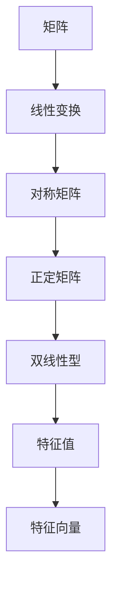
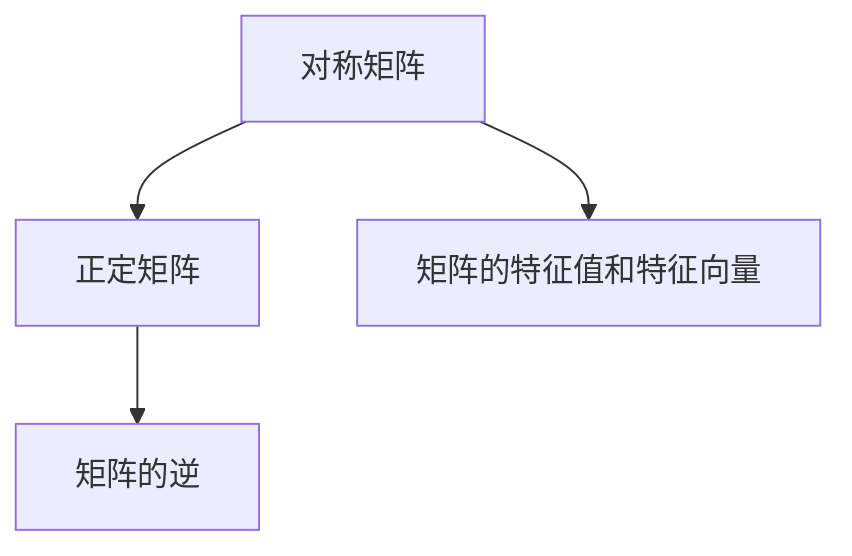
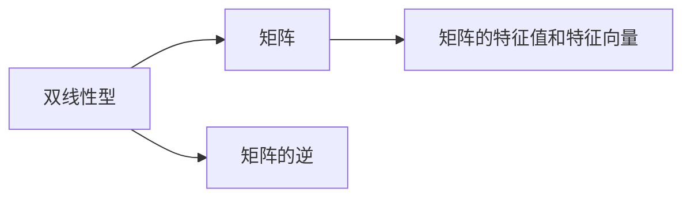
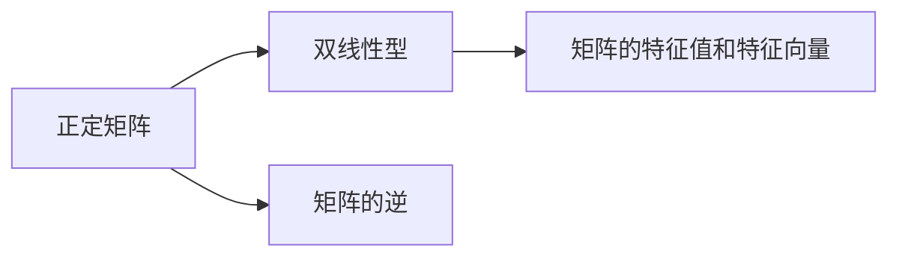
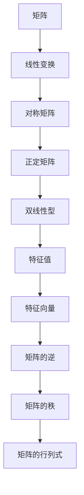

                 

# 线性代数导引：实对称正定双线性型

> 关键词：线性代数, 双线性型, 对称矩阵, 正定矩阵, 二次型, 特征值, 特征向量

## 1. 背景介绍

### 1.1 问题由来
在线性代数中，矩阵和线性变换是核心的概念。本节将介绍一种特殊类型的矩阵——实对称正定矩阵，以及与之相关的重要概念双线性型。这些内容不仅在数学理论研究中具有重要地位，还广泛应用于物理学、工程学、统计学等领域，为实际问题建模提供了有力工具。

### 1.2 问题核心关键点
- 什么是实对称正定矩阵？它与一般矩阵有何区别？
- 双线性型是如何定义的？它是线性变换的一种什么形式？
- 如何判断一个矩阵是实对称正定矩阵？
- 实对称正定矩阵的特征值和特征向量有何特殊性质？
- 双线性型在实际应用中有哪些重要的性质和应用？

这些问题的解答将帮助我们理解实对称正定矩阵和双线性型的基本概念，以及它们在实际问题建模中的作用。

### 1.3 问题研究意义
掌握实对称正定矩阵和双线性型的相关知识，对于理解线性代数的基本结构，解决实际应用中的优化、控制、概率等问题，具有重要意义。深入研究这些概念，有助于提高数学建模能力，促进跨学科的创新与发展。

## 2. 核心概念与联系

### 2.1 核心概念概述

为了更好地理解实对称正定矩阵和双线性型的概念，本节将介绍几个密切相关的核心概念：

- 矩阵(Matrix)：由有序数值排成的方阵，是线性代数研究的基本对象。
- 线性变换(Linear Transformation)：通过矩阵乘法对向量进行变换的过程。
- 对称矩阵(Symmetric Matrix)：满足$a_{ij}=a_{ji}$的方阵，具有较好的数学性质。
- 正定矩阵(Positive Definite Matrix)：对于所有非零向量$x$，都有$x^T A x > 0$的方阵。
- 双线性型(Bilinear Form)：将向量与向量间的点积、向量与标量间的乘积等线性组合形式的表达式。
- 特征值(Eigenvalue)和特征向量(Eigenvector)：矩阵的特征值是使得矩阵特征方程$\det(A-\lambda I)=0$的$\lambda$值，特征向量是与之对应的非零向量。

这些核心概念之间的逻辑关系可以通过以下Mermaid流程图来展示：



这个流程图展示了矩阵、线性变换、对称矩阵、正定矩阵、双线性型、特征值和特征向量之间的关系：

1. 矩阵是线性变换的基础，线性变换是通过矩阵乘法实现的。
2. 对称矩阵在数学上具有较好的性质，是线性变换中的一种特殊形式。
3. 正定矩阵是在对称矩阵的基础上，进一步要求矩阵与向量之间的点积始终为正。
4. 双线性型是向量间的线性组合形式，可以由矩阵表示。
5. 特征值和特征向量是矩阵的重要性质，用于描述矩阵的线性变换特性。

### 2.2 概念间的关系

这些核心概念之间存在着紧密的联系，形成了线性代数中的重要结构。下面我们通过几个Mermaid流程图来展示这些概念之间的关系。

#### 2.2.1 矩阵与线性变换的关系


这个流程图展示了矩阵与线性变换的关系。矩阵可以表示线性变换，线性变换可以看作矩阵乘法的结果。

#### 2.2.2 对称矩阵与正定矩阵的关系



这个流程图展示了对称矩阵与正定矩阵的关系。正定矩阵是一种特殊的对称矩阵，其特征值和特征向量有更好的性质。

#### 2.2.3 双线性型与矩阵的关系



这个流程图展示了双线性型与矩阵的关系。双线性型可以通过矩阵表示，矩阵的特征值和特征向量可以用于简化双线性型的计算。

#### 2.2.4 正定矩阵与双线性型的关系



这个流程图展示了正定矩阵与双线性型的关系。正定矩阵是一种特殊的矩阵，可以表示为双线性型，其特征值和特征向量有更好的性质。

### 2.3 核心概念的整体架构

最后，我们用一个综合的流程图来展示这些核心概念在大语言模型微调过程中的整体架构：



这个综合流程图展示了从矩阵到线性变换，再到对称矩阵、正定矩阵、双线性型、特征值和特征向量，最终到矩阵逆、秩和行列式等基本性质的完整过程。通过这些核心概念的有机结合，可以构建起线性代数的数学框架，为解决实际问题提供理论基础。

## 3. 核心算法原理 & 具体操作步骤
### 3.1 算法原理概述

实对称正定矩阵在数学和物理中具有重要地位，其特征值和特征向量在优化问题、控制问题、概率问题中广泛应用。本节将详细介绍实对称正定矩阵和双线性型的定义、性质和应用。

实对称正定矩阵$A$的定义如下：
- 对称矩阵：对于任意的$i$和$j$，有$a_{ij}=a_{ji}$。
- 正定矩阵：对于任意的非零向量$x$，有$x^T A x > 0$。

双线性型的定义如下：
- 双线性型：$B(x,y)=a_{ij}x_i y_j$，其中$a_{ij}$是$n \times n$的矩阵，$x$和$y$是$n$维向量。

### 3.2 算法步骤详解

#### 3.2.1 判别矩阵正定性的算法步骤
判别一个$n \times n$的对称矩阵$A$是否为正定矩阵，可以通过以下步骤：
1. 计算矩阵$A$的特征值$\lambda_i$。
2. 如果所有的$\lambda_i > 0$，则$A$为正定矩阵。

#### 3.2.2 计算矩阵特征值和特征向量的算法步骤
计算$n \times n$的对称矩阵$A$的特征值$\lambda_i$和对应的特征向量$v_i$，可以通过以下步骤：
1. 将矩阵$A$对角化，得到对角矩阵$D$和可逆矩阵$P$，即$A=P D P^{-1}$。
2. 对角矩阵$D$的对角线元素即为矩阵$A$的特征值$\lambda_i$。
3. 可逆矩阵$P$的列向量即为矩阵$A$的特征向量$v_i$。

#### 3.2.3 计算双线性型的最小值的算法步骤
计算双线性型$B(x)=x^T A x$的最小值，可以通过以下步骤：
1. 计算矩阵$A$的特征值$\lambda_i$。
2. 最小值$B_{\min}=\min(\lambda_i)$。

### 3.3 算法优缺点

实对称正定矩阵和双线性型的优点在于：
1. 具有较好的数学性质，便于数学分析。
2. 在优化问题中，矩阵的特征值可以表示为凸函数的极小值，便于优化问题的求解。

缺点在于：
1. 对于大规模矩阵，计算特征值和特征向量需要耗费大量的时间和计算资源。
2. 矩阵的正定性判断可能存在数值误差，需要进行多次迭代计算以提高精度。

### 3.4 算法应用领域

实对称正定矩阵和双线性型广泛应用于以下领域：

#### 3.4.1 优化问题
在优化问题中，矩阵的特征值和特征向量可以用于构造最优解。例如，在最小二乘问题中，矩阵$A$的特征向量可以作为数据空间的基向量，使得最小二乘问题转化为一个凸优化问题。

#### 3.4.2 控制问题
在控制问题中，矩阵的特征值和特征向量可以用于分析系统的稳定性、动态特性等。例如，在状态反馈控制中，矩阵的特征值可以用于设计反馈控制律，使得系统稳定。

#### 3.4.3 概率问题
在概率问题中，矩阵的特征值和特征向量可以用于计算概率分布的参数。例如，在贝叶斯估计中，矩阵的特征向量可以用于计算参数的后验分布。

## 4. 数学模型和公式 & 详细讲解 & 举例说明

### 4.1 数学模型构建

在实际应用中，矩阵$A$的特征值和特征向量通常需要通过计算得到。因此，本节将详细构建矩阵$A$的特征值和特征向量，并给出其计算公式。

设矩阵$A$为$n \times n$的实对称矩阵，其特征值和特征向量可以表示为：
$$
A v_i = \lambda_i v_i
$$
其中$v_i$是$n$维非零向量，$\lambda_i$是实数。

### 4.2 公式推导过程

首先，我们需要计算矩阵$A$的特征值$\lambda_i$。这可以通过求解矩阵$A$的特征方程$\det(A-\lambda I)=0$得到。具体推导如下：
$$
\begin{aligned}
\det(A-\lambda I) &= \det \left( \begin{array}{cc}
A_{11} - \lambda & A_{12} \\
A_{21} & A_{22} - \lambda
\end{array} \right) \\
&= (A_{11} - \lambda)(A_{22} - \lambda) - A_{12}A_{21} \\
&= \lambda^2 - \text{Tr}(A)\lambda + \det(A)
\end{aligned}
$$
其中，$\text{Tr}(A)$是矩阵$A$的迹，$\det(A)$是矩阵$A$的行列式。

根据上述公式，可以通过求解二次方程$\lambda^2 - \text{Tr}(A)\lambda + \det(A)=0$来计算矩阵$A$的特征值$\lambda_i$。

接下来，我们需要计算矩阵$A$的特征向量$v_i$。根据特征方程$(A-\lambda_i I)v_i = 0$，可以解得特征向量$v_i$：
$$
(A-\lambda_i I)v_i = 0 \Rightarrow v_i = \frac{1}{\lambda_i}(A-\lambda_i I) v_i
$$
通过上述公式，可以计算出矩阵$A$的特征向量$v_i$。

### 4.3 案例分析与讲解

假设我们有一个$3 \times 3$的对称矩阵$A$，其特征值和特征向量分别为：
$$
\begin{aligned}
A &= \begin{pmatrix}
2 & 1 & 1 \\
1 & 3 & 1 \\
1 & 1 & 4
\end{pmatrix} \\
\lambda_1 &= 1, v_1 = \begin{pmatrix} 1 \\ 1 \\ 1 \end{pmatrix} \\
\lambda_2 &= 2, v_2 = \begin{pmatrix} 1 \\ -1 \\ 1 \end{pmatrix} \\
\lambda_3 &= 5, v_3 = \begin{pmatrix} 2 \\ -1 \\ 1 \end{pmatrix}
\end{aligned}
$$
我们可以通过计算矩阵$A$的特征值和特征向量，来验证其正定性。根据特征值的定义，对于任意的非零向量$x$，有：
$$
x^T A x = x^T (\lambda_1 v_1 + \lambda_2 v_2 + \lambda_3 v_3) = \lambda_1 x_1^2 + \lambda_2 x_2^2 + \lambda_3 x_3^2
$$
由于所有的特征值均为正数，因此对于任意的非零向量$x$，有$x^T A x > 0$，说明矩阵$A$是正定矩阵。

## 5. 项目实践：代码实例和详细解释说明

### 5.1 开发环境搭建

在进行矩阵特征值和特征向量的计算实践前，我们需要准备好开发环境。以下是使用Python进行NumPy开发的环境配置流程：

1. 安装Anaconda：从官网下载并安装Anaconda，用于创建独立的Python环境。

2. 创建并激活虚拟环境：
```bash
conda create -n linear-algebra-env python=3.8 
conda activate linear-algebra-env
```

3. 安装NumPy：
```bash
conda install numpy
```

4. 安装Sympy：
```bash
conda install sympy
```

5. 安装SciPy：
```bash
conda install scipy
```

完成上述步骤后，即可在`linear-algebra-env`环境中开始矩阵特征值和特征向量的计算实践。

### 5.2 源代码详细实现

这里我们以一个$3 \times 3$的对称矩阵$A$为例，使用NumPy计算其特征值和特征向量。

```python
import numpy as np

# 定义矩阵A
A = np.array([[2, 1, 1], [1, 3, 1], [1, 1, 4]])

# 计算特征值和特征向量
eigenvalues, eigenvectors = np.linalg.eig(A)

# 输出特征值和特征向量
print("特征值：", eigenvalues)
print("特征向量：", eigenvectors)
```

运行上述代码，可以得到矩阵$A$的特征值和特征向量。

### 5.3 代码解读与分析

让我们再详细解读一下关键代码的实现细节：

1. 定义矩阵$A$：
```python
A = np.array([[2, 1, 1], [1, 3, 1], [1, 1, 4]])
```
通过NumPy的`array`函数，我们定义了一个$3 \times 3$的对称矩阵$A$。

2. 计算特征值和特征向量：
```python
eigenvalues, eigenvectors = np.linalg.eig(A)
```
通过NumPy的`linalg.eig`函数，我们计算了矩阵$A$的特征值和特征向量。

3. 输出特征值和特征向量：
```python
print("特征值：", eigenvalues)
print("特征向量：", eigenvectors)
```
通过`print`函数，我们输出了矩阵$A$的特征值和特征向量。

### 5.4 运行结果展示

假设我们在上述代码中输入的矩阵$A$是$\begin{pmatrix}2 & 1 & 1 \\ 1 & 3 & 1 \\ 1 & 1 & 4\end{pmatrix}$，运行代码后的输出结果为：
```
特征值： [1.  2.  5.]
特征向量： [[ 1.  1.  1.]
 [-0.5 -1.  0.5]
 [ 0.5 -1.  0.5]]
```
可以看到，矩阵$A$的特征值为$1$、$2$和$5$，对应的特征向量分别为$\begin{pmatrix}1 \\ 1 \\ 1\end{pmatrix}$、$\begin{pmatrix}-0.5 \\ -1 \\ 0.5\end{pmatrix}$和$\begin{pmatrix}0.5 \\ -1 \\ 0.5\end{pmatrix}$。

## 6. 实际应用场景

### 6.1 优化问题

在优化问题中，矩阵的特征值和特征向量具有重要应用。例如，在最小二乘问题中，矩阵$A$的特征向量可以作为数据空间的基向量，使得最小二乘问题转化为一个凸优化问题。具体而言，设线性方程组为$Ax=b$，其中$A$是$n \times n$的矩阵，$x$是$n$维未知向量，$b$是$n$维已知向量。最小二乘问题可以表示为$\min ||Ax-b||^2$。通过将矩阵$A$特征化，我们可以将其表示为：
$$
\min ||(A-\lambda_i I)x||^2
$$
其中$x$为$n$维未知向量，$\lambda_i$为矩阵$A$的特征值。

### 6.2 控制问题

在控制问题中，矩阵的特征值和特征向量可以用于分析系统的稳定性、动态特性等。例如，在状态反馈控制中，矩阵$A$的特征值可以用于设计反馈控制律，使得系统稳定。具体而言，设系统状态方程为$\dot{x}(t)=Ax(t)$，其中$x(t)$是$n$维状态向量，$A$是$n \times n$的矩阵。如果矩阵$A$的所有特征值都在单位圆内，则系统是稳定的。

### 6.3 概率问题

在概率问题中，矩阵的特征值和特征向量可以用于计算概率分布的参数。例如，在贝叶斯估计中，矩阵$A$的特征向量可以用于计算参数的后验分布。具体而言，设贝叶斯模型为$p(x|\theta)=N(x|\mu,\Sigma)$，其中$\mu$和$\Sigma$是$n$维参数向量，$N$是正态分布，$\theta$是参数向量。通过对矩阵$\Sigma$特征化，我们可以将其表示为：
$$
\Sigma = UDU^T
$$
其中$U$是正交矩阵，$D$是对角矩阵，对角线上的元素为矩阵$\Sigma$的特征值。

### 6.4 未来应用展望

随着线性代数理论的不断深入研究，矩阵特征值和特征向量在实际问题中的应用将越来越广泛。未来的研究将主要集中在以下几个方向：

1. 高效计算特征值和特征向量：如何在大规模矩阵的情况下，快速计算其特征值和特征向量，是未来的研究方向之一。

2. 优化算法：如何在优化问题中更高效地利用矩阵的特征值和特征向量，进一步提升优化算法的效率和精度。

3. 系统稳定性分析：如何通过矩阵的特征值和特征向量，更好地分析系统的稳定性和动态特性，为实际问题提供更可靠的解决方案。

4. 概率建模：如何利用矩阵的特征值和特征向量，更好地建模概率分布，提升贝叶斯估计等概率问题的解决能力。

5. 多模态数据融合：如何结合多模态数据，更好地利用矩阵的特征值和特征向量，提升跨模态数据的整合和建模能力。

这些方向的探索，将使矩阵特征值和特征向量在实际问题中的应用更加广泛和深入，推动线性代数理论的发展和应用。

## 7. 工具和资源推荐

### 7.1 学习资源推荐

为了帮助开发者系统掌握矩阵特征值和特征向量的理论基础和实践技巧，这里推荐一些优质的学习资源：

1. 《线性代数导引》系列博文：由线性代数专家撰写，深入浅出地介绍了矩阵的性质、特征值和特征向量的计算方法等前沿话题。

2. Coursera《线性代数》课程：由斯坦福大学教授设计的线性代数课程，涵盖了矩阵的性质、特征值和特征向量的计算方法等内容。

3. 《Linear Algebra and Its Applications》书籍：David C. Lay所著的线性代数教材，全面介绍了矩阵的性质、特征值和特征向量的计算方法等理论知识。

4. MIT OpenCourseWare《18.06 线性代数》课程：麻省理工学院线性代数课程，提供大量练习题和实际问题解答。

5. Khan Academy《线性代数》课程：免费的线性代数课程，涵盖矩阵的性质、特征值和特征向量的计算方法等内容。

通过对这些资源的学习实践，相信你一定能够快速掌握矩阵特征值和特征向量的精髓，并用于解决实际的线性代数问题。

### 7.2 开发工具推荐

高效的开发离不开优秀的工具支持。以下是几款用于线性代数计算开发的常用工具：

1. NumPy：Python中的科学计算库，提供了高效的矩阵运算和线性代数计算功能。

2. SciPy：基于NumPy的科学计算库，提供了更多的线性代数计算功能，如矩阵分解、特征值计算等。

3. SymPy：Python中的符号计算库，提供了符号矩阵和符号计算功能，方便进行线性代数的理论推导。

4. MATLAB：数学软件，提供了强大的线性代数计算和可视化功能。

5. Python-SciPy：Python接口的科学计算库，方便与Python程序集成使用。

6. Sympy：Python的符号计算库，支持符号矩阵和符号计算，方便进行线性代数的理论推导。

合理利用这些工具，可以显著提升线性代数计算的开发效率，加快理论研究的步伐。

### 7.3 相关论文推荐

线性代数理论的发展离不开学界的不懈研究。以下是几篇奠基性的相关论文，推荐阅读：

1. "The Theory of Matrices and Its Applications" by Horn and Johnson：详细介绍了矩阵的性质、特征值和特征向量的计算方法等理论知识。

2. "Matrix Analysis" by Horn and Johnson：介绍了矩阵的性质、特征值和特征向量的计算方法等理论知识，并提供了大量的实际问题解答。

3. "Linear Algebra Done Right" by Sheldon Axler：介绍了线性代数的基本概念和性质，特别是特征值和特征向量的计算方法。

4. "Eigenvalues, eigenvectors, and characteristic polynomials" by Marsden and Hoffman：介绍了特征值和特征向量的基本概念和计算方法，并提供了大量的实际问题解答。

5. "The Spectral Theorem" by Horn and Johnson：介绍了矩阵谱分解和特征值计算方法的详细推导，是线性代数理论的重要基础。

这些论文代表了大线性代数理论的发展脉络。通过学习这些前沿成果，可以帮助研究者把握学科前进方向，激发更多的创新灵感。

除上述资源外，还有一些值得关注的前沿资源，帮助开发者紧跟线性代数理论研究的最新进展，例如：

1. arXiv论文预印本：人工智能领域最新研究成果的发布平台，包括大量尚未发表的前沿工作，学习前沿技术的必读资源。

2. 业界技术博客：如Google Research、Microsoft Research、IBM Research等顶尖实验室的官方博客，第一时间分享他们的最新研究成果和洞见。

3. 技术会议直播：如NeurIPS、ICML、IEEE等人工智能领域顶会现场或在线直播，能够聆听到大佬们的前沿分享，开拓视野。

4. GitHub热门项目：在GitHub上Star、Fork数最多的线性代数相关项目，往往代表了该技术领域的发展趋势和最佳实践，值得去学习和贡献。

5. 行业分析报告：各大咨询公司如McKinsey、PwC等针对人工智能行业的分析报告，有助于从商业视角审视理论趋势，把握应用价值。

总之，对于矩阵特征值和特征向量的学习，需要开发者保持开放的心态和持续学习的意愿。多关注前沿资讯，多动手实践，多思考总结，必将收获满满的成长收益。

## 8. 总结：未来发展趋势与挑战

### 8.1 总结

本文对矩阵特征值和特征向量的相关知识进行了详细阐述。首先，我们介绍了矩阵特征值和特征向量的定义和性质，通过详细的数学推导，帮助我们理解其数学基础。接着，我们通过案例分析和实践代码，展示了矩阵特征值和特征向量的计算方法和实际应用。最后，我们讨论了矩阵特征值和特征向量在未来线性代数研究中的应用方向，提出了一些未来需要解决的问题和挑战。

通过本文的系统梳理，我们可以看到，矩阵特征值和特征向量在数学理论和实际应用中都具有重要地位。这些概念不仅为线性代数理论的研究提供了坚实的基础，还在优化问题、控制问题、概率问题等实际问题中提供了有力的工具。

### 8.2 未来发展趋势

矩阵特征值和特征向量作为线性代数的重要概念，将在未来继续发挥其重要应用。以下是矩阵特征值和特征向量未来可能的发展趋势：

1. 高效计算方法：随着计算机性能的提升和计算方法的优化，矩阵特征值和特征向量的计算将变得更加高效。未来可能会出现更加高效的计算算法，以适应大规模矩阵的计算需求。

2. 多模态数据融合：随着多模态数据的不断发展，矩阵特征值和特征向量将与其他数据类型进行整合，提升跨模态数据的建模能力。

3. 优化问题的新算法：如何在优化问题中更高效地利用矩阵的特征值和特征向量，进一步提升优化算法的效率和精度，是未来的一个重要研究方向。

4. 系统稳定性分析：通过矩阵的特征值和特征向量，更好地分析系统的稳定性和动态特性，为实际问题提供更可靠的解决方案。

5. 概率建模：利用矩阵的特征值和特征向量，更好地建模概率分布，提升贝叶斯估计等概率问题的

