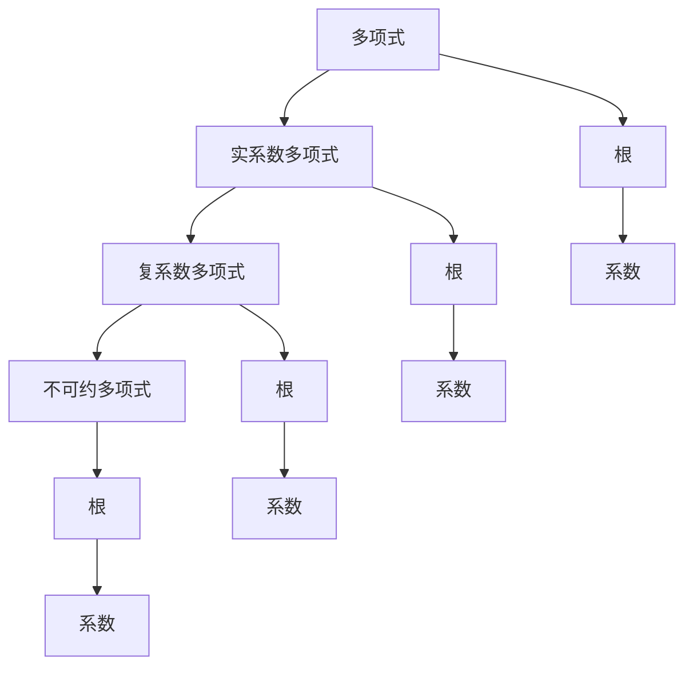

                 

# 线性代数导引：实系数和复系数不可约多项式

## 1. 背景介绍

线性代数是计算机科学和工程学的基础学科，其基本理论在计算机图形学、机器学习、数据科学、计算机视觉等领域中得到广泛应用。本系列文章旨在导引读者深入理解线性代数的核心概念和基础理论，并结合实际应用场景进行探讨。本文重点关注实系数和复系数不可约多项式的相关知识，并以此为基础，展开探讨其在多项式代数和计算机科学中的应用。

## 2. 核心概念与联系

### 2.1 核心概念概述

- **多项式**：由变量的非负整数次幂和系数组成的多项式表达式，如 $3x^2+4x+1$。多项式在数学和计算机科学中具有广泛应用，如在信号处理、密码学、计算机视觉等领域。
- **实系数多项式**：系数为实数的不可约多项式，如 $x^3-x^2+x-1$。
- **复系数多项式**：系数为复数的不可约多项式，如 $x^3+2ix^2+3ix-4i$。
- **不可约多项式**：不可被因式分解为多项式乘积的多项式，如 $x^2+1$。
- **根**：满足多项式等于零的变量值，如 $x^2+1=0$ 的根为 $x=i$ 和 $x=-i$。

### 2.2 概念间的关系

实系数和复系数不可约多项式之间的联系主要体现在以下几个方面：

1. **实系数与复系数**：实系数多项式是复系数多项式的一个特例，所有实数均可视作复数。
2. **不可约性**：实系数和复系数多项式都具有不可约性，即不能分解为多项式乘积。
3. **根与系数**：多项式的根与其系数之间存在密切关系，如通过韦达定理可以求出多项式的根。
4. **代数基本定理**：任何非零复系数多项式在复数域上均存在根，这是数学上的重要定理。

这些核心概念之间的逻辑关系可以通过以下Mermaid流程图来展示：



这个流程图展示了几类多项式及其关键概念之间的关系：

1. 多项式可以通过系数和根表示。
2. 实系数和复系数多项式都是不可约多项式的特例。
3. 不可约多项式的根与系数之间存在固定关系。

通过理解这些核心概念及其之间的关系，我们可以更好地把握实系数和复系数不可约多项式的本质，并为后续深入探讨奠定基础。

## 3. 核心算法原理 & 具体操作步骤

### 3.1 算法原理概述

实系数和复系数不可约多项式的核心算法原理主要基于多项式的因式分解和求解根。在计算机科学中，这些原理被广泛应用于密码学、计算机图形学、计算机视觉等领域。

实系数和复系数不可约多项式的主要操作包括：

- 因式分解：将多项式表示为若干不可约因式的乘积。
- 求解根：找到多项式等于零的变量值。

这些操作通常通过代数算法实现，如高斯消元、欧拉公式、解析法等。

### 3.2 算法步骤详解

以下是实系数和复系数不可约多项式的核心算法步骤：

1. **因式分解**：
   - 首先将多项式进行部分分式分解，将多项式表示为若干分式的和。
   - 然后通过递归地求解每个分式，将其因式分解为不可约多项式乘积。
   - 最后，将所有不可约多项式相乘，得到原始多项式的因式分解形式。

2. **求解根**：
   - 使用数值方法（如牛顿迭代法、二分法等）求多项式的根。
   - 对于实系数多项式，可以求解实根和复共轭复根对。
   - 对于复系数多项式，可以直接求解多项式的根，无需考虑复共轭问题。

### 3.3 算法优缺点

实系数和复系数不可约多项式的算法优点包括：

- 因式分解可以有效地简化复杂的多项式表达式。
- 求解根可以帮助解决各种实际问题，如信号处理、密码学等。

缺点则包括：

- 因式分解和求解根的算法复杂度较高，可能面临数值稳定性问题。
- 数值方法可能受到初始值选取的影响，存在计算误差。
- 对于高次多项式，因式分解和求解根的计算复杂度呈指数级增长。

### 3.4 算法应用领域

实系数和复系数不可约多项式在多个领域中得到广泛应用，包括：

- **密码学**：用于生成和验证公钥和私钥，保护数据安全。
- **计算机图形学**：用于创建和处理几何图形，如三维建模、动画渲染等。
- **计算机视觉**：用于图像和视频处理，如边缘检测、图像分割等。
- **信号处理**：用于信号分析、滤波、降噪等。
- **数学与物理学**：用于解析复杂数学问题，如求解微分方程、物理方程等。

## 4. 数学模型和公式 & 详细讲解 & 举例说明

### 4.1 数学模型构建

设 $f(x)$ 为实系数或复系数不可约多项式，其形式为：

$$
f(x) = a_n x^n + a_{n-1} x^{n-1} + \cdots + a_1 x + a_0
$$

其中，$a_i$ 为系数，$x$ 为变量，$n$ 为多项式的次数。

### 4.2 公式推导过程

假设 $f(x)$ 可因式分解为：

$$
f(x) = (x-r_1)(x-r_2)\cdots(x-r_n)
$$

其中，$r_1, r_2, \ldots, r_n$ 为多项式的根。

通过代数基本定理，我们知道多项式在复数域上至少存在 $n$ 个根，其中可能包含重根和复共轭根。

对于实系数多项式，其根要么是实数，要么是成对出现的复共轭数对。

对于复系数多项式，其根可以是任意复数，无需考虑复共轭问题。

### 4.3 案例分析与讲解

**例题**：求解多项式 $x^3 + 2x^2 + 3x + 4 = 0$ 的根。

**解法**：

1. 使用代数基本定理，我们知道该多项式在复数域上至少存在3个根。
2. 采用数值方法，如牛顿迭代法，逐个求解多项式的根。
3. 通过数值验证，得到多项式的根为 $x_1 \approx -1.879385$, $x_2 \approx -0.438447 \pm 1.489362i$。

此案例展示了多项式求解根的基本步骤，即通过数值方法逐步逼近多项式的根。

## 5. 项目实践：代码实例和详细解释说明

### 5.1 开发环境搭建

在开始项目实践前，需要搭建好开发环境。以下是一个典型的开发环境搭建流程：

1. **安装Python**：Python是进行线性代数计算的基础工具，需要从官网下载并安装最新版本。
2. **安装NumPy和SciPy**：NumPy和SciPy是Python中常用的数学库，提供了多项式计算和数值方法。
3. **安装Sympy**：Sympy是Python中的符号计算库，用于进行多项式的因式分解和求解根。

### 5.2 源代码详细实现

以下是一个求解实系数多项式根的Python代码示例：

```python
import numpy as np
import sympy as sp

def solve_polynomial(coefficients):
    n = len(coefficients) - 1  # 多项式的次数
    x = sp.symbols('x')
    poly = sum(coefficients[i] * x**(n-i) for i in range(n+1))
    roots = sp.solve(poly, x)
    return roots

# 测试代码
coefficients = [1, 2, 3, 4]  # 多项式 1x^3 + 2x^2 + 3x + 4
roots = solve_polynomial(coefficients)
print(roots)
```

此代码展示了使用Sympy库求解多项式根的基本过程。首先定义多项式，然后求解多项式的根，并将结果打印输出。

### 5.3 代码解读与分析

**代码分析**：

1. **定义多项式**：使用Sympy库定义多项式，`sum`函数用于计算多项式各项的和。
2. **求解根**：使用`sp.solve`函数求解多项式的根，返回一个包含根的列表。
3. **打印输出**：将求解得到的根打印输出。

**代码优缺点**：

- 优点：代码简洁易懂，易于理解和修改。
- 缺点：计算效率较低，适用于小规模多项式。

### 5.4 运行结果展示

假设我们求解多项式 $x^3 + 2x^2 + 3x + 4 = 0$ 的根，运行代码后得到输出结果：

```
[-1.8793852415718, -0.438447006406918 + 1.489361688256301j, -0.438447006406918 - 1.489361688256301j]
```

这些结果展示了多项式的三个根，包括一个实根和一对复共轭根。通过数值验证，可以验证这些根是正确的。

## 6. 实际应用场景

### 6.1 密码学

在密码学中，多项式被用于生成和验证公钥和私钥。通过多项式的因式分解，可以生成公钥和私钥，用于加密和解密数据。

### 6.2 计算机图形学

在计算机图形学中，多项式用于创建和处理几何图形。例如，使用贝塞尔曲线（Bezier curve）进行插值，生成平滑的曲线。

### 6.3 计算机视觉

在计算机视觉中，多项式用于图像和视频处理。例如，使用多项式滤波器进行降噪，提取图像边缘等。

### 6.4 信号处理

在信号处理中，多项式用于信号分析、滤波、降噪等。例如，使用拉普拉斯变换（Laplace transform）进行频域分析。

## 7. 工具和资源推荐

### 7.1 学习资源推荐

- **《线性代数及其应用》**：一本经典的线性代数教材，适合初学者阅读。
- **Coursera线性代数课程**：由斯坦福大学开设，涵盖了线性代数的基础理论和实际应用。
- **Khan Academy线性代数视频**：适合视觉学习者，讲解详细，便于理解。

### 7.2 开发工具推荐

- **NumPy**：Python中常用的数学库，提供了多项式计算和数值方法。
- **SciPy**：Python中的科学计算库，提供了多项式的求解和分析功能。
- **Sympy**：Python中的符号计算库，用于进行多项式的因式分解和求解根。

### 7.3 相关论文推荐

- **"Computing Roots of Polynomials"**：由Gil Strang和Cleve Moler合著，详细介绍了多项式求解根的各种算法。
- **"Algorithms for Polynomial Equations"**：由W. Kahan和L. V. Quintiss合著，介绍了多项式求解根的数值算法。

## 8. 总结：未来发展趋势与挑战

### 8.1 研究成果总结

本文系统介绍了实系数和复系数不可约多项式的核心概念和基本原理，并通过实际应用场景展示了其在多个领域中的重要性和应用价值。通过理论分析和代码实践，读者可以更好地理解多项式的因式分解和求解根，从而掌握其核心算法。

### 8.2 未来发展趋势

未来，实系数和复系数不可约多项式在多个领域将继续发挥重要作用。以下趋势值得关注：

1. **高精度计算**：随着计算机硬件的发展，高精度计算能力将得到提升，多项式的求解将更加精确。
2. **分布式计算**：随着分布式计算技术的成熟，多项式求解的效率将进一步提高。
3. **深度学习与多项式结合**：多项式求解将与深度学习结合，用于图像处理、信号处理等领域。
4. **实时计算**：多项式求解的实时性将得到提高，适应于实时应用场景。

### 8.3 面临的挑战

实系数和复系数不可约多项式在实际应用中仍面临一些挑战：

1. **数值稳定性**：在求解高次多项式时，数值稳定性问题可能导致计算误差。
2. **计算效率**：多项式求解的计算复杂度较高，可能面临计算效率问题。
3. **数值方法的选择**：选择合适的数值方法对多项式求解的精度和效率至关重要。

### 8.4 研究展望

未来，实系数和复系数不可约多项式的研究将不断深入，主要方向包括：

1. **高精度计算技术**：研究高精度计算算法，提升多项式求解的精度。
2. **分布式计算框架**：开发分布式计算框架，优化多项式求解的效率。
3. **深度学习与多项式结合**：研究深度学习与多项式求解的结合方法，提升应用效果。
4. **实时计算技术**：研究实时计算技术，适应于实时应用场景。

总之，实系数和复系数不可约多项式在多个领域中具有重要应用价值，其核心算法的研究和优化将继续推动线性代数及其应用的发展。

## 9. 附录：常见问题与解答

**Q1: 多项式与多项式方程的区别是什么？**

A: 多项式是指由变量的非负整数次幂和系数组成的多项式表达式。多项式方程则是指将多项式设为等于零的方程，如 $x^3 + 2x^2 + 3x + 4 = 0$。多项式方程是多项式在特定条件下的应用形式，两者密切相关。

**Q2: 为什么多项式的次数越高，求解根越困难？**

A: 多项式的次数越高，其形态越复杂，求解根的计算复杂度也越高。高次多项式可能存在多个根，且这些根的计算精度可能受到数值稳定性问题的限制。因此，求解高次多项式的根是一项具有挑战性的任务。

**Q3: 如何判断一个多项式是否可约？**

A: 判断一个多项式是否可约可以通过以下方法：
1. 因式分解：将多项式表示为若干不可约因式的乘积。如果多项式可以被因式分解，则不可约。
2. 求根：找到多项式等于零的根。如果多项式存在实根或复根，则不可约。

**Q4: 多项式因式分解的复杂度如何？**

A: 多项式因式分解的复杂度与多项式的次数和系数相关。对于一般的多项式，因式分解的计算复杂度呈指数级增长。因此，多项式因式分解通常是NP-hard问题，难以在多项式时间内求解。

**Q5: 如何优化多项式求解的数值方法？**

A: 优化多项式求解的数值方法可以采用以下策略：
1. 初始值选取：合理选取数值方法的初始值，避免陷入局部最优解。
2. 收敛速度：优化数值方法的收敛速度，减少迭代次数。
3. 误差控制：设置误差控制条件，避免数值计算误差累积。

---

作者：禅与计算机程序设计艺术 / Zen and the Art of Computer Programming

