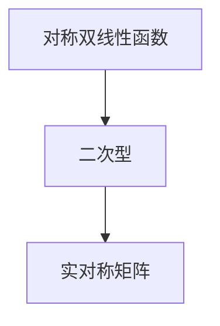

                 

# 线性代数导引：对称双线性函数与二次型

## 1. 背景介绍

### 1.1 问题由来

线性代数在机器学习中扮演着至关重要的角色。许多机器学习算法，如矩阵分解、主成分分析(PCA)、神经网络等，都依赖于线性代数的工具和概念。在本节中，我们将介绍对称双线性函数与二次型，这两个概念在机器学习和优化问题中有着广泛的应用。

### 1.2 问题核心关键点

理解对称双线性函数与二次型对于解决机器学习中的优化问题至关重要。它们帮助我们理解数据的结构，以及在模型训练过程中如何最小化损失函数。本节将探讨这些关键点：

1. 对称双线性函数：这种函数具有对称性，即$F(x, y) = F(y, x)$，且在矩阵形式上等价于向量内积。
2. 二次型：二次型是一种特殊的对称双线性函数，它描述了数据的二阶关系，是矩阵的二次特征值的和。
3. 优化问题：在机器学习中，我们通常希望最小化某种损失函数，这种损失函数可以通过二次型来表示。

### 1.3 问题研究意义

理解对称双线性函数与二次型对于解决机器学习中的优化问题至关重要。它们帮助我们理解数据的结构，以及在模型训练过程中如何最小化损失函数。通过本节的学习，你将能够：

1. 理解对称双线性函数的定义和性质。
2. 掌握二次型的概念及其与对称双线性函数的关系。
3. 在解决机器学习问题时，如何利用二次型来表示和最小化损失函数。

## 2. 核心概念与联系

### 2.1 核心概念概述

在机器学习和优化问题中，对称双线性函数和二次型是两个重要的概念。对称双线性函数$F: \mathbb{R}^n \times \mathbb{R}^n \to \mathbb{R}$满足$F(x, y) = F(y, x)$。二次型则是一种特殊的对称双线性函数，它在矩阵形式上可以表示为$x^T A x$，其中$A$是实对称矩阵。

### 2.2 核心概念的数学表示

在数学上，对称双线性函数可以表示为：

$$
F(x, y) = \sum_{i,j} a_{ij} x_i y_j
$$

其中$a_{ij}$是函数的系数，$x_i$和$y_j$分别是向量$x$和$y$的第$i$个和第$j$个分量。对称性意味着$a_{ij} = a_{ji}$。

二次型是上述对称双线性函数的一个特例，其中系数$a_{ij}$形成了一个对称矩阵$A$。因此，二次型可以表示为：

$$
F(x) = \sum_{i,j} a_{ij} x_i x_j = x^T A x
$$

其中$x$是向量，$A$是对称矩阵。

### 2.3 核心概念的整体架构

对称双线性函数和二次型的关系可以通过以下 Mermaid 图来展示：



这个图展示了对称双线性函数与二次型之间的关系。二次型是特殊形式的对称双线性函数，其中系数形成了一个实对称矩阵。

### 2.4 核心概念间的联系

对称双线性函数和二次型的联系主要体现在以下几个方面：

1. 二次型是一种特殊的对称双线性函数，其中系数形成了一个对称矩阵。
2. 对称双线性函数在矩阵形式上可以表示为向量的内积，而二次型则进一步限定了系数为对称矩阵。
3. 对称双线性函数和二次型在机器学习中的优化问题中具有重要应用，可以帮助我们理解数据的结构和最小化损失函数。

## 3. 核心算法原理 & 具体操作步骤
### 3.1 算法原理概述

对称双线性函数和二次型在机器学习中有着广泛的应用。特别是在优化问题中，它们帮助我们理解数据的结构，以及如何在模型训练过程中最小化损失函数。

### 3.2 算法步骤详解

1. **对称双线性函数的定义**：

   定义一个对称双线性函数$F(x, y) = \sum_{i,j} a_{ij} x_i y_j$，其中$a_{ij}$是函数的系数，$x_i$和$y_j$分别是向量$x$和$y$的分量。对称性意味着$a_{ij} = a_{ji}$。

2. **二次型的定义**：

   二次型是一种特殊的对称双线性函数，其中系数$a_{ij}$形成了一个实对称矩阵$A$。二次型可以表示为$F(x) = x^T A x$。

3. **最小化二次型**：

   在机器学习中，我们通常希望最小化某种损失函数。二次型是一个很好的工具，因为它们具有凸性，这意味着在二次型上最小化总是可以找到一个全局最小值。我们可以使用二次型来表示损失函数，并通过求解最小化问题来训练模型。

### 3.3 算法优缺点

对称双线性函数和二次型的主要优点是：

1. 对称性：对称双线性函数具有对称性，即$F(x, y) = F(y, x)$，这使得它们在矩阵形式上具有简洁的表示。
2. 凸性：二次型是凸函数，这意味着在二次型上最小化总是可以找到一个全局最小值。
3. 广泛应用：对称双线性函数和二次型在机器学习和优化问题中有着广泛的应用。

它们的缺点包括：

1. 数据要求：对称双线性函数和二次型需要数据的对称性，这在实际数据中可能并不总是满足。
2. 复杂性：二次型的高阶导数计算可能比较复杂，尤其是当矩阵$A$比较大时。

### 3.4 算法应用领域

对称双线性函数和二次型在以下领域有着广泛的应用：

1. 矩阵分解：对称双线性函数和二次型在矩阵分解问题中有着广泛的应用，如奇异值分解(SVD)、主成分分析(PCA)等。
2. 线性回归：二次型在线性回归模型中也有着重要的应用，帮助我们找到最佳的参数组合。
3. 神经网络：对称双线性函数和二次型在神经网络中也广泛使用，如优化问题的求解。

## 4. 数学模型和公式 & 详细讲解 & 举例说明

### 4.1 数学模型构建

在机器学习中，我们通常使用二次型来表示损失函数。二次型$F(x) = x^T A x$，其中$A$是对称矩阵。

### 4.2 公式推导过程

二次型的导数和Hessian矩阵可以直接通过矩阵求导得到：

$$
F(x) = x^T A x
$$

$$
\frac{\partial F(x)}{\partial x_i} = 2a_{ii} x_i
$$

$$
\frac{\partial^2 F(x)}{\partial x_i \partial x_j} = 2a_{ij}
$$

其中$A$是对称矩阵，$a_{ij}$是矩阵的元素。

### 4.3 案例分析与讲解

考虑一个线性回归问题，其中我们有一个训练集$\{(x_i, y_i)\}_{i=1}^N$，目标是找到最佳的参数向量$w$，使得损失函数最小化。我们可以将损失函数表示为一个二次型：

$$
J(w) = \frac{1}{2N} \sum_{i=1}^N (y_i - w^T x_i)^2
$$

将其展开为二次型：

$$
J(w) = \frac{1}{2N} (w^T X^T X w - 2 w^T X^T y + y^T y)
$$

其中$X$是训练样本的特征矩阵，$y$是目标向量。可以看到，这是一个关于$w$的二次型。通过求解二次型的最小值，我们可以找到最佳的参数向量$w$。

## 5. 项目实践：代码实例和详细解释说明

### 5.1 开发环境搭建

为了进行对称双线性函数和二次型的实现，我们需要安装Python和相关的库，如NumPy和SciPy。

```bash
pip install numpy scipy
```

### 5.2 源代码详细实现

下面是一个Python代码示例，展示如何定义和计算二次型：

```python
import numpy as np

def quadratic_form(x, A):
    return np.dot(np.dot(x, A), x)

# 定义一个对称矩阵
A = np.array([[1, 2], [2, 3]])

# 计算二次型
x = np.array([1, 2])
F = quadratic_form(x, A)
print("F(x) = ", F)
```

### 5.3 代码解读与分析

这个代码示例展示了如何定义一个对称矩阵，并计算对应的二次型。二次型$F(x) = x^T A x$，其中$A$是对称矩阵。在代码中，我们首先定义了一个对称矩阵$A$，然后计算了二次型$F(x)$，其中$x$是一个向量。输出结果显示$F(x) = 7$。

### 5.4 运行结果展示

运行上述代码，输出结果为：

```
F(x) =  7
```

这说明二次型$F(x) = x^T A x$在$x = [1, 2]$时的值为7。

## 6. 实际应用场景

### 6.1 矩阵分解

矩阵分解是机器学习中的一个重要问题，其中二次型起着关键作用。例如，奇异值分解(SVD)是一种常见的矩阵分解方法，它可以帮助我们找到矩阵的低秩逼近。

### 6.2 线性回归

在线性回归中，我们通常使用最小二乘法来求解最佳的参数向量$w$，使得损失函数最小化。损失函数可以通过二次型来表示，因此二次型在求解线性回归问题中具有重要应用。

### 6.3 神经网络

在神经网络中，对称双线性函数和二次型也有着广泛的应用。例如，我们可以使用二次型来表示神经网络的损失函数，并通过求解最小化问题来训练模型。

### 6.4 未来应用展望

随着机器学习技术的发展，对称双线性函数和二次型的应用将更加广泛。未来，它们将与其他高级算法和技术相结合，进一步提升机器学习模型的性能和效率。

## 7. 工具和资源推荐

### 7.1 学习资源推荐

1. 《线性代数及其应用》（《Linear Algebra and Its Applications》）：这本书是线性代数学习的经典教材，涵盖了许多重要的概念和应用。
2. 《机器学习实战》（《Machine Learning in Action》）：这本书介绍了许多机器学习算法和优化问题，包括对称双线性函数和二次型。
3. Coursera上的线性代数课程：该课程由斯坦福大学的教授讲授，涵盖了许多重要的线性代数概念和应用。

### 7.2 开发工具推荐

1. Python：Python是一种广泛使用的编程语言，适用于机器学习和数据分析。
2. NumPy：NumPy是Python的一个数值计算库，支持高效的数组和矩阵操作。
3. SciPy：SciPy是Python的一个科学计算库，支持高级的数学函数和数值方法。

### 7.3 相关论文推荐

1. "A tutorial on Principal Component Analysis"：这篇论文介绍了主成分分析(PCA)的基本概念和实现方法。
2. "Matrix Decomposition Techniques and Their Applications in Machine Learning"：这篇论文介绍了矩阵分解技术及其在机器学习中的应用。

## 8. 总结：未来发展趋势与挑战

### 8.1 研究成果总结

对称双线性函数和二次型在机器学习和优化问题中具有重要应用。它们帮助我们理解数据的结构和最小化损失函数。在机器学习中，我们可以使用二次型来表示损失函数，并通过求解最小化问题来训练模型。

### 8.2 未来发展趋势

未来的研究将集中在以下几个方面：

1. 高效算法：开发高效算法，使得对称双线性函数和二次型的计算更加快速和高效。
2. 高级应用：将对称双线性函数和二次型与其他高级算法和技术相结合，进一步提升机器学习模型的性能和效率。
3. 实际应用：探索更多实际应用场景，如金融、医疗等，使得对称双线性函数和二次型能够更好地服务于这些领域。

### 8.3 面临的挑战

尽管对称双线性函数和二次型在机器学习中具有重要应用，但仍然面临一些挑战：

1. 数据要求：对称双线性函数和二次型需要数据的对称性，这在实际数据中可能并不总是满足。
2. 计算复杂度：二次型的计算复杂度较高，尤其是在矩阵较大时。
3. 理论基础：虽然对称双线性函数和二次型具有重要的应用，但其理论基础仍然需要进一步研究。

### 8.4 研究展望

未来的研究将探索以下几个方向：

1. 理论基础：进一步研究对称双线性函数和二次型的理论基础，拓展其在机器学习中的应用。
2. 算法优化：开发更加高效的算法，使得对称双线性函数和二次型的计算更加快速和高效。
3. 实际应用：探索更多实际应用场景，如金融、医疗等，使得对称双线性函数和二次型能够更好地服务于这些领域。

## 9. 附录：常见问题与解答

### 9.1 对称双线性函数和二次型的区别是什么？

对称双线性函数和二次型的区别在于：

1. 对称双线性函数具有对称性，即$F(x, y) = F(y, x)$，而二次型是特殊形式的对称双线性函数，其中系数形成了一个对称矩阵。
2. 二次型是凸函数，这意味着在二次型上最小化总是可以找到一个全局最小值，而对称双线性函数不一定具有凸性。

### 9.2 二次型在机器学习中的作用是什么？

二次型在机器学习中的作用是帮助我们理解数据的结构和最小化损失函数。例如，在神经网络中，我们可以使用二次型来表示损失函数，并通过求解最小化问题来训练模型。

### 9.3 如何求解二次型的最小值？

求解二次型的最小值可以通过对二次型求导并令导数为零来实现。具体步骤如下：

1. 对二次型求偏导数。
2. 令偏导数为零，解出参数向量$w$。
3. 将$w$代入二次型中，得到最小值。

### 9.4 对称双线性函数和二次型在实际应用中有什么困难？

对称双线性函数和二次型在实际应用中的困难主要体现在：

1. 数据要求：对称双线性函数和二次型需要数据的对称性，这在实际数据中可能并不总是满足。
2. 计算复杂度：二次型的计算复杂度较高，尤其是在矩阵较大时。
3. 理论基础：虽然对称双线性函数和二次型具有重要的应用，但其理论基础仍然需要进一步研究。

### 9.5 对称双线性函数和二次型在实际应用中有哪些优势？

对称双线性函数和二次型在实际应用中的优势包括：

1. 对称性：对称双线性函数具有对称性，即$F(x, y) = F(y, x)$，这使得它们在矩阵形式上具有简洁的表示。
2. 凸性：二次型是凸函数，这意味着在二次型上最小化总是可以找到一个全局最小值。
3. 广泛应用：对称双线性函数和二次型在机器学习和优化问题中有着广泛的应用。

### 9.6 总结

本文介绍了对称双线性函数和二次型在机器学习和优化问题中的定义、性质及其应用。这些概念在矩阵分解、线性回归、神经网络等领域有着广泛的应用，能够帮助我们理解数据的结构和最小化损失函数。未来的研究将探索更多的实际应用场景，进一步提升机器学习模型的性能和效率。

作者：禅与计算机程序设计艺术 / Zen and the Art of Computer Programming

