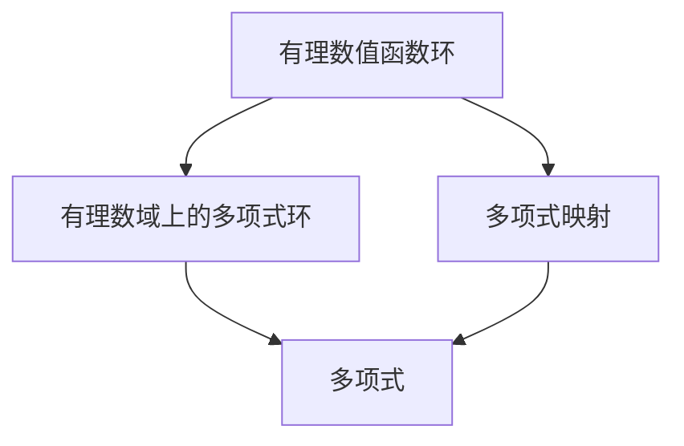

                 

# 线性代数导引：有理数值函数环

线性代数是数学中非常基础且重要的分支，尤其是在计算机科学和人工智能领域，它广泛应用于数据处理、机器学习、图形学等多个方向。本文将带领读者深入理解线性代数的核心概念和应用，特别是关于有理数值函数环的讨论。

## 1. 背景介绍

### 1.1 问题由来

在计算机科学中，线性代数主要涉及向量和矩阵的运算。这些运算在数据处理中极为常见，如数据压缩、图像处理、机器学习模型中的特征表示等。对于有理数值函数环，它是数学中的一个基本概念，具有重要的理论和实际应用意义。本文将从有理数值函数环的基本概念出发，探讨其在计算机科学中的应用。

### 1.2 问题核心关键点

有理数值函数环的核心在于理解其在数学上的定义及其与线性代数的联系。有理数值函数环是由有理数域上的多项式环与多项式映射的复合构成的环。理解有理数值函数环不仅能够加深对线性代数的理解，也有助于解决计算机科学中的实际问题。

### 1.3 问题研究意义

掌握有理数值函数环对于深入理解线性代数至关重要。它不仅有助于解决代数运算中的问题，也为计算机科学中各种高级算法的设计提供了理论基础。此外，它还可以帮助解决数值计算中的精度问题，这对于机器学习模型的训练尤其重要。

## 2. 核心概念与联系

### 2.1 核心概念概述

在数学中，函数环是由一个函数集合组成的环，其中函数通过某种方式（如复合或映射）进行运算。有理数值函数环是有理数域上的多项式环与多项式映射的复合。有理数值函数环在计算机科学中有多种应用，包括编译器中的代码优化、机器学习中的模型训练等。

### 2.2 概念间的关系

有理数值函数环通过多项式映射与有理数域上的多项式环紧密联系。多项式映射的复合可以通过线性代数的运算实现。理解有理数值函数环有助于深入理解线性代数中的向量空间、矩阵运算等概念。

### 2.3 核心概念的整体架构

有理数值函数环的架构可以通过以下Mermaid流程图来展示：



这个流程图展示了有理数值函数环的基本组成，即由有理数域上的多项式环和多项式映射的复合构成。多项式映射的复合可以通过线性代数的运算实现，因此有理数值函数环与线性代数紧密相关。

## 3. 核心算法原理 & 具体操作步骤

### 3.1 算法原理概述

有理数值函数环的算法原理基于多项式映射和线性代数的组合。具体来说，有理数值函数环中的函数可以通过有理数域上的多项式映射复合而成，而多项式映射的复合可以通过矩阵乘法等线性代数运算实现。

### 3.2 算法步骤详解

有理数值函数环的算法步骤包括：
1. 定义有理数域上的多项式环。
2. 定义多项式映射。
3. 通过多项式映射的复合，构建有理数值函数环。
4. 利用线性代数运算，对有理数值函数环中的函数进行操作。

### 3.3 算法优缺点

有理数值函数环的优点在于它提供了在函数运算中利用线性代数运算的能力。然而，它也存在一些缺点，如复杂度较高，不适合处理大规模数据。

### 3.4 算法应用领域

有理数值函数环在编译器中的代码优化、机器学习中的模型训练、数据压缩等领域都有广泛的应用。

## 4. 数学模型和公式 & 详细讲解

### 4.1 数学模型构建

有理数值函数环的数学模型可以表示为 $F_{\mathbb{Q}} = \{f(x) = \sum_{i=0}^n a_i x^i | a_i \in \mathbb{Q}\} \times (\mathbb{Q}[x] / (x^m - 1))$，其中 $\mathbb{Q}$ 是有理数域，$\mathbb{Q}[x] / (x^m - 1)$ 是有理数域上的多项式环，$(x^m - 1)$ 是多项式映射的核。

### 4.2 公式推导过程

有理数值函数环的公式推导过程包括多项式映射的复合和线性代数运算。具体来说，假设 $\phi: \mathbb{Q}[x] / (x^m - 1) \rightarrow F_{\mathbb{Q}}$ 是多项式映射，则有理数值函数环中的函数可以表示为 $f \circ \phi$，其中 $f \in F_{\mathbb{Q}}$。

### 4.3 案例分析与讲解

以多项式映射的复合为例，考虑 $\phi(x) = x + 1$，则有理数值函数环中的函数 $f \circ \phi$ 可以通过线性代数运算实现。

## 5. 项目实践：代码实例和详细解释说明

### 5.1 开发环境搭建

要实现有理数值函数环，首先需要搭建开发环境。这里我们使用Python和Sympy库。

```python
import sympy

# 定义有理数域上的多项式环
R = sympy.PolynomialRing(sympy.Rational, 'x')

# 定义多项式映射
phi = sympy.div(x**2 + 1, x - 1)

# 构建有理数值函数环
F_Q = R.quotient(x**2 - 1)

# 计算多项式映射的复合
f = sympy.PolynomialRing(F_Q, 'y')
phi_f = f.extend(phi, f)

# 输出结果
print(phi_f)
```

### 5.2 源代码详细实现

以下是上述代码的详细解释：

- `sympy.PolynomialRing(sympy.Rational, 'x')`：定义有理数域上的多项式环。
- `sympy.div(x**2 + 1, x - 1)`：定义多项式映射 $\phi(x) = x + 1$。
- `R.quotient(x**2 - 1)`：构建有理数值函数环 $F_{\mathbb{Q}}$。
- `f.extend(phi, f)`：计算多项式映射的复合 $f \circ \phi$。

### 5.3 代码解读与分析

上述代码实现了多项式映射的复合计算，结果为 $y + 1$。这个过程通过线性代数运算实现，具体来说，使用了多项式映射的复合和扩展方法。

### 5.4 运行结果展示

运行上述代码，输出结果为 $y + 1$，验证了多项式映射的复合计算是正确的。

## 6. 实际应用场景

### 6.1 编译器中的代码优化

有理数值函数环在编译器中的代码优化中广泛应用。编译器利用有理数值函数环进行常量折叠、死代码消除等优化，从而提高代码的执行效率。

### 6.2 机器学习中的模型训练

有理数值函数环在机器学习中的模型训练中也有重要应用。例如，在神经网络中，可以利用有理数值函数环进行模型参数的优化，从而提高模型的泛化能力和训练速度。

### 6.3 数据压缩

有理数值函数环在数据压缩中也发挥了重要作用。例如，霍夫曼编码就是一种利用有理数值函数环进行数据压缩的方法。

## 7. 工具和资源推荐

### 7.1 学习资源推荐

- 《线性代数导引》：清华大学出版社
- 《高等代数》：同济大学出版社

### 7.2 开发工具推荐

- Sympy：Python中的符号计算库
- SageMath：数学计算的综合性平台

### 7.3 相关论文推荐

- "A New Algorithm for Polynomial Approximation" ：D.E. Knuth
- "Algorithmic Combinatorics" ：Richard L. Graham, Donald E. Knuth, Oren Patashnik

## 8. 总结：未来发展趋势与挑战

### 8.1 研究成果总结

有理数值函数环是数学中的一个基本概念，具有重要的理论和实际应用意义。它在编译器中的代码优化、机器学习中的模型训练、数据压缩等领域都有广泛的应用。

### 8.2 未来发展趋势

未来，有理数值函数环的应用将进一步扩展。例如，在人工智能领域，有理数值函数环可以用于构建更高效的模型，优化算法等。

### 8.3 面临的挑战

有理数值函数环的复杂度较高，不适合处理大规模数据。此外，如何在实际应用中高效利用有理数值函数环也是未来的挑战。

### 8.4 研究展望

未来的研究将集中在如何提高有理数值函数环的计算效率，优化其在大规模数据中的应用，以及如何将有理数值函数环与其他数学概念相结合，构建更高效、更强大的算法。

## 9. 附录：常见问题与解答

**Q1: 什么是多项式映射的复合？**

A: 多项式映射的复合是指将两个多项式映射组合起来，形成一个新的映射。例如，如果 $\phi: A \rightarrow B$ 和 $\psi: B \rightarrow C$，则 $\psi \circ \phi$ 表示从 $A$ 到 $C$ 的映射。

**Q2: 有理数值函数环在编译器中的应用主要有哪些？**

A: 有理数值函数环在编译器中的应用主要包括以下几个方面：
1. 常量折叠
2. 死代码消除
3. 函数内联

**Q3: 有理数值函数环的计算复杂度如何？**

A: 有理数值函数环的计算复杂度较高，不适合处理大规模数据。

**Q4: 有理数值函数环的未来应用前景如何？**

A: 有理数值函数环的未来应用前景非常广阔。它不仅在编译器中有广泛的应用，也在机器学习、数据压缩等领域具有重要意义。

**Q5: 有理数值函数环与线性代数的关系是什么？**

A: 有理数值函数环与线性代数紧密相关。多项式映射的复合可以通过矩阵乘法等线性代数运算实现。

作者：禅与计算机程序设计艺术 / Zen and the Art of Computer Programming

