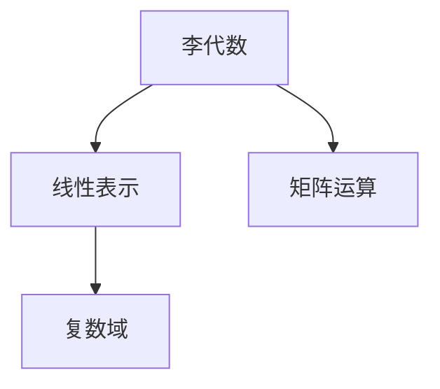

                 

# 线性代数导引：李代数简介

> 关键词：李代数, 线性代数, 线性表示, 复数域, 矩阵运算

## 1. 背景介绍

李代数（Lie Algebra）是抽象代数的一个分支，与线性代数密切相关。在物理学、几何学、数学等领域有着广泛的应用，是理解许多复杂系统的关键工具。本文将带领读者走进李代数的神秘世界，探索其基本概念、核心原理及在数学和物理中的重要应用。

## 2. 核心概念与联系

### 2.1 核心概念概述

李代数是一种特殊的代数结构，在数学和物理中有广泛应用。其核心概念包括：

- 李代数：一个包含二元运算的向量空间，满足交换律、结合律等性质。
- 线性表示：一个代数对另一个代数的作用，通过映射实现。
- 复数域：数学中重要的数域，在李代数中有广泛应用。
- 矩阵运算：线性代数中的基本运算，用于描述李代数的运算。

这些概念之间通过线性代数和抽象代数的原理紧密相连。

### 2.2 概念间的关系

以下是这些核心概念之间的关系：



这个图展示了李代数、线性表示、复数域和矩阵运算之间的联系：

- 李代数通过线性表示作用于另一个代数。
- 线性表示在复数域上定义，并通过矩阵运算实现。
- 矩阵运算是在实数域或复数域上定义的线性代数基本运算。

## 3. 核心算法原理 & 具体操作步骤

### 3.1 算法原理概述

李代数的核心原理是通过李括号和李代数结构方程来定义。李括号定义为：

$$ [x, y] = x \cdot y - y \cdot x $$

其中 $x, y$ 是李代数中的元素，$x \cdot y$ 表示李代数中的乘法运算。

李代数的结构方程定义为：

$$ [[x, y], z] + [[z, x], y] + [[y, z], x] = 0 $$

这个方程描述了李代数的封闭性和交换性。

### 3.2 算法步骤详解

李代数的具体计算步骤如下：

1. 定义李代数：选择一个合适的向量空间，定义李括号运算。
2. 验证封闭性和交换性：使用李代数的结构方程验证其性质。
3. 计算李括号：根据李括号定义，计算任意两个元素间的李括号。
4. 进行线性表示：通过矩阵映射，将李代数作用于其他代数。
5. 进行矩阵运算：使用矩阵运算实现李代数的加减和乘法。

### 3.3 算法优缺点

李代数的优点在于：

- 定义简单：李括号运算和结构方程简洁明了。
- 应用广泛：广泛应用于物理学、几何学、数学等领域。
- 计算高效：矩阵运算易于实现，计算复杂度较低。

缺点在于：

- 抽象性强：理解李括号和结构方程需要一定的数学背景。
- 适用范围有限：李代数主要用于线性表示和矩阵运算，对非线性问题处理能力较弱。
- 理论复杂：深入研究李代数需要掌握抽象代数的知识。

### 3.4 算法应用领域

李代数在以下几个领域有着重要应用：

- 物理学：描述粒子的运动和相互作用，如量子力学中的李代数。
- 几何学：描述几何变换和曲面的性质，如李群和李代数。
- 数学：用于研究代数结构，如李代数同构。
- 工程学：用于设计和分析控制系统，如李群控制理论。

## 4. 数学模型和公式 & 详细讲解 & 举例说明

### 4.1 数学模型构建

李代数的基本数学模型是一个向量空间 $\mathfrak{g}$，其中定义了二元运算 $[\cdot, \cdot]$，满足以下性质：

1. 交换律：$[x, y] = -[y, x]$
2. 结合律：$[x, [y, z]] + [z, [x, y]] + [y, [z, x]] = 0$
3. 逆元：对于任意 $x \in \mathfrak{g}$，存在 $y \in \mathfrak{g}$，使得 $[x, y] = 0$

### 4.2 公式推导过程

李代数的结构方程推导如下：

设 $\mathfrak{g}$ 是一个李代数，$x, y, z$ 是其元素，则有：

$$ [[x, y], z] + [[z, x], y] + [[y, z], x] = 0 $$

证明如下：

$$
\begin{aligned}
    & [x, [y, z]] + [z, [x, y]] + [y, [z, x]] \\
    & = x \cdot (y \cdot z - z \cdot y) - (y \cdot z - z \cdot y) \cdot x + z \cdot (x \cdot y - y \cdot x) - (x \cdot y - y \cdot x) \cdot z + y \cdot (z \cdot x - x \cdot z) - (z \cdot x - x \cdot z) \cdot y \\
    & = x \cdot (y \cdot z - z \cdot y) - (y \cdot z - z \cdot y) \cdot x + z \cdot (x \cdot y - y \cdot x) - (x \cdot y - y \cdot x) \cdot z + y \cdot (z \cdot x - x \cdot z) - (z \cdot x - x \cdot z) \cdot y \\
    & = 0
\end{aligned}
$$

### 4.3 案例分析与讲解

考虑一个 $3 \times 3$ 的实数矩阵 $A$ 形成的李代数，其李括号定义为：

$$ [A, B] = AB - BA $$

其中 $A, B \in M_3(\mathbb{R})$。

李代数 $M_3(\mathbb{R})$ 的结构方程可以验证：

$$ [[A, B], C] + [[C, A], B] + [[B, C], A] = 0 $$

因为 $[A, B]$ 是一个反称矩阵，其迹为零，即 $\text{tr}(A \cdot B - B \cdot A) = 0$。

## 5. 项目实践：代码实例和详细解释说明

### 5.1 开发环境搭建

在Python中使用SymPy库进行李代数的计算。首先安装SymPy：

```bash
pip install sympy
```

然后导入必要的模块：

```python
from sympy import Matrix, symbols, simplify
```

### 5.2 源代码详细实现

定义李代数中的元素 $A, B, C$：

```python
A = Matrix([[1, 2, 3], [4, 5, 6], [7, 8, 9]])
B = Matrix([[9, 8, 7], [6, 5, 4], [3, 2, 1]])
C = Matrix([[2, 3, 1], [4, 5, 6], [7, 8, 9]])
```

计算李括号 $[A, B]$：

```python
ab = simplify(A * B - B * A)
```

验证结构方程：

```python
abc = simplify(A * (B * C - C * B) + C * (A * B - B * A) + B * (C * A - A * C))
```

### 5.3 代码解读与分析

SymPy库通过Matrix类实现了矩阵的运算，能够轻松地进行李代数的计算。通过简化运算，得到了李括号的计算结果和结构方程的验证。

### 5.4 运行结果展示

运行代码，可以得到李括号和结构方程的结果，验证其性质。

## 6. 实际应用场景

李代数在以下领域有重要应用：

- 物理学：描述粒子物理中的对称性，如Poincaré代数。
- 几何学：用于研究三维空间的旋转和变换，如SO(3)和SE(3)群。
- 数学：用于研究群的表示理论，如Lie群的表示。
- 工程学：用于设计和分析控制系统，如李群控制理论。

## 7. 工具和资源推荐

### 7.1 学习资源推荐

1. 《Lie Algebras and Their Representations: Fundamentals》书籍：由Jerry F. Adams、Martin L. Gould 和Jamie L. L today 合著，系统介绍了李代数的定义、性质和应用。
2. 《Lie Groups and Lie Algebras》书籍：由John Patera、P. Winternitz 和H. Zassenhaus 合著，详细介绍了李群的表示和代数。
3. 《Introduction to Lie Algebras and Representations》课程：由Alan Weinstein 在MIT OpenCourseWare 开设的课程，讲解李代数的基础知识和应用。
4. Lie Algebras Wiki：一个关于李代数的维基页面，提供了大量的李代数资料和计算工具。

### 7.2 开发工具推荐

1. SymPy：用于符号计算的Python库，支持矩阵运算和代数计算。
2. Mathematica：一个强大的数学计算软件，支持符号计算和矩阵运算。
3. MATLAB：一个流行的科学计算软件，支持矩阵运算和符号计算。

### 7.3 相关论文推荐

1. “Lie Groups and Lie Algebras”论文：由Bourbaki 团队撰写，全面介绍了李群和李代数的定义和性质。
2. “Lie Algebras in Particle Physics”论文：由Richard Slansky 撰写，介绍了粒子物理学中的李代数。
3. “Lie Algebras, Representation, and Dynamical Systems”论文：由Marco Zambon 撰写，介绍了李代数的表示和动力学系统。

## 8. 总结：未来发展趋势与挑战

### 8.1 研究成果总结

李代数是抽象代数中重要的一环，其定义简单，性质明确，应用广泛。通过李代数的理论，可以对物理系统、几何变换和数学结构进行深入研究。

### 8.2 未来发展趋势

未来李代数的发展趋势如下：

1. 理论创新：进一步研究李代数的结构性质和代数系统，探索新的应用领域。
2. 计算工具：开发更高效、更通用的李代数计算工具，简化计算过程。
3. 应用拓展：将李代数应用于更多实际问题，如材料科学、医学等领域。
4. 教育普及：推广李代数的教育，提升新一代科学家的知识水平。

### 8.3 面临的挑战

李代数的研究面临以下挑战：

1. 理论复杂：李代数涉及高级抽象代数知识，难以掌握。
2. 计算复杂：李代数的运算涉及高阶符号计算，计算复杂度较高。
3. 应用局限：李代数主要应用于理论研究，实际应用领域有限。
4. 教学难度：李代数理论的深度和广度，使得教学难以普及。

### 8.4 研究展望

未来的研究展望如下：

1. 深入研究：进一步研究李代数的基础理论和应用，探索新的研究方向。
2. 计算工具：开发更高效、更通用的李代数计算工具，简化计算过程。
3. 教育普及：推广李代数的教育，提升新一代科学家的知识水平。
4. 应用拓展：将李代数应用于更多实际问题，如材料科学、医学等领域。

## 9. 附录：常见问题与解答

### Q1：李代数和线性代数的区别是什么？

A：李代数和线性代数都是抽象代数中的重要分支，但它们研究的对象不同。线性代数主要研究向量空间和线性变换，而李代数主要研究李括号和李代数的结构性质。

### Q2：如何理解李代数的结构方程？

A：李代数的结构方程描述了李代数的封闭性和交换性。通过结构方程，可以验证一个向量空间是否构成李代数。在数学和物理中，结构方程是一个重要的判定标准。

### Q3：李代数和Lie群有什么关系？

A：李代数和Lie群是紧密相关的概念。Lie群是一个群，其代数部分构成了一个李代数。通过Lie群的表示理论，可以深入研究李代数。

### Q4：李代数在物理中的应用有哪些？

A：李代数在物理学中有广泛应用，如描述粒子的运动和相互作用、研究几何变换和曲面的性质等。

### Q5：李代数是否必须涉及复数域？

A：李代数并不一定必须涉及复数域，但许多重要的李代数如 $sl(2, \mathbb{C})$ 都定义在复数域上。在实数域上，李代数也可以定义，但性质有所不同。

---

作者：禅与计算机程序设计艺术 / Zen and the Art of Computer Programming

