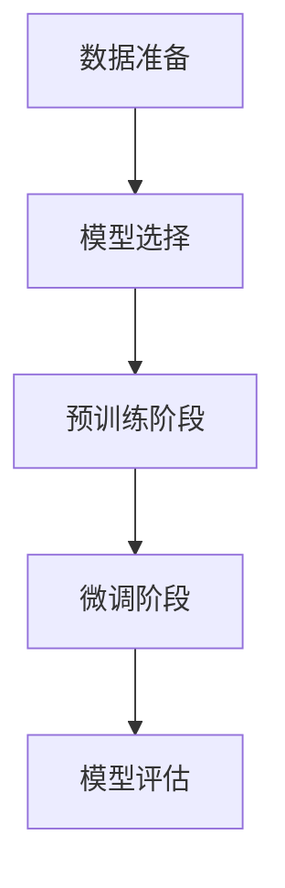

# 一切皆是映射：预训练模型如何改变深度学习领域

## 1.背景介绍

在过去的十年中，深度学习已经从一个学术研究领域迅速发展成为推动人工智能（AI）进步的核心技术。深度学习的成功在很大程度上归功于其在图像识别、自然语言处理和语音识别等领域的卓越表现。然而，随着数据量和模型复杂度的增加，训练深度学习模型的成本和时间也在不断攀升。预训练模型的出现为这一问题提供了一个有效的解决方案。

预训练模型通过在大规模数据集上进行初步训练，然后在特定任务上进行微调，从而显著减少了训练时间和计算资源。这种方法不仅提高了模型的性能，还使得深度学习技术更加普及和易于应用。

## 2.核心概念与联系

### 2.1 预训练模型的定义

预训练模型是指在大规模数据集上进行初步训练的模型，这些模型可以在多个任务中重复使用。预训练的过程通常包括两个阶段：预训练阶段和微调阶段。

### 2.2 映射的概念

在数学和计算机科学中，映射是指将一个集合中的元素关联到另一个集合中的元素的过程。在深度学习中，映射通常指的是将输入数据转换为输出结果的过程。预训练模型通过学习大规模数据集中的映射关系，从而在特定任务中表现出色。

### 2.3 预训练模型与映射的联系

预训练模型的核心思想是通过学习大规模数据集中的映射关系，从而在特定任务中表现出色。这种方法不仅提高了模型的性能，还使得深度学习技术更加普及和易于应用。

## 3.核心算法原理具体操作步骤

### 3.1 数据准备

在预训练模型的训练过程中，数据准备是一个关键步骤。首先，需要收集和清洗大规模数据集。然后，将数据集划分为训练集、验证集和测试集。

### 3.2 模型选择

选择合适的模型架构是预训练模型成功的关键。常见的预训练模型架构包括卷积神经网络（CNN）、循环神经网络（RNN）和变换器（Transformer）等。

### 3.3 预训练阶段

在预训练阶段，模型在大规模数据集上进行初步训练。这个过程通常需要大量的计算资源和时间，但可以显著提高模型的性能。

### 3.4 微调阶段

在微调阶段，预训练模型在特定任务的数据集上进行微调。这个过程通常需要较少的计算资源和时间，但可以显著提高模型在特定任务上的性能。

### 3.5 模型评估

在模型训练完成后，需要对模型进行评估。常见的评估指标包括准确率、精确率、召回率和F1分数等。



## 4.数学模型和公式详细讲解举例说明

### 4.1 预训练模型的数学表示

预训练模型可以表示为一个函数 $f(x; \theta)$，其中 $x$ 是输入数据，$\theta$ 是模型参数。在预训练阶段，模型通过最小化损失函数 $L(\theta)$ 来学习数据中的映射关系。

$$
\theta^* = \arg\min_{\theta} L(\theta)
$$

### 4.2 微调阶段的数学表示

在微调阶段，预训练模型在特定任务的数据集上进行微调。这个过程可以表示为在预训练模型的基础上，最小化特定任务的损失函数 $L_{task}(\theta)$。

$$
\theta_{task}^* = \arg\min_{\theta} L_{task}(\theta)
$$

### 4.3 举例说明

假设我们有一个预训练的图像分类模型 $f(x; \theta)$，在大规模图像数据集上进行了预训练。现在，我们希望在一个特定的猫狗分类任务上进行微调。首先，我们将预训练模型的参数 $\theta$ 作为初始参数，然后在猫狗分类数据集上进行微调，最小化特定任务的损失函数 $L_{task}(\theta)$。

$$
\theta_{task}^* = \arg\min_{\theta} L_{task}(\theta)
$$

## 5.项目实践：代码实例和详细解释说明

### 5.1 数据准备

首先，我们需要准备数据集。这里我们使用一个简单的猫狗分类数据集。

```python
import tensorflow as tf
from tensorflow.keras.preprocessing.image import ImageDataGenerator

train_datagen = ImageDataGenerator(rescale=1./255)
train_generator = train_datagen.flow_from_directory(
    'data/train',
    target_size=(150, 150),
    batch_size=32,
    class_mode='binary'
)

validation_datagen = ImageDataGenerator(rescale=1./255)
validation_generator = validation_datagen.flow_from_directory(
    'data/validation',
    target_size=(150, 150),
    batch_size=32,
    class_mode='binary'
)
```

### 5.2 模型选择

我们选择一个预训练的VGG16模型，并在其基础上进行微调。

```python
from tensorflow.keras.applications import VGG16
from tensorflow.keras import layers, models

base_model = VGG16(weights='imagenet', include_top=False, input_shape=(150, 150, 3))
base_model.trainable = False

model = models.Sequential([
    base_model,
    layers.Flatten(),
    layers.Dense(256, activation='relu'),
    layers.Dense(1, activation='sigmoid')
])
```

### 5.3 预训练阶段

在这个例子中，我们使用预训练的VGG16模型，因此不需要进行预训练阶段。

### 5.4 微调阶段

我们在猫狗分类数据集上进行微调。

```python
model.compile(optimizer='adam', loss='binary_crossentropy', metrics=['accuracy'])

history = model.fit(
    train_generator,
    steps_per_epoch=100,
    epochs=10,
    validation_data=validation_generator,
    validation_steps=50
)
```

### 5.5 模型评估

最后，我们对模型进行评估。

```python
loss, accuracy = model.evaluate(validation_generator)
print(f'Validation accuracy: {accuracy}')
```

## 6.实际应用场景

### 6.1 图像识别

预训练模型在图像识别领域表现出色。通过在大规模图像数据集上进行预训练，模型可以学习到丰富的特征表示，从而在特定任务中表现出色。

### 6.2 自然语言处理

在自然语言处理领域，预训练模型如BERT和GPT-3已经成为标准。通过在大规模文本数据集上进行预训练，这些模型可以捕捉到语言的复杂结构和语义关系，从而在各种自然语言处理任务中表现出色。

### 6.3 语音识别

预训练模型在语音识别领域也有广泛应用。通过在大规模语音数据集上进行预训练，模型可以学习到语音信号的特征，从而在特定任务中表现出色。

## 7.工具和资源推荐

### 7.1 TensorFlow

TensorFlow是一个开源的深度学习框架，支持预训练模型的训练和微调。它提供了丰富的预训练模型和工具，方便用户进行深度学习研究和应用。

### 7.2 PyTorch

PyTorch是另一个流行的深度学习框架，支持动态计算图和预训练模型的训练和微调。它提供了丰富的预训练模型和工具，方便用户进行深度学习研究和应用。

### 7.3 Hugging Face

Hugging Face是一个专注于自然语言处理的开源社区，提供了丰富的预训练模型和工具。它的Transformers库支持多种预训练模型的训练和微调，方便用户进行自然语言处理研究和应用。

## 8.总结：未来发展趋势与挑战

预训练模型在深度学习领域的成功应用，标志着深度学习技术的一个重要里程碑。通过在大规模数据集上进行预训练，模型可以学习到丰富的特征表示，从而在特定任务中表现出色。然而，预训练模型也面临一些挑战，如计算资源的需求、数据隐私问题和模型的可解释性等。

未来，预训练模型的发展趋势可能包括以下几个方面：

1. **更高效的预训练方法**：研究更高效的预训练方法，以减少计算资源的需求和训练时间。
2. **多模态预训练模型**：研究多模态预训练模型，以同时处理多种类型的数据，如图像、文本和语音等。
3. **模型的可解释性**：研究预训练模型的可解释性，以提高模型的透明度和可信度。

## 9.附录：常见问题与解答

### 9.1 预训练模型的优点是什么？

预训练模型的优点包括提高模型的性能、减少训练时间和计算资源、提高模型的普适性和易用性等。

### 9.2 预训练模型的缺点是什么？

预训练模型的缺点包括计算资源的需求、数据隐私问题和模型的可解释性等。

### 9.3 如何选择合适的预训练模型？

选择合适的预训练模型需要考虑多个因素，如任务的类型、数据的规模和质量、计算资源的需求等。

### 9.4 预训练模型在实际应用中有哪些挑战？

预训练模型在实际应用中面临一些挑战，如计算资源的需求、数据隐私问题和模型的可解释性等。

### 9.5 预训练模型的未来发展趋势是什么？

预训练模型的未来发展趋势可能包括更高效的预训练方法、多模态预训练模型和模型的可解释性等。

---

作者：禅与计算机程序设计艺术 / Zen and the Art of Computer Programming