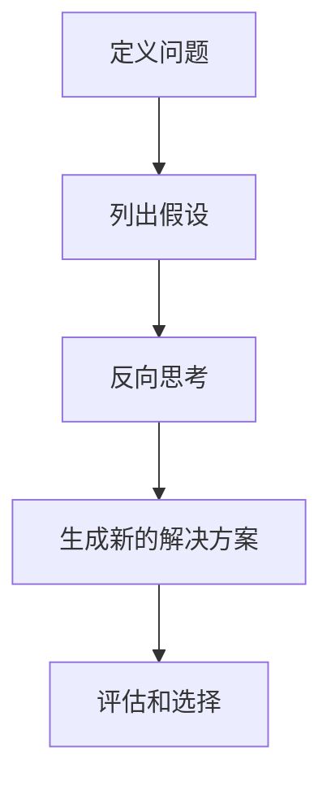

# 像数学家一样思考：相反原则

## 1.背景介绍

在日常生活和工作中,我们经常会遇到各种各样的问题和挑战。传统的思维方式往往会让我们陷入思维定式,难以突破常规。而"相反原则"这种独特的思考方式,可以帮助我们摆脱思维惯性,从不同的角度审视问题,发现新的解决方案。

"相反原则"源于数学领域,它鼓励我们反向思考,颠覆常规假设,探索"相反"的可能性。通过这种思维方式,我们可以打破思维定式,发现问题的新视角,激发创新思维。

## 2.核心概念与联系

### 2.1 相反原则的核心理念

相反原则的核心理念是"反向思考"。它鼓励我们颠覆常规假设,探索"相反"的可能性。通过这种思维方式,我们可以打破思维定式,发现问题的新视角,激发创新思维。

### 2.2 相反原则与其他思维方式的联系

相反原则与其他一些知名的思维方式有着密切联系,例如"反向思维"、"逆向工程"和"反证法"等。这些思维方式都鼓励我们从不同的角度审视问题,探索新的解决方案。

## 3.核心算法原理具体操作步骤

相反原则的核心算法原理可以概括为以下几个步骤:

1. **定义问题**: 首先,需要清晰地定义所面临的问题或挑战。
2. **列出假设**: 列出与问题相关的所有假设和前提条件。
3. **反向思考**: 对每一个假设和前提条件进行反向思考,探索"相反"的可能性。
4. **生成新的解决方案**: 基于反向思考的结果,生成新的解决方案或思路。
5. **评估和选择**: 评估所有可能的解决方案,选择最佳的方案进行实施。

以下是相反原则的流程图:



## 4.数学模型和公式详细讲解举例说明

相反原则虽然源于数学领域,但它的应用范围远不止于此。在许多领域,相反原则都可以发挥作用,帮助我们发现新的解决方案。

### 4.1 数学领域的应用

在数学领域,相反原则常常被用于证明一个命题。我们可以通过反证法,假设命题的相反命题成立,然后导出矛盾,从而证明原命题成立。

例如,要证明 $\sqrt{2}$ 是一个无理数,我们可以假设 $\sqrt{2}$ 是有理数,即存在两个整数 $a$ 和 $b$,使得 $\sqrt{2} = \frac{a}{b}$,其中 $a$ 和 $b$ 是互质的。然后,我们可以推导出矛盾,从而证明 $\sqrt{2}$ 是无理数。

$$
\begin{align*}
\sqrt{2} &= \frac{a}{b} \\
2 &= \frac{a^2}{b^2} \\
2b^2 &= a^2 \\
\end{align*}
$$

由于 $a^2$ 是偶数,而 $2b^2$ 是奇数,这就产生了矛盾。因此,我们可以证明 $\sqrt{2}$ 是无理数。

### 4.2 其他领域的应用

相反原则不仅在数学领域有应用,在其他领域也可以发挥作用。例如,在商业领域,我们可以通过反向思考来发现新的商业模式或营销策略。在设计领域,我们可以通过反向思考来创造出新颖的设计理念。

以下是一个简单的例子,说明如何在日常生活中应用相反原则:

假设你想要减肥,传统的做法是控制饮食和增加运动。但是,如果我们反向思考,我们可以探索"增加体重"的可能性。通过这种思维方式,我们可能会发现一些新的减肥方法,例如增加肌肉质量、调整代谢率等。

## 5.项目实践:代码实例和详细解释说明

相反原则不仅可以应用于数学和其他领域,在编程和软件开发中也可以发挥作用。以下是一个简单的代码示例,说明如何在编程中应用相反原则:

```python
def find_max(lst):
    """
    传统方法: 找出列表中的最大值
    """
    max_val = lst[0]
    for val in lst[1:]:
        if val > max_val:
            max_val = val
    return max_val

def find_min(lst):
    """
    相反原则: 找出列表中的最小值
    """
    min_val = lst[0]
    for val in lst[1:]:
        if val < min_val:
            min_val = val
    return min_val

# 示例用法
numbers = [5, 2, 8, 1, 9]
print("最大值:", find_max(numbers))  # 输出: 最大值: 9
print("最小值:", find_min(numbers))  # 输出: 最小值: 1
```

在这个示例中,我们定义了两个函数 `find_max` 和 `find_min`。`find_max` 函数使用传统的方法找出列表中的最大值,而 `find_min` 函数则应用了相反原则,找出列表中的最小值。

通过这个简单的示例,我们可以看到,相反原则不仅可以应用于数学和其他领域,在编程中也可以发挥作用。通过反向思考,我们可以发现新的算法或解决方案。

## 6.实际应用场景

相反原则可以应用于各个领域,以下是一些实际应用场景的例子:

### 6.1 商业领域

在商业领域,相反原则可以帮助企业发现新的商业模式或营销策略。例如,传统的商业模式是向客户出售产品或服务,但是如果我们反向思考,我们可以探索"免费"的可能性,从而发现新的盈利模式,如广告收入、订阅服务等。

### 6.2 设计领域

在设计领域,相反原则可以帮助设计师创造出新颖的设计理念。例如,传统的设计理念是"形式服从功能",但是如果我们反向思考,我们可以探索"功能服从形式"的可能性,从而创造出新颖的设计作品。

### 6.3 科学研究

在科学研究领域,相反原则可以帮助科学家提出新的假说或理论。例如,在物理学领域,相反原则可以帮助科学家探索"反常规"的现象,从而发现新的物理定律或理论。

### 6.4 个人发展

在个人发展领域,相反原则可以帮助我们打破思维定式,发现新的生活方式或解决问题的方法。例如,如果我们想要提高工作效率,传统的做法是增加工作时间,但是如果我们反向思考,我们可以探索"减少工作时间"的可能性,从而发现新的提高效率的方法,如精力管理、任务优先级排序等。

## 7.工具和资源推荐

如果你想进一步了解和应用相反原则,以下是一些推荐的工具和资源:

### 7.1 书籍

- 《思考的技术》(The Art of Thought)by Graham Wallas
- 《逆向思维》(Reverse Thinking)by Iqbal Arshad
- 《反常识》(Against the Grain)by Richard Rohr

### 7.2 在线课程

- 《思维导图与逆向思维》(Udemy)
- 《创新思维:逆向思维与设计思维》(Coursera)

### 7.3 工具

- 思维导图软件(如XMind、MindManager等)
- 反向思考提示卡

### 7.4 社区

- 反向思维社区(Reverse Thinking Community)
- 创新思维论坛(Innovation Thinking Forum)

通过利用这些工具和资源,你可以进一步提高对相反原则的理解和应用能力。

## 8.总结:未来发展趋势与挑战

相反原则作为一种独特的思维方式,在未来将会有更广泛的应用前景。随着人工智能、大数据和其他新兴技术的发展,相反原则将会在这些领域发挥越来越重要的作用。

同时,相反原则也面临着一些挑战。例如,如何在不同领域有效地应用相反原则?如何培养相反原则的思维习惯?如何将相反原则与其他思维方式有机结合?这些都是需要进一步探索和研究的领域。

未来,相反原则将会成为一种重要的思维工具,帮助我们解决复杂的问题,激发创新思维。通过不断学习和实践,我们可以掌握相反原则的精髓,从而在各个领域取得更大的成就。

## 9.附录:常见问题与解答

### 9.1 相反原则是否适用于所有问题?

相反原则是一种有效的思维方式,但并不是万能的。在某些情况下,传统的思维方式可能更加有效。因此,我们需要根据具体情况选择合适的思维方式。

### 9.2 如何培养相反原则的思维习惯?

培养相反原则的思维习惯需要持续的练习和反思。我们可以通过以下方式来培养这种习惯:

- 主动质疑自己的假设和前提条件
- 尝试从不同角度审视问题
- 利用思维导图或其他工具来帮助思考
- 与他人讨论和交流,获取不同的观点

### 9.3 相反原则与其他思维方式有何区别?

相反原则与其他一些思维方式有一定的联系,但也有一些区别。例如,相反原则强调"反向思考"和"颠覆假设",而其他思维方式可能更侧重于发散思维或创新思维。

### 9.4 如何将相反原则应用于实际工作或生活中?

将相反原则应用于实际工作或生活中,需要培养一种"反向思考"的习惯。当我们遇到问题或挑战时,可以尝试列出相关的假设和前提条件,然后对它们进行反向思考,探索"相反"的可能性。通过这种方式,我们可能会发现新的解决方案或思路。

作者:禅与计算机程序设计艺术 / Zen and the Art of Computer Programming