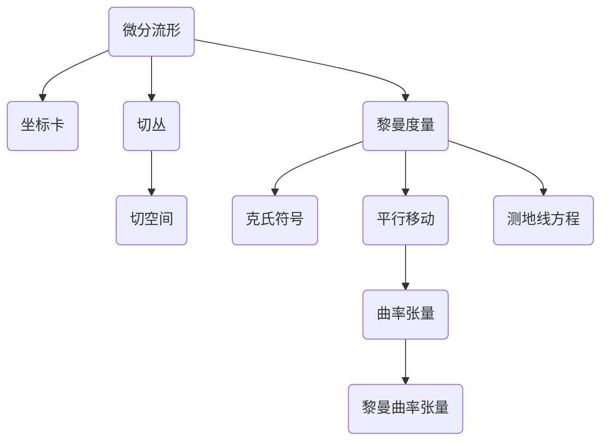

# 微分几何入门与广义相对论：Vaidya度规和Kinnersley度规

## 1. 背景介绍
### 1.1 微分几何的发展历程
#### 1.1.1 微分几何的起源
#### 1.1.2 现代微分几何的奠基
#### 1.1.3 微分几何在物理学中的应用

### 1.2 广义相对论概述  
#### 1.2.1 狭义相对论的局限性
#### 1.2.2 广义相对论的基本原理
#### 1.2.3 广义相对论的数学基础

### 1.3 Vaidya度规和Kinnersley度规的研究意义
#### 1.3.1 Vaidya度规的特点及应用
#### 1.3.2 Kinnersley度规的特点及应用
#### 1.3.3 两种度规的比较研究价值

## 2. 核心概念与联系
### 2.1 流形与坐标系
#### 2.1.1 拓扑流形的定义
#### 2.1.2 微分流形与坐标卡
#### 2.1.3 切丛与切空间

### 2.2 联络与曲率
#### 2.2.1 黎曼度量与克氏符号  
#### 2.2.2 导数算子与平行移动
#### 2.2.3 曲率张量与黎曼曲率张量

### 2.3 测地线方程
#### 2.3.1 测地线的概念
#### 2.3.2 测地线方程的推导
#### 2.3.3 测地线在广义相对论中的应用



## 3. 核心算法原理具体操作步骤
### 3.1 Vaidya度规的推导
#### 3.1.1 Vaidya度规的线元表达式
#### 3.1.2 能量动量张量与爱因斯坦场方程
#### 3.1.3 求解Vaidya度规的具体步骤

### 3.2 Kinnersley度规的推导
#### 3.2.1 Kinnersley度规的线元表达式 
#### 3.2.2 Kinnersley度规满足的场方程
#### 3.2.3 求解Kinnersley度规的具体步骤

### 3.3 两种度规的比较
#### 3.3.1 度规的对称性分析
#### 3.3.2 奇点结构与视界分析
#### 3.3.3 物理意义解释

## 4. 数学模型和公式详细讲解举例说明
### 4.1 黎曼几何基础
#### 4.1.1 黎曼度量的定义与性质
黎曼度量是定义在流形上的对称双线性形式，满足：

$$
g_{ij} = g_{ji}, \quad g_{ij}dx^idx^j > 0
$$

其中$g_{ij}$是度量张量的分量。

#### 4.1.2 克氏符号与联络系数
克氏符号定义为度量的导数：

$$
\Gamma^i_{jk} = \frac{1}{2}g^{il}(\partial_kg_{jl} + \partial_jg_{kl} - \partial_lg_{jk})
$$

联络系数刻画了向量场在平行移动过程中的变化率。

#### 4.1.3 黎曼曲率张量与爱因斯坦张量  
黎曼曲率张量定义为：

$$
R^i_{jkl} = \partial_k\Gamma^i_{jl} - \partial_l\Gamma^i_{jk} + \Gamma^i_{mk}\Gamma^m_{jl} - \Gamma^i_{ml}\Gamma^m_{jk}
$$

爱因斯坦张量为黎曼曲率张量的缩并：

$$
G_{ij} = R_{ij} - \frac{1}{2}Rg_{ij}
$$

### 4.2 Vaidya度规的数学模型
Vaidya度规描述了球对称辐射尘埃的时空，其线元为：

$$
ds^2 = -\left(1-\frac{2m(v)}{r}\right)dv^2 + 2dvdr + r^2(d\theta^2+\sin^2\theta d\phi^2)
$$

其中$m(v)$是Vaidya质量函数，满足能量条件：

$$
\frac{dm(v)}{dv} \geq 0
$$

将Vaidya度规代入爱因斯坦场方程：

$$
G_{ij} = 8\pi T_{ij}
$$

可以求得对应的能量动量张量$T_{ij}$，从而确定物质场的性质。

### 4.3 Kinnersley度规的数学模型
Kinnersley度规描述了带电Kerr黑洞的时空，其线元为：

$$
\begin{aligned}
ds^2 = &-\frac{\Delta-a^2\sin^2\theta}{\Sigma}dt^2 - \frac{2a\sin^2\theta(r^2+a^2-\Delta)}{\Sigma}dtd\phi \\
&+ \frac{(r^2+a^2)^2-\Delta a^2\sin^2\theta}{\Sigma}\sin^2\theta d\phi^2 + \frac{\Sigma}{\Delta}dr^2 + \Sigma d\theta^2
\end{aligned}
$$

其中$\Delta=r^2-2Mr+a^2+Q^2$，$\Sigma=r^2+a^2\cos^2\theta$，$M$为黑洞质量，$a$为角动量参数，$Q$为电荷。

Kinnersley度规满足真空爱因斯坦-麦克斯韦方程组：

$$
\begin{aligned}
&R_{ij} = 8\pi(F_{ik}{F_j}^k - \frac{1}{4}g_{ij}F_{kl}F^{kl}) \\
&\nabla_iF^{ij} = 0, \quad \nabla_{[i}F_{kl]} = 0
\end{aligned}
$$

其中$F_{ij}$为电磁场张量。求解上述方程组可得Kinnersley度规的解析表达式。

## 5. 项目实践：代码实例和详细解释说明
下面以Python语言为例，演示如何利用符号计算库SymPy进行张量分析与广义相对论计算。

### 5.1 黎曼曲率张量的计算

```python
from sympy import * 

# 定义坐标符号
t, r, theta, phi = symbols('t r theta phi')

# 定义度规张量分量
g00 = -1
g11 = 1 
g22 = r**2
g33 = r**2*sin(theta)**2
g = Matrix([[g00,0,0,0], [0,g11,0,0], [0,0,g22,0], [0,0,0,g33]]) 

# 计算克氏符号
def christoffel(i, j, k):
    return (g[i,j].diff(coords[k]) + g[i,k].diff(coords[j]) 
            - g[j,k].diff(coords[i])) / 2

coords = [t,r,theta,phi]
indices = range(4)

# 计算黎曼曲率张量分量
def riemann(i, j, k, l):
    return (christoffel(k,i,l).diff(coords[j]) - christoffel(k,i,j).diff(coords[l])
            + sum(christoffel(m,i,l)*christoffel(k,m,j) 
                  - christoffel(m,i,j)*christoffel(k,m,l) for m in indices))

# 输出结果    
for i in indices:
    for j in indices:
        for k in indices:
            for l in indices:
                component = riemann(i,j,k,l)
                if component != 0:
                    print(f"R_{i}{j}{k}{l} = {component}")
```

以上代码计算了球坐标系下的黎曼曲率张量分量，通过符号运算可以直观地呈现张量的解析表达式。类似地，可以计算度规、联络系数、测地线方程等广义相对论中的基本量。

### 5.2 测地线方程的数值求解

```python
import numpy as np
from scipy.integrate import odeint

# 定义度规函数
def metric(r):
    return np.diag([-1, 1/(1-2*M/r), r**2, r**2*np.sin(theta)**2])

# 定义克氏符号函数 
def christoffel(r, theta):
    g = metric(r)
    dgdr = np.zeros((4,4))
    dgdr[1,1] = 2*M / (r-2*M)**2
    dgdr[2,2] = 2*r
    dgdr[3,3] = 2*r*np.sin(theta)**2
    
    gamma = np.zeros((4,4,4))
    for mu in range(4):
        for nu in range(4):
            for lam in range(4):
                for sig in range(4):
                    gamma[mu,nu,lam] += 0.5 * g[mu,sig] * (dgdr[sig,nu] 
                                        + dgdr[sig,lam] - dgdr[nu,lam])
    return gamma

# 定义测地线方程
def geodesic_eq(y, tau):
    t, r, theta, phi = y[0], y[2], y[4], y[6]
    dt, dr, dtheta, dphi = y[1], y[3], y[5], y[7]
    
    gamma = christoffel(r, theta)
    
    d2t = -2 * gamma[0,1,0] * dt * dr
    d2r = -gamma[1,0,0] * dt**2 + gamma[1,1,1] * dr**2 + gamma[1,2,2] * r**2 * dtheta**2 \
          + gamma[1,3,3] * r**2 * np.sin(theta)**2 * dphi**2
    d2theta = -2/r * dr * dtheta + np.sin(theta) * np.cos(theta) * dphi**2
    d2phi = -2/r * dr * dphi - 2 * np.cos(theta)/np.sin(theta) * dtheta * dphi
    
    return [dt, d2t, dr, d2r, dtheta, d2theta, dphi, d2phi]

# 设置初始条件和参数
M = 1.0  # 黑洞质量
tau = np.linspace(0, 10, 1000)
y0 = [0, 1, 10, 0, np.pi/2, 0, 0, 0.1]

# 数值积分求解测地线方程  
sol = odeint(geodesic_eq, y0, tau)

# 提取求解结果
t = sol[:,0]  
r = sol[:,2]
theta = sol[:,4]
phi = sol[:,6]

# 绘制测地线图像
import matplotlib.pyplot as plt
from mpl_toolkits.mplot3d import Axes3D

fig = plt.figure(figsize=(8,6))
ax = fig.add_subplot(111, projection='3d')
ax.plot(r*np.cos(phi)*np.sin(theta), r*np.sin(phi)*np.sin(theta), r*np.cos(theta))
ax.set_xlabel(r'$x$')  
ax.set_ylabel(r'$y$')
ax.set_zlabel(r'$z$')
ax.set_title("Geodesic near Schwarzschild Black Hole")
plt.tight_layout()
plt.show()
```

以上代码利用Python的SciPy库对施瓦西时空中的测地线方程进行数值积分求解，并绘制出测地线在三维空间中的轨迹。通过数值模拟可以直观展示广义相对论的物理效应，加深对理论的理解。

## 6. 实际应用场景
### 6.1 引力透镜效应
引力透镜是由于质量分布不均匀导致时空弯曲，使得光线发生偏转而产生的现象。Vaidya度规和Kinnersley度规可用于研究动态引力透镜及旋转引力透镜效应。

### 6.2 引力波的产生与传播
引力波是时空曲率的波动在真空中的传播。Vaidya度规描述了球对称引力波的辐射场，Kinnersley度规对应带电旋转黑洞的引力波解。研究两种度规有助于理解引力波的产生机制和观测特征。

### 6.3 黑洞热力学
Vaidya度规和Kinnersley度规的视界结构与奇点性质体现了不同类型黑洞的热力学性质。通过研究黑洞度规可以建立黑洞热力学与量子引力之间的联系。

## 7. 工具和资源推荐
### 7.1 数学软件
- Mathematica：强大的符号计算与可视化功能
- Maple：支持张量分析的数学软件
- SageMath：基于Python的开源数学软件系统

### 7.2 编程工具包
- SymPy：Python的符号数学库，支持广义相对论张量运算
- GraviPy：Python的广义相对论数值计算库
- Maxima：基于Lisp的开源符号计算系统

### 7.3 学习资源
- Sean Carroll的《Spacetime and Geometry》：广义相对论的现代教材
- Leonard Susskind的《广义相对论》课程：