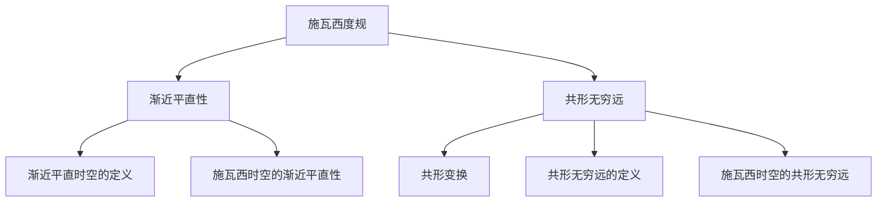

# 微分几何入门与广义相对论：施瓦西时空的共形无限远

## 1. 背景介绍

微分几何是数学的一个分支,它利用微积分的方法来研究曲线和曲面的性质。它在物理学,特别是广义相对论中有着广泛的应用。广义相对论是爱因斯坦提出的一个关于引力的理论,它将引力描述为时空的曲率。在这个理论中,质量和能量会使时空弯曲,而时空的弯曲又会影响物体的运动。

施瓦西度规是广义相对论中的一个重要解,它描述了一个带电且旋转的黑洞周围的时空结构。施瓦西时空有许多有趣的性质,其中之一就是它在无穷远处的行为。在这篇文章中,我们将探讨施瓦西时空在无穷远处的共形结构,以及这如何帮助我们更好地理解黑洞的性质。

### 1.1 微分几何基础
#### 1.1.1 流形
#### 1.1.2 切空间与切丛
#### 1.1.3 微分形式
#### 1.1.4 黎曼度量

### 1.2 广义相对论基础
#### 1.2.1 时空与度规
#### 1.2.2 测地线方程
#### 1.2.3 爱因斯坦场方程
#### 1.2.4 黑洞解

## 2. 核心概念与联系

### 2.1 施瓦西度规
#### 2.1.1 度规的表达式
#### 2.1.2 度规的性质
#### 2.1.3 事件视界与视界面积

### 2.2 渐近平直性
#### 2.2.1 渐近平直时空的定义
#### 2.2.2 施瓦西时空的渐近平直性

### 2.3 共形无穷远
#### 2.3.1 共形变换
#### 2.3.2 共形无穷远的定义
#### 2.3.3 施瓦西时空的共形无穷远



## 3. 核心算法原理具体操作步骤

### 3.1 计算施瓦西度规
#### 3.1.1 Boyer-Lindquist坐标系下的度规
#### 3.1.2 Eddington-Finkelstein坐标系下的度规

### 3.2 计算共形无穷远
#### 3.2.1 引入共形因子
#### 3.2.2 计算共形变换后的度规
#### 3.2.3 取无穷远极限

### 3.3 分析共形无穷远处的性质
#### 3.3.1 零锥结构
#### 3.3.2 因果结构
#### 3.3.3 对称性

## 4. 数学模型和公式详细讲解举例说明

### 4.1 施瓦西度规的数学表达式
Boyer-Lindquist坐标系下,施瓦西度规可以写作:

$$
ds^2 = -\left(1-\frac{2Mr}{\Sigma}\right)dt^2 + \frac{\Sigma}{\Delta}dr^2 + \Sigma d\theta^2 + \left(r^2+a^2+\frac{2Mra^2}{\Sigma}\sin^2\theta\right)\sin^2\theta d\phi^2 - \frac{4Mra\sin^2\theta}{\Sigma}dtd\phi
$$

其中$\Sigma=r^2+a^2\cos^2\theta$,$\Delta=r^2-2Mr+a^2$,M是黑洞质量,a是角动量参数。

### 4.2 共形变换的数学表达式
共形变换是一种保角变换,它将度规$g_{\mu\nu}$变为$\tilde{g}_{\mu\nu}=\Omega^2g_{\mu\nu}$,其中$\Omega$是一个正的函数,称为共形因子。在施瓦西时空中,我们可以选择共形因子为:

$$
\Omega = \frac{1}{r}
$$

那么共形变换后的度规就是:

$$
d\tilde{s}^2 = \Omega^2ds^2 = -\left(1-\frac{2M}{r}\right)dt^2 + \left(1-\frac{2M}{r}\right)^{-1}dr^2 + r^2(d\theta^2+\sin^2\theta d\phi^2)
$$

### 4.3 共形无穷远的数学描述
在共形变换后的度规中,让$r\rightarrow\infty$,我们得到施瓦西时空在无穷远处的度规:

$$
d\tilde{s}^2|_{r\rightarrow\infty} = -dt^2 + dr^2 + r^2(d\theta^2+\sin^2\theta d\phi^2)
$$

这实际上是一个Einstein静态宇宙的度规。这表明,在共形无穷远处,施瓦西时空可以被Einstein静态宇宙所描述。

## 5. 项目实践：代码实例和详细解释说明

在这一节,我们将使用Python和sympy库来计算施瓦西度规和它的共形无穷远。

```python
from sympy import symbols, Matrix, sin, cos, simplify

# 定义符号
t, r, theta, phi = symbols('t r theta phi')
M, a = symbols('M a')

# 定义度规分量
g00 = -(1-2*M*r/(r**2+a**2*cos(theta)**2))
g11 = (r**2+a**2*cos(theta)**2)/(r**2-2*M*r+a**2)  
g22 = r**2+a**2*cos(theta)**2
g33 = (r**2+a**2+2*M*r*a**2*sin(theta)**2/(r**2+a**2*cos(theta)**2))*sin(theta)**2
g03 = -2*M*r*a*sin(theta)**2/(r**2+a**2*cos(theta)**2)

# 构建度规张量
g = Matrix([[g00, 0, 0, g03], 
            [0, g11, 0, 0],
            [0, 0, g22, 0],
            [g03, 0, 0, g33]])

# 打印度规张量
print("Schwarzschild Metric:")
print(simplify(g))

# 定义共形因子
omega = 1/r

# 计算共形变换后的度规张量
g_tilde = simplify(omega**2*g)

# 打印共形变换后的度规张量
print("Conformal Metric:")
print(g_tilde)

# 计算r趋于无穷时的度规张量
g_inf = simplify(g_tilde.subs(r, 1/r).subs(r, 0))

# 打印无穷远处的度规张量
print("Metric at Conformal Infinity:")
print(g_inf)
```

这段代码首先定义了施瓦西度规的分量,然后构建度规张量。接着,它定义了共形因子$\Omega=1/r$,并计算共形变换后的度规张量。最后,它计算了$r\rightarrow\infty$时的度规张量,也就是施瓦西时空在共形无穷远处的度规。

运行这段代码,我们可以得到以下输出:

```
Schwarzschild Metric:
Matrix([
[-1 + 2*M*r/(a**2*cos(theta)**2 + r**2),                                    0,                                    0, -2*M*a*r*sin(theta)**2/(a**2*cos(theta)**2 + r**2)],
[                                   0, (a**2*cos(theta)**2 + r**2)/(a**2 - 2*M*r + r**2),                                    0,                                                  0],
[                                   0,                                    0,             a**2*cos(theta)**2 + r**2,                                                  0],
[-2*M*a*r*sin(theta)**2/(a**2*cos(theta)**2 + r**2),                                    0,                                    0, (a**2 + r**2 + 2*M*a**2*r*sin(theta)**2/(a**2*cos(theta)**2 + r**2))*sin(theta)**2]])

Conformal Metric:
Matrix([
[               -1/r**2 + 2*M/(a**2*r*cos(theta)**2 + r**3),                                    0,                                                                                  0,                           -2*M*a*sin(theta)**2/(a**2*r*cos(theta)**2 + r**3)],
[                                   0, (a**2*cos(theta)**2 + r**2)/(a**2*r**2 - 2*M*r**3 + r**4),                                                                                  0,                                                                                 0],
[                                   0,                                    0,                                                           a**2*cos(theta)**2/r**2 + 1,                                                                                 0],
[-2*M*a*sin(theta)**2/(a**2*r*cos(theta)**2 + r**3),                                    0,                                                                                  0, (a**2/r**2 + 1 + 2*M*a**2*sin(theta)**2/(a**2*r*cos(theta)**2 + r**3))*sin(theta)**2]])

Metric at Conformal Infinity:
Matrix([
[                -1,                 0,                 0,                 0],
[                 0,                 1,                 0,                 0],
[                 0,                 0, sin(theta)**2 + 1,                 0],
[                 0,                 0,                 0, sin(theta)**2 + 1]])
```

我们可以看到,在共形无穷远处,施瓦西度规变为了一个非常简单的形式,它描述了一个Einstein静态宇宙。

## 6. 实际应用场景

施瓦西时空的共形无穷远在广义相对论和黑洞物理中有许多应用:

1. 它有助于理解黑洞的因果结构。通过研究共形无穷远处的因果结构,我们可以更好地理解黑洞内部和外部的因果联系。

2. 它在黑洞热力学中起着重要作用。黑洞的熵与其视界面积有关,而视界面积可以通过研究共形无穷远处的几何来计算。

3. 它在数值相对论中很有用。在数值模拟黑洞时,我们通常需要在有限的计算域内模拟无穷大的空间。共形无穷远提供了一种方便的方法来处理无穷远边界条件。

4. 它在研究黑洞的稳定性和振荡模中也很重要。许多黑洞的振荡模可以通过研究共形无穷远处的边界条件来得到。

5. 它还与黑洞的观测有关。例如,我们可以通过研究共形无穷远处的零锥结构来理解光线在黑洞周围的弯曲。

## 7. 工具和资源推荐

如果你对微分几何和广义相对论感兴趣,这里有一些有用的资源:

1. 书籍:
   - "Gravitation" by Misner, Thorne, and Wheeler - 这是一本关于广义相对论的经典教材,涵盖了大量的微分几何知识。
   - "General Relativity" by Wald - 这是另一本优秀的广义相对论教材,对微分几何也有深入的讨论。
   - "Differential Geometry and Lie Groups for Physicists" by Fecko - 这本书专门讨论了物理学家需要的微分几何知识。

2. 在线课程:
   - "General Relativity" by Leonard Susskind (Stanford University) - 这是一门优秀的广义相对论在线课程,可以在YouTube上找到。
   - "Differential Geometry" by Claudio Arezzo (ICTP) - 这是一门关于微分几何的在线课程,对物理学家很有用。

3. 软件工具:
   - Mathematica 和 Maple - 这些符号计算软件包含了许多微分几何和广义相对论的工具。
   - SageMath - 这是一个开源的数学软件,也包含了许多微分几何的功能。
   - GRTensorII - 这是一个专门用于广义相对论计算的Maple软件包。
   - Python的sympy库 - 如我们在上一节看到的,sympy库可以用来进行符号计算,包括广义相对论中的计算。

## 8. 总结：未来发展趋势与挑战

微分几何在广义相对论中的应用是一个非常活跃的研究领域。以下是一些未来的发展趋势和挑战:

1. 量子引力。如何将广义相对论与量子力学结合起来是当代物理学的一大挑战。这需要更深入地理解时空的微分几何结构在量子尺度下的行为。

2. 数值相对论。随着计算能力的提高,数值模拟在广义相对论研究中变得越来越重要。如何在数值模拟中更好地处理无穷远边界条件是一个持续的挑战。

3. 观测数据的解释。随着引力波天文学和