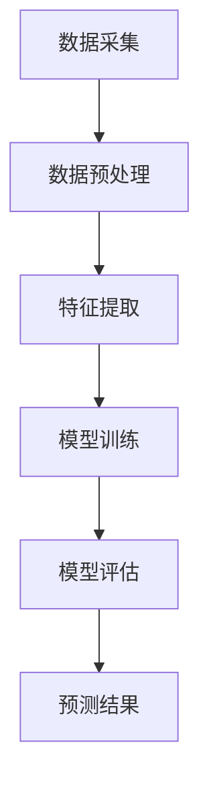
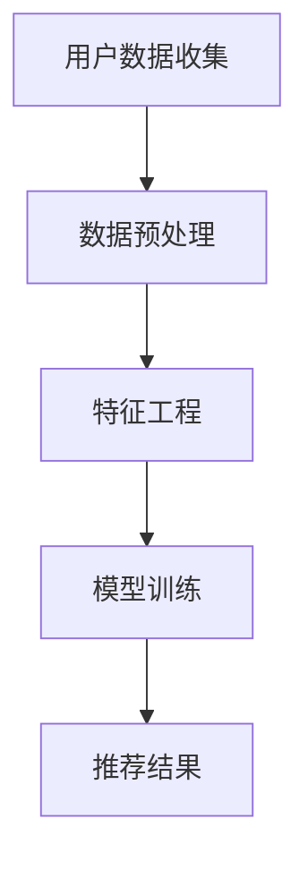
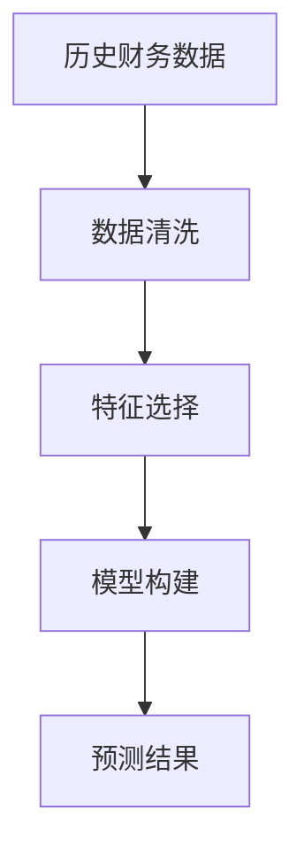
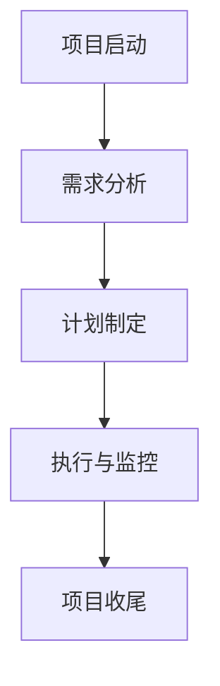

# 智能制造，数字化营销，业财一体化，核心业务流程变革（IPD LTC等）

## 1.背景介绍

在当今快速发展的科技时代，企业面临着前所未有的挑战和机遇。智能制造、数字化营销、业财一体化以及核心业务流程变革（如IPD和LTC）成为了企业提升竞争力和实现可持续发展的关键因素。本文将深入探讨这些概念及其相互联系，提供详细的算法原理、数学模型、项目实践、实际应用场景、工具和资源推荐，并展望未来的发展趋势与挑战。

## 2.核心概念与联系

### 2.1 智能制造

智能制造是指通过集成先进的信息技术和制造技术，实现生产过程的智能化、自动化和高效化。其核心包括物联网（IoT）、大数据分析、人工智能（AI）和云计算等技术。

### 2.2 数字化营销

数字化营销是利用数字技术和互联网平台进行市场推广和客户关系管理的过程。其核心技术包括搜索引擎优化（SEO）、社交媒体营销、内容营销和数据分析等。

### 2.3 业财一体化

业财一体化是指将企业的业务流程和财务管理紧密结合，实现信息的实时共享和协同工作。其核心在于通过信息系统的集成，打破业务和财务之间的壁垒，提高企业的运营效率和决策能力。

### 2.4 核心业务流程变革（IPD和LTC）

IPD（Integrated Product Development）和LTC（Lead to Cash）是两种典型的业务流程变革方法。IPD强调产品开发过程的集成和协同，而LTC则关注从潜在客户到现金回收的全过程管理。

### 2.5 概念之间的联系

这些概念之间存在紧密的联系。智能制造依赖于数字化技术的支持，而数字化营销和业财一体化则需要智能制造提供的数据和技术基础。核心业务流程变革（如IPD和LTC）则是实现这些目标的具体方法和手段。

## 3.核心算法原理具体操作步骤

### 3.1 智能制造中的算法

智能制造中的核心算法包括预测性维护、生产调度优化和质量控制等。以下是一个简单的预测性维护算法示例：



### 3.2 数字化营销中的算法

数字化营销中的核心算法包括推荐系统、用户行为分析和广告投放优化等。以下是一个推荐系统的基本流程：



### 3.3 业财一体化中的算法

业财一体化中的核心算法包括财务预测、成本控制和预算管理等。以下是一个财务预测的基本流程：



### 3.4 IPD和LTC中的算法

IPD和LTC中的核心算法包括项目管理、流程优化和绩效评估等。以下是一个项目管理的基本流程：



## 4.数学模型和公式详细讲解举例说明

### 4.1 智能制造中的数学模型

智能制造中的数学模型主要包括预测模型和优化模型。以下是一个简单的线性回归预测模型：

$$
y = \beta_0 + \beta_1 x_1 + \beta_2 x_2 + \cdots + \beta_n x_n + \epsilon
$$

其中，$y$ 是预测值，$x_1, x_2, \ldots, x_n$ 是特征变量，$\beta_0, \beta_1, \ldots, \beta_n$ 是模型参数，$\epsilon$ 是误差项。

### 4.2 数字化营销中的数学模型

数字化营销中的数学模型主要包括推荐系统模型和用户行为分析模型。以下是一个协同过滤推荐系统的基本公式：

$$
\hat{r}_{ui} = \mu + b_u + b_i + q_i^T p_u
$$

其中，$\hat{r}_{ui}$ 是用户 $u$ 对物品 $i$ 的预测评分，$\mu$ 是全局平均评分，$b_u$ 和 $b_i$ 分别是用户和物品的偏差，$q_i$ 和 $p_u$ 分别是物品和用户的特征向量。

### 4.3 业财一体化中的数学模型

业财一体化中的数学模型主要包括财务预测模型和成本控制模型。以下是一个时间序列预测模型（ARIMA）的基本公式：

$$
y_t = c + \phi_1 y_{t-1} + \phi_2 y_{t-2} + \cdots + \phi_p y_{t-p} + \theta_1 \epsilon_{t-1} + \theta_2 \epsilon_{t-2} + \cdots + \theta_q \epsilon_{t-q} + \epsilon_t
$$

其中，$y_t$ 是时间 $t$ 的预测值，$c$ 是常数项，$\phi_1, \phi_2, \ldots, \phi_p$ 是自回归系数，$\theta_1, \theta_2, \ldots, \theta_q$ 是移动平均系数，$\epsilon_t$ 是误差项。

### 4.4 IPD和LTC中的数学模型

IPD和LTC中的数学模型主要包括项目管理模型和流程优化模型。以下是一个关键路径法（CPM）的基本公式：

$$
E_i = \max(E_j + d_{ij})
$$

其中，$E_i$ 是活动 $i$ 的最早开始时间，$E_j$ 是活动 $j$ 的最早开始时间，$d_{ij}$ 是活动 $i$ 和 $j$ 之间的持续时间。

## 5.项目实践：代码实例和详细解释说明

### 5.1 智能制造项目实践

以下是一个简单的预测性维护代码示例，使用Python和scikit-learn库：

```python
import pandas as pd
from sklearn.model_selection import train_test_split
from sklearn.ensemble import RandomForestRegressor
from sklearn.metrics import mean_squared_error

# 数据加载
data = pd.read_csv('maintenance_data.csv')

# 特征和标签
X = data.drop('failure', axis=1)
y = data['failure']

# 数据分割
X_train, X_test, y_train, y_test = train_test_split(X, y, test_size=0.2, random_state=42)

# 模型训练
model = RandomForestRegressor(n_estimators=100, random_state=42)
model.fit(X_train, y_train)

# 模型预测
y_pred = model.predict(X_test)

# 评估模型
mse = mean_squared_error(y_test, y_pred)
print(f'Mean Squared Error: {mse}')
```

### 5.2 数字化营销项目实践

以下是一个简单的推荐系统代码示例，使用Python和Surprise库：

```python
from surprise import Dataset, Reader, SVD
from surprise.model_selection import cross_validate

# 数据加载
data = Dataset.load_builtin('ml-100k')

# 模型训练
algo = SVD()
cross_validate(algo, data, measures=['RMSE', 'MAE'], cv=5, verbose=True)
```

### 5.3 业财一体化项目实践

以下是一个简单的财务预测代码示例，使用Python和statsmodels库：

```python
import pandas as pd
import statsmodels.api as sm

# 数据加载
data = pd.read_csv('financial_data.csv', index_col='date', parse_dates=True)

# 模型训练
model = sm.tsa.ARIMA(data['revenue'], order=(1, 1, 1))
results = model.fit()

# 模型预测
forecast = results.forecast(steps=12)
print(forecast)
```

### 5.4 IPD和LTC项目实践

以下是一个简单的项目管理代码示例，使用Python和networkx库：

```python
import networkx as nx

# 创建有向图
G = nx.DiGraph()

# 添加节点和边
G.add_edge('Start', 'A', duration=2)
G.add_edge('A', 'B', duration=4)
G.add_edge('A', 'C', duration=3)
G.add_edge('B', 'End', duration=2)
G.add_edge('C', 'End', duration=1)

# 计算关键路径
length, path = nx.single_source_dijkstra(G, 'Start', 'End', weight='duration')
print(f'Critical Path: {path}, Duration: {length}')
```

## 6.实际应用场景

### 6.1 智能制造的应用场景

智能制造在多个行业中得到了广泛应用，包括汽车制造、电子产品生产和医疗设备制造等。例如，汽车制造商可以通过预测性维护算法提前发现设备故障，减少停机时间，提高生产效率。

### 6.2 数字化营销的应用场景

数字化营销在电商、金融和旅游等行业中得到了广泛应用。例如，电商平台可以通过推荐系统为用户推荐个性化的商品，提高用户满意度和销售额。

### 6.3 业财一体化的应用场景

业财一体化在制造业、零售业和服务业中得到了广泛应用。例如，制造企业可以通过业财一体化系统实现生产计划和财务预算的实时协同，提高资源利用效率和财务透明度。

### 6.4 IPD和LTC的应用场景

IPD和LTC在高科技、医药和工程建设等行业中得到了广泛应用。例如，高科技企业可以通过IPD方法实现产品开发过程的集成和协同，提高产品创新能力和市场响应速度。

## 7.工具和资源推荐

### 7.1 智能制造工具和资源

- **工具**：Python、scikit-learn、TensorFlow、Keras
- **资源**：IEEE Xplore、arXiv、Google Scholar

### 7.2 数字化营销工具和资源

- **工具**：Google Analytics、HubSpot、SEMrush、Surprise
- **资源**：Moz Blog、Neil Patel Blog、HubSpot Academy

### 7.3 业财一体化工具和资源

- **工具**：SAP ERP、Oracle ERP、Microsoft Dynamics 365
- **资源**：CFO.com、Harvard Business Review、Gartner

### 7.4 IPD和LTC工具和资源

- **工具**：Microsoft Project、JIRA、Asana、networkx
- **资源**：Project Management Institute、Scrum Alliance、Lean Enterprise Institute

## 8.总结：未来发展趋势与挑战

### 8.1 智能制造的未来发展趋势与挑战

智能制造的未来发展趋势包括更高程度的自动化、智能化和个性化生产。然而，数据安全和隐私保护、技术标准化和人才短缺等问题仍然是智能制造面临的主要挑战。

### 8.2 数字化营销的未来发展趋势与挑战

数字化营销的未来发展趋势包括更精准的用户画像、更智能的广告投放和更个性化的用户体验。然而，数据隐私保护、广告欺诈和技术更新等问题仍然是数字化营销面临的主要挑战。

### 8.3 业财一体化的未来发展趋势与挑战

业财一体化的未来发展趋势包括更高程度的信息集成、更实时的数据分析和更智能的决策支持。然而，系统复杂性、数据质量和组织变革等问题仍然是业财一体化面临的主要挑战。

### 8.4 IPD和LTC的未来发展趋势与挑战

IPD和LTC的未来发展趋势包括更高程度的流程集成、更灵活的项目管理和更高效的资源配置。然而，流程复杂性、跨部门协同和变革管理等问题仍然是IPD和LTC面临的主要挑战。

## 9.附录：常见问题与解答

### 9.1 智能制造常见问题

**问题**：如何选择合适的预测性维护算法？
**解答**：选择合适的预测性维护算法需要考虑数据的特征、算法的复杂度和计算资源等因素。常用的算法包括随机森林、支持向量机和神经网络等。

### 9.2 数字化营销常见问题

**问题**：如何提高推荐系统的准确性？
**解答**：提高推荐系统的准确性可以通过优化特征工程、选择合适的模型和参数调优等方法实现。此外，结合用户反馈和行为数据进行模型更新也是提高准确性的重要手段。

### 9.3 业财一体化常见问题

**问题**：如何实现业务和财务数据的实时集成？
**解答**：实现业务和财务数据的实时集成需要采用先进的信息系统和数据集成技术，如ETL（Extract, Transform, Load）工具、API接口和数据中台等。

### 9.4 IPD和LTC常见问题

**问题**：如何有效管理跨部门的项目团队？
**解答**：有效管理跨部门的项目团队需要建立清晰的沟通机制、明确的职责分工和有效的激励机制。此外，采用敏捷开发方法和项目管理工具也有助于提高团队协作效率。

---

作者：禅与计算机程序设计艺术 / Zen and the Art of Computer Programming