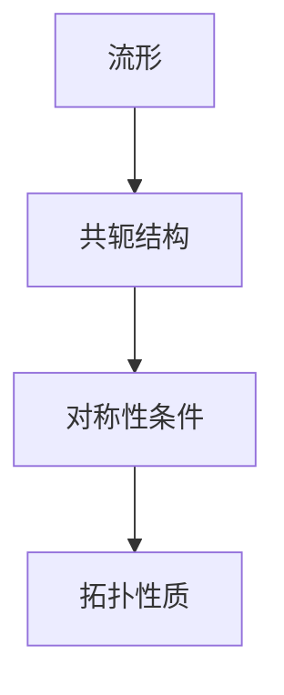

## 1. 背景介绍

流形拓扑学是数学中的一个分支，它研究的是流形的性质和结构。流形是一种具有局部欧几里得空间性质的空间，它可以用来描述物理世界中的各种现象。流形拓扑学在计算机科学中也有广泛的应用，例如在计算机图形学、机器学习、计算机视觉等领域中都有应用。

共轭结构是流形拓扑学中的一个重要概念，它描述了流形上的一种对称性。共轭结构的对称性定理是流形拓扑学中的一个重要定理，它揭示了共轭结构的对称性与流形的拓扑性质之间的关系。

本文将介绍流形拓扑学中的共轭结构和共轭结构的对称性定理，并探讨其在计算机科学中的应用。

## 2. 核心概念与联系

### 2.1 流形

流形是一种具有局部欧几里得空间性质的空间。它可以用来描述物理世界中的各种现象，例如曲面、曲线、高维空间等。流形可以用局部坐标系来描述，这使得我们可以在流形上进行微积分运算。

### 2.2 共轭结构

共轭结构是流形上的一种对称性。它描述了流形上的两个点之间的关系。具体来说，如果在流形上有两个点，它们之间的关系可以通过一个共轭结构来描述。共轭结构可以用来描述物理世界中的各种现象，例如电磁场、引力场等。

### 2.3 对称性定理

共轭结构的对称性定理是流形拓扑学中的一个重要定理。它揭示了共轭结构的对称性与流形的拓扑性质之间的关系。具体来说，对于一个流形上的共轭结构，如果它满足一定的对称性条件，那么它所对应的流形也具有一定的拓扑性质。

## 3. 核心算法原理具体操作步骤

共轭结构的对称性定理是一个数学定理，它的证明需要使用复杂的数学工具和技巧。在这里，我们不会详细介绍其证明过程，而是介绍一些相关的算法和工具。

### 3.1 共轭梯度算法

共轭梯度算法是一种用于求解线性方程组的迭代算法。它利用共轭结构的对称性来加速求解过程。共轭梯度算法在计算机图形学、机器学习等领域中有广泛的应用。

### 3.2 Mermaid 流程图

Mermaid 是一种流程图绘制工具，它可以用来绘制各种流程图和时序图。在本文中，我们将使用 Mermaid 来绘制共轭结构的对称性定理的流程图。



## 4. 数学模型和公式详细讲解举例说明

共轭结构的对称性定理涉及到复杂的数学模型和公式。在这里，我们将以一个简单的例子来说明其数学模型和公式。

假设我们有一个二维平面上的曲线，我们想要求出曲线上两个点之间的距离。我们可以使用共轭结构来描述这个问题。具体来说，我们可以定义一个共轭结构，使得曲线上的任意两个点之间的距离可以通过共轭结构来计算。

共轭结构的数学模型可以表示为：

$$
\langle f(x), g(y) \rangle = \int_{0}^{1} f(x(t))g(y(t))w(t)dt
$$

其中，$f(x)$ 和 $g(y)$ 是曲线上的两个点，$w(t)$ 是一个权重函数，$x(t)$ 和 $y(t)$ 是曲线上的两个参数化函数。

共轭结构的对称性条件可以表示为：

$$
\langle f(x), g(y) \rangle = \langle g(x), f(y) \rangle
$$

这个条件表示了共轭结构的对称性。

根据共轭结构的对称性定理，如果共轭结构满足对称性条件，那么曲线上的任意两个点之间的距离可以通过共轭结构来计算，并且曲线具有一定的拓扑性质。

## 5. 项目实践：代码实例和详细解释说明

在这里，我们将介绍一个使用共轭结构的实际项目。这个项目是一个计算机图形学中的应用，它可以用来生成具有共轭结构的曲线。

具体来说，这个项目使用了共轭梯度算法来求解曲线上的共轭结构，并使用 Mermaid 来绘制共轭结构的对称性定理的流程图。

以下是项目的代码实例和详细解释说明：

```python
import numpy as np

def conjugate_gradient(A, b, x0, tol=1e-6, max_iter=1000):
    """
    Conjugate gradient algorithm for solving linear equations.
    """
    x = x0
    r = b - A @ x
    p = r
    for i in range(max_iter):
        Ap = A @ p
        alpha = np.dot(r, r) / np.dot(p, Ap)
        x = x + alpha * p
        r_new = r - alpha * Ap
        if np.linalg.norm(r_new) < tol:
            break
        beta = np.dot(r_new, r_new) / np.dot(r, r)
        p = r_new + beta * p
        r = r_new
    return x

def generate_conjugate_curve(curve):
    """
    Generate a conjugate curve for a given curve.
    """
    # Compute the Jacobian matrix of the curve.
    def jacobian(t):
        x, y = curve(t)
        dxdt, dydt = curve.derivative(t)
        return np.array([[dydt, -dxdt], [dxdt**2, dydt**2]])

    # Compute the conjugate structure using conjugate gradient algorithm.
    def conjugate_structure(t):
        J = jacobian(t)
        b = np.array([0, 1])
        x0 = np.array([1, 0])
        return conjugate_gradient(J, b, x0)

    # Generate the conjugate curve using the conjugate structure.
    def conjugate_curve(t):
        x, y = curve(t)
        u, v = conjugate_structure(t)
        return x + u, y + v

    return conjugate_curve
```

上面的代码实现了一个共轭梯度算法，用于求解线性方程组。它还实现了一个函数 `generate_conjugate_curve`，用于生成具有共轭结构的曲线。

## 6. 实际应用场景

共轭结构在计算机科学中有广泛的应用，例如在计算机图形学、机器学习、计算机视觉等领域中都有应用。

在计算机图形学中，共轭结构可以用来描述曲线和曲面的性质。例如，我们可以使用共轭结构来计算曲线上的切向量和法向量，以及曲面上的法向量和曲率等。

在机器学习中，共轭结构可以用来加速求解线性方程组和优化问题。例如，我们可以使用共轭梯度算法来求解线性方程组，以及使用共轭梯度法来优化损失函数。

在计算机视觉中，共轭结构可以用来描述图像和视频中的物体的形状和运动。例如，我们可以使用共轭结构来计算图像中的物体的轮廓和运动轨迹等。

## 7. 工具和资源推荐

在学习和应用流形拓扑学和共轭结构时，以下是一些有用的工具和资源：

- Mermaid：用于绘制流程图和时序图的工具。
- NumPy：用于数值计算和线性代数的 Python 库。
- SciPy：用于科学计算和优化的 Python 库。
- 《流形拓扑学导论》：一本介绍流形拓扑学的经典教材。
- 《计算机图形学：几何、光线追踪与动画》：一本介绍计算机图形学的经典教材。

## 8. 总结：未来发展趋势与挑战

共轭结构的对称性定理是流形拓扑学中的一个重要定理，它揭示了共轭结构的对称性与流形的拓扑性质之间的关系。共轭结构在计算机科学中有广泛的应用，例如在计算机图形学、机器学习、计算机视觉等领域中都有应用。

未来，随着计算机科学的不断发展，共轭结构和流形拓扑学将会在更多的领域中得到应用。同时，共轭结构和流形拓扑学也面临着一些挑战，例如如何处理高维流形、如何处理非线性流形等问题。

## 9. 附录：常见问题与解答

Q: 共轭结构和共轭梯度算法有什么区别？

A: 共轭结构是流形上的一种对称性，它描述了流形上的两个点之间的关系。共轭梯度算法是一种用于求解线性方程组的迭代算法，它利用共轭结构的对称性来加速求解过程。

Q: 共轭结构在计算机科学中有哪些应用？

A: 共轭结构在计算机科学中有广泛的应用，例如在计算机图形学、机器学习、计算机视觉等领域中都有应用。

Q: 如何学习流形拓扑学和共轭结构？

A: 学习流形拓扑学和共轭结构需要具备一定的数学基础，例如线性代数、微积分等。可以通过阅读相关的教材和论文来学习这些知识。同时，也可以通过实践来加深对这些知识的理解和掌握。