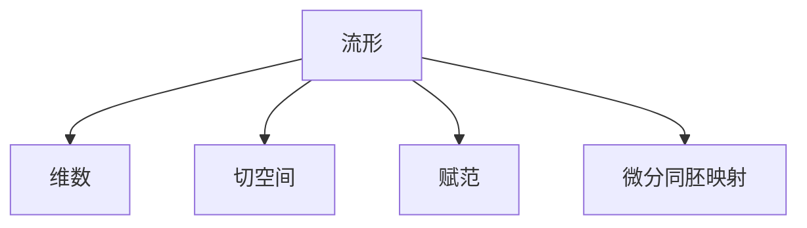
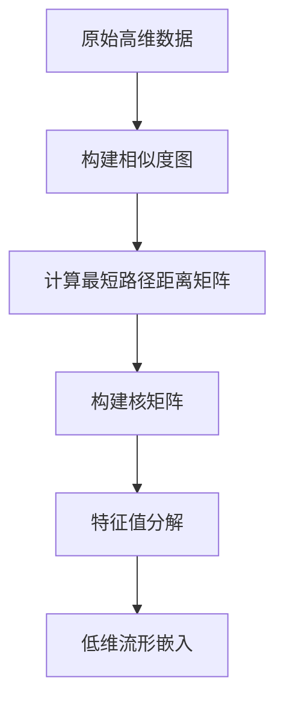
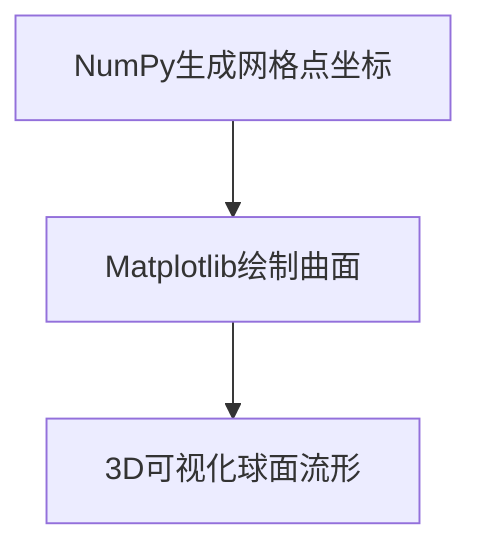

# 流形拓扑学理论与概念的实质：基本概念与框架

## 1.背景介绍

拓扑学是一门研究空间几何性质的数学分支,尤其关注形状和空间在经过连续变形后保持不变的性质。流形(manifold)是拓扑学中的一个核心概念,描述了可以局部等同于欧几里得空间的拓扑空间。流形拓扑学是现代数学的重要组成部分,在物理学、计算机科学等领域也有广泛应用。

### 1.1 拓扑学的重要性

拓扑学为我们研究空间结构提供了强有力的工具,在数学、物理学、计算机科学等领域发挥着重要作用:

- 微分几何:流形是研究微分几何的基础
- 代数拓扑:拓扑不变量是代数拓扑的核心研究对象
- 理论物理:拓扑学概念在量子场论、弦论等前沿领域有重要应用
- 计算机图形学:拓扑数据分析、网格处理等领域与流形理论密切相关

### 1.2 流形的本质

流形的本质思想是将局部结构等同于欧几里得空间,而全局结构可能与欧几里得空间存在显著差异。一个流形在局部上看起来像一个欧几里得空间,但在全局上可能扭曲、环绕等。

## 2.核心概念与联系

### 2.1 流形的形式化定义

形式上,一个流形$M$是一个拓扑空间,对于每个点$p\in M$,都存在一个开集$U$,使得$U$与$\mathbb{R}^n$同胚,即存在一个双射$\phi:U\rightarrow\mathbb{R}^n$。这种同胚映射$\phi$被称为卡坐标映射或卡坐标系。

简单来说,流形就是在局部上等同于欧几里得空间,但在全局上可能存在复杂的拓扑结构。

### 2.2 流形的基本概念

- 维数(dimension):流形的维数指的是局部等同于$\mathbb{R}^n$的n的值。
- 切空间(tangent space):在流形的每个点p处,都可以定义切空间$T_pM$,描述了通过p点的所有可能的切向量。
- 赋范(metric):在流形上引入内积,定义了长度和角度的概念,形成了黎曼流形。
- 微分同胚映射:在流形上定义了导数和积分的概念。



### 2.3 流形与其他数学概念的联系

- 微分几何:流形是研究微分几何的基础对象
- 代数拓扑:流形上的同伦群、特征类等是代数拓扑的研究对象
- 李群与李代数:李群是一种特殊的流形群,与流形理论密切相关
- 射影几何:射影空间也是一种流形
- 代数几何:代数曲线、代数曲面都可以视为流形

## 3.核心算法原理具体操作步骤  

虽然流形是一个几何概念,但在计算机科学中也有一些相关的算法和数据结构。这里我们介绍一种常见的流形学习算法:等度量映射(Isomap)算法。

Isomap算法的核心思想是将高维数据集嵌入到一个低维流形中,保留数据之间的几何距离关系。算法步骤如下:

1. 构建相似度图(neighborhood graph):对于数据集$X=\{x_1,x_2,...,x_n\}$,计算每个数据点之间的欧氏距离,连接距离小于某个阈值$\epsilon$的点对。

2. 计算最短路径距离矩阵:在相似度图上,计算任意两点之间的最短路径距离,得到距离矩阵$D$。

3. 构建核心核(kernel):对距离矩阵$D$应用某个核函数(如高斯核)得到核矩阵$K$。

4. 特征值分解:对核矩阵$K$进行特征值分解,取前$d$个最大的特征值对应的特征向量作为低维嵌入。



Isomap算法的优点是能够很好地保留数据的几何结构,缺点是计算复杂度较高,对噪声和稀疏数据敏感。该算法在数据可视化、模式识别等领域有广泛应用。

## 4.数学模型和公式详细讲解举例说明

### 4.1 流形上的切空间和切丛

对于一个$n$维流形$M$,在每个点$p\in M$处,我们可以定义切空间(tangent space) $T_pM$,描述了通过$p$点的所有可能的切向量。

切向量可以形式化地定义为:对于流形$M$上的曲线$\gamma:I\rightarrow M$,其切向量为:

$$
\gamma'(t)=\lim\limits_{h\rightarrow 0}\frac{\gamma(t+h)-\gamma(t)}{h}
$$

切空间$T_pM$是所有这样的切向量张成的向量空间。

所有切空间$T_pM$组成了切丛(tangent bundle) $TM$:

$$
TM=\bigsqcup\limits_{p\in M}T_pM
$$

切丛是一个$2n$维流形,对于每个$(p,v)\in TM$,都可以定义一个卡坐标映射。

### 4.2 黎曼流形

如果在流形$M$上赋予一个内积,那么就可以定义长度和角度的概念,从而得到一个黎曼流形(Riemannian manifold)。

内积可以用一个对称双线性张量场$g$来表示,称为黎曼度量张量。对于$p\in M$和$u,v\in T_pM$,内积定义为:

$$
g_p(u,v)=\sum\limits_{i,j}g_{ij}(p)u^iv^j
$$

其中$g_{ij}(p)$是度量张量在$p$点的分量。

给定黎曼度量张量$g$,就可以定义曲线的长度:

$$
L(\gamma)=\int\limits_a^b\sqrt{g_{\gamma(t)}(\gamma'(t),\gamma'(t))}dt
$$

以及测地线(最短路径)等概念。

### 4.3 例子:2维球面

考虑单位2维球面$S^2=\{(x,y,z)\in\mathbb{R}^3|x^2+y^2+z^2=1\}$,它是一个2维流形,嵌入在$\mathbb{R}^3$中。

在$(x,y,z)\in S^2$处,切空间$T_{(x,y,z)}S^2$是由所有满足$x\xi+y\eta+z\zeta=0$的向量$(\xi,\eta,\zeta)$张成的2维子空间。

赋予球面标准的黎曼度量张量:

$$
g=dx^2+dy^2+dz^2
$$

那么对于任意切向量$u,v\in T_{(x,y,z)}S^2$,内积为:

$$
g_{(x,y,z)}(u,v)=u_1v_1+u_2v_2+u_3v_3
$$

其中$(u_1,u_2,u_3)$和$(v_1,v_2,v_3)$是$u$和$v$在$\mathbb{R}^3$中的分量。

## 5.项目实践：代码实例和详细解释说明

这里我们给出一个使用Python和Matplotlib可视化2维球面流形的代码示例:

```python
import numpy as np
import matplotlib.pyplot as plt
from mpl_toolkits.mplot3d import Axes3D

# 生成球面数据
u = np.linspace(0, 2 * np.pi, 100)
v = np.linspace(0, np.pi, 100)

x = np.outer(np.cos(u), np.sin(v))
y = np.outer(np.sin(u), np.sin(v))
z = np.outer(np.ones(np.size(u)), np.cos(v))

# 可视化
fig = plt.figure()
ax = fig.add_subplot(111, projection='3d')
ax.plot_surface(x, y, z, rstride=4, cstride=4, color='b')
plt.show()
```

代码解释:

1. 首先利用NumPy生成球面上的网格点$(x,y,z)$坐标。
2. 使用Matplotlib的`plot_surface`函数绘制球面。
3. `projection='3d'`指定使用3D投影。
4. `rstride`和`cstride`参数控制绘制的曲面细节程度。

运行上述代码,可以得到一个2维球面流形的可视化效果:



这个示例展示了如何使用Python可视化一个简单的2维流形。对于更复杂的高维流形,可以使用流形学习算法(如Isomap)将其嵌入到低维空间中进行可视化。

## 6.实际应用场景

流形理论在许多领域都有重要应用,例如:

### 6.1 计算机视觉和图像处理

- 活体检测:利用3D面部扫描数据构建人脸流形模型
- 手势识别:将手势视为一个低维流形嵌入到高维空间中
- 图像分割:利用流形学习算法对图像像素进行分组

### 6.2 自然语言处理

- 词向量:将单词嵌入到一个低维连续空间(词向量空间)
- 知识图谱:知识图谱可以视为一种特殊的流形结构
- 主题模型:将文档映射到一个概率分布形成的流形上

### 6.3 科学计算与数据分析

- 流形数据分析:将高维数据投影到低维流形进行分析
- 分子动力学模拟:构建蛋白质等分子结构的自由能流形
- 流体力学:利用流形方法研究湍流和紊流现象

### 6.4 机器人与控制理论

- 运动规划:在机器人的配置空间(构成一个流形)中寻找最优路径
- 非线性控制:利用控制流形对非线性系统进行控制
- 传感器网络:将传感器网络视为一个流形进行分析和优化

## 7.工具和资源推荐

### 7.1 编程库

- Python:
    - Scikit-learn提供了一些流形学习算法的实现
    - PyManopt库专注于优化算法在流形上的实现
- MATLAB:
    - Manopt库实现了一些流形优化算法
- C++:
    - Spectra库提供了一些谱方法在流形上的实现

### 7.2 在线课程

- 斯坦福大学公开课程:"Introduction to Differential Geometry"
- 麻省理工公开课程:"Geometric Concepts in Computing"
- 网络资源:
    - 维基百科的"流形"词条
    - "Manifold Learning"在Scholarpedia的词条

### 7.3 书籍

- "Elementary Introduction to the Lebesgue Integral"(Henstock)
- "Riemannian Geometry"(Gallot等)
- "Differential Topology"(Guillemin等)
- "Manifolds and Differential Geometry"(Lee)

## 8.总结：未来发展趋势与挑战

流形理论是一个活跃的研究领域,未来可能的发展趋势包括:

- 更高维度和更复杂拓扑结构的流形研究
- 结合机器学习,发展新的流形学习算法
- 在新兴领域(如量子计算、人工智能等)寻找新的应用
- 与其他数学分支(代数几何、代数拓扑等)的交叉研究

然而,流形理论也面临一些挑战:

- 高维流形可视化和理解的困难
- 复杂流形上的计算复杂度较高
- 理论与实际应用之间的鸿沟
- 缺乏统一的理论框架,分支较多

未来需要数学家、物理学家、计算机科学家等多学科的通力合作,才能推动流形理论的进一步发展。

## 9.附录：常见问题与解答

1. **什么是流形?**

    流形是一种在局部等同于欧几里得空间,但在全局可能存在复杂拓扑结构的空间。

2. **流