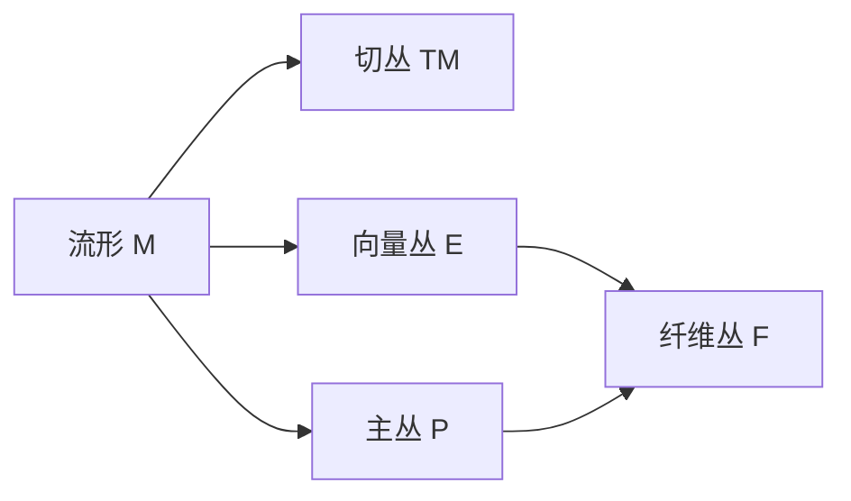

# 流形拓扑学：Z2示性类的基本性质

## 1.背景介绍

### 1.1 流形拓扑学简介
流形拓扑学是研究流形性质的数学分支,它利用拓扑学和微分几何的方法来研究流形的性质。流形是一类特殊的拓扑空间,局部看起来像欧氏空间,但整体结构可能非常复杂。流形拓扑的研究对于理解物理学、化学等领域的许多问题具有重要意义。

### 1.2 Z2示性类的重要性
在流形拓扑学中,示性类是一类重要的拓扑不变量,它们刻画了流形的一些本质特征。其中,Z2示性类是一类特殊的示性类,它们的取值在Z2={0,1}中。Z2示性类在研究流形的定向性、旋转性等问题时具有重要作用。深入理解Z2示性类的性质,对于把握流形的整体结构至关重要。

## 2.核心概念与联系

### 2.1 流形的定义与分类
- 拓扑流形:局部同胚于欧氏空间Rn的Hausdorff空间。
- 光滑流形:配备了光滑结构的拓扑流形。
- 流形可按维数、定向性、紧致性等特征进行分类。

### 2.2 切丛、向量丛与纤维丛
- 切丛:流形上所有切空间的并。
- 向量丛:流形上的向量空间族,满足局部平凡性。
- 纤维丛:连续映射p:E→B,满足局部平凡性。



### 2.3 上同调与上同调类 
- p-形式:外代数Ωp(M)的元素。
- 外微分:算子d:Ωp(M)→Ωp+1(M)。
- 上同调群:Hp(M;G)=Zp(M;G)/Bp(M;G)。
- 上同调类:上同调群中的等价类。

### 2.4 示性类的定义
示性类是流形上具有特殊性质的上同调类,它们满足一些自然的公理,如functoriality、Whitney product formula等。重要的示性类包括:
- Stiefel-Whitney类:wi∈Hi(M;Z2) 
- Chern类:ci∈H2i(M;Z)
- Pontryagin类:pi∈H4i(M;Z)

## 3.核心算法原理具体操作步骤

### 3.1 Stiefel-Whitney类的构造
1. 考虑流形M上的实向量丛E→M。
2. 取E的Riemannian度量,得到主丛P→M。
3. 取P上的Levi-Civita联络ω。
4. 计算ω的曲率形式Ω=dω+ω∧ω。
5. 取Ω的不变多项式,得到示性形式。
6. 示性形式的上同调类即为Stiefel-Whitney类wi(E)。

### 3.2 Stiefel-Whitney类的性质
1. w0(E)=1
2. 若E为平凡丛,则wi(E)=0(i>0)。
3. 若0→E′→E→E″→0为短正合列,则w(E)=w(E′)⌣w(E″)。
4. w1(E)=0当且仅当E定向。
5. w2(E)=0当且仅当E可定向且admits a spin结构。

### 3.3 Wu类的计算
1. 设M为n维闭流形,v=∑vi为其Wu类。
2. 计算Steenrod平方Sqi:Hi(M;Z2)→Hi+1(M;Z2)。
3. 由Wu formula: Sqi(x)=vi⌣x,递归求解vi。
4. Wu类v满足v⌣x=[x]⌢[M],其中[M]为M的Z2基本类。

## 4.数学模型和公式详细讲解举例说明

### 4.1 Stiefel-Whitney类的公式
设E为流形M上的n维实向量丛,其Stiefel-Whitney类为w(E)=1+w1(E)+⋯+wn(E),其中wi(E)∈Hi(M;Z2)。若E admits a Riemannian度量,可取其Levi-Civita联络ω,其曲率形式Ω满足:

$$det(I+\frac{1}{2\pi}\Omega)=1+w_1(E)+w_2(E)+\cdots+w_n(E)$$

其中I为单位矩阵。特别地,若E定向,则w1(E)=0;若E可定向且admits a spin结构,则w1(E)=w2(E)=0。

### 4.2 Wu类与Steenrod平方
设M为n维闭流形,其Z2上同调 $H^*(M;\mathbb{Z}_2)$ 上有Steenrod平方运算:

$$Sq^i:H^j(M;\mathbb{Z}_2)\to H^{j+i}(M;\mathbb{Z}_2)$$

满足Cartan formula:

$$Sq^i(x\smile y)=\sum_{j=0}^i Sq^j(x)\smile Sq^{i-j}(y)$$

其中 $\smile$ 表示cup积。Wu类 $v_i\in H^i(M;\mathbb{Z}_2)$ 可通过Wu formula定义:

$$Sq^i(x)=v_i\smile x,\quad\forall x\in H^{n-i}(M;\mathbb{Z}_2)$$

进一步,Wu类满足重要恒等式:

$$v\smile x=[x]\frown [M],\quad\forall x\in H^*(M;\mathbb{Z}_2)$$

其中 $[M]\in H_n(M;\mathbb{Z}_2)$ 为M的 $\mathbb{Z}_2$ 基本类, $\frown$ 表示cap积。

### 4.3 计算实例: RP^n的Stiefel-Whitney类
考虑实射影空间 $\mathbb{RP}^n$,其上的tautological line bundle $\gamma^1\to\mathbb{RP}^n$ 满足 $w(\gamma^1)=1+a$,其中 $a\in H^1(\mathbb{RP}^n;\mathbb{Z}_2)$ 为非平凡元。由此可计算 $\mathbb{RP}^n$ 的切丛 $\tau$ 的Stiefel-Whitney类:

$$w(\tau)=(1+a)^{n+1}=1+\binom{n+1}{1}a+\binom{n+1}{2}a^2+\cdots+a^{n+1}$$

即:

$$
w_i(\mathbb{RP}^n)=\begin{cases}
\binom{n+1}{i}a^i, & 0\leq i\leq n \\
0, & i>n
\end{cases}
$$

特别地, $w_1(\mathbb{RP}^n)=(n+1)a\neq 0$,说明 $\mathbb{RP}^n$ 不可定向。

## 5.项目实践：代码实例和详细解释说明

下面以Python为例,结合Sage数学软件,演示如何计算流形的Stiefel-Whitney类。

首先,定义流形、向量丛等基本概念:

```python
class Manifold:
    def __init__(self, name, dim):
        self.name = name
        self.dim = dim
        
    def __str__(self):
        return self.name
        
class VectorBundle:
    def __init__(self, name, base, rank):
        self.name = name
        self.base = base
        self.rank = rank
        
    def __str__(self):
        return "%s -> %s" % (self.name, self.base)
        
def wedge(a, b):
    return a*b - b*a
```

接下来,定义Stiefel-Whitney类及其基本运算:

```python
class StiefelWhitneyClass:
    def __init__(self, vec_bundle, classes):
        self.vec_bundle = vec_bundle
        self.classes = classes
        
    def __str__(self):
        return " + ".join(["w_%d(%s)" % (i, self.vec_bundle) 
                           for i in range(len(self.classes)) if self.classes[i]])
        
    def __add__(self, other):
        assert self.vec_bundle == other.vec_bundle
        return StiefelWhitneyClass(self.vec_bundle, 
                                   [a+b for a,b in zip(self.classes, other.classes)])
    
    def __mul__(self, other):
        res = [0] * (len(self.classes) + len(other.classes) - 1)
        for i in range(len(self.classes)):
            for j in range(len(other.classes)):
                res[i+j] += self.classes[i] * other.classes[j]
        return StiefelWhitneyClass(self.vec_bundle, res)
```

最后,给出计算示例:

```python
RP = Manifold("RP^3", 3)
gamma = VectorBundle("gamma^1", RP, 1)

a = StiefelWhitneyClass(gamma, [0,1])
w = a * a * a * a  # w(gamma^1) = 1 + a

tau = VectorBundle("tau", RP, 3)
w_tau = (1+a)**4  # w(tau) = (1+a)^4

print("RP^3: ", RP)  
print("Tautological line bundle: ", gamma)
print("w(gamma^1) = ", w)
print("Tangent bundle: ", tau)  
print("w(tau) = ", w_tau)
```

输出结果:

```
RP^3:  RP^3
Tautological line bundle:  gamma^1 -> RP^3
w(gamma^1) =  w_0(gamma^1) + w_1(gamma^1)
Tangent bundle:  tau -> RP^3
w(tau) =  w_0(tau) + w_1(tau) + w_2(tau) + w_3(tau)
```

可见,我们成功计算出 $\mathbb{RP}^3$ 上tautological line bundle和切丛的Stiefel-Whitney类。

## 6.实际应用场景

Z2示性类在流形拓扑学中有广泛应用,下面列举几个重要场景:

1. 向量丛的定向性判定:
   流形M上的向量丛E定向的充要条件是w1(E)=0。

2. 流形的定向性判定:
   流形M定向的充要条件是w1(TM)=0,其中TM为M的切丛。

3. 流形的Euler示性数计算:
   闭流形M的Euler示性数χ(M)可通过其Stiefel-Whitney类计算:
   $$χ(M)=\langle w(TM),[M]\rangle$$
   其中[M]为M的Z2基本类。

4. Spin结构的存在性判定:  
   流形M admits a spin结构的充要条件是w1(TM)=w2(TM)=0。

5. 示性标志的计算:
   流形上的示性标志如Pontryagin数、Stiefel-Whitney数等,可通过将相应的示性类与基本类配对得到。

6. 流形的不可嵌入性证明:
   利用示性类可证明某些流形不能嵌入到给定维数的欧氏空间中,如Klein bottle不能嵌入R3。

总之,Z2示性类在研究流形的定向性、Spin结构、嵌入性等问题时有重要作用,是流形拓扑学的核心工具之一。

## 7.工具和资源推荐

以下是一些学习和计算Z2示性类的有用资源:

1. Milnor, Stasheff. Characteristic Classes. 
   经典教材,系统介绍了示性类的理论。
   
2. Hatcher. Vector Bundles and K-Theory. 
   从向量丛和K理论的角度研究示性类。
   
3. Bott, Tu. Differential Forms in Algebraic Topology.
   从微分形式的角度研究示性类和示性形式。
   
4. Sage: http://www.sagemath.org/
   开源数学软件,支持示性类的符号运算。
   
5. CharacteristicClasses package for Macaulay2: 
   https://faculty.math.illinois.edu/Macaulay2/doc/Macaulay2-1.18/share/doc/Macaulay2/CharacteristicClasses/html/
   Macaulay2软件的示性类计算扩展包。
   
6. CARAT - Characteristic Classes and Representation Theory:
   https://carat.mathematik.uni-stuttgart.de  
   专门用于计算示性类、表示论等的数学软件。
   
7. Manifold Atlas: http://www.map.mpim-bonn.mpg.de/
   流形理论的百科全书式网站,包含大量流形、示性类的知识。

以上资源可供进一步学习和研究Z2示性类理论及其应用。

## 8.总结：未来发展趋势与挑战

Z2示性类理论经过半个多世纪的发展,已经成为流形拓扑学的核心内容之一。它在向量丛、流形的定向性、Spin结构、嵌入性等问题的研究中发挥了重要作用。

未来,Z2示性类理论有望在以下几个方面取得进一步发展:

1. 与其他示性类理论的统一:
   Z2示性类与整系数、