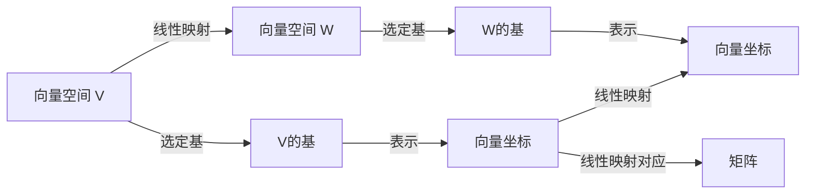

# 线性代数导引：线性映射

## 1.背景介绍
### 1.1 线性代数的重要性
线性代数是数学的一个重要分支,在科学、工程和计算机科学等诸多领域有着广泛的应用。作为一名计算机专业人士,深入理解线性代数的概念和方法对于解决实际问题、开发高效算法至关重要。
### 1.2 线性映射的核心地位
在线性代数中,线性映射(Linear Map)是一个核心概念。它刻画了向量空间之间的一类特殊函数,保持了向量加法和数量乘法运算,是研究向量空间结构、解决线性方程组、刻画线性变换的重要工具。本文将重点探讨线性映射的定义、性质及其应用。

## 2.核心概念与联系
### 2.1 向量空间
- 定义：向量空间是一个集合 $V$,其上定义了加法和数乘运算,满足8条公理。
- 性质：封闭性、结合律、交换律、单位元、逆元、数乘的结合律等。
- 例子：欧式空间 $\mathbb{R}^n$、函数空间 $C[a,b]$ 等。
### 2.2 线性映射
- 定义：设 $V,W$ 是数域 $\mathbb{F}$ 上的两个向量空间,映射 $T:V \to W$ 称为线性映射,如果它满足：
$$
\begin{aligned}
T(u+v) &= T(u)+T(v), \forall u,v \in V \\
T(ku) &= kT(u), \forall k \in \mathbb{F}, u \in V
\end{aligned}
$$
- 性质：保持加法和数乘运算、复合映射、恒等映射、零映射。
### 2.3 线性映射与矩阵
- 基与坐标：向量空间的一组基 $e_1,\cdots,e_n$,向量 $v$ 的坐标 $(v_1,\cdots,v_n)$。
- 线性映射的矩阵表示：选定域和余域的基,线性映射可用矩阵 $A$ 唯一表示。
$$
T(e_j) = \sum_{i=1}^m a_{ij}f_i, \quad A=(a_{ij})_{m \times n}
$$
- 线性变换：有限维向量空间到其自身的线性映射,可用方阵表示。



## 3.核心算法原理具体操作步骤
### 3.1 求线性映射的值
给定线性映射 $T$ 在基 $e_1,\cdots,e_n$ 下的表示矩阵 $A$,求 $T(v)$。
1. 将向量 $v$ 用基表示：$v=v_1e_1+\cdots+v_ne_n$。
2. 代入线性映射：$T(v)=v_1T(e_1)+\cdots+v_nT(e_n)$。
3. 用 $T(e_j)$ 的坐标表示,得到 $T(v)$ 的坐标。
### 3.2 求线性映射的矩阵表示
已知线性映射 $T:V \to W$ 在基 $e_1,\cdots,e_n$ 和 $f_1,\cdots,f_m$ 下的作用,求 $T$ 的矩阵。
1. 求 $T(e_j)$ 的坐标 $a_{1j},\cdots,a_{mj}$。
2. 矩阵 $A$ 的第 $j$ 列为 $(a_{1j},\cdots,a_{mj})^T$。
3. 所有列向量构成 $T$ 的矩阵 $A$。
### 3.3 线性映射的复合
设 $S:U \to V$, $T:V \to W$ 是线性映射,则复合映射 $T \circ S:U \to W$ 也是线性映射。
1. 给定 $S,T$ 的矩阵表示 $A,B$。
2. 复合映射 $T \circ S$ 的矩阵表示为 $BA$。
3. 对于 $u \in U$, 有 $(T \circ S)(u) = T(S(u))$。

## 4.数学模型和公式详细讲解举例说明
### 4.1 线性映射的矩阵乘法
设 $T:V \to W$ 是线性映射,域基为 $e_1,\cdots,e_n$,余域基为 $f_1,\cdots,f_m$。$T$ 的矩阵为 $A=(a_{ij})$。对于 $v=v_1e_1+\cdots+v_ne_n \in V$,有：
$$
\begin{aligned}
T(v) &= T(v_1e_1+\cdots+v_ne_n) \\
&= v_1T(e_1)+\cdots+v_nT(e_n) \\
&= v_1(a_{11}f_1+\cdots+a_{m1}f_m)+\cdots+v_n(a_{1n}f_1+\cdots+a_{mn}f_m) \\
&= (a_{11}v_1+\cdots+a_{1n}v_n)f_1+\cdots+(a_{m1}v_1+\cdots+a_{mn}v_n)f_m
\end{aligned}
$$
因此 $T(v)$ 的坐标为 $Av$,其中 $v$ 看作列向量。这揭示了线性映射与矩阵乘法的内在联系。
### 4.2 线性变换的矩阵乘法
设 $T:V \to V$ 是线性变换,基为 $e_1,\cdots,e_n$。$T$ 的矩阵为 $A$。对于 $v \in V$,有：
$$
[T(v)]_{\mathcal{E}} = A[v]_{\mathcal{E}}
$$
其中 $[\cdot]_{\mathcal{E}}$ 表示向量在基 $\mathcal{E}$ 下的坐标。这说明线性变换可以用矩阵乘法来实现。

## 5.项目实践：代码实例和详细解释说明
下面用Python实现线性映射的一些基本操作。
### 5.1 向量与矩阵的表示
```python
import numpy as np

# 向量
v = np.array([1, 2, 3])  

# 矩阵
A = np.array([[1, 2], [3, 4]])
```
### 5.2 线性映射的矩阵乘法
```python
# 已知线性映射的矩阵表示A
A = np.array([[1, 2, 3], [4, 5, 6]])

# 向量v
v = np.array([1, 2, 3])

# 计算T(v)
Tv = A.dot(v)
print(Tv)  # 输出 [14 32]
```
### 5.3 线性映射的复合
```python
# 线性映射S的矩阵表示A
A = np.array([[1, 2], [3, 4]])

# 线性映射T的矩阵表示B  
B = np.array([[5, 6], [7, 8]])

# 复合映射T ∘ S的矩阵表示
C = B.dot(A)
print(C)  
# 输出
# [[19 22]
#  [43 50]]
```
以上代码演示了如何用NumPy库表示向量、矩阵,并实现线性映射的矩阵乘法和复合运算。在实际应用中,我们可以利用这些基本操作解决许多问题,如线性方程组求解、特征值计算、图像变换等。

## 6.实际应用场景
线性映射在科学和工程中有着广泛的应用,下面列举几个典型的例子。
### 6.1 计算机图形学
- 二维/三维空间的线性变换：平移、旋转、缩放、投影等。
- 图像处理：卷积、滤波、压缩等。
### 6.2 机器学习与数据挖掘
- 主成分分析(PCA)：通过线性变换实现降维。
- 线性判别分析(LDA)：寻找最优的线性分类边界。
### 6.3 计算流体力学
- 速度场、压力场的计算：用线性方程组描述。
- 有限元方法：离散化后求解线性方程组。

## 7.工具和资源推荐
- NumPy：Python科学计算基础包,支持大规模矩阵运算。
- MATLAB：科学计算与数值分析平台,内置丰富的线性代数函数。
- Eigen：C++模板库,用于线性代数、矩阵和向量运算。
- Khan Academy线性代数教程：在线学习资源,直观解释线性代数概念。
- MIT线性代数公开课：由Gilbert Strang主讲,深入浅出介绍线性代数。

## 8.总结：未来发展趋势与挑战
线性映射作为线性代数的核心概念,在当今科技发展中扮演着越来越重要的角色。以下是一些值得关注的未来趋势和挑战：
- 大规模问题求解：随着数据量和问题规模的增长,需要开发高效的数值算法。
- 机器学习的理论基础：深入理解线性映射与机器学习模型之间的数学联系。
- 量子计算中的应用：研究线性映射在量子信息处理中的作用。
- 工程应用的创新：探索线性映射在新兴领域(如计算成像、药物设计)中的应用。

线性映射的研究仍大有可为。深入理解其数学本质,探索新的应用场景,对于推动科技进步、解决实际问题至关重要。这需要数学、计算机科学、工程等多学科的通力合作。

## 9.附录：常见问题与解答
### Q1：线性映射与矩阵有什么区别?
A1：线性映射是一种抽象的数学概念,刻画了向量空间之间的一类函数。矩阵是线性映射选定基后的一种具体表示方式。
### Q2：线性映射的核(Kernel)是什么?
A2：线性映射 $T:V \to W$ 的核是指集合 $\mathrm{Ker}(T)=\{v \in V : T(v)=0\}$,即映射到零向量的原像所构成的子空间。
### Q3：线性映射的值域(Image)是什么?
A3：线性映射 $T:V \to W$ 的值域是指集合 $\mathrm{Im}(T)=\{T(v) : v \in V\}$,即映射的像所构成的子空间。
### Q4：什么是同构(Isomorphism)?
A4：两个向量空间 $V,W$ 之间的映射 $T:V \to W$ 称为同构,如果它是一个双射线性映射。同构的向量空间可以看作本质相同。

作者：禅与计算机程序设计艺术 / Zen and the Art of Computer Programming